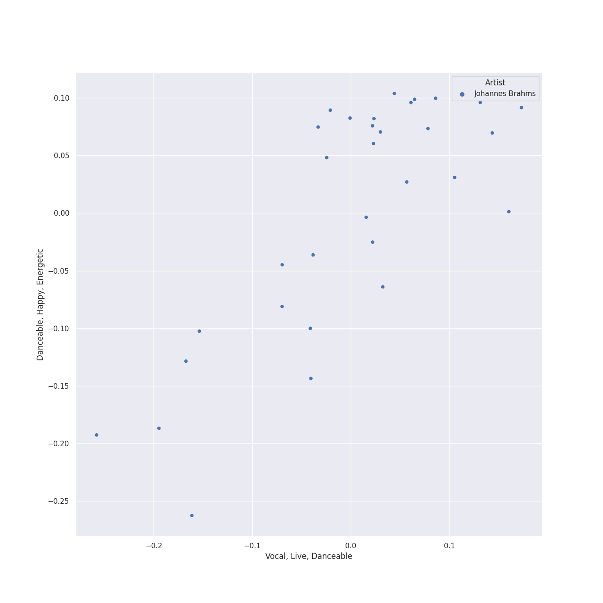
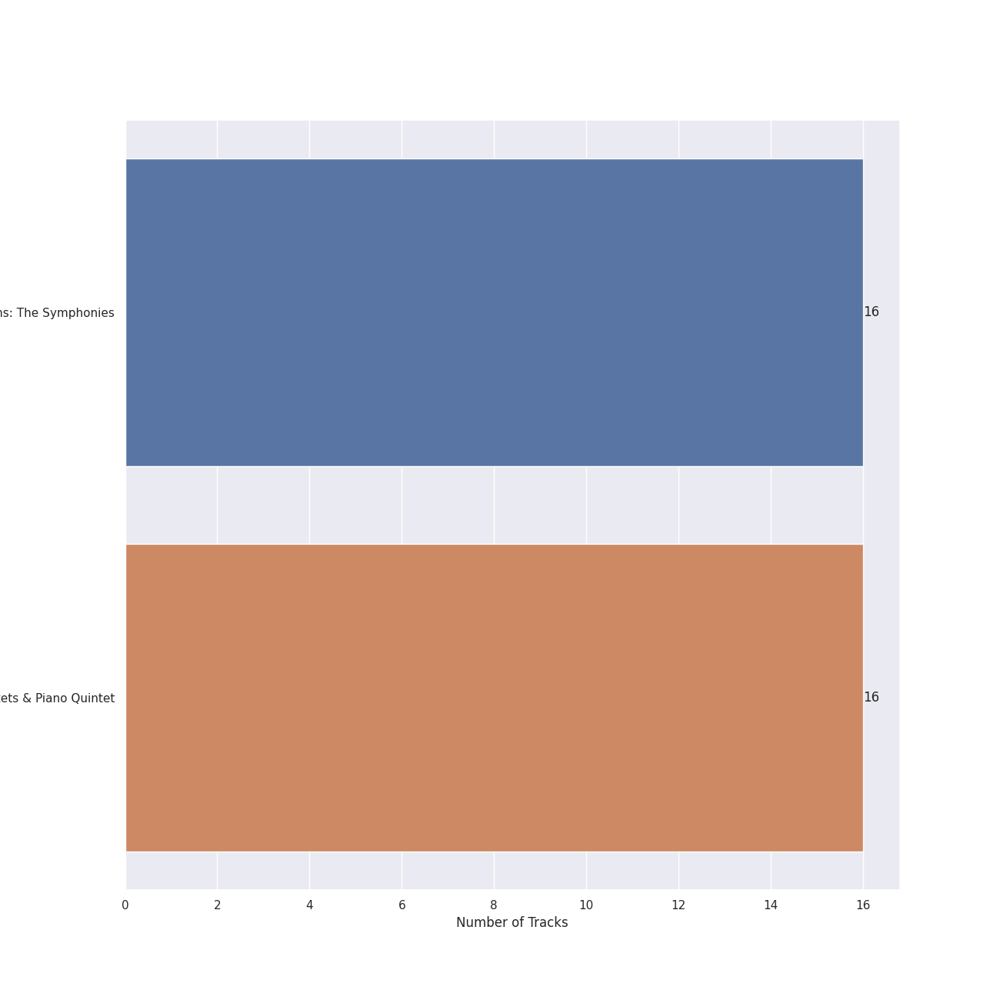
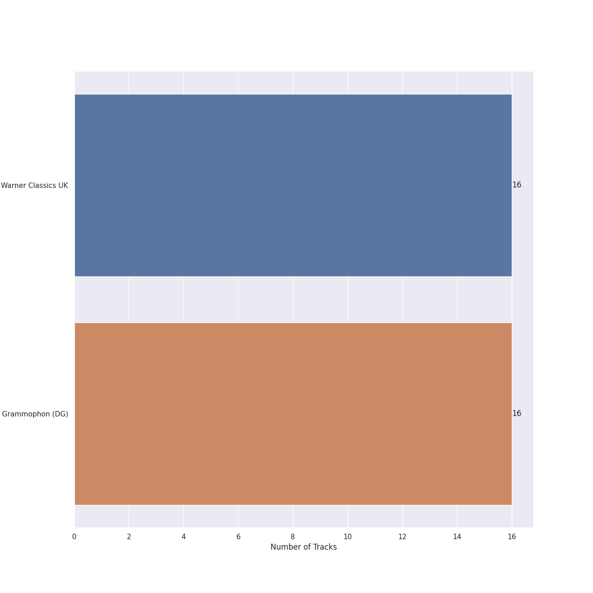

# Brahms

[32 songs](tracks.md)

## Top Artists

See all 5 artists

|   Number of Tracks | Art                                                                                              | Artist                                                              | 🔗                                                           |
|-------------------:|:-------------------------------------------------------------------------------------------------|:--------------------------------------------------------------------|:------------------------------------------------------------|
|                 32 |  | [Johannes Brahms](../../artists/johannes_brahms.md)                 | [🔗](https://open.spotify.com/artist/5wTAi7QkpP6kp8a54lmTOq) |
|                 16 |  | [Berliner Philharmoniker](../../artists/berliner_philharmoniker.md) | [🔗](https://open.spotify.com/artist/6uRJnvQ3f8whVnmeoecv5Z) |
|                 16 |  | [Emerson String Quartet](../../artists/emerson_string_quartet.md)   | [🔗](https://open.spotify.com/artist/4IBl8k6ZsBagsI5zRjyXH7) |
|                 16 |  | [Sir Simon Rattle](../../artists/sir_simon_rattle.md)               | [🔗](https://open.spotify.com/artist/4GQwgdcDQwqtcHICjUNndp) |
|                  4 |  | Leon Fleisher                                                       | [🔗](https://open.spotify.com/artist/6ncNdxBc8zVWMOF7nJ5Pgy) |

## Top Albums

See all 2 albums

|   Number of Tracks | Art                                                                                              | Album                                   | 🔗                                                          |
|-------------------:|:-------------------------------------------------------------------------------------------------|:----------------------------------------|:-----------------------------------------------------------|
|                 16 |  | Brahms: The Symphonies                  | [🔗](https://open.spotify.com/album/2dL2qDsg6teV1cueLxCRa1) |
|                 16 |  | Brahms: String Quartets & Piano Quintet | [🔗](https://open.spotify.com/album/5nZ5ePGoQZGt1MbGphwqph) |

## Top Record Labels

See all 2 labels

|   Number of Tracks | Label                                                                |
|-------------------:|:---------------------------------------------------------------------|
|                 16 | [Warner Classics UK](../../labels/warner_classics_uk.md)             |
|                 16 | [Deutsche Grammophon (DG)](../../labels/deutsche_grammophon__dg_.md) |

## Genres

See all 3 genres

|   Number of Tracks | Genre                                                    |
|-------------------:|:---------------------------------------------------------|
|                 32 | [late romantic era](../../genres/late_romantic_era.md)   |
|                 32 | [german romanticism](../../genres/german_romanticism.md) |
|                 32 | [classical](../../genres/classical.md)                   |

## Audio Features

| 10 most Danceable tracks                                                                       | 10 least Danceable tracks                                                     |
|:-----------------------------------------------------------------------------------------------|:------------------------------------------------------------------------------|
| Piano Quintet in F minor, Op. 34: 3. Scherzo (Allegro)                                         | Brahms: Symphony No. 4 in E Minor, Op. 98: I. Allegro non troppo              |
| String Quartet No. 2 In A Minor, Op. 51 No. 2: 3. Quasi minuetto, moderato - Allegretto vivace | String Quartet No. 2 In A Minor, Op. 51 No. 2: 2. Andante moderato            |
| String Quartet No. 3 In B Flat, Op. 67: 1. Vivace                                              | Brahms: Symphony No. 3 in F Major, Op. 90: IV. Allegro                        |
| String Quartet No. 2 In A Minor, Op. 51 No. 2: 4. Finale (Allegro non assai - Più vivace)      | Brahms: Symphony No. 3 in F Major, Op. 90: I. Allegro con brio                |
| String Quartet No. 1 In C Minor, Op. 51 No. 1: 4. Allegro - 2007 Recording                     | Brahms: Symphony No. 3 in F Major, Op. 90: II. Andante                        |
| String Quartet No. 1 In C Minor, Op. 51 No. 1: 1. Allegro - 2007 Recording                     | Brahms: Symphony No. 4 in E Minor, Op. 98: II. Andante moderato               |
| Brahms: Symphony No. 4 in E Minor, Op. 98: III. Allegro giocoso                                | Brahms: Symphony No. 1 in C Minor, Op. 68: III. Un poco allegretto e grazioso |
| Piano Quintet in F minor, Op. 34: 1. Allegro non troppo                                        | Brahms: Symphony No. 3 in F Major, Op. 90: III. Poco allegretto               |
| Piano Quintet in F minor, Op. 34: 4. Finale (poco sostenuto - Allegro non troppo)              | Brahms: Symphony No. 1 in C Minor, Op. 68: II. Andante sostenuto              |
| String Quartet No. 3 In B Flat, Op. 67: 4. Poco allegretto con variazioni - Doppio movimento   | Brahms: Symphony No. 2 in D Major, Op. 73: II. Adagio non troppo              |

| 10 most Energetic tracks                                                     | 10 least Energetic tracks                                                                                                   |
|:-----------------------------------------------------------------------------|:----------------------------------------------------------------------------------------------------------------------------|
| Brahms: Symphony No. 2 in D Major, Op. 73: IV. Allegro con spirito           | Piano Quintet in F minor, Op. 34: 1. Allegro non troppo                                                                     |
| Brahms: Symphony No. 4 in E Minor, Op. 98: III. Allegro giocoso              | Brahms: Symphony No. 4 in E Minor, Op. 98: II. Andante moderato                                                             |
| Brahms: Symphony No. 1 in C Minor, Op. 68: IV. Finale. Adagio                | String Quartet No. 3 In B Flat, Op. 67: 2. Andante                                                                          |
| Piano Quintet in F minor, Op. 34: 3. Scherzo (Allegro)                       | String Quartet No. 2 In A Minor, Op. 51 No. 2: 3. Quasi minuetto, moderato - Allegretto vivace                              |
| Brahms: Symphony No. 4 in E Minor, Op. 98: IV. Allegro energico e passionato | String Quartet No. 2 In A Minor, Op. 51 No. 2: 2. Andante moderato                                                          |
| String Quartet No. 1 In C Minor, Op. 51 No. 1: 4. Allegro - 2007 Recording   | String Quartet No. 1 In C Minor, Op. 51 No. 1: 3. Allegretto molto moderato e comodo - Un poco più animato - 2007 Recording |
| Brahms: Symphony No. 4 in E Minor, Op. 98: I. Allegro non troppo             | Brahms: Symphony No. 3 in F Major, Op. 90: III. Poco allegretto                                                             |
| Brahms: Symphony No. 3 in F Major, Op. 90: IV. Allegro                       | Brahms: Symphony No. 3 in F Major, Op. 90: II. Andante                                                                      |
| String Quartet No. 1 In C Minor, Op. 51 No. 1: 1. Allegro - 2007 Recording   | String Quartet No. 1 In C Minor, Op. 51 No. 1: 2. Romanze (Poco adagio) - 2007 Recording                                    |
| Brahms: Symphony No. 1 in C Minor, Op. 68: I. Un poco sostenuto - Allegro    | Piano Quintet in F minor, Op. 34: 2. Andante, un poco adagio                                                                |

| 10 most Speechy tracks                                                                                                      | 10 least Speechy tracks                                                      |
|:----------------------------------------------------------------------------------------------------------------------------|:-----------------------------------------------------------------------------|
| String Quartet No. 1 In C Minor, Op. 51 No. 1: 3. Allegretto molto moderato e comodo - Un poco più animato - 2007 Recording | Brahms: Symphony No. 4 in E Minor, Op. 98: II. Andante moderato              |
| String Quartet No. 3 In B Flat, Op. 67: 2. Andante                                                                          | Brahms: Symphony No. 2 in D Major, Op. 73: I. Allegro non troppo             |
| String Quartet No. 2 In A Minor, Op. 51 No. 2: 4. Finale (Allegro non assai - Più vivace)                                   | Brahms: Symphony No. 3 in F Major, Op. 90: III. Poco allegretto              |
| String Quartet No. 2 In A Minor, Op. 51 No. 2: 3. Quasi minuetto, moderato - Allegretto vivace                              | Brahms: Symphony No. 4 in E Minor, Op. 98: IV. Allegro energico e passionato |
| String Quartet No. 2 In A Minor, Op. 51 No. 2: 1. Allegro non troppo                                                        | Brahms: Symphony No. 3 in F Major, Op. 90: IV. Allegro                       |
| String Quartet No. 1 In C Minor, Op. 51 No. 1: 1. Allegro - 2007 Recording                                                  | Brahms: Symphony No. 4 in E Minor, Op. 98: I. Allegro non troppo             |
| String Quartet No. 2 In A Minor, Op. 51 No. 2: 2. Andante moderato                                                          | Brahms: Symphony No. 3 in F Major, Op. 90: I. Allegro con brio               |
| String Quartet No. 3 In B Flat, Op. 67: 1. Vivace                                                                           | Brahms: Symphony No. 1 in C Minor, Op. 68: IV. Finale. Adagio                |
| Piano Quintet in F minor, Op. 34: 3. Scherzo (Allegro)                                                                      | Brahms: Symphony No. 1 in C Minor, Op. 68: I. Un poco sostenuto - Allegro    |
| Brahms: Symphony No. 1 in C Minor, Op. 68: II. Andante sostenuto                                                            | Brahms: Symphony No. 2 in D Major, Op. 73: IV. Allegro con spirito           |

| 10 most Acoustic tracks                                                              | 10 least Acoustic tracks                                                                     |
|:-------------------------------------------------------------------------------------|:---------------------------------------------------------------------------------------------|
| Brahms: Symphony No. 3 in F Major, Op. 90: III. Poco allegretto                      | String Quartet No. 3 In B Flat, Op. 67: 3. Agitato (Allegretto non troppo)                   |
| Brahms: Symphony No. 3 in F Major, Op. 90: II. Andante                               | String Quartet No. 2 In A Minor, Op. 51 No. 2: 1. Allegro non troppo                         |
| Brahms: Symphony No. 2 in D Major, Op. 73: III. Allegretto grazioso. Quasi andantino | String Quartet No. 2 In A Minor, Op. 51 No. 2: 2. Andante moderato                           |
| Brahms: Symphony No. 4 in E Minor, Op. 98: II. Andante moderato                      | String Quartet No. 1 In C Minor, Op. 51 No. 1: 1. Allegro - 2007 Recording                   |
| Brahms: Symphony No. 3 in F Major, Op. 90: I. Allegro con brio                       | String Quartet No. 1 In C Minor, Op. 51 No. 1: 4. Allegro - 2007 Recording                   |
| Brahms: Symphony No. 4 in E Minor, Op. 98: IV. Allegro energico e passionato         | String Quartet No. 3 In B Flat, Op. 67: 1. Vivace                                            |
| Brahms: Symphony No. 3 in F Major, Op. 90: IV. Allegro                               | Piano Quintet in F minor, Op. 34: 3. Scherzo (Allegro)                                       |
| Brahms: Symphony No. 4 in E Minor, Op. 98: I. Allegro non troppo                     | String Quartet No. 2 In A Minor, Op. 51 No. 2: 4. Finale (Allegro non assai - Più vivace)    |
| Brahms: Symphony No. 1 in C Minor, Op. 68: III. Un poco allegretto e grazioso        | String Quartet No. 3 In B Flat, Op. 67: 4. Poco allegretto con variazioni - Doppio movimento |
| Brahms: Symphony No. 2 in D Major, Op. 73: I. Allegro non troppo                     | String Quartet No. 3 In B Flat, Op. 67: 2. Andante                                           |

| 10 most Instrumental tracks                                                   | 10 least Instrumental tracks                                                                                                |
|:------------------------------------------------------------------------------|:----------------------------------------------------------------------------------------------------------------------------|
| Brahms: Symphony No. 1 in C Minor, Op. 68: III. Un poco allegretto e grazioso | String Quartet No. 2 In A Minor, Op. 51 No. 2: 1. Allegro non troppo                                                        |
| Brahms: Symphony No. 3 in F Major, Op. 90: II. Andante                        | String Quartet No. 2 In A Minor, Op. 51 No. 2: 2. Andante moderato                                                          |
| Brahms: Symphony No. 1 in C Minor, Op. 68: IV. Finale. Adagio                 | String Quartet No. 3 In B Flat, Op. 67: 4. Poco allegretto con variazioni - Doppio movimento                                |
| Brahms: Symphony No. 2 in D Major, Op. 73: IV. Allegro con spirito            | Piano Quintet in F minor, Op. 34: 1. Allegro non troppo                                                                     |
| Brahms: Symphony No. 4 in E Minor, Op. 98: I. Allegro non troppo              | Piano Quintet in F minor, Op. 34: 2. Andante, un poco adagio                                                                |
| Brahms: Symphony No. 3 in F Major, Op. 90: IV. Allegro                        | String Quartet No. 2 In A Minor, Op. 51 No. 2: 4. Finale (Allegro non assai - Più vivace)                                   |
| Brahms: Symphony No. 4 in E Minor, Op. 98: II. Andante moderato               | String Quartet No. 1 In C Minor, Op. 51 No. 1: 3. Allegretto molto moderato e comodo - Un poco più animato - 2007 Recording |
| Brahms: Symphony No. 3 in F Major, Op. 90: I. Allegro con brio                | String Quartet No. 3 In B Flat, Op. 67: 3. Agitato (Allegretto non troppo)                                                  |
| Brahms: Symphony No. 4 in E Minor, Op. 98: IV. Allegro energico e passionato  | String Quartet No. 1 In C Minor, Op. 51 No. 1: 2. Romanze (Poco adagio) - 2007 Recording                                    |
| Brahms: Symphony No. 1 in C Minor, Op. 68: I. Un poco sostenuto - Allegro     | String Quartet No. 1 In C Minor, Op. 51 No. 1: 4. Allegro - 2007 Recording                                                  |

| 10 most Live tracks                                                                                                         | 10 least Live tracks                                                                           |
|:----------------------------------------------------------------------------------------------------------------------------|:-----------------------------------------------------------------------------------------------|
| String Quartet No. 3 In B Flat, Op. 67: 3. Agitato (Allegretto non troppo)                                                  | String Quartet No. 2 In A Minor, Op. 51 No. 2: 3. Quasi minuetto, moderato - Allegretto vivace |
| String Quartet No. 1 In C Minor, Op. 51 No. 1: 3. Allegretto molto moderato e comodo - Un poco più animato - 2007 Recording | Piano Quintet in F minor, Op. 34: 3. Scherzo (Allegro)                                         |
| String Quartet No. 1 In C Minor, Op. 51 No. 1: 4. Allegro - 2007 Recording                                                  | Brahms: Symphony No. 3 in F Major, Op. 90: IV. Allegro                                         |
| Brahms: Symphony No. 4 in E Minor, Op. 98: I. Allegro non troppo                                                            | String Quartet No. 3 In B Flat, Op. 67: 2. Andante                                             |
| Brahms: Symphony No. 1 in C Minor, Op. 68: III. Un poco allegretto e grazioso                                               | String Quartet No. 3 In B Flat, Op. 67: 1. Vivace                                              |
| Brahms: Symphony No. 3 in F Major, Op. 90: II. Andante                                                                      | Brahms: Symphony No. 4 in E Minor, Op. 98: IV. Allegro energico e passionato                   |
| String Quartet No. 3 In B Flat, Op. 67: 4. Poco allegretto con variazioni - Doppio movimento                                | Brahms: Symphony No. 3 in F Major, Op. 90: I. Allegro con brio                                 |
| Brahms: Symphony No. 4 in E Minor, Op. 98: III. Allegro giocoso                                                             | Brahms: Symphony No. 4 in E Minor, Op. 98: II. Andante moderato                                |
| String Quartet No. 1 In C Minor, Op. 51 No. 1: 2. Romanze (Poco adagio) - 2007 Recording                                    | Piano Quintet in F minor, Op. 34: 4. Finale (poco sostenuto - Allegro non troppo)              |
| Piano Quintet in F minor, Op. 34: 1. Allegro non troppo                                                                     | String Quartet No. 2 In A Minor, Op. 51 No. 2: 4. Finale (Allegro non assai - Più vivace)      |

| 10 most Happy tracks                                                                                                        | 10 least Happy tracks                                                        |
|:----------------------------------------------------------------------------------------------------------------------------|:-----------------------------------------------------------------------------|
| Piano Quintet in F minor, Op. 34: 3. Scherzo (Allegro)                                                                      | Brahms: Symphony No. 1 in C Minor, Op. 68: I. Un poco sostenuto - Allegro    |
| String Quartet No. 2 In A Minor, Op. 51 No. 2: 4. Finale (Allegro non assai - Più vivace)                                   | Brahms: Symphony No. 3 in F Major, Op. 90: IV. Allegro                       |
| Brahms: Symphony No. 4 in E Minor, Op. 98: III. Allegro giocoso                                                             | Brahms: Symphony No. 4 in E Minor, Op. 98: IV. Allegro energico e passionato |
| String Quartet No. 3 In B Flat, Op. 67: 1. Vivace                                                                           | Brahms: Symphony No. 3 in F Major, Op. 90: III. Poco allegretto              |
| String Quartet No. 1 In C Minor, Op. 51 No. 1: 4. Allegro - 2007 Recording                                                  | Brahms: Symphony No. 3 in F Major, Op. 90: I. Allegro con brio               |
| Brahms: Symphony No. 2 in D Major, Op. 73: IV. Allegro con spirito                                                          | Brahms: Symphony No. 2 in D Major, Op. 73: I. Allegro non troppo             |
| String Quartet No. 3 In B Flat, Op. 67: 4. Poco allegretto con variazioni - Doppio movimento                                | Brahms: Symphony No. 4 in E Minor, Op. 98: II. Andante moderato              |
| Brahms: Symphony No. 2 in D Major, Op. 73: III. Allegretto grazioso. Quasi andantino                                        | Brahms: Symphony No. 1 in C Minor, Op. 68: II. Andante sostenuto             |
| String Quartet No. 1 In C Minor, Op. 51 No. 1: 3. Allegretto molto moderato e comodo - Un poco più animato - 2007 Recording | Brahms: Symphony No. 2 in D Major, Op. 73: II. Adagio non troppo             |
| Brahms: Symphony No. 1 in C Minor, Op. 68: III. Un poco allegretto e grazioso                                               | Brahms: Symphony No. 3 in F Major, Op. 90: II. Andante                       |
