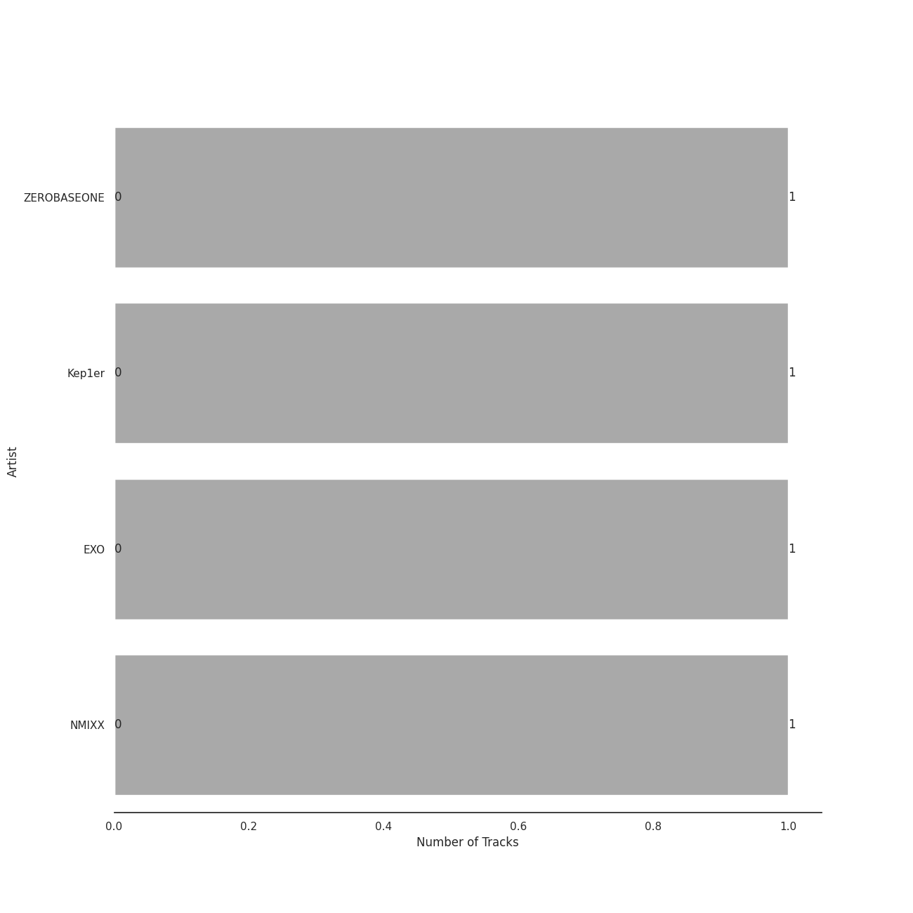
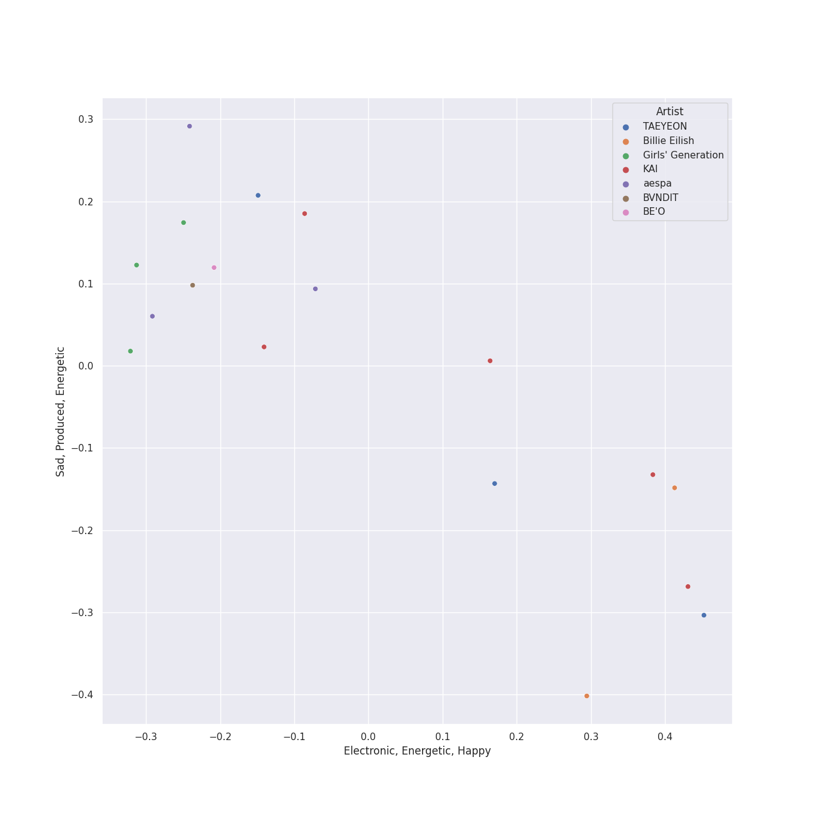
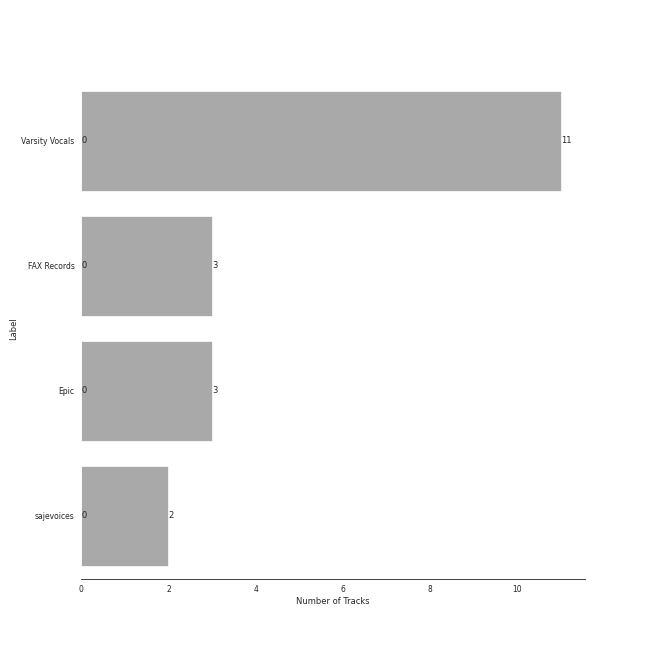
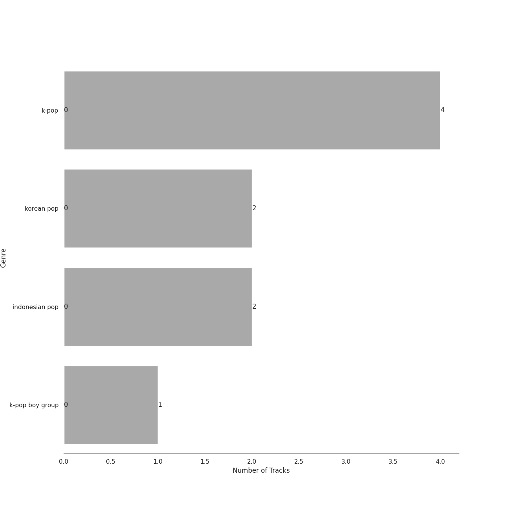
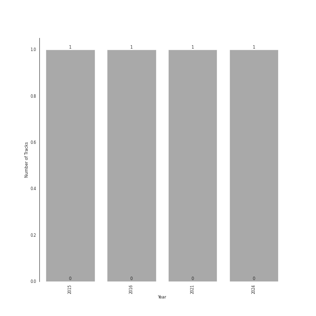

# Check Out Later

[12 songs (0 liked)](tracks.md)

[See Audio Features](audio_features.md)

## Top Artists

| Art | Tracks | 💚 | Artist | 🔗 |
|:---|---:|---:|:---|:---|
|  | 2 | 0 | Alessia Cara | [🔗](https://open.spotify.com/artist/2wUjUUtkb5lvLKcGKsKqsR) |
|  | 1 | 0 | [Ariana Grande](../../artists/ariana_grande/overview.md) | [🔗](https://open.spotify.com/artist/66CXWjxzNUsdJxJ2JdwvnR) |
|  | 1 | 0 | Victoria Monét | [🔗](https://open.spotify.com/artist/63XBtGSEZINSyXylZxEUbv) |
|  | 1 | 0 | EyeLoveBrandon | [🔗](https://open.spotify.com/artist/5nlf0Hcw7PI00zee655ZYX) |
|  | 1 | 0 | Lauv | [🔗](https://open.spotify.com/artist/5JZ7CnR6gTvEMKX4g70Amv) |
|  | 1 | 0 | GSoul | [🔗](https://open.spotify.com/artist/4oEXworvhegyK83rZwVyWL) |
|  | 1 | 0 | EPEX | [🔗](https://open.spotify.com/artist/4e2umhzNHTSeQnSCWPN0uT) |
|  | 1 | 0 | Sam Smith | [🔗](https://open.spotify.com/artist/2wY79sveU1sp5g7SokKOiI) |
|  | 1 | 0 | The Volunteers | [🔗](https://open.spotify.com/artist/2jLHrOkh1M5rLJgnrgfQf1) |
|  | 1 | 0 | Tori Kelly | [🔗](https://open.spotify.com/artist/1vSN1fsvrzpbttOYGsliDr) |

See all 13 artists

| Art | Tracks | 💚 | Artist | 🔗 |
|:---|---:|---:|:---|:---|
|  | 1 | 0 | Yebba | [🔗](https://open.spotify.com/artist/1ooV8YZC1KbpEcrmI8WH0F) |
|  | 1 | 0 | Sting | [🔗](https://open.spotify.com/artist/0Ty63ceoRnnJKVEYP0VQpk) |
|  | 1 | 0 | Sarah Kang | [🔗](https://open.spotify.com/artist/0MBNzfGHTiPYag4DupDXUj) |

## Top Albums

| Art | Tracks | 💚 | Album | Release Date | 🔗 |
|:---|---:|---:|:---|:---|:---|
|  | 1 | 0 | This Summer | 2019-09-06 | [🔗](https://open.spotify.com/album/24riCP5KVIEEaXKYvvhshe) |
|  | 1 | 0 | The Volunteers | 2021-05-27 | [🔗](https://open.spotify.com/album/0hwXFwuvVfZwn6asTargTD) |
|  | 1 | 0 | Superhero | 2018-08-30 | [🔗](https://open.spotify.com/album/1Xf5RZ7zQjF2WEkk7KpZVi) |
|  | 1 | 0 | Summer Is for Falling in Love | 2020-07-31 | [🔗](https://open.spotify.com/album/1P5LIeSXzyMqjWjNtB2wG0) |
|  | 1 | 0 | October Sky | 2021-06-11 | [🔗](https://open.spotify.com/album/6w7gENsq0E5THRxQZkA1D0) |
|  | 1 | 0 | Natural | 2021-12-02 | [🔗](https://open.spotify.com/album/2yOqQbBoXX0nNPBqts1dmZ) |
|  | 1 | 0 | Love Goes | 2020-10-30 | [🔗](https://open.spotify.com/album/5XCBX16KNYsAe7V5hQV9mC) |
|  | 1 | 0 | In The Meantime | 2021-09-24 | [🔗](https://open.spotify.com/album/5reEg9or7xqpXy6XLVIoTE) |
|  | 1 | 0 | Handmade Songs By Tori Kelly | 2012 | [🔗](https://open.spotify.com/album/0cKsaZeZ7zxJWmP8haVHuf) |
|  | 1 | 0 | EPEX 5th EP Album Prelude of Love Chapter 2. 'Growing Pains' | 2023-04-26 | [🔗](https://open.spotify.com/album/7c4HuyVRABrlh7eOdhozwd) |

See all 12 albums

| Art | Tracks | 💚 | Album | Release Date | 🔗 |
|:---|---:|---:|:---|:---|:---|
|  | 1 | 0 | Charlie's Angels (Original Motion Picture Soundtrack) | 2019-11-01 | [🔗](https://open.spotify.com/album/4NBuascXb3uK0mFUYuJ63f) |
|  | 1 | 0 | ...Nothing Like The Sun | 1987-01-01 | [🔗](https://open.spotify.com/album/3mVCQqgwEvwD7lHy9KHi7R) |

## Top Record Labels

| Tracks | 💚 | Label |
|---:|---:|:---|
| 1 | 0 | [WM Korea](../../labels/wm_korea/overview.md) |
| 1 | 0 | Toraay Records |
| 1 | 0 | Silver Cloud |
| 1 | 0 | Sarah Kang |
| 1 | 0 | [RCA Records Label](../../labels/rca_records_label/overview.md) |
| 1 | 0 | Lauv |
| 1 | 0 | EP Entertainment |
| 1 | 0 | [Def Jam Recordings](../../labels/def_jam_recordings/overview.md) |
| 1 | 0 | Def Jam |
| 1 | 0 | Charlie's Angels |

See all 14 labels

| Tracks | 💚 | Label |
|---:|---:|:---|
| 1 | 0 | [Capitol Records](../../labels/capitol_records/overview.md) |
| 1 | 0 | C9 Entertainment |
| 1 | 0 | Blue Vinyl |
| 1 | 0 | A&M |

## Genres

| Tracks | 💚 | Genre |
|---:|---:|:---|
| 6 | 0 | [pop](../../genres/pop/overview.md) |
| 2 | 0 | canadian pop |
| 2 | 0 | canadian contemporary r&b |
| 1 | 0 | uk pop |
| 1 | 0 | sophisti-pop |
| 1 | 0 | [soft rock](../../genres/soft_rock/overview.md) |
| 1 | 0 | [post-teen pop](../../genres/post_teen_pop/overview.md) |
| 1 | 0 | pop soul |
| 1 | 0 | [permanent wave](../../genres/permanent_wave/overview.md) |
| 1 | 0 | [korean r&b](../../genres/korean_r_b/overview.md) |

## Years

| ​ | 10 newest albums | ​​ | 10 oldest albums |
|:---|:---|:---|:---|
|  | EPEX 5th EP Album Prelude of Love Chapter 2. 'Growing Pains' (2023-04-26) |  | ...Nothing Like The Sun (1987-01-01) |
|  | Natural (2021-12-02) |  | Handmade Songs By Tori Kelly (2012) |
|  | In The Meantime (2021-09-24) |  | Superhero (2018-08-30) |
|  | October Sky (2021-06-11) |  | This Summer (2019-09-06) |
|  | The Volunteers (2021-05-27) |  | Charlie's Angels (Original Motion Picture Soundtrack) (2019-11-01) |
|  | Love Goes (2020-10-30) |  | Summer Is for Falling in Love (2020-07-31) |
|  | Summer Is for Falling in Love (2020-07-31) |  | Love Goes (2020-10-30) |
|  | Charlie's Angels (Original Motion Picture Soundtrack) (2019-11-01) |  | The Volunteers (2021-05-27) |
|  | This Summer (2019-09-06) |  | October Sky (2021-06-11) |
|  | Superhero (2018-08-30) |  | In The Meantime (2021-09-24) |