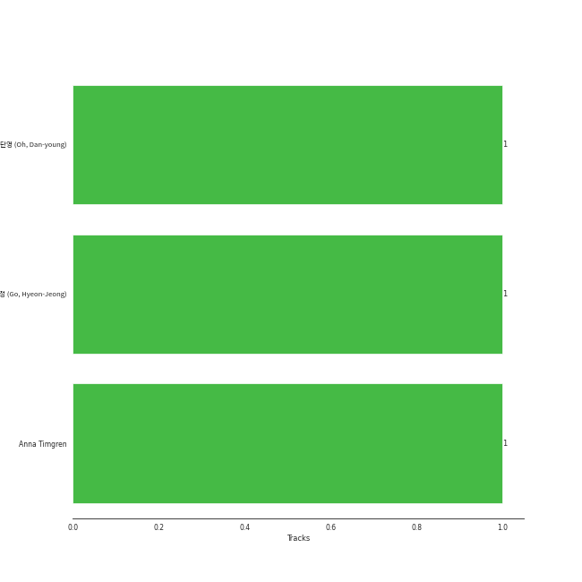

# Check Out Later

[6 tracks (1 liked) 🔗](https://open.spotify.com/playlist/2FgMW8NMJOZgvHtvDOWBCe)

## Top Artists

| Art | Rank | Tracks | 💚 | Artist | 🔗 |
|:---|---:|---:|---:|:---|:---|
|  | 22 | 1 | 1 | [Billlie](../../artists/billlie/overview.md) | [🔗](https://open.spotify.com/artist/2GQxKDojobwBjZMPf7aoh0) |
|  | 215 | 1 | 0 | PinkFantasy | [🔗](https://open.spotify.com/artist/5syu5kN4a5f4rgMCRGlnZp) |
|  | 430 | 1 | 0 | GWSN | [🔗](https://open.spotify.com/artist/5fI4xffqGRGQvICSlJreMF) |
|  | 29 | 1 | 0 | [Dreamcatcher](../../artists/dreamcatcher/overview.md) | [🔗](https://open.spotify.com/artist/5V1qsQHdXNm4ZEZHWvFnqQ) |
|  | 430 | 1 | 0 | Lovelyz | [🔗](https://open.spotify.com/artist/3g34PW5oNmDBxMVUTzx2XK) |
|  | 430 | 1 | 0 | DreamNote | [🔗](https://open.spotify.com/artist/3ILvL0HM0cST4iR8RzQh2V) |

## Top Tracks

Most and least listened tracks

| Rank | ​ | Most listened tracks | Rank | ​​ | Least listened tracks |
|---:|:---|:---|---:|:---|:---|
| 705 |  | [everybody's got a $ECRET](../../artists/billlie/overview.md) | 974 |  | GHOST |
| 974 |  | [Chase Me](../../artists/dreamcatcher/overview.md) | 974 |  | I Can't Breathe |
| 974 |  | Tales of the Unusual - Feedback Version | 974 |  | Obliviate |
| 974 |  | Obliviate | 974 |  | Tales of the Unusual - Feedback Version |
| 974 |  | I Can't Breathe | 974 |  | [Chase Me](../../artists/dreamcatcher/overview.md) |
| 974 |  | GHOST | 705 |  | [everybody's got a $ECRET](../../artists/billlie/overview.md) |

## Top Albums

| Art | Rank | Tracks | 💚 | Album | Release Date | 🔗 |
|:---|---:|---:|---:|:---|:---|:---|
|  | 75 | 1 | 1 | the Billage of perception : chapter one | 2021-11-10 | [🔗](https://open.spotify.com/album/1kp4txZsSpDNR4EoDFi2LD) |
|  | 643 | 1 | 0 | 악몽 | 2017-01-13 | [🔗](https://open.spotify.com/album/0H35i31IzpWMrLXSV6h2YN) |
|  | 643 | 1 | 0 | Tales of the Unusual | 2022-04-08 | [🔗](https://open.spotify.com/album/3xvUAslKb1sSJBf0gmszPc) |
|  | 643 | 1 | 0 | THE OTHER SIDE OF THE MOON | 2021-05-26 | [🔗](https://open.spotify.com/album/4W9vkO9c1K2oVvLTNsjWv7) |
|  | 643 | 1 | 0 | Lovelyz 7th Mini Album [Unforgettable] | 2020-09-01 | [🔗](https://open.spotify.com/album/5M1EFepUUqZig7XzN6qtB8) |
|  | 643 | 1 | 0 | Dreams Alive | 2021-10-26 | [🔗](https://open.spotify.com/album/6y4hTtarOLzcNanux6QfNX) |

## Top Record Labels

| Tracks | 💚 | Label |
|---:|---:|:---|
| 1 | 1 | [MYSTIC STORY](../../labels/mystic_story/overview.md) |
| 1 | 0 | 마이돌엔터테인먼트 |
| 1 | 0 | iMe KOREA |
| 1 | 0 | Woollim Entertainment |
| 1 | 0 | The WAVE MUSIC |
| 1 | 0 | [DREAMCATCHER COMPANY](../../labels/dreamcatcher_company/overview.md) |

## Genres

| Tracks | 💚 | Genre |
|---:|---:|:---|
| 4 | 1 | [k-pop](../../genres/k-pop/overview.md) |
| 1 | 1 | [5th gen k-pop](../../genres/5th_gen_k-pop/overview.md) |
| 4 | 0 | [k-pop girl group](../../genres/k-pop_girl_group/overview.md) |

## Top Producers

| Art | Producer | Tracks | Credit Types |
|:---|:---|---:|:---|
| | 오단영 (Oh, Dan-young) | 1 | Producer |
| | Anna Timgren | 1 | Songwriter |
| | 고현정 (Go, Hyeon-Jeong) | 1 | Producer |

## Years

| ​ | 10 newest albums | ​​ | 10 oldest albums |
|:---|:---|:---|:---|
|  | Tales of the Unusual (2022-04-08) |  | 악몽 (2017-01-13) |
|  | the Billage of perception : chapter one (2021-11-10) |  | Lovelyz 7th Mini Album [Unforgettable] (2020-09-01) |
|  | Dreams Alive (2021-10-26) |  | THE OTHER SIDE OF THE MOON (2021-05-26) |
|  | THE OTHER SIDE OF THE MOON (2021-05-26) |  | Dreams Alive (2021-10-26) |
|  | Lovelyz 7th Mini Album [Unforgettable] (2020-09-01) |  | the Billage of perception : chapter one (2021-11-10) |
|  | 악몽 (2017-01-13) |  | Tales of the Unusual (2022-04-08) |