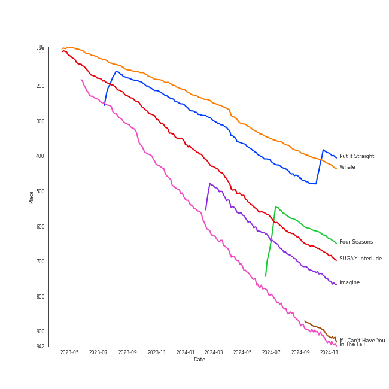

# Tracks in Chill from 2019

## Artists

| Art | Tracks | 💚 | Artist | 🔗 |
|:---|---:|---:|:---|:---|
|  | 2 | 2 | [Sara Bareilles](../../../artists/sara_bareilles/overview.md) | [🔗](https://open.spotify.com/artist/2Sqr0DXoaYABbjBo9HaMkM) |
|  | 2 | 1 | [TAEYEON](../../../artists/taeyeon/overview.md) | [🔗](https://open.spotify.com/artist/3qNVuliS40BLgXGxhdBdqu) |
|  | 1 | 1 | [HWASA](../../../artists/hwasa/overview.md) | [🔗](https://open.spotify.com/artist/7bmYpVgQub656uNTu6qGNQ) |
|  | 1 | 1 | WOOGIE | [🔗](https://open.spotify.com/artist/7C0lSOS41UnTbnF7bMSEWN) |
|  | 1 | 1 | [Billie Eilish](../../../artists/billie_eilish/overview.md) | [🔗](https://open.spotify.com/artist/6qqNVTkY8uBg9cP3Jd7DAH) |
|  | 1 | 1 | H 3 F | [🔗](https://open.spotify.com/artist/6jIK3obS1fJqb3Vu74AYX3) |
|  | 1 | 1 | [AKMU](../../../artists/akmu/overview.md) | [🔗](https://open.spotify.com/artist/6OwKE9Ez6ALxpTaKcT5ayv) |
|  | 1 | 1 | [Ariana Grande](../../../artists/ariana_grande/overview.md) | [🔗](https://open.spotify.com/artist/66CXWjxzNUsdJxJ2JdwvnR) |
|  | 1 | 1 | [The Rose](../../../artists/the_rose/overview.md) | [🔗](https://open.spotify.com/artist/5na1LmEmK2VzNLje9snJYW) |
|  | 1 | 1 | [BAEKHYUN](../../../artists/baekhyun/overview.md) | [🔗](https://open.spotify.com/artist/4ufh0WuMZh6y4Dmdnklvdl) |

View all

| Art | Tracks | 💚 | Artist | 🔗 |
|:---|---:|---:|:---|:---|
|  | 1 | 1 | YUKIKA | [🔗](https://open.spotify.com/artist/4RfI1z9u2xIc5Qnqac4JbO) |
|  | 1 | 1 | 6LACK | [🔗](https://open.spotify.com/artist/4IVAbR2w4JJNJDDRFP3E83) |
|  | 1 | 1 | QUIN | [🔗](https://open.spotify.com/artist/3sHS70DMNgPxRqx2fUNrRA) |
|  | 1 | 1 | [BTS](../../../artists/bts/overview.md) | [🔗](https://open.spotify.com/artist/3Nrfpe0tUJi4K4DXYWgMUX) |
|  | 1 | 1 | [IU](../../../artists/iu/overview.md) | [🔗](https://open.spotify.com/artist/3HqSLMAZ3g3d5poNaI7GOU) |
|  | 1 | 1 | [(G)I-DLE](../../../artists/(g)i-dle/overview.md) | [🔗](https://open.spotify.com/artist/2AfmfGFbe0A0WsTYm0SDTx) |
|  | 1 | 1 | Halsey | [🔗](https://open.spotify.com/artist/26VFTg2z8YR0cCuwLzESi2) |
|  | 1 | 1 | [Red Velvet](../../../artists/red_velvet/overview.md) | [🔗](https://open.spotify.com/artist/1z4g3DjTBBZKhvAroFlhOM) |
|  | 1 | 1 | [Jackson Wang](../../../artists/jackson_wang/overview.md) | [🔗](https://open.spotify.com/artist/1kfWoWgCugPkyxQP8lkRlY) |
|  | 1 | 1 | 88rising | [🔗](https://open.spotify.com/artist/1AhjOkOLkbHUfcHDSErXQs) |
|  | 1 | 1 | SUGA | [🔗](https://open.spotify.com/artist/0ebNdVaOfp6N0oZ1guIxM8) |
|  | 1 | 1 | Stephanie Poetri | [🔗](https://open.spotify.com/artist/0HS00NN7MAfF59aJnfcxSO) |
|  | 1 | 0 | [LeeHi](../../../artists/leehi/overview.md) | [🔗](https://open.spotify.com/artist/7cVZApDoQZpS447nHTsNqu) |
|  | 1 | 0 | Punch | [🔗](https://open.spotify.com/artist/2FgZrgTMX6Sk0VNcOsEPmm) |
|  | 1 | 0 | G.Soul | [🔗](https://open.spotify.com/artist/0fLesFHNsJpalRtqzSYxnd) |
|  | 1 | 0 | Sunwoojunga | [🔗](https://open.spotify.com/artist/04L3elxyr0XFua2Ek3domW) |

## Albums

| Art | Tracks | 💚 | Album | Release Date | 🔗 |
|:---|---:|---:|:---|:---|:---|
|  | 2 | 2 | Amidst the Chaos (Bonus Version) | 2019-05-10 | [🔗](https://open.spotify.com/album/5x2sDapUIdq0qk1ezff3gm) |
|  | 1 | 1 | ‘The ReVe Festival’ Day 2 | 2019-08-20 | [🔗](https://open.spotify.com/album/3DXz6ItR9DzIw9S0h3Cxfc) |
|  | 1 | 1 | thank u, next | 2019-02-08 | [🔗](https://open.spotify.com/album/2fYhqwDWXjbpjaIJPEfKFw) |
|  | 1 | 1 | WHEN WE ALL FALL ASLEEP, WHERE DO WE GO? | 2019-03-29 | [🔗](https://open.spotify.com/album/0S0KGZnfBGSIssfF54WSJh) |
|  | 1 | 1 | SUGA's Interlude | 2019-12-06 | [🔗](https://open.spotify.com/album/0JfaSjTaej3QB27ofjnbQV) |
|  | 1 | 1 | SAILING | 2019-09-25 | [🔗](https://open.spotify.com/album/7C0Ci0alKWwwXPIFYEdVcn) |
|  | 1 | 1 | RED | 2019-08-13 | [🔗](https://open.spotify.com/album/5CrMZwZuJcDpzFmMO35vxN) |
|  | 1 | 1 | NEON | 2019-02-22 | [🔗](https://open.spotify.com/album/2tF9C0qTzRdaZShK4iK0UD) |
|  | 1 | 1 | Love poem | 2019-11-18 | [🔗](https://open.spotify.com/album/2xEH7SRzJq7LgA0fCtTlxH) |
|  | 1 | 1 | LUCID | 2019-11-15 | [🔗](https://open.spotify.com/album/5qQhQ1rmPjqQgv8RmfaQU3) |

View all

| Art | Tracks | 💚 | Album | Release Date | 🔗 |
|:---|---:|---:|:---|:---|:---|
|  | 1 | 1 | I made | 2019-02-26 | [🔗](https://open.spotify.com/album/479xGDGrqMXN8YLmJMEoTG) |
|  | 1 | 1 | Hwa:telier | 2019-10-11 | [🔗](https://open.spotify.com/album/20xEJwUlmfoSLoK5AhEucL) |
|  | 1 | 1 | How Can I | 2019-06-23 | [🔗](https://open.spotify.com/album/3qEib9B2LiOpc81jRYC4Fi) |
|  | 1 | 1 | Head In The Clouds II | 2019-10-11 | [🔗](https://open.spotify.com/album/7bOpX6Ilc9UCFmH9uGyUDy) |
|  | 1 | 1 | Four Seasons | 2019-03-24 | [🔗](https://open.spotify.com/album/3ublKZHu1qjU9ujf9A4zhH) |
|  | 1 | 1 | City Lights - The 1st Mini Album | 2019-07-10 | [🔗](https://open.spotify.com/album/6AeMj5CMeTXRGhmUuv0LH3) |
|  | 1 | 0 | Serenade | 2019-12-12 | [🔗](https://open.spotify.com/album/2McJE8dHLru3MgR1bcxdyF) |
|  | 1 | 0 | Purpose - The 2nd Album | 2019-10-28 | [🔗](https://open.spotify.com/album/0h6wCpdgpSOAbYDDYJVuwr) |
|  | 1 | 0 | Hotel del Luna (Original Television Soundtrack) Pt.12 | 2019-08-18 | [🔗](https://open.spotify.com/album/6iNbnT79OJu9C5j5ZZLQvZ) |
|  | 1 | 0 | 24℃ | 2019-05-30 | [🔗](https://open.spotify.com/album/5u9CP1NknadV33hZepVEy5) |

## Tracks

| Art | Track | Album | Artists | Label | Rank | 💚 | 🔗 |
|:---|:---|:---|:---|:---|---:|:---|:---|
|  | Put It Straight | I made | [(G)I-DLE](../../../artists/(g)i-dle/overview.md) | [CUBE ENTERTAINMENT](../../../labels/cube_entertainment) | 235 | 💚 | [🔗](https://open.spotify.com/track/2G0wbwTsTN0HJeQp3BDc4D) |
|  | SUGA's Interlude | SUGA's Interlude | Halsey, SUGA, [BTS](../../../artists/bts/overview.md) | [Capitol Records](../../../labels/capitol_records) | 335 | 💚 | [🔗](https://open.spotify.com/track/5a0nHa7F4S9hb0Zi0zLS8w) |
|  | imagine | thank u, next | [Ariana Grande](../../../artists/ariana_grande/overview.md) | [Republic Records](../../../labels/republic_records) | 429 | 💚 | [🔗](https://open.spotify.com/track/39LmTF9RgyakzSYX8txrow) |
|  | Whale | SAILING | [AKMU](../../../artists/akmu/overview.md) | [YG Entertainment](../../../labels/yg_entertainment) | 491 | 💚 | [🔗](https://open.spotify.com/track/5OJ275pPDWTd2qWX4kbhXj) |
|  | In The Fall | Hwa:telier | [HWASA](../../../artists/hwasa/overview.md), WOOGIE | [RBW, Inc](../../../labels/rbw_inc_) | 618 | 💚 | [🔗](https://open.spotify.com/track/2esmbUCwduwG8SyN4RAwmM) |
|  | UN Village | City Lights - The 1st Mini Album | [BAEKHYUN](../../../artists/baekhyun/overview.md) | [SM Entertainment](../../../labels/sm_entertainment) | 941 | 💚 | [🔗](https://open.spotify.com/track/0WSTInLqMrT9po0LAHpZCJ) |
|  | NO WAY | 24℃ | [LeeHi](../../../artists/leehi/overview.md), G.Soul | [YG Entertainment](../../../labels/yg_entertainment) | 990 | | [🔗](https://open.spotify.com/track/0jA0TihvVbPHgrIcHbW1Og) |
|  | Gravity | Purpose - The 2nd Album | [TAEYEON](../../../artists/taeyeon/overview.md) | [SM Entertainment](../../../labels/sm_entertainment) | 1193 | | [🔗](https://open.spotify.com/track/1fzLM4SRonzoHm723a2mP5) |
|  | If I Can't Have You | Amidst the Chaos (Bonus Version) | [Sara Bareilles](../../../artists/sara_bareilles/overview.md) | [Epic](../../../labels/epic) | 1667 | 💚 | [🔗](https://open.spotify.com/track/3n5MOB82LKPL14eBEmodTd) |
|  | I Love You 3000 II | Head In The Clouds II | 88rising, Stephanie Poetri, [Jackson Wang](../../../artists/jackson_wang/overview.md) | [88rising Music](../../../labels/88rising_music), [Warner Records](../../../labels/warner_records) | 1710 | 💚 | [🔗](https://open.spotify.com/track/3witRpHWHqArlnt6GTlH2Y) |

View all

| Art | Track | Album | Artists | Label | Rank | 💚 | 🔗 |
|:---|:---|:---|:---|:---|---:|:---|:---|
|  | when the party's over | WHEN WE ALL FALL ASLEEP, WHERE DO WE GO? | [Billie Eilish](../../../artists/billie_eilish/overview.md) | [Darkroom](../../../labels/darkroom), [Interscope Records](../../../labels/interscope_records) | 1732 | 💚 | [🔗](https://open.spotify.com/track/43zdsphuZLzwA9k4DJhU0I) |
|  | Blueming | Love poem | [IU](../../../artists/iu/overview.md) | [Kakao Entertainment](../../../labels/kakao_entertainment) | 1765 | 💚 | [🔗](https://open.spotify.com/track/4Dr2hJ3EnVh2Aaot6fRwDO) |
|  | Eyes Locked, Hands Locked | ‘The ReVe Festival’ Day 2 | [Red Velvet](../../../artists/red_velvet/overview.md) | [SM Entertainment](../../../labels/sm_entertainment) | 1904 | 💚 | [🔗](https://open.spotify.com/track/4o6LdaI3q5QFjs0sziszsD) |
|  | Four Seasons | Four Seasons | [TAEYEON](../../../artists/taeyeon/overview.md) | [SM Entertainment](../../../labels/sm_entertainment) | 1939 | 💚 | [🔗](https://open.spotify.com/track/4ytyLpIwUXbdFsNOvgNnmP) |
|  | Miss Simone | Amidst the Chaos (Bonus Version) | [Sara Bareilles](../../../artists/sara_bareilles/overview.md) | [Epic](../../../labels/epic) | 2040 | 💚 | [🔗](https://open.spotify.com/track/5NePPsk8jsSgEc4GDbzuxX) |
|  | NEON | NEON | YUKIKA | ESTIMATE | 2599 | 💚 | [🔗](https://open.spotify.com/track/5dF22XUGeNAR3GBhMgshgp) |
|  | How Can I | How Can I | H 3 F | H 3 F | 2599 | 💚 | [🔗](https://open.spotify.com/track/3Ka0IJwEvxI3ssqbF48SWZ) |
|  | RED | RED | [The Rose](../../../artists/the_rose/overview.md) | [Genie Music Corporation](../../../labels/genie_music_corporation), [Stone Music Entertainment](../../../labels/stone_music_entertainment) | 2599 | 💚 | [🔗](https://open.spotify.com/track/1JsBcVdlKZJmDPJWu4wJPC) |
|  | Done For Me | Hotel del Luna (Original Television Soundtrack) Pt.12 | Punch | FNC인베스트먼트 | 2599 | | [🔗](https://open.spotify.com/track/0UkELJozOEY77LZRjnkP84) |
|  | Mushroom Chocolate (with 6LACK) | LUCID | QUIN, 6LACK | [Fantasy Soul/Interscope Records](../../../labels/interscope_records) | 2599 | 💚 | [🔗](https://open.spotify.com/track/6DEhBd4RGr8MbSAtSNNtai) |
|  | Run With Me | Serenade | Sunwoojunga | MAGIC STRAWBERRY SOUND | 2599 | | [🔗](https://open.spotify.com/track/1m8b3KFsAiGyjRc90ZfEB9) |

