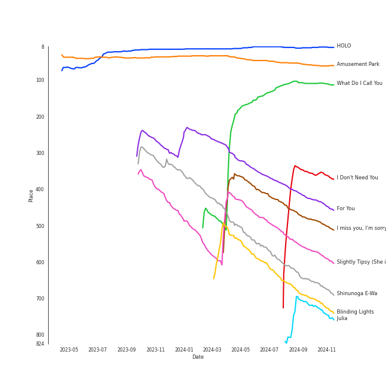

# Tracks in Chill from 2020

## Artists

| Art | Tracks | 💚 | Artist | 🔗 |
|:---|---:|---:|:---|:---|
|  | 4 | 4 | [Taylor Swift](../../../artists/taylor_swift/overview.md) | [🔗](https://open.spotify.com/artist/06HL4z0CvFAxyc27GXpf02) |
|  | 3 | 3 | [TAEYEON](../../../artists/taeyeon/overview.md) | [🔗](https://open.spotify.com/artist/3qNVuliS40BLgXGxhdBdqu) |
|  | 2 | 2 | [LeeHi](../../../artists/leehi/overview.md) | [🔗](https://open.spotify.com/artist/7cVZApDoQZpS447nHTsNqu) |
|  | 2 | 2 | [BLACKPINK](../../../artists/blackpink/overview.md) | [🔗](https://open.spotify.com/artist/41MozSoPIsD1dJM0CLPjZF) |
|  | 1 | 1 | [TWICE](../../../artists/twice/overview.md) | [🔗](https://open.spotify.com/artist/7n2Ycct7Beij7Dj7meI4X0) |
|  | 1 | 1 | Fujii Kaze | [🔗](https://open.spotify.com/artist/6bDWAcdtVR3WHz2xtiIPUi) |
|  | 1 | 1 | [Crush](../../../artists/crush/overview.md) | [🔗](https://open.spotify.com/artist/6aLdhHUqgdKE86xbtNmY8g) |
|  | 1 | 1 | [Ariana Grande](../../../artists/ariana_grande/overview.md) | [🔗](https://open.spotify.com/artist/66CXWjxzNUsdJxJ2JdwvnR) |
|  | 1 | 1 | [ENHYPEN](../../../artists/enhypen/overview.md) | [🔗](https://open.spotify.com/artist/5t5FqBwTcgKTaWmfEbwQY9) |
|  | 1 | 1 | Lauv | [🔗](https://open.spotify.com/artist/5JZ7CnR6gTvEMKX4g70Amv) |

View all

| Art | Tracks | 💚 | Artist | 🔗 |
|:---|---:|---:|:---|:---|
|  | 1 | 1 | [BAEKHYUN](../../../artists/baekhyun/overview.md) | [🔗](https://open.spotify.com/artist/4ufh0WuMZh6y4Dmdnklvdl) |
|  | 1 | 1 | Gracie Abrams | [🔗](https://open.spotify.com/artist/4tuJ0bMpJh08umKkEXKUI5) |
|  | 1 | 1 | [BTS](../../../artists/bts/overview.md) | [🔗](https://open.spotify.com/artist/3Nrfpe0tUJi4K4DXYWgMUX) |
|  | 1 | 1 | Stella Jang | [🔗](https://open.spotify.com/artist/2Y9AUayH5pyZpVfkDYDfJV) |
|  | 1 | 1 | LUNCH | [🔗](https://open.spotify.com/artist/2UVzzx3MOPYV3l6xW2lzBv) |
|  | 1 | 1 | Sandeul | [🔗](https://open.spotify.com/artist/2QeJBmgBdpH4i3uJns5Rdx) |
|  | 1 | 1 | [Justin Bieber](../../../artists/justin_bieber/overview.md) | [🔗](https://open.spotify.com/artist/1uNFoZAHBGtllmzznpCI3s) |
|  | 1 | 1 | MAX | [🔗](https://open.spotify.com/artist/1bqxdqvUtPWZri43cKHac8) |
|  | 1 | 1 | The Weeknd | [🔗](https://open.spotify.com/artist/1Xyo4u8uXC1ZmMpatF05PJ) |
|  | 1 | 1 | Pink Sweat$ | [🔗](https://open.spotify.com/artist/1W7FNibLa0O0b572tB2w7t) |
| | 1 | 1 | CHAN 찬 | [🔗](https://open.spotify.com/artist/0nxWeW71DDYHY26V4LzMz9) |
|  | 1 | 1 | SUGA | [🔗](https://open.spotify.com/artist/0ebNdVaOfp6N0oZ1guIxM8) |
|  | 1 | 1 | Jenevieve | [🔗](https://open.spotify.com/artist/0dUYLC7DLjeS8gIh8cz2Pq) |
|  | 1 | 0 | [HEIZE](../../../artists/heize/overview.md) | [🔗](https://open.spotify.com/artist/5dCvSnVduaFleCnyy98JMo) |
|  | 1 | 0 | ZICO | [🔗](https://open.spotify.com/artist/4XpUIb8uuNlIWVKmgKZXC0) |
|  | 1 | 0 | Sam Smith | [🔗](https://open.spotify.com/artist/2wY79sveU1sp5g7SokKOiI) |
|  | 1 | 0 | Seori | [🔗](https://open.spotify.com/artist/2bWTIIQP9zaVc55RaMGu7e) |
|  | 1 | 0 | [WENDY](../../../artists/wendy/overview.md) | [🔗](https://open.spotify.com/artist/0FRUZvZNPzM3YJMABJxf2K) |

## Albums

| Art | Tracks | 💚 | Album | Release Date | 🔗 |
|:---|---:|---:|:---|:---|:---|
|  | 3 | 3 | folklore | 2020-07-24 | [🔗](https://open.spotify.com/album/2fenSS68JI1h4Fo296JfGr) |
|  | 2 | 2 | What Do I Call You - The 4th Mini Album | 2020-12-15 | [🔗](https://open.spotify.com/album/70XJeDlFe1LmZo1lyFKyq3) |
|  | 2 | 2 | THE ALBUM | 2020-10-02 | [🔗](https://open.spotify.com/album/71O60S5gIJSIAhdnrDIh3N) |
|  | 1 | 1 | ~how i'm feeling~ | 2020-03-06 | [🔗](https://open.spotify.com/album/3ZuE680xhR1A4bCFGvL8mi) |
|  | 1 | 1 | minor | 2020-07-14 | [🔗](https://open.spotify.com/album/2UZw04wDxLVceADw2Gi1Qy) |
|  | 1 | 1 | evermore | 2020-12-11 | [🔗](https://open.spotify.com/album/2Xoteh7uEpea4TohMxjtaq) |
|  | 1 | 1 | The Prelude | 2020-07-17 | [🔗](https://open.spotify.com/album/3Qj2vsFzmaB8jcH6Q60WIG) |
|  | 1 | 1 | Stuck with U | 2020-05-08 | [🔗](https://open.spotify.com/album/5mUdh6YWnUvf0MfklEk1oi) |
|  | 1 | 1 | Slightly Tipsy (She is My Type♡ X SANDEUL) | 2020-07-20 | [🔗](https://open.spotify.com/album/2bal48tjyi26OAxY2KxwFL) |
|  | 1 | 1 | STELLA I | 2020-04-07 | [🔗](https://open.spotify.com/album/1TCX395u7CaSsCLtiwsMAN) |

View all

| Art | Tracks | 💚 | Album | Release Date | 🔗 |
|:---|---:|---:|:---|:---|:---|
|  | 1 | 1 | Meow the secret boy 어서와 (Original Television Soundtrack), Pt.11 | 2020-04-23 | [🔗](https://open.spotify.com/album/0ZqZDky3PSbzKgHJzvSRuJ) |
|  | 1 | 1 | I Don't Need You | 2020-06-07 | [🔗](https://open.spotify.com/album/6W4mS8VsOi2WAkkMuh9SJ9) |
|  | 1 | 1 | Happy | 2020-05-04 | [🔗](https://open.spotify.com/album/1nPB6o7EjGvUORXlnioEPk) |
|  | 1 | 1 | HOLO | 2020-07-23 | [🔗](https://open.spotify.com/album/5xq9sm0jGMMDu5LifpBBo1) |
|  | 1 | 1 | HELP EVER HURT NEVER | 2020-05-20 | [🔗](https://open.spotify.com/album/1OojCidx0eoPKch2M0Kz31) |
|  | 1 | 1 | For You | 2020-12-16 | [🔗](https://open.spotify.com/album/6hiwkmlOoNm8F3UkAZJcEz) |
|  | 1 | 1 | Eyes Wide Open | 2020-10-26 | [🔗](https://open.spotify.com/album/33jypnU7WULxPaVrjj4RXH) |
|  | 1 | 1 | Blueberry Eyes (feat. SUGA of BTS) | 2020-09-15 | [🔗](https://open.spotify.com/album/2dEJHnsuxIij7YeBbt0sVm) |
|  | 1 | 1 | Baby Powder | 2020-03-25 | [🔗](https://open.spotify.com/album/3nqQxvxUB95Bi2UBseY1u1) |
|  | 1 | 1 | BORDER : DAY ONE | 2020-11-30 | [🔗](https://open.spotify.com/album/3YxF7jTnpdNepWbO42f8lH) |
|  | 1 | 1 | BE | 2020-11-20 | [🔗](https://open.spotify.com/album/6nYfHQnvkvOTNHnOhDT3sr) |
|  | 1 | 1 | Amusement Park | 2020-12-21 | [🔗](https://open.spotify.com/album/1azcqabc4kDgRNMWFA02wZ) |
|  | 1 | 1 | After Hours | 2020-03-20 | [🔗](https://open.spotify.com/album/4yP0hdKOZPNshxUOjY0cZj) |
|  | 1 | 0 | The King : Eternal Monarch, Pt. 10 (Original Television Soundtrack) | 2020-05-16 | [🔗](https://open.spotify.com/album/02zl7wdcgbI0URRfMbzmF5) |
|  | 1 | 0 | Lyricist | 2020-06-10 | [🔗](https://open.spotify.com/album/6igUyuDlRCyjoTtPXui6bT) |
|  | 1 | 0 | Love Goes | 2020-10-30 | [🔗](https://open.spotify.com/album/5XCBX16KNYsAe7V5hQV9mC) |
|  | 1 | 0 | ?depacse ohw | 2020-05-12 | [🔗](https://open.spotify.com/album/0srUbfZOMUBwUitQGQeUca) |

## Tracks

| Art | Track | Album | Artists | Label | Rank | 💚 | 🔗 |
|:---|:---|:---|:---|:---|---:|:---|:---|
|  | HOLO | HOLO | [LeeHi](../../../artists/leehi/overview.md) | [Genie Music Corporation](../../../labels/genie_music_corporation), [Stone Music Entertainment](../../../labels/stone_music_entertainment) | 13 | 💚 | [🔗](https://open.spotify.com/track/4BSluGpjdLQihMmKgHXMxp) |
|  | Amusement Park | Amusement Park | [BAEKHYUN](../../../artists/baekhyun/overview.md) | [SM Entertainment](../../../labels/sm_entertainment) | 39 | 💚 | [🔗](https://open.spotify.com/track/1TUkEXQrskATO9SoB4QMUN) |
|  | What Do I Call You | What Do I Call You - The 4th Mini Album | [TAEYEON](../../../artists/taeyeon/overview.md) | [SM Entertainment](../../../labels/sm_entertainment) | 177 | 💚 | [🔗](https://open.spotify.com/track/3Wu4lFjkhcXxB6WWaX9gtr) |
|  | For You | For You | [LeeHi](../../../artists/leehi/overview.md), [Crush](../../../artists/crush/overview.md) | AOMG | 324 | 💚 | [🔗](https://open.spotify.com/track/0JL7DoEqAUcOntWmBuOSdh) |
|  | I miss you, I’m sorry | minor | Gracie Abrams | Gracie Abrams, under exclusive license to Interscope Records | 365 | 💚 | [🔗](https://open.spotify.com/track/4nyF5lmSziBAt7ESAUjpbx) |
|  | Slightly Tipsy (She is My Type♡ X SANDEUL) | Slightly Tipsy (She is My Type♡ X SANDEUL) | Sandeul | TOON STUDIO | 433 | 💚 | [🔗](https://open.spotify.com/track/1xWVYPdaLm909DbFmuPGOR) |
|  | Shinunoga E-Wa | HELP EVER HURT NEVER | Fujii Kaze | [Universal Music LLC](../../../labels/universal_music_llc) | 506 | 💚 | [🔗](https://open.spotify.com/track/0o9zmvc5f3EFApU52PPIyW) |
|  | Blinding Lights | After Hours | The Weeknd | [Republic Records](../../../labels/republic_records) | 541 | 💚 | [🔗](https://open.spotify.com/track/0VjIjW4GlUZAMYd2vXMi3b) |
|  | Julia | ~how i'm feeling~ | Lauv | Lauv | nan | 💚 | [🔗](https://open.spotify.com/track/12YVZ3Tg4LyAJNsMJVtwQq) |
|  | Baby Powder | Baby Powder | Jenevieve | JOYFACE Records, LLC | nan | 💚 | [🔗](https://open.spotify.com/track/7t4ihBlcMdkyUeO6W1DfYH) |

View all

| Art | Track | Album | Artists | Label | Rank | 💚 | 🔗 |
|:---|:---|:---|:---|:---|---:|:---|:---|
|  | Villain | STELLA I | Stella Jang | GRDL | nan | 💚 | [🔗](https://open.spotify.com/track/5xouIycayHmjZxeuhXPhgX) |
|  | Show Your Heart 너를 보여줘 | Meow the secret boy 어서와 (Original Television Soundtrack), Pt.11 | CHAN 찬 | Donuts Music N | nan | 💚 | [🔗](https://open.spotify.com/track/7oYfQoClg6KCZ0NBVvLZzY) |
|  | Happy | Happy | [TAEYEON](../../../artists/taeyeon/overview.md) | [SM Entertainment](../../../labels/sm_entertainment) | nan | 💚 | [🔗](https://open.spotify.com/track/459mRPsscVLMvVL59gr7EM) |
|  | Stuck with U (with Justin Bieber) | Stuck with U | [Ariana Grande](../../../artists/ariana_grande/overview.md), [Justin Bieber](../../../artists/justin_bieber/overview.md) | Ariana Grande & Justin Bieber "Stuck With U"- Charity | nan | 💚 | [🔗](https://open.spotify.com/track/4HBZA5flZLE435QTztThqH) |
|  | Running Through The Night | ?depacse ohw | Seori | [WM Korea](../../../labels/wm_korea) | nan | | [🔗](https://open.spotify.com/track/3UZ46DvXvB2R7sBUZornlv) |
|  | My Day Is Full Of You | The King : Eternal Monarch, Pt. 10 (Original Television Soundtrack) | ZICO, [WENDY](../../../artists/wendy/overview.md) | [Genie Music Corporation](../../../labels/genie_music_corporation), [Stone Music Entertainment](../../../labels/stone_music_entertainment) | nan | | [🔗](https://open.spotify.com/track/2QWa5RjnIGFwraHDPqlhFh) |
|  | I Don't Need You | I Don't Need You | LUNCH | [WM Korea](../../../labels/wm_korea) | nan | 💚 | [🔗](https://open.spotify.com/track/5I9mKWUEM2RICe6QJ26PyM) |
|  | Lyricist | Lyricist | [HEIZE](../../../artists/heize/overview.md) | [Genie Music Corporation](../../../labels/genie_music_corporation) | nan | | [🔗](https://open.spotify.com/track/1eEHOnrNLP46aGKLb1LtMI) |
|  | At My Worst | The Prelude | Pink Sweat$ | [Atlantic Records](../../../labels/atlantic_records) | nan | 💚 | [🔗](https://open.spotify.com/track/0ri0Han4IRJhzvERHOZTMr) |
|  | cardigan | folklore | [Taylor Swift](../../../artists/taylor_swift/overview.md) | [Taylor Swift](../../../labels/taylor_swift) | nan | 💚 | [🔗](https://open.spotify.com/track/4R2kfaDFhslZEMJqAFNpdd) |
|  | invisible string | folklore | [Taylor Swift](../../../artists/taylor_swift/overview.md) | [Taylor Swift](../../../labels/taylor_swift) | nan | 💚 | [🔗](https://open.spotify.com/track/6VsvKPJ4xjVNKpI8VVZ3SV) |
|  | the 1 | folklore | [Taylor Swift](../../../artists/taylor_swift/overview.md) | [Taylor Swift](../../../labels/taylor_swift) | nan | 💚 | [🔗](https://open.spotify.com/track/0Jlcvv8IykzHaSmj49uNW8) |
|  | Blueberry Eyes (feat. SUGA of BTS) | Blueberry Eyes (feat. SUGA of BTS) | MAX, SUGA | Colour Vision Records/Sony Music Entertainment | nan | 💚 | [🔗](https://open.spotify.com/track/5dn6QANKbf76pANGjMBida) |
|  | Love To Hate Me | THE ALBUM | [BLACKPINK](../../../artists/blackpink/overview.md) | [Interscope Records](../../../labels/interscope_records), [YG Entertainment](../../../labels/yg_entertainment) | nan | 💚 | [🔗](https://open.spotify.com/track/7iKDsPfLT0d5mu2htfMKBZ) |
|  | You Never Know | THE ALBUM | [BLACKPINK](../../../artists/blackpink/overview.md) | [Interscope Records](../../../labels/interscope_records), [YG Entertainment](../../../labels/yg_entertainment) | nan | 💚 | [🔗](https://open.spotify.com/track/39kzWAiVPpycdMpr745oPj) |
|  | SAY SOMETHING | Eyes Wide Open | [TWICE](../../../artists/twice/overview.md) | [Republic Records](../../../labels/republic_records) | nan | 💚 | [🔗](https://open.spotify.com/track/2gagYYY4R8QimbnFqd96ST) |
|  | Kids Again | Love Goes | Sam Smith | [Capitol](../../../labels/capitol_records) | nan | | [🔗](https://open.spotify.com/track/5LL9lSNn26GBoC5StQ3itk) |
|  | Life Goes On | BE | [BTS](../../../artists/bts/overview.md) | [BIGHIT MUSIC](../../../labels/bighit_music) | nan | 💚 | [🔗](https://open.spotify.com/track/5FVbvttjEvQ8r2BgUcJgNg) |
|  | 10 Months | BORDER : DAY ONE | [ENHYPEN](../../../artists/enhypen/overview.md) | [BELIFT LAB](../../../labels/belift_lab) | nan | 💚 | [🔗](https://open.spotify.com/track/3LcFQsZw01tRvjCNLgSmTv) |
|  | willow | evermore | [Taylor Swift](../../../artists/taylor_swift/overview.md) | [Taylor Swift](../../../labels/taylor_swift) | nan | 💚 | [🔗](https://open.spotify.com/track/0lx2cLdOt3piJbcaXIV74f) |
|  | To the moon | What Do I Call You - The 4th Mini Album | [TAEYEON](../../../artists/taeyeon/overview.md) | [SM Entertainment](../../../labels/sm_entertainment) | nan | 💚 | [🔗](https://open.spotify.com/track/06v5p9PbGF6R0fbxGwMdlX) |

