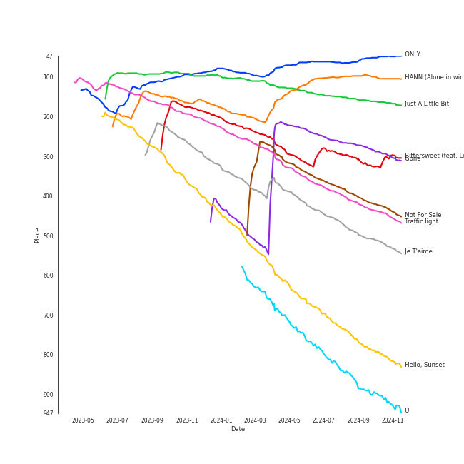

# Tracks in Chill from 2021

## Artists

| Art | Rank | Tracks | 💚 | Artist | 🔗 |
|:---|---:|---:|---:|:---|:---|
|  | 11 | 5 | 5 | [LeeHi](../../../artists/leehi/overview.md) | [🔗](https://open.spotify.com/artist/7cVZApDoQZpS447nHTsNqu) |
|  | 51 | 5 | 4 | [BAEKHYUN](../../../artists/baekhyun/overview.md) | [🔗](https://open.spotify.com/artist/4ufh0WuMZh6y4Dmdnklvdl) |
|  | 7 | 2 | 2 | [ENHYPEN](../../../artists/enhypen/overview.md) | [🔗](https://open.spotify.com/artist/5t5FqBwTcgKTaWmfEbwQY9) |
|  | 239 | 2 | 1 | Lee Mujin | [🔗](https://open.spotify.com/artist/4Xj0peBt3EZHbdF20JmdWC) |
|  | 1 | 1 | 1 | [aespa](../../../artists/aespa/overview.md) | [🔗](https://open.spotify.com/artist/6YVMFz59CuY7ngCxTxjpxE) |
|  | 409 | 1 | 1 | Silk Sonic | [🔗](https://open.spotify.com/artist/6PvvGcCY2XtUcSRld1Wilr) |
|  | 409 | 1 | 1 | JIN | [🔗](https://open.spotify.com/artist/5vV3bFXnN6D6N3Nj4xRvaV) |
|  | 409 | 1 | 1 | Wonstein | [🔗](https://open.spotify.com/artist/5o615XColiSVMPDWlslKSk) |
|  | 192 | 1 | 1 | MINGYU | [🔗](https://open.spotify.com/artist/5gUpo0BRmo6EOTbyU3z5Ay) |
|  | 37 | 1 | 1 | [HEIZE](../../../artists/heize/overview.md) | [🔗](https://open.spotify.com/artist/5dCvSnVduaFleCnyy98JMo) |

View all

| Art | Rank | Tracks | 💚 | Artist | 🔗 |
|:---|---:|---:|---:|:---|:---|
|  | 409 | 1 | 1 | YUKIKA | [🔗](https://open.spotify.com/artist/4RfI1z9u2xIc5Qnqac4JbO) |
|  | 190 | 1 | 1 | WONWOO | [🔗](https://open.spotify.com/artist/3rHcBT06Vb1XGVUWhDALZt) |
|  | 409 | 1 | 1 | Anderson .Paak | [🔗](https://open.spotify.com/artist/3jK9MiCrA42lLAdMGUZpwa) |
|  | 169 | 1 | 1 | ROSÉ | [🔗](https://open.spotify.com/artist/3eVa5w3URK5duf6eyVDbu9) |
|  | 20 | 1 | 1 | [Billlie](../../../artists/billlie/overview.md) | [🔗](https://open.spotify.com/artist/2GQxKDojobwBjZMPf7aoh0) |
|  | 409 | 1 | 1 | D.O. | [🔗](https://open.spotify.com/artist/2CQZr2RPZmrcvDnaod1ldC) |
|  | 6 | 1 | 1 | [(G)I-DLE](../../../artists/(g)i-dle/overview.md) | [🔗](https://open.spotify.com/artist/2AfmfGFbe0A0WsTYm0SDTx) |
|  | 66 | 1 | 1 | [PENTAGON](../../../artists/pentagon/overview.md) | [🔗](https://open.spotify.com/artist/1wKpMkucynaTfG8lyPprYV) |
|  | 45 | 1 | 1 | JOY | [🔗](https://open.spotify.com/artist/0sYpJ0nCC8AlDrZFeAA7ub) |
|  | 90 | 1 | 1 | [Bruno Mars](../../../artists/bruno_mars/overview.md) | [🔗](https://open.spotify.com/artist/0du5cEVh5yTK9QJze8zA0C) |
|  | 393 | 1 | 1 | B.I | [🔗](https://open.spotify.com/artist/0UntV1Bw2hk3fbRrm9eMP6) |
|  | 28 | 1 | 1 | [WENDY](../../../artists/wendy/overview.md) | [🔗](https://open.spotify.com/artist/0FRUZvZNPzM3YJMABJxf2K) |
|  | 10 | 2 | 0 | [Stray Kids](../../../artists/stray_kids/overview.md) | [🔗](https://open.spotify.com/artist/2dIgFjalVxs4ThymZ67YCE) |
|  | 16 | 2 | 0 | [STAYC](../../../artists/stayc/overview.md) | [🔗](https://open.spotify.com/artist/01XYiBYaoMJcNhPokrg0l0) |
|  | 409 | 1 | 0 | WOODZ | [🔗](https://open.spotify.com/artist/6y9nlaoynxSvoTGY09Vdcy) |
|  | 241 | 1 | 0 | [Coldplay](../../../artists/coldplay/overview.md) | [🔗](https://open.spotify.com/artist/4gzpq5DPGxSnKTe4SA8HAU) |
|  | 5 | 1 | 0 | [ITZY](../../../artists/itzy/overview.md) | [🔗](https://open.spotify.com/artist/2KC9Qb60EaY0kW4eH68vr3) |
|  | 2 | 1 | 0 | [Red Velvet](../../../artists/red_velvet/overview.md) | [🔗](https://open.spotify.com/artist/1z4g3DjTBBZKhvAroFlhOM) |
|  | 40 | 1 | 0 | [Jacob Collier](../../../artists/jacob_collier/overview.md) | [🔗](https://open.spotify.com/artist/0QWrMNukfcVOmgEU0FEDyD) |
|  | 409 | 1 | 0 | We Are KING | [🔗](https://open.spotify.com/artist/0FPWyyf6MD4QZTj3aypD3O) |

## Albums

| Art | Rank | Tracks | 💚 | Album | Release Date | 🔗 |
|:---|---:|---:|---:|:---|:---|:---|
|  | 57 | 4 | 4 | 4 ONLY | 2021-09-09 | [🔗](https://open.spotify.com/album/1DKgZeAYrjslAPZVMe6EFt) |
|  | 598 | 3 | 2 | Bambi - The 3rd Mini Album | 2021-03-30 | [🔗](https://open.spotify.com/album/5xOx4mWABbTj0qWyZC4q1p) |
|  | 29 | 2 | 0 | NOEASY | 2021-08-23 | [🔗](https://open.spotify.com/album/558tpdCejjVQNFAumRAeQj) |
|  | 598 | 1 | 1 | 공감 (Empathy) - The 1st Mini Album | 2021-07-26 | [🔗](https://open.spotify.com/album/4dqWy2Soq1Z1rqgKfXOATk) |
|  | 598 | 1 | 1 | timeabout, | 2021-04-07 | [🔗](https://open.spotify.com/album/1cBAfX0otvkoIOI6HtOrAc) |
|  | 78 | 1 | 1 | the Billage of perception : chapter one | 2021-11-10 | [🔗](https://open.spotify.com/album/1kp4txZsSpDNR4EoDFi2LD) |
|  | 598 | 1 | 1 | When Night Is Falling | 2021-07-07 | [🔗](https://open.spotify.com/album/3nOIsILeko2meMblKEGYZw) |
|  | 283 | 1 | 1 | Traffic light | 2021-05-14 | [🔗](https://open.spotify.com/album/4lHGpxL8peLQSZRgl1Lssm) |
|  | 5 | 1 | 1 | Savage - The 1st Mini Album | 2021-10-05 | [🔗](https://open.spotify.com/album/3vyyDkvYWC36DwgZCYd3Wu) |
|  | 187 | 1 | 1 | R | 2021-03-12 | [🔗](https://open.spotify.com/album/5BQcoDfcZ8aBcikYX9B7Ob) |

View all

| Art | Rank | Tracks | 💚 | Album | Release Date | 🔗 |
|:---|---:|---:|---:|:---|:---|:---|
|  | 20 | 1 | 1 | Like Water - The 1st Mini Album | 2021-04-05 | [🔗](https://open.spotify.com/album/1Ao5vWPO13f4l0ldwxOKL7) |
|  | 598 | 1 | 1 | LOVE or TAKE | 2021-03-15 | [🔗](https://open.spotify.com/album/5iu1d69dqEo9UaKpZDYoIV) |
|  | 598 | 1 | 1 | Jirisan (Original Television Soundtrack) Pt. 4 | 2021-11-07 | [🔗](https://open.spotify.com/album/2FUiBNFWz47sBPEf3Dcma4) |
|  | 88 | 1 | 1 | I burn | 2021-01-11 | [🔗](https://open.spotify.com/album/3ma5amx5s3l1NKoWNHaMYe) |
|  | 36 | 1 | 1 | Hello - Special Album | 2021-05-31 | [🔗](https://open.spotify.com/album/37mRfTDwQzVbHihypYY8oE) |
|  | 598 | 1 | 1 | HAPPEN | 2021-05-20 | [🔗](https://open.spotify.com/album/4xOOB79WcZuOoVwK06No1s) |
|  | 550 | 1 | 1 | Doom at Your Service (Original Television Soundtrack) Pt. 3 | 2021-05-31 | [🔗](https://open.spotify.com/album/2fy01jwC0GrnBGQ4Crcnve) |
|  | 109 | 1 | 1 | DIMENSION : DILEMMA | 2021-10-12 | [🔗](https://open.spotify.com/album/5jGRqioNCSWZGBl3QmyuFI) |
|  | 214 | 1 | 1 | Bittersweet (feat. LeeHi) | 2021-05-28 | [🔗](https://open.spotify.com/album/6qVk855QPCh57noNeeHMXQ) |
|  | 158 | 1 | 1 | BORDER : CARNIVAL | 2021-04-26 | [🔗](https://open.spotify.com/album/4LGYBcRsteiXjcPD4QQvxv) |
|  | 598 | 1 | 1 | BAEKHYUN | 2021-01-20 | [🔗](https://open.spotify.com/album/1jV1UooTpZ7c90umcENmOC) |
|  | 598 | 1 | 1 | An Evening With Silk Sonic | 2021-11-11 | [🔗](https://open.spotify.com/album/1YgekJJTEueWDaMr7BYqPk) |
|  | 430 | 1 | 0 | STEREOTYPE | 2021-09-06 | [🔗](https://open.spotify.com/album/7HGjNJBj1NQGNwCzFD2LHj) |
|  | 598 | 1 | 0 | STAYDOM | 2021-04-08 | [🔗](https://open.spotify.com/album/71hjsg660uio3Z8bnbB6fS) |
|  | 467 | 1 | 0 | Queendom - The 6th Mini Album | 2021-08-16 | [🔗](https://open.spotify.com/album/6Pe5LGQgU3mmvuRjFMsACV) |
|  | 598 | 1 | 0 | Music Of The Spheres | 2021-10-15 | [🔗](https://open.spotify.com/album/06mXfvDsRZNfnsGZvX2zpb) |
|  | 598 | 1 | 0 | LULLABY | 2021-08-27 | [🔗](https://open.spotify.com/album/7knAHnDVbgtX05qgU0ZcgT) |
|  | 598 | 1 | 0 | HOSPITAL PLAYLIST Season2, Pt. 1 (Original Television Soundtrack) | 2021-06-18 | [🔗](https://open.spotify.com/album/2pJhtrlZZvxFi818EMvKAY) |
|  | 193 | 1 | 0 | GUESS WHO | 2021-04-30 | [🔗](https://open.spotify.com/album/4lS8nhX8cplsYPzKjvhw6G) |

## Tracks

| Art | Track | Album | Artists | Label | Rank | 💚 | 🔗 |
|:---|:---|:---|:---|:---|---:|:---|:---|
|  | ONLY | 4 ONLY | [LeeHi](../../../artists/leehi/overview.md) | [Genie Music Corporation](../../../labels/genie_music_corporation), [Stone Music Entertainment](../../../labels/stone_music_entertainment) | 61 | 💚 | [🔗](https://open.spotify.com/track/6TBJkXHPhu3EsMk1bshwuI) |
|  | HANN (Alone in winter) | I burn | [(G)I-DLE](../../../artists/(g)i-dle/overview.md) | [Universal Music LLC](../../../labels/universal_music_llc) | 100 | 💚 | [🔗](https://open.spotify.com/track/2qYdsdgdeMLFzpLcMQWG2W) |
|  | Just A Little Bit | DIMENSION : DILEMMA | [ENHYPEN](../../../artists/enhypen/overview.md) | [BELIFT LAB](../../../labels/belift_lab) | 146 | 💚 | [🔗](https://open.spotify.com/track/3QdjLOemIcMZovVOnvJP7P) |
|  | Gone | R | ROSÉ | [Interscope Records](../../../labels/interscope_records), [YG Entertainment](../../../labels/yg_entertainment) | 258 | 💚 | [🔗](https://open.spotify.com/track/2dHoVW9AxJVSRebPRyV2aA) |
|  | Bittersweet (feat. LeeHi) | Bittersweet (feat. LeeHi) | WONWOO, MINGYU, [LeeHi](../../../artists/leehi/overview.md) | [PLEDIS Entertainment](../../../labels/pledis_entertainment) | 292 | 💚 | [🔗](https://open.spotify.com/track/347PJwH4XqRbeaKaIW9sX3) |
|  | Not For Sale | BORDER : CARNIVAL | [ENHYPEN](../../../artists/enhypen/overview.md) | [BELIFT LAB](../../../labels/belift_lab) | 374 | 💚 | [🔗](https://open.spotify.com/track/3dG1jxbfBIZvzyFwAcsmS0) |
|  | Traffic light | Traffic light | Lee Mujin | ShowPLAY ENTERTAINMENT | 390 | 💚 | [🔗](https://open.spotify.com/track/03qu1u4hDyepQQi2lNxCka) |
|  | Je T'aime | Hello - Special Album | JOY | [SM Entertainment](../../../labels/sm_entertainment) | 454 | 💚 | [🔗](https://open.spotify.com/track/18m3QugKZFaKjoMbe8CyjL) |
|  | Hello, Sunset | Queendom - The 6th Mini Album | [Red Velvet](../../../artists/red_velvet/overview.md) | [SM Entertainment](../../../labels/sm_entertainment) | 718 | | [🔗](https://open.spotify.com/track/3zQyl7ko8alM35mvYWmHuu) |
|  | U | Doom at Your Service (Original Television Soundtrack) Pt. 3 | [BAEKHYUN](../../../artists/baekhyun/overview.md) | 뮤직앤뉴, 스튜디오앤뉴 | 816 | 💚 | [🔗](https://open.spotify.com/track/0AtHUIDAkXWgpbD0QkyKgi) |

View all

| Art | Track | Album | Artists | Label | Rank | 💚 | 🔗 |
|:---|:---|:---|:---|:---|---:|:---|:---|
|  | Savior (feat. B.I) | 4 ONLY | [LeeHi](../../../artists/leehi/overview.md), B.I | [Genie Music Corporation](../../../labels/genie_music_corporation), [Stone Music Entertainment](../../../labels/stone_music_entertainment) | 846 | 💚 | [🔗](https://open.spotify.com/track/0DYvTdqBqW6erA1a7pFzVo) |
|  | Stars | BAEKHYUN | [BAEKHYUN](../../../artists/baekhyun/overview.md) | [avex trax](../../../labels/avex_trax) | 892 | 💚 | [🔗](https://open.spotify.com/track/1Gxrej5rBiUbB9QqwmIbDp) |
|  | Boy in time - HUI Solo | LOVE or TAKE | [PENTAGON](../../../artists/pentagon/overview.md) | [Universal Music LLC](../../../labels/universal_music_llc) | 892 | 💚 | [🔗](https://open.spotify.com/track/6RQ7IDXf8kKcSYYugGoJZf) |
|  | All I Got | Bambi - The 3rd Mini Album | [BAEKHYUN](../../../artists/baekhyun/overview.md) | [SM Entertainment](../../../labels/sm_entertainment) | 892 | | [🔗](https://open.spotify.com/track/2iVsJ2ZuD6b0aHUSi6wcQG) |
|  | Bambi | Bambi - The 3rd Mini Album | [BAEKHYUN](../../../artists/baekhyun/overview.md) | [SM Entertainment](../../../labels/sm_entertainment) | 892 | 💚 | [🔗](https://open.spotify.com/track/60VaORSJ5x1D4ZPSc0g2En) |
|  | Cry For Love | Bambi - The 3rd Mini Album | [BAEKHYUN](../../../artists/baekhyun/overview.md) | [SM Entertainment](../../../labels/sm_entertainment) | 892 | 💚 | [🔗](https://open.spotify.com/track/4QqROKO0RtV5CvxE7g90uw) |
|  | Why Can't You Love Me? | Like Water - The 1st Mini Album | [WENDY](../../../artists/wendy/overview.md) | [SM Entertainment](../../../labels/sm_entertainment) | 892 | 💚 | [🔗](https://open.spotify.com/track/0CyydmXI4QhgUWrZsPOTXA) |
|  | Insomnia | timeabout, | YUKIKA | UBUNTU ENT | 892 | 💚 | [🔗](https://open.spotify.com/track/0AAEFC3RGirgzRFhi44Y79) |
|  | LOVE FOOL | STAYDOM | [STAYC](../../../artists/stayc/overview.md) | [High Up Entertainment](../../../labels/high_up_entertainment) | 892 | | [🔗](https://open.spotify.com/track/2OhOkew9BkkLTGBG9cFOz5) |
|  | TENNIS (0:0) | GUESS WHO | [ITZY](../../../artists/itzy/overview.md) | [Republic Records](../../../labels/republic_records) | 892 | | [🔗](https://open.spotify.com/track/6wSBcV4mjwiVKGJzNrgwha) |
|  | HAPPEN | HAPPEN | [HEIZE](../../../artists/heize/overview.md) | [Genie Music Corporation](../../../labels/genie_music_corporation), [Stone Music Entertainment](../../../labels/stone_music_entertainment) | 892 | 💚 | [🔗](https://open.spotify.com/track/1MtCOuTy3B6fU72LQPvg16) |
|  | Rain and You | HOSPITAL PLAYLIST Season2, Pt. 1 (Original Television Soundtrack) | Lee Mujin | [Genie Music Corporation](../../../labels/genie_music_corporation), [Stone Music Entertainment](../../../labels/stone_music_entertainment) | 892 | | [🔗](https://open.spotify.com/track/4ribiWWnI451QMRdOgByIP) |
|  | When Night Is Falling | When Night Is Falling | Wonstein | [Genie Music Corporation](../../../labels/genie_music_corporation), [Stone Music Entertainment](../../../labels/stone_music_entertainment) | 892 | 💚 | [🔗](https://open.spotify.com/track/3skyeuj2qNbbIuAP3Gv2dz) |
|  | Rose | 공감 (Empathy) - The 1st Mini Album | D.O. | [SM Entertainment](../../../labels/sm_entertainment) | 892 | 💚 | [🔗](https://open.spotify.com/track/2bk43y1inDfHx8fFdXar3l) |
|  | Silent Cry | NOEASY | [Stray Kids](../../../artists/stray_kids/overview.md) | [Republic Records](../../../labels/republic_records) | 892 | | [🔗](https://open.spotify.com/track/5kBJH5gU89axZDauhfddpy) |
|  | Surfin’ (Lee Know, Changbin, Felix) | NOEASY | [Stray Kids](../../../artists/stray_kids/overview.md) | [Republic Records](../../../labels/republic_records) | 892 | | [🔗](https://open.spotify.com/track/1FdnsU6An1Ye3uBJe8j23c) |
|  | LULLABY | LULLABY | WOODZ | [Genie Music Corporation](../../../labels/genie_music_corporation), [Stone Music Entertainment](../../../labels/stone_music_entertainment) | 892 | | [🔗](https://open.spotify.com/track/4XqyWlYiTFZ627CuUzMOJP) |
|  | I’ll BE THERE | STEREOTYPE | [STAYC](../../../artists/stayc/overview.md) | [High Up Entertainment](../../../labels/high_up_entertainment) | 892 | | [🔗](https://open.spotify.com/track/1aWnOcf3GE7xuu4rubVPYL) |
|  | Bye | 4 ONLY | [LeeHi](../../../artists/leehi/overview.md) | [Genie Music Corporation](../../../labels/genie_music_corporation), [Stone Music Entertainment](../../../labels/stone_music_entertainment) | 892 | 💚 | [🔗](https://open.spotify.com/track/6ye2BBTpOipvPNjSPxgmRC) |
|  | Intentions | 4 ONLY | [LeeHi](../../../artists/leehi/overview.md) | [Genie Music Corporation](../../../labels/genie_music_corporation), [Stone Music Entertainment](../../../labels/stone_music_entertainment) | 892 | 💚 | [🔗](https://open.spotify.com/track/7IN84szmayzO68enmVmKYv) |
|  | Lucid Dream | Savage - The 1st Mini Album | [aespa](../../../artists/aespa/overview.md) | [SM Entertainment](../../../labels/sm_entertainment) | 892 | 💚 | [🔗](https://open.spotify.com/track/285Bh5EkbxGGE76ge8JDbH) |
|  | ❤️ | Music Of The Spheres | [Coldplay](../../../artists/coldplay/overview.md), We Are KING, [Jacob Collier](../../../artists/jacob_collier/overview.md) | [Parlophone UK](../../../labels/parlophone_uk) | 892 | | [🔗](https://open.spotify.com/track/3oTYv0yShT4sjuPncoUXfK) |
|  | Yours | Jirisan (Original Television Soundtrack) Pt. 4 | JIN | 에이스토리, 모스트콘텐츠 | 892 | 💚 | [🔗](https://open.spotify.com/track/10IfXtjKQmOiON7tNAHv0y) |
|  | the eleventh day | the Billage of perception : chapter one | [Billlie](../../../artists/billlie/overview.md) | [MYSTIC STORY](../../../labels/mystic_story) | 892 | 💚 | [🔗](https://open.spotify.com/track/4YldhqpCghwJalBtiCRtl1) |
|  | Leave The Door Open | An Evening With Silk Sonic | [Bruno Mars](../../../artists/bruno_mars/overview.md), Anderson .Paak, Silk Sonic | [Aftermath Entertainment/Atlantic](../../../labels/atlantic_records) | 892 | 💚 | [🔗](https://open.spotify.com/track/02VBYrHfVwfEWXk5DXyf0T) |

