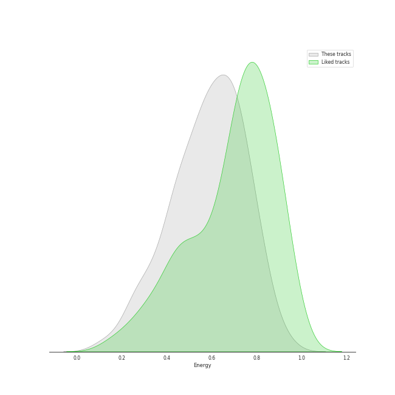
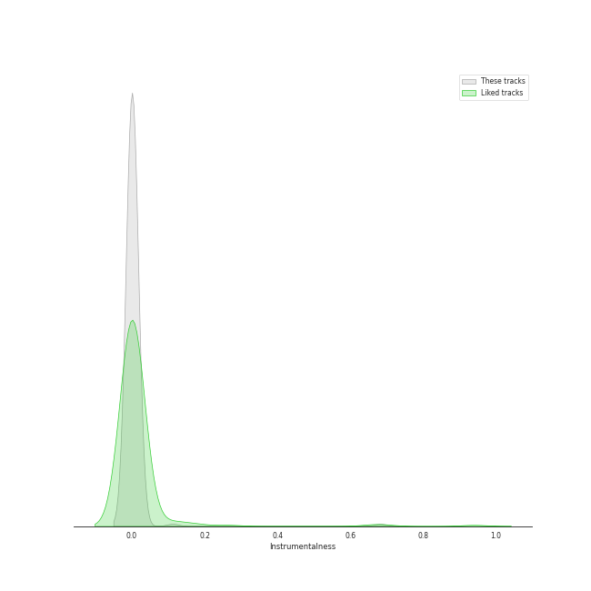
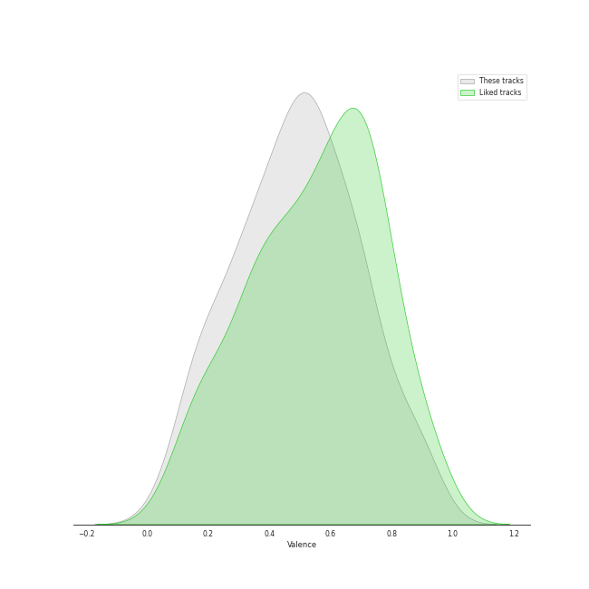
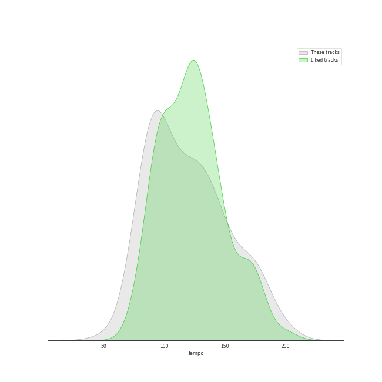

# Track Features for Chill

## Danceability

| ​ | 10 most Danceable tracks | ​​ | 10 least Danceable tracks |
|:---|:---|:---|:---|
|  | I Do (0.898) |  | Fix You (0.209) |
|  | Cat (Feat. IU) (0.882) |  | U (0.301) |
|  | Love Theory (0.878) |  | Miracle (0.302) |
|  | 10 Months (0.876) |  | Sweet (0.302) |
|  | TENNIS (0:0) (0.85) |  | lovely (with Khalid) (0.351) |
|  | Don’t (0.85) |  | when the party's over (0.367) |
|  | Cookie (0.847) |  | Unknown (To You) (0.367) |
|  | Heart Burn (0.84) |  | MY LOVE (0.375) |
|  | To the moon (0.835) |  | Skinny Love (0.379) |
|  | Bye (0.824) |  | Boy in time - HUI Solo (0.385) |

## Energy

| ​ | 10 most Energetic tracks | ​​ | 10 least Energetic tracks |
|:---|:---|:---|:---|
|  | Sparkling Night (0.935) |  | when the party's over (0.111) |
|  | NEON (0.921) |  | i hate to admit (Bang Chan) (0.217) |
|  | Why Can't You Love Me? (0.879) |  | miss you (Hyunjin) (0.226) |
|  | Silent Cry (0.876) |  | Stardust love song (0.241) |
|  | Be Natural (0.868) |  | BREATHE (0.251) |
|  | Event Horizon (0.861) |  | Video Games (0.255) |
|  | 'Til We Meet Again (0.857) |  | Boy in time - HUI Solo (0.255) |
|  | Spring Day (0.846) |  | All of Me (0.264) |
|  | Change (0.842) |  | My Everything (0.265) |
|  | SAY SOMETHING (0.841) |  | Take It All (0.266) |

## Speechiness

| ​ | 10 most Speechy tracks | ​​ | 10 least Speechy tracks |
|:---|:---|:---|:---|
|  | I Don't Need You (0.422) |  | With (0.0228) |
|  | Be Natural (0.316) |  | Sweet Night (0.025) |
|  | Sparkling Night (0.299) |  | Kids Again (0.0262) |
|  | All I Wanna Do (0.267) |  | Begin Again (0.0263) |
|  | Life's Too Short (English Version) (0.265) |  | Slightly Tipsy (She is My Type♡ X SANDEUL) (0.0264) |
|  | Automatic (0.252) |  | She′s In The Rain (0.0264) |
|  | Boat (0.252) |  | Moonlight Melody (0.0269) |
|  | GANADARA (Feat. IU) (0.244) |  | Rain and You (0.027) |
|  | Your Existence (0.204) |  | ドライフラワー (0.0276) |
|  | Not For Sale (0.203) |  | LOVE FOOL (0.0281) |

## Acousticness

| ​ | 10 most Acoustic tracks | ​​ | 10 least Acoustic tracks |
|:---|:---|:---|:---|
|  | when the party's over (0.978) |  | Blinding Lights (0.00146) |
|  | The Night We Met (0.969) |  | Yellow (0.00239) |
|  | Take It All (0.957) |  | Spring Day (0.00631) |
|  | Skinny Love (0.952) |  | Life Goes On (0.00691) |
|  | lovely (with Khalid) (0.934) |  | MOVE (0.0153) |
|  | All of Me (0.922) |  | Wet The Bed (feat. Ludacris) (0.0166) |
|  | 그대라는 시 (0.914) |  | Ditto (0.027) |
|  | Unknown (To You) (0.895) |  | Blue Flame (0.0281) |
|  | ONLY (0.892) |  | Heart Burn (0.0287) |
|  | My Everything (0.88) |  | FXXK WIT US (0.0293) |

## Instrumentalness

| ​ | 10 most Instrumental tracks | ​​ | 10 least Instrumental tracks |
|:---|:---|:---|:---|
|  | The Night We Met (0.267) |  | Leave The Door Open (0.0) |
|  | ocean eyes (0.0317) |  | Miracle (0.0) |
|  | Sweater Weather (0.0177) |  | Traffic light (0.0) |
|  | In My Dreams (0.0066) |  | To the moon (0.0) |
|  | Miss Simone (0.00407) |  | Why Can't You Love Me? (0.0) |
|  | Whale (0.00351) |  | Friday (feat.Jang Yi-jeong) (0.0) |
|  | Singularity (0.00278) |  | Gold Dust (0.0) |
|  | Fix You (0.00196) |  | For You (0.0) |
|  | willow (0.00179) |  | Done For Me (0.0) |
|  | Thinkin Bout You (0.00153) |  | UN Village (0.0) |

## Liveness

| ​ | 10 most Live tracks | ​​ | 10 least Live tracks |
|:---|:---|:---|:---|
|  | The Night We Met (0.641) |  | SUGA's Interlude (0.0425) |
|  | Boat (0.56) |  | In My Dreams (0.0489) |
|  | Darl+ing (0.43) |  | Baby Powder (0.0518) |
|  | I Love You 3000 II (0.412) |  | LOVE FOOL (0.0551) |
|  | Cupid (0.4) |  | Easy (0.0596) |
|  | Love Rain (Feat. SURAN) (0.399) |  | Still Life (0.0628) |
|  | Automatic (0.387) |  | SAY SOMETHING (0.0646) |
|  | Stuck with U (with Justin Bieber) (0.382) |  | Impurities (0.0656) |
|  | NEON (0.379) |  | Blueming (0.0667) |
|  | Show Your Heart 너를 보여줘 (0.37) |  | All I Got (0.0672) |

## Valence

| ​ | 10 most Happy tracks | ​​ | 10 least Happy tracks |
|:---|:---|:---|:---|
|  | Cupid (0.961) |  | Delicate (0.0499) |
|  | Boat (0.922) |  | The Road (0.073) |
|  | 운명 The Chance of Love (0.915) |  | Lavender Haze (0.0976) |
|  | TFW (That Feeling When) (0.902) |  | The Night We Met (0.1) |
|  | Love Theory (0.888) |  | 7월 7일 One Of These Nights (0.11) |
|  | Hello, Sunset (0.871) |  | Put It Straight (0.111) |
|  | To the moon (0.866) |  | lovely (with Khalid) (0.12) |
|  | Only Look At Me (나만 바라봐) (0.859) |  | In The Fall (0.12) |
|  | What Do I Call You (0.835) |  | Fix You (0.124) |
|  | I Got Love (0.828) |  | U (0.137) |

## Tempo

| ​ | 10 most Fast tracks | ​​ | 10 least Fast tracks |
|:---|:---|:---|:---|
|  | 11:11 (203.155) |  | Dream (48.973) |
|  | Sweet (195.738) |  | Bambi (61.45) |
|  | Not For Sale (192.13) |  | My Everything (61.975) |
|  | I’ll BE THERE (185.657) |  | imagine (62.52) |
|  | Automatic (179.938) |  | MISSING U (71.967) |
|  | HOLO (179.914) |  | Hello, Sunset (71.999) |
|  | Hurt (179.877) |  | Wine (72.022) |
|  | HANN (Alone in winter) (179.855) |  | Yours (72.035) |
|  | BUTTERFLY (179.851) |  | Life's Too Short (English Version) (72.203) |
|  | I Love You 3000 II (179.727) |  | miss you (Hyunjin) (72.96) |
