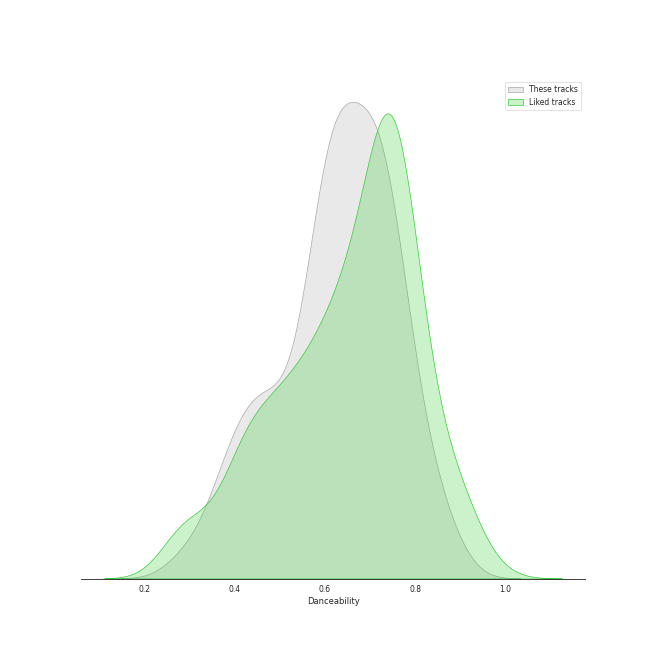
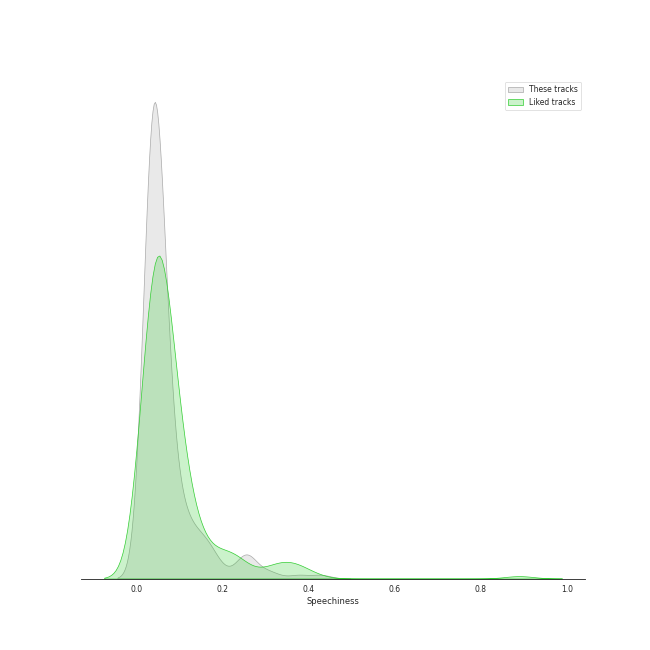
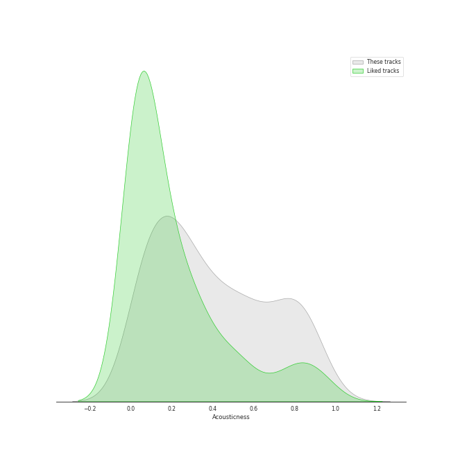
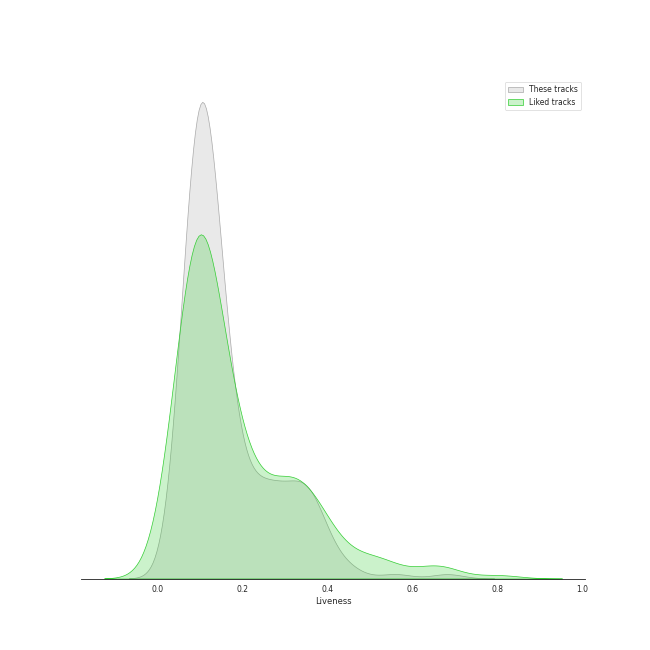

# Audio Features for Chill

## Danceability

| 10 most Danceable tracks | 10 least Danceable tracks |
|:---|:---|
| I Do (0.898) | Fix You (0.209) |
| Cat (Feat. IU) (0.882) | U (0.301) |
| Love Theory (0.878) | Miracle (0.302) |
| 10 Months (0.876) | Sweet (0.302) |
| TENNIS (0:0) (0.85) | lovely (with Khalid) (0.351) |
| Don’t (0.85) | when the party's over (0.367) |
| Cookie (0.847) | Unknown (To You) (0.367) |
| Heart Burn (0.84) | MY LOVE (0.375) |
| To the moon (0.835) | Skinny Love (0.379) |
| Bye (0.824) | Boy in time - HUI Solo (0.385) |

## Energy

| 10 most Energetic tracks | 10 least Energetic tracks |
|:---|:---|
| Sparkling Night (0.935) | when the party's over (0.111) |
| NEON (0.921) | i hate to admit (Bang Chan) (0.217) |
| Why Can't You Love Me? (0.879) | miss you (Hyunjin) (0.226) |
| Silent Cry (0.876) | Stardust love song (0.241) |
| Be Natural (0.868) | BREATHE (0.251) |
| Event Horizon (0.861) | Video Games (0.255) |
| Spring Day (0.846) | Boy in time - HUI Solo (0.255) |
| Change (0.842) | All of Me (0.264) |
| SAY SOMETHING (0.841) | My Everything (0.265) |
| Stars and Raindrops (Seungmin) (0.827) | Take It All (0.266) |

## Speechiness

| 10 most Speechy tracks | 10 least Speechy tracks |
|:---|:---|
| I Don't Need You (0.422) | With (0.0228) |
| Be Natural (0.316) | Sweet Night (0.025) |
| Sparkling Night (0.299) | Begin Again (0.0263) |
| All I Wanna Do (0.267) | Slightly Tipsy (She is My Type♡ X SANDEUL) (0.0264) |
| Life's Too Short (English Version) (0.265) | She′s In The Rain (0.0264) |
| Automatic (0.252) | Moonlight Melody (0.0269) |
| Boat (0.252) | Rain and You (0.027) |
| GANADARA (Feat. IU) (0.244) | ドライフラワー (0.0276) |
| Your Existence (0.204) | LOVE FOOL (0.0281) |
| Not For Sale (0.203) | Yellow (0.0281) |

## Acousticness

| 10 most Acoustic tracks | 10 least Acoustic tracks |
|:---|:---|
| when the party's over (0.978) | Blinding Lights (0.00146) |
| The Night We Met (0.969) | Yellow (0.00239) |
| Take It All (0.957) | Spring Day (0.00631) |
| Skinny Love (0.952) | Life Goes On (0.00691) |
| lovely (with Khalid) (0.934) | MOVE (0.0153) |
| All of Me (0.922) | Wet The Bed (feat. Ludacris) (0.0166) |
| 그대라는 시 (0.914) | Ditto (0.027) |
| Unknown (To You) (0.895) | Blue Flame (0.0281) |
| ONLY (0.892) | Heart Burn (0.0287) |
| My Everything (0.88) | Sour (0.0334) |

## Instrumentalness

| 10 most Instrumental tracks | 10 least Instrumental tracks |
|:---|:---|
| The Night We Met (0.267) | Leave The Door Open (0.0) |
| ocean eyes (0.0317) | Miracle (0.0) |
| Sweater Weather (0.0177) | Traffic light (0.0) |
| In My Dreams (0.0066) | To the moon (0.0) |
| Miss Simone (0.00407) | Why Can't You Love Me? (0.0) |
| Whale (0.00351) | Friday (feat.Jang Yi-jeong) (0.0) |
| Singularity (0.00278) | Gold Dust (0.0) |
| Fix You (0.00196) | For You (0.0) |
| willow (0.00179) | Done For Me (0.0) |
| Thinkin Bout You (0.00153) | UN Village (0.0) |

## Liveness

| 10 most Live tracks | 10 least Live tracks |
|:---|:---|
| The Night We Met (0.641) | SUGA's Interlude (0.0425) |
| Boat (0.56) | In My Dreams (0.0489) |
| Darl+ing (0.43) | Baby Powder (0.0518) |
| I Love You 3000 II (0.412) | LOVE FOOL (0.0551) |
| Love Rain (Feat. SURAN) (0.399) | Easy (0.0596) |
| Automatic (0.387) | Still Life (0.0628) |
| Cupid (0.383) | SAY SOMETHING (0.0646) |
| Stuck with U (with Justin Bieber) (0.382) | Impurities (0.0656) |
| NEON (0.379) | Blueming (0.0667) |
| Show Your Heart 너를 보여줘 (0.37) | All I Got (0.0672) |

## Valence

| 10 most Happy tracks | 10 least Happy tracks |
|:---|:---|
| Cupid (0.943) | Delicate (0.0499) |
| Boat (0.922) | The Road (0.073) |
| 운명 The Chance of Love (0.915) | Lavender Haze (0.0976) |
| TFW (That Feeling When) (0.902) | The Night We Met (0.1) |
| Love Theory (0.888) | 7월 7일 One Of These Nights (0.11) |
| Hello, Sunset (0.871) | lovely (with Khalid) (0.12) |
| To the moon (0.866) | Fix You (0.124) |
| Only Look At Me (나만 바라봐) (0.859) | U (0.137) |
| What Do I Call You (0.835) | Gravity (0.142) |
| I Got Love (0.828) | Lucid Dream (0.146) |

## Tempo

| 10 most Fast tracks | 10 least Fast tracks |
|:---|:---|
| 11:11 (203.155) | Dream (48.973) |
| Sweet (195.738) | Bambi (61.45) |
| Not For Sale (192.13) | My Everything (61.975) |
| I’ll BE THERE (185.657) | imagine (62.52) |
| Automatic (179.938) | MISSING U (71.967) |
| HOLO (179.914) | Hello, Sunset (71.999) |
| Hurt (179.877) | Wine (72.022) |
| HANN (Alone in winter) (179.855) | Life's Too Short (English Version) (72.203) |
| BUTTERFLY (179.851) | miss you (Hyunjin) (72.96) |
| I Love You 3000 II (179.727) | Rose (74.703) |
