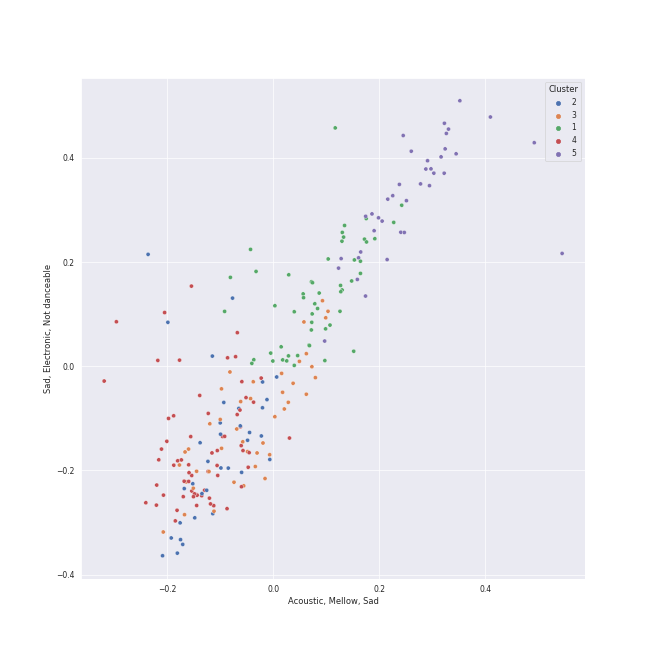

# Clusters in Chill

## Cluster #1

56 tracks

| Art | Track | Album | Artists | Label | Rank | 💚 | 🔗 |
|:---|:---|:---|:---|:---|---:|:---|:---|
|  | Impurities | ANTIFRAGILE | [LE SSERAFIM](../../../../artists/le_sserafim/overview.md) | [SOURCE MUSIC](../../../../labels/source_music) | 76 | 💚 | [🔗](https://open.spotify.com/track/7F0MuIk5glqtowCUjbn9es) |
|  | MISSING U | SEOULITE | [LeeHi](../../../../artists/leehi/overview.md) | [YG Entertainment](../../../../labels/yg_entertainment) | nan | 💚 | [🔗](https://open.spotify.com/track/4uk677I1lb0ZPSXGhL2FcA) |
|  | Still Monster | ORANGE BLOOD | [ENHYPEN](../../../../artists/enhypen/overview.md) | [BELIFT LAB](../../../../labels/belift_lab) | nan | 💚 | [🔗](https://open.spotify.com/track/6tuTpe37ljVcrJeZAAKBE1) |
|  | I'm Unhappy | MY WORLD - The 3rd Mini Album | [aespa](../../../../artists/aespa/overview.md) | [SM Entertainment](../../../../labels/sm_entertainment), [Warner Records](../../../../labels/warner_records) | 188 | 💚 | [🔗](https://open.spotify.com/track/6fzio74FGqFFsenYkbGPzR) |
|  | Shinunoga E-Wa | HELP EVER HURT NEVER | Fujii Kaze | [Universal Music LLC](../../../../labels/universal_music_llc) | 543 | 💚 | [🔗](https://open.spotify.com/track/0o9zmvc5f3EFApU52PPIyW) |
|  | BUTTERFLY | YOUNG-LUV.COM | [STAYC](../../../../artists/stayc/overview.md) | [High Up Entertainment](../../../../labels/high_up_entertainment) | 408 | 💚 | [🔗](https://open.spotify.com/track/1q97NRLZfQlXYvZJAQ7tln) |
|  | Priority | 2022 Winter SMTOWN : SMCU PALACE | MAX CHANGMIN, [TAEYEON](../../../../artists/taeyeon/overview.md), [WINTER](../../../../artists/winter/overview.md) | [SM Entertainment](../../../../labels/sm_entertainment) | 205 | 💚 | [🔗](https://open.spotify.com/track/79musoVrfPaVxoMSBFJYuc) |
|  | Child | Child - SM STATION : NCT LAB | MARK | [SM Entertainment](../../../../labels/sm_entertainment) | 668 | 💚 | [🔗](https://open.spotify.com/track/5HaYRuf3zAfCb8RSO9LLea) |
|  | RED | RED | [The Rose](../../../../artists/the_rose/overview.md) | [Genie Music Corporation](../../../../labels/genie_music_corporation), [Stone Music Entertainment](../../../../labels/stone_music_entertainment) | nan | 💚 | [🔗](https://open.spotify.com/track/1JsBcVdlKZJmDPJWu4wJPC) |
|  | WINE (Feat.Changmo) (Prod. SUGA) | WINE | SURAN, CHANGMO | Million Market,Inc | 127 | 💚 | [🔗](https://open.spotify.com/track/3eHkFA3StDR9BU7EVrUFLs) |
## Cluster #2

35 tracks

| Art | Track | Album | Artists | Label | Rank | 💚 | 🔗 |
|:---|:---|:---|:---|:---|---:|:---|:---|
|  | Amusement Park | Amusement Park | [BAEKHYUN](../../../../artists/baekhyun/overview.md) | [SM Entertainment](../../../../labels/sm_entertainment) | 44 | 💚 | [🔗](https://open.spotify.com/track/1TUkEXQrskATO9SoB4QMUN) |
|  | MY LOVE | Moonlovers: Scarlet Heart Ryeo (Original Television Soundtrack), Pt 10 | [LeeHi](../../../../artists/leehi/overview.md) | CJ E&M MUSIC | nan | | [🔗](https://open.spotify.com/track/4PvVKyqJ6pLVi5HKpAjTPc) |
|  | ocean eyes | dont smile at me | [Billie Eilish](../../../../artists/billie_eilish/overview.md) | [Darkroom](../../../../labels/darkroom) | nan | 💚 | [🔗](https://open.spotify.com/track/7hDVYcQq6MxkdJGweuCtl9) |
|  | HANN (Alone in winter) | I burn | [(G)I-DLE](../../../../artists/(g)i-dle/overview.md) | [Universal Music LLC](../../../../labels/universal_music_llc) | 123 | 💚 | [🔗](https://open.spotify.com/track/2qYdsdgdeMLFzpLcMQWG2W) |
|  | Video Games | Born To Die | [Lana Del Rey](../../../../artists/lana_del_rey/overview.md) | [Polydor Records](../../../../labels/polydor_records) | nan | 💚 | [🔗](https://open.spotify.com/track/5by7gtiDrxe4n2qQQunL8S) |
|  | 무제(無題) (Untitled, 2014) | KWON JI YONG | G-DRAGON | [YG Entertainment](../../../../labels/yg_entertainment) | 26 | 💚 | [🔗](https://open.spotify.com/track/16BS342F89MDqouSxgLaUK) |
|  | Run With Me | Serenade | Sunwoojunga | MAGIC STRAWBERRY SOUND | nan | | [🔗](https://open.spotify.com/track/1m8b3KFsAiGyjRc90ZfEB9) |
|  | Honeybee | The 2¢ Show | Steam Powered Giraffe | Steam Powered Giraffe | 212 | 💚 | [🔗](https://open.spotify.com/track/3MZjOGeXhpHbQ9ESMNFFnH) |
|  | All of Me | Love In The Future (Expanded Edition) | John Legend | [G.O.O.D. Music/Columbia](../../../../labels/columbia) | nan | 💚 | [🔗](https://open.spotify.com/track/3U4isOIWM3VvDubwSI3y7a) |
|  | DIE 4 YOU | DIE 4 YOU | DEAN | [Universal Music Ltd.](../../../../labels/universal_music_llc) | nan | 💚 | [🔗](https://open.spotify.com/track/7yZD4AVfQtAZD4cG8eRnPk) |
## Cluster #3

45 tracks

| Art | Track | Album | Artists | Label | Rank | 💚 | 🔗 |
|:---|:---|:---|:---|:---|---:|:---|:---|
|  | Hurt | NewJeans 1st EP 'New Jeans' | [NewJeans](../../../../artists/newjeans/overview.md) | [ADOR](../../../../labels/ador) | nan | 💚 | [🔗](https://open.spotify.com/track/5expoVGQPvXuwBBFuNGqBd) |
|  | Written In The Stars | Written In The Stars | [WENDY](../../../../artists/wendy/overview.md), John Legend | [SM Entertainment](../../../../labels/sm_entertainment) | nan | 💚 | [🔗](https://open.spotify.com/track/6SLMyJPRTh2zCX9SJJHTZQ) |
|  | cardigan | folklore | [Taylor Swift](../../../../artists/taylor_swift/overview.md) | [Taylor Swift](../../../../labels/taylor_swift) | nan | 💚 | [🔗](https://open.spotify.com/track/4R2kfaDFhslZEMJqAFNpdd) |
|  | Hear The Sea | The Red Summer - Summer Mini Album | [Red Velvet](../../../../artists/red_velvet/overview.md) | [SM Entertainment](../../../../labels/sm_entertainment) | nan | | [🔗](https://open.spotify.com/track/5rUWULaKgEK2HozI1wYvZ9) |
|  | Friday (feat.Jang Yi-jeong) | Modern Times – Epilogue | [IU](../../../../artists/iu/overview.md), Jang Yi-jeong | [Kakao Entertainment](../../../../labels/kakao_entertainment) | nan | 💚 | [🔗](https://open.spotify.com/track/0GsRx0gPft6RmijIwMsKmG) |
|  | Rainy Season | RED MOON | [MAMAMOO](../../../../artists/mamamoo/overview.md) | [RBW, Inc.](../../../../labels/rbw_inc_) | nan | | [🔗](https://open.spotify.com/track/1j64SGn9hUwidOSdDrXi6s) |
|  | Brunch | Romantic Spring | [Gain](../../../../artists/gain/overview.md), HYUNGWOO | Kakao M Corp. | nan | 💚 | [🔗](https://open.spotify.com/track/5wiWryEZLvo30nopnOEbdJ) |
|  | Slightly Tipsy (She is My Type♡ X SANDEUL) | Slightly Tipsy (She is My Type♡ X SANDEUL) | Sandeul | TOON STUDIO | 461 | 💚 | [🔗](https://open.spotify.com/track/1xWVYPdaLm909DbFmuPGOR) |
|  | Gone | R | ROSÉ | [Interscope Records](../../../../labels/interscope_records), [YG Entertainment](../../../../labels/yg_entertainment) | 228 | 💚 | [🔗](https://open.spotify.com/track/2dHoVW9AxJVSRebPRyV2aA) |
|  | Mushroom Chocolate (with 6LACK) | LUCID | QUIN, 6LACK | [Fantasy Soul/Interscope Records](../../../../labels/interscope_records) | nan | 💚 | [🔗](https://open.spotify.com/track/6DEhBd4RGr8MbSAtSNNtai) |
## Cluster #4

63 tracks

| Art | Track | Album | Artists | Label | Rank | 💚 | 🔗 |
|:---|:---|:---|:---|:---|---:|:---|:---|
|  | Happy | Happy | [TAEYEON](../../../../artists/taeyeon/overview.md) | [SM Entertainment](../../../../labels/sm_entertainment) | nan | 💚 | [🔗](https://open.spotify.com/track/459mRPsscVLMvVL59gr7EM) |
|  | If I Can't Have You | Amidst the Chaos (Bonus Version) | [Sara Bareilles](../../../../artists/sara_bareilles/overview.md) | [Epic](../../../../labels/epic) | nan | 💚 | [🔗](https://open.spotify.com/track/3n5MOB82LKPL14eBEmodTd) |
|  | Leave The Door Open | An Evening With Silk Sonic | [Bruno Mars](../../../../artists/bruno_mars/overview.md), Anderson .Paak, Silk Sonic | [Aftermath Entertainment/Atlantic](../../../../labels/atlantic_records) | nan | 💚 | [🔗](https://open.spotify.com/track/02VBYrHfVwfEWXk5DXyf0T) |
|  | OMG | NewJeans 'OMG' | [NewJeans](../../../../artists/newjeans/overview.md) | [ADOR](../../../../labels/ador) | 104 | 💚 | [🔗](https://open.spotify.com/track/65FftemJ1DbbZ45DUfHJXE) |
|  | EASY | EASY | [LE SSERAFIM](../../../../artists/le_sserafim/overview.md) | [SOURCE MUSIC](../../../../labels/source_music) | 294 | 💚 | [🔗](https://open.spotify.com/track/2O4Bb2WCkjlTPO827OnBMI) |
|  | Love To Hate Me | THE ALBUM | [BLACKPINK](../../../../artists/blackpink/overview.md) | [Interscope Records](../../../../labels/interscope_records), [YG Entertainment](../../../../labels/yg_entertainment) | nan | 💚 | [🔗](https://open.spotify.com/track/7iKDsPfLT0d5mu2htfMKBZ) |
|  | Orange Flower (You Complete Me) | ORANGE BLOOD | [ENHYPEN](../../../../artists/enhypen/overview.md) | [BELIFT LAB](../../../../labels/belift_lab) | nan | | [🔗](https://open.spotify.com/track/5Cb3JSisvjlZhjSfYD6d7C) |
|  | Jenga (feat. Gaeko) | Wish & Wind | [HEIZE](../../../../artists/heize/overview.md), Gaeko | CJ E&M MUSIC | nan | 💚 | [🔗](https://open.spotify.com/track/1dA1tlzwcJ3YDYsSul1m06) |
|  | nevertheless | the Billage of perception: chapter three | [Billlie](../../../../artists/billlie/overview.md) | [MYSTIC STORY](../../../../labels/mystic_story) | 574 | 💚 | [🔗](https://open.spotify.com/track/26fVl2CYeXXxD4yEqmhrpM) |
|  | B’rave ~ a song for Matilda | the Billage of perception: chapter two | [Billlie](../../../../artists/billlie/overview.md) | [MYSTIC STORY](../../../../labels/mystic_story) | nan | | [🔗](https://open.spotify.com/track/78Kr4lzSgXyE11fq4ncILK) |
## Cluster #5

24 tracks

| Art | Track | Album | Artists | Label | Rank | 💚 | 🔗 |
|:---|:---|:---|:---|:---|---:|:---|:---|
|  | Doll | Doll - SM STATION | [WENDY](../../../../artists/wendy/overview.md), [SEULGI](../../../../artists/seulgi/overview.md), KANGTA | [SM Entertainment](../../../../labels/sm_entertainment) | nan | | [🔗](https://open.spotify.com/track/5Iy48VE6KN7Ywml5hlOd9u) |
|  | You Never Know | THE ALBUM | [BLACKPINK](../../../../artists/blackpink/overview.md) | [Interscope Records](../../../../labels/interscope_records), [YG Entertainment](../../../../labels/yg_entertainment) | nan | 💚 | [🔗](https://open.spotify.com/track/39kzWAiVPpycdMpr745oPj) |
|  | STAY | SQUARE TWO | [BLACKPINK](../../../../artists/blackpink/overview.md) | [YG Entertainment](../../../../labels/yg_entertainment) | nan | | [🔗](https://open.spotify.com/track/3tP6QKbXvtrxiDI7QwKyUf) |
|  | My Day Is Full Of You | The King : Eternal Monarch, Pt. 10 (Original Television Soundtrack) | ZICO, [WENDY](../../../../artists/wendy/overview.md) | [Genie Music Corporation](../../../../labels/genie_music_corporation), [Stone Music Entertainment](../../../../labels/stone_music_entertainment) | nan | | [🔗](https://open.spotify.com/track/2QWa5RjnIGFwraHDPqlhFh) |
|  | Seed | Down to Earth | TAEYANG | [THEBLACKLABEL/Interscope Records](../../../../labels/interscope_records) | 464 | | [🔗](https://open.spotify.com/track/49eleLPCqnwgBSICKgcL0z) |
|  | Yours | Jirisan (Original Television Soundtrack) Pt. 4 | JIN | 에이스토리, 모스트콘텐츠 | nan | 💚 | [🔗](https://open.spotify.com/track/10IfXtjKQmOiON7tNAHv0y) |
|  | Je T'aime | Hello - Special Album | JOY | [SM Entertainment](../../../../labels/sm_entertainment) | 414 | 💚 | [🔗](https://open.spotify.com/track/18m3QugKZFaKjoMbe8CyjL) |
|  | Stay With Me | Guardian (Original Television Soundtrack), Pt. 1 | CHANYEOL, Punch | [Genie Music Corporation](../../../../labels/genie_music_corporation), [Stone Music Entertainment](../../../../labels/stone_music_entertainment) | nan | 💚 | [🔗](https://open.spotify.com/track/1HYzRuWjmS9LXCkdVHi25K) |
|  | Still Life | Still Life | BIGBANG | [YG Entertainment](../../../../labels/yg_entertainment) | 767 | 💚 | [🔗](https://open.spotify.com/track/3TSLqZssCoCdDlMhCJ08XW) |
|  | LULLABY | LULLABY | WOODZ | [Genie Music Corporation](../../../../labels/genie_music_corporation), [Stone Music Entertainment](../../../../labels/stone_music_entertainment) | nan | | [🔗](https://open.spotify.com/track/4XqyWlYiTFZ627CuUzMOJP) |