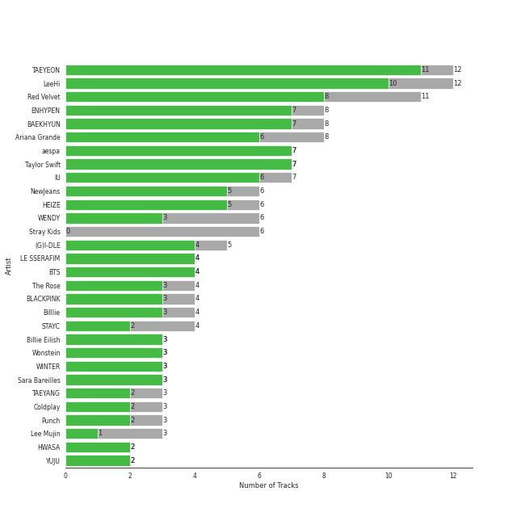
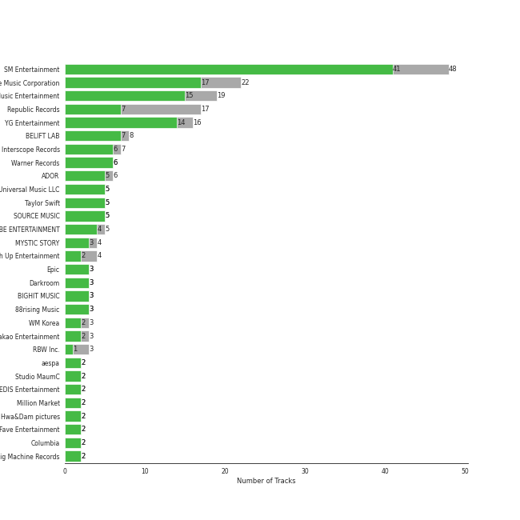
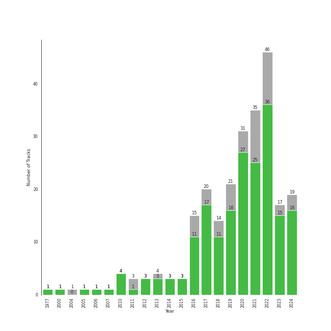

# Chill

[217 tracks (173 liked) 🔗](https://open.spotify.com/playlist/79HDmDfCjzdHS3oWXdgHGb)

[See Track Features](audio_features.md)

[See Clusters](clusters/overview.md)

## Top Artists

| Art | Tracks | 💚 | Artist | 🔗 |
|:---|---:|---:|:---|:---|
|  | 12 | 11 | [LeeHi](../../artists/leehi/overview.md) | [🔗](https://open.spotify.com/artist/7cVZApDoQZpS447nHTsNqu) |
|  | 12 | 10 | [TAEYEON](../../artists/taeyeon/overview.md) | [🔗](https://open.spotify.com/artist/3qNVuliS40BLgXGxhdBdqu) |
|  | 8 | 8 | [Taylor Swift](../../artists/taylor_swift/overview.md) | [🔗](https://open.spotify.com/artist/06HL4z0CvFAxyc27GXpf02) |
|  | 8 | 7 | [BAEKHYUN](../../artists/baekhyun/overview.md) | [🔗](https://open.spotify.com/artist/4ufh0WuMZh6y4Dmdnklvdl) |
|  | 7 | 6 | [IU](../../artists/iu/overview.md) | [🔗](https://open.spotify.com/artist/3HqSLMAZ3g3d5poNaI7GOU) |
|  | 9 | 5 | [Red Velvet](../../artists/red_velvet/overview.md) | [🔗](https://open.spotify.com/artist/1z4g3DjTBBZKhvAroFlhOM) |
|  | 7 | 5 | [aespa](../../artists/aespa/overview.md) | [🔗](https://open.spotify.com/artist/6YVMFz59CuY7ngCxTxjpxE) |
|  | 5 | 5 | [ENHYPEN](../../artists/enhypen/overview.md) | [🔗](https://open.spotify.com/artist/5t5FqBwTcgKTaWmfEbwQY9) |
|  | 5 | 4 | [HEIZE](../../artists/heize/overview.md) | [🔗](https://open.spotify.com/artist/5dCvSnVduaFleCnyy98JMo) |
|  | 5 | 4 | [BTS](../../artists/bts/overview.md) | [🔗](https://open.spotify.com/artist/3Nrfpe0tUJi4K4DXYWgMUX) |

See top 100 artists

| Art | Tracks | 💚 | Artist | 🔗 |
|:---|---:|---:|:---|:---|
|  | 5 | 4 | [(G)I-DLE](../../artists/_g_i_dle/overview.md) | [🔗](https://open.spotify.com/artist/2AfmfGFbe0A0WsTYm0SDTx) |
|  | 7 | 3 | [WENDY](../../artists/wendy/overview.md) | [🔗](https://open.spotify.com/artist/0FRUZvZNPzM3YJMABJxf2K) |
|  | 4 | 3 | [NewJeans](../../artists/newjeans/overview.md) | [🔗](https://open.spotify.com/artist/6HvZYsbFfjnjFrWF950C9d) |
|  | 4 | 3 | The Rose | [🔗](https://open.spotify.com/artist/5na1LmEmK2VzNLje9snJYW) |
|  | 4 | 3 | [BLACKPINK](../../artists/blackpink/overview.md) | [🔗](https://open.spotify.com/artist/41MozSoPIsD1dJM0CLPjZF) |
|  | 3 | 3 | [Billie Eilish](../../artists/billie_eilish/overview.md) | [🔗](https://open.spotify.com/artist/6qqNVTkY8uBg9cP3Jd7DAH) |
|  | 3 | 3 | [Ariana Grande](../../artists/ariana_grande/overview.md) | [🔗](https://open.spotify.com/artist/66CXWjxzNUsdJxJ2JdwvnR) |
|  | 3 | 3 | Wonstein | [🔗](https://open.spotify.com/artist/5o615XColiSVMPDWlslKSk) |
|  | 3 | 3 | [LE SSERAFIM](../../artists/le_sserafim/overview.md) | [🔗](https://open.spotify.com/artist/4SpbR6yFEvexJuaBpgAU5p) |
|  | 3 | 3 | WINTER | [🔗](https://open.spotify.com/artist/3mPquBmMu97Iq9TpzQ6ayI) |
|  | 3 | 3 | [Sara Bareilles](../../artists/sara_bareilles/overview.md) | [🔗](https://open.spotify.com/artist/2Sqr0DXoaYABbjBo9HaMkM) |
|  | 4 | 2 | Lee Mujin | [🔗](https://open.spotify.com/artist/4Xj0peBt3EZHbdF20JmdWC) |
|  | 4 | 2 | [STAYC](../../artists/stayc/overview.md) | [🔗](https://open.spotify.com/artist/01XYiBYaoMJcNhPokrg0l0) |
|  | 3 | 2 | TAEYANG | [🔗](https://open.spotify.com/artist/6udveWUgX4vu75FF0DTrXV) |
|  | 3 | 2 | [Billlie](../../artists/billlie/overview.md) | [🔗](https://open.spotify.com/artist/2GQxKDojobwBjZMPf7aoh0) |
|  | 2 | 2 | [HWASA](../../artists/hwasa/overview.md) | [🔗](https://open.spotify.com/artist/7bmYpVgQub656uNTu6qGNQ) |
|  | 2 | 2 | YUJU | [🔗](https://open.spotify.com/artist/7Bu0r4MCDX3sbhcFD5IXyx) |
|  | 2 | 2 | Crush | [🔗](https://open.spotify.com/artist/6aLdhHUqgdKE86xbtNmY8g) |
|  | 2 | 2 | TAEYONG | [🔗](https://open.spotify.com/artist/6SKusTjOAPsTZ6kareKQdm) |
|  | 2 | 2 | John Legend | [🔗](https://open.spotify.com/artist/5y2Xq6xcjJb2jVM54GHK3t) |
|  | 2 | 2 | [Coldplay](../../artists/coldplay/overview.md) | [🔗](https://open.spotify.com/artist/4gzpq5DPGxSnKTe4SA8HAU) |
|  | 2 | 2 | Jay Park | [🔗](https://open.spotify.com/artist/4XDi67ZENZcbfKnvMnTYsI) |
|  | 2 | 2 | BIGBANG | [🔗](https://open.spotify.com/artist/4Kxlr1PRlDKEB0ekOCyHgX) |
|  | 2 | 2 | Loco | [🔗](https://open.spotify.com/artist/2e4G04F77jxVuDYo44TCSm) |
|  | 2 | 2 | [PENTAGON](../../artists/pentagon/overview.md) | [🔗](https://open.spotify.com/artist/1wKpMkucynaTfG8lyPprYV) |
|  | 2 | 2 | SURAN | [🔗](https://open.spotify.com/artist/1mORehSVEd7lcaT2d7Sl2K) |
|  | 2 | 2 | SUGA | [🔗](https://open.spotify.com/artist/0ebNdVaOfp6N0oZ1guIxM8) |
|  | 2 | 2 | Sunwoojunga | [🔗](https://open.spotify.com/artist/04L3elxyr0XFua2Ek3domW) |
|  | 2 | 1 | [TWICE](../../artists/twice/overview.md) | [🔗](https://open.spotify.com/artist/7n2Ycct7Beij7Dj7meI4X0) |
|  | 2 | 1 | MeloMance | [🔗](https://open.spotify.com/artist/6k4r73Wq8nhkCDoUsECL1e) |
|  | 2 | 1 | YUKIKA | [🔗](https://open.spotify.com/artist/4RfI1z9u2xIc5Qnqac4JbO) |
|  | 2 | 1 | Seori | [🔗](https://open.spotify.com/artist/2bWTIIQP9zaVc55RaMGu7e) |
|  | 2 | 1 | Sandeul | [🔗](https://open.spotify.com/artist/2QeJBmgBdpH4i3uJns5Rdx) |
|  | 2 | 1 | Punch | [🔗](https://open.spotify.com/artist/2FgZrgTMX6Sk0VNcOsEPmm) |
|  | 1 | 1 | [SEVENTEEN](../../artists/seventeen/overview.md) | [🔗](https://open.spotify.com/artist/7nqOGRxlXj7N2JYbgNEjYH) |
| | 1 | 1 | Jang Yi-jeong | [🔗](https://open.spotify.com/artist/7nLakaHt1koh5mP4OIVM0F) |
|  | 1 | 1 | [NCT 127](../../artists/nct_127/overview.md) | [🔗](https://open.spotify.com/artist/7f4ignuCJhLXfZ9giKT7rH) |
|  | 1 | 1 | MAX CHANGMIN | [🔗](https://open.spotify.com/artist/7FiAkNWMb6ZBYI8tbQLuIS) |
|  | 1 | 1 | JIHYO | [🔗](https://open.spotify.com/artist/7F1iAHRYxR3MY7yAEuFqgL) |
|  | 1 | 1 | WOOGIE | [🔗](https://open.spotify.com/artist/7C0lSOS41UnTbnF7bMSEWN) |
|  | 1 | 1 | The Neighbourhood | [🔗](https://open.spotify.com/artist/77SW9BnxLY8rJ0RciFqkHh) |
|  | 1 | 1 | SHAUN | [🔗](https://open.spotify.com/artist/72nLe76yBFSlP6VBzME358) |
|  | 1 | 1 | MARK | [🔗](https://open.spotify.com/artist/70DFixYAFPv4Pf9kgSfR9O) |
|  | 1 | 1 | [GOT the beat](../../artists/got_the_beat/overview.md) | [🔗](https://open.spotify.com/artist/6uNxlIP5lzPFf0BHuELOuX) |
|  | 1 | 1 | Commodores | [🔗](https://open.spotify.com/artist/6twIAGnYuIT1pncMAsXnEm) |
|  | 1 | 1 | TVXQ! | [🔗](https://open.spotify.com/artist/6nVMMEywS5Y4tsHPKx1nIo) |
|  | 1 | 1 | Lord Huron | [🔗](https://open.spotify.com/artist/6ltzsmQQbmdoHHbLZ4ZN25) |
|  | 1 | 1 | H 3 F | [🔗](https://open.spotify.com/artist/6jIK3obS1fJqb3Vu74AYX3) |
|  | 1 | 1 | Fujii Kaze | [🔗](https://open.spotify.com/artist/6bDWAcdtVR3WHz2xtiIPUi) |
|  | 1 | 1 | Silk Sonic | [🔗](https://open.spotify.com/artist/6PvvGcCY2XtUcSRld1Wilr) |
|  | 1 | 1 | [AKMU](../../artists/akmu/overview.md) | [🔗](https://open.spotify.com/artist/6OwKE9Ez6ALxpTaKcT5ayv) |
|  | 1 | 1 | [SUNMI](../../artists/sunmi/overview.md) | [🔗](https://open.spotify.com/artist/6MoXcK2GyGg7FIyxPU5yW6) |
|  | 1 | 1 | Khalid | [🔗](https://open.spotify.com/artist/6LuN9FCkKOj5PcnpouEgny) |
|  | 1 | 1 | Younha | [🔗](https://open.spotify.com/artist/6GwM5CHqhWXzG3l5kzRSAS) |
| | 1 | 1 | Nam Joohyuk | [🔗](https://open.spotify.com/artist/69ybhMoBUPmIcH4MyDARDv) |
|  | 1 | 1 | JIN | [🔗](https://open.spotify.com/artist/5vV3bFXnN6D6N3Nj4xRvaV) |
|  | 1 | 1 | NINGNING | [🔗](https://open.spotify.com/artist/5t1uryofgueHrjrryqX8vM) |
|  | 1 | 1 | MINGYU | [🔗](https://open.spotify.com/artist/5gUpo0BRmo6EOTbyU3z5Ay) |
| | 1 | 1 | Bona(WJSN) | [🔗](https://open.spotify.com/artist/5EHm62VI2botfXyNvboLlL) |
|  | 1 | 1 | Gracie Abrams | [🔗](https://open.spotify.com/artist/4tuJ0bMpJh08umKkEXKUI5) |
|  | 1 | 1 | YESUNG | [🔗](https://open.spotify.com/artist/4hyF8Vtc73RYJr3RgTE2Zf) |
|  | 1 | 1 | Adele | [🔗](https://open.spotify.com/artist/4dpARuHxo51G3z768sgnrY) |
| | 1 | 1 | Lee Joomyung | [🔗](https://open.spotify.com/artist/4dN1DsKUXV6xugiarFBAa6) |
|  | 1 | 1 | Suzy | [🔗](https://open.spotify.com/artist/4U80LJd8sG6U9YTFP5izka) |
|  | 1 | 1 | 6LACK | [🔗](https://open.spotify.com/artist/4IVAbR2w4JJNJDDRFP3E83) |
|  | 1 | 1 | FIFTY FIFTY | [🔗](https://open.spotify.com/artist/4GJ6xDCF5jaUqD6avOuQT6) |
|  | 1 | 1 | QUIN | [🔗](https://open.spotify.com/artist/3sHS70DMNgPxRqx2fUNrRA) |
|  | 1 | 1 | WONWOO | [🔗](https://open.spotify.com/artist/3rHcBT06Vb1XGVUWhDALZt) |
|  | 1 | 1 | Anderson .Paak | [🔗](https://open.spotify.com/artist/3jK9MiCrA42lLAdMGUZpwa) |
|  | 1 | 1 | CHANGMO | [🔗](https://open.spotify.com/artist/3hvinNZRzTLoREmqFiKr1b) |
|  | 1 | 1 | ROSÉ | [🔗](https://open.spotify.com/artist/3eVa5w3URK5duf6eyVDbu9) |
|  | 1 | 1 | Troye Sivan | [🔗](https://open.spotify.com/artist/3WGpXCj9YhhfX11TToZcXP) |
|  | 1 | 1 | [TREASURE](../../artists/treasure/overview.md) | [🔗](https://open.spotify.com/artist/3KonOYiLsU53m4yT7gNotP) |
|  | 1 | 1 | V | [🔗](https://open.spotify.com/artist/3JsHnjpbhX4SnySpvpa9DK) |
|  | 1 | 1 | G-DRAGON | [🔗](https://open.spotify.com/artist/30b9WulBM8sFuBo17nNq9c) |
|  | 1 | 1 | george | [🔗](https://open.spotify.com/artist/2pRZp2WxvnWWiSPcSSYkNV) |
|  | 1 | 1 | Frank Ocean | [🔗](https://open.spotify.com/artist/2h93pZq0e7k5yf4dywlkpM) |
|  | 1 | 1 | Birdy | [🔗](https://open.spotify.com/artist/2WX2uTcsvV5OnS0inACecP) |
|  | 1 | 1 | LUNCH | [🔗](https://open.spotify.com/artist/2UVzzx3MOPYV3l6xW2lzBv) |
|  | 1 | 1 | [ITZY](../../artists/itzy/overview.md) | [🔗](https://open.spotify.com/artist/2KC9Qb60EaY0kW4eH68vr3) |
|  | 1 | 1 | D.O. | [🔗](https://open.spotify.com/artist/2CQZr2RPZmrcvDnaod1ldC) |
|  | 1 | 1 | Corinne Bailey Rae | [🔗](https://open.spotify.com/artist/29WzbAQtDnBJF09es0uddn) |
|  | 1 | 1 | Halsey | [🔗](https://open.spotify.com/artist/26VFTg2z8YR0cCuwLzESi2) |
|  | 1 | 1 | nævis | [🔗](https://open.spotify.com/artist/2067CjQ2nC56cRZX8goeHg) |
| | 1 | 1 | Choi Hyunwook | [🔗](https://open.spotify.com/artist/1z2J8XtoQxczs0U1lMWEiZ) |
|  | 1 | 1 | TAEIL | [🔗](https://open.spotify.com/artist/1z0Hi3myYw4x32xCq0H3aq) |
|  | 1 | 1 | [Justin Bieber](../../artists/justin_bieber/overview.md) | [🔗](https://open.spotify.com/artist/1uNFoZAHBGtllmzznpCI3s) |
|  | 1 | 1 | [Jackson Wang](../../artists/jackson_wang/overview.md) | [🔗](https://open.spotify.com/artist/1kfWoWgCugPkyxQP8lkRlY) |
|  | 1 | 1 | MAX | [🔗](https://open.spotify.com/artist/1bqxdqvUtPWZri43cKHac8) |
|  | 1 | 1 | The Weeknd | [🔗](https://open.spotify.com/artist/1Xyo4u8uXC1ZmMpatF05PJ) |

## Top Albums

| Art | Tracks | 💚 | Album | Release Date | 🔗 |
|:---|---:|---:|:---|:---|:---|
|  | 4 | 4 | Twenty-Five Twenty-One OST | 2022-04-03 | [🔗](https://open.spotify.com/album/77NPr874WU941XZhjO43dR) |
|  | 4 | 4 | 4 ONLY | 2021-09-09 | [🔗](https://open.spotify.com/album/1DKgZeAYrjslAPZVMe6EFt) |
|  | 4 | 0 | SKZ-REPLAY | 2022-12-21 | [🔗](https://open.spotify.com/album/3UXrliH0JUQvcaLnBD8Txz) |
|  | 3 | 3 | folklore | 2020-07-24 | [🔗](https://open.spotify.com/album/2fenSS68JI1h4Fo296JfGr) |
|  | 3 | 2 | MY WORLD - The 3rd Mini Album | 2023-05-08 | [🔗](https://open.spotify.com/album/69xF8jTd0c4Zoo7DT3Rwrn) |
|  | 3 | 2 | Girls - The 2nd Mini Album | 2022-07-08 | [🔗](https://open.spotify.com/album/4w1dbvUy1crv0knXQvcSeY) |
|  | 3 | 2 | Bambi - The 3rd Mini Album | 2021-03-30 | [🔗](https://open.spotify.com/album/5xOx4mWABbTj0qWyZC4q1p) |
|  | 2 | 2 | reputation | 2017-11-10 | [🔗](https://open.spotify.com/album/6DEjYFkNZh67HP7R9PSZvv) |
|  | 2 | 2 | YOUNG-LUV.COM | 2022-02-21 | [🔗](https://open.spotify.com/album/2xPdgNkM4yIQmP7axJ1T1o) |
|  | 2 | 2 | What Do I Call You - The 4th Mini Album | 2020-12-15 | [🔗](https://open.spotify.com/album/70XJeDlFe1LmZo1lyFKyq3) |

See top 100 albums

| Art | Tracks | 💚 | Album | Release Date | 🔗 |
|:---|---:|---:|:---|:---|:---|
|  | 2 | 2 | THE ALBUM | 2020-10-02 | [🔗](https://open.spotify.com/album/71O60S5gIJSIAhdnrDIh3N) |
|  | 2 | 2 | SEOULITE | 2016-03-09 | [🔗](https://open.spotify.com/album/2c41Flo2HQgy0A9P3xuSFf) |
|  | 2 | 2 | Like Water - The 1st Mini Album | 2021-04-05 | [🔗](https://open.spotify.com/album/1Ao5vWPO13f4l0ldwxOKL7) |
|  | 2 | 2 | FEARLESS | 2022-05-02 | [🔗](https://open.spotify.com/album/4Mc7WwYH41hgUWeKX25Sot) |
|  | 2 | 2 | Amidst the Chaos (Bonus Version) | 2019-05-10 | [🔗](https://open.spotify.com/album/5x2sDapUIdq0qk1ezff3gm) |
|  | 2 | 1 | Perfect Velvet - The 2nd Album | 2017-11-17 | [🔗](https://open.spotify.com/album/0rvrbZvaDX5S9ZBhwOwFfH) |
|  | 2 | 1 | NewJeans 1st EP 'New Jeans' | 2022-08-01 | [🔗](https://open.spotify.com/album/1HMLpmZAnNyl9pxvOnTovV) |
|  | 2 | 1 | I NEVER DIE | 2022-03-14 | [🔗](https://open.spotify.com/album/1T2W9vDajFreUuycPDjUXk) |
|  | 2 | 0 | Purpose - The 2nd Album | 2019-10-28 | [🔗](https://open.spotify.com/album/0h6wCpdgpSOAbYDDYJVuwr) |
|  | 2 | 0 | NOEASY | 2021-08-23 | [🔗](https://open.spotify.com/album/558tpdCejjVQNFAumRAeQj) |
|  | 1 | 1 | 공감 (Empathy) - The 1st Mini Album | 2021-07-26 | [🔗](https://open.spotify.com/album/4dqWy2Soq1Z1rqgKfXOATk) |
|  | 1 | 1 | 壱 | 2022-01-12 | [🔗](https://open.spotify.com/album/1YWoHzj5wHnG7m6gLlwBQd) |
|  | 1 | 1 | ‘The ReVe Festival 2022 - Feel My Rhythm’ | 2022-03-21 | [🔗](https://open.spotify.com/album/3HgoCO9wWuPcNhz8Ip4C46) |
|  | 1 | 1 | the Billage of perception: chapter three | 2023-03-28 | [🔗](https://open.spotify.com/album/5bt0sTLia4il2rIlpqUo5g) |
|  | 1 | 1 | the Billage of perception : chapter one | 2021-11-10 | [🔗](https://open.spotify.com/album/1kp4txZsSpDNR4EoDFi2LD) |
|  | 1 | 1 | thank u, next | 2019-02-08 | [🔗](https://open.spotify.com/album/2fYhqwDWXjbpjaIJPEfKFw) |
|  | 1 | 1 | minor | 2020-07-14 | [🔗](https://open.spotify.com/album/2UZw04wDxLVceADw2Gi1Qy) |
|  | 1 | 1 | lovely (with Khalid) | 2018-04-19 | [🔗](https://open.spotify.com/album/2sBB17RXTamvj7Ncps15AK) |
|  | 1 | 1 | evermore | 2020-12-11 | [🔗](https://open.spotify.com/album/2Xoteh7uEpea4TohMxjtaq) |
|  | 1 | 1 | dont smile at me | 2017-12-22 | [🔗](https://open.spotify.com/album/7fRrTyKvE4Skh93v97gtcU) |
|  | 1 | 1 | channel ORANGE | 2012-07-10 | [🔗](https://open.spotify.com/album/392p3shh2jkxUxY2VHvlH8) |
|  | 1 | 1 | [REC.] | 2022-01-18 | [🔗](https://open.spotify.com/album/6ofVW04Q32gN1Hxk50S9Fi) |
|  | 1 | 1 | You Never Walk Alone | 2017-02-13 | [🔗](https://open.spotify.com/album/6THpewjqJ15ORBJkh5CEYb) |
|  | 1 | 1 | YOUNHA 6th Album Repackage 'END THEORY : Final Edition' | 2022-03-30 | [🔗](https://open.spotify.com/album/63mur6I6yCG9cOxOst3i7c) |
|  | 1 | 1 | X&Y | 2005-06-07 | [🔗](https://open.spotify.com/album/4E7bV0pzG0LciBSWTszra6) |
|  | 1 | 1 | Written In The Stars | 2018-10-11 | [🔗](https://open.spotify.com/album/08z3DsL7P6RpBR3FgNMSvN) |
|  | 1 | 1 | Wish & Wind | 2018-03-08 | [🔗](https://open.spotify.com/album/5Fs2dlwUz1zkNcUPu6KaKF) |
|  | 1 | 1 | When it snows(Feat.Heize) | 2021-12-03 | [🔗](https://open.spotify.com/album/1d2YKQ02RQA97EyrB55ZcK) |
|  | 1 | 1 | When Night Is Falling | 2021-07-07 | [🔗](https://open.spotify.com/album/3nOIsILeko2meMblKEGYZw) |
|  | 1 | 1 | WINE | 2017-04-27 | [🔗](https://open.spotify.com/album/26adxLsliyYcCfVTF6xA75) |
|  | 1 | 1 | WHEN WE ALL FALL ASLEEP, WHERE DO WE GO? | 2019-03-29 | [🔗](https://open.spotify.com/album/0S0KGZnfBGSIssfF54WSJh) |
|  | 1 | 1 | Village | 2018-11-02 | [🔗](https://open.spotify.com/album/2KxC2M0bVm5hrK3GgGMuV9) |
|  | 1 | 1 | Twicetagram | 2017-10-30 | [🔗](https://open.spotify.com/album/3hJXmK5gWN9P6jtZL0Lr2y) |
|  | 1 | 1 | Traffic light | 2021-05-14 | [🔗](https://open.spotify.com/album/4lHGpxL8peLQSZRgl1Lssm) |
|  | 1 | 1 | The Velvet - The 2nd Mini Album | 2016-03-17 | [🔗](https://open.spotify.com/album/2qgl7dAgslqL1w2l2wQhMA) |
|  | 1 | 1 | The Prelude | 2020-07-17 | [🔗](https://open.spotify.com/album/3Qj2vsFzmaB8jcH6Q60WIG) |
|  | 1 | 1 | The Hyena on the Keyboard Pt. 4 | 2018-04-21 | [🔗](https://open.spotify.com/album/2fMMk4DD96UcAmSczUQ0kq) |
|  | 1 | 1 | The Beginning: Cupid | 2023-02-24 | [🔗](https://open.spotify.com/album/5letLUZIFsQikJYShfGNs4) |
|  | 1 | 1 | Take | 2018-06-27 | [🔗](https://open.spotify.com/album/1NgwpxtZFd1x4DbC74V9bO) |
|  | 1 | 1 | THE SECOND STEP : CHAPTER ONE | 2022-02-15 | [🔗](https://open.spotify.com/album/17l09k7ZDb4GYwmsIVGcRZ) |
|  | 1 | 1 | Stuck with U | 2020-05-08 | [🔗](https://open.spotify.com/album/5mUdh6YWnUvf0MfklEk1oi) |
|  | 1 | 1 | Strange Trails | 2015-04-07 | [🔗](https://open.spotify.com/album/3yoNZlqerJnsnMN5EDwwBS) |
|  | 1 | 1 | Still Life | 2022-04-05 | [🔗](https://open.spotify.com/album/2oCAY48bhZvQte0l7apmYC) |
|  | 1 | 1 | Stamp On It - The 1st Mini Album | 2023-01-16 | [🔗](https://open.spotify.com/album/2Gxd1fr4RFHVNx6IxGr9I7) |
|  | 1 | 1 | Sorry | 2017-08-03 | [🔗](https://open.spotify.com/album/6D48tHXsa6LzoViDIACdkt) |
|  | 1 | 1 | Solar International | 2010-08-19 | [🔗](https://open.spotify.com/album/42BVvYE1FLO8mQH0ZJn4de) |
|  | 1 | 1 | Slightly Tipsy (She is My Type♡ X SANDEUL) | 2020-07-20 | [🔗](https://open.spotify.com/album/2bal48tjyi26OAxY2KxwFL) |
|  | 1 | 1 | Serenade | 2019-12-12 | [🔗](https://open.spotify.com/album/2McJE8dHLru3MgR1bcxdyF) |
|  | 1 | 1 | Savage - The 1st Mini Album | 2021-10-05 | [🔗](https://open.spotify.com/album/3vyyDkvYWC36DwgZCYd3Wu) |
|  | 1 | 1 | SUGA's Interlude | 2019-12-06 | [🔗](https://open.spotify.com/album/0JfaSjTaej3QB27ofjnbQV) |
|  | 1 | 1 | SEVENTEEN 4th Album 'Face the Sun' | 2022-05-27 | [🔗](https://open.spotify.com/album/4lfFgz2rD1irxf7dZhNJht) |
|  | 1 | 1 | SEOULITE | 2016-04-20 | [🔗](https://open.spotify.com/album/3cGyWEJaQlj7kCdKBCOGeb) |
|  | 1 | 1 | SAILING | 2019-09-25 | [🔗](https://open.spotify.com/album/7C0Ci0alKWwwXPIFYEdVcn) |
|  | 1 | 1 | Red | 2012-10-22 | [🔗](https://open.spotify.com/album/1EoDsNmgTLtmwe1BDAVxV5) |
|  | 1 | 1 | Rain - SM STATION | 2016-02-03 | [🔗](https://open.spotify.com/album/5MgY1E2inbDcthAQEzwz8L) |
|  | 1 | 1 | RISE | 2014-06-03 | [🔗](https://open.spotify.com/album/1Y9so4jq4t4taAHu0VdKX3) |
|  | 1 | 1 | RED MOON | 2018-07-16 | [🔗](https://open.spotify.com/album/6GhELYbXRo1LOqRPOCsQrF) |
|  | 1 | 1 | RED | 2019-08-13 | [🔗](https://open.spotify.com/album/5CrMZwZuJcDpzFmMO35vxN) |
|  | 1 | 1 | R | 2021-03-12 | [🔗](https://open.spotify.com/album/5BQcoDfcZ8aBcikYX9B7Ob) |
|  | 1 | 1 | Parachutes | 2000-07-10 | [🔗](https://open.spotify.com/album/6ZG5lRT77aJ3btmArcykra) |
|  | 1 | 1 | Palette | 2017-04-21 | [🔗](https://open.spotify.com/album/5V8n6fqyAPxvFTibPhQVcp) |
|  | 1 | 1 | Our Blues, Pt. 10 (Original Television Soundtrack) | 2022-05-22 | [🔗](https://open.spotify.com/album/0mP330aRyX4P4ZjarRKnXO) |
|  | 1 | 1 | NewJeans 'OMG' | 2023-01-02 | [🔗](https://open.spotify.com/album/45ozep8uHHnj5CCittuyXj) |
|  | 1 | 1 | New Chapter #1: The Chance of Love - The 8th Album | 2018-03-28 | [🔗](https://open.spotify.com/album/0ipyHYAE0cMf4aDJNIDIU1) |
|  | 1 | 1 | NEON | 2019-02-22 | [🔗](https://open.spotify.com/album/2tF9C0qTzRdaZShK4iK0UD) |
|  | 1 | 1 | My Voice - The 1st Album (Deluxe Edition) | 2017-04-05 | [🔗](https://open.spotify.com/album/7MG0bxf0ZFsAyej9W3XzTO) |
|  | 1 | 1 | My Voice - The 1st Album | 2017-02-28 | [🔗](https://open.spotify.com/album/6DlCl3hBP1Gwhn0tgitGfN) |
|  | 1 | 1 | My Everything (Deluxe) | 2014-08-25 | [🔗](https://open.spotify.com/album/6EVYTRG1drKdO8OnIQBeEj) |
|  | 1 | 1 | Moonlovers - Scarlet Heart Ryeo (Original Television Soundtrack), Pt. 2 | 2016-08-29 | [🔗](https://open.spotify.com/album/68xTLBWjoRADRf86WYmTmy) |
|  | 1 | 1 | Modern Times – Epilogue | 2013-12-20 | [🔗](https://open.spotify.com/album/56MqewtCUq5bplrqEYTVL0) |
|  | 1 | 1 | Midnights | 2022-10-21 | [🔗](https://open.spotify.com/album/151w1FgRZfnKZA9FEcg9Z3) |
|  | 1 | 1 | Meow the secret boy 어서와 (Original Television Soundtrack), Pt.11 | 2020-04-23 | [🔗](https://open.spotify.com/album/0ZqZDky3PSbzKgHJzvSRuJ) |
|  | 1 | 1 | MOVE - The 2nd Album | 2017-10-16 | [🔗](https://open.spotify.com/album/2Ka8QpE2XUUjL4vOQihkJH) |
|  | 1 | 1 | MANIFESTO : DAY 1 | 2022-07-04 | [🔗](https://open.spotify.com/album/5J8MNLLViH5zqM6VoGErz8) |
|  | 1 | 1 | MADE | 2016-12-13 | [🔗](https://open.spotify.com/album/2SPrl8C8pgSM5gXbAiyJHY) |
|  | 1 | 1 | Love, Maybe (A Business Proposal OST Special Track) | 2022-02-18 | [🔗](https://open.spotify.com/album/5lKdnY9bGYUyfaJhcRnHgk) |
|  | 1 | 1 | Love poem | 2019-11-18 | [🔗](https://open.spotify.com/album/2xEH7SRzJq7LgA0fCtTlxH) |
|  | 1 | 1 | Love Yourself 結 'Answer' | 2018-08-24 | [🔗](https://open.spotify.com/album/43wFM1HquliY3iwKWzPN4y) |
|  | 1 | 1 | Love Theory - SM STATION | 2022-04-14 | [🔗](https://open.spotify.com/album/2i27IzG4jFQjX7pS5L6TIu) |
|  | 1 | 1 | Love Story | 2017-11-10 | [🔗](https://open.spotify.com/album/0H9qbHCWJRmKAhERqM5X9G) |
|  | 1 | 1 | Love Rain | 2018-06-29 | [🔗](https://open.spotify.com/album/40fAbWLsPvL0nUuiDCwxHu) |
|  | 1 | 1 | Love In The Future (Expanded Edition) | 2013-08-30 | [🔗](https://open.spotify.com/album/4OTAx9un4e6NfoHuVRiOrC) |
|  | 1 | 1 | LUCID | 2019-11-15 | [🔗](https://open.spotify.com/album/5qQhQ1rmPjqQgv8RmfaQU3) |
|  | 1 | 1 | LOVE or TAKE | 2021-03-15 | [🔗](https://open.spotify.com/album/5iu1d69dqEo9UaKpZDYoIV) |
|  | 1 | 1 | Kaleidoscope Heart | 2010-09-07 | [🔗](https://open.spotify.com/album/627ukPRwYxyBREHxBq0vGJ) |
|  | 1 | 1 | KWON JI YONG | 2017-06-08 | [🔗](https://open.spotify.com/album/2koSNfchdUxqw1rPJO87aH) |
|  | 1 | 1 | Jirisan (Original Television Soundtrack) Pt. 4 | 2021-11-07 | [🔗](https://open.spotify.com/album/2FUiBNFWz47sBPEf3Dcma4) |
|  | 1 | 1 | Ice Cream Cake - The 1st Mini Album | 2015-03-17 | [🔗](https://open.spotify.com/album/27cBQ5FDqv0xLgiJ7qNpZr) |
|  | 1 | 1 | ITAEWON CLASS (Original Television Soundtrack) Pt. 12 | 2020-03-13 | [🔗](https://open.spotify.com/album/1q3j12Y1sp2eqqffSnyA93) |
|  | 1 | 1 | IN:VITE U | 2022-01-24 | [🔗](https://open.spotify.com/album/5vxZM8rFJiNvjtAThYnwek) |

## Top Record Labels

| Tracks | 💚 | Label |
|---:|---:|:---|
| 41 | 31 | [SM Entertainment](../../labels/sm_entertainment/overview.md) |
| 16 | 15 | [YG Entertainment](../../labels/yg_entertainment/overview.md) |
| 18 | 13 | [Genie Music Corporation](../../labels/genie_music_corporation/overview.md) |
| 17 | 13 | [Stone Music Entertainment](../../labels/stone_music_entertainment/overview.md) |
| 7 | 6 | [Interscope Records](../../labels/interscope_records/overview.md) |
| 7 | 5 | [Warner Records](../../labels/warner_records/overview.md) |
| 5 | 5 | [Taylor Swift](../../labels/taylor_swift/overview.md) |
| 5 | 5 | [BELIFT LAB](../../labels/belift_lab/overview.md) |
| 11 | 4 | [Republic Records](../../labels/republic_records/overview.md) |
| 5 | 4 | [CUBE ENTERTAINMENT](../../labels/cube_entertainment/overview.md) |

See all 87 labels

| Tracks | 💚 | Label |
|---:|---:|:---|
| 4 | 4 | [Universal Music LLC](../../labels/universal_music_llc/overview.md) |
| 4 | 4 | Studio MaumC |
| 4 | 4 | [SOURCE MUSIC](../../labels/source_music/overview.md) |
| 4 | 4 | Hwa&Dam pictures |
| 4 | 3 | [BIGHIT MUSIC](../../labels/bighit_music/overview.md) |
| 4 | 3 | [ADOR](../../labels/ador/overview.md) |
| 3 | 3 | [Epic](../../labels/epic/overview.md) |
| 3 | 3 | [Darkroom](../../labels/darkroom/overview.md) |
| 3 | 3 | [Big Machine Records](../../labels/big_machine_records/overview.md) |
| 4 | 2 | [High Up Entertainment](../../labels/high_up_entertainment/overview.md) |
| 3 | 2 | [WM Korea](../../labels/wm_korea/overview.md) |
| 3 | 2 | [RBW Inc.](../../labels/rbw_inc_/overview.md) |
| 3 | 2 | [MYSTIC STORY](../../labels/mystic_story/overview.md) |
| 3 | 2 | [Kakao Entertainment](../../labels/kakao_entertainment/overview.md) |
| 2 | 2 | ShowPLAY ENTERTAINMENT |
| 2 | 2 | [PLEDIS Entertainment](../../labels/pledis_entertainment/overview.md) |
| 2 | 2 | Million Market |
| 2 | 2 | MAGIC STRAWBERRY SOUND |
| 2 | 2 | Fave Entertainment |
| 2 | 2 | [Columbia](../../labels/columbia/overview.md) |
| 2 | 2 | [Atlantic Records](../../labels/atlantic_records/overview.md) |
| 2 | 2 | [88rising Music](../../labels/88rising_music/overview.md) |
| 2 | 1 | [JYP Entertainment](../../labels/jyp_entertainment/overview.md) |
| 2 | 1 | FNC인베스트먼트 |
| 2 | 1 | FLEX M |
| 2 | 1 | [Capitol Records](../../labels/capitol_records/overview.md) |
| 2 | 1 | CJ E&M MUSIC |
| 1 | 1 | 에이스토리 |
| 1 | 1 | 스튜디오앤뉴 |
| 1 | 1 | 뮤직앤뉴 |
| 1 | 1 | 모스트콘텐츠 |
| 1 | 1 | under exclusive license to Interscope Records |
| 1 | 1 | msmedia |
| 1 | 1 | [avex trax](../../labels/avex_trax/overview.md) |
| 1 | 1 | [XL Recordings](../../labels/xl_recordings/overview.md) |
| 1 | 1 | UMGRI Interscope |
| 1 | 1 | Transparent Arts |
| 1 | 1 | TOON STUDIO |
| 1 | 1 | [Sony Music Labels Inc.](../../labels/sony_music_labels_inc_/overview.md) |
| 1 | 1 | Sony Music Entertainment |
| 1 | 1 | Red Zone Entertainment |
| 1 | 1 | [Polydor Records](../../labels/polydor_records/overview.md) |
| 1 | 1 | Parlophone UK |
| 1 | 1 | Parlophone Records Limited |
| 1 | 1 | MYSTIC Entertainment |
| 1 | 1 | [MOTOWN](../../labels/motown/overview.md) |
| 1 | 1 | MORE VISION |
| 1 | 1 | JOYFACE Records |
| 1 | 1 | IDJ |
| 1 | 1 | IAMSOUND |
| 1 | 1 | H 3 F |
| 1 | 1 | Gracie Abrams |
| 1 | 1 | G.O.O.D. Music |
| 1 | 1 | Fantasy Soul |
| 1 | 1 | ESTIMATE |
| 1 | 1 | EMI Recorded Music Australia Pty Ltd |
| 1 | 1 | EMI |
| 1 | 1 | Donuts Music N |
| 1 | 1 | DCTOM |
| 1 | 1 | Colour Vision Records |
| 1 | 1 | ChoongangICS |
| 1 | 1 | CRAFT AND JUN |
| 1 | 1 | C9 Entertainment |
| 1 | 1 | Atlantic Records UK |
| 1 | 1 | Ariana Grande & Justin Bieber "Stuck With U"- Charity |
| 1 | 1 | Aftermath Entertainment |
| 1 | 1 | Abyss Company |
| 1 | 1 | ATISPAUS |
| 1 | 1 | AOMG |
| 1 | 1 | ADA Korea |
| 1 | 1 | (주)블렌딩 |
| 1 | 0 | [WM Entertainment](../../labels/wm_entertainment/overview.md) |
| 1 | 0 | UBUNTU ENT |
| 1 | 0 | Today's Playlist |
| 1 | 0 | THEBLACKLABEL |
| 1 | 0 | [Jive](../../labels/jive/overview.md) |
| 1 | 0 | [HYBE](../../labels/hybe/overview.md) |

## Genres

| Tracks | 💚 | Genre |
|---:|---:|:---|
| 130 | 97 | [k-pop](../../genres/k_pop/overview.md) |
| 46 | 35 | [pop](../../genres/pop/overview.md) |
| 41 | 29 | [k-pop girl group](../../genres/k_pop_girl_group/overview.md) |
| 27 | 19 | [k-pop boy group](../../genres/k_pop_boy_group/overview.md) |
| 18 | 12 | [korean pop](../../genres/korean_pop/overview.md) |
| 17 | 12 | [korean r&b](../../genres/korean_r_b/overview.md) |
| 5 | 5 | [k-rap](../../genres/k_rap/overview.md) |
| 5 | 5 | [anime](../../genres/anime/overview.md) |
| 4 | 4 | [neo mellow](../../genres/neo_mellow/overview.md) |
| 4 | 4 | korean ost |

See all 65 genres

| Tracks | 💚 | Genre |
|---:|---:|:---|
| 4 | 4 | [art pop](../../genres/art_pop/overview.md) |
| 3 | 3 | [post-teen pop](../../genres/post_teen_pop/overview.md) |
| 3 | 3 | pop soul |
| 3 | 3 | [pop rock](../../genres/pop_rock/overview.md) |
| 3 | 3 | neo soul |
| 3 | 3 | [lilith](../../genres/lilith/overview.md) |
| 3 | 3 | [ectofolk](../../genres/ectofolk/overview.md) |
| 3 | 3 | [acoustic pop](../../genres/acoustic_pop/overview.md) |
| 3 | 2 | [uk pop](../../genres/uk_pop/overview.md) |
| 3 | 2 | korean city pop |
| 2 | 2 | [viral pop](../../genres/viral_pop/overview.md) |
| 2 | 2 | [soul](../../genres/soul/overview.md) |
| 2 | 2 | [permanent wave](../../genres/permanent_wave/overview.md) |
| 2 | 2 | k-indie |
| 2 | 2 | japanese teen pop |
| 2 | 2 | british soul |
| 1 | 1 | [urban contemporary](../../genres/urban_contemporary/overview.md) |
| 1 | 1 | uk contemporary r&b |
| 1 | 1 | thai indie pop |
| 1 | 1 | teen pop |
| 1 | 1 | stomp and holler |
| 1 | 1 | [soft rock](../../genres/soft_rock/overview.md) |
| 1 | 1 | singer-songwriter pop |
| 1 | 1 | quiet storm |
| 1 | 1 | pov: indie |
| 1 | 1 | motown |
| 1 | 1 | [modern rock](../../genres/modern_rock/overview.md) |
| 1 | 1 | modern alternative rock |
| 1 | 1 | [mellow gold](../../genres/mellow_gold/overview.md) |
| 1 | 1 | lgbtq+ hip hop |
| 1 | 1 | korean talent show |
| 1 | 1 | japanese singer-songwriter |
| 1 | 1 | [j-pop](../../genres/j_pop/overview.md) |
| 1 | 1 | j-division |
| 1 | 1 | indie r&b |
| 1 | 1 | indie poptimism |
| 1 | 1 | indie folk |
| 1 | 1 | funk |
| 1 | 1 | etherpop |
| 1 | 1 | [electropop](../../genres/electropop/overview.md) |
| 1 | 1 | disco |
| 1 | 1 | [dance pop](../../genres/dance_pop/overview.md) |
| 1 | 1 | [canadian pop](../../genres/canadian_pop/overview.md) |
| 1 | 1 | canadian contemporary r&b |
| 1 | 1 | bedroom soul |
| 1 | 1 | australian pop |
| 1 | 1 | asian american hip hop |
| 1 | 1 | alternative r&b |
| 1 | 1 | alt z |
| 1 | 1 | [adult standards](../../genres/adult_standards/overview.md) |
| 1 | 0 | [rap](../../genres/rap/overview.md) |
| 1 | 0 | [r&b](../../genres/r_b/overview.md) |
| 1 | 0 | pop rap |
| 1 | 0 | k-pop ballad |
| 1 | 0 | classic k-pop |

## Top Producers

| Art | Producer | Tracks | Credit Types |
|:---|:---|---:|:---|
|  | [Taylor Swift](../../artists/taylor_swift/overview.md) | 8 | Songwriter, Lyricist, Producer |
| | Serban Ghenea | 7 | Producer |
| | TEDDY | 4 | Producer, Songwriter, Arranger, Lyricist |
| | Aaron Dessner | 4 | Producer, Songwriter |
| | 24 | 4 | Arranger, Songwriter, Producer |
| | Kyle Resnick | 4 | Producer |
| | Bryce Dessner | 4 | Arranger |
| | Laura Sisk | 4 | Producer |
| | Jonathan Low | 4 | Producer |
| | 황민희 (Hwang, Min-hee) | 3 | Producer |

View all

| Art | Producer | Tracks | Credit Types |
|:---|:---|---:|:---|
|  | [JEON SOYEON](../../artists/jeon_soyeon/overview.md) | 3 | Lyricist, Arranger, Songwriter |
| | James McAlister | 3 | Producer |
| | FINNEAS | 3 | Producer, Songwriter, Lyricist |
| | SCORE | 3 | Arranger, Lyricist, Producer, Songwriter |
| | Josh Gudwin | 3 | Producer |
| | 전부연 (Jeon, Bu-yeon) | 3 | Producer |
|  | [Sara Bareilles](../../artists/sara_bareilles/overview.md) | 3 | Songwriter, Lyricist |
|  | [Ariana Grande](../../artists/ariana_grande/overview.md) | 3 | Producer, Songwriter |
| | 13 | 3 | Producer |
| | 김병석 (Kim, Byung-seok) | 3 | Arranger, Lyricist, Producer, Songwriter |
| | danke | 3 | Lyricist, Songwriter |
| | 이연수 (Lee, Yeon-soo) | 3 | Producer |
| | T-Bone Burnett | 2 | Producer |
| | Ken Nelson | 2 | Producer |
| | DRK | 2 | Producer |
| | 최예지 (Choi, Ye-ji) | 2 | Producer |
| | 김인형 (Kim, In Hyung) | 2 | Lyricist, Songwriter |
| | Thomas Bartlett | 2 | Producer |
| | Will Champion | 2 | Songwriter |
| | Max Martin | 2 | Producer, Songwriter |
| | Jason Wormer | 2 | Producer |
| | 남궁진 (Nam Goong, Jin) | 2 | Producer |
| | Clarice Jensen | 2 | Producer |
| | Jonny Buckland | 2 | Songwriter |
|  | HUH YUNJIN | 2 | Lyricist, Songwriter |
|  | [Coldplay](../../artists/coldplay/overview.md) | 2 | Producer |
| | 이지홍 (Lee, Ji-hong) | 2 | Producer |
| | Michael Brauer | 2 | Producer |
| | Charli Taft | 2 | Arranger, Songwriter, Lyricist |
| | Jack Antonoff | 2 | Producer, Songwriter |
| | Guy Berryman | 2 | Songwriter |
| | BreadBeat | 2 | Arranger, Songwriter |
| | Jason Roberts | 2 | Producer |
| | 정은경 (Jung, Eun-Kyung) | 2 | Producer |
| | Rob Kinelski | 2 | Producer |
| | Chris Martin | 2 | Songwriter |
| | Jonna Hall | 2 | Lyricist, Songwriter |
| | John Hanes | 2 | Producer |
| | 서지음 (Seo, Ji Eum) | 1 | Lyricist |
| | Bram Inscore | 1 | Producer, Songwriter |
| | Braxton Cook | 1 | Producer |
| | BLVSH | 1 | Lyricist, Songwriter |
|  | The Weeknd | 1 | Producer, Songwriter |
| | 노민지 (Noh, Min-ji) | 1 | Producer |
| | Shin Kamiyama | 1 | Producer |
| | Oscar Holter | 1 | Producer, Songwriter |
| | TBHits | 1 | Producer, Songwriter |
| | 블랙아이드필승 (Black Eyed Pilseung) | 1 | Lyricist, Songwriter |
| | JARO | 1 | Lyricist, Songwriter |
| | Daniel "Obi" Klein | 1 | Lyricist, Songwriter |
|  | Jacob Banks | 1 | Songwriter |
| | Rob Grimaldi | 1 | Arranger, Lyricist, Songwriter |
| | Jon Coles | 1 | Producer |
| | Lionel Crasta | 1 | Producer |
| | T.O.P | 1 | Lyricist |
|  | Corinne Bailey Rae | 1 | Songwriter |
| | Willy Moon | 1 | Lyricist, Songwriter |
| | Mafly | 1 | Lyricist |
|  | [Bruno Mars](../../artists/bruno_mars/overview.md) | 1 | Producer, Songwriter |
| | Jameel Roberts | 1 | Songwriter |
|  | Bekuh Boom | 1 | Lyricist, Songwriter |
|  | ABIR | 1 | Lyricist, Songwriter |
| | Dave Nelson | 1 | Producer |
| | 봉은영 (Bong, Eun Young) | 1 | Lyricist |
| | HouDini | 1 | Arranger |
|  | G-DRAGON | 1 | Lyricist |
| | Bella Blasko | 1 | Producer |
| | Rogét Chahayed (Chahayed, Rogét) | 1 | Producer, Songwriter |
|  | [Lana Del Rey](../../artists/lana_del_rey/overview.md) | 1 | Songwriter |
| | Charlie J. Perry | 1 | Producer, Songwriter |
| | Tom Elmhirst | 1 | Producer |
| | Justin Niebank | 1 | Producer |
| | Jeremy Wheatley | 1 | Producer |
| | Pop Wansel | 1 | Producer, Songwriter |
| | 황찬희 (Hwang, Chan-Hee) | 1 | Arranger, Producer, Songwriter |
| | LØREN (LOREN) | 1 | Lyricist |
| | 구종필 (Koo, Jong-Pil) | 1 | Producer |
| | Dann Huff | 1 | Producer |
| | 김채원 (Kim, Chae-won) | 1 | Lyricist, Songwriter |
|  | Adele | 1 | Songwriter |
| | Paul Phamous | 1 | Songwriter |
| | 정의석 (Jung, Euisuk) | 1 | Producer |
| | Neal Avron | 1 | Arranger |
| | Vince | 1 | Arranger |
| | Jahaan Sweet | 1 | Producer, Songwriter |
| | Jason Treuting | 1 | Producer |
| | IMLAY | 1 | Arranger |
| | Jia Lih | 1 | Producer |
| | Shellback | 1 | Producer, Songwriter |
| | Zachary Abels | 1 | Songwriter |

## Years

View all years

| Year | Number of Tracks |
|:---|---:|
| 2023 | 10 |
| [2022](2022.md) | 47 |
| [2021](2021.md) | 36 |
| [2020](2020.md) | 30 |
| [2019](2019.md) | 23 |
| 2018 | 13 |
| [2017](2017.md) | 20 |
| 2016 | 13 |
| 2015 | 3 |
| 2014 | 3 |
| 2013 | 4 |
| 2012 | 3 |
| 2011 | 4 |
| 2010 | 2 |
| 2008 | 1 |
| 2006 | 1 |
| 2005 | 1 |
| 2004 | 1 |
| 2000 | 1 |
| 1977 | 1 |

| ​ | 10 newest albums | ​​ | 10 oldest albums |
|:---|:---|:---|:---|
|  | MY WORLD - The 3rd Mini Album (2023-05-08) |  | Commodores (1977-01-01) |
|  | Down to Earth (2023-04-25) |  | Parachutes (2000-07-10) |
|  | the Billage of perception: chapter three (2023-03-28) |  | It's Raining (2004-10-08) |
|  | Floral Sense - The 1st Album (Special Version) (2023-02-27) |  | X&Y (2005-06-07) |
|  | The Beginning: Cupid (2023-02-24) |  | Corinne Bailey Rae (2006-01-01) |
|  | Miracle - SM STATION (2023-01-26) |  | Hong Gil Dong OST (2008-01-23) |
|  | Stamp On It - The 1st Mini Album (2023-01-16) |  | Solar International (2010-08-19) |
|  | NewJeans 'OMG' (2023-01-02) |  | Kaleidoscope Heart (2010-09-07) |
|  | 2022 Winter SMTOWN : SMCU PALACE (2022-12-26) |  | 21 (2011-01-24) |
|  | SKZ-REPLAY (2022-12-21) |  | F.A.M.E. (Expanded Edition) (2011-03-22) |