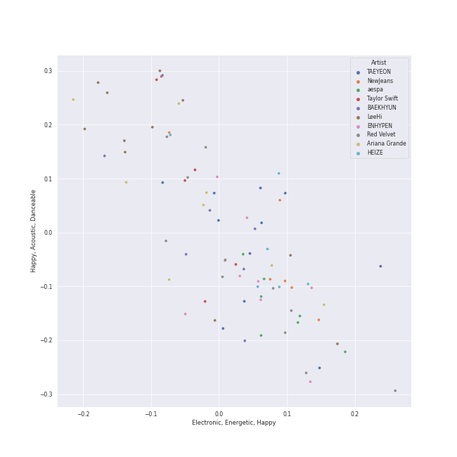
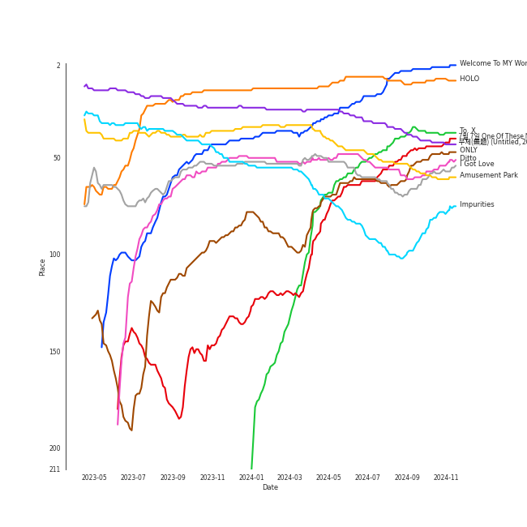
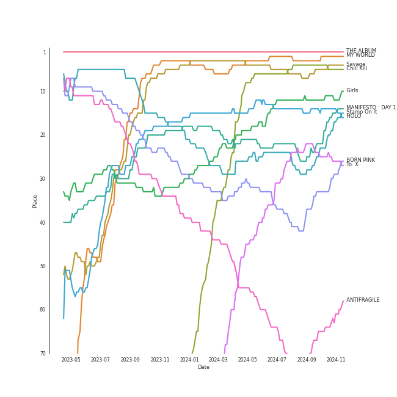
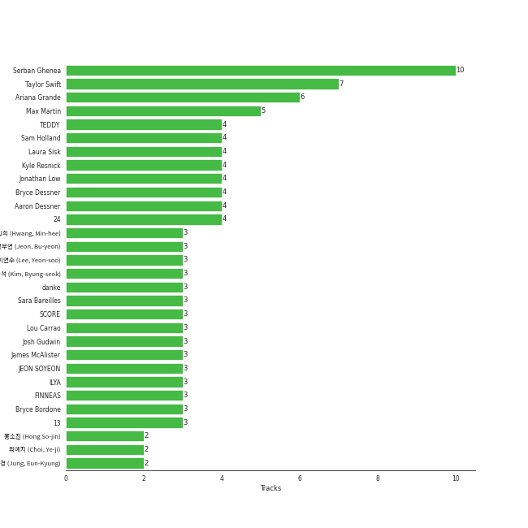

# Chill

[241 tracks (193 liked) 🔗](https://open.spotify.com/playlist/79HDmDfCjzdHS3oWXdgHGb)

[See Track Features](audio_features.md)

[See Clusters](clusters/overview.md)

## Top Artists

| Art | Rank | Tracks | 💚 | Artist | 🔗 |
|:---|---:|---:|---:|:---|:---|
|  | 8 | 12 | 11 | [TAEYEON](../../artists/taeyeon/overview.md) | [🔗](https://open.spotify.com/artist/3qNVuliS40BLgXGxhdBdqu) |
|  | 11 | 12 | 10 | [LeeHi](../../artists/leehi/overview.md) | [🔗](https://open.spotify.com/artist/7cVZApDoQZpS447nHTsNqu) |
|  | 2 | 11 | 8 | [Red Velvet](../../artists/red_velvet/overview.md) | [🔗](https://open.spotify.com/artist/1z4g3DjTBBZKhvAroFlhOM) |
|  | 7 | 8 | 7 | [ENHYPEN](../../artists/enhypen/overview.md) | [🔗](https://open.spotify.com/artist/5t5FqBwTcgKTaWmfEbwQY9) |
|  | 54 | 8 | 7 | [BAEKHYUN](../../artists/baekhyun/overview.md) | [🔗](https://open.spotify.com/artist/4ufh0WuMZh6y4Dmdnklvdl) |
|  | 19 | 7 | 7 | [Taylor Swift](../../artists/taylor_swift/overview.md) | [🔗](https://open.spotify.com/artist/06HL4z0CvFAxyc27GXpf02) |
|  | 33 | 8 | 6 | [Ariana Grande](../../artists/ariana_grande/overview.md) | [🔗](https://open.spotify.com/artist/66CXWjxzNUsdJxJ2JdwvnR) |
|  | 3 | 7 | 6 | [IU](../../artists/iu/overview.md) | [🔗](https://open.spotify.com/artist/3HqSLMAZ3g3d5poNaI7GOU) |
|  | 21 | 6 | 5 | [NewJeans](../../artists/newjeans/overview.md) | [🔗](https://open.spotify.com/artist/6HvZYsbFfjnjFrWF950C9d) |
|  | 38 | 6 | 5 | [HEIZE](../../artists/heize/overview.md) | [🔗](https://open.spotify.com/artist/5dCvSnVduaFleCnyy98JMo) |

See top 100 artists

| Art | Rank | Tracks | 💚 | Artist | 🔗 |
|:---|---:|---:|---:|:---|:---|
|  | 1 | 5 | 5 | [aespa](../../artists/aespa/overview.md) | [🔗](https://open.spotify.com/artist/6YVMFz59CuY7ngCxTxjpxE) |
|  | 6 | 5 | 4 | [(G)I-DLE](../../artists/(g)i-dle/overview.md) | [🔗](https://open.spotify.com/artist/2AfmfGFbe0A0WsTYm0SDTx) |
|  | 13 | 4 | 4 | [LE SSERAFIM](../../artists/le_sserafim/overview.md) | [🔗](https://open.spotify.com/artist/4SpbR6yFEvexJuaBpgAU5p) |
|  | 27 | 4 | 4 | [BTS](../../artists/bts/overview.md) | [🔗](https://open.spotify.com/artist/3Nrfpe0tUJi4K4DXYWgMUX) |
|  | 26 | 6 | 3 | [WENDY](../../artists/wendy/overview.md) | [🔗](https://open.spotify.com/artist/0FRUZvZNPzM3YJMABJxf2K) |
|  | 431 | 4 | 3 | [The Rose](../../artists/the_rose/overview.md) | [🔗](https://open.spotify.com/artist/5na1LmEmK2VzNLje9snJYW) |
|  | 4 | 4 | 3 | [BLACKPINK](../../artists/blackpink/overview.md) | [🔗](https://open.spotify.com/artist/41MozSoPIsD1dJM0CLPjZF) |
|  | 45 | 3 | 3 | [Billie Eilish](../../artists/billie_eilish/overview.md) | [🔗](https://open.spotify.com/artist/6qqNVTkY8uBg9cP3Jd7DAH) |
|  | 431 | 3 | 3 | Wonstein | [🔗](https://open.spotify.com/artist/5o615XColiSVMPDWlslKSk) |
|  | 69 | 3 | 3 | [WINTER](../../artists/winter/overview.md) | [🔗](https://open.spotify.com/artist/3mPquBmMu97Iq9TpzQ6ayI) |
|  | 23 | 3 | 3 | [Sara Bareilles](../../artists/sara_bareilles/overview.md) | [🔗](https://open.spotify.com/artist/2Sqr0DXoaYABbjBo9HaMkM) |
|  | 16 | 4 | 2 | [STAYC](../../artists/stayc/overview.md) | [🔗](https://open.spotify.com/artist/01XYiBYaoMJcNhPokrg0l0) |
|  | 56 | 3 | 2 | TAEYANG | [🔗](https://open.spotify.com/artist/6udveWUgX4vu75FF0DTrXV) |
|  | 195 | 3 | 2 | [Coldplay](../../artists/coldplay/overview.md) | [🔗](https://open.spotify.com/artist/4gzpq5DPGxSnKTe4SA8HAU) |
|  | 22 | 3 | 2 | [Billlie](../../artists/billlie/overview.md) | [🔗](https://open.spotify.com/artist/2GQxKDojobwBjZMPf7aoh0) |
|  | 226 | 3 | 2 | Punch | [🔗](https://open.spotify.com/artist/2FgZrgTMX6Sk0VNcOsEPmm) |
|  | 51 | 2 | 2 | [HWASA](../../artists/hwasa/overview.md) | [🔗](https://open.spotify.com/artist/7bmYpVgQub656uNTu6qGNQ) |
|  | 261 | 2 | 2 | YUJU | [🔗](https://open.spotify.com/artist/7Bu0r4MCDX3sbhcFD5IXyx) |
|  | 172 | 2 | 2 | [Crush](../../artists/crush/overview.md) | [🔗](https://open.spotify.com/artist/6aLdhHUqgdKE86xbtNmY8g) |
|  | 146 | 2 | 2 | TAEYONG | [🔗](https://open.spotify.com/artist/6SKusTjOAPsTZ6kareKQdm) |
|  | 43 | 2 | 2 | [SUNMI](../../artists/sunmi/overview.md) | [🔗](https://open.spotify.com/artist/6MoXcK2GyGg7FIyxPU5yW6) |
|  | 431 | 2 | 2 | John Legend | [🔗](https://open.spotify.com/artist/5y2Xq6xcjJb2jVM54GHK3t) |
|  | 363 | 2 | 2 | Jay Park | [🔗](https://open.spotify.com/artist/4XDi67ZENZcbfKnvMnTYsI) |
|  | 431 | 2 | 2 | YUKIKA | [🔗](https://open.spotify.com/artist/4RfI1z9u2xIc5Qnqac4JbO) |
|  | 171 | 2 | 2 | BIGBANG | [🔗](https://open.spotify.com/artist/4Kxlr1PRlDKEB0ekOCyHgX) |
|  | 227 | 2 | 2 | Loco | [🔗](https://open.spotify.com/artist/2e4G04F77jxVuDYo44TCSm) |
|  | 197 | 2 | 2 | Stella Jang | [🔗](https://open.spotify.com/artist/2Y9AUayH5pyZpVfkDYDfJV) |
|  | 64 | 2 | 2 | [PENTAGON](../../artists/pentagon/overview.md) | [🔗](https://open.spotify.com/artist/1wKpMkucynaTfG8lyPprYV) |
|  | 103 | 2 | 2 | SURAN | [🔗](https://open.spotify.com/artist/1mORehSVEd7lcaT2d7Sl2K) |
|  | 78 | 2 | 2 | [Jackson Wang](../../artists/jackson_wang/overview.md) | [🔗](https://open.spotify.com/artist/1kfWoWgCugPkyxQP8lkRlY) |
|  | 336 | 2 | 2 | SUGA | [🔗](https://open.spotify.com/artist/0ebNdVaOfp6N0oZ1guIxM8) |
|  | 249 | 3 | 1 | Lee Mujin | [🔗](https://open.spotify.com/artist/4Xj0peBt3EZHbdF20JmdWC) |
|  | 9 | 2 | 1 | [TWICE](../../artists/twice/overview.md) | [🔗](https://open.spotify.com/artist/7n2Ycct7Beij7Dj7meI4X0) |
|  | 417 | 2 | 1 | Seori | [🔗](https://open.spotify.com/artist/2bWTIIQP9zaVc55RaMGu7e) |
|  | 305 | 2 | 1 | Sandeul | [🔗](https://open.spotify.com/artist/2QeJBmgBdpH4i3uJns5Rdx) |
|  | 431 | 2 | 1 | Sunwoojunga | [🔗](https://open.spotify.com/artist/04L3elxyr0XFua2Ek3domW) |
|  | 12 | 1 | 1 | [SEVENTEEN](../../artists/seventeen/overview.md) | [🔗](https://open.spotify.com/artist/7nqOGRxlXj7N2JYbgNEjYH) |
| | 431 | 1 | 1 | Jang Yi-jeong | [🔗](https://open.spotify.com/artist/7nLakaHt1koh5mP4OIVM0F) |
|  | 30 | 1 | 1 | [NCT 127](../../artists/nct_127/overview.md) | [🔗](https://open.spotify.com/artist/7f4ignuCJhLXfZ9giKT7rH) |
|  | 92 | 1 | 1 | MAX CHANGMIN | [🔗](https://open.spotify.com/artist/7FiAkNWMb6ZBYI8tbQLuIS) |
|  | 408 | 1 | 1 | WOOGIE | [🔗](https://open.spotify.com/artist/7C0lSOS41UnTbnF7bMSEWN) |
|  | 431 | 1 | 1 | The Neighbourhood | [🔗](https://open.spotify.com/artist/77SW9BnxLY8rJ0RciFqkHh) |
|  | 431 | 1 | 1 | SHAUN | [🔗](https://open.spotify.com/artist/72nLe76yBFSlP6VBzME358) |
|  | 254 | 1 | 1 | MARK | [🔗](https://open.spotify.com/artist/70DFixYAFPv4Pf9kgSfR9O) |
|  | 108 | 1 | 1 | [Janelle Monáe](../../artists/janelle_monáe/overview.md) | [🔗](https://open.spotify.com/artist/6ueGR6SWhUJfvEhqkvMsVs) |
|  | 31 | 1 | 1 | [GOT the beat](../../artists/got_the_beat/overview.md) | [🔗](https://open.spotify.com/artist/6uNxlIP5lzPFf0BHuELOuX) |
|  | 431 | 1 | 1 | Commodores | [🔗](https://open.spotify.com/artist/6twIAGnYuIT1pncMAsXnEm) |
|  | 156 | 1 | 1 | [TVXQ!](../../artists/tvxq!/overview.md) | [🔗](https://open.spotify.com/artist/6nVMMEywS5Y4tsHPKx1nIo) |
|  | 223 | 1 | 1 | Lord Huron | [🔗](https://open.spotify.com/artist/6ltzsmQQbmdoHHbLZ4ZN25) |
|  | 431 | 1 | 1 | MeloMance | [🔗](https://open.spotify.com/artist/6k4r73Wq8nhkCDoUsECL1e) |
|  | 431 | 1 | 1 | CHANYEOL | [🔗](https://open.spotify.com/artist/6jV25rzTKQ2zMgrqHha1V5) |
|  | 431 | 1 | 1 | H 3 F | [🔗](https://open.spotify.com/artist/6jIK3obS1fJqb3Vu74AYX3) |
|  | 181 | 1 | 1 | Fujii Kaze | [🔗](https://open.spotify.com/artist/6bDWAcdtVR3WHz2xtiIPUi) |
|  | 72 | 1 | 1 | [BIBI](../../artists/bibi/overview.md) | [🔗](https://open.spotify.com/artist/6UbmqUEgjLA6jAcXwbM1Z9) |
|  | 431 | 1 | 1 | Silk Sonic | [🔗](https://open.spotify.com/artist/6PvvGcCY2XtUcSRld1Wilr) |
|  | 71 | 1 | 1 | [AKMU](../../artists/akmu/overview.md) | [🔗](https://open.spotify.com/artist/6OwKE9Ez6ALxpTaKcT5ayv) |
|  | 431 | 1 | 1 | Khalid | [🔗](https://open.spotify.com/artist/6LuN9FCkKOj5PcnpouEgny) |
|  | 165 | 1 | 1 | Younha | [🔗](https://open.spotify.com/artist/6GwM5CHqhWXzG3l5kzRSAS) |
|  | 431 | 1 | 1 | JIN | [🔗](https://open.spotify.com/artist/5vV3bFXnN6D6N3Nj4xRvaV) |
|  | 76 | 1 | 1 | NINGNING | [🔗](https://open.spotify.com/artist/5t1uryofgueHrjrryqX8vM) |
|  | 431 | 1 | 1 | CeeLo Green | [🔗](https://open.spotify.com/artist/5nLYd9ST4Cnwy6NHaCxbj8) |
|  | 193 | 1 | 1 | MINGYU | [🔗](https://open.spotify.com/artist/5gUpo0BRmo6EOTbyU3z5Ay) |
|  | 431 | 1 | 1 | HaSeul | [🔗](https://open.spotify.com/artist/5clV5I50OxxG9JGGxeW0C9) |
|  | 354 | 1 | 1 | Lauv | [🔗](https://open.spotify.com/artist/5JZ7CnR6gTvEMKX4g70Amv) |
|  | 272 | 1 | 1 | Gracie Abrams | [🔗](https://open.spotify.com/artist/4tuJ0bMpJh08umKkEXKUI5) |
|  | 431 | 1 | 1 | LADIES' CODE | [🔗](https://open.spotify.com/artist/4epPY1AW9lQeVUM1XaFiwi) |
|  | 82 | 1 | 1 | Suzy | [🔗](https://open.spotify.com/artist/4U80LJd8sG6U9YTFP5izka) |
|  | 431 | 1 | 1 | 6LACK | [🔗](https://open.spotify.com/artist/4IVAbR2w4JJNJDDRFP3E83) |
|  | 431 | 1 | 1 | QUIN | [🔗](https://open.spotify.com/artist/3sHS70DMNgPxRqx2fUNrRA) |
|  | 196 | 1 | 1 | WONWOO | [🔗](https://open.spotify.com/artist/3rHcBT06Vb1XGVUWhDALZt) |
|  | 431 | 1 | 1 | Anderson .Paak | [🔗](https://open.spotify.com/artist/3jK9MiCrA42lLAdMGUZpwa) |
|  | 102 | 1 | 1 | CHANGMO | [🔗](https://open.spotify.com/artist/3hvinNZRzTLoREmqFiKr1b) |
|  | 175 | 1 | 1 | ROSÉ | [🔗](https://open.spotify.com/artist/3eVa5w3URK5duf6eyVDbu9) |
|  | 366 | 1 | 1 | DEAN | [🔗](https://open.spotify.com/artist/3eCd0TZrBPm2n9cDG6yWfF) |
|  | 431 | 1 | 1 | Troye Sivan | [🔗](https://open.spotify.com/artist/3WGpXCj9YhhfX11TToZcXP) |
|  | 77 | 1 | 1 | [TREASURE](../../artists/treasure/overview.md) | [🔗](https://open.spotify.com/artist/3KonOYiLsU53m4yT7gNotP) |
|  | 60 | 1 | 1 | G-DRAGON | [🔗](https://open.spotify.com/artist/30b9WulBM8sFuBo17nNq9c) |
|  | 431 | 1 | 1 | george | [🔗](https://open.spotify.com/artist/2pRZp2WxvnWWiSPcSSYkNV) |
|  | 431 | 1 | 1 | Frank Ocean | [🔗](https://open.spotify.com/artist/2h93pZq0e7k5yf4dywlkpM) |
|  | 198 | 1 | 1 | [Rilo Kiley](../../artists/rilo_kiley/overview.md) | [🔗](https://open.spotify.com/artist/2cevwbv7ISD92VMNLYLHZA) |
|  | 431 | 1 | 1 | Birdy | [🔗](https://open.spotify.com/artist/2WX2uTcsvV5OnS0inACecP) |
|  | 206 | 1 | 1 | LUNCH | [🔗](https://open.spotify.com/artist/2UVzzx3MOPYV3l6xW2lzBv) |
|  | 431 | 1 | 1 | D.O. | [🔗](https://open.spotify.com/artist/2CQZr2RPZmrcvDnaod1ldC) |
|  | 431 | 1 | 1 | Corinne Bailey Rae | [🔗](https://open.spotify.com/artist/29WzbAQtDnBJF09es0uddn) |
|  | 18 | 1 | 1 | [NMIXX](../../artists/nmixx/overview.md) | [🔗](https://open.spotify.com/artist/28ot3wh4oNmoFOdVajibBl) |
|  | 338 | 1 | 1 | Halsey | [🔗](https://open.spotify.com/artist/26VFTg2z8YR0cCuwLzESi2) |
|  | 44 | 1 | 1 | nævis | [🔗](https://open.spotify.com/artist/2067CjQ2nC56cRZX8goeHg) |
|  | 294 | 1 | 1 | TAEIL | [🔗](https://open.spotify.com/artist/1z0Hi3myYw4x32xCq0H3aq) |
|  | 131 | 1 | 1 | Steam Powered Giraffe | [🔗](https://open.spotify.com/artist/1yqs45BSh7457Flyhmdv7f) |
|  | 208 | 1 | 1 | [Justin Bieber](../../artists/justin_bieber/overview.md) | [🔗](https://open.spotify.com/artist/1uNFoZAHBGtllmzznpCI3s) |

## Top Tracks

Most and least listened tracks

| Rank | ​ | Most listened tracks | Rank | ​​ | Least listened tracks |
|---:|:---|:---|---:|:---|:---|
| 3 |  | [Welcome To MY World (feat. nævis)](../../artists/aespa/overview.md) | 984 |  | [Sorry](../../artists/the_rose/overview.md) |
| 10 |  | [HOLO](../../artists/leehi/overview.md) | 984 |  | DIE 4 YOU |
| 37 |  | [To. X](../../artists/taeyeon/overview.md) | 984 |  | Baby Powder |
| 42 |  | 무제(無題) (Untitled, 2014) | 984 |  | Your Existence |
| 44 |  | [7월 7일 One Of These Nights](../../artists/red_velvet/overview.md) | 984 |  | Show Your Heart 너를 보여줘 |
| 48 |  | [ONLY](../../artists/leehi/overview.md) | 984 |  | [Love To Hate Me](../../artists/blackpink/overview.md) |
| 57 |  | [Ditto](../../artists/newjeans/overview.md) | 984 |  | [ocean eyes](../../artists/billie_eilish/overview.md) |
| 58 |  | [I Got Love](../../artists/taeyeon/overview.md) | 984 |  | Starlight |
| 60 |  | [Amusement Park](../../artists/baekhyun/overview.md) | 984 |  | [Fix You](../../artists/coldplay/overview.md) |
| 73 |  | 눈,코,입 (Eyes, Nose, Lips) | 984 |  | [Intentions](../../artists/leehi/overview.md) |

## Top Albums

| Art | Rank | Tracks | 💚 | Album | Release Date | 🔗 |
|:---|---:|---:|---:|:---|:---|:---|
|  | 473 | 5 | 3 | eternal sunshine | 2024-03-08 | [🔗](https://open.spotify.com/album/5EYKrEDnKhhcNxGedaRQeK) |
|  | 48 | 4 | 4 | 4 ONLY | 2021-09-09 | [🔗](https://open.spotify.com/album/1DKgZeAYrjslAPZVMe6EFt) |
|  | 169 | 4 | 0 | SKZ-REPLAY | 2022-12-21 | [🔗](https://open.spotify.com/album/3UXrliH0JUQvcaLnBD8Txz) |
|  | 593 | 3 | 3 | folklore | 2020-07-24 | [🔗](https://open.spotify.com/album/2fenSS68JI1h4Fo296JfGr) |
|  | 25 | 3 | 3 | To. X - The 5th Mini Album | 2023-11-27 | [🔗](https://open.spotify.com/album/0VciVDVU6NoqtQ0WAIlTmD) |
|  | 650 | 3 | 2 | Bambi - The 3rd Mini Album | 2021-03-30 | [🔗](https://open.spotify.com/album/5xOx4mWABbTj0qWyZC4q1p) |
|  | 327 | 2 | 2 | reputation | 2017-11-10 | [🔗](https://open.spotify.com/album/6DEjYFkNZh67HP7R9PSZvv) |
|  | 260 | 2 | 2 | YOUNG-LUV.COM | 2022-02-21 | [🔗](https://open.spotify.com/album/2xPdgNkM4yIQmP7axJ1T1o) |
|  | 91 | 2 | 2 | What Do I Call You - The 4th Mini Album | 2020-12-15 | [🔗](https://open.spotify.com/album/70XJeDlFe1LmZo1lyFKyq3) |
|  | 384 | 2 | 2 | Twenty-Five Twenty-One OST | 2022-04-03 | [🔗](https://open.spotify.com/album/77NPr874WU941XZhjO43dR) |

See top 100 albums

| Art | Rank | Tracks | 💚 | Album | Release Date | 🔗 |
|:---|---:|---:|---:|:---|:---|:---|
|  | 1 | 2 | 2 | THE ALBUM | 2020-10-02 | [🔗](https://open.spotify.com/album/71O60S5gIJSIAhdnrDIh3N) |
|  | 135 | 2 | 2 | SEOULITE | 2016-03-09 | [🔗](https://open.spotify.com/album/2c41Flo2HQgy0A9P3xuSFf) |
|  | 216 | 2 | 2 | Perfect Velvet - The 2nd Album | 2017-11-17 | [🔗](https://open.spotify.com/album/0rvrbZvaDX5S9ZBhwOwFfH) |
|  | 2 | 2 | 2 | MY WORLD - The 3rd Mini Album | 2023-05-08 | [🔗](https://open.spotify.com/album/69xF8jTd0c4Zoo7DT3Rwrn) |
|  | 144 | 2 | 2 | Last Winter | 2023-12-07 | [🔗](https://open.spotify.com/album/41vj1sO4NJFriquGszDSh5) |
|  | 11 | 2 | 2 | Girls - The 2nd Mini Album | 2022-07-08 | [🔗](https://open.spotify.com/album/4w1dbvUy1crv0knXQvcSeY) |
|  | 99 | 2 | 2 | FEARLESS | 2022-05-02 | [🔗](https://open.spotify.com/album/4Mc7WwYH41hgUWeKX25Sot) |
|  | 494 | 2 | 2 | Amidst the Chaos (Bonus Version) | 2019-05-10 | [🔗](https://open.spotify.com/album/5x2sDapUIdq0qk1ezff3gm) |
|  | 45 | 2 | 1 | ORANGE BLOOD | 2023-11-17 | [🔗](https://open.spotify.com/album/7dsAlxH9cMgyREm8OLdWWT) |
|  | 108 | 2 | 1 | NewJeans 1st EP 'New Jeans' | 2022-08-01 | [🔗](https://open.spotify.com/album/1HMLpmZAnNyl9pxvOnTovV) |
|  | 165 | 2 | 1 | I NEVER DIE | 2022-03-14 | [🔗](https://open.spotify.com/album/1T2W9vDajFreUuycPDjUXk) |
|  | 34 | 2 | 0 | NOEASY | 2021-08-23 | [🔗](https://open.spotify.com/album/558tpdCejjVQNFAumRAeQj) |
|  | 650 | 1 | 1 | 공감 (Empathy) - The 1st Mini Album | 2021-07-26 | [🔗](https://open.spotify.com/album/4dqWy2Soq1Z1rqgKfXOATk) |
|  | 490 | 1 | 1 | 壱 | 2022-01-12 | [🔗](https://open.spotify.com/album/1YWoHzj5wHnG7m6gLlwBQd) |
|  | 80 | 1 | 1 | ‘The ReVe Festival 2022 - Feel My Rhythm’ | 2022-03-21 | [🔗](https://open.spotify.com/album/3HgoCO9wWuPcNhz8Ip4C46) |
|  | 488 | 1 | 1 | ~how i'm feeling~ | 2020-03-06 | [🔗](https://open.spotify.com/album/3ZuE680xhR1A4bCFGvL8mi) |
|  | 650 | 1 | 1 | timeabout, | 2021-04-07 | [🔗](https://open.spotify.com/album/1cBAfX0otvkoIOI6HtOrAc) |
|  | 75 | 1 | 1 | the Billage of perception: chapter three | 2023-03-28 | [🔗](https://open.spotify.com/album/5bt0sTLia4il2rIlpqUo5g) |
|  | 71 | 1 | 1 | the Billage of perception : chapter one | 2021-11-10 | [🔗](https://open.spotify.com/album/1kp4txZsSpDNR4EoDFi2LD) |
|  | 496 | 1 | 1 | thank u, next | 2019-02-08 | [🔗](https://open.spotify.com/album/2fYhqwDWXjbpjaIJPEfKFw) |
|  | 342 | 1 | 1 | minor | 2020-07-14 | [🔗](https://open.spotify.com/album/2UZw04wDxLVceADw2Gi1Qy) |
|  | 650 | 1 | 1 | lovely (with Khalid) | 2018-04-19 | [🔗](https://open.spotify.com/album/2sBB17RXTamvj7Ncps15AK) |
|  | 650 | 1 | 1 | evermore | 2020-12-11 | [🔗](https://open.spotify.com/album/2Xoteh7uEpea4TohMxjtaq) |
|  | 650 | 1 | 1 | dont smile at me | 2017-12-22 | [🔗](https://open.spotify.com/album/7fRrTyKvE4Skh93v97gtcU) |
|  | 650 | 1 | 1 | channel ORANGE | 2012-07-10 | [🔗](https://open.spotify.com/album/392p3shh2jkxUxY2VHvlH8) |
|  | 328 | 1 | 1 | [REC.] | 2022-01-18 | [🔗](https://open.spotify.com/album/6ofVW04Q32gN1Hxk50S9Fi) |
|  | 650 | 1 | 1 | You Never Walk Alone | 2017-02-13 | [🔗](https://open.spotify.com/album/6THpewjqJ15ORBJkh5CEYb) |
|  | 401 | 1 | 1 | YOUNHA 6th Album Repackage 'END THEORY : Final Edition' | 2022-03-30 | [🔗](https://open.spotify.com/album/63mur6I6yCG9cOxOst3i7c) |
|  | 650 | 1 | 1 | X&Y | 2005-06-07 | [🔗](https://open.spotify.com/album/4E7bV0pzG0LciBSWTszra6) |
|  | 650 | 1 | 1 | Written In The Stars | 2018-10-11 | [🔗](https://open.spotify.com/album/08z3DsL7P6RpBR3FgNMSvN) |
|  | 102 | 1 | 1 | Wish You Hell - The 2nd Mini Album | 2024-03-12 | [🔗](https://open.spotify.com/album/3f8n88uX0tNvA8HTROgSkr) |
|  | 650 | 1 | 1 | Wish & Wind | 2018-03-08 | [🔗](https://open.spotify.com/album/5Fs2dlwUz1zkNcUPu6KaKF) |
|  | 650 | 1 | 1 | When Night Is Falling | 2021-07-07 | [🔗](https://open.spotify.com/album/3nOIsILeko2meMblKEGYZw) |
|  | 123 | 1 | 1 | WINE | 2017-04-27 | [🔗](https://open.spotify.com/album/26adxLsliyYcCfVTF6xA75) |
|  | 213 | 1 | 1 | WHEN WE ALL FALL ASLEEP, WHERE DO WE GO? | 2019-03-29 | [🔗](https://open.spotify.com/album/0S0KGZnfBGSIssfF54WSJh) |
|  | 650 | 1 | 1 | Village | 2018-11-02 | [🔗](https://open.spotify.com/album/2KxC2M0bVm5hrK3GgGMuV9) |
|  | 239 | 1 | 1 | Under The Blacklight (Standard Version) | 2007-08-20 | [🔗](https://open.spotify.com/album/2f9RsTZpsYMLRVZBtW7En8) |
|  | 650 | 1 | 1 | Under Caffeine | 2018-09-01 | [🔗](https://open.spotify.com/album/0xx0aVmnZiiqsFfKRTXOJp) |
|  | 310 | 1 | 1 | Traffic light | 2021-05-14 | [🔗](https://open.spotify.com/album/4lHGpxL8peLQSZRgl1Lssm) |
|  | 44 | 1 | 1 | The Velvet - The 2nd Mini Album | 2016-03-17 | [🔗](https://open.spotify.com/album/2qgl7dAgslqL1w2l2wQhMA) |
|  | 650 | 1 | 1 | The Prelude | 2020-07-17 | [🔗](https://open.spotify.com/album/3Qj2vsFzmaB8jcH6Q60WIG) |
|  | 650 | 1 | 1 | The Lady Killer | 2010-11-09 | [🔗](https://open.spotify.com/album/3MXU6UoWrf4w4bOvjZTlvY) |
|  | 650 | 1 | 1 | The Hyena on the Keyboard Pt. 4 | 2018-04-21 | [🔗](https://open.spotify.com/album/2fMMk4DD96UcAmSczUQ0kq) |
|  | 650 | 1 | 1 | The ArchAndroid | 2010-05-17 | [🔗](https://open.spotify.com/album/7MvSB0JTdtl1pSwZcgvYQX) |
|  | 160 | 1 | 1 | The 2¢ Show | 2012-05-23 | [🔗](https://open.spotify.com/album/4DECRyKlhKJgjZLLuvfAI6) |
|  | 650 | 1 | 1 | Take | 2018-06-27 | [🔗](https://open.spotify.com/album/1NgwpxtZFd1x4DbC74V9bO) |
|  | 361 | 1 | 1 | THE SECOND STEP : CHAPTER ONE | 2022-02-15 | [🔗](https://open.spotify.com/album/17l09k7ZDb4GYwmsIVGcRZ) |
|  | 372 | 1 | 1 | Supernatural | 2024-06-21 | [🔗](https://open.spotify.com/album/1FVw30SoC91lq1UZ6N9rwN) |
|  | 650 | 1 | 1 | Stuck with U | 2020-05-08 | [🔗](https://open.spotify.com/album/5mUdh6YWnUvf0MfklEk1oi) |
|  | 269 | 1 | 1 | Strange Trails | 2015-04-07 | [🔗](https://open.spotify.com/album/3yoNZlqerJnsnMN5EDwwBS) |
|  | 544 | 1 | 1 | Still Life | 2022-04-05 | [🔗](https://open.spotify.com/album/2oCAY48bhZvQte0l7apmYC) |
|  | 23 | 1 | 1 | Stamp On It - The 1st Mini Album | 2023-01-16 | [🔗](https://open.spotify.com/album/2Gxd1fr4RFHVNx6IxGr9I7) |
|  | 650 | 1 | 1 | Sorry | 2017-08-03 | [🔗](https://open.spotify.com/album/6D48tHXsa6LzoViDIACdkt) |
|  | 537 | 1 | 1 | Solar International | 2010-08-19 | [🔗](https://open.spotify.com/album/42BVvYE1FLO8mQH0ZJn4de) |
|  | 390 | 1 | 1 | Slightly Tipsy (She is My Type♡ X SANDEUL) | 2020-07-20 | [🔗](https://open.spotify.com/album/2bal48tjyi26OAxY2KxwFL) |
|  | 5 | 1 | 1 | Savage - The 1st Mini Album | 2021-10-05 | [🔗](https://open.spotify.com/album/3vyyDkvYWC36DwgZCYd3Wu) |
|  | 445 | 1 | 1 | SUGA's Interlude | 2019-12-06 | [🔗](https://open.spotify.com/album/0JfaSjTaej3QB27ofjnbQV) |
|  | 650 | 1 | 1 | STELLA I | 2020-04-07 | [🔗](https://open.spotify.com/album/1TCX395u7CaSsCLtiwsMAN) |
|  | 574 | 1 | 1 | SEVENTEEN 4th Album 'Face the Sun' | 2022-05-27 | [🔗](https://open.spotify.com/album/4lfFgz2rD1irxf7dZhNJht) |
|  | 650 | 1 | 1 | SEOULITE | 2016-04-20 | [🔗](https://open.spotify.com/album/3cGyWEJaQlj7kCdKBCOGeb) |
|  | 291 | 1 | 1 | SAILING | 2019-09-25 | [🔗](https://open.spotify.com/album/7C0Ci0alKWwwXPIFYEdVcn) |
|  | 132 | 1 | 1 | Rain - SM STATION | 2016-02-03 | [🔗](https://open.spotify.com/album/5MgY1E2inbDcthAQEzwz8L) |
|  | 118 | 1 | 1 | ROMANCE : UNTOLD | 2024-07-12 | [🔗](https://open.spotify.com/album/05I8FltCMnGa3kE38mpOkL) |
|  | 69 | 1 | 1 | RISE | 2014-06-03 | [🔗](https://open.spotify.com/album/1Y9so4jq4t4taAHu0VdKX3) |
|  | 650 | 1 | 1 | RED | 2019-08-13 | [🔗](https://open.spotify.com/album/5CrMZwZuJcDpzFmMO35vxN) |
|  | 212 | 1 | 1 | R | 2021-03-12 | [🔗](https://open.spotify.com/album/5BQcoDfcZ8aBcikYX9B7Ob) |
|  | 650 | 1 | 1 | Plastic Candy | 2023-10-26 | [🔗](https://open.spotify.com/album/2mwOcK4A3O3x9fxpjyFGxW) |
|  | 650 | 1 | 1 | Parachutes | 2000-07-10 | [🔗](https://open.spotify.com/album/6ZG5lRT77aJ3btmArcykra) |
|  | 56 | 1 | 1 | Palette | 2017-04-21 | [🔗](https://open.spotify.com/album/5V8n6fqyAPxvFTibPhQVcp) |
|  | 575 | 1 | 1 | Our Blues, Pt. 10 (Original Television Soundtrack) | 2022-05-22 | [🔗](https://open.spotify.com/album/0mP330aRyX4P4ZjarRKnXO) |
|  | 92 | 1 | 1 | Officially Cool | 2024-04-02 | [🔗](https://open.spotify.com/album/7ak1PBCmrVLvOANEenebe9) |
|  | 107 | 1 | 1 | NewJeans 'OMG' | 2023-01-02 | [🔗](https://open.spotify.com/album/45ozep8uHHnj5CCittuyXj) |
|  | 650 | 1 | 1 | New Chapter #1: The Chance of Love - The 8th Album | 2018-03-28 | [🔗](https://open.spotify.com/album/0ipyHYAE0cMf4aDJNIDIU1) |
|  | 650 | 1 | 1 | NEON | 2019-02-22 | [🔗](https://open.spotify.com/album/2tF9C0qTzRdaZShK4iK0UD) |
|  | 650 | 1 | 1 | My Voice - The 1st Album (Deluxe Edition) | 2017-04-05 | [🔗](https://open.spotify.com/album/7MG0bxf0ZFsAyej9W3XzTO) |
|  | 58 | 1 | 1 | My Voice - The 1st Album | 2017-02-28 | [🔗](https://open.spotify.com/album/6DlCl3hBP1Gwhn0tgitGfN) |
|  | 236 | 1 | 1 | My Everything - Deluxe | 2014-08-22 | [🔗](https://open.spotify.com/album/6EVYTRG1drKdO8OnIQBeEj) |
|  | 272 | 1 | 1 | Moonlovers - Scarlet Heart Ryeo (Original Television Soundtrack), Pt. 2 | 2016-08-29 | [🔗](https://open.spotify.com/album/68xTLBWjoRADRf86WYmTmy) |
|  | 650 | 1 | 1 | Modern Times – Epilogue | 2013-12-20 | [🔗](https://open.spotify.com/album/56MqewtCUq5bplrqEYTVL0) |
|  | 650 | 1 | 1 | Midnights | 2022-10-21 | [🔗](https://open.spotify.com/album/151w1FgRZfnKZA9FEcg9Z3) |
|  | 650 | 1 | 1 | Meow the secret boy 어서와 (Original Television Soundtrack), Pt.11 | 2020-04-23 | [🔗](https://open.spotify.com/album/0ZqZDky3PSbzKgHJzvSRuJ) |
|  | 650 | 1 | 1 | MYST3RY | 2016-02-24 | [🔗](https://open.spotify.com/album/2kOn7OTf9UGL0fyxy8yT7n) |
|  | 297 | 1 | 1 | MOVE - The 2nd Album | 2017-10-16 | [🔗](https://open.spotify.com/album/2Ka8QpE2XUUjL4vOQihkJH) |
|  | 19 | 1 | 1 | MANIFESTO : DAY 1 | 2022-07-04 | [🔗](https://open.spotify.com/album/5J8MNLLViH5zqM6VoGErz8) |
|  | 242 | 1 | 1 | MADE | 2016-12-13 | [🔗](https://open.spotify.com/album/2SPrl8C8pgSM5gXbAiyJHY) |
|  | 650 | 1 | 1 | Love, Maybe (A Business Proposal OST Special Track) | 2022-02-18 | [🔗](https://open.spotify.com/album/5lKdnY9bGYUyfaJhcRnHgk) |
|  | 261 | 1 | 1 | Love poem | 2019-11-18 | [🔗](https://open.spotify.com/album/2xEH7SRzJq7LgA0fCtTlxH) |
|  | 557 | 1 | 1 | Love Yourself 結 'Answer' | 2018-08-24 | [🔗](https://open.spotify.com/album/43wFM1HquliY3iwKWzPN4y) |
|  | 650 | 1 | 1 | Love Theory - SM STATION | 2022-04-14 | [🔗](https://open.spotify.com/album/2i27IzG4jFQjX7pS5L6TIu) |
|  | 650 | 1 | 1 | Love Story | 2017-11-10 | [🔗](https://open.spotify.com/album/0H9qbHCWJRmKAhERqM5X9G) |

## Top Record Labels

| Tracks | 💚 | Label |
|---:|---:|:---|
| 48 | 41 | [SM Entertainment](../../labels/sm_entertainment/overview.md) |
| 22 | 17 | [Genie Music Corporation](../../labels/genie_music_corporation/overview.md) |
| 19 | 15 | [Stone Music Entertainment](../../labels/stone_music_entertainment/overview.md) |
| 16 | 14 | [YG Entertainment](../../labels/yg_entertainment/overview.md) |
| 17 | 7 | [Republic Records](../../labels/republic_records/overview.md) |
| 8 | 7 | [BELIFT LAB](../../labels/belift_lab/overview.md) |
| 7 | 6 | [Interscope Records](../../labels/interscope_records/overview.md) |
| 6 | 6 | [Warner Records](../../labels/warner_records/overview.md) |
| 6 | 5 | [ADOR](../../labels/ador/overview.md) |
| 5 | 5 | [Universal Music LLC](../../labels/universal_music_llc/overview.md) |

See all 99 labels

| Tracks | 💚 | Label |
|---:|---:|:---|
| 5 | 5 | [Taylor Swift](../../labels/taylor_swift/overview.md) |
| 5 | 5 | [SOURCE MUSIC](../../labels/source_music/overview.md) |
| 5 | 4 | [CUBE ENTERTAINMENT](../../labels/cube_entertainment/overview.md) |
| 3 | 3 | [Epic](../../labels/epic/overview.md) |
| 3 | 3 | [Darkroom](../../labels/darkroom/overview.md) |
| 3 | 3 | [BIGHIT MUSIC](../../labels/bighit_music/overview.md) |
| 3 | 3 | [88rising Music](../../labels/88rising_music/overview.md) |
| 4 | 2 | [High Up Entertainment](../../labels/high_up_entertainment/overview.md) |
| 3 | 2 | [WM Korea](../../labels/wm_korea/overview.md) |
| 3 | 2 | [MYSTIC STORY](../../labels/mystic_story/overview.md) |
| 3 | 2 | [Kakao Entertainment](../../labels/kakao_entertainment/overview.md) |
| 2 | 2 | Studio MaumC |
| 2 | 2 | [PLEDIS Entertainment](../../labels/pledis_entertainment/overview.md) |
| 2 | 2 | Million Market |
| 2 | 2 | Hwa&Dam pictures |
| 2 | 2 | Fave Entertainment |
| 2 | 2 | [Columbia](../../labels/columbia/overview.md) |
| 2 | 2 | [Big Machine Records](../../labels/big_machine_records/overview.md) |
| 2 | 2 | [Atlantic Records](../../labels/atlantic_records/overview.md) |
| 2 | 2 | Abyss Company |
| 3 | 1 | [RBW Inc.](../../labels/rbw_inc_/overview.md) |
| 2 | 1 | [Parlophone UK](../../labels/parlophone_uk/overview.md) |
| 2 | 1 | MAGIC STRAWBERRY SOUND |
| 2 | 1 | [JYP Entertainment](../../labels/jyp_entertainment/overview.md) |
| 2 | 1 | FLEX M |
| 2 | 1 | CJ E&M MUSIC |
| 1 | 1 | 폴라리스엔터테인먼트 |
| 1 | 1 | 에이스토리 |
| 1 | 1 | 스튜디오앤뉴 |
| 1 | 1 | 뮤직앤뉴 |
| 1 | 1 | 모스트콘텐츠 |
| 1 | 1 | under exclusive license to Interscope Records |
| 1 | 1 | [avex trax](../../labels/avex_trax/overview.md) |
| 1 | 1 | Wondaland |
| 1 | 1 | UMGRI Interscope |
| 1 | 1 | UBUNTU ENT |
| 1 | 1 | Transparent Arts |
| 1 | 1 | TOON STUDIO |
| 1 | 1 | Steam Powered Giraffe |
| 1 | 1 | [Sony Music Labels Inc.](../../labels/sony_music_labels_inc_/overview.md) |
| 1 | 1 | Sony Music Entertainment |
| 1 | 1 | ShowPLAY ENTERTAINMENT |
| 1 | 1 | Red Zone Entertainment |
| 1 | 1 | Radiculture |
| 1 | 1 | [Polydor Records](../../labels/polydor_records/overview.md) |
| 1 | 1 | Parlophone Records Limited |
| 1 | 1 | MYSTIC Entertainment |
| 1 | 1 | [MOTOWN](../../labels/motown/overview.md) |
| 1 | 1 | MORE VISION |
| 1 | 1 | MODHAUS |
| 1 | 1 | Lauv |
| 1 | 1 | JOYFACE Records |
| 1 | 1 | JELLYFISH ENTERTAINMENT |
| 1 | 1 | IDJ |
| 1 | 1 | IAMSOUND |
| 1 | 1 | H 3 F |
| 1 | 1 | Gracie Abrams |
| 1 | 1 | GRDL |
| 1 | 1 | GRANDLINE |
| 1 | 1 | G.O.O.D. Music |
| 1 | 1 | Fantasy Soul |
| 1 | 1 | Elektra |
| 1 | 1 | ESTIMATE |
| 1 | 1 | EMI Recorded Music Australia Pty Ltd |
| 1 | 1 | [EMI](../../labels/emi/overview.md) |
| 1 | 1 | Donuts Music N |
| 1 | 1 | DCTOM |
| 1 | 1 | Colour Vision Records |
| 1 | 1 | ChoongangICS |
| 1 | 1 | [Capitol Records](../../labels/capitol_records/overview.md) |
| 1 | 1 | CRAFT AND JUN |
| 1 | 1 | C9 Entertainment |
| 1 | 1 | BlockBerryCreative |
| 1 | 1 | [Bad Boy](../../labels/bad_boy/overview.md) |
| 1 | 1 | Atlantic Records UK |
| 1 | 1 | Ariana Grande & Justin Bieber "Stuck With U"- Charity |
| 1 | 1 | Aftermath Entertainment |
| 1 | 1 | ATISPAUS |
| 1 | 1 | AOMG |
| 1 | 1 | ADA Korea |
| 1 | 0 | [WM Entertainment](../../labels/wm_entertainment/overview.md) |
| 1 | 0 | Today's Playlist |
| 1 | 0 | THEBLACKLABEL |
| 1 | 0 | [S2 ENTERTAINMENT INC.](../../labels/s2_entertainment_inc_/overview.md) |
| 1 | 0 | PLG - Capitol |
| 1 | 0 | Kakao M Corp. |
| 1 | 0 | [Jive](../../labels/jive/overview.md) |
| 1 | 0 | FNC인베스트먼트 |
| 1 | 0 | [Decca (UMO)](../../labels/decca_(umo)/overview.md) |

## Genres

| Tracks | 💚 | Genre |
|---:|---:|:---|
| 133 | 102 | [k-pop](../../genres/k-pop/overview.md) |
| 50 | 37 | [pop](../../genres/pop/overview.md) |
| 46 | 34 | [k-pop girl group](../../genres/k-pop_girl_group/overview.md) |
| 29 | 21 | [k-pop boy group](../../genres/k-pop_boy_group/overview.md) |
| 21 | 16 | [korean r&b](../../genres/korean_r_b/overview.md) |
| 19 | 13 | [korean pop](../../genres/korean_pop/overview.md) |
| 8 | 7 | [anime](../../genres/anime/overview.md) |
| 5 | 5 | korean city pop |
| 5 | 5 | [k-rap](../../genres/k-rap/overview.md) |
| 4 | 4 | [neo soul](../../genres/neo_soul/overview.md) |

See all 72 genres

| Tracks | 💚 | Genre |
|---:|---:|:---|
| 4 | 4 | [neo mellow](../../genres/neo_mellow/overview.md) |
| 4 | 4 | [lilith](../../genres/lilith/overview.md) |
| 4 | 4 | [art pop](../../genres/art_pop/overview.md) |
| 5 | 3 | [5th gen k-pop](../../genres/5th_gen_k-pop/overview.md) |
| 3 | 3 | [viral pop](../../genres/viral_pop/overview.md) |
| 3 | 3 | [post-teen pop](../../genres/post-teen_pop/overview.md) |
| 3 | 3 | [pop rock](../../genres/pop_rock/overview.md) |
| 3 | 3 | korean ost |
| 3 | 3 | [acoustic pop](../../genres/acoustic_pop/overview.md) |
| 3 | 2 | [permanent wave](../../genres/permanent_wave/overview.md) |
| 2 | 2 | [soul](../../genres/soul/overview.md) |
| 2 | 2 | pop soul |
| 2 | 2 | japanese teen pop |
| 2 | 2 | atl hip hop |
| 2 | 2 | alternative r&b |
| 2 | 1 | [uk pop](../../genres/uk_pop/overview.md) |
| 2 | 1 | [r&b](../../genres/r_b/overview.md) |
| 2 | 1 | k-indie |
| 1 | 1 | [urban contemporary](../../genres/urban_contemporary/overview.md) |
| 1 | 1 | uk contemporary r&b |
| 1 | 1 | thai indie pop |
| 1 | 1 | teen pop |
| 1 | 1 | stomp and holler |
| 1 | 1 | steampunk |
| 1 | 1 | [soft rock](../../genres/soft_rock/overview.md) |
| 1 | 1 | singer-songwriter pop |
| 1 | 1 | quiet storm |
| 1 | 1 | pop rap |
| 1 | 1 | motown |
| 1 | 1 | [modern rock](../../genres/modern_rock/overview.md) |
| 1 | 1 | modern alternative rock |
| 1 | 1 | [mellow gold](../../genres/mellow_gold/overview.md) |
| 1 | 1 | lgbtq+ hip hop |
| 1 | 1 | la indie |
| 1 | 1 | korean talent show |
| 1 | 1 | japanese singer-songwriter |
| 1 | 1 | [j-pop](../../genres/j-pop/overview.md) |
| 1 | 1 | indie rock |
| 1 | 1 | indie r&b |
| 1 | 1 | indie poptimism |
| 1 | 1 | indie pop |
| 1 | 1 | indie folk |
| 1 | 1 | funktronica |
| 1 | 1 | funk |
| 1 | 1 | etherpop |
| 1 | 1 | electropop |
| 1 | 1 | disco |
| 1 | 1 | [dance pop](../../genres/dance_pop/overview.md) |
| 1 | 1 | chamber pop |
| 1 | 1 | [canadian pop](../../genres/canadian_pop/overview.md) |
| 1 | 1 | canadian contemporary r&b |
| 1 | 1 | british soul |
| 1 | 1 | bedroom soul |
| 1 | 1 | australian pop |
| 1 | 1 | asian american hip hop |
| 1 | 1 | alt z |
| 1 | 1 | afrofuturism |
| 1 | 1 | [adult standards](../../genres/adult_standards/overview.md) |
| 1 | 0 | [uk alternative pop](../../genres/uk_alternative_pop/overview.md) |
| 1 | 0 | [rap](../../genres/rap/overview.md) |
| 1 | 0 | k-pop ballad |
| 1 | 0 | classic k-pop |

## Top Producers

| Art | Producer | Tracks | Credit Types |
|:---|:---|---:|:---|
| | [Serban Ghenea](../../producers/serban_ghenea/overview.md) | 10 | Producer |
|  | [Taylor Swift](../../artists/taylor_swift/overview.md) | 7 | Songwriter, Producer |
|  | [Ariana Grande](../../artists/ariana_grande/overview.md) | 6 | Lyricist, Producer, Songwriter |
| | [Max Martin](../../producers/max_martin/overview.md) | 5 | Producer, Songwriter, Arranger, Lyricist |
| | [Laura Sisk](../../producers/laura_sisk/overview.md) | 4 | Producer |
| | [24](../../producers/24/overview.md) | 4 | Arranger, Songwriter, Producer |
| | [Aaron Dessner](../../producers/aaron_dessner/overview.md) | 4 | Producer, Songwriter |
| | Kyle Resnick | 4 | Producer |
| | Jonathan Low | 4 | Producer |
| | Bryce Dessner | 4 | Arranger |

View all

| Art | Producer | Tracks | Credit Types |
|:---|:---|---:|:---|
| | [Sam Holland](../../producers/sam_holland/overview.md) | 4 | Producer |
| | [TEDDY](../../producers/teddy/overview.md) | 4 | Producer, Songwriter, Arranger, Lyricist |
| | [SCORE](../../producers/score/overview.md) | 3 | Arranger, Lyricist, Producer, Songwriter |
| | [danke](../../producers/danke/overview.md) | 3 | Lyricist, Songwriter |
| | [김병석 (Kim, Byung-seok)](../../producers/김병석_(kim,_byung-seok)/overview.md) | 3 | Arranger, Lyricist, Producer, Songwriter |
| | Bryce Bordone | 3 | Producer |
| | [ILYA](../../producers/ilya/overview.md) | 3 | Arranger, Producer, Songwriter |
| | 전부연 (Jeon, Bu-yeon) | 3 | Producer |
| | James McAlister | 3 | Producer |
| | 황민희 (Hwang, Min-hee) | 3 | Producer |
| | [FINNEAS](../../producers/finneas/overview.md) | 3 | Producer, Songwriter, Lyricist |
| | 이연수 (Lee, Yeon-soo) | 3 | Producer |
|  | [JEON SOYEON](../../artists/jeon_soyeon/overview.md) | 3 | Lyricist, Arranger, Songwriter |
| | Lou Carrao | 3 | Producer |
| | 13 | 3 | Producer |
| | [Josh Gudwin](../../producers/josh_gudwin/overview.md) | 3 | Producer |
|  | [Sara Bareilles](../../artists/sara_bareilles/overview.md) | 3 | Songwriter, Lyricist |
| | Will Champion | 2 | Songwriter |
| | 김인형 (Kim, In Hyung) | 2 | Lyricist, Songwriter |
| | 이지홍 (Lee, Ji-hong) | 2 | Producer |
| | Clarice Jensen | 2 | Producer |
| | [Rob Kinelski](../../producers/rob_kinelski/overview.md) | 2 | Producer |
| | 신지영 (Shin, Ji-young) | 2 | Producer |
| | 최예지 (Choi, Ye-ji) | 2 | Producer |
| | DRK | 2 | Producer |
| | Michael Brauer | 2 | Producer |
| | Ken Nelson | 2 | Producer |
| | Thomas Bartlett | 2 | Producer |
| | Michael Pollack | 2 | Songwriter |
| | T-Bone Burnett | 2 | Producer |
| | [이태섭 (Lee, Tae-Sub)](../../producers/이태섭_(lee,_tae-sub)/overview.md) | 2 | Producer |
| | [John Hanes](../../producers/john_hanes/overview.md) | 2 | Producer |
| | 남궁진 (Nam Goong, Jin) | 2 | Producer |
| | Jonny Buckland | 2 | Songwriter |
|  | Chris Martin | 2 | Songwriter |
| | [정은경 (Jung, Eun-Kyung)](../../producers/정은경_(jung,_eun-kyung)/overview.md) | 2 | Producer |
|  | [Coldplay](../../artists/coldplay/overview.md) | 2 | Producer |
| | Jason Wormer | 2 | Producer |
| | Marcus Lomax | 2 | Songwriter |
|  | HUH YUNJIN | 2 | Lyricist, Songwriter |
| | Jonna Hall | 2 | Lyricist, Songwriter |
| | 홍소진 (Hong So-jin) | 2 | Arranger |
| | Charli Taft | 2 | Arranger, Songwriter, Lyricist |
| | BreadBeat | 2 | Arranger, Songwriter |
| | Jason Roberts | 2 | Producer |
| | Guy Berryman | 2 | Songwriter |
| | [Jack Antonoff](../../producers/jack_antonoff/overview.md) | 2 | Producer, Songwriter |
| | JONGHYUN | 1 | Lyricist, Songwriter |
|  | The Weeknd | 1 | Producer, Songwriter |
| | Willy Moon | 1 | Lyricist, Songwriter |
|  | Corinne Bailey Rae | 1 | Songwriter |
| | Choi HEART | 1 | Lyricist |
| | BLVSH | 1 | Lyricist, Songwriter |
| | [서지음 (Seo, Ji Eum)](../../producers/서지음_(seo,_ji_eum)/overview.md) | 1 | Lyricist |
|  | Lauv | 1 | Producer, Songwriter |
| | 박광현 (Park, Kwanghyun) | 1 | Lyricist, Songwriter |
| | Ylva Dimberg | 1 | Lyricist, Songwriter |
| | 김형곤 (Kim, Hyeong-kon) | 1 | Producer |
| | Bram Inscore | 1 | Producer, Songwriter |
| | Jeremy Reeves | 1 | Lyricist, Songwriter |
| | Oscar Holter | 1 | Producer, Songwriter |
| | JARO | 1 | Lyricist, Songwriter |
| | Brody Brown | 1 | Songwriter |
|  | Jacob Banks | 1 | Songwriter |
| | Jason Lader | 1 | Producer |
| | 이나일 (E, Na-Il) | 1 | Songwriter |
| | 김채원 (Kim, Chae-won) | 1 | Lyricist, Songwriter |
| | Jonathan Yip | 1 | Lyricist, Songwriter |
| | HYUGGIE | 1 | Lyricist |
| | 이승주 (Lee Sung-joo) | 1 | Arranger |
| | Sunshine | 1 | Lyricist, Songwriter |
| | Audrey Riley | 1 | Arranger |
| | Happy Perez | 1 | Producer, Songwriter |
| | Tablo | 1 | Lyricist, Songwriter |
| | T.O.P | 1 | Lyricist |
| | Peter Kahm | 1 | Producer, Songwriter |
| | Pop Wansel | 1 | Producer, Songwriter |
| | [구종필 (Koo, Jong-Pil)](../../producers/구종필_(koo,_jong-pil)/overview.md) | 1 | Producer |
| | 황찬희 (Hwang, Chan-Hee) | 1 | Arranger, Producer, Songwriter |
| | Jeremy Wheatley | 1 | Producer |
| | 임찬미 (Kim, Chan-mi) | 1 | Producer |
| | Charlie J. Perry | 1 | Producer, Songwriter |
|  | Bekuh Boom | 1 | Lyricist, Songwriter |
| | Mafly | 1 | Lyricist |
| | [Mark "Spike" Stent](../../producers/mark__spike__stent/overview.md) | 1 | Producer |
| | LØREN (LOREN) | 1 | Lyricist |
| | Shin Kamiyama | 1 | Producer |
| | 적재 (Jukjae) | 1 | Arranger |
|  | [Bruno Mars](../../artists/bruno_mars/overview.md) | 1 | Producer, Songwriter |
| | Jameel Roberts | 1 | Songwriter |

## Years

View all years

| Year | Number of Tracks |
|:---|---:|
| 2024 | 16 |
| 2023 | 17 |
| [2022](2022/overview.md) | 46 |
| [2021](2021/overview.md) | 35 |
| [2020](2020/overview.md) | 31 |
| [2019](2019/overview.md) | 21 |
| 2018 | 14 |
| [2017](2017/overview.md) | 20 |
| 2016 | 15 |
| 2015 | 3 |
| 2014 | 3 |
| 2013 | 4 |
| 2012 | 3 |
| 2011 | 3 |
| 2010 | 4 |
| 2007 | 1 |
| 2006 | 1 |
| 2005 | 1 |
| 2004 | 1 |
| 2000 | 1 |
| 1977 | 1 |

| ​ | 10 newest albums | ​​ | 10 oldest albums |
|:---|:---|:---|:---|
|  | J - The 1st Album (2024-08-26) |  | Commodores (1977-01-01) |
|  | ROMANCE : UNTOLD (2024-07-12) |  | Parachutes (2000-07-10) |
|  | Sticky (2024-07-01) |  | It's Raining (2004-10-08) |
|  | Cosmic (2024-06-24) |  | X&Y (2005-06-07) |
|  | Supernatural (2024-06-21) |  | Corinne Bailey Rae (2006-01-01) |
|  | Balloon in Love (2024-06-13) |  | Under The Blacklight (Standard Version) (2007-08-20) |
|  | How Sweet (2024-05-24) |  | The ArchAndroid (2010-05-17) |
|  | Feeling Lucky (2024-04-26) |  | Solar International (2010-08-19) |
|  | Officially Cool (2024-04-02) |  | Kaleidoscope Heart (2010-09-07) |
|  | Wish You Hell - The 2nd Mini Album (2024-03-12) |  | The Lady Killer (2010-11-09) |