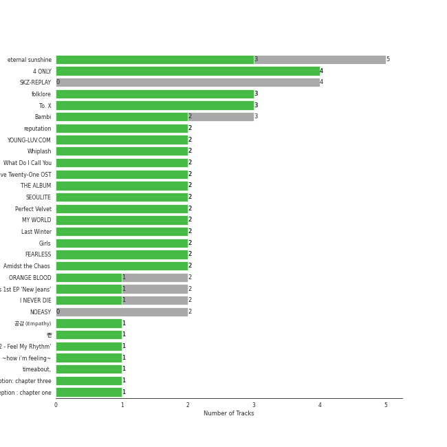
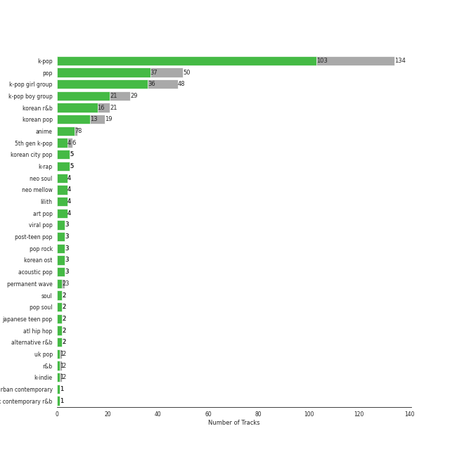

# Chill

[175 songs (142 liked)](tracks.md)

## Top Artists

See all 93 artists

| Art | Tracks | 💚 | Artist | 🔗 |
|:---|---:|---:|:---|:---|
|  | 13 | 12 | [IU](../../artists/iu) | [🔗](https://open.spotify.com/artist/3HqSLMAZ3g3d5poNaI7GOU) |
|  | 12 | 10 | [TAEYEON](../../artists/taeyeon) | [🔗](https://open.spotify.com/artist/3qNVuliS40BLgXGxhdBdqu) |
|  | 11 | 10 | [LeeHi](../../artists/leehi) | [🔗](https://open.spotify.com/artist/7cVZApDoQZpS447nHTsNqu) |
|  | 9 | 5 | [WENDY](../../artists/wendy) | [🔗](https://open.spotify.com/artist/0FRUZvZNPzM3YJMABJxf2K) |
|  | 8 | 7 | [BAEKHYUN](../../artists/baekhyun) | [🔗](https://open.spotify.com/artist/4ufh0WuMZh6y4Dmdnklvdl) |
|  | 8 | 6 | [Red Velvet](../../artists/red_velvet) | [🔗](https://open.spotify.com/artist/1z4g3DjTBBZKhvAroFlhOM) |
|  | 6 | 4 | [Stray Kids](../../artists/stray_kids) | [🔗](https://open.spotify.com/artist/2dIgFjalVxs4ThymZ67YCE) |
|  | 5 | 5 | [ENHYPEN](../../artists/enhypen) | [🔗](https://open.spotify.com/artist/5t5FqBwTcgKTaWmfEbwQY9) |
|  | 5 | 4 | HEIZE | [🔗](https://open.spotify.com/artist/5dCvSnVduaFleCnyy98JMo) |
|  | 5 | 4 | [BTS](../../artists/bts) | [🔗](https://open.spotify.com/artist/3Nrfpe0tUJi4K4DXYWgMUX) |
|  | 4 | 4 | [(G)I-DLE](../../artists/_g_i_dle) | [🔗](https://open.spotify.com/artist/2AfmfGFbe0A0WsTYm0SDTx) |
|  | 4 | 3 | [aespa](../../artists/aespa) | [🔗](https://open.spotify.com/artist/6YVMFz59CuY7ngCxTxjpxE) |
|  | 4 | 3 | NewJeans | [🔗](https://open.spotify.com/artist/6HvZYsbFfjnjFrWF950C9d) |
|  | 4 | 3 | The Rose | [🔗](https://open.spotify.com/artist/5na1LmEmK2VzNLje9snJYW) |
|  | 4 | 3 | Lee Mujin | [🔗](https://open.spotify.com/artist/4Xj0peBt3EZHbdF20JmdWC) |
|  | 4 | 3 | [BLACKPINK](../../artists/blackpink) | [🔗](https://open.spotify.com/artist/41MozSoPIsD1dJM0CLPjZF) |
|  | 4 | 2 | [STAYC](../../artists/stayc) | [🔗](https://open.spotify.com/artist/01XYiBYaoMJcNhPokrg0l0) |
|  | 3 | 3 | LE SSERAFIM | [🔗](https://open.spotify.com/artist/4SpbR6yFEvexJuaBpgAU5p) |
|  | 3 | 3 | WINTER | [🔗](https://open.spotify.com/artist/3mPquBmMu97Iq9TpzQ6ayI) |
|  | 3 | 2 | [Billlie](../../artists/billlie) | [🔗](https://open.spotify.com/artist/2GQxKDojobwBjZMPf7aoh0) |
|  | 2 | 2 | YUJU | [🔗](https://open.spotify.com/artist/7Bu0r4MCDX3sbhcFD5IXyx) |
|  | 2 | 2 | TAEYANG | [🔗](https://open.spotify.com/artist/6udveWUgX4vu75FF0DTrXV) |
|  | 2 | 2 | Crush | [🔗](https://open.spotify.com/artist/6aLdhHUqgdKE86xbtNmY8g) |
|  | 2 | 2 | AKMU | [🔗](https://open.spotify.com/artist/6OwKE9Ez6ALxpTaKcT5ayv) |
|  | 2 | 2 | Wonstein | [🔗](https://open.spotify.com/artist/5o615XColiSVMPDWlslKSk) |
|  | 2 | 2 | BIGBANG | [🔗](https://open.spotify.com/artist/4Kxlr1PRlDKEB0ekOCyHgX) |
|  | 2 | 2 | Loco | [🔗](https://open.spotify.com/artist/2e4G04F77jxVuDYo44TCSm) |
|  | 2 | 2 | PENTAGON | [🔗](https://open.spotify.com/artist/1wKpMkucynaTfG8lyPprYV) |
|  | 2 | 2 | SURAN | [🔗](https://open.spotify.com/artist/1mORehSVEd7lcaT2d7Sl2K) |
|  | 2 | 2 | SUGA | [🔗](https://open.spotify.com/artist/0ebNdVaOfp6N0oZ1guIxM8) |
|  | 2 | 2 | Sunwoojunga | [🔗](https://open.spotify.com/artist/04L3elxyr0XFua2Ek3domW) |
|  | 2 | 1 | [TWICE](../../artists/twice) | [🔗](https://open.spotify.com/artist/7n2Ycct7Beij7Dj7meI4X0) |
|  | 2 | 1 | MeloMance | [🔗](https://open.spotify.com/artist/6k4r73Wq8nhkCDoUsECL1e) |
|  | 2 | 1 | YUKIKA | [🔗](https://open.spotify.com/artist/4RfI1z9u2xIc5Qnqac4JbO) |
|  | 2 | 1 | Seori | [🔗](https://open.spotify.com/artist/2bWTIIQP9zaVc55RaMGu7e) |
|  | 2 | 1 | Sandeul | [🔗](https://open.spotify.com/artist/2QeJBmgBdpH4i3uJns5Rdx) |
|  | 2 | 1 | Punch | [🔗](https://open.spotify.com/artist/2FgZrgTMX6Sk0VNcOsEPmm) |
|  | 2 | 0 | [SEULGI](../../artists/seulgi) | [🔗](https://open.spotify.com/artist/2QM5S4yO6xHgnNvF0nbZZq) |
|  | 1 | 1 | [SEVENTEEN](../../artists/seventeen) | [🔗](https://open.spotify.com/artist/7nqOGRxlXj7N2JYbgNEjYH) |
|  | 1 | 1 | Jang Yi-jeong | [🔗](https://open.spotify.com/artist/7nLakaHt1koh5mP4OIVM0F) |
|  | 1 | 1 | [NCT 127](../../artists/nct_127) | [🔗](https://open.spotify.com/artist/7f4ignuCJhLXfZ9giKT7rH) |
|  | 1 | 1 | Hwa Sa | [🔗](https://open.spotify.com/artist/7bmYpVgQub656uNTu6qGNQ) |
|  | 1 | 1 | MAX CHANGMIN | [🔗](https://open.spotify.com/artist/7FiAkNWMb6ZBYI8tbQLuIS) |
|  | 1 | 1 | JIHYO | [🔗](https://open.spotify.com/artist/7F1iAHRYxR3MY7yAEuFqgL) |
|  | 1 | 1 | SHAUN | [🔗](https://open.spotify.com/artist/72nLe76yBFSlP6VBzME358) |
|  | 1 | 1 | MARK | [🔗](https://open.spotify.com/artist/70DFixYAFPv4Pf9kgSfR9O) |
|  | 1 | 1 | GOT the beat | [🔗](https://open.spotify.com/artist/6uNxlIP5lzPFf0BHuELOuX) |
|  | 1 | 1 | TVXQ! | [🔗](https://open.spotify.com/artist/6nVMMEywS5Y4tsHPKx1nIo) |
|  | 1 | 1 | TAEYONG | [🔗](https://open.spotify.com/artist/6SKusTjOAPsTZ6kareKQdm) |
|  | 1 | 1 | SUNMI | [🔗](https://open.spotify.com/artist/6MoXcK2GyGg7FIyxPU5yW6) |
|  | 1 | 1 | Younha | [🔗](https://open.spotify.com/artist/6GwM5CHqhWXzG3l5kzRSAS) |
|  | 1 | 1 | Nam Joohyuk | [🔗](https://open.spotify.com/artist/69ybhMoBUPmIcH4MyDARDv) |
|  | 1 | 1 | John Legend | [🔗](https://open.spotify.com/artist/5y2Xq6xcjJb2jVM54GHK3t) |
|  | 1 | 1 | JIN | [🔗](https://open.spotify.com/artist/5vV3bFXnN6D6N3Nj4xRvaV) |
|  | 1 | 1 | NINGNING | [🔗](https://open.spotify.com/artist/5t1uryofgueHrjrryqX8vM) |
|  | 1 | 1 | MINGYU | [🔗](https://open.spotify.com/artist/5gUpo0BRmo6EOTbyU3z5Ay) |
|  | 1 | 1 | Bona(WJSN) | [🔗](https://open.spotify.com/artist/5EHm62VI2botfXyNvboLlL) |
|  | 1 | 1 | YESUNG | [🔗](https://open.spotify.com/artist/4hyF8Vtc73RYJr3RgTE2Zf) |
|  | 1 | 1 | Lee Joomyung | [🔗](https://open.spotify.com/artist/4dN1DsKUXV6xugiarFBAa6) |
|  | 1 | 1 | Jay Park | [🔗](https://open.spotify.com/artist/4XDi67ZENZcbfKnvMnTYsI) |
|  | 1 | 1 | Suzy | [🔗](https://open.spotify.com/artist/4U80LJd8sG6U9YTFP5izka) |
|  | 1 | 1 | FIFTY FIFTY | [🔗](https://open.spotify.com/artist/4GJ6xDCF5jaUqD6avOuQT6) |
|  | 1 | 1 | WONWOO | [🔗](https://open.spotify.com/artist/3rHcBT06Vb1XGVUWhDALZt) |
|  | 1 | 1 | CHANGMO | [🔗](https://open.spotify.com/artist/3hvinNZRzTLoREmqFiKr1b) |
|  | 1 | 1 | ROSÉ | [🔗](https://open.spotify.com/artist/3eVa5w3URK5duf6eyVDbu9) |
|  | 1 | 1 | TREASURE | [🔗](https://open.spotify.com/artist/3KonOYiLsU53m4yT7gNotP) |
|  | 1 | 1 | V | [🔗](https://open.spotify.com/artist/3JsHnjpbhX4SnySpvpa9DK) |
|  | 1 | 1 | G-DRAGON | [🔗](https://open.spotify.com/artist/30b9WulBM8sFuBo17nNq9c) |
|  | 1 | 1 | LUNCH | [🔗](https://open.spotify.com/artist/2UVzzx3MOPYV3l6xW2lzBv) |
|  | 1 | 1 | [ITZY](../../artists/itzy) | [🔗](https://open.spotify.com/artist/2KC9Qb60EaY0kW4eH68vr3) |
|  | 1 | 1 | D.O. | [🔗](https://open.spotify.com/artist/2CQZr2RPZmrcvDnaod1ldC) |
|  | 1 | 1 | NMIXX | [🔗](https://open.spotify.com/artist/28ot3wh4oNmoFOdVajibBl) |
|  | 1 | 1 | Halsey | [🔗](https://open.spotify.com/artist/26VFTg2z8YR0cCuwLzESi2) |
|  | 1 | 1 | Choi Hyunwook | [🔗](https://open.spotify.com/artist/1z2J8XtoQxczs0U1lMWEiZ) |
|  | 1 | 1 | TAEIL | [🔗](https://open.spotify.com/artist/1z0Hi3myYw4x32xCq0H3aq) |
|  | 1 | 1 | MAX | [🔗](https://open.spotify.com/artist/1bqxdqvUtPWZri43cKHac8) |
|  | 1 | 1 | TAEMIN | [🔗](https://open.spotify.com/artist/13rF01aOogvnkuQXOlgTW8) |
|  | 1 | 1 | Gaeko | [🔗](https://open.spotify.com/artist/0tkHE1pQ5ZCgQb8WZ0ba79) |
|  | 1 | 1 | JOY | [🔗](https://open.spotify.com/artist/0sYpJ0nCC8AlDrZFeAA7ub) |
|  | 1 | 1 | CHAN 찬 | [🔗](https://open.spotify.com/artist/0nxWeW71DDYHY26V4LzMz9) |
|  | 1 | 1 | G.Soul | [🔗](https://open.spotify.com/artist/0fLesFHNsJpalRtqzSYxnd) |
|  | 1 | 1 | Kim Taeri | [🔗](https://open.spotify.com/artist/0bBDQ4QeizwResorw0iD7X) |
|  | 1 | 1 | [MAMAMOO](../../artists/mamamoo) | [🔗](https://open.spotify.com/artist/0XATRDCYuuGhk0oE7C0o5G) |
|  | 1 | 1 | B.I | [🔗](https://open.spotify.com/artist/0UntV1Bw2hk3fbRrm9eMP6) |
|  | 1 | 0 | WOODZ | [🔗](https://open.spotify.com/artist/6y9nlaoynxSvoTGY09Vdcy) |
|  | 1 | 0 | Onestar | [🔗](https://open.spotify.com/artist/6EmgTIhhXGtfAmYYTfdtlz) |
|  | 1 | 0 | Rain | [🔗](https://open.spotify.com/artist/5L4EafeXwZ0stGuPtGr5Tz) |
|  | 1 | 0 | KANGTA | [🔗](https://open.spotify.com/artist/5Bm6d9Fbsmln3CpXv8VrMG) |
|  | 1 | 0 | ZICO | [🔗](https://open.spotify.com/artist/4XpUIb8uuNlIWVKmgKZXC0) |
|  | 1 | 0 | [CHUNG HA](../../artists/chung_ha) | [🔗](https://open.spotify.com/artist/2PSJ6YriU7JsFucxACpU7Y) |
|  | 1 | 0 | Eric Nam | [🔗](https://open.spotify.com/artist/2FLqlgckDKdmpBrvLAT5BM) |
|  | 1 | 0 | Moon Byul | [🔗](https://open.spotify.com/artist/1eTft3tXynrKdo6XD7QHLL) |
|  | 1 | 0 | Whee In | [🔗](https://open.spotify.com/artist/0BqRGrwqndrtNkojXiqIzL) |

## Top Albums

See top 100 albums

| Art | Tracks | 💚 | Album | Release Date | 🔗 |
|:---|---:|---:|:---|:---|:---|
|  | 4 | 4 | Twenty-Five Twenty-One OST | 2022-04-03 | [🔗](https://open.spotify.com/album/77NPr874WU941XZhjO43dR) |
|  | 4 | 4 | Like Water - The 1st Mini Album | 2021-04-05 | [🔗](https://open.spotify.com/album/1Ao5vWPO13f4l0ldwxOKL7) |
|  | 4 | 4 | 4 ONLY | 2021-09-09 | [🔗](https://open.spotify.com/album/1DKgZeAYrjslAPZVMe6EFt) |
|  | 4 | 3 | SKZ-REPLAY | 2022-12-21 | [🔗](https://open.spotify.com/album/3UXrliH0JUQvcaLnBD8Txz) |
|  | 3 | 3 | Love poem | 2019-11-18 | [🔗](https://open.spotify.com/album/2xEH7SRzJq7LgA0fCtTlxH) |
|  | 3 | 2 | Girls - The 2nd Mini Album | 2022-07-08 | [🔗](https://open.spotify.com/album/4w1dbvUy1crv0knXQvcSeY) |
|  | 3 | 2 | Bambi - The 3rd Mini Album | 2021-03-30 | [🔗](https://open.spotify.com/album/5xOx4mWABbTj0qWyZC4q1p) |
|  | 2 | 2 | YOUNG-LUV.COM | 2022-02-21 | [🔗](https://open.spotify.com/album/2xPdgNkM4yIQmP7axJ1T1o) |
|  | 2 | 2 | What Do I Call You - The 4th Mini Album | 2020-12-15 | [🔗](https://open.spotify.com/album/70XJeDlFe1LmZo1lyFKyq3) |
|  | 2 | 2 | THE ALBUM | 2020-10-02 | [🔗](https://open.spotify.com/album/71O60S5gIJSIAhdnrDIh3N) |
|  | 2 | 2 | SAILING | 2019-09-25 | [🔗](https://open.spotify.com/album/7C0Ci0alKWwwXPIFYEdVcn) |
|  | 2 | 2 | Palette | 2017-04-21 | [🔗](https://open.spotify.com/album/5V8n6fqyAPxvFTibPhQVcp) |
|  | 2 | 2 | I NEVER DIE | 2022-03-14 | [🔗](https://open.spotify.com/album/1T2W9vDajFreUuycPDjUXk) |
|  | 2 | 2 | FEARLESS | 2022-05-02 | [🔗](https://open.spotify.com/album/4Mc7WwYH41hgUWeKX25Sot) |
|  | 2 | 1 | Perfect Velvet - The 2nd Album | 2017-11-17 | [🔗](https://open.spotify.com/album/0rvrbZvaDX5S9ZBhwOwFfH) |
|  | 2 | 1 | NewJeans 1st EP 'New Jeans' | 2022-08-01 | [🔗](https://open.spotify.com/album/1HMLpmZAnNyl9pxvOnTovV) |
|  | 2 | 1 | NOEASY | 2021-08-23 | [🔗](https://open.spotify.com/album/558tpdCejjVQNFAumRAeQj) |
|  | 2 | 0 | Purpose - The 2nd Album | 2019-10-28 | [🔗](https://open.spotify.com/album/0h6wCpdgpSOAbYDDYJVuwr) |
|  | 1 | 1 | 공감 (Empathy) - The 1st Mini Album | 2021-07-26 | [🔗](https://open.spotify.com/album/4dqWy2Soq1Z1rqgKfXOATk) |
|  | 1 | 1 | ‘The ReVe Festival 2022 - Feel My Rhythm’ | 2022-03-21 | [🔗](https://open.spotify.com/album/3HgoCO9wWuPcNhz8Ip4C46) |
|  | 1 | 1 | the Billage of perception: chapter three | 2023-03-28 | [🔗](https://open.spotify.com/album/5bt0sTLia4il2rIlpqUo5g) |
|  | 1 | 1 | the Billage of perception : chapter one | 2021-11-10 | [🔗](https://open.spotify.com/album/1kp4txZsSpDNR4EoDFi2LD) |
|  | 1 | 1 | [REC.] | 2022-01-18 | [🔗](https://open.spotify.com/album/6ofVW04Q32gN1Hxk50S9Fi) |
|  | 1 | 1 | You Never Walk Alone | 2017-02-13 | [🔗](https://open.spotify.com/album/7LF4N7lvyDhrPBuCJ1rplJ) |
|  | 1 | 1 | YOUNHA 6th Album Repackage 'END THEORY : Final Edition' | 2022-03-30 | [🔗](https://open.spotify.com/album/63mur6I6yCG9cOxOst3i7c) |
|  | 1 | 1 | Written In The Stars | 2018-10-11 | [🔗](https://open.spotify.com/album/08z3DsL7P6RpBR3FgNMSvN) |
|  | 1 | 1 | Wish & Wind | 2018-03-08 | [🔗](https://open.spotify.com/album/5Fs2dlwUz1zkNcUPu6KaKF) |
|  | 1 | 1 | When it snows(Feat.Heize) | 2021-12-03 | [🔗](https://open.spotify.com/album/1d2YKQ02RQA97EyrB55ZcK) |
|  | 1 | 1 | When Night Is Falling | 2021-07-07 | [🔗](https://open.spotify.com/album/3nOIsILeko2meMblKEGYZw) |
|  | 1 | 1 | WINE | 2017-04-27 | [🔗](https://open.spotify.com/album/26adxLsliyYcCfVTF6xA75) |
|  | 1 | 1 | Twicetagram | 2017-10-30 | [🔗](https://open.spotify.com/album/3hJXmK5gWN9P6jtZL0Lr2y) |
|  | 1 | 1 | Traffic light | 2021-05-14 | [🔗](https://open.spotify.com/album/4lHGpxL8peLQSZRgl1Lssm) |
|  | 1 | 1 | The Velvet - The 2nd Mini Album | 2016-03-17 | [🔗](https://open.spotify.com/album/2qgl7dAgslqL1w2l2wQhMA) |
|  | 1 | 1 | The Hyena on the Keyboard Pt. 4 | 2018-04-21 | [🔗](https://open.spotify.com/album/2fMMk4DD96UcAmSczUQ0kq) |
|  | 1 | 1 | The Beginning: Cupid | 2023-02-24 | [🔗](https://open.spotify.com/album/1ZXXEGGhHYgOEzYUjP6bPR) |
|  | 1 | 1 | Take | 2018-06-27 | [🔗](https://open.spotify.com/album/1NgwpxtZFd1x4DbC74V9bO) |
|  | 1 | 1 | THE SECOND STEP : CHAPTER ONE | 2022-02-15 | [🔗](https://open.spotify.com/album/17l09k7ZDb4GYwmsIVGcRZ) |
|  | 1 | 1 | Sweet (A Business Proposal OST Part.1) | 2022-02-28 | [🔗](https://open.spotify.com/album/2bB29MkoBHc7vm2fr2EdiZ) |
|  | 1 | 1 | Still Life | 2022-04-05 | [🔗](https://open.spotify.com/album/2oCAY48bhZvQte0l7apmYC) |
|  | 1 | 1 | Stamp On It - The 1st Mini Album | 2023-01-16 | [🔗](https://open.spotify.com/album/2Gxd1fr4RFHVNx6IxGr9I7) |
|  | 1 | 1 | Sorry | 2017-08-03 | [🔗](https://open.spotify.com/album/6D48tHXsa6LzoViDIACdkt) |
|  | 1 | 1 | Solar International | 2010-08-19 | [🔗](https://open.spotify.com/album/42BVvYE1FLO8mQH0ZJn4de) |
|  | 1 | 1 | Slightly Tipsy (She is My Type♡ X SANDEUL) | 2020-07-20 | [🔗](https://open.spotify.com/album/2bal48tjyi26OAxY2KxwFL) |
|  | 1 | 1 | Serenade | 2019-12-12 | [🔗](https://open.spotify.com/album/2McJE8dHLru3MgR1bcxdyF) |
|  | 1 | 1 | Savage - The 1st Mini Album | 2021-10-05 | [🔗](https://open.spotify.com/album/3vyyDkvYWC36DwgZCYd3Wu) |
|  | 1 | 1 | SUGA's Interlude | 2019-12-06 | [🔗](https://open.spotify.com/album/0JfaSjTaej3QB27ofjnbQV) |
|  | 1 | 1 | SEVENTEEN 4th Album 'Face the Sun' | 2022-05-27 | [🔗](https://open.spotify.com/album/4lfFgz2rD1irxf7dZhNJht) |
|  | 1 | 1 | SEOULITE | 2016-03-09 | [🔗](https://open.spotify.com/album/2c41Flo2HQgy0A9P3xuSFf) |
|  | 1 | 1 | SEOULITE | 2016-04-20 | [🔗](https://open.spotify.com/album/3cGyWEJaQlj7kCdKBCOGeb) |
|  | 1 | 1 | Rain - SM STATION | 2016-02-03 | [🔗](https://open.spotify.com/album/5MgY1E2inbDcthAQEzwz8L) |
|  | 1 | 1 | RISE | 2014-06-03 | [🔗](https://open.spotify.com/album/1Y9so4jq4t4taAHu0VdKX3) |
|  | 1 | 1 | RED MOON | 2018-07-16 | [🔗](https://open.spotify.com/album/6GhELYbXRo1LOqRPOCsQrF) |
|  | 1 | 1 | RED | 2019-08-13 | [🔗](https://open.spotify.com/album/5CrMZwZuJcDpzFmMO35vxN) |
|  | 1 | 1 | R | 2021-03-12 | [🔗](https://open.spotify.com/album/5BQcoDfcZ8aBcikYX9B7Ob) |
|  | 1 | 1 | Queendom - The 6th Mini Album | 2021-08-16 | [🔗](https://open.spotify.com/album/6Pe5LGQgU3mmvuRjFMsACV) |
|  | 1 | 1 | Pieces | 2021-12-29 | [🔗](https://open.spotify.com/album/3ivhPVStd9RrtczBFwjkMQ) |
|  | 1 | 1 | Our Blues, Pt. 10 (Original Television Soundtrack) | 2022-05-22 | [🔗](https://open.spotify.com/album/0mP330aRyX4P4ZjarRKnXO) |
|  | 1 | 1 | NewJeans 'OMG' | 2023-01-02 | [🔗](https://open.spotify.com/album/45ozep8uHHnj5CCittuyXj) |
|  | 1 | 1 | New Chapter #1: The Chance of Love - The 8th Album | 2018-03-28 | [🔗](https://open.spotify.com/album/0ipyHYAE0cMf4aDJNIDIU1) |
|  | 1 | 1 | NEON | 2019-02-22 | [🔗](https://open.spotify.com/album/2tF9C0qTzRdaZShK4iK0UD) |
|  | 1 | 1 | My Voice - The 1st Album (Deluxe Edition) | 2017-04-05 | [🔗](https://open.spotify.com/album/7MG0bxf0ZFsAyej9W3XzTO) |
|  | 1 | 1 | My Voice - The 1st Album | 2017-02-28 | [🔗](https://open.spotify.com/album/6DlCl3hBP1Gwhn0tgitGfN) |
|  | 1 | 1 | Moonlovers - Scarlet Heart Ryeo (Original Television Soundtrack), Pt. 2 | 2016-08-29 | [🔗](https://open.spotify.com/album/68xTLBWjoRADRf86WYmTmy) |
|  | 1 | 1 | Modern Times – Epilogue | 2013-12-20 | [🔗](https://open.spotify.com/album/56MqewtCUq5bplrqEYTVL0) |
|  | 1 | 1 | Meow the secret boy 어서와 (Original Television Soundtrack), Pt.11 | 2020-04-23 | [🔗](https://open.spotify.com/album/0ZqZDky3PSbzKgHJzvSRuJ) |
|  | 1 | 1 | MOVE - The 2nd Album | 2017-10-16 | [🔗](https://open.spotify.com/album/2Ka8QpE2XUUjL4vOQihkJH) |
|  | 1 | 1 | MANIFESTO : DAY 1 | 2022-07-04 | [🔗](https://open.spotify.com/album/5J8MNLLViH5zqM6VoGErz8) |
|  | 1 | 1 | MADE | 2016-12-13 | [🔗](https://open.spotify.com/album/2SPrl8C8pgSM5gXbAiyJHY) |
|  | 1 | 1 | Love, Maybe (A Business Proposal OST Special Track) | 2022-02-18 | [🔗](https://open.spotify.com/album/5lKdnY9bGYUyfaJhcRnHgk) |
|  | 1 | 1 | Love Yourself 結 'Answer' | 2018-08-24 | [🔗](https://open.spotify.com/album/43wFM1HquliY3iwKWzPN4y) |
|  | 1 | 1 | Love Story | 2017-11-10 | [🔗](https://open.spotify.com/album/0H9qbHCWJRmKAhERqM5X9G) |
|  | 1 | 1 | Love Rain | 2018-06-29 | [🔗](https://open.spotify.com/album/40fAbWLsPvL0nUuiDCwxHu) |
|  | 1 | 1 | LOVE or TAKE | 2021-03-15 | [🔗](https://open.spotify.com/album/5iu1d69dqEo9UaKpZDYoIV) |
|  | 1 | 1 | KWON JI YONG | 2017-06-08 | [🔗](https://open.spotify.com/album/2koSNfchdUxqw1rPJO87aH) |
|  | 1 | 1 | Jirisan (Original Television Soundtrack) Pt. 4 | 2021-11-07 | [🔗](https://open.spotify.com/album/2FUiBNFWz47sBPEf3Dcma4) |
|  | 1 | 1 | Ice Cream Cake - The 1st Mini Album | 2015-03-17 | [🔗](https://open.spotify.com/album/27cBQ5FDqv0xLgiJ7qNpZr) |
|  | 1 | 1 | IU 5th Album 'LILAC' | 2021-03-25 | [🔗](https://open.spotify.com/album/01dPJcwyht77brL4JQiR8R) |
|  | 1 | 1 | ITAEWON CLASS (Original Television Soundtrack) Pt. 12 | 2020-03-13 | [🔗](https://open.spotify.com/album/1q3j12Y1sp2eqqffSnyA93) |
|  | 1 | 1 | IN:VITE U | 2022-01-24 | [🔗](https://open.spotify.com/album/5vxZM8rFJiNvjtAThYnwek) |
|  | 1 | 1 | I love | 2022-10-17 | [🔗](https://open.spotify.com/album/2Hyuin3i1cSZ1FlQFeCPZH) |
|  | 1 | 1 | I burn | 2021-01-11 | [🔗](https://open.spotify.com/album/3ma5amx5s3l1NKoWNHaMYe) |
|  | 1 | 1 | I Don't Need You | 2020-06-07 | [🔗](https://open.spotify.com/album/6W4mS8VsOi2WAkkMuh9SJ9) |
|  | 1 | 1 | Hotel del Luna (Original Television Soundtrack) Pt.3 | 2019-07-21 | [🔗](https://open.spotify.com/album/6nddI94g7zC5bbyNzRBO0Y) |
|  | 1 | 1 | Hong Gil Dong OST | 2008-01-23 | [🔗](https://open.spotify.com/album/5Efud8Wmo7vBQjSJI1WcJ7) |
|  | 1 | 1 | Hello - Special Album | 2021-05-31 | [🔗](https://open.spotify.com/album/37mRfTDwQzVbHihypYY8oE) |
|  | 1 | 1 | Heart Burn | 2022-06-29 | [🔗](https://open.spotify.com/album/0ahb3lp7jXxKUx3beS7AVu) |
|  | 1 | 1 | Happy | 2020-05-04 | [🔗](https://open.spotify.com/album/1nPB6o7EjGvUORXlnioEPk) |
|  | 1 | 1 | HOLO | 2020-07-23 | [🔗](https://open.spotify.com/album/5xq9sm0jGMMDu5LifpBBo1) |
|  | 1 | 1 | HEAL | 2022-10-07 | [🔗](https://open.spotify.com/album/2n44vkxj8L01ma7nHfXNJW) |
|  | 1 | 1 | HAPPEN | 2021-05-20 | [🔗](https://open.spotify.com/album/4xOOB79WcZuOoVwK06No1s) |
|  | 1 | 1 | GUESS WHO | 2021-04-30 | [🔗](https://open.spotify.com/album/4lS8nhX8cplsYPzKjvhw6G) |
|  | 1 | 1 | GANADARA | 2022-03-11 | [🔗](https://open.spotify.com/album/4cwyl5ynvYVojZRbZ3dSFH) |
|  | 1 | 1 | Four Seasons | 2019-03-24 | [🔗](https://open.spotify.com/album/3ublKZHu1qjU9ujf9A4zhH) |
|  | 1 | 1 | For You | 2020-12-16 | [🔗](https://open.spotify.com/album/6hiwkmlOoNm8F3UkAZJcEz) |
|  | 1 | 1 | Floral Sense - The 1st Album (Special Version) | 2023-02-27 | [🔗](https://open.spotify.com/album/3GiIDO4BTLwJuZWQszk4Tg) |
|  | 1 | 1 | First Sight | 2018-12-14 | [🔗](https://open.spotify.com/album/5M9f9Tze7sspUDrIAjdCgV) |
|  | 1 | 1 | ENTWURF | 2022-09-19 | [🔗](https://open.spotify.com/album/2WraNaeFiJAOFEozKoAtC6) |
|  | 1 | 1 | Dream | 2016-01-07 | [🔗](https://open.spotify.com/album/7ciJtZ2tYXhKsndQ7bf7Vw) |
|  | 1 | 1 | Doom at Your Service (Original Television Soundtrack) Pt. 3 | 2021-05-31 | [🔗](https://open.spotify.com/album/2fy01jwC0GrnBGQ4Crcnve) |
|  | 1 | 1 | Ditto | 2022-12-19 | [🔗](https://open.spotify.com/album/7bnqo1fdJU9nSfXQd3bSMe) |

## Top Record Labels

See all 60 labels

| Tracks | 💚 | Label |
|---:|---:|:---|
| 41 | 33 | [SM Entertainment](../../labels/sm_entertainment) |
| 17 | 12 | [Genie Music Corporation](../../labels/genie_music_corporation) |
| 16 | 15 | [YG Entertainment](../../labels/yg_entertainment) |
| 16 | 12 | [Stone Music Entertainment](../../labels/stone_music_entertainment) |
| 9 | 6 | [Republic Records](../../labels/republic_records) |
| 6 | 5 | [Kakao Entertainment](../../labels/kakao_entertainment) |
| 5 | 5 | [BELIFT LAB](../../labels/belift_lab) |
| 4 | 4 | Studio MaumC |
| 4 | 4 | [SOURCE MUSIC](../../labels/source_music) |
| 4 | 4 | [Interscope Records](../../labels/interscope_records) |
| 4 | 4 | Hwa&Dam pictures |
| 4 | 4 | [CUBE ENTERTAINMENT](../../labels/cube_entertainment) |
| 4 | 3 | [BIGHIT MUSIC](../../labels/bighit_music) |
| 4 | 3 | ADOR |
| 4 | 2 | [High Up Entertainment](../../labels/high_up_entertainment) |
| 3 | 3 | Fave Entertainment |
| 3 | 2 | [Warner Records](../../labels/warner_records) |
| 3 | 2 | [MYSTIC STORY](../../labels/mystic_story) |
| 3 | 2 | [JYP Entertainment](../../labels/jyp_entertainment) |
| 2 | 2 | [Universal Music LLC](../../labels/universal_music_llc) |
| 2 | 2 | ShowPLAY ENTERTAINMENT |
| 2 | 2 | [PLEDIS Entertainment](../../labels/pledis_entertainment) |
| 2 | 2 | Million Market |
| 2 | 2 | MAGIC STRAWBERRY SOUND |
| 2 | 2 | FLEX M |
| 2 | 2 | EDAM Entertainment |
| 2 | 1 | [WM Korea](../../labels/wm_korea) |
| 2 | 1 | [RBW Inc.](../../labels/rbw_inc_) |
| 2 | 1 | [HYBE](../../labels/hybe) |
| 2 | 1 | FNC인베스트먼트 |
| 2 | 1 | CJ E&M MUSIC |
| 1 | 1 | 에이스토리 |
| 1 | 1 | 스튜디오앤뉴 |
| 1 | 1 | 뮤직앤뉴 |
| 1 | 1 | 모스트콘텐츠 |
| 1 | 1 | msmedia |
| 1 | 1 | avex trax |
| 1 | 1 | Transparent Arts |
| 1 | 1 | TOON STUDIO |
| 1 | 1 | Sony Music Entertainment |
| 1 | 1 | MYSTIC ENTERTAINMENT |
| 1 | 1 | MORE VISION |
| 1 | 1 | ESTIMATE |
| 1 | 1 | Donuts Music N |
| 1 | 1 | DCTOM |
| 1 | 1 | Colour Vision Records |
| 1 | 1 | ChoongangICS |
| 1 | 1 | [Capitol Records](../../labels/capitol_records) |
| 1 | 1 | C9 Entertainment |
| 1 | 1 | Abyss Company |
| 1 | 1 | ATTRAKT |
| 1 | 1 | ATISPAUS |
| 1 | 1 | AOMG |
| 1 | 1 | ADA Korea |
| 1 | 1 | 88rising Music |
| 1 | 1 | (주)블렌딩 |
| 1 | 0 | [WM Entertainment](../../labels/wm_entertainment) |
| 1 | 0 | UBUNTU ENT |
| 1 | 0 | Today's Playlist |
| 1 | 0 | MNH ENTERTAINMENT |

## Genres

See all 20 genres

| Tracks | 💚 | Genre |
|---:|---:|:---|
| 135 | 107 | [k-pop](../../genres/k_pop) |
| 33 | 25 | [k-pop girl group](../../genres/k_pop_girl_group) |
| 27 | 19 | [korean pop](../../genres/korean_pop) |
| 26 | 22 | [k-pop boy group](../../genres/k_pop_boy_group) |
| 24 | 21 | [pop](../../genres/pop) |
| 15 | 11 | korean r&b |
| 5 | 5 | anime |
| 4 | 4 | korean ost |
| 3 | 2 | k-rap |
| 2 | 2 | k-indie |
| 2 | 2 | [dance pop](../../genres/dance_pop) |
| 2 | 1 | korean city pop |
| 1 | 1 | viral pop |
| 1 | 1 | [post-teen pop](../../genres/post_teen_pop) |
| 1 | 1 | j-division |
| 1 | 1 | indie poptimism |
| 1 | 1 | etherpop |
| 1 | 1 | [electropop](../../genres/electropop) |
| 1 | 1 | chill r&b |
| 1 | 0 | classic k-pop |

## Years

View all years

| Year | Number of Tracks |
|:---|---:|
| 2023 | 6 |
| [2022](2022.md) | 46 |
| [2021](2021.md) | 39 |
| 2020 | 19 |
| 2019 | 16 |
| 2018 | 11 |
| 2017 | 17 |
| 2016 | 11 |
| 2015 | 1 |
| 2014 | 3 |
| 2013 | 2 |
| 2011 | 1 |
| 2010 | 1 |
| 2008 | 1 |
| 2004 | 1 |

| 10 newest albums | 10 oldest albums |
|:---|:---|
| 
 the Billage of perception: chapter three (2023-03-28)
 | 
 It's Raining (2004-10-08)
 |
| 
 Floral Sense - The 1st Album (Special Version) (2023-02-27)
 | 
 Hong Gil Dong OST (2008-01-23)
 |
| 
 The Beginning: Cupid (2023-02-24)
 | 
 Solar International (2010-08-19)
 |
| 
 Miracle - SM STATION (2023-01-26)
 | 
 Last Fantasy (2011-11-29)
 |
| 
 Stamp On It - The 1st Mini Album (2023-01-16)
 | 
 2 Cool 4 Skool (2013-06-12)
 |
| 
 NewJeans 'OMG' (2023-01-02)
 | 
 Modern Times – Epilogue (2013-12-20)
 |
| 
 2022 Winter SMTOWN : SMCU PALACE (2022-12-26)
 | 
 A flower bookmark (2014-05-16)
 |
| 
 SKZ-REPLAY (2022-12-21)
 | 
 RISE (2014-06-03)
 |
| 
 Ditto (2022-12-19)
 | 
 Be Natural - The 2nd Single (2014-10-13)
 |
| 
 Get Ready To Leave (2022-10-18)
 | 
 Ice Cream Cake - The 1st Mini Album (2015-03-17)
 |
## Audio Features

| 10 most Danceable tracks | 10 least Danceable tracks |
|:---|:---|
| I Do (0.898) | U (0.301) |
| Cat (Feat. IU) (0.882) | Miracle (0.302) |
| 10 Months (0.876) | Sweet (0.302) |
| TENNIS (0:0) (0.85) | My sea (0.353) |
| Don’t (0.85) | Like Water (0.365) |
| Cookie (0.847) | MY LOVE (0.375) |
| Heart Burn (0.84) | Boy in time - HUI Solo (0.385) |
| To the moon (0.835) | Sorry (0.388) |
| Pierrot laughs at us (0.824) | Stardust love song (0.394) |
| Bye (0.824) | Get Ready To Leave (0.402) |

| 10 most Energetic tracks | 10 least Energetic tracks |
|:---|:---|
| Sparkling Night (0.935) | i hate to admit (Bang Chan) (0.217) |
| NEON (0.921) | miss you (Hyunjin) (0.226) |
| Why Can't You Love Me? (0.879) | Winter Sleep (0.237) |
| Silent Cry (0.876) | Stardust love song (0.241) |
| Be Natural (0.868) | How can I love the heartbreak, you're the one I love (0.248) |
| Event Horizon (0.861) | BREATHE (0.251) |
| Spring Day (0.846) | Boy in time - HUI Solo (0.255) |
| Change (0.842) | Singularity (0.272) |
| SAY SOMETHING (0.841) | Rain and You (0.275) |
| Stars and Raindrops (Seungmin) (0.827) | 그대라는 시 (0.292) |

| 10 most Speechy tracks | 10 least Speechy tracks |
|:---|:---|
| I Don't Need You (0.422) | With (0.0228) |
| Be Natural (0.316) | Sweet Night (0.025) |
| Sparkling Night (0.299) | Slightly Tipsy (She is My Type♡ X SANDEUL) (0.0264) |
| Life's Too Short (English Version) (0.265) | She′s In The Rain (0.0264) |
| Automatic (0.252) | Moonlight Melody (0.0269) |
| GANADARA (Feat. IU) (0.244) | Rain and You (0.027) |
| Your Existence (0.204) | Winter Sleep (0.0273) |
| Not For Sale (0.203) | LOVE FOOL (0.0281) |
| Whale (0.181) | In My Dreams (0.0283) |
| ALREADY (0.174) | Good Night My Princess (0.0293) |

| 10 most Acoustic tracks | 10 least Acoustic tracks |
|:---|:---|
| 그대라는 시 (0.914) | Spring Day (0.0063) |
| How can I love the heartbreak, you're the one I love (0.91) | Life Goes On (0.00691) |
| ONLY (0.892) | MOVE (0.0153) |
| Boy in time - HUI Solo (0.876) | Ditto (0.027) |
| Run With Me (0.868) | Blue Flame (0.0281) |
| MY LOVE (0.859) | Heart Burn (0.0287) |
| Amusement Park (0.85) | Sour (0.0334) |
| Miracle (0.846) | Love To Hate Me (0.0334) |
| U (0.834) | 10 Months (0.0345) |
| If (0.827) | the eleventh day (0.0492) |

| 10 most Instrumental tracks | 10 least Instrumental tracks |
|:---|:---|
| In My Dreams (0.0066) | Miracle (0.0) |
| Whale (0.00351) | Traffic light (0.0) |
| Singularity (0.00278) | To the moon (0.0) |
| Can't Stop This Party (0.00125) | Why Can't You Love Me? (0.0) |
| Blueberry Eyes (feat. SUGA of BTS) (0.000922) | Friday (feat.Jang Yi-jeong) (0.0) |
| Floral Sense (0.000598) | Gold Dust (0.0) |
| Way Back Home (0.000183) | For You (0.0) |
| Priority (0.000127) | Done For Me (0.0) |
| Sleepless rainy night (0.000103) | UN Village (0.0) |
| Sour (8.35e-05) | i hate to admit (Bang Chan) (0.0) |

| 10 most Live tracks | 10 least Live tracks |
|:---|:---|
| Darl+ing (0.43) | SUGA's Interlude (0.0425) |
| Love Rain (Feat. SURAN) (0.399) | In My Dreams (0.0489) |
| Automatic (0.387) | LOVE FOOL (0.0551) |
| Cupid (0.383) | Pierrot laughs at us (0.0577) |
| NEON (0.379) | Still Life (0.0628) |
| Show Your Heart 너를 보여줘 (0.37) | SAY SOMETHING (0.0646) |
| Life Goes On (0.37) | Impurities (0.0656) |
| ICU (0.365) | Blueming (0.0667) |
| Polaroid Love (0.361) | All I Got (0.0672) |
| LOSER (0.356) | Je T'aime (0.0676) |

| 10 most Happy tracks | 10 least Happy tracks |
|:---|:---|
| Cupid (0.943) | The Road (0.073) |
| 운명 The Chance of Love (0.915) | 7월 7일 One Of These Nights (0.11) |
| TFW (That Feeling When) (0.902) | Good Night My Princess (0.112) |
| Hello, Sunset (0.871) | My sea (0.122) |
| To the moon (0.866) | U (0.137) |
| Only Look At Me (나만 바라봐) (0.859) | Gravity (0.142) |
| What Do I Call You (0.835) | Lucid Dream (0.146) |
| I Got Love (0.828) | Sweet Night (0.149) |
| Hug Me (I.N) (0.813) | Stardust love song (0.149) |
| Bye (0.809) | ONLY (0.151) |
