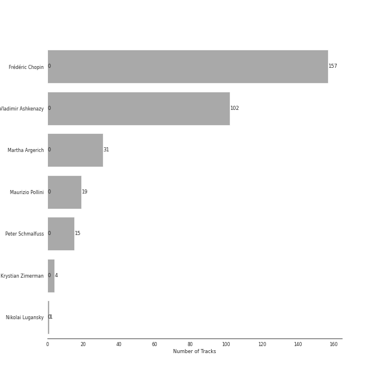

# Chopin

## Top Artists

See all artists

|   Number of Tracks | Artist                                                 | 🔗                                                           |
|-------------------:|:-------------------------------------------------------|:------------------------------------------------------------|
|                157 | [Frédéric Chopin](../artists/fr_d_ric_chopin.md)       | [🔗](https://open.spotify.com/artist/7y97mc3bZRFXzT2szRM4L4) |
|                102 | [Vladimir Ashkenazy](../artists/vladimir_ashkenazy.md) | [🔗](https://open.spotify.com/artist/20iZXzMb8LoWXOeca32i82) |
|                 31 | [Martha Argerich](../artists/martha_argerich.md)       | [🔗](https://open.spotify.com/artist/66MvLAvLznk5UOvASVGjk4) |
|                 19 | [Maurizio Pollini](../artists/maurizio_pollini.md)     | [🔗](https://open.spotify.com/artist/2VIdKQmRHnWofsR4odfFOh) |
|                 15 | [Peter Schmalfuss](../artists/peter_schmalfuss.md)     | [🔗](https://open.spotify.com/artist/7mOe6jfxX9EILXET9l5L6H) |
|                  4 | Krystian Zimerman                                      | [🔗](https://open.spotify.com/artist/43wuPaPcZVMJQWLRaPR4Yz) |
|                  1 | Nikolai Lugansky                                       | [🔗](https://open.spotify.com/artist/2bMfnyPOgNaeK8WNnXNXud) |

## Tracks

| Track                                                                                      | Album                                                                     | Artists                                                                                                  | 💚   | 🔗                                                          |
|:-------------------------------------------------------------------------------------------|:--------------------------------------------------------------------------|:---------------------------------------------------------------------------------------------------------|:----|:-----------------------------------------------------------|
| Ballade No. 1 in G Minor, Op. 23                                                           | Chopin: Ballades; Barcarolle; Fantaisie                                   | [Frédéric Chopin](../artists/fr_d_ric_chopin.md), Krystian Zimerman                                      |     | [🔗](https://open.spotify.com/track/5Ks5ENUFNQDfaqxjZnCkVJ) |
| Ballade No. 2 in F Major, Op. 38                                                           | Chopin: Ballades; Barcarolle; Fantaisie                                   | [Frédéric Chopin](../artists/fr_d_ric_chopin.md), Krystian Zimerman                                      |     | [🔗](https://open.spotify.com/track/5R6Xhutodh7bhDGVY71V3O) |
| Ballade No. 3 In A-Flat Major, Op. 47                                                      | Chopin: Ballades; Barcarolle; Fantaisie                                   | [Frédéric Chopin](../artists/fr_d_ric_chopin.md), Krystian Zimerman                                      |     | [🔗](https://open.spotify.com/track/0FBJ5Ctk5r4wlVJsFoV8Ta) |
| Ballade No. 4 in F Minor, Op. 52                                                           | Chopin: Ballades; Barcarolle; Fantaisie                                   | [Frédéric Chopin](../artists/fr_d_ric_chopin.md), Krystian Zimerman                                      |     | [🔗](https://open.spotify.com/track/1kVoL8Qst9UP3X902NWMo7) |
| 24 Préludes, Op. 28: No. 1 in C Major                                                      | Chopin: Preludes; Sonata No.2                                             | [Frédéric Chopin](../artists/fr_d_ric_chopin.md), [Martha Argerich](../artists/martha_argerich.md)       |     | [🔗](https://open.spotify.com/track/5lBrZri8OR3UMqWjdof0E8) |
| 24 Préludes, Op. 28: No. 10 in C-Sharp Minor                                               | Chopin: Preludes; Sonata No.2                                             | [Frédéric Chopin](../artists/fr_d_ric_chopin.md), [Martha Argerich](../artists/martha_argerich.md)       |     | [🔗](https://open.spotify.com/track/1QxIoxeq8WGmyiN8ZcbZGB) |
| 24 Préludes, Op. 28: No. 11 in B Major                                                     | Chopin: Preludes; Sonata No.2                                             | [Frédéric Chopin](../artists/fr_d_ric_chopin.md), [Martha Argerich](../artists/martha_argerich.md)       |     | [🔗](https://open.spotify.com/track/7ctTTNs8nDbWRgd8j8vnck) |
| 24 Préludes, Op. 28: No. 12. in G-Sharp Minor                                              | Chopin: Preludes; Sonata No.2                                             | [Frédéric Chopin](../artists/fr_d_ric_chopin.md), [Martha Argerich](../artists/martha_argerich.md)       |     | [🔗](https://open.spotify.com/track/0SB6a6YMfoGPVLD1Jgc1rn) |
| 24 Préludes, Op. 28: No. 13 in F-Sharp Major                                               | Chopin: Preludes; Sonata No.2                                             | [Frédéric Chopin](../artists/fr_d_ric_chopin.md), [Martha Argerich](../artists/martha_argerich.md)       |     | [🔗](https://open.spotify.com/track/7iwxvsVwIWgEevvuz4yleS) |
| 24 Préludes, Op. 28: No. 14 in E-Flat Minor                                                | Chopin: Preludes; Sonata No.2                                             | [Frédéric Chopin](../artists/fr_d_ric_chopin.md), [Martha Argerich](../artists/martha_argerich.md)       |     | [🔗](https://open.spotify.com/track/4jUcWucEDO7rf1KA9lIi8A) |
| 24 Préludes, Op. 28: No. 15 in D-Flat Major: Sostenuto                                     | Chopin: Preludes; Sonata No.2                                             | [Frédéric Chopin](../artists/fr_d_ric_chopin.md), [Martha Argerich](../artists/martha_argerich.md)       |     | [🔗](https://open.spotify.com/track/5wDBBKEIiDYwPQj4SpbBPI) |
| 24 Préludes, Op. 28: No. 16 in B-Flat Minor                                                | Chopin: Preludes; Sonata No.2                                             | [Frédéric Chopin](../artists/fr_d_ric_chopin.md), [Martha Argerich](../artists/martha_argerich.md)       |     | [🔗](https://open.spotify.com/track/1qgyEAoSHWfXjFu00ttsZn) |
| 24 Préludes, Op. 28: No. 17 in A-Flat Major: Allegretto                                    | Chopin: Preludes; Sonata No.2                                             | [Frédéric Chopin](../artists/fr_d_ric_chopin.md), [Martha Argerich](../artists/martha_argerich.md)       |     | [🔗](https://open.spotify.com/track/2vRgcveY6WFFyyKdjRmJRO) |
| 24 Préludes, Op. 28: No. 18 in F Minor                                                     | Chopin: Preludes; Sonata No.2                                             | [Frédéric Chopin](../artists/fr_d_ric_chopin.md), [Martha Argerich](../artists/martha_argerich.md)       |     | [🔗](https://open.spotify.com/track/3DdmRDwJQhq5fvV0GMk2Zx) |
| 24 Préludes, Op. 28: No. 19 in E-Flat Major                                                | Chopin: Preludes; Sonata No.2                                             | [Frédéric Chopin](../artists/fr_d_ric_chopin.md), [Martha Argerich](../artists/martha_argerich.md)       |     | [🔗](https://open.spotify.com/track/6oIaRMOhokqQWfM5mqpJrb) |
| 24 Préludes, Op. 28: No. 2 in A Minor                                                      | Chopin: Preludes; Sonata No.2                                             | [Frédéric Chopin](../artists/fr_d_ric_chopin.md), [Martha Argerich](../artists/martha_argerich.md)       |     | [🔗](https://open.spotify.com/track/50uHFlRGf69DM79HQ5iPNu) |
| 24 Préludes, Op. 28: No. 20 in C Minor: Largo                                              | Chopin: Preludes; Sonata No.2                                             | [Frédéric Chopin](../artists/fr_d_ric_chopin.md), [Martha Argerich](../artists/martha_argerich.md)       |     | [🔗](https://open.spotify.com/track/3APv0XbJ5jltSic9M1NtNH) |
| 24 Préludes, Op. 28: No. 21 in B-Flat Major                                                | Chopin: Preludes; Sonata No.2                                             | [Frédéric Chopin](../artists/fr_d_ric_chopin.md), [Martha Argerich](../artists/martha_argerich.md)       |     | [🔗](https://open.spotify.com/track/7IOQW4DHliCO1l7xG9dL80) |
| 24 Préludes, Op. 28: No. 22 in G Minor                                                     | Chopin: Preludes; Sonata No.2                                             | [Frédéric Chopin](../artists/fr_d_ric_chopin.md), [Martha Argerich](../artists/martha_argerich.md)       |     | [🔗](https://open.spotify.com/track/1gAg5ruoZuoy1rF8fwGggX) |
| 24 Préludes, Op. 28: No. 23 in F Major                                                     | Chopin: Preludes; Sonata No.2                                             | [Frédéric Chopin](../artists/fr_d_ric_chopin.md), [Martha Argerich](../artists/martha_argerich.md)       |     | [🔗](https://open.spotify.com/track/5SdOHEgN9vaJ79loXY16qr) |
| 24 Préludes, Op. 28: No. 24 in D Minor: Allegro appassionato                               | Chopin: Preludes; Sonata No.2                                             | [Frédéric Chopin](../artists/fr_d_ric_chopin.md), [Martha Argerich](../artists/martha_argerich.md)       |     | [🔗](https://open.spotify.com/track/5aaUfeU0Qb60MHFO1UzIad) |
| 24 Préludes, Op. 28: No. 3 in G Major: Vivace                                              | Chopin: Preludes; Sonata No.2                                             | [Frédéric Chopin](../artists/fr_d_ric_chopin.md), [Martha Argerich](../artists/martha_argerich.md)       |     | [🔗](https://open.spotify.com/track/311IxmgtMaxDvMe8S4zE9J) |
| 24 Préludes, Op. 28: No. 4 in E Minor                                                      | Chopin: Preludes; Sonata No.2                                             | [Frédéric Chopin](../artists/fr_d_ric_chopin.md), [Martha Argerich](../artists/martha_argerich.md)       |     | [🔗](https://open.spotify.com/track/0zrjEWxi3hGYEjUEFeB40V) |
| 24 Préludes, Op. 28: No. 5 in D Major                                                      | Chopin: Preludes; Sonata No.2                                             | [Frédéric Chopin](../artists/fr_d_ric_chopin.md), [Martha Argerich](../artists/martha_argerich.md)       |     | [🔗](https://open.spotify.com/track/43FjZOHoblMG4f7yQkJdC3) |
| 24 Préludes, Op. 28: No. 6 in B Minor: Lento assai                                         | Chopin: Preludes; Sonata No.2                                             | [Frédéric Chopin](../artists/fr_d_ric_chopin.md), [Martha Argerich](../artists/martha_argerich.md)       |     | [🔗](https://open.spotify.com/track/1MHkrzApuTiaDNJqY4m9IW) |
| 24 Préludes, Op. 28: No. 7 in A Major                                                      | Chopin: Preludes; Sonata No.2                                             | [Frédéric Chopin](../artists/fr_d_ric_chopin.md), [Martha Argerich](../artists/martha_argerich.md)       |     | [🔗](https://open.spotify.com/track/1t0Ymd079THxpBWALXe4gX) |
| 24 Préludes, Op. 28: No. 8 in F-Sharp Minor                                                | Chopin: Preludes; Sonata No.2                                             | [Frédéric Chopin](../artists/fr_d_ric_chopin.md), [Martha Argerich](../artists/martha_argerich.md)       |     | [🔗](https://open.spotify.com/track/0sP8fj4sT8bIsKP5mWYU1q) |
| 24 Préludes, Op. 28: No. 9 in E Major                                                      | Chopin: Preludes; Sonata No.2                                             | [Frédéric Chopin](../artists/fr_d_ric_chopin.md), [Martha Argerich](../artists/martha_argerich.md)       |     | [🔗](https://open.spotify.com/track/6fgEUIlr65HIamKwCTMieC) |
| Piano Sonata No. 2 in B-Flat Minor, Op. 35: I. Grave - Doppio movimento                    | Chopin: Preludes; Sonata No.2                                             | [Frédéric Chopin](../artists/fr_d_ric_chopin.md), [Martha Argerich](../artists/martha_argerich.md)       |     | [🔗](https://open.spotify.com/track/6D5tACZAB9ExufhWDXAyax) |
| Piano Sonata No. 2 in B-Flat Minor, Op. 35: II. Scherzo - Più lento - Tempo I              | Chopin: Preludes; Sonata No.2                                             | [Frédéric Chopin](../artists/fr_d_ric_chopin.md), [Martha Argerich](../artists/martha_argerich.md)       |     | [🔗](https://open.spotify.com/track/71gcI9CPfuKg5MCKqw06Zi) |
| Piano Sonata No. 2 in B-Flat Minor, Op. 35: III. Marche funèbre                            | Chopin: Preludes; Sonata No.2                                             | [Frédéric Chopin](../artists/fr_d_ric_chopin.md), [Martha Argerich](../artists/martha_argerich.md)       |     | [🔗](https://open.spotify.com/track/4lzHRas2lq1WbTksxpOvdH) |
| Piano Sonata No. 2 in B-Flat Minor, Op. 35: IV. Finale                                     | Chopin: Preludes; Sonata No.2                                             | [Frédéric Chopin](../artists/fr_d_ric_chopin.md), [Martha Argerich](../artists/martha_argerich.md)       |     | [🔗](https://open.spotify.com/track/4pZlFVRaX15abFOQlIVgjL) |
| Prélude in A-Flat Major, B. 86                                                             | Chopin: Preludes; Sonata No.2                                             | [Frédéric Chopin](../artists/fr_d_ric_chopin.md), [Martha Argerich](../artists/martha_argerich.md)       |     | [🔗](https://open.spotify.com/track/2rR3nvTMEymDUU9HlU94Gx) |
| Prélude in C-Sharp Minor, Op. 45                                                           | Chopin: Preludes; Sonata No.2                                             | [Frédéric Chopin](../artists/fr_d_ric_chopin.md), [Martha Argerich](../artists/martha_argerich.md)       |     | [🔗](https://open.spotify.com/track/1RvTfoN03GvpUpTdz5zpHz) |
| Polonaise No. 6 in A-Flat Major, Op. 53, "Heroic"                                          | Martha Argerich Live, Vol. 4                                              | [Frédéric Chopin](../artists/fr_d_ric_chopin.md), [Martha Argerich](../artists/martha_argerich.md)       |     | [🔗](https://open.spotify.com/track/3QC8VK73CinEi0ZV8Jf9B5) |
| Nocturne No. 1 In B Flat Minor, Op. 9 No. 1                                                | Chopin: Nocturnes                                                         | [Frédéric Chopin](../artists/fr_d_ric_chopin.md), [Maurizio Pollini](../artists/maurizio_pollini.md)     |     | [🔗](https://open.spotify.com/track/2d6ml9Qkx8r4EjuUyrdpRV) |
| Nocturne No. 10 In A Flat, Op. 32 No. 2                                                    | Chopin: Nocturnes                                                         | [Frédéric Chopin](../artists/fr_d_ric_chopin.md), [Maurizio Pollini](../artists/maurizio_pollini.md)     |     | [🔗](https://open.spotify.com/track/4KrOzPa98JgmFJVaOwLvdJ) |
| Nocturne No. 11 In G Minor, Op. 37 No. 1                                                   | Chopin: Nocturnes                                                         | [Frédéric Chopin](../artists/fr_d_ric_chopin.md), [Maurizio Pollini](../artists/maurizio_pollini.md)     |     | [🔗](https://open.spotify.com/track/6saqyONsKCCJw0gWh95LCi) |
| Nocturne No. 12 In G, Op. 37 No. 2                                                         | Chopin: Nocturnes                                                         | [Frédéric Chopin](../artists/fr_d_ric_chopin.md), [Maurizio Pollini](../artists/maurizio_pollini.md)     |     | [🔗](https://open.spotify.com/track/48QFWf03hb7Er4NHodAi82) |
| Nocturne No. 13 In C Minor, Op. 48 No. 1                                                   | Chopin: Nocturnes                                                         | [Frédéric Chopin](../artists/fr_d_ric_chopin.md), [Maurizio Pollini](../artists/maurizio_pollini.md)     |     | [🔗](https://open.spotify.com/track/4qOccDLi9YIkBJpN7gQDkn) |
| Nocturne No. 14 In F Sharp Minor, Op. 48 No. 2                                             | Chopin: Nocturnes                                                         | [Frédéric Chopin](../artists/fr_d_ric_chopin.md), [Maurizio Pollini](../artists/maurizio_pollini.md)     |     | [🔗](https://open.spotify.com/track/5z7VyrtLbDCV3YgomB2JD6) |
| Nocturne No. 15 In F Minor, Op. 55 No. 1                                                   | Chopin: Nocturnes                                                         | [Frédéric Chopin](../artists/fr_d_ric_chopin.md), [Maurizio Pollini](../artists/maurizio_pollini.md)     |     | [🔗](https://open.spotify.com/track/0XFiaEw6H4rIuuhNFbnP9F) |
| Nocturne No. 16 In E Flat, Op. 55 No. 2                                                    | Chopin: Nocturnes                                                         | [Frédéric Chopin](../artists/fr_d_ric_chopin.md), [Maurizio Pollini](../artists/maurizio_pollini.md)     |     | [🔗](https://open.spotify.com/track/7r9DH7AvvijvMXFMGMsdqK) |
| Nocturne No. 17 In B, Op. 62 No. 1                                                         | Chopin: Nocturnes                                                         | [Frédéric Chopin](../artists/fr_d_ric_chopin.md), [Maurizio Pollini](../artists/maurizio_pollini.md)     |     | [🔗](https://open.spotify.com/track/3UhDV3GnefK0y3CUjRBim9) |
| Nocturne No. 18 In E, Op. 62 No. 2                                                         | Chopin: Nocturnes                                                         | [Frédéric Chopin](../artists/fr_d_ric_chopin.md), [Maurizio Pollini](../artists/maurizio_pollini.md)     |     | [🔗](https://open.spotify.com/track/4PKNFBtURS8wuOyJoA5I1S) |
| Nocturne No. 19 In E Minor, Op. 72 No. 1                                                   | Chopin: Nocturnes                                                         | [Frédéric Chopin](../artists/fr_d_ric_chopin.md), [Maurizio Pollini](../artists/maurizio_pollini.md)     |     | [🔗](https://open.spotify.com/track/068BPNYklLpBX6VhMCKsUX) |
| Nocturne No. 2 In E Flat, Op. 9 No. 2                                                      | Chopin: Nocturnes                                                         | [Frédéric Chopin](../artists/fr_d_ric_chopin.md), [Maurizio Pollini](../artists/maurizio_pollini.md)     |     | [🔗](https://open.spotify.com/track/503fwzlbWHx5g0CqlU9Giu) |
| Nocturne No. 3 In B, Op. 9 No. 3                                                           | Chopin: Nocturnes                                                         | [Frédéric Chopin](../artists/fr_d_ric_chopin.md), [Maurizio Pollini](../artists/maurizio_pollini.md)     |     | [🔗](https://open.spotify.com/track/5WfsSJH86qH4fOhsTu03nT) |
| Nocturne No. 4 In F, Op. 15 No. 1                                                          | Chopin: Nocturnes                                                         | [Frédéric Chopin](../artists/fr_d_ric_chopin.md), [Maurizio Pollini](../artists/maurizio_pollini.md)     |     | [🔗](https://open.spotify.com/track/2HGPwnDkObM0QxHduiQQf7) |
| Nocturne No. 5 In F Sharp, Op. 15 No. 2                                                    | Chopin: Nocturnes                                                         | [Frédéric Chopin](../artists/fr_d_ric_chopin.md), [Maurizio Pollini](../artists/maurizio_pollini.md)     |     | [🔗](https://open.spotify.com/track/2hRx649mlo5boO1jfDe03O) |
| Nocturne No. 6 In G Minor, Op. 15 No. 3                                                    | Chopin: Nocturnes                                                         | [Frédéric Chopin](../artists/fr_d_ric_chopin.md), [Maurizio Pollini](../artists/maurizio_pollini.md)     |     | [🔗](https://open.spotify.com/track/5PHajk1v9B4z9ubkhDrFj6) |
| Nocturne No. 7 In C Sharp Minor, Op. 27 No. 1 - 2005 Recording                             | Chopin: Nocturnes                                                         | [Frédéric Chopin](../artists/fr_d_ric_chopin.md), [Maurizio Pollini](../artists/maurizio_pollini.md)     |     | [🔗](https://open.spotify.com/track/4FFaOQHk9j1QknVLyIPUxl) |
| Nocturne No. 8 In D Flat, Op. 27 No. 2 - 2005 Recording                                    | Chopin: Nocturnes                                                         | [Frédéric Chopin](../artists/fr_d_ric_chopin.md), [Maurizio Pollini](../artists/maurizio_pollini.md)     |     | [🔗](https://open.spotify.com/track/3G98iZXs933j4EkqACWfka) |
| Nocturne No. 9 In B, Op. 32 No. 1                                                          | Chopin: Nocturnes                                                         | [Frédéric Chopin](../artists/fr_d_ric_chopin.md), [Maurizio Pollini](../artists/maurizio_pollini.md)     |     | [🔗](https://open.spotify.com/track/5cNbz1TcuzndymBqUNyBC7) |
| Fantaisie-impromptu in C-Sharp Minor, Op. 66: Fantaisie-impromptu in C-Sharp Minor, Op. 66 | Chopin: Piano Sonata No. 3, Fantasie-impromptu, Prélude, Nocturne, et al. | [Frédéric Chopin](../artists/fr_d_ric_chopin.md), Nikolai Lugansky                                       |     | [🔗](https://open.spotify.com/track/2D2fqN3hLbBhQUickM3hpG) |
| Nocturne No.10 Op.32-2 A Flat Major                                                        | Frederic Chopin - Waltzes & Nocturnes                                     | [Peter Schmalfuss](../artists/peter_schmalfuss.md)                                                       |     | [🔗](https://open.spotify.com/track/6Hf9sYUs42lHz0Ng1CTD4L) |
| Nocturne No.2 Op.9-2 E Flat Major                                                          | Frederic Chopin - Waltzes & Nocturnes                                     | [Peter Schmalfuss](../artists/peter_schmalfuss.md)                                                       |     | [🔗](https://open.spotify.com/track/5ITEXDnVR3xGR1dc9VuNgS) |
| Nocturne No.4 Op.15-1 F Major                                                              | Frederic Chopin - Waltzes & Nocturnes                                     | [Peter Schmalfuss](../artists/peter_schmalfuss.md)                                                       |     | [🔗](https://open.spotify.com/track/4ggql3W9O7jImYJsnrK3hU) |
| Nocturne No.5 Op.15-2 F Sharp Major                                                        | Frederic Chopin - Waltzes & Nocturnes                                     | [Peter Schmalfuss](../artists/peter_schmalfuss.md)                                                       |     | [🔗](https://open.spotify.com/track/6DixyBlby49gNxQhq11WyB) |
| Nocturne No.6 Op.15-3 G Minor                                                              | Frederic Chopin - Waltzes & Nocturnes                                     | [Peter Schmalfuss](../artists/peter_schmalfuss.md)                                                       |     | [🔗](https://open.spotify.com/track/0v7cGRePuQcwJB2eRD4v6M) |
| Nocturne No.8 Op.27-2 D Flat Major                                                         | Frederic Chopin - Waltzes & Nocturnes                                     | [Peter Schmalfuss](../artists/peter_schmalfuss.md)                                                       |     | [🔗](https://open.spotify.com/track/3wcXvernilwBUMXjNXvCCX) |
| Nocturne No.9 Op.32-1 B Major                                                              | Frederic Chopin - Waltzes & Nocturnes                                     | [Peter Schmalfuss](../artists/peter_schmalfuss.md)                                                       |     | [🔗](https://open.spotify.com/track/4tLE5OmKKfscpa4mwcgi3M) |
| Waltz No.1 Op.18 E Flat Major 'Grande Valse Brilliante'                                    | Frederic Chopin - Waltzes & Nocturnes                                     | [Peter Schmalfuss](../artists/peter_schmalfuss.md)                                                       |     | [🔗](https://open.spotify.com/track/6mFgifVHBLCyoW9GwVbxwh) |
| Waltz No.10 Op.69-2 B Minor                                                                | Frederic Chopin - Waltzes & Nocturnes                                     | [Peter Schmalfuss](../artists/peter_schmalfuss.md)                                                       |     | [🔗](https://open.spotify.com/track/0004INO1s16Z8VSdewvTak) |
| Waltz No.11 Op.70-1 G Flat Major                                                           | Frederic Chopin - Waltzes & Nocturnes                                     | [Peter Schmalfuss](../artists/peter_schmalfuss.md)                                                       |     | [🔗](https://open.spotify.com/track/0fUiDXdfFAtIM6MreWOGNZ) |
| Waltz No.12 Op.70-2 F Minor                                                                | Frederic Chopin - Waltzes & Nocturnes                                     | [Peter Schmalfuss](../artists/peter_schmalfuss.md)                                                       |     | [🔗](https://open.spotify.com/track/4Kei1F2OqjoKBp0288oZMI) |
| Waltz No.5 Io,42 A Flat Major                                                              | Frederic Chopin - Waltzes & Nocturnes                                     | [Peter Schmalfuss](../artists/peter_schmalfuss.md)                                                       |     | [🔗](https://open.spotify.com/track/4wT04gr0O8GjGNPjxSsX3p) |
| Waltz No.7 Op.64-2 C Sharp Minor                                                           | Frederic Chopin - Waltzes & Nocturnes                                     | [Peter Schmalfuss](../artists/peter_schmalfuss.md)                                                       |     | [🔗](https://open.spotify.com/track/308xGu3m1QL1x2EwL4cT34) |
| Waltz No.8 Op.64-3 A Flat Major                                                            | Frederic Chopin - Waltzes & Nocturnes                                     | [Peter Schmalfuss](../artists/peter_schmalfuss.md)                                                       |     | [🔗](https://open.spotify.com/track/0SoFXVOwHlD5TmKl2cpwBG) |
| Waltz No.9 Op.69-1 A Flat Major                                                            | Frederic Chopin - Waltzes & Nocturnes                                     | [Peter Schmalfuss](../artists/peter_schmalfuss.md)                                                       |     | [🔗](https://open.spotify.com/track/6pbMI2NXJaw75AjEqUO4UQ) |
| Ballade No. 1 in G Minor, Op. 23                                                           | Chopin: Nocturnes; Four Ballades                                          | [Vladimir Ashkenazy](../artists/vladimir_ashkenazy.md), [Frédéric Chopin](../artists/fr_d_ric_chopin.md) |     | [🔗](https://open.spotify.com/track/1r2DD0vabJ1pnNHIIizopr) |
| Ballade No. 2 in F Major, Op. 38                                                           | Chopin: Nocturnes; Four Ballades                                          | [Vladimir Ashkenazy](../artists/vladimir_ashkenazy.md), [Frédéric Chopin](../artists/fr_d_ric_chopin.md) |     | [🔗](https://open.spotify.com/track/0zmxqIjwAYlgcN8EewlGgB) |
| Ballade No. 3 in A flat major, Op. 47                                                      | Chopin: Nocturnes; Four Ballades                                          | [Vladimir Ashkenazy](../artists/vladimir_ashkenazy.md), [Frédéric Chopin](../artists/fr_d_ric_chopin.md) |     | [🔗](https://open.spotify.com/track/756fuQpfcXJQdTqy7MAvhy) |
| Ballade No. 4 in F minor, Op. 52                                                           | Chopin: Nocturnes; Four Ballades                                          | [Vladimir Ashkenazy](../artists/vladimir_ashkenazy.md), [Frédéric Chopin](../artists/fr_d_ric_chopin.md) |     | [🔗](https://open.spotify.com/track/6luoY7uOnbePEDaDOVwqoy) |
| Nocturne No. 1 in B-Flat Minor, Op. 9 No. 1                                                | Chopin: Nocturnes; Four Ballades                                          | [Vladimir Ashkenazy](../artists/vladimir_ashkenazy.md), [Frédéric Chopin](../artists/fr_d_ric_chopin.md) |     | [🔗](https://open.spotify.com/track/08wPzTIkAGQ8GdCmVQxvIE) |
| Nocturne No. 10 in A-Flat Major, Op. 32 No. 2                                              | Chopin: Nocturnes; Four Ballades                                          | [Vladimir Ashkenazy](../artists/vladimir_ashkenazy.md), [Frédéric Chopin](../artists/fr_d_ric_chopin.md) |     | [🔗](https://open.spotify.com/track/48yLOxQazsbzSdz3Rq8qev) |
| Nocturne No. 11 in G minor, Op. 37 No. 1                                                   | Chopin: Nocturnes; Four Ballades                                          | [Vladimir Ashkenazy](../artists/vladimir_ashkenazy.md), [Frédéric Chopin](../artists/fr_d_ric_chopin.md) |     | [🔗](https://open.spotify.com/track/55pyAtpmb5fH2pYCK1wxBH) |
| Nocturne No. 12 in G major, Op. 37 No. 2                                                   | Chopin: Nocturnes; Four Ballades                                          | [Vladimir Ashkenazy](../artists/vladimir_ashkenazy.md), [Frédéric Chopin](../artists/fr_d_ric_chopin.md) |     | [🔗](https://open.spotify.com/track/1ZT4T8ftv5PHgpNvpEzKHp) |
| Nocturne No. 15 in F Minor, Op. 55 No. 1                                                   | Chopin: Nocturnes; Four Ballades                                          | [Vladimir Ashkenazy](../artists/vladimir_ashkenazy.md), [Frédéric Chopin](../artists/fr_d_ric_chopin.md) |     | [🔗](https://open.spotify.com/track/1neavdmcTYipmJqCNlwhRo) |
| Nocturne No. 16 in E-Flat Major, Op. 55 No. 2                                              | Chopin: Nocturnes; Four Ballades                                          | [Vladimir Ashkenazy](../artists/vladimir_ashkenazy.md), [Frédéric Chopin](../artists/fr_d_ric_chopin.md) |     | [🔗](https://open.spotify.com/track/2VxVfSgqjiUq0Lo6wdqfTT) |
| Nocturne No. 17 in B Major, Op. 62 No. 1                                                   | Chopin: Nocturnes; Four Ballades                                          | [Vladimir Ashkenazy](../artists/vladimir_ashkenazy.md), [Frédéric Chopin](../artists/fr_d_ric_chopin.md) |     | [🔗](https://open.spotify.com/track/5E97lO1DOegAaoXFo9Ydeb) |
| Nocturne No. 18 in E Major, Op. 62 No. 2                                                   | Chopin: Nocturnes; Four Ballades                                          | [Vladimir Ashkenazy](../artists/vladimir_ashkenazy.md), [Frédéric Chopin](../artists/fr_d_ric_chopin.md) |     | [🔗](https://open.spotify.com/track/6la3MMpUCkvxN2HgoQWvf3) |
| Nocturne No. 2 in E-Flat Major, Op. 9 No. 2                                                | Chopin: Nocturnes; Four Ballades                                          | [Vladimir Ashkenazy](../artists/vladimir_ashkenazy.md), [Frédéric Chopin](../artists/fr_d_ric_chopin.md) |     | [🔗](https://open.spotify.com/track/6Y6TlK3fa3P2lGvHAM5yLq) |
| Nocturne No. 20 in C sharp minor, Op. posth.                                               | Chopin: Nocturnes; Four Ballades                                          | [Vladimir Ashkenazy](../artists/vladimir_ashkenazy.md), [Frédéric Chopin](../artists/fr_d_ric_chopin.md) |     | [🔗](https://open.spotify.com/track/70cbObAWIBqFMDdFQYBRuz) |
| Nocturne No. 3 in B Major, Op. 9 No.3                                                      | Chopin: Nocturnes; Four Ballades                                          | [Vladimir Ashkenazy](../artists/vladimir_ashkenazy.md), [Frédéric Chopin](../artists/fr_d_ric_chopin.md) |     | [🔗](https://open.spotify.com/track/6hkWg7ZomgbZNI26ZuXl5E) |
| Nocturne No. 4 in F Major, Op. 15 No. 1                                                    | Chopin: Nocturnes; Four Ballades                                          | [Vladimir Ashkenazy](../artists/vladimir_ashkenazy.md), [Frédéric Chopin](../artists/fr_d_ric_chopin.md) |     | [🔗](https://open.spotify.com/track/72lRISk2ktnJAFCXqD8efJ) |
| Nocturne No. 5 in F-Sharp Major, Op. 15 No. 2                                              | Chopin: Nocturnes; Four Ballades                                          | [Vladimir Ashkenazy](../artists/vladimir_ashkenazy.md), [Frédéric Chopin](../artists/fr_d_ric_chopin.md) |     | [🔗](https://open.spotify.com/track/3pMMV07c8cnoEq4cCPwZnV) |
| Nocturne No. 6 in G Minor, Op. 15 No. 3                                                    | Chopin: Nocturnes; Four Ballades                                          | [Vladimir Ashkenazy](../artists/vladimir_ashkenazy.md), [Frédéric Chopin](../artists/fr_d_ric_chopin.md) |     | [🔗](https://open.spotify.com/track/4oJ0kJqH0cxo6KA9aUu6O7) |
| Nocturne No. 7 in C-Sharp Minor, Op. 27 No. 1                                              | Chopin: Nocturnes; Four Ballades                                          | [Vladimir Ashkenazy](../artists/vladimir_ashkenazy.md), [Frédéric Chopin](../artists/fr_d_ric_chopin.md) |     | [🔗](https://open.spotify.com/track/6TkDRZTjNLZZcrSQyjUSZZ) |
| Nocturne No. 8 in D flat major, Op. 27 No.2                                                | Chopin: Nocturnes; Four Ballades                                          | [Vladimir Ashkenazy](../artists/vladimir_ashkenazy.md), [Frédéric Chopin](../artists/fr_d_ric_chopin.md) |     | [🔗](https://open.spotify.com/track/4HJa04mR7oM1E1QfBQnJOe) |
| Nocturne No. 9 in B Major, Op. 32 No. 1                                                    | Chopin: Nocturnes; Four Ballades                                          | [Vladimir Ashkenazy](../artists/vladimir_ashkenazy.md), [Frédéric Chopin](../artists/fr_d_ric_chopin.md) |     | [🔗](https://open.spotify.com/track/08GWfq6GjYQ63lPKTrTMOb) |
| Nocturne No.13 in C minor, Op. 48 No. 1                                                    | Chopin: Nocturnes; Four Ballades                                          | [Vladimir Ashkenazy](../artists/vladimir_ashkenazy.md), [Frédéric Chopin](../artists/fr_d_ric_chopin.md) |     | [🔗](https://open.spotify.com/track/58u2dDw3sh2yW4ESZHEPPO) |
| Nocturne No.14 in F sharp minor, Op. 48 No. 2                                              | Chopin: Nocturnes; Four Ballades                                          | [Vladimir Ashkenazy](../artists/vladimir_ashkenazy.md), [Frédéric Chopin](../artists/fr_d_ric_chopin.md) |     | [🔗](https://open.spotify.com/track/21V4PYCwr3bPUQ3g2MRiVi) |
| Nocturne No.19 in E minor, Op.72, No 1                                                     | Chopin: Nocturnes; Four Ballades                                          | [Vladimir Ashkenazy](../artists/vladimir_ashkenazy.md), [Frédéric Chopin](../artists/fr_d_ric_chopin.md) |     | [🔗](https://open.spotify.com/track/7h2K4Wo1fd8mQI35Xo6Pax) |
| Nocturne in C Minor, B. 108                                                                | Chopin: Nocturnes; Four Ballades                                          | [Vladimir Ashkenazy](../artists/vladimir_ashkenazy.md), [Frédéric Chopin](../artists/fr_d_ric_chopin.md) |     | [🔗](https://open.spotify.com/track/0Wy1PVVtoKXI259E43Hivl) |
| 2 Bourrees, B160b                                                                          | Chopin: Polonaises                                                        | [Vladimir Ashkenazy](../artists/vladimir_ashkenazy.md), [Frédéric Chopin](../artists/fr_d_ric_chopin.md) |     | [🔗](https://open.spotify.com/track/0NQBcvME4NKAruNFixVDa8) |
| Allegro de concert in A, Op. 46                                                            | Chopin: Polonaises                                                        | [Vladimir Ashkenazy](../artists/vladimir_ashkenazy.md), [Frédéric Chopin](../artists/fr_d_ric_chopin.md) |     | [🔗](https://open.spotify.com/track/5HYXEEalWgkYTPCphTXRNY) |
| Barcarolle in F-Sharp Major, Op. 60                                                        | Chopin: Polonaises                                                        | [Vladimir Ashkenazy](../artists/vladimir_ashkenazy.md), [Frédéric Chopin](../artists/fr_d_ric_chopin.md) |     | [🔗](https://open.spotify.com/track/5XYA3OqUUlTwmd68LoRZ41) |
| Berceuse in D-Flat Major, Op. 57                                                           | Chopin: Polonaises                                                        | [Vladimir Ashkenazy](../artists/vladimir_ashkenazy.md), [Frédéric Chopin](../artists/fr_d_ric_chopin.md) |     | [🔗](https://open.spotify.com/track/5MTSnTHRueOmkRKxZl5cnD) |
| Etude in A flat, Op. posth. " Méthode des méthodes "                                       | Chopin: Polonaises                                                        | [Vladimir Ashkenazy](../artists/vladimir_ashkenazy.md), [Frédéric Chopin](../artists/fr_d_ric_chopin.md) |     | [🔗](https://open.spotify.com/track/13F1AunNkOPDFNx4qU45Yi) |
| Etude in D flat, Op. posth. " Méthode des méthodes "                                       | Chopin: Polonaises                                                        | [Vladimir Ashkenazy](../artists/vladimir_ashkenazy.md), [Frédéric Chopin](../artists/fr_d_ric_chopin.md) |     | [🔗](https://open.spotify.com/track/0banlptk443bq1tLPFcy0f) |
| Etude in F minor, Op. posth. " Méthode des méthodes "                                      | Chopin: Polonaises                                                        | [Vladimir Ashkenazy](../artists/vladimir_ashkenazy.md), [Frédéric Chopin](../artists/fr_d_ric_chopin.md) |     | [🔗](https://open.spotify.com/track/32nPG1lcFo1yMLAvxkqJMI) |
| Feuille d'album in E, Op. posth.                                                           | Chopin: Polonaises                                                        | [Vladimir Ashkenazy](../artists/vladimir_ashkenazy.md), [Frédéric Chopin](../artists/fr_d_ric_chopin.md) |     | [🔗](https://open.spotify.com/track/7kI2IrXahE6gVUIiRmQSLE) |
| Fugue in A minor                                                                           | Chopin: Polonaises                                                        | [Vladimir Ashkenazy](../artists/vladimir_ashkenazy.md), [Frédéric Chopin](../artists/fr_d_ric_chopin.md) |     | [🔗](https://open.spotify.com/track/31dHappgsBbViaFb5O26AD) |
| Galop Marquis                                                                              | Chopin: Polonaises                                                        | [Vladimir Ashkenazy](../artists/vladimir_ashkenazy.md), [Frédéric Chopin](../artists/fr_d_ric_chopin.md) |     | [🔗](https://open.spotify.com/track/0CeyjRUCfoltQmSTVL1h3M) |
| Polonaise No. 1 in C sharp minor, Op. 26 No. 1                                             | Chopin: Polonaises                                                        | [Vladimir Ashkenazy](../artists/vladimir_ashkenazy.md), [Frédéric Chopin](../artists/fr_d_ric_chopin.md) |     | [🔗](https://open.spotify.com/track/1OCezcm1Sy4qHouo4S5pYp) |
| Polonaise No. 10 in F Minor, Op. 71 No. 3                                                  | Chopin: Polonaises                                                        | [Vladimir Ashkenazy](../artists/vladimir_ashkenazy.md), [Frédéric Chopin](../artists/fr_d_ric_chopin.md) |     | [🔗](https://open.spotify.com/track/4Z1UxWGoY904w8k9mszKM7) |
| Polonaise No. 2 in E flat minor, Op. 26 No. 2                                              | Chopin: Polonaises                                                        | [Vladimir Ashkenazy](../artists/vladimir_ashkenazy.md), [Frédéric Chopin](../artists/fr_d_ric_chopin.md) |     | [🔗](https://open.spotify.com/track/3ydVMQUTvpVrF8dZrsl5Ev) |
| Polonaise No. 3 in A, Op. 40 No. 1 - "Military"                                            | Chopin: Polonaises                                                        | [Vladimir Ashkenazy](../artists/vladimir_ashkenazy.md), [Frédéric Chopin](../artists/fr_d_ric_chopin.md) |     | [🔗](https://open.spotify.com/track/0gVQEJjqUsi90RxWqVbgwh) |
| Polonaise No. 4 in C minor, Op. 40 No. 2                                                   | Chopin: Polonaises                                                        | [Vladimir Ashkenazy](../artists/vladimir_ashkenazy.md), [Frédéric Chopin](../artists/fr_d_ric_chopin.md) |     | [🔗](https://open.spotify.com/track/2GNjTKljmnTuM1u1JybqWo) |
| Polonaise No. 7 in A-Flat Major, Op. 61 "Polonaise-Fantaisie"                              | Chopin: Polonaises                                                        | [Vladimir Ashkenazy](../artists/vladimir_ashkenazy.md), [Frédéric Chopin](../artists/fr_d_ric_chopin.md) |     | [🔗](https://open.spotify.com/track/6Ww7NRbAZVhujfpzbxDwT1) |
| Polonaise No. 8 in D minor, Op. 71 No. 1                                                   | Chopin: Polonaises                                                        | [Vladimir Ashkenazy](../artists/vladimir_ashkenazy.md), [Frédéric Chopin](../artists/fr_d_ric_chopin.md) |     | [🔗](https://open.spotify.com/track/6KLB4fl8olgi63Ou1rCk6G) |
| Polonaise No. 9 in B flat, Op. 71 No. 2                                                    | Chopin: Polonaises                                                        | [Vladimir Ashkenazy](../artists/vladimir_ashkenazy.md), [Frédéric Chopin](../artists/fr_d_ric_chopin.md) |     | [🔗](https://open.spotify.com/track/1Zn73d2gGlicKht8Gy2dEC) |
| Polonaise No.5 in F sharp minor, Op.44                                                     | Chopin: Polonaises                                                        | [Vladimir Ashkenazy](../artists/vladimir_ashkenazy.md), [Frédéric Chopin](../artists/fr_d_ric_chopin.md) |     | [🔗](https://open.spotify.com/track/2zspeAzgqAGGXCqMRToZA9) |
| Polonaise No.6 in A flat, Op.53 -"Heroic"                                                  | Chopin: Polonaises                                                        | [Vladimir Ashkenazy](../artists/vladimir_ashkenazy.md), [Frédéric Chopin](../artists/fr_d_ric_chopin.md) |     | [🔗](https://open.spotify.com/track/3yfUKhwg1Z3EQ9JDuD4IcK) |
| Polonaise in A flat, Op. posth.                                                            | Chopin: Polonaises                                                        | [Vladimir Ashkenazy](../artists/vladimir_ashkenazy.md), [Frédéric Chopin](../artists/fr_d_ric_chopin.md) |     | [🔗](https://open.spotify.com/track/5ggAFuPO4UTnwTyQvsXKrH) |
| Polonaise in B flat minor, "Adieu" Op. posth.                                              | Chopin: Polonaises                                                        | [Vladimir Ashkenazy](../artists/vladimir_ashkenazy.md), [Frédéric Chopin](../artists/fr_d_ric_chopin.md) |     | [🔗](https://open.spotify.com/track/4wSnRMekUb9HNqBVb7n2YB) |
| Polonaise in B flat, Op. posth.                                                            | Chopin: Polonaises                                                        | [Vladimir Ashkenazy](../artists/vladimir_ashkenazy.md), [Frédéric Chopin](../artists/fr_d_ric_chopin.md) |     | [🔗](https://open.spotify.com/track/5deo7Ft5wjFnOHDiW70nID) |
| Polonaise in G minor, Op. posth.                                                           | Chopin: Polonaises                                                        | [Vladimir Ashkenazy](../artists/vladimir_ashkenazy.md), [Frédéric Chopin](../artists/fr_d_ric_chopin.md) |     | [🔗](https://open.spotify.com/track/4JXQYuYn9NLqe9iVVAl21T) |
| Polonaise in G sharp minor, Op. posth.                                                     | Chopin: Polonaises                                                        | [Vladimir Ashkenazy](../artists/vladimir_ashkenazy.md), [Frédéric Chopin](../artists/fr_d_ric_chopin.md) |     | [🔗](https://open.spotify.com/track/5QNMePqrnx2LEGIBnT7gEt) |
| Polonaise in G-Flat Major, Op. posth.                                                      | Chopin: Polonaises                                                        | [Vladimir Ashkenazy](../artists/vladimir_ashkenazy.md), [Frédéric Chopin](../artists/fr_d_ric_chopin.md) |     | [🔗](https://open.spotify.com/track/1K1wiCI72t7woE8VfrJg2K) |
| Tarantelle In A Flat, Op. 43                                                               | Chopin: Polonaises                                                        | [Vladimir Ashkenazy](../artists/vladimir_ashkenazy.md), [Frédéric Chopin](../artists/fr_d_ric_chopin.md) |     | [🔗](https://open.spotify.com/track/0Dy23NaykLsmz6VM0lUJ9e) |
| Wiosna, B117 (arr. from Op. 74/2)                                                          | Chopin: Polonaises                                                        | [Vladimir Ashkenazy](../artists/vladimir_ashkenazy.md), [Frédéric Chopin](../artists/fr_d_ric_chopin.md) |     | [🔗](https://open.spotify.com/track/43ImiMGkllrumEdG03D0nX) |
| 24 Préludes, Op. 28: No. 1 in C Major: Agitato                                             | Chopin: Waltzes; 4 Scherzos; 26 Preludes                                  | [Vladimir Ashkenazy](../artists/vladimir_ashkenazy.md), [Frédéric Chopin](../artists/fr_d_ric_chopin.md) |     | [🔗](https://open.spotify.com/track/2Yf9vmbIP7T5ePTWJBRHLB) |
| 24 Préludes, Op. 28: No. 10 in C-Sharp Minor: Molto allegro                                | Chopin: Waltzes; 4 Scherzos; 26 Preludes                                  | [Vladimir Ashkenazy](../artists/vladimir_ashkenazy.md), [Frédéric Chopin](../artists/fr_d_ric_chopin.md) |     | [🔗](https://open.spotify.com/track/76L7FXkwv4SnOdH9KLNp8T) |
| 24 Préludes, Op. 28: No. 11 in B Major: Vivace                                             | Chopin: Waltzes; 4 Scherzos; 26 Preludes                                  | [Vladimir Ashkenazy](../artists/vladimir_ashkenazy.md), [Frédéric Chopin](../artists/fr_d_ric_chopin.md) |     | [🔗](https://open.spotify.com/track/3YhQthjnOeJquPn2f1c93j) |
| 24 Préludes, Op. 28: No. 12 in G-Sharp Minor: Presto                                       | Chopin: Waltzes; 4 Scherzos; 26 Preludes                                  | [Vladimir Ashkenazy](../artists/vladimir_ashkenazy.md), [Frédéric Chopin](../artists/fr_d_ric_chopin.md) |     | [🔗](https://open.spotify.com/track/1ChXCn8eqUoqMsGxeYEIEH) |
| 24 Préludes, Op. 28: No. 13 in F-Sharp Major: Lento                                        | Chopin: Waltzes; 4 Scherzos; 26 Preludes                                  | [Vladimir Ashkenazy](../artists/vladimir_ashkenazy.md), [Frédéric Chopin](../artists/fr_d_ric_chopin.md) |     | [🔗](https://open.spotify.com/track/2iXNlTDvEMN274pMhS5jxm) |
| 24 Préludes, Op. 28: No. 14 in E-Flat Minor: Allegro                                       | Chopin: Waltzes; 4 Scherzos; 26 Preludes                                  | [Vladimir Ashkenazy](../artists/vladimir_ashkenazy.md), [Frédéric Chopin](../artists/fr_d_ric_chopin.md) |     | [🔗](https://open.spotify.com/track/6d65ovjlVL7EUfufK4ucrM) |
| 24 Préludes, Op. 28: No. 15 in D-Flat Major: Sostenuto "Raindrop"                          | Chopin: Waltzes; 4 Scherzos; 26 Preludes                                  | [Vladimir Ashkenazy](../artists/vladimir_ashkenazy.md), [Frédéric Chopin](../artists/fr_d_ric_chopin.md) |     | [🔗](https://open.spotify.com/track/6XE1ggsXC79s3EbG5pSI8u) |
| 24 Préludes, Op. 28: No. 16 in B-Flat Minor: Presto con fuoco                              | Chopin: Waltzes; 4 Scherzos; 26 Preludes                                  | [Vladimir Ashkenazy](../artists/vladimir_ashkenazy.md), [Frédéric Chopin](../artists/fr_d_ric_chopin.md) |     | [🔗](https://open.spotify.com/track/1KZYPGDt5PQGVekS9jpLG6) |
| 24 Préludes, Op. 28: No. 17 in A-Flat Major: Allegretto                                    | Chopin: Waltzes; 4 Scherzos; 26 Preludes                                  | [Vladimir Ashkenazy](../artists/vladimir_ashkenazy.md), [Frédéric Chopin](../artists/fr_d_ric_chopin.md) |     | [🔗](https://open.spotify.com/track/7lj0ohQG36OFH7KEQ8ZPmy) |
| 24 Préludes, Op. 28: No. 18 in F Minor: Molto allegro                                      | Chopin: Waltzes; 4 Scherzos; 26 Preludes                                  | [Vladimir Ashkenazy](../artists/vladimir_ashkenazy.md), [Frédéric Chopin](../artists/fr_d_ric_chopin.md) |     | [🔗](https://open.spotify.com/track/4XHyY3bzqsR7sa2C7RPxVb) |
| 24 Préludes, Op. 28: No. 19 in E-Flat Major: Vivace                                        | Chopin: Waltzes; 4 Scherzos; 26 Preludes                                  | [Vladimir Ashkenazy](../artists/vladimir_ashkenazy.md), [Frédéric Chopin](../artists/fr_d_ric_chopin.md) |     | [🔗](https://open.spotify.com/track/2LFJqmTpIBmUa86o2bq3OI) |
| 24 Préludes, Op. 28: No. 2 in A Minor: Lento                                               | Chopin: Waltzes; 4 Scherzos; 26 Preludes                                  | [Vladimir Ashkenazy](../artists/vladimir_ashkenazy.md), [Frédéric Chopin](../artists/fr_d_ric_chopin.md) |     | [🔗](https://open.spotify.com/track/6ZvnB9Y7OuGJ3FvqlGTRrw) |
| 24 Préludes, Op. 28: No. 20 in C Minor: Largo                                              | Chopin: Waltzes; 4 Scherzos; 26 Preludes                                  | [Vladimir Ashkenazy](../artists/vladimir_ashkenazy.md), [Frédéric Chopin](../artists/fr_d_ric_chopin.md) |     | [🔗](https://open.spotify.com/track/12zOHuvvti8pDCJPiAKR6X) |
| 24 Préludes, Op. 28: No. 21 in B-Flat Major: Cantabile                                     | Chopin: Waltzes; 4 Scherzos; 26 Preludes                                  | [Vladimir Ashkenazy](../artists/vladimir_ashkenazy.md), [Frédéric Chopin](../artists/fr_d_ric_chopin.md) |     | [🔗](https://open.spotify.com/track/3WCamrmSMc9lwnY7GygErR) |
| 24 Préludes, Op. 28: No. 22 in G Minor: Molto agitato                                      | Chopin: Waltzes; 4 Scherzos; 26 Preludes                                  | [Vladimir Ashkenazy](../artists/vladimir_ashkenazy.md), [Frédéric Chopin](../artists/fr_d_ric_chopin.md) |     | [🔗](https://open.spotify.com/track/4Iua163lGhHg173SzY7g45) |
| 24 Préludes, Op. 28: No. 23 in F Major: Moderato                                           | Chopin: Waltzes; 4 Scherzos; 26 Preludes                                  | [Vladimir Ashkenazy](../artists/vladimir_ashkenazy.md), [Frédéric Chopin](../artists/fr_d_ric_chopin.md) |     | [🔗](https://open.spotify.com/track/1iiQOsAUa2NGmktnvzxaGB) |
| 24 Préludes, Op. 28: No. 24 in D Minor: Allegro appassionato                               | Chopin: Waltzes; 4 Scherzos; 26 Preludes                                  | [Vladimir Ashkenazy](../artists/vladimir_ashkenazy.md), [Frédéric Chopin](../artists/fr_d_ric_chopin.md) |     | [🔗](https://open.spotify.com/track/5z4MlxrfIQY1a21LBoFUCF) |
| 24 Préludes, Op. 28: No. 3 in G Major: Vivace                                              | Chopin: Waltzes; 4 Scherzos; 26 Preludes                                  | [Vladimir Ashkenazy](../artists/vladimir_ashkenazy.md), [Frédéric Chopin](../artists/fr_d_ric_chopin.md) |     | [🔗](https://open.spotify.com/track/3rXRGfUKRxuX0jdnBXeFk6) |
| 24 Préludes, Op. 28: No. 4 in E Minor: Largo                                               | Chopin: Waltzes; 4 Scherzos; 26 Preludes                                  | [Vladimir Ashkenazy](../artists/vladimir_ashkenazy.md), [Frédéric Chopin](../artists/fr_d_ric_chopin.md) |     | [🔗](https://open.spotify.com/track/0NiH4ZI1WYYDCAuIcbifpq) |
| 24 Préludes, Op. 28: No. 5 in D Major: Molto allegro                                       | Chopin: Waltzes; 4 Scherzos; 26 Preludes                                  | [Vladimir Ashkenazy](../artists/vladimir_ashkenazy.md), [Frédéric Chopin](../artists/fr_d_ric_chopin.md) |     | [🔗](https://open.spotify.com/track/6b3DvXhS7LRdvA3X3zvMMm) |
| 24 Préludes, Op. 28: No. 6 in B Minor: Lento assai                                         | Chopin: Waltzes; 4 Scherzos; 26 Preludes                                  | [Vladimir Ashkenazy](../artists/vladimir_ashkenazy.md), [Frédéric Chopin](../artists/fr_d_ric_chopin.md) |     | [🔗](https://open.spotify.com/track/5oACKmPZvv5I3yMSMuGviS) |
| 24 Préludes, Op. 28: No. 7 in A Major: Andantino                                           | Chopin: Waltzes; 4 Scherzos; 26 Preludes                                  | [Vladimir Ashkenazy](../artists/vladimir_ashkenazy.md), [Frédéric Chopin](../artists/fr_d_ric_chopin.md) |     | [🔗](https://open.spotify.com/track/6ovXIfxp02uGFKIfsQKM8J) |
| 24 Préludes, Op. 28: No. 8 in F-Sharp Minor: Molto agitato                                 | Chopin: Waltzes; 4 Scherzos; 26 Preludes                                  | [Vladimir Ashkenazy](../artists/vladimir_ashkenazy.md), [Frédéric Chopin](../artists/fr_d_ric_chopin.md) |     | [🔗](https://open.spotify.com/track/2ZMvwoZWmfzB8GbdkS1zQT) |
| 24 Préludes, Op. 28: No. 9 in E Major: Largo                                               | Chopin: Waltzes; 4 Scherzos; 26 Preludes                                  | [Vladimir Ashkenazy](../artists/vladimir_ashkenazy.md), [Frédéric Chopin](../artists/fr_d_ric_chopin.md) |     | [🔗](https://open.spotify.com/track/14JWHz7zXhEjcDmOnTJgPu) |
| Prélude No.25 in C sharp minor, Op.45                                                      | Chopin: Waltzes; 4 Scherzos; 26 Preludes                                  | [Vladimir Ashkenazy](../artists/vladimir_ashkenazy.md), [Frédéric Chopin](../artists/fr_d_ric_chopin.md) |     | [🔗](https://open.spotify.com/track/3j5cVlrOLcjWRUZCVxXP43) |
| Prélude No.26 in A Flat, Op.posth.                                                         | Chopin: Waltzes; 4 Scherzos; 26 Preludes                                  | [Vladimir Ashkenazy](../artists/vladimir_ashkenazy.md), [Frédéric Chopin](../artists/fr_d_ric_chopin.md) |     | [🔗](https://open.spotify.com/track/0TQZ0MQ7DBUD1am9Hm9xqZ) |
| Scherzo No.1 In B Minor, Op.20                                                             | Chopin: Waltzes; 4 Scherzos; 26 Preludes                                  | [Vladimir Ashkenazy](../artists/vladimir_ashkenazy.md), [Frédéric Chopin](../artists/fr_d_ric_chopin.md) |     | [🔗](https://open.spotify.com/track/3sSqxCSGPFSnYgSpTO2Z3z) |
| Scherzo No.2 in B Flat Minor, Op.31                                                        | Chopin: Waltzes; 4 Scherzos; 26 Preludes                                  | [Vladimir Ashkenazy](../artists/vladimir_ashkenazy.md), [Frédéric Chopin](../artists/fr_d_ric_chopin.md) |     | [🔗](https://open.spotify.com/track/3O2O8b69mNozAOATbfbKDP) |
| Scherzo No.3 in C sharp minor, Op.39                                                       | Chopin: Waltzes; 4 Scherzos; 26 Preludes                                  | [Vladimir Ashkenazy](../artists/vladimir_ashkenazy.md), [Frédéric Chopin](../artists/fr_d_ric_chopin.md) |     | [🔗](https://open.spotify.com/track/1hbuMBVYa6QoqqnqZP7YJN) |
| Scherzo No.4 in E, Op.54                                                                   | Chopin: Waltzes; 4 Scherzos; 26 Preludes                                  | [Vladimir Ashkenazy](../artists/vladimir_ashkenazy.md), [Frédéric Chopin](../artists/fr_d_ric_chopin.md) |     | [🔗](https://open.spotify.com/track/515kT5o43krCwzFt8FzB8i) |
| Waltz No. 10 in B Minor, Op. 69 No. 2                                                      | Chopin: Waltzes; 4 Scherzos; 26 Preludes                                  | [Vladimir Ashkenazy](../artists/vladimir_ashkenazy.md), [Frédéric Chopin](../artists/fr_d_ric_chopin.md) |     | [🔗](https://open.spotify.com/track/0r97HhdPS2gmxlC8VlY40s) |
| Waltz No. 13 in D-Flat Major, Op. 70 No. 3                                                 | Chopin: Waltzes; 4 Scherzos; 26 Preludes                                  | [Vladimir Ashkenazy](../artists/vladimir_ashkenazy.md), [Frédéric Chopin](../artists/fr_d_ric_chopin.md) |     | [🔗](https://open.spotify.com/track/581cgS1NDR4ccoyJ8Mlumr) |
| Waltz No. 14 in E Minor, Op. posth.                                                        | Chopin: Waltzes; 4 Scherzos; 26 Preludes                                  | [Vladimir Ashkenazy](../artists/vladimir_ashkenazy.md), [Frédéric Chopin](../artists/fr_d_ric_chopin.md) |     | [🔗](https://open.spotify.com/track/6tr9C1mh55dkKIXRjhpa5p) |
| Waltz No. 15 in E Major, Op. posth.                                                        | Chopin: Waltzes; 4 Scherzos; 26 Preludes                                  | [Vladimir Ashkenazy](../artists/vladimir_ashkenazy.md), [Frédéric Chopin](../artists/fr_d_ric_chopin.md) |     | [🔗](https://open.spotify.com/track/5sbIyLgUYKMPD0RdpAdeUf) |
| Waltz No. 19 in A Minor, Op. Posth.                                                        | Chopin: Waltzes; 4 Scherzos; 26 Preludes                                  | [Vladimir Ashkenazy](../artists/vladimir_ashkenazy.md), [Frédéric Chopin](../artists/fr_d_ric_chopin.md) |     | [🔗](https://open.spotify.com/track/6l1s5Sy414xGPEsF0qf4tK) |
| Waltz No. 2 in A flat major, Op. 34 No. 1 "Valse brillante"                                | Chopin: Waltzes; 4 Scherzos; 26 Preludes                                  | [Vladimir Ashkenazy](../artists/vladimir_ashkenazy.md), [Frédéric Chopin](../artists/fr_d_ric_chopin.md) |     | [🔗](https://open.spotify.com/track/6rNiQAbUis4ZH4kALwJzK2) |
| Waltz No. 6 in D-Flat, Op. 64, No. 1 "Minute"                                              | Chopin: Waltzes; 4 Scherzos; 26 Preludes                                  | [Vladimir Ashkenazy](../artists/vladimir_ashkenazy.md), [Frédéric Chopin](../artists/fr_d_ric_chopin.md) |     | [🔗](https://open.spotify.com/track/2PqNqkIsqlnjZELHdTGHhE) |
| Waltz No. 7 in C-Sharp Minor, Op. 64 No. 2                                                 | Chopin: Waltzes; 4 Scherzos; 26 Preludes                                  | [Vladimir Ashkenazy](../artists/vladimir_ashkenazy.md), [Frédéric Chopin](../artists/fr_d_ric_chopin.md) |     | [🔗](https://open.spotify.com/track/2NGHds6014uNVH9H63arzc) |
| Waltz No. 8 in A-Flat Major, Op. 64 No. 3                                                  | Chopin: Waltzes; 4 Scherzos; 26 Preludes                                  | [Vladimir Ashkenazy](../artists/vladimir_ashkenazy.md), [Frédéric Chopin](../artists/fr_d_ric_chopin.md) |     | [🔗](https://open.spotify.com/track/03VKTfzUvj7dzWHn5vmbH4) |
| Waltz No.1 in E Flat, Op.18 -"Grande valse brillante"                                      | Chopin: Waltzes; 4 Scherzos; 26 Preludes                                  | [Vladimir Ashkenazy](../artists/vladimir_ashkenazy.md), [Frédéric Chopin](../artists/fr_d_ric_chopin.md) |     | [🔗](https://open.spotify.com/track/1vWAWChbVffjnpl6PPzUA4) |
| Waltz No.11 in G Flat, Op.70 No.1                                                          | Chopin: Waltzes; 4 Scherzos; 26 Preludes                                  | [Vladimir Ashkenazy](../artists/vladimir_ashkenazy.md), [Frédéric Chopin](../artists/fr_d_ric_chopin.md) |     | [🔗](https://open.spotify.com/track/2laGhdw5dctzR2MM6NghJ0) |
| Waltz No.12 in F minor/A flat, Op.70 No.2                                                  | Chopin: Waltzes; 4 Scherzos; 26 Preludes                                  | [Vladimir Ashkenazy](../artists/vladimir_ashkenazy.md), [Frédéric Chopin](../artists/fr_d_ric_chopin.md) |     | [🔗](https://open.spotify.com/track/2TDN9o95jGXHlFFKdf6Eoq) |
| Waltz No.16 in A flat, Op.posth.                                                           | Chopin: Waltzes; 4 Scherzos; 26 Preludes                                  | [Vladimir Ashkenazy](../artists/vladimir_ashkenazy.md), [Frédéric Chopin](../artists/fr_d_ric_chopin.md) |     | [🔗](https://open.spotify.com/track/4bjAq5Ve39zaErDRO0rhsH) |
| Waltz No.17 in E flat, Op.posth.                                                           | Chopin: Waltzes; 4 Scherzos; 26 Preludes                                  | [Vladimir Ashkenazy](../artists/vladimir_ashkenazy.md), [Frédéric Chopin](../artists/fr_d_ric_chopin.md) |     | [🔗](https://open.spotify.com/track/4Mly8lJA2TBdN10JDgMCZm) |
| Waltz No.18 in E flat, Op.posth.                                                           | Chopin: Waltzes; 4 Scherzos; 26 Preludes                                  | [Vladimir Ashkenazy](../artists/vladimir_ashkenazy.md), [Frédéric Chopin](../artists/fr_d_ric_chopin.md) |     | [🔗](https://open.spotify.com/track/06NH4UeSKzEL6zRl1u07wC) |
| Waltz No.3 in A Minor, Op.34 No.2                                                          | Chopin: Waltzes; 4 Scherzos; 26 Preludes                                  | [Vladimir Ashkenazy](../artists/vladimir_ashkenazy.md), [Frédéric Chopin](../artists/fr_d_ric_chopin.md) |     | [🔗](https://open.spotify.com/track/6HNNTVNlggNdn82uVfhnv6) |
| Waltz No.4 in F, Op.34 No.3                                                                | Chopin: Waltzes; 4 Scherzos; 26 Preludes                                  | [Vladimir Ashkenazy](../artists/vladimir_ashkenazy.md), [Frédéric Chopin](../artists/fr_d_ric_chopin.md) |     | [🔗](https://open.spotify.com/track/663LMA5z3qtBuiFLhnjvvI) |
| Waltz No.5 in A flat, Op.42 - "Grande valse"                                               | Chopin: Waltzes; 4 Scherzos; 26 Preludes                                  | [Vladimir Ashkenazy](../artists/vladimir_ashkenazy.md), [Frédéric Chopin](../artists/fr_d_ric_chopin.md) |     | [🔗](https://open.spotify.com/track/0GxccwYQdYlL6dtaIjQZbk) |
| Waltz No.9 in A Flat, Op.69 No.1 -"Farewell"                                               | Chopin: Waltzes; 4 Scherzos; 26 Preludes                                  | [Vladimir Ashkenazy](../artists/vladimir_ashkenazy.md), [Frédéric Chopin](../artists/fr_d_ric_chopin.md) |     | [🔗](https://open.spotify.com/track/0ocCjUcB5H67QPuvrykcnY) |
