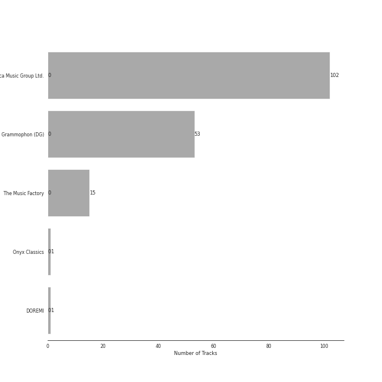

# Chopin

[172 songs](chopin_tracks.md)

## Top Artists

See all 7 artists

|   Number of Tracks | Art                                                                                              | Artist                                                 | 🔗                                                           |
|-------------------:|:-------------------------------------------------------------------------------------------------|:-------------------------------------------------------|:------------------------------------------------------------|
|                157 |  | [Frédéric Chopin](../artists/fr_d_ric_chopin.md)       | [🔗](https://open.spotify.com/artist/7y97mc3bZRFXzT2szRM4L4) |
|                102 |  | [Vladimir Ashkenazy](../artists/vladimir_ashkenazy.md) | [🔗](https://open.spotify.com/artist/20iZXzMb8LoWXOeca32i82) |
|                 31 |  | [Martha Argerich](../artists/martha_argerich.md)       | [🔗](https://open.spotify.com/artist/66MvLAvLznk5UOvASVGjk4) |
|                 19 |  | [Maurizio Pollini](../artists/maurizio_pollini.md)     | [🔗](https://open.spotify.com/artist/2VIdKQmRHnWofsR4odfFOh) |
|                 15 |  | [Peter Schmalfuss](../artists/peter_schmalfuss.md)     | [🔗](https://open.spotify.com/artist/7mOe6jfxX9EILXET9l5L6H) |
|                  4 |  | Krystian Zimerman                                      | [🔗](https://open.spotify.com/artist/43wuPaPcZVMJQWLRaPR4Yz) |
|                  1 |  | Nikolai Lugansky                                       | [🔗](https://open.spotify.com/artist/2bMfnyPOgNaeK8WNnXNXud) |

## Top Albums

See all 9 albums

|   Number of Tracks | Art                                                                                              | Album                                                                     | 🔗                                                          |
|-------------------:|:-------------------------------------------------------------------------------------------------|:--------------------------------------------------------------------------|:-----------------------------------------------------------|
|                 49 |  | Chopin: Waltzes; 4 Scherzos; 26 Preludes                                  | [🔗](https://open.spotify.com/album/0yCrQ6dCqiI6ldqI8LPqWB) |
|                 30 |  | Chopin: Preludes; Sonata No.2                                             | [🔗](https://open.spotify.com/album/33YXJqoFV5AQwbo4yfk22n) |
|                 28 |  | Chopin: Polonaises                                                        | [🔗](https://open.spotify.com/album/19ofW4fqCAR2uQJKVWw6L6) |
|                 25 |  | Chopin: Nocturnes; Four Ballades                                          | [🔗](https://open.spotify.com/album/0lrM7kR5o7iqkajLKIlzRg) |
|                 19 |  | Chopin: Nocturnes                                                         | [🔗](https://open.spotify.com/album/2aoSpTAjFaMvaZeruqnCVv) |
|                 15 |  | Frederic Chopin - Waltzes & Nocturnes                                     | [🔗](https://open.spotify.com/album/3USjXpMk5Pga22AZua7vNT) |
|                  4 |  | Chopin: Ballades; Barcarolle; Fantaisie                                   | [🔗](https://open.spotify.com/album/5c9v5oU43Oo22MSG8EKFp2) |
|                  1 |  | Martha Argerich Live, Vol. 4                                              | [🔗](https://open.spotify.com/album/69aoRIAIVb2TbIuxmxKYCR) |
|                  1 |  | Chopin: Piano Sonata No. 3, Fantasie-impromptu, Prélude, Nocturne, et al. | [🔗](https://open.spotify.com/album/5QmPVpRux60kcHndJOl6bF) |

## Top Record Labels

See all 5 labels

|   Number of Tracks | Label                    |
|-------------------:|:-------------------------|
|                102 | Decca Music Group Ltd.   |
|                 53 | Deutsche Grammophon (DG) |
|                 15 | The Music Factory        |
|                  1 | Onyx Classics            |
|                  1 | DOREMI                   |

