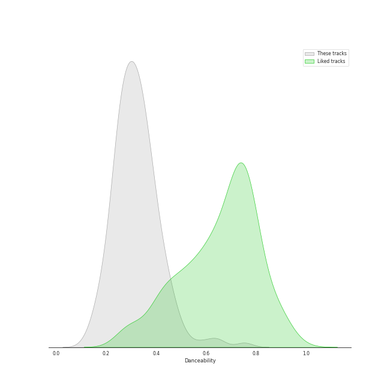
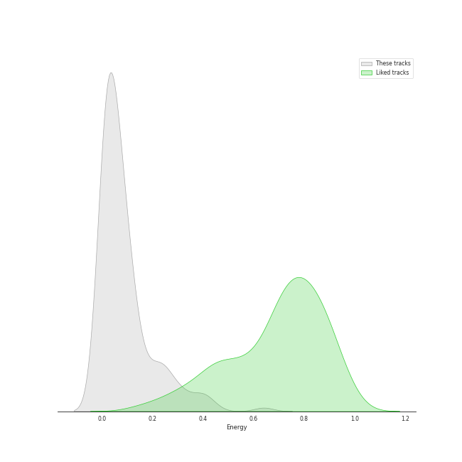
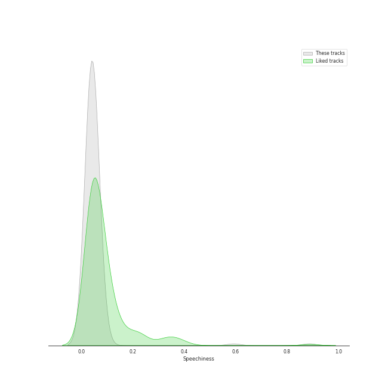
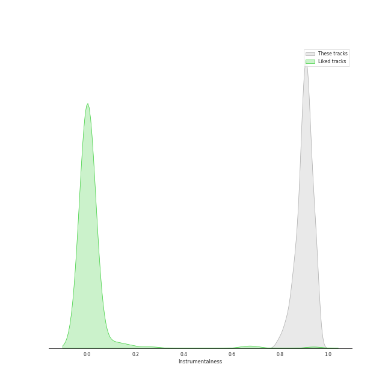
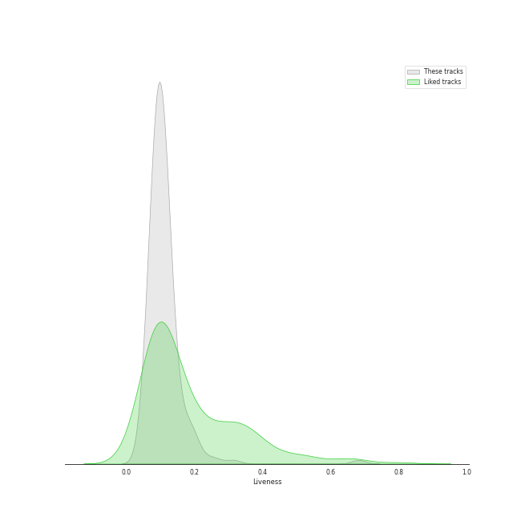
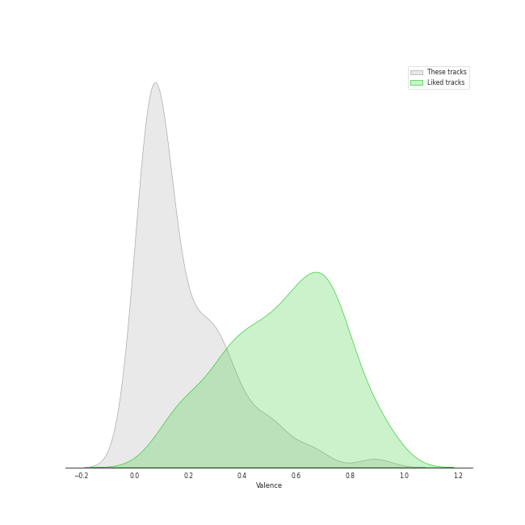
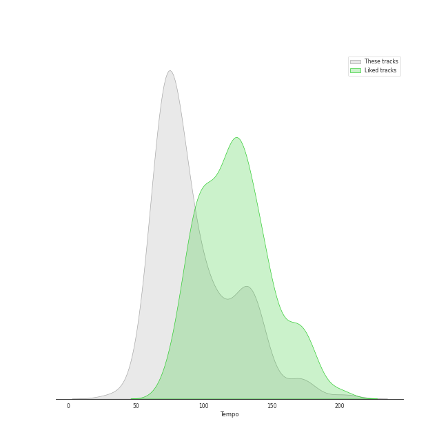

# Track Features for Chopin

## Danceability

| ​ | 10 most Danceable tracks | ​​ | 10 least Danceable tracks |
|:---|:---|:---|:---|
|  | 24 Préludes, Op. 28: No. 20 in C Minor: Largo (0.753) |  | 24 Préludes, Op. 28: No. 13 in F-Sharp Major: Lento (0.124) |
|  | 24 Préludes, Op. 28: No. 20 in C Minor: Largo (0.677) |  | 24 Préludes, Op. 28: No. 23 in F Major: Moderato (0.148) |
|  | 24 Préludes, Op. 28: No. 10 in C-Sharp Minor: Molto allegro (0.629) |  | 24 Préludes, Op. 28: No. 23 in F Major (0.162) |
|  | 24 Préludes, Op. 28: No. 7 in A Major: Andantino (0.58) |  | 24 Préludes, Op. 28: No. 22 in G Minor (0.175) |
|  | 24 Préludes, Op. 28: No. 7 in A Major (0.547) |  | Piano Sonata No. 2 in B-Flat Minor, Op. 35: IV. Finale (0.175) |
|  | Feuille d'album in E, Op. posth. (0.521) |  | 24 Préludes, Op. 28: No. 3 in G Major: Vivace (0.177) |
|  | Galop Marquis (0.489) |  | Nocturne No.4 Op.15-1 F Major (0.182) |
|  | 24 Préludes, Op. 28: No. 12 in G-Sharp Minor: Presto (0.466) |  | Etude in F minor, Op. posth. " Méthode des méthodes " (0.196) |
|  | Waltz No.11 Op.70-1 G Flat Major (0.46) |  | Nocturne No. 3 In B, Op. 9 No. 3 (0.196) |
|  | 24 Préludes, Op. 28: No. 10 in C-Sharp Minor (0.458) |  | 24 Préludes, Op. 28: No. 8 in F-Sharp Minor: Molto agitato (0.201) |

## Energy

| ​ | 10 most Energetic tracks | ​​ | 10 least Energetic tracks |
|:---|:---|:---|:---|
|  | 24 Préludes, Op. 28: No. 22 in G Minor (0.641) |  | 24 Préludes, Op. 28: No. 7 in A Major (0.00168) |
|  | 24 Préludes, Op. 28: No. 14 in E-Flat Minor (0.44) |  | 24 Préludes, Op. 28: No. 7 in A Major: Andantino (0.00174) |
|  | Polonaise No. 6 in A-Flat Major, Op. 53, "Heroic" (0.413) |  | 24 Préludes, Op. 28: No. 2 in A Minor (0.00189) |
|  | 24 Préludes, Op. 28: No. 24 in D Minor: Allegro appassionato (0.399) |  | 24 Préludes, Op. 28: No. 13 in F-Sharp Major: Lento (0.0019) |
|  | 24 Préludes, Op. 28: No. 22 in G Minor: Molto agitato (0.392) |  | Nocturne No.6 Op.15-3 G Minor (0.00191) |
|  | Galop Marquis (0.389) |  | 24 Préludes, Op. 28: No. 2 in A Minor: Lento (0.00223) |
|  | 24 Préludes, Op. 28: No. 16 in B-Flat Minor (0.348) |  | Nocturne No.2 Op.9-2 E Flat Major (0.00265) |
|  | 24 Préludes, Op. 28: No. 1 in C Major (0.327) |  | Nocturne No.9 Op.32-1 B Major (0.00323) |
|  | 24 Préludes, Op. 28: No. 18 in F Minor (0.321) |  | 24 Préludes, Op. 28: No. 6 in B Minor: Lento assai (0.00399) |
|  | 24 Préludes, Op. 28: No. 24 in D Minor: Allegro appassionato (0.307) |  | Nocturne No.4 Op.15-1 F Major (0.00408) |

## Speechiness

| ​ | 10 most Speechy tracks | ​​ | 10 least Speechy tracks |
|:---|:---|:---|:---|
|  | 24 Préludes, Op. 28: No. 20 in C Minor: Largo (0.879) |  | 24 Préludes, Op. 28: No. 24 in D Minor: Allegro appassionato (0.0298) |
|  | 24 Préludes, Op. 28: No. 20 in C Minor: Largo (0.592) |  | 24 Préludes, Op. 28: No. 12. in G-Sharp Minor (0.03) |
|  | 24 Préludes, Op. 28: No. 10 in C-Sharp Minor: Molto allegro (0.081) |  | 24 Préludes, Op. 28: No. 3 in G Major: Vivace (0.0303) |
|  | 24 Préludes, Op. 28: No. 7 in A Major (0.0802) |  | Polonaise No. 6 in A flat, Op. 53 -"Heroic" (0.0308) |
|  | 24 Préludes, Op. 28: No. 7 in A Major: Andantino (0.0694) |  | 24 Préludes, Op. 28: No. 8 in F-Sharp Minor (0.0314) |
|  | 24 Préludes, Op. 28: No. 4 in E Minor: Largo (0.0613) |  | 24 Préludes, Op. 28: No. 22 in G Minor (0.0324) |
|  | 24 Préludes, Op. 28: No. 6 in B Minor: Lento assai (0.0605) |  | 24 Préludes, Op. 28: No. 24 in D Minor: Allegro appassionato (0.0325) |
|  | 24 Préludes, Op. 28: No. 4 in E Minor (0.0579) |  | Berceuse in D-Flat Major, Op. 57 (0.0327) |
|  | Piano Sonata No. 2 in B-Flat Minor, Op. 35: III. Marche funèbre (0.0559) |  | Nocturne No. 15 In F Minor, Op. 55 No. 1 (0.0336) |
|  | Nocturne No.6 Op.15-3 G Minor (0.0557) |  | 24 Préludes, Op. 28: No. 16 in B-Flat Minor (0.0336) |

## Acousticness

| ​ | 10 most Acoustic tracks | ​​ | 10 least Acoustic tracks |
|:---|:---|:---|:---|
|  | Nocturne No. 11 In G Minor, Op. 37 No. 1 (0.996) |  | 24 Préludes, Op. 28: No. 22 in G Minor: Molto agitato (0.915) |
|  | Nocturne No. 12 In G, Op. 37 No. 2 (0.996) |  | 24 Préludes, Op. 28: No. 24 in D Minor: Allegro appassionato (0.928) |
|  | Wiosna, B117 (arr. from Op. 74/2) (0.996) |  | 24 Préludes, Op. 28: No. 14 in E-Flat Minor: Allegro (0.944) |
|  | Feuille d'album in E, Op. posth. (0.995) |  | 24 Préludes, Op. 28: No. 22 in G Minor (0.955) |
|  | 24 Préludes, Op. 28: No. 13 in F-Sharp Major (0.995) |  | 24 Préludes, Op. 28: No. 19 in E-Flat Major (0.961) |
|  | Waltz No.9 Op.69-1 A Flat Major (0.995) |  | Polonaise No. 6 in A-Flat Major, Op. 53, "Heroic" (0.971) |
|  | Nocturne No.10 Op.32-2 A Flat Major (0.995) |  | 24 Préludes, Op. 28: No. 24 in D Minor: Allegro appassionato (0.971) |
|  | 24 Préludes, Op. 28: No. 6 in B Minor: Lento assai (0.995) |  | 24 Préludes, Op. 28: No. 8 in F-Sharp Minor: Molto agitato (0.972) |
|  | Nocturne No. 9 In B, Op. 32 No. 1 (0.995) |  | 24 Préludes, Op. 28: No. 9 in E Major: Largo (0.976) |
|  | Nocturne No. 6 In G Minor, Op. 15 No. 3 (0.995) |  | 24 Préludes, Op. 28: No. 16 in B-Flat Minor: Presto con fuoco (0.976) |

## Instrumentalness

| ​ | 10 most Instrumental tracks | ​​ | 10 least Instrumental tracks |
|:---|:---|:---|:---|
|  | 24 Préludes, Op. 28: No. 10 in C-Sharp Minor (0.964) |  | Ballade No. 3 In A-Flat Major, Op. 47 (0.788) |
|  | Nocturne No. 8 In D Flat, Op. 27 No. 2 - 2005 Recording (0.959) |  | 24 Préludes, Op. 28: No. 5 in D Major: Molto allegro (0.805) |
|  | 24 Préludes, Op. 28: No. 11 in B Major (0.956) |  | 24 Préludes, Op. 28: No. 18 in F Minor (0.806) |
|  | 24 Préludes, Op. 28: No. 7 in A Major: Andantino (0.956) |  | 24 Préludes, Op. 28: No. 7 in A Major (0.821) |
|  | 24 Préludes, Op. 28: No. 10 in C-Sharp Minor: Molto allegro (0.955) |  | Nocturne No. 19 In E Minor, Op. 72 No. 1 (0.822) |
|  | Nocturne No.2 Op.9-2 E Flat Major (0.953) |  | 24 Préludes, Op. 28: No. 14 in E-Flat Minor: Allegro (0.824) |
|  | Nocturne No. 2 In E Flat, Op. 9 No. 2 (0.953) |  | 24 Préludes, Op. 28: No. 24 in D Minor: Allegro appassionato (0.831) |
|  | Nocturne No. 6 in G Minor, Op. 15 No. 3 (0.952) |  | 24 Préludes, Op. 28: No. 1 in C Major (0.832) |
|  | Nocturne No.6 Op.15-3 G Minor (0.952) |  | Waltz No. 19 in A Minor, Op. Posth. (0.839) |
|  | Waltz No. 15 in E Major, Op. posth. (0.949) |  | Polonaise in G sharp minor, Op. posth. (0.84) |

## Liveness

| ​ | 10 most Live tracks | ​​ | 10 least Live tracks |
|:---|:---|:---|:---|
|  | Polonaise No. 6 in A-Flat Major, Op. 53, "Heroic" (0.682) |  | Ballade No. 2 in F Major, Op. 38 (0.0494) |
|  | 24 Préludes, Op. 28: No. 16 in B-Flat Minor (0.314) |  | Nocturne No.6 Op.15-3 G Minor (0.05) |
|  | 24 Préludes, Op. 28: No. 22 in G Minor (0.264) |  | 24 Préludes, Op. 28: No. 7 in A Major: Andantino (0.0504) |
|  | Waltz No. 8 in A-Flat Major, Op. 64 No. 3 (0.24) |  | Nocturne No.5 Op.15-2 F Sharp Major (0.0511) |
|  | 24 Préludes, Op. 28: No. 16 in B-Flat Minor: Presto con fuoco (0.208) |  | Nocturne No.2 Op.9-2 E Flat Major (0.0558) |
|  | Polonaise in B flat, Op. posth. (0.201) |  | Nocturne No.8 Op.27-2 D Flat Major (0.0567) |
|  | Waltz No. 6 in D-Flat, Op. 64, No. 1 "Minute" (0.2) |  | Scherzo No. 1 In B Minor, Op. 20 (0.0569) |
|  | Nocturne No. 1 in B-Flat Minor, Op. 9 No. 1 (0.198) |  | Nocturne No. 15 in F Minor, Op. 55 No. 1 (0.0584) |
|  | Ballade No. 3 in A flat major, Op. 47 (0.189) |  | Nocturne No. 15 In F Minor, Op. 55 No. 1 (0.0616) |
|  | 2 Bourrees, B160b (0.188) |  | Nocturne No. 11 In G Minor, Op. 37 No. 1 (0.0617) |

## Valence

| ​ | 10 most Happy tracks | ​​ | 10 least Happy tracks |
|:---|:---|:---|:---|
|  | Galop Marquis (0.893) |  | 24 Préludes, Op. 28: No. 7 in A Major: Andantino (0.0) |
|  | Waltz No. 16 in A flat, Op. posth. (0.89) |  | 24 Préludes, Op. 28: No. 9 in E Major: Largo (0.0292) |
|  | 24 Préludes, Op. 28: No. 11 in B Major: Vivace (0.701) |  | 24 Préludes, Op. 28: No. 9 in E Major (0.0329) |
|  | Fugue in A minor (0.657) |  | 24 Préludes, Op. 28: No. 4 in E Minor: Largo (0.0354) |
|  | 24 Préludes, Op. 28: No. 22 in G Minor (0.645) |  | Etude in A flat, Op. posth. " Méthode des méthodes " (0.0362) |
|  | Tarantelle In A Flat, Op. 43 (0.639) |  | Ballade No. 2 in F Major, Op. 38 (0.0364) |
|  | 24 Préludes, Op. 28: No. 22 in G Minor: Molto agitato (0.611) |  | Ballade No. 4 in F Minor, Op. 52 (0.037) |
|  | Prélude No.26 in A Flat, Op.posth. (0.54) |  | 24 Préludes, Op. 28: No. 8 in F-Sharp Minor: Molto agitato (0.0375) |
|  | 24 Préludes, Op. 28: No. 12. in G-Sharp Minor (0.524) |  | Nocturne No. 8 In D Flat, Op. 27 No. 2 - 2005 Recording (0.0376) |
|  | Polonaise in A flat, Op. posth. (0.521) |  | Nocturne No. 12 In G, Op. 37 No. 2 (0.038) |

## Tempo

| ​ | 10 most Fast tracks | ​​ | 10 least Fast tracks |
|:---|:---|:---|:---|
|  | 24 Préludes, Op. 28: No. 6 in B Minor: Lento assai (203.905) |  | 24 Préludes, Op. 28: No. 20 in C Minor: Largo (34.105) |
|  | 24 Préludes, Op. 28: No. 19 in E-Flat Major: Vivace (174.421) |  | 24 Préludes, Op. 28: No. 8 in F-Sharp Minor: Molto agitato (53.925) |
|  | Waltz No.10 Op.69-2 B Minor (174.212) |  | Nocturne No. 8 In D Flat, Op. 27 No. 2 - 2005 Recording (55.543) |
|  | Waltz No. 12 in F Minor, Op. 70 No. 2 (170.339) |  | Piano Sonata No. 2 in B-Flat Minor, Op. 35: III. Marche funèbre (56.814) |
|  | Nocturne No. 13 In C Minor, Op. 48 No. 1 (169.266) |  | Waltz No. 11 in G-Flat Major, Op. 70 No. 1 (58.131) |
|  | Waltz No. 3 in A Minor, Op. 34 No. 2 (169.24) |  | 24 Préludes, Op. 28: No. 7 in A Major: Andantino (59.272) |
|  | Waltz No. 4 in F Major, Op. 34 No. 3 (148.432) |  | 24 Préludes, Op. 28: No. 18 in F Minor: Molto allegro (59.67) |
|  | Etude in F minor, Op. posth. " Méthode des méthodes " (146.317) |  | Waltz No. 10 in B Minor, Op. 69 No. 2 (63.411) |
|  | 2 Bourrees, B160b (143.182) |  | Piano Sonata No. 2 in B-Flat Minor, Op. 35: IV. Finale (63.671) |
|  | Nocturne No. 19 In E Minor, Op. 72 No. 1 (139.027) |  | Nocturne No.10 Op.32-2 A Flat Major (63.993) |
