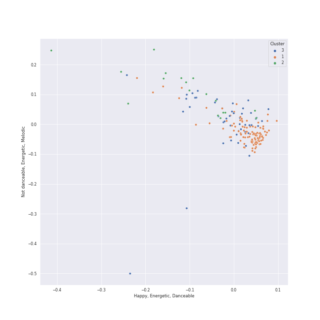

# Clusters in Chopin

## Cluster #1

48 tracks

| Art | Track | Album | Artists | Label | Rank | 💚 | 🔗 |
|:---|:---|:---|:---|:---|---:|:---|:---|
|  | Waltz No. 10 in B Minor, Op. 69 No. 2 | Chopin: Waltzes; 4 Scherzos; 26 Preludes | [Frédéric Chopin](../../../../artists/frédéric_chopin/overview.md), [Vladimir Ashkenazy](../../../../artists/vladimir_ashkenazy/overview.md) | [Decca Music Group Ltd.](../../../../labels/decca_music_group_ltd_) | 840 | | [🔗](https://open.spotify.com/track/0r97HhdPS2gmxlC8VlY40s) |
|  | Waltz No. 1 in E-Flat Major, Op. 18 "Grande valse brillante" | Chopin: Waltzes; 4 Scherzos; 26 Preludes | [Frédéric Chopin](../../../../artists/frédéric_chopin/overview.md), [Vladimir Ashkenazy](../../../../artists/vladimir_ashkenazy/overview.md) | [Decca Music Group Ltd.](../../../../labels/decca_music_group_ltd_) | 840 | | [🔗](https://open.spotify.com/track/1vWAWChbVffjnpl6PPzUA4) |
|  | 24 Préludes, Op. 28: No. 1 in C Major: Agitato | Chopin: Waltzes; 4 Scherzos; 26 Preludes | [Frédéric Chopin](../../../../artists/frédéric_chopin/overview.md), [Vladimir Ashkenazy](../../../../artists/vladimir_ashkenazy/overview.md) | [Decca Music Group Ltd.](../../../../labels/decca_music_group_ltd_) | 840 | | [🔗](https://open.spotify.com/track/2Yf9vmbIP7T5ePTWJBRHLB) |
|  | Waltz No. 13 in D-Flat Major, Op. 70 No. 3 | Chopin: Waltzes; 4 Scherzos; 26 Preludes | [Frédéric Chopin](../../../../artists/frédéric_chopin/overview.md), [Vladimir Ashkenazy](../../../../artists/vladimir_ashkenazy/overview.md) | [Decca Music Group Ltd.](../../../../labels/decca_music_group_ltd_) | 840 | | [🔗](https://open.spotify.com/track/581cgS1NDR4ccoyJ8Mlumr) |
|  | Waltz No. 4 in F Major, Op. 34 No. 3 | Chopin: Waltzes; 4 Scherzos; 26 Preludes | [Frédéric Chopin](../../../../artists/frédéric_chopin/overview.md), [Vladimir Ashkenazy](../../../../artists/vladimir_ashkenazy/overview.md) | [Decca Music Group Ltd.](../../../../labels/decca_music_group_ltd_) | 840 | | [🔗](https://open.spotify.com/track/663LMA5z3qtBuiFLhnjvvI) |
|  | Waltz No. 2 in A flat major, Op. 34 No. 1 "Valse brillante" | Chopin: Waltzes; 4 Scherzos; 26 Preludes | [Frédéric Chopin](../../../../artists/frédéric_chopin/overview.md), [Vladimir Ashkenazy](../../../../artists/vladimir_ashkenazy/overview.md) | [Decca Music Group Ltd.](../../../../labels/decca_music_group_ltd_) | 840 | | [🔗](https://open.spotify.com/track/6rNiQAbUis4ZH4kALwJzK2) |
|  | Waltz No. 14 in E Minor, Op. posth. | Chopin: Waltzes; 4 Scherzos; 26 Preludes | [Frédéric Chopin](../../../../artists/frédéric_chopin/overview.md), [Vladimir Ashkenazy](../../../../artists/vladimir_ashkenazy/overview.md) | [Decca Music Group Ltd.](../../../../labels/decca_music_group_ltd_) | 840 | | [🔗](https://open.spotify.com/track/6tr9C1mh55dkKIXRjhpa5p) |
|  | Polonaise in G-Flat Major, Op. posth. | Chopin: Polonaises | [Frédéric Chopin](../../../../artists/frédéric_chopin/overview.md), [Vladimir Ashkenazy](../../../../artists/vladimir_ashkenazy/overview.md) | [Decca Music Group Ltd.](../../../../labels/decca_music_group_ltd_) | 840 | | [🔗](https://open.spotify.com/track/1K1wiCI72t7woE8VfrJg2K) |
|  | 24 Préludes, Op. 28: No. 23 in F Major | Chopin: Preludes; Sonata No.2 | [Frédéric Chopin](../../../../artists/frédéric_chopin/overview.md), Martha Argerich | [Deutsche Grammophon (DG)](../../../../labels/deutsche_grammophon_(dg)) | 840 | | [🔗](https://open.spotify.com/track/5SdOHEgN9vaJ79loXY16qr) |
|  | 24 Préludes, Op. 28: No. 11 in B Major | Chopin: Preludes; Sonata No.2 | [Frédéric Chopin](../../../../artists/frédéric_chopin/overview.md), Martha Argerich | [Deutsche Grammophon (DG)](../../../../labels/deutsche_grammophon_(dg)) | 840 | | [🔗](https://open.spotify.com/track/7ctTTNs8nDbWRgd8j8vnck) |
## Cluster #2

18 tracks

| Art | Track | Album | Artists | Label | Rank | 💚 | 🔗 |
|:---|:---|:---|:---|:---|---:|:---|:---|
|  | Prélude No.26 in A Flat, Op.posth. | Chopin: Waltzes; 4 Scherzos; 26 Preludes | [Frédéric Chopin](../../../../artists/frédéric_chopin/overview.md), [Vladimir Ashkenazy](../../../../artists/vladimir_ashkenazy/overview.md) | [Decca Music Group Ltd.](../../../../labels/decca_music_group_ltd_) | 840 | | [🔗](https://open.spotify.com/track/0TQZ0MQ7DBUD1am9Hm9xqZ) |
|  | 24 Préludes, Op. 28: No. 12 in G-Sharp Minor: Presto | Chopin: Waltzes; 4 Scherzos; 26 Preludes | [Frédéric Chopin](../../../../artists/frédéric_chopin/overview.md), [Vladimir Ashkenazy](../../../../artists/vladimir_ashkenazy/overview.md) | [Decca Music Group Ltd.](../../../../labels/decca_music_group_ltd_) | 840 | | [🔗](https://open.spotify.com/track/1ChXCn8eqUoqMsGxeYEIEH) |
|  | 24 Préludes, Op. 28: No. 16 in B-Flat Minor: Presto con fuoco | Chopin: Waltzes; 4 Scherzos; 26 Preludes | [Frédéric Chopin](../../../../artists/frédéric_chopin/overview.md), [Vladimir Ashkenazy](../../../../artists/vladimir_ashkenazy/overview.md) | [Decca Music Group Ltd.](../../../../labels/decca_music_group_ltd_) | 840 | | [🔗](https://open.spotify.com/track/1KZYPGDt5PQGVekS9jpLG6) |
|  | Tarantelle In A Flat, Op. 43 | Chopin: Polonaises | [Frédéric Chopin](../../../../artists/frédéric_chopin/overview.md), [Vladimir Ashkenazy](../../../../artists/vladimir_ashkenazy/overview.md) | [Decca Music Group Ltd.](../../../../labels/decca_music_group_ltd_) | 840 | | [🔗](https://open.spotify.com/track/0Dy23NaykLsmz6VM0lUJ9e) |
|  | 2 Bourrees, B160b | Chopin: Polonaises | [Frédéric Chopin](../../../../artists/frédéric_chopin/overview.md), [Vladimir Ashkenazy](../../../../artists/vladimir_ashkenazy/overview.md) | [Decca Music Group Ltd.](../../../../labels/decca_music_group_ltd_) | 840 | | [🔗](https://open.spotify.com/track/0NQBcvME4NKAruNFixVDa8) |
|  | Etude in D flat, Op. posth. " Méthode des méthodes " | Chopin: Polonaises | [Frédéric Chopin](../../../../artists/frédéric_chopin/overview.md), [Vladimir Ashkenazy](../../../../artists/vladimir_ashkenazy/overview.md) | [Decca Music Group Ltd.](../../../../labels/decca_music_group_ltd_) | 840 | | [🔗](https://open.spotify.com/track/0banlptk443bq1tLPFcy0f) |
|  | Fugue in A minor | Chopin: Polonaises | [Frédéric Chopin](../../../../artists/frédéric_chopin/overview.md), [Vladimir Ashkenazy](../../../../artists/vladimir_ashkenazy/overview.md) | [Decca Music Group Ltd.](../../../../labels/decca_music_group_ltd_) | 840 | | [🔗](https://open.spotify.com/track/31dHappgsBbViaFb5O26AD) |
|  | Polonaise in A flat, Op. posth. | Chopin: Polonaises | [Frédéric Chopin](../../../../artists/frédéric_chopin/overview.md), [Vladimir Ashkenazy](../../../../artists/vladimir_ashkenazy/overview.md) | [Decca Music Group Ltd.](../../../../labels/decca_music_group_ltd_) | 840 | | [🔗](https://open.spotify.com/track/5ggAFuPO4UTnwTyQvsXKrH) |
|  | 24 Préludes, Op. 28: No. 12. in G-Sharp Minor | Chopin: Preludes; Sonata No.2 | [Frédéric Chopin](../../../../artists/frédéric_chopin/overview.md), Martha Argerich | [Deutsche Grammophon (DG)](../../../../labels/deutsche_grammophon_(dg)) | 840 | | [🔗](https://open.spotify.com/track/0SB6a6YMfoGPVLD1Jgc1rn) |
|  | 24 Préludes, Op. 28: No. 18 in F Minor | Chopin: Preludes; Sonata No.2 | [Frédéric Chopin](../../../../artists/frédéric_chopin/overview.md), Martha Argerich | [Deutsche Grammophon (DG)](../../../../labels/deutsche_grammophon_(dg)) | 840 | | [🔗](https://open.spotify.com/track/3DdmRDwJQhq5fvV0GMk2Zx) |
## Cluster #3

106 tracks

| Art | Track | Album | Artists | Label | Rank | 💚 | 🔗 |
|:---|:---|:---|:---|:---|---:|:---|:---|
|  | Scherzo No. 2 in B Flat Minor, Op. 31 | Chopin: Waltzes; 4 Scherzos; 26 Preludes | [Frédéric Chopin](../../../../artists/frédéric_chopin/overview.md), [Vladimir Ashkenazy](../../../../artists/vladimir_ashkenazy/overview.md) | [Decca Music Group Ltd.](../../../../labels/decca_music_group_ltd_) | 840 | | [🔗](https://open.spotify.com/track/3O2O8b69mNozAOATbfbKDP) |
|  | 24 Préludes, Op. 28: No. 21 in B-Flat Major: Cantabile | Chopin: Waltzes; 4 Scherzos; 26 Preludes | [Frédéric Chopin](../../../../artists/frédéric_chopin/overview.md), [Vladimir Ashkenazy](../../../../artists/vladimir_ashkenazy/overview.md) | [Decca Music Group Ltd.](../../../../labels/decca_music_group_ltd_) | 840 | | [🔗](https://open.spotify.com/track/3WCamrmSMc9lwnY7GygErR) |
|  | Nocturne No. 9 in B Major, Op. 32 No. 1 | Chopin: Nocturnes; Four Ballades | [Frédéric Chopin](../../../../artists/frédéric_chopin/overview.md), [Vladimir Ashkenazy](../../../../artists/vladimir_ashkenazy/overview.md) | [Decca Music Group Ltd.](../../../../labels/decca_music_group_ltd_) | 840 | | [🔗](https://open.spotify.com/track/08GWfq6GjYQ63lPKTrTMOb) |
|  | Nocturne in C Minor, B. 108 | Chopin: Nocturnes; Four Ballades | [Frédéric Chopin](../../../../artists/frédéric_chopin/overview.md), [Vladimir Ashkenazy](../../../../artists/vladimir_ashkenazy/overview.md) | [Decca Music Group Ltd.](../../../../labels/decca_music_group_ltd_) | 840 | | [🔗](https://open.spotify.com/track/0Wy1PVVtoKXI259E43Hivl) |
|  | Nocturne No. 5 in F-Sharp Major, Op. 15 No. 2 | Chopin: Nocturnes; Four Ballades | [Frédéric Chopin](../../../../artists/frédéric_chopin/overview.md), [Vladimir Ashkenazy](../../../../artists/vladimir_ashkenazy/overview.md) | [Decca Music Group Ltd.](../../../../labels/decca_music_group_ltd_) | 840 | | [🔗](https://open.spotify.com/track/3pMMV07c8cnoEq4cCPwZnV) |
|  | Nocturne No. 3 in B Major, Op. 9 No. 3 | Chopin: Nocturnes; Four Ballades | [Frédéric Chopin](../../../../artists/frédéric_chopin/overview.md), [Vladimir Ashkenazy](../../../../artists/vladimir_ashkenazy/overview.md) | [Decca Music Group Ltd.](../../../../labels/decca_music_group_ltd_) | 840 | | [🔗](https://open.spotify.com/track/6hkWg7ZomgbZNI26ZuXl5E) |
|  | Nocturne No. 18 in E Major, Op. 62 No. 2 | Chopin: Nocturnes; Four Ballades | [Frédéric Chopin](../../../../artists/frédéric_chopin/overview.md), [Vladimir Ashkenazy](../../../../artists/vladimir_ashkenazy/overview.md) | [Decca Music Group Ltd.](../../../../labels/decca_music_group_ltd_) | 840 | | [🔗](https://open.spotify.com/track/6la3MMpUCkvxN2HgoQWvf3) |
|  | Polonaise No. 1 in C sharp minor, Op. 26 No. 1 | Chopin: Polonaises | [Frédéric Chopin](../../../../artists/frédéric_chopin/overview.md), [Vladimir Ashkenazy](../../../../artists/vladimir_ashkenazy/overview.md) | [Decca Music Group Ltd.](../../../../labels/decca_music_group_ltd_) | 840 | | [🔗](https://open.spotify.com/track/1OCezcm1Sy4qHouo4S5pYp) |
|  | Prélude in C-Sharp Minor, Op. 45 | Chopin: Preludes; Sonata No.2 | [Frédéric Chopin](../../../../artists/frédéric_chopin/overview.md), Martha Argerich | [Deutsche Grammophon (DG)](../../../../labels/deutsche_grammophon_(dg)) | 840 | | [🔗](https://open.spotify.com/track/1RvTfoN03GvpUpTdz5zpHz) |
|  | 24 Préludes, Op. 28: No. 21 in B-Flat Major | Chopin: Preludes; Sonata No.2 | [Frédéric Chopin](../../../../artists/frédéric_chopin/overview.md), Martha Argerich | [Deutsche Grammophon (DG)](../../../../labels/deutsche_grammophon_(dg)) | 840 | | [🔗](https://open.spotify.com/track/7IOQW4DHliCO1l7xG9dL80) |