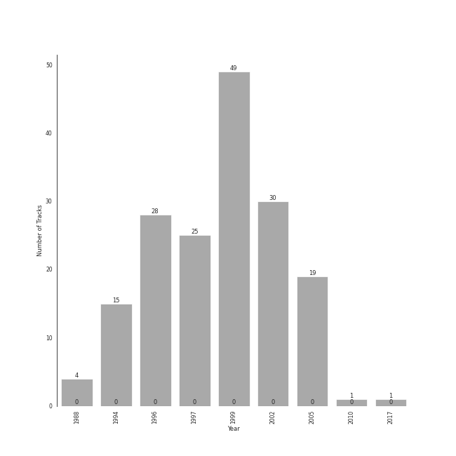

# Chopin

[172 songs](tracks.md)

## Top Artists

See all 7 artists

| Number of Tracks | Art | Artist | 🔗 |
|---:|:---|:---|:---|
| 157 |  | Frédéric Chopin | [🔗](https://open.spotify.com/artist/7y97mc3bZRFXzT2szRM4L4) |
| 102 |  | Vladimir Ashkenazy | [🔗](https://open.spotify.com/artist/20iZXzMb8LoWXOeca32i82) |
| 31 |  | Martha Argerich | [🔗](https://open.spotify.com/artist/66MvLAvLznk5UOvASVGjk4) |
| 19 |  | Maurizio Pollini | [🔗](https://open.spotify.com/artist/2VIdKQmRHnWofsR4odfFOh) |
| 15 |  | Peter Schmalfuss | [🔗](https://open.spotify.com/artist/7mOe6jfxX9EILXET9l5L6H) |
| 4 |  | Krystian Zimerman | [🔗](https://open.spotify.com/artist/43wuPaPcZVMJQWLRaPR4Yz) |
| 1 |  | Nikolai Lugansky | [🔗](https://open.spotify.com/artist/2bMfnyPOgNaeK8WNnXNXud) |

## Top Albums

See all 9 albums

| Number of Tracks | Art | Album | Release Date | 🔗 |
|---:|:---|:---|:---|:---|
| 49 |  | Chopin: Waltzes; 4 Scherzos; 26 Preludes | 1999-01-01 | [🔗](https://open.spotify.com/album/0yCrQ6dCqiI6ldqI8LPqWB) |
| 30 |  | Chopin: Preludes; Sonata No.2 | 2002-01-01 | [🔗](https://open.spotify.com/album/33YXJqoFV5AQwbo4yfk22n) |
| 28 |  | Chopin: Polonaises | 1996-01-01 | [🔗](https://open.spotify.com/album/19ofW4fqCAR2uQJKVWw6L6) |
| 25 |  | Chopin: Nocturnes; Four Ballades | 1997-01-01 | [🔗](https://open.spotify.com/album/0lrM7kR5o7iqkajLKIlzRg) |
| 19 |  | Chopin: Nocturnes | 2005-01-01 | [🔗](https://open.spotify.com/album/2aoSpTAjFaMvaZeruqnCVv) |
| 15 |  | Frederic Chopin - Waltzes & Nocturnes | 1994-07-01 | [🔗](https://open.spotify.com/album/3USjXpMk5Pga22AZua7vNT) |
| 4 |  | Chopin: Ballades; Barcarolle; Fantaisie | 1988-01-01 | [🔗](https://open.spotify.com/album/5c9v5oU43Oo22MSG8EKFp2) |
| 1 |  | Martha Argerich Live, Vol. 4 | 2017-01-20 | [🔗](https://open.spotify.com/album/69aoRIAIVb2TbIuxmxKYCR) |
| 1 |  | Chopin: Piano Sonata No. 3, Fantasie-impromptu, Prélude, Nocturne, et al. | 2010-04-05 | [🔗](https://open.spotify.com/album/5QmPVpRux60kcHndJOl6bF) |

## Top Record Labels

See all 5 labels

| Number of Tracks | Label |
|---:|:---|
| 102 | [Decca Music Group Ltd.](../../labels/decca_music_group_ltd_.md) |
| 53 | [Deutsche Grammophon (DG)](../../labels/deutsche_grammophon__dg_.md) |
| 15 | [The Music Factory](../../labels/the_music_factory.md) |
| 1 | Onyx Classics |
| 1 | DOREMI |

## Genres

See all 4 genres

| Number of Tracks | Genre |
|---:|:---|
| 157 | polish classical |
| 157 | early romantic era |
| 157 | classical |
| 15 | german classical piano |

## Years

View all years

| Year | Number of Tracks |
|:---|---:|
| 2017 | 1 |
| 2010 | 1 |
| 2005 | 19 |
| [2002](2002.md) | 30 |
| [1999](1999.md) | 49 |
| [1997](1997.md) | 25 |
| [1996](1996.md) | 28 |
| 1994 | 15 |
| 1988 | 4 |

| 10 newest albums | 10 oldest albums |
|:---|:---|
| 
 Martha Argerich Live, Vol. 4 (2017-01-20)
 | 
 Chopin: Ballades; Barcarolle; Fantaisie (1988-01-01)
 |
| 
 Chopin: Piano Sonata No. 3, Fantasie-impromptu, Prélude, Nocturne, et al. (2010-04-05)
 | 
 Frederic Chopin - Waltzes & Nocturnes (1994-07-01)
 |
| 
 Chopin: Nocturnes (2005-01-01)
 | 
 Chopin: Polonaises (1996-01-01)
 |
| 
 Chopin: Preludes; Sonata No.2 (2002-01-01)
 | 
 Chopin: Nocturnes; Four Ballades (1997-01-01)
 |
| 
 Chopin: Waltzes; 4 Scherzos; 26 Preludes (1999-01-01)
 | 
 Chopin: Waltzes; 4 Scherzos; 26 Preludes (1999-01-01)
 |
| 
 Chopin: Nocturnes; Four Ballades (1997-01-01)
 | 
 Chopin: Preludes; Sonata No.2 (2002-01-01)
 |
| 
 Chopin: Polonaises (1996-01-01)
 | 
 Chopin: Nocturnes (2005-01-01)
 |
| 
 Frederic Chopin - Waltzes & Nocturnes (1994-07-01)
 | 
 Chopin: Piano Sonata No. 3, Fantasie-impromptu, Prélude, Nocturne, et al. (2010-04-05)
 |
| 
 Chopin: Ballades; Barcarolle; Fantaisie (1988-01-01)
 | 
 Martha Argerich Live, Vol. 4 (2017-01-20)
 |
## Audio Features

| 10 most Danceable tracks | 10 least Danceable tracks |
|:---|:---|
| 24 Préludes, Op. 28: No. 20 in C Minor: Largo (0.753) | 24 Préludes, Op. 28: No. 13 in F-Sharp Major: Lento (0.124) |
| 24 Préludes, Op. 28: No. 20 in C Minor: Largo (0.677) | 24 Préludes, Op. 28: No. 23 in F Major: Moderato (0.148) |
| 24 Préludes, Op. 28: No. 10 in C-Sharp Minor: Molto allegro (0.629) | 24 Préludes, Op. 28: No. 23 in F Major (0.162) |
| 24 Préludes, Op. 28: No. 7 in A Major: Andantino (0.58) | 24 Préludes, Op. 28: No. 22 in G Minor (0.175) |
| 24 Préludes, Op. 28: No. 7 in A Major (0.547) | Piano Sonata No. 2 in B-Flat Minor, Op. 35: IV. Finale (0.175) |
| Feuille d'album in E, Op. posth. (0.521) | 24 Préludes, Op. 28: No. 3 in G Major: Vivace (0.177) |
| Galop Marquis (0.489) | Nocturne No.4 Op.15-1 F Major (0.182) |
| 24 Préludes, Op. 28: No. 12 in G-Sharp Minor: Presto (0.466) | Etude in F minor, Op. posth. " Méthode des méthodes " (0.196) |
| Waltz No.11 Op.70-1 G Flat Major (0.46) | Nocturne No. 3 In B, Op. 9 No. 3 (0.196) |
| 24 Préludes, Op. 28: No. 10 in C-Sharp Minor (0.458) | 24 Préludes, Op. 28: No. 8 in F-Sharp Minor: Molto agitato (0.201) |

| 10 most Energetic tracks | 10 least Energetic tracks |
|:---|:---|
| 24 Préludes, Op. 28: No. 22 in G Minor (0.641) | 24 Préludes, Op. 28: No. 7 in A Major (0.00168) |
| 24 Préludes, Op. 28: No. 14 in E-Flat Minor (0.44) | 24 Préludes, Op. 28: No. 7 in A Major: Andantino (0.00174) |
| Polonaise No. 6 in A-Flat Major, Op. 53, "Heroic" (0.413) | 24 Préludes, Op. 28: No. 2 in A Minor (0.00189) |
| 24 Préludes, Op. 28: No. 24 in D Minor: Allegro appassionato (0.399) | 24 Préludes, Op. 28: No. 13 in F-Sharp Major: Lento (0.0019) |
| 24 Préludes, Op. 28: No. 22 in G Minor: Molto agitato (0.392) | Nocturne No.6 Op.15-3 G Minor (0.00191) |
| Galop Marquis (0.389) | 24 Préludes, Op. 28: No. 2 in A Minor: Lento (0.00223) |
| 24 Préludes, Op. 28: No. 16 in B-Flat Minor (0.348) | Nocturne No.2 Op.9-2 E Flat Major (0.00265) |
| 24 Préludes, Op. 28: No. 1 in C Major (0.327) | Nocturne No.9 Op.32-1 B Major (0.00323) |
| 24 Préludes, Op. 28: No. 18 in F Minor (0.321) | 24 Préludes, Op. 28: No. 6 in B Minor: Lento assai (0.00399) |
| 24 Préludes, Op. 28: No. 24 in D Minor: Allegro appassionato (0.307) | Nocturne No.4 Op.15-1 F Major (0.00408) |

| 10 most Speechy tracks | 10 least Speechy tracks |
|:---|:---|
| 24 Préludes, Op. 28: No. 20 in C Minor: Largo (0.879) | 24 Préludes, Op. 28: No. 24 in D Minor: Allegro appassionato (0.0298) |
| 24 Préludes, Op. 28: No. 20 in C Minor: Largo (0.592) | 24 Préludes, Op. 28: No. 12. in G-Sharp Minor (0.03) |
| 24 Préludes, Op. 28: No. 10 in C-Sharp Minor: Molto allegro (0.081) | 24 Préludes, Op. 28: No. 3 in G Major: Vivace (0.0303) |
| 24 Préludes, Op. 28: No. 7 in A Major (0.0802) | Polonaise No. 6 in A flat, Op. 53 -"Heroic" (0.0308) |
| 24 Préludes, Op. 28: No. 7 in A Major: Andantino (0.0694) | 24 Préludes, Op. 28: No. 8 in F-Sharp Minor (0.0314) |
| 24 Préludes, Op. 28: No. 4 in E Minor: Largo (0.0613) | 24 Préludes, Op. 28: No. 22 in G Minor (0.0324) |
| 24 Préludes, Op. 28: No. 6 in B Minor: Lento assai (0.0605) | 24 Préludes, Op. 28: No. 24 in D Minor: Allegro appassionato (0.0325) |
| 24 Préludes, Op. 28: No. 4 in E Minor (0.0579) | Berceuse in D-Flat Major, Op. 57 (0.0327) |
| Piano Sonata No. 2 in B-Flat Minor, Op. 35: III. Marche funèbre (0.0559) | Nocturne No. 15 In F Minor, Op. 55 No. 1 (0.0336) |
| Nocturne No.6 Op.15-3 G Minor (0.0557) | 24 Préludes, Op. 28: No. 16 in B-Flat Minor (0.0336) |

| 10 most Acoustic tracks | 10 least Acoustic tracks |
|:---|:---|
| Nocturne No. 11 In G Minor, Op. 37 No. 1 (0.996) | 24 Préludes, Op. 28: No. 22 in G Minor: Molto agitato (0.915) |
| Nocturne No. 12 In G, Op. 37 No. 2 (0.996) | 24 Préludes, Op. 28: No. 24 in D Minor: Allegro appassionato (0.928) |
| Wiosna, B117 (arr. from Op. 74/2) (0.996) | 24 Préludes, Op. 28: No. 14 in E-Flat Minor: Allegro (0.944) |
| Feuille d'album in E, Op. posth. (0.995) | 24 Préludes, Op. 28: No. 22 in G Minor (0.955) |
| 24 Préludes, Op. 28: No. 13 in F-Sharp Major (0.995) | 24 Préludes, Op. 28: No. 19 in E-Flat Major (0.961) |
| Waltz No.9 Op.69-1 A Flat Major (0.995) | Polonaise No. 6 in A-Flat Major, Op. 53, "Heroic" (0.971) |
| Nocturne No.10 Op.32-2 A Flat Major (0.995) | 24 Préludes, Op. 28: No. 24 in D Minor: Allegro appassionato (0.971) |
| 24 Préludes, Op. 28: No. 6 in B Minor: Lento assai (0.995) | 24 Préludes, Op. 28: No. 8 in F-Sharp Minor: Molto agitato (0.972) |
| Nocturne No. 9 In B, Op. 32 No. 1 (0.995) | 24 Préludes, Op. 28: No. 9 in E Major: Largo (0.976) |
| Nocturne No. 6 In G Minor, Op. 15 No. 3 (0.995) | 24 Préludes, Op. 28: No. 16 in B-Flat Minor: Presto con fuoco (0.976) |

| 10 most Instrumental tracks | 10 least Instrumental tracks |
|:---|:---|
| 24 Préludes, Op. 28: No. 10 in C-Sharp Minor (0.964) | Ballade No. 3 In A-Flat Major, Op. 47 (0.788) |
| Nocturne No. 8 In D Flat, Op. 27 No. 2 - 2005 Recording (0.959) | 24 Préludes, Op. 28: No. 5 in D Major: Molto allegro (0.805) |
| 24 Préludes, Op. 28: No. 11 in B Major (0.956) | 24 Préludes, Op. 28: No. 18 in F Minor (0.806) |
| 24 Préludes, Op. 28: No. 7 in A Major: Andantino (0.956) | 24 Préludes, Op. 28: No. 7 in A Major (0.821) |
| 24 Préludes, Op. 28: No. 10 in C-Sharp Minor: Molto allegro (0.955) | Nocturne No. 19 In E Minor, Op. 72 No. 1 (0.822) |
| Nocturne No.2 Op.9-2 E Flat Major (0.953) | 24 Préludes, Op. 28: No. 14 in E-Flat Minor: Allegro (0.824) |
| Nocturne No. 2 In E Flat, Op. 9 No. 2 (0.953) | 24 Préludes, Op. 28: No. 24 in D Minor: Allegro appassionato (0.831) |
| Nocturne No. 6 in G Minor, Op. 15 No. 3 (0.952) | 24 Préludes, Op. 28: No. 1 in C Major (0.832) |
| Nocturne No.6 Op.15-3 G Minor (0.952) | Waltz No. 19 in A Minor, Op. Posth. (0.839) |
| Waltz No. 15 in E Major, Op. posth. (0.949) | Polonaise in G sharp minor, Op. posth. (0.84) |

| 10 most Live tracks | 10 least Live tracks |
|:---|:---|
| Polonaise No. 6 in A-Flat Major, Op. 53, "Heroic" (0.682) | Ballade No. 2 in F Major, Op. 38 (0.0494) |
| 24 Préludes, Op. 28: No. 16 in B-Flat Minor (0.314) | Nocturne No.6 Op.15-3 G Minor (0.05) |
| 24 Préludes, Op. 28: No. 22 in G Minor (0.264) | 24 Préludes, Op. 28: No. 7 in A Major: Andantino (0.0504) |
| Waltz No. 8 in A-Flat Major, Op. 64 No. 3 (0.24) | Nocturne No.5 Op.15-2 F Sharp Major (0.0511) |
| 24 Préludes, Op. 28: No. 16 in B-Flat Minor: Presto con fuoco (0.208) | Nocturne No.2 Op.9-2 E Flat Major (0.0558) |
| Polonaise in B flat, Op. posth. (0.201) | Nocturne No.8 Op.27-2 D Flat Major (0.0567) |
| Waltz No. 6 in D-Flat, Op. 64, No. 1 "Minute" (0.2) | Scherzo No. 1 In B Minor, Op. 20 (0.0569) |
| Nocturne No. 1 in B-Flat Minor, Op. 9 No. 1 (0.198) | Nocturne No. 15 in F Minor, Op. 55 No. 1 (0.0584) |
| Ballade No. 3 in A flat major, Op. 47 (0.189) | Nocturne No. 15 In F Minor, Op. 55 No. 1 (0.0616) |
| 2 Bourrees, B160b (0.188) | Nocturne No. 11 In G Minor, Op. 37 No. 1 (0.0617) |

| 10 most Happy tracks | 10 least Happy tracks |
|:---|:---|
| Galop Marquis (0.893) | 24 Préludes, Op. 28: No. 7 in A Major: Andantino (0.0) |
| Waltz No. 16 in A flat, Op. posth. (0.89) | 24 Préludes, Op. 28: No. 9 in E Major: Largo (0.0292) |
| 24 Préludes, Op. 28: No. 11 in B Major: Vivace (0.701) | 24 Préludes, Op. 28: No. 9 in E Major (0.0329) |
| Fugue in A minor (0.657) | 24 Préludes, Op. 28: No. 4 in E Minor: Largo (0.0354) |
| 24 Préludes, Op. 28: No. 22 in G Minor (0.645) | Etude in A flat, Op. posth. " Méthode des méthodes " (0.0362) |
| Tarantelle In A Flat, Op. 43 (0.639) | Ballade No. 2 in F Major, Op. 38 (0.0364) |
| 24 Préludes, Op. 28: No. 22 in G Minor: Molto agitato (0.611) | Ballade No. 4 in F Minor, Op. 52 (0.037) |
| Prélude No.26 in A Flat, Op.posth. (0.54) | 24 Préludes, Op. 28: No. 8 in F-Sharp Minor: Molto agitato (0.0375) |
| 24 Préludes, Op. 28: No. 12. in G-Sharp Minor (0.524) | Nocturne No. 8 In D Flat, Op. 27 No. 2 - 2005 Recording (0.0376) |
| Polonaise in A flat, Op. posth. (0.521) | Nocturne No. 12 In G, Op. 37 No. 2 (0.038) |
