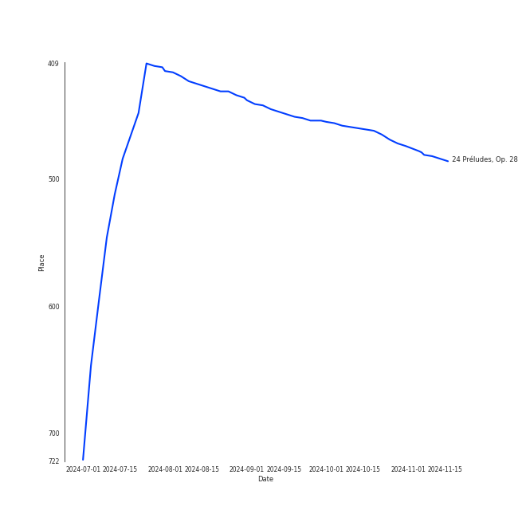
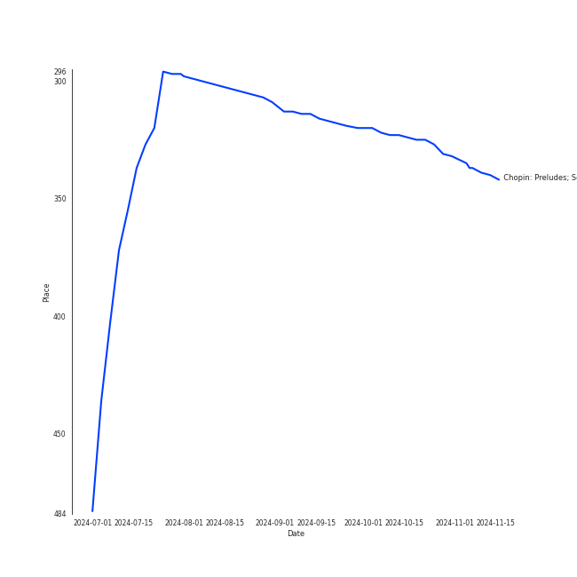

# Chopin

[172 tracks (0 liked) 🔗](https://open.spotify.com/playlist/630IicjdF4RLyaOqIXm0jm)

[See Track Features](audio_features.md)

[See Clusters](clusters/overview.md)

## Top Artists

| Art | Rank | Tracks | 💚 | Artist | 🔗 |
|:---|---:|---:|---:|:---|:---|
|  | 160 | 157 | 0 | [Frédéric Chopin](../../artists/frédéric_chopin/overview.md) | [🔗](https://open.spotify.com/artist/7y97mc3bZRFXzT2szRM4L4) |
|  | 149 | 102 | 0 | [Vladimir Ashkenazy](../../artists/vladimir_ashkenazy/overview.md) | [🔗](https://open.spotify.com/artist/20iZXzMb8LoWXOeca32i82) |
|  | 255 | 31 | 0 | Martha Argerich | [🔗](https://open.spotify.com/artist/66MvLAvLznk5UOvASVGjk4) |
|  | 429 | 19 | 0 | Maurizio Pollini | [🔗](https://open.spotify.com/artist/2VIdKQmRHnWofsR4odfFOh) |
|  | 429 | 15 | 0 | Peter Schmalfuss | [🔗](https://open.spotify.com/artist/7mOe6jfxX9EILXET9l5L6H) |
|  | 429 | 4 | 0 | Krystian Zimerman | [🔗](https://open.spotify.com/artist/43wuPaPcZVMJQWLRaPR4Yz) |
|  | 429 | 1 | 0 | Nikolai Lugansky | [🔗](https://open.spotify.com/artist/2bMfnyPOgNaeK8WNnXNXud) |

## Top Tracks

Most and least listened tracks

| Rank | ​ | Most listened tracks | Rank | ​​ | Least listened tracks |
|---:|:---|:---|---:|:---|:---|
| 449 |  | [24 Préludes, Op. 28: No. 4 in E Minor](../../artists/frédéric_chopin/overview.md) | 964 |  | [Nocturne No. 16 In E Flat, Op. 55 No. 2](../../artists/frédéric_chopin/overview.md) |
| 964 |  | Waltz No.10 Op.69-2 B Minor | 964 |  | [24 Préludes, Op. 28: No. 17 in A-Flat Major: Allegretto](../../artists/frédéric_chopin/overview.md) |
| 964 |  | [Waltz No. 8 in A-Flat Major, Op. 64 No. 3](../../artists/frédéric_chopin/overview.md) | 964 |  | [Feuille d'album in E, Op. posth.](../../artists/frédéric_chopin/overview.md) |
| 964 |  | [Nocturne No. 19 In E Minor, Op. 72 No. 1](../../artists/frédéric_chopin/overview.md) | 964 |  | [24 Préludes, Op. 28: No. 13 in F-Sharp Major](../../artists/frédéric_chopin/overview.md) |
| 964 |  | [Waltz No. 18 in E flat, Op. posth.](../../artists/frédéric_chopin/overview.md) | 964 |  | [Nocturne No. 19 in E minor, Op. 72, No 1](../../artists/frédéric_chopin/overview.md) |
| 964 |  | [Nocturne No. 9 in B Major, Op. 32 No. 1](../../artists/frédéric_chopin/overview.md) | 964 |  | [24 Préludes, Op. 28: No. 11 in B Major](../../artists/frédéric_chopin/overview.md) |
| 964 |  | [Nocturne No. 1 in B-Flat Minor, Op. 9 No. 1](../../artists/frédéric_chopin/overview.md) | 964 |  | [24 Préludes, Op. 28: No. 21 in B-Flat Major](../../artists/frédéric_chopin/overview.md) |
| 964 |  | [Galop Marquis](../../artists/frédéric_chopin/overview.md) | 964 |  | [24 Préludes, Op. 28: No. 10 in C-Sharp Minor: Molto allegro](../../artists/frédéric_chopin/overview.md) |
| 964 |  | [Tarantelle In A Flat, Op. 43](../../artists/frédéric_chopin/overview.md) | 964 |  | [Ballade No. 3 in A flat major, Op. 47](../../artists/frédéric_chopin/overview.md) |
| 964 |  | [Ballade No. 3 In A-Flat Major, Op. 47](../../artists/frédéric_chopin/overview.md) | 964 |  | [Nocturne No. 4 in F Major, Op. 15 No. 1](../../artists/frédéric_chopin/overview.md) |

## Top Albums

| Art | Rank | Tracks | 💚 | Album | Release Date | 🔗 |
|:---|---:|---:|---:|:---|:---|:---|
|  | 637 | 49 | 0 | Chopin: Waltzes; 4 Scherzos; 26 Preludes | 1999-01-01 | [🔗](https://open.spotify.com/album/0yCrQ6dCqiI6ldqI8LPqWB) |
|  | 315 | 30 | 0 | Chopin: Preludes; Sonata No.2 | 2002-01-01 | [🔗](https://open.spotify.com/album/33YXJqoFV5AQwbo4yfk22n) |
|  | 637 | 28 | 0 | Chopin: Polonaises | 1996-01-01 | [🔗](https://open.spotify.com/album/19ofW4fqCAR2uQJKVWw6L6) |
|  | 637 | 25 | 0 | Chopin: Nocturnes; Four Ballades | 1997-01-01 | [🔗](https://open.spotify.com/album/0lrM7kR5o7iqkajLKIlzRg) |
|  | 637 | 19 | 0 | Chopin: Nocturnes | 2005-01-01 | [🔗](https://open.spotify.com/album/2aoSpTAjFaMvaZeruqnCVv) |
|  | 637 | 15 | 0 | Frederic Chopin - Waltzes & Nocturnes | 1994-07-01 | [🔗](https://open.spotify.com/album/3USjXpMk5Pga22AZua7vNT) |
|  | 637 | 4 | 0 | Chopin: Ballades; Barcarolle; Fantaisie | 1988-01-01 | [🔗](https://open.spotify.com/album/5c9v5oU43Oo22MSG8EKFp2) |
|  | 637 | 1 | 0 | Martha Argerich Live, Vol. 4 | 2017-01-20 | [🔗](https://open.spotify.com/album/69aoRIAIVb2TbIuxmxKYCR) |
|  | 637 | 1 | 0 | Chopin: Piano Sonata No. 3, Fantasie-impromptu, Prélude, Nocturne, et al. | 2010-04-05 | [🔗](https://open.spotify.com/album/5QmPVpRux60kcHndJOl6bF) |

## Top Record Labels

| Tracks | 💚 | Label |
|---:|---:|:---|
| 102 | 0 | [Decca Music Group Ltd.](../../labels/decca_music_group_ltd_/overview.md) |
| 53 | 0 | [Deutsche Grammophon (DG)](../../labels/deutsche_grammophon_(dg)/overview.md) |
| 15 | 0 | [The Music Factory](../../labels/the_music_factory/overview.md) |
| 1 | 0 | Onyx Classics |
| 1 | 0 | DOREMI |

## Genres

| Tracks | 💚 | Genre |
|---:|---:|:---|
| 157 | 0 | polish classical |
| 157 | 0 | [early romantic era](../../genres/early_romantic_era/overview.md) |
| 157 | 0 | [classical](../../genres/classical/overview.md) |
| 15 | 0 | german classical piano |

## Years

View all years

| Year | Number of Tracks |
|:---|---:|
| 2017 | 1 |
| 2010 | 1 |
| 2005 | 19 |
| [2002](2002/overview.md) | 30 |
| [1999](1999/overview.md) | 49 |
| [1997](1997/overview.md) | 25 |
| [1996](1996/overview.md) | 28 |
| 1994 | 15 |
| 1988 | 4 |

| ​ | 10 newest albums | ​​ | 10 oldest albums |
|:---|:---|:---|:---|
|  | Martha Argerich Live, Vol. 4 (2017-01-20) |  | Chopin: Ballades; Barcarolle; Fantaisie (1988-01-01) |
|  | Chopin: Piano Sonata No. 3, Fantasie-impromptu, Prélude, Nocturne, et al. (2010-04-05) |  | Frederic Chopin - Waltzes & Nocturnes (1994-07-01) |
|  | Chopin: Nocturnes (2005-01-01) |  | Chopin: Polonaises (1996-01-01) |
|  | Chopin: Preludes; Sonata No.2 (2002-01-01) |  | Chopin: Nocturnes; Four Ballades (1997-01-01) |
|  | Chopin: Waltzes; 4 Scherzos; 26 Preludes (1999-01-01) |  | Chopin: Waltzes; 4 Scherzos; 26 Preludes (1999-01-01) |
|  | Chopin: Nocturnes; Four Ballades (1997-01-01) |  | Chopin: Preludes; Sonata No.2 (2002-01-01) |
|  | Chopin: Polonaises (1996-01-01) |  | Chopin: Nocturnes (2005-01-01) |
|  | Frederic Chopin - Waltzes & Nocturnes (1994-07-01) |  | Chopin: Piano Sonata No. 3, Fantasie-impromptu, Prélude, Nocturne, et al. (2010-04-05) |
|  | Chopin: Ballades; Barcarolle; Fantaisie (1988-01-01) |  | Martha Argerich Live, Vol. 4 (2017-01-20) |