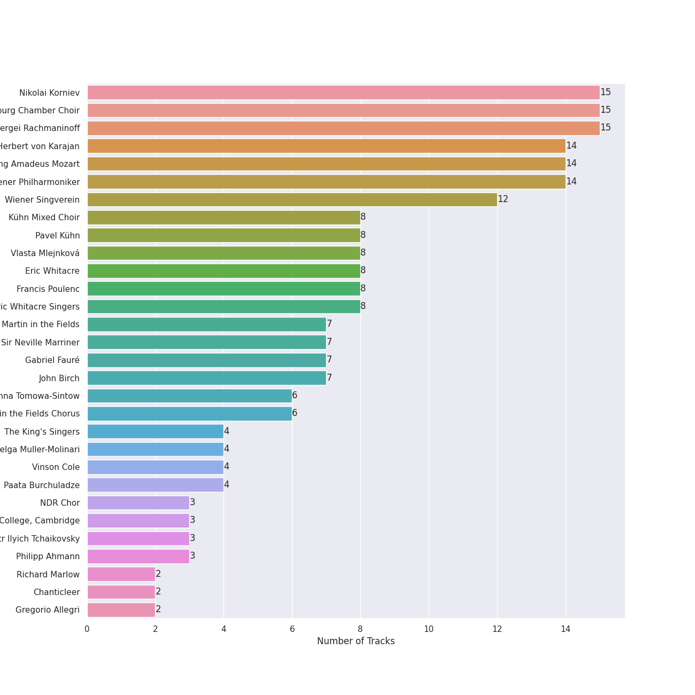

# Choral

## Top Artists

See all artists

|   Number of Tracks | Artist                                                                                   | 🔗                                                           |
|-------------------:|:-----------------------------------------------------------------------------------------|:------------------------------------------------------------|
|                 15 | [Nikolai Korniev](../artists/nikolai_korniev.md)                                         | [🔗](https://open.spotify.com/artist/70hS9SnJefkZo2QJwS2VXi) |
|                 15 | [St.Petersburg Chamber Choir](../artists/st_petersburg_chamber_choir.md)                 | [🔗](https://open.spotify.com/artist/46WjEugfIF0rKOewvFiby2) |
|                 15 | [Sergei Rachmaninoff](../artists/sergei_rachmaninoff.md)                                 | [🔗](https://open.spotify.com/artist/0Kekt6CKSo0m5mivKcoH51) |
|                 14 | [Herbert von Karajan](../artists/herbert_von_karajan.md)                                 | [🔗](https://open.spotify.com/artist/5zCaQxjl110XTrm4LQ1CxY) |
|                 14 | [Wolfgang Amadeus Mozart](../artists/wolfgang_amadeus_mozart.md)                         | [🔗](https://open.spotify.com/artist/4NJhFmfw43RLBLjQvxDuRS) |
|                 14 | [Wiener Philharmoniker](../artists/wiener_philharmoniker.md)                             | [🔗](https://open.spotify.com/artist/003f4bk13c6Q3gAUXv7dGJ) |
|                 12 | [Wiener Singverein](../artists/wiener_singverein.md)                                     | [🔗](https://open.spotify.com/artist/35QSympF887CO8h5eZHme2) |
|                  8 | Kühn Mixed Choir                                                                         | [🔗](https://open.spotify.com/artist/7coad48I6XW2msLS0ms53T) |
|                  8 | Pavel Kühn                                                                               | [🔗](https://open.spotify.com/artist/7bzLxD5IZSXMmuuqnZ7MfY) |
|                  8 | Vlasta Mlejnková                                                                         | [🔗](https://open.spotify.com/artist/775Rkua0PHENjo1sFIyApV) |
|                  8 | Eric Whitacre                                                                            | [🔗](https://open.spotify.com/artist/5TWpCLIhvGlbJmLK1zNpiL) |
|                  8 | Francis Poulenc                                                                          | [🔗](https://open.spotify.com/artist/4IAWVxo2fpTBPn6k7GZ3eY) |
|                  8 | Eric Whitacre Singers                                                                    | [🔗](https://open.spotify.com/artist/2tPhboxrWrQ4LxOhWlXAeN) |
|                  7 | [Academy of St. Martin in the Fields](../artists/academy_of_st__martin_in_the_fields.md) | [🔗](https://open.spotify.com/artist/77CaCn32H4mOMQA7UElzfF) |
|                  7 | [Sir Neville Marriner](../artists/sir_neville_marriner.md)                               | [🔗](https://open.spotify.com/artist/6NUhQz7eAEsZvjEHTKHux9) |
|                  7 | Gabriel Fauré                                                                            | [🔗](https://open.spotify.com/artist/2gClsBep1tt1rv1CN210SO) |
|                  7 | John Birch                                                                               | [🔗](https://open.spotify.com/artist/2TFBoJYsuvMuPMOlwXWbaE) |
|                  6 | [Anna Tomowa-Sintow](../artists/anna_tomowa_sintow.md)                                   | [🔗](https://open.spotify.com/artist/6NSIW1uEq8JZmxEkHMF17c) |
|                  6 | Academy of St Martin in the Fields Chorus                                                | [🔗](https://open.spotify.com/artist/1GxYERY1PDh1dEuFqvTDa5) |
|                  4 | [The King's Singers](../artists/the_king_s_singers.md)                                   | [🔗](https://open.spotify.com/artist/5lR7yDVN4z9kahOiUSlMhe) |
|                  4 | Helga Muller-Molinari                                                                    | [🔗](https://open.spotify.com/artist/3s5xNX5n6PAzpusMRhmHbA) |
|                  4 | Vinson Cole                                                                              | [🔗](https://open.spotify.com/artist/2j6cP3f3TxyHzcKdWYSm6h) |
|                  4 | Paata Burchuladze                                                                        | [🔗](https://open.spotify.com/artist/1JzOJmq9kk0u7OWqzXkBcc) |
|                  3 | NDR Chor                                                                                 | [🔗](https://open.spotify.com/artist/7hMAA1N5j1Ynb49NIWO7HV) |
|                  3 | The Choir Of Trinity College, Cambridge                                                  | [🔗](https://open.spotify.com/artist/3x8rZy1i6FwWOWKwfRT1Ab) |
|                  3 | [Pyotr Ilyich Tchaikovsky](../artists/pyotr_ilyich_tchaikovsky.md)                       | [🔗](https://open.spotify.com/artist/3MKCzCnpzw3TjUYs2v7vDA) |
|                  3 | Philipp Ahmann                                                                           | [🔗](https://open.spotify.com/artist/309coOGhdzqXdIRwJH1xUo) |
|                  2 | Richard Marlow                                                                           | [🔗](https://open.spotify.com/artist/7rrfp80BJeAa0lpBnNgRNK) |
|                  2 | Chanticleer                                                                              | [🔗](https://open.spotify.com/artist/4p6DfIA6NnKmWeRgDJPLT0) |
|                  2 | Gregorio Allegri                                                                         | [🔗](https://open.spotify.com/artist/4I47QTluHCo2t2Gj6V7AIG) |
|                  2 | Henry Purcell                                                                            | [🔗](https://open.spotify.com/artist/3tMLo1k3iUo82coMLWXzxq) |
|                  2 | Thomas Allen                                                                             | [🔗](https://open.spotify.com/artist/2SFBZgfO2H1nVSgjxzJLUy) |
|                  1 | Capriccio Stravagante                                                                    | [🔗](https://open.spotify.com/artist/7Hb8ewIvJmuQPAQ5MMVXJE) |
|                  1 | Maurice Duruflé                                                                          | [🔗](https://open.spotify.com/artist/7Fph7U6qidZ2E97xKKsD4m) |
|                  1 | Sylvia McNair                                                                            | [🔗](https://open.spotify.com/artist/63aSj4hbN7Q4nw74Y0xNF6) |
|                  1 | Randall Thompson                                                                         | [🔗](https://open.spotify.com/artist/5vNLpqTjRXfz6uHKs5hnvD) |
|                  1 | Joseph Jennings                                                                          | [🔗](https://open.spotify.com/artist/5A3ntUGTCKttzOwkoF9AUY) |
|                  1 | Vladimir Mostovoy                                                                        | [🔗](https://open.spotify.com/artist/4BTanscTBWJOSpvceZSVSi) |
|                  1 | Voices of Ascension Chorus                                                               | [🔗](https://open.spotify.com/artist/4AjjMZxILxc83KJAEuwu9j) |
|                  1 | Olga Borodina                                                                            | [🔗](https://open.spotify.com/artist/47XbXbNzwqcWStfsjzFlKb) |
|                  1 | Skip Sempé                                                                               | [🔗](https://open.spotify.com/artist/3DSclbx4DSkyIvouHCxHHZ) |
|                  1 | Philippe Herreweghe                                                                      | [🔗](https://open.spotify.com/artist/2ozcTa5tl8qhSbhJKM60I5) |
|                  1 | Anton Bruckner                                                                           | [🔗](https://open.spotify.com/artist/2bM3j1JQWBkmzuoZKu4zj2) |
|                  1 | Mark Kruczek                                                                             | [🔗](https://open.spotify.com/artist/2DNiyyc8Do3ym3IjCaKFCp) |
|                  1 | Ola Gjeilo                                                                               | [🔗](https://open.spotify.com/artist/29lbSb4ujaVH5pHnQjFT0G) |
|                  1 | Zürcher Vokalisten                                                                       | [🔗](https://open.spotify.com/artist/1YrY49Nj5lSs8otmnveoQQ) |
|                  1 | Collegium Vocale Gent                                                                    | [🔗](https://open.spotify.com/artist/17BdLN9q8RRQQqyklLwac1) |
|                  1 | Dennis Keene                                                                             | [🔗](https://open.spotify.com/artist/16e7cTpnxHfo8KnwinUysN) |
|                  1 | Tenebrae                                                                                 | [🔗](https://open.spotify.com/artist/0vUnn6Eje2O5yxEj35touD) |
|                  1 | Christian Dillig                                                                         | [🔗](https://open.spotify.com/artist/0Ens2zPly8UFhQmyUUXlOH) |

## Tracks

| Track                                                                    | Album                                                                                                                | Artists                                                                                                                                                                                                                                                                                                                                                       | 💚   | 🔗                                                          |
|:-------------------------------------------------------------------------|:---------------------------------------------------------------------------------------------------------------------|:--------------------------------------------------------------------------------------------------------------------------------------------------------------------------------------------------------------------------------------------------------------------------------------------------------------------------------------------------------------|:----|:-----------------------------------------------------------|
| Ave María, WAB 6                                                         | Bruckner: Mass in E Minor & Motets                                                                                   | Anton Bruckner, Collegium Vocale Gent, Philippe Herreweghe                                                                                                                                                                                                                                                                                                    |     | [🔗](https://open.spotify.com/track/4ptkI6Vs9LHfS92bhi9u15) |
| Ave Maria (Franz Biebl)                                                  | Our Heart's Joy: A Chanticleer Christmas                                                                             | Chanticleer                                                                                                                                                                                                                                                                                                                                                   |     | [🔗](https://open.spotify.com/track/0fdL0xzOhy5FniixwlMaDh) |
| Leonardo Dreams Of His Flying Machine                                    | Light & Gold                                                                                                         | Eric Whitacre, Eric Whitacre Singers                                                                                                                                                                                                                                                                                                                          |     | [🔗](https://open.spotify.com/track/2GuDgGY2TmwVo3uMlp1iW3) |
| Lux Aurumque                                                             | Light & Gold                                                                                                         | Eric Whitacre, Eric Whitacre Singers                                                                                                                                                                                                                                                                                                                          |     | [🔗](https://open.spotify.com/track/5bUdtdODnRPeQpmMoqhvVY) |
| Sleep                                                                    | Light & Gold                                                                                                         | Eric Whitacre, Eric Whitacre Singers                                                                                                                                                                                                                                                                                                                          |     | [🔗](https://open.spotify.com/track/78BLTUqTCCHuptFEGejEoS) |
| The Seal Lullaby                                                         | Light & Gold                                                                                                         | Eric Whitacre, Eric Whitacre Singers                                                                                                                                                                                                                                                                                                                          |     | [🔗](https://open.spotify.com/track/1ZqzUiCQICQmjtpbFZYwnt) |
| Three Songs Of Faith: Hope Faith Life Love                               | Light & Gold                                                                                                         | Eric Whitacre, Eric Whitacre Singers                                                                                                                                                                                                                                                                                                                          |     | [🔗](https://open.spotify.com/track/2U9ygpUiA0gk9KSPoqQlJG) |
| Three Songs Of Faith: I Thank You God For Most This Amazing Day          | Light & Gold                                                                                                         | Eric Whitacre, Eric Whitacre Singers                                                                                                                                                                                                                                                                                                                          |     | [🔗](https://open.spotify.com/track/6ryPjtGVmAk6v2rKNBKBc6) |
| Three Songs Of Faith: I Will Wade Out                                    | Light & Gold                                                                                                         | Eric Whitacre, Eric Whitacre Singers                                                                                                                                                                                                                                                                                                                          |     | [🔗](https://open.spotify.com/track/3bMGaK0AfpU3J321Mlm553) |
| Water Night                                                              | Light & Gold                                                                                                         | Eric Whitacre, Eric Whitacre Singers                                                                                                                                                                                                                                                                                                                          |     | [🔗](https://open.spotify.com/track/5w0L0SdyLv7BK8hXctiHhm) |
| 4 Motets pour le temps de Noël, FP 152: No. 1, Magnum mysterium          | Poulenc: Motets and Mass                                                                                             | Francis Poulenc, Vlasta Mlejnková, Kühn Mixed Choir, Pavel Kühn                                                                                                                                                                                                                                                                                               |     | [🔗](https://open.spotify.com/track/1lb2BKEeXA8cx2jLxfqJel) |
| 4 Motets pour le temps de Noël, FP 152: No. 2, Quem vidistis pastores    | Poulenc: Motets and Mass                                                                                             | Francis Poulenc, Vlasta Mlejnková, Kühn Mixed Choir, Pavel Kühn                                                                                                                                                                                                                                                                                               |     | [🔗](https://open.spotify.com/track/4zQimzq6FcSoAAWj0cfvAX) |
| 4 Motets pour le temps de Noël, FP 152: No. 3, Videntes stellam          | Poulenc: Motets and Mass                                                                                             | Francis Poulenc, Vlasta Mlejnková, Kühn Mixed Choir, Pavel Kühn                                                                                                                                                                                                                                                                                               |     | [🔗](https://open.spotify.com/track/3XXHrDeM03ViHGcesNVwfL) |
| 4 Motets pour le temps de Noël, FP 152: No. 4, Hodie Christus natus est  | Poulenc: Motets and Mass                                                                                             | Francis Poulenc, Vlasta Mlejnková, Kühn Mixed Choir, Pavel Kühn                                                                                                                                                                                                                                                                                               |     | [🔗](https://open.spotify.com/track/0PDnRCf3AnUUjAYSXVok55) |
| 4 Motets pour un temps de pénitence, FP 97: No. 1, Timor et tremor       | Poulenc: Motets and Mass                                                                                             | Francis Poulenc, Vlasta Mlejnková, Kühn Mixed Choir, Pavel Kühn                                                                                                                                                                                                                                                                                               |     | [🔗](https://open.spotify.com/track/67NRQzKiJzlayRlmZ4zbKc) |
| 4 Motets pour un temps de pénitence, FP 97: No. 2, Vinea mea electa      | Poulenc: Motets and Mass                                                                                             | Francis Poulenc, Vlasta Mlejnková, Kühn Mixed Choir, Pavel Kühn                                                                                                                                                                                                                                                                                               |     | [🔗](https://open.spotify.com/track/63jRApT2GmzdVMePv7KFXi) |
| 4 Motets pour un temps de pénitence, FP 97: No. 3, Tenebrae factae sunt  | Poulenc: Motets and Mass                                                                                             | Francis Poulenc, Vlasta Mlejnková, Kühn Mixed Choir, Pavel Kühn                                                                                                                                                                                                                                                                                               |     | [🔗](https://open.spotify.com/track/1pEgzXriotJRGrgrmE2eHR) |
| 4 Motets pour un temps de pénitence, FP 97: No. 4, Tristis est anima mea | Poulenc: Motets and Mass                                                                                             | Francis Poulenc, Vlasta Mlejnková, Kühn Mixed Choir, Pavel Kühn                                                                                                                                                                                                                                                                                               |     | [🔗](https://open.spotify.com/track/0of2TShrStNkbPvZQLeiNh) |
| Requiem in D Minor, Op.48: 1. Introitus: Requiem aeternam - Kyrie        | Fauré: Requiem; Pavane                                                                                               | Gabriel Fauré, Academy of St Martin in the Fields Chorus, [Academy of St. Martin in the Fields](../artists/academy_of_st__martin_in_the_fields.md), John Birch, [Sir Neville Marriner](../artists/sir_neville_marriner.md)                                                                                                                                    |     | [🔗](https://open.spotify.com/track/6BAU2mNOutm6sKu3daQGgt) |
| Requiem in D Minor, Op.48: 3. Sanctus                                    | Fauré: Requiem; Pavane                                                                                               | Gabriel Fauré, Academy of St Martin in the Fields Chorus, [Academy of St. Martin in the Fields](../artists/academy_of_st__martin_in_the_fields.md), John Birch, [Sir Neville Marriner](../artists/sir_neville_marriner.md)                                                                                                                                    |     | [🔗](https://open.spotify.com/track/51UiadBalTxQn1Ry6CZNNX) |
| Requiem in D Minor, Op.48: 5. Agnus Dei                                  | Fauré: Requiem; Pavane                                                                                               | Gabriel Fauré, Academy of St Martin in the Fields Chorus, [Academy of St. Martin in the Fields](../artists/academy_of_st__martin_in_the_fields.md), John Birch, [Sir Neville Marriner](../artists/sir_neville_marriner.md)                                                                                                                                    |     | [🔗](https://open.spotify.com/track/0UHDXE1d9Up2mEbzLLsMjw) |
| Requiem in D Minor, Op.48: 7. In paradisum                               | Fauré: Requiem; Pavane                                                                                               | Gabriel Fauré, Academy of St Martin in the Fields Chorus, [Academy of St. Martin in the Fields](../artists/academy_of_st__martin_in_the_fields.md), John Birch, [Sir Neville Marriner](../artists/sir_neville_marriner.md)                                                                                                                                    |     | [🔗](https://open.spotify.com/track/49ppjfV2dKVhXFXI4GgIYU) |
| Requiem in D Minor, Op.48: 2. Offertorium: Domine Jesu Christe           | Fauré: Requiem; Pavane                                                                                               | Gabriel Fauré, Academy of St Martin in the Fields Chorus, [Academy of St. Martin in the Fields](../artists/academy_of_st__martin_in_the_fields.md), John Birch, [Sir Neville Marriner](../artists/sir_neville_marriner.md), Thomas Allen                                                                                                                      |     | [🔗](https://open.spotify.com/track/506v6JxDnZsRre4m4YFR9q) |
| Requiem in D Minor, Op.48: 6. Libera me                                  | Fauré: Requiem; Pavane                                                                                               | Gabriel Fauré, Academy of St Martin in the Fields Chorus, [Academy of St. Martin in the Fields](../artists/academy_of_st__martin_in_the_fields.md), John Birch, [Sir Neville Marriner](../artists/sir_neville_marriner.md), Thomas Allen                                                                                                                      |     | [🔗](https://open.spotify.com/track/6nJrXbauUQtCV5TqIFrg0i) |
| Requiem in D Minor, Op. 48: 4. Pie Jesu                                  | Fauré: Requiem; Pavane                                                                                               | Gabriel Fauré, [Academy of St. Martin in the Fields](../artists/academy_of_st__martin_in_the_fields.md), John Birch, [Sir Neville Marriner](../artists/sir_neville_marriner.md), Sylvia McNair                                                                                                                                                                |     | [🔗](https://open.spotify.com/track/5tmTSjrwoiOacvGAZ8ZEGf) |
| Miserere                                                                 | Allegri Miserere                                                                                                     | Gregorio Allegri, Tenebrae                                                                                                                                                                                                                                                                                                                                    |     | [🔗](https://open.spotify.com/track/2ED1VZ53iRImo252U2PEsu) |
| Purcell: Hear My Prayer, O Lord, Z. 15                                   | Purcell : Anthems & Sacred Songs [Evening Prayer]                                                                    | Henry Purcell, Chanticleer, Capriccio Stravagante, Joseph Jennings, Skip Sempé                                                                                                                                                                                                                                                                                |     | [🔗](https://open.spotify.com/track/3t6qULlA3X4YSzT6AKlwwe) |
| Quatre Motets: Ubi Caritas                                               | Fauré/Duruflé/Messiaen                                                                                               | Maurice Duruflé, The Choir Of Trinity College, Cambridge, Richard Marlow                                                                                                                                                                                                                                                                                      |     | [🔗](https://open.spotify.com/track/28xmjHuIJYhZxa5NDyjnI4) |
| Unicornis Captivatur                                                     | Rachmaninoff & Poulenc: Blue Bird                                                                                    | Ola Gjeilo, Christian Dillig, Zürcher Vokalisten                                                                                                                                                                                                                                                                                                              |     | [🔗](https://open.spotify.com/track/4lHJA8ArJ1Xspqs1RYwPXS) |
| 9 Sacred Pieces, TH 78: No. 1, Cherubic Hymn No. 1                       | Tchaikovsky: Sacred Choral Music                                                                                     | [Pyotr Ilyich Tchaikovsky](../artists/pyotr_ilyich_tchaikovsky.md), NDR Chor, Philipp Ahmann                                                                                                                                                                                                                                                                  |     | [🔗](https://open.spotify.com/track/7E4KpvGnw4eD55VgmdMdco) |
| 9 Sacred Pieces, TH 78: No. 2, Cherubic Hymn No. 2                       | Tchaikovsky: Sacred Choral Music                                                                                     | [Pyotr Ilyich Tchaikovsky](../artists/pyotr_ilyich_tchaikovsky.md), NDR Chor, Philipp Ahmann                                                                                                                                                                                                                                                                  |     | [🔗](https://open.spotify.com/track/1uDDH4TncZQxOCYl9TjHKh) |
| 9 Sacred Pieces, TH 78: No. 3, Cherubic Hymn No. 3                       | Tchaikovsky: Sacred Choral Music                                                                                     | [Pyotr Ilyich Tchaikovsky](../artists/pyotr_ilyich_tchaikovsky.md), NDR Chor, Philipp Ahmann                                                                                                                                                                                                                                                                  |     | [🔗](https://open.spotify.com/track/5cuTdpoXIWieDK848fuNDW) |
| Alleluia                                                                 | Choral Music - Bainton, E. / Thompson, R. / Mozart, W.A. / Casals, P. / Mendelssohn, Felix / Parry, H. / Durufle, M. | Randall Thompson, Mark Kruczek, Voices of Ascension Chorus, Dennis Keene                                                                                                                                                                                                                                                                                      |     | [🔗](https://open.spotify.com/track/4VaNvxer9UJ8memKAOkzdW) |
| Vespers, Op. 37: I. "Priidite, poklonimsya"                              | Rachmaninov: Vespers - All Night Vigil                                                                               | [Sergei Rachmaninoff](../artists/sergei_rachmaninoff.md), [St.Petersburg Chamber Choir](../artists/st_petersburg_chamber_choir.md), [Nikolai Korniev](../artists/nikolai_korniev.md)                                                                                                                                                                          |     | [🔗](https://open.spotify.com/track/4evlPDUET2zxmrSffIopYk) |
| Vespers, Op. 37: III. "Blazhen muzh"                                     | Rachmaninov: Vespers - All Night Vigil                                                                               | [Sergei Rachmaninoff](../artists/sergei_rachmaninoff.md), [St.Petersburg Chamber Choir](../artists/st_petersburg_chamber_choir.md), [Nikolai Korniev](../artists/nikolai_korniev.md)                                                                                                                                                                          |     | [🔗](https://open.spotify.com/track/4vOfTVbAp9oBxyko8covCb) |
| Vespers, Op. 37: IV. "Svete tikhyi"                                      | Rachmaninov: Vespers - All Night Vigil                                                                               | [Sergei Rachmaninoff](../artists/sergei_rachmaninoff.md), [St.Petersburg Chamber Choir](../artists/st_petersburg_chamber_choir.md), [Nikolai Korniev](../artists/nikolai_korniev.md)                                                                                                                                                                          |     | [🔗](https://open.spotify.com/track/63vzmx5X4rx7iiampzwus4) |
| Vespers, Op. 37: IX. "Blagosloven esi, Gospodi"                          | Rachmaninov: Vespers - All Night Vigil                                                                               | [Sergei Rachmaninoff](../artists/sergei_rachmaninoff.md), [St.Petersburg Chamber Choir](../artists/st_petersburg_chamber_choir.md), [Nikolai Korniev](../artists/nikolai_korniev.md)                                                                                                                                                                          |     | [🔗](https://open.spotify.com/track/0NfQexdy6BRC3O7W2LPqHl) |
| Vespers, Op. 37: VI. "Bogoroditse Devo"                                  | Rachmaninov: Vespers - All Night Vigil                                                                               | [Sergei Rachmaninoff](../artists/sergei_rachmaninoff.md), [St.Petersburg Chamber Choir](../artists/st_petersburg_chamber_choir.md), [Nikolai Korniev](../artists/nikolai_korniev.md)                                                                                                                                                                          |     | [🔗](https://open.spotify.com/track/3eu4eSHpO2u9bgzmDDTlgY) |
| Vespers, Op. 37: VII. "Slava v vyshnikh Bogu"                            | Rachmaninov: Vespers - All Night Vigil                                                                               | [Sergei Rachmaninoff](../artists/sergei_rachmaninoff.md), [St.Petersburg Chamber Choir](../artists/st_petersburg_chamber_choir.md), [Nikolai Korniev](../artists/nikolai_korniev.md)                                                                                                                                                                          |     | [🔗](https://open.spotify.com/track/0op8XEiSF79zl5SSvPv5j2) |
| Vespers, Op. 37: VIII. "Kvalite imya Gospodne"                           | Rachmaninov: Vespers - All Night Vigil                                                                               | [Sergei Rachmaninoff](../artists/sergei_rachmaninoff.md), [St.Petersburg Chamber Choir](../artists/st_petersburg_chamber_choir.md), [Nikolai Korniev](../artists/nikolai_korniev.md)                                                                                                                                                                          |     | [🔗](https://open.spotify.com/track/79tPoVRNUdOSwM8ERRpx8m) |
| Vespers, Op. 37: X. "Voskreseniye Khristovo videvshe"                    | Rachmaninov: Vespers - All Night Vigil                                                                               | [Sergei Rachmaninoff](../artists/sergei_rachmaninoff.md), [St.Petersburg Chamber Choir](../artists/st_petersburg_chamber_choir.md), [Nikolai Korniev](../artists/nikolai_korniev.md)                                                                                                                                                                          |     | [🔗](https://open.spotify.com/track/2rzp6tSZjlPxIjkcnKoV7a) |
| Vespers, Op. 37: XI. "Velichit dusha moya Gospoda"                       | Rachmaninov: Vespers - All Night Vigil                                                                               | [Sergei Rachmaninoff](../artists/sergei_rachmaninoff.md), [St.Petersburg Chamber Choir](../artists/st_petersburg_chamber_choir.md), [Nikolai Korniev](../artists/nikolai_korniev.md)                                                                                                                                                                          |     | [🔗](https://open.spotify.com/track/32j8MnD2wyx1QQ3wRa6ytm) |
| Vespers, Op. 37: XII. "Slava v vyshnikh Bogu"                            | Rachmaninov: Vespers - All Night Vigil                                                                               | [Sergei Rachmaninoff](../artists/sergei_rachmaninoff.md), [St.Petersburg Chamber Choir](../artists/st_petersburg_chamber_choir.md), [Nikolai Korniev](../artists/nikolai_korniev.md)                                                                                                                                                                          |     | [🔗](https://open.spotify.com/track/1RCpDM7OThH6WdncbhQ7IE) |
| Vespers, Op. 37: XIII. "Dnes spaseniye"                                  | Rachmaninov: Vespers - All Night Vigil                                                                               | [Sergei Rachmaninoff](../artists/sergei_rachmaninoff.md), [St.Petersburg Chamber Choir](../artists/st_petersburg_chamber_choir.md), [Nikolai Korniev](../artists/nikolai_korniev.md)                                                                                                                                                                          |     | [🔗](https://open.spotify.com/track/07rzxAXZHLhV0kGR0zNDIn) |
| Vespers, Op. 37: XIV. "Voskrez iz groba"                                 | Rachmaninov: Vespers - All Night Vigil                                                                               | [Sergei Rachmaninoff](../artists/sergei_rachmaninoff.md), [St.Petersburg Chamber Choir](../artists/st_petersburg_chamber_choir.md), [Nikolai Korniev](../artists/nikolai_korniev.md)                                                                                                                                                                          |     | [🔗](https://open.spotify.com/track/1kTERqTjsxeq3RNjtunq1u) |
| Vespers, Op. 37: XV. "Vzbrannoy voevode"                                 | Rachmaninov: Vespers - All Night Vigil                                                                               | [Sergei Rachmaninoff](../artists/sergei_rachmaninoff.md), [St.Petersburg Chamber Choir](../artists/st_petersburg_chamber_choir.md), [Nikolai Korniev](../artists/nikolai_korniev.md)                                                                                                                                                                          |     | [🔗](https://open.spotify.com/track/5PSyFWOmtBCPwkAiAV770t) |
| Vespers, Op. 37: II. "Blagoslovi dushe moya"                             | Rachmaninov: Vespers - All Night Vigil                                                                               | [Sergei Rachmaninoff](../artists/sergei_rachmaninoff.md), [St.Petersburg Chamber Choir](../artists/st_petersburg_chamber_choir.md), [Nikolai Korniev](../artists/nikolai_korniev.md), Olga Borodina                                                                                                                                                           |     | [🔗](https://open.spotify.com/track/3tmb8PpSEsDXOPv2JxBAeJ) |
| Vespers, Op. 37: V. "Nyne otpushchayeshi"                                | Rachmaninov: Vespers - All Night Vigil                                                                               | [Sergei Rachmaninoff](../artists/sergei_rachmaninoff.md), [St.Petersburg Chamber Choir](../artists/st_petersburg_chamber_choir.md), [Nikolai Korniev](../artists/nikolai_korniev.md), Vladimir Mostovoy                                                                                                                                                       |     | [🔗](https://open.spotify.com/track/6pFMpE4Z9UooPdsTmgbWYI) |
| Hear my prayer, O Lord                                                   | Allegri - Miserere                                                                                                   | The Choir Of Trinity College, Cambridge, Henry Purcell                                                                                                                                                                                                                                                                                                        |     | [🔗](https://open.spotify.com/track/24zUe2qJnLh71w85fJmPRC) |
| Miserere mei, Deus                                                       | Allegri - Miserere                                                                                                   | The Choir Of Trinity College, Cambridge, Richard Marlow, Gregorio Allegri                                                                                                                                                                                                                                                                                     |     | [🔗](https://open.spotify.com/track/6es7DmrhnDoKj5rsFvh3XU) |
| Danny Boy                                                                | Folk Songs Of The British Isles                                                                                      | [The King's Singers](../artists/the_king_s_singers.md)                                                                                                                                                                                                                                                                                                        |     | [🔗](https://open.spotify.com/track/0pSU2FXTmbfKh2wEVSOeg6) |
| Greensleeves                                                             | Folk Songs Of The British Isles                                                                                      | [The King's Singers](../artists/the_king_s_singers.md)                                                                                                                                                                                                                                                                                                        |     | [🔗](https://open.spotify.com/track/2rQPqQITnqplm3JmNkYe45) |
| Loch Lomond                                                              | Folk Songs Of The British Isles                                                                                      | [The King's Singers](../artists/the_king_s_singers.md)                                                                                                                                                                                                                                                                                                        |     | [🔗](https://open.spotify.com/track/0OHTE11AbX3oeT623REE0L) |
| Scarborough Fair                                                         | Folk Songs Of The British Isles                                                                                      | [The King's Singers](../artists/the_king_s_singers.md)                                                                                                                                                                                                                                                                                                        |     | [🔗](https://open.spotify.com/track/0kXXBfNHkfCrReBXi3AqMB) |
| Requiem In D Minor, K.626: 3. Sequentia: Recordare                       | Karajan - Mozart                                                                                                     | [Wolfgang Amadeus Mozart](../artists/wolfgang_amadeus_mozart.md), [Wiener Philharmoniker](../artists/wiener_philharmoniker.md), [Herbert von Karajan](../artists/herbert_von_karajan.md), Vinson Cole, [Anna Tomowa-Sintow](../artists/anna_tomowa_sintow.md), Helga Muller-Molinari, Paata Burchuladze                                                       |     | [🔗](https://open.spotify.com/track/08FShoZ7Nc5LsBv3W9oQK0) |
| Requiem In D Minor, K.626: 3. Sequentia: Tuba mirum                      | Karajan - Mozart                                                                                                     | [Wolfgang Amadeus Mozart](../artists/wolfgang_amadeus_mozart.md), [Wiener Philharmoniker](../artists/wiener_philharmoniker.md), [Herbert von Karajan](../artists/herbert_von_karajan.md), Vinson Cole, [Anna Tomowa-Sintow](../artists/anna_tomowa_sintow.md), Helga Muller-Molinari, Paata Burchuladze                                                       |     | [🔗](https://open.spotify.com/track/5xItkHeimSWCAWwh6WvV86) |
| Requiem In D Minor, K.626: 2. Kyrie                                      | Karajan - Mozart                                                                                                     | [Wolfgang Amadeus Mozart](../artists/wolfgang_amadeus_mozart.md), [Wiener Philharmoniker](../artists/wiener_philharmoniker.md), [Wiener Singverein](../artists/wiener_singverein.md), [Herbert von Karajan](../artists/herbert_von_karajan.md)                                                                                                                |     | [🔗](https://open.spotify.com/track/5OO1HZSyoPeaZvmvlIOvIp) |
| Requiem In D Minor, K.626: 3. Sequentia: Confutatis                      | Karajan - Mozart                                                                                                     | [Wolfgang Amadeus Mozart](../artists/wolfgang_amadeus_mozart.md), [Wiener Philharmoniker](../artists/wiener_philharmoniker.md), [Wiener Singverein](../artists/wiener_singverein.md), [Herbert von Karajan](../artists/herbert_von_karajan.md)                                                                                                                |     | [🔗](https://open.spotify.com/track/2V581m7x1uCd8sVIHmJOHu) |
| Requiem In D Minor, K.626: 3. Sequentia: Lacrimosa                       | Karajan - Mozart                                                                                                     | [Wolfgang Amadeus Mozart](../artists/wolfgang_amadeus_mozart.md), [Wiener Philharmoniker](../artists/wiener_philharmoniker.md), [Wiener Singverein](../artists/wiener_singverein.md), [Herbert von Karajan](../artists/herbert_von_karajan.md)                                                                                                                |     | [🔗](https://open.spotify.com/track/4fZ5XttwgrWUnmD8cPqfaP) |
| Requiem In D Minor, K.626: 3. Sequentia: Rex tremendae                   | Karajan - Mozart                                                                                                     | [Wolfgang Amadeus Mozart](../artists/wolfgang_amadeus_mozart.md), [Wiener Philharmoniker](../artists/wiener_philharmoniker.md), [Wiener Singverein](../artists/wiener_singverein.md), [Herbert von Karajan](../artists/herbert_von_karajan.md)                                                                                                                |     | [🔗](https://open.spotify.com/track/1GgJCt9psWwrZcdGm9Z69d) |
| Requiem In D Minor, K.626: 4. Offertorium: Hostias                       | Karajan - Mozart                                                                                                     | [Wolfgang Amadeus Mozart](../artists/wolfgang_amadeus_mozart.md), [Wiener Philharmoniker](../artists/wiener_philharmoniker.md), [Wiener Singverein](../artists/wiener_singverein.md), [Herbert von Karajan](../artists/herbert_von_karajan.md)                                                                                                                |     | [🔗](https://open.spotify.com/track/0x7uY2kKO4RVhajULRVNFo) |
| Requiem In D Minor, K.626: 5. Sanctus                                    | Karajan - Mozart                                                                                                     | [Wolfgang Amadeus Mozart](../artists/wolfgang_amadeus_mozart.md), [Wiener Philharmoniker](../artists/wiener_philharmoniker.md), [Wiener Singverein](../artists/wiener_singverein.md), [Herbert von Karajan](../artists/herbert_von_karajan.md)                                                                                                                |     | [🔗](https://open.spotify.com/track/7rkakVQEVWVASpkamj7m8o) |
| Requiem In D Minor, K.626: 8.Communio: Lux aeterna                       | Karajan - Mozart                                                                                                     | [Wolfgang Amadeus Mozart](../artists/wolfgang_amadeus_mozart.md), [Wiener Philharmoniker](../artists/wiener_philharmoniker.md), [Wiener Singverein](../artists/wiener_singverein.md), [Herbert von Karajan](../artists/herbert_von_karajan.md)                                                                                                                |     | [🔗](https://open.spotify.com/track/6EkyeAw8TnpzH516EBWgW2) |
| Requiem in D Minor, K.626: 3a. Sequientia: Dies irae                     | Karajan - Mozart                                                                                                     | [Wolfgang Amadeus Mozart](../artists/wolfgang_amadeus_mozart.md), [Wiener Philharmoniker](../artists/wiener_philharmoniker.md), [Wiener Singverein](../artists/wiener_singverein.md), [Herbert von Karajan](../artists/herbert_von_karajan.md)                                                                                                                |     | [🔗](https://open.spotify.com/track/5bzkKeaKTatYKtxHY0HDay) |
| Requiem In D Minor, K.626: 1. Introitus: Requiem                         | Karajan - Mozart                                                                                                     | [Wolfgang Amadeus Mozart](../artists/wolfgang_amadeus_mozart.md), [Wiener Philharmoniker](../artists/wiener_philharmoniker.md), [Wiener Singverein](../artists/wiener_singverein.md), [Herbert von Karajan](../artists/herbert_von_karajan.md), [Anna Tomowa-Sintow](../artists/anna_tomowa_sintow.md)                                                        |     | [🔗](https://open.spotify.com/track/3zsSvh8Pu3TiuXn5YdhZqz) |
| Requiem In D Minor, K.626: 7. Agnus Dei                                  | Karajan - Mozart                                                                                                     | [Wolfgang Amadeus Mozart](../artists/wolfgang_amadeus_mozart.md), [Wiener Philharmoniker](../artists/wiener_philharmoniker.md), [Wiener Singverein](../artists/wiener_singverein.md), [Herbert von Karajan](../artists/herbert_von_karajan.md), [Anna Tomowa-Sintow](../artists/anna_tomowa_sintow.md)                                                        |     | [🔗](https://open.spotify.com/track/0vRfuLHzBWqWnylAnifquI) |
| Requiem In D Minor, K.626: 4. Offertorium: Domine Jesu                   | Karajan - Mozart                                                                                                     | [Wolfgang Amadeus Mozart](../artists/wolfgang_amadeus_mozart.md), [Wiener Philharmoniker](../artists/wiener_philharmoniker.md), [Wiener Singverein](../artists/wiener_singverein.md), [Herbert von Karajan](../artists/herbert_von_karajan.md), Vinson Cole, [Anna Tomowa-Sintow](../artists/anna_tomowa_sintow.md), Helga Muller-Molinari, Paata Burchuladze |     | [🔗](https://open.spotify.com/track/7rFbjvOVAjimxhIMVVatF6) |
| Requiem In D Minor, K.626: 6. Benedictus                                 | Karajan - Mozart                                                                                                     | [Wolfgang Amadeus Mozart](../artists/wolfgang_amadeus_mozart.md), [Wiener Philharmoniker](../artists/wiener_philharmoniker.md), [Wiener Singverein](../artists/wiener_singverein.md), [Herbert von Karajan](../artists/herbert_von_karajan.md), Vinson Cole, [Anna Tomowa-Sintow](../artists/anna_tomowa_sintow.md), Helga Muller-Molinari, Paata Burchuladze |     | [🔗](https://open.spotify.com/track/0HFIawlgXNMh01tMP3rur4) |
