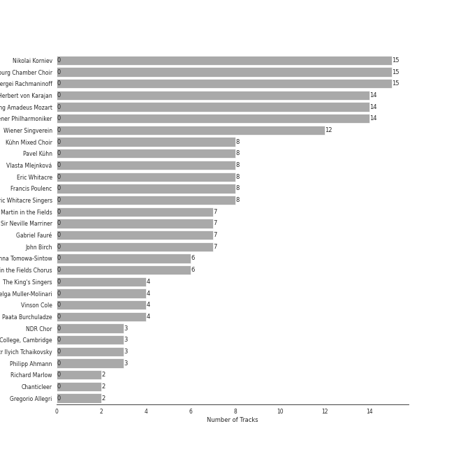
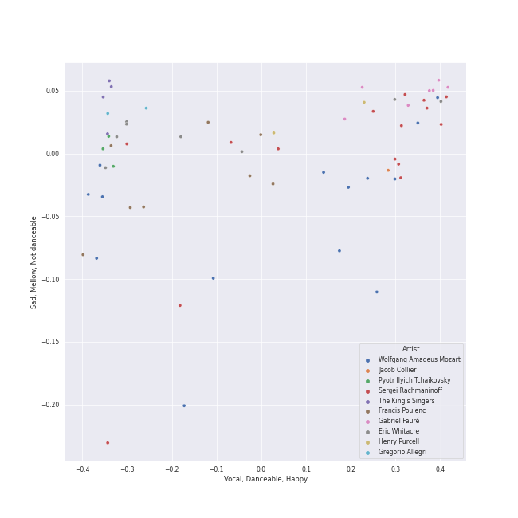
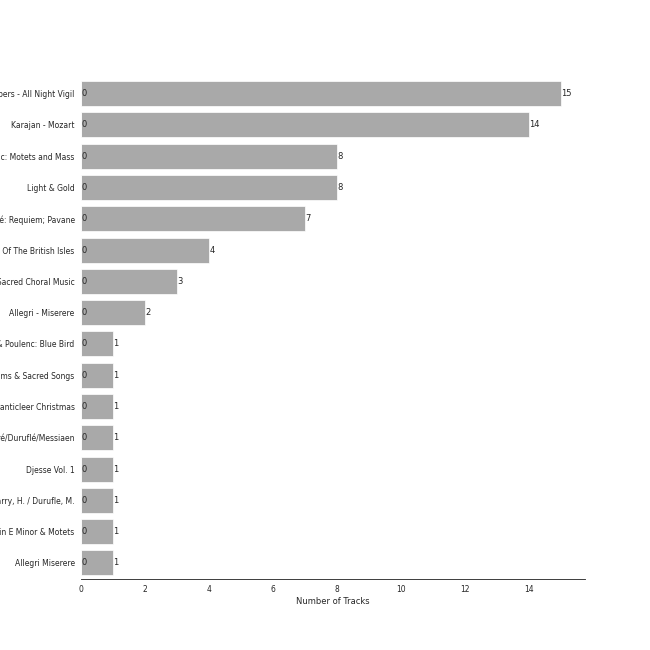
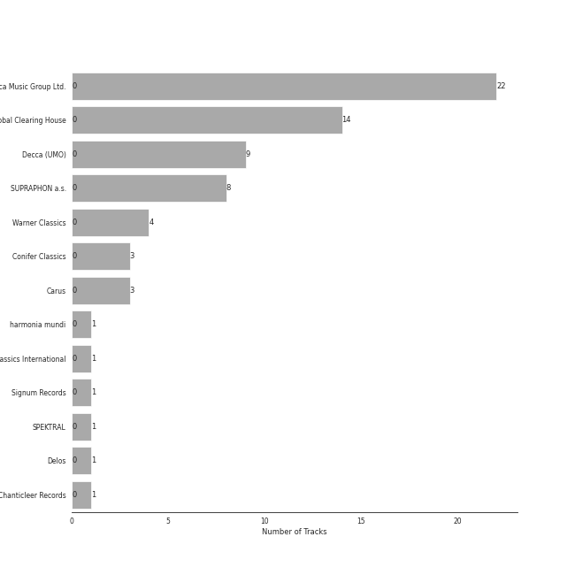

# Choral

[68 songs](choral_tracks.md)

## Top Artists

See all 50 artists

|   Number of Tracks | Art                                                                                              | Artist                                                                                   | 🔗                                                           |
|-------------------:|:-------------------------------------------------------------------------------------------------|:-----------------------------------------------------------------------------------------|:------------------------------------------------------------|
|                 15 |  | [Nikolai Korniev](../artists/nikolai_korniev.md)                                         | [🔗](https://open.spotify.com/artist/70hS9SnJefkZo2QJwS2VXi) |
|                 15 |  | [St.Petersburg Chamber Choir](../artists/st_petersburg_chamber_choir.md)                 | [🔗](https://open.spotify.com/artist/46WjEugfIF0rKOewvFiby2) |
|                 15 |  | [Sergei Rachmaninoff](../artists/sergei_rachmaninoff.md)                                 | [🔗](https://open.spotify.com/artist/0Kekt6CKSo0m5mivKcoH51) |
|                 14 |  | [Herbert von Karajan](../artists/herbert_von_karajan.md)                                 | [🔗](https://open.spotify.com/artist/5zCaQxjl110XTrm4LQ1CxY) |
|                 14 |  | [Wolfgang Amadeus Mozart](../artists/wolfgang_amadeus_mozart.md)                         | [🔗](https://open.spotify.com/artist/4NJhFmfw43RLBLjQvxDuRS) |
|                 14 |  | [Wiener Philharmoniker](../artists/wiener_philharmoniker.md)                             | [🔗](https://open.spotify.com/artist/003f4bk13c6Q3gAUXv7dGJ) |
|                 12 |  | [Wiener Singverein](../artists/wiener_singverein.md)                                     | [🔗](https://open.spotify.com/artist/35QSympF887CO8h5eZHme2) |
|                  8 |  | Kühn Mixed Choir                                                                         | [🔗](https://open.spotify.com/artist/7coad48I6XW2msLS0ms53T) |
|                  8 |  | Pavel Kühn                                                                               | [🔗](https://open.spotify.com/artist/7bzLxD5IZSXMmuuqnZ7MfY) |
|                  8 |  | Vlasta Mlejnková                                                                         | [🔗](https://open.spotify.com/artist/775Rkua0PHENjo1sFIyApV) |
|                  8 |  | Eric Whitacre                                                                            | [🔗](https://open.spotify.com/artist/5TWpCLIhvGlbJmLK1zNpiL) |
|                  8 |  | Francis Poulenc                                                                          | [🔗](https://open.spotify.com/artist/4IAWVxo2fpTBPn6k7GZ3eY) |
|                  8 |  | Eric Whitacre Singers                                                                    | [🔗](https://open.spotify.com/artist/2tPhboxrWrQ4LxOhWlXAeN) |
|                  7 |  | [Academy of St. Martin in the Fields](../artists/academy_of_st__martin_in_the_fields.md) | [🔗](https://open.spotify.com/artist/77CaCn32H4mOMQA7UElzfF) |
|                  7 |  | [Sir Neville Marriner](../artists/sir_neville_marriner.md)                               | [🔗](https://open.spotify.com/artist/6NUhQz7eAEsZvjEHTKHux9) |
|                  7 |  | Gabriel Fauré                                                                            | [🔗](https://open.spotify.com/artist/2gClsBep1tt1rv1CN210SO) |
|                  7 |  | John Birch                                                                               | [🔗](https://open.spotify.com/artist/2TFBoJYsuvMuPMOlwXWbaE) |
|                  6 |  | [Anna Tomowa-Sintow](../artists/anna_tomowa_sintow.md)                                   | [🔗](https://open.spotify.com/artist/6NSIW1uEq8JZmxEkHMF17c) |
|                  6 |  | Academy of St Martin in the Fields Chorus                                                | [🔗](https://open.spotify.com/artist/1GxYERY1PDh1dEuFqvTDa5) |
|                  4 |  | [The King's Singers](../artists/the_king_s_singers.md)                                   | [🔗](https://open.spotify.com/artist/5lR7yDVN4z9kahOiUSlMhe) |
|                  4 |  | Helga Muller-Molinari                                                                    | [🔗](https://open.spotify.com/artist/3s5xNX5n6PAzpusMRhmHbA) |
|                  4 |  | Vinson Cole                                                                              | [🔗](https://open.spotify.com/artist/2j6cP3f3TxyHzcKdWYSm6h) |
|                  4 |  | Paata Burchuladze                                                                        | [🔗](https://open.spotify.com/artist/1JzOJmq9kk0u7OWqzXkBcc) |
|                  3 |  | NDR Chor                                                                                 | [🔗](https://open.spotify.com/artist/7hMAA1N5j1Ynb49NIWO7HV) |
|                  3 |  | The Choir Of Trinity College, Cambridge                                                  | [🔗](https://open.spotify.com/artist/3x8rZy1i6FwWOWKwfRT1Ab) |
|                  3 |  | [Pyotr Ilyich Tchaikovsky](../artists/pyotr_ilyich_tchaikovsky.md)                       | [🔗](https://open.spotify.com/artist/3MKCzCnpzw3TjUYs2v7vDA) |
|                  3 |  | Philipp Ahmann                                                                           | [🔗](https://open.spotify.com/artist/309coOGhdzqXdIRwJH1xUo) |
|                  2 |  | Richard Marlow                                                                           | [🔗](https://open.spotify.com/artist/7rrfp80BJeAa0lpBnNgRNK) |
|                  2 |  | Chanticleer                                                                              | [🔗](https://open.spotify.com/artist/4p6DfIA6NnKmWeRgDJPLT0) |
|                  2 |  | Gregorio Allegri                                                                         | [🔗](https://open.spotify.com/artist/4I47QTluHCo2t2Gj6V7AIG) |
|                  2 |  | Henry Purcell                                                                            | [🔗](https://open.spotify.com/artist/3tMLo1k3iUo82coMLWXzxq) |
|                  2 |  | Thomas Allen                                                                             | [🔗](https://open.spotify.com/artist/2SFBZgfO2H1nVSgjxzJLUy) |
|                  1 |  | Capriccio Stravagante                                                                    | [🔗](https://open.spotify.com/artist/7Hb8ewIvJmuQPAQ5MMVXJE) |
|                  1 |  | Maurice Duruflé                                                                          | [🔗](https://open.spotify.com/artist/7Fph7U6qidZ2E97xKKsD4m) |
|                  1 |  | Sylvia McNair                                                                            | [🔗](https://open.spotify.com/artist/63aSj4hbN7Q4nw74Y0xNF6) |
|                  1 |  | Randall Thompson                                                                         | [🔗](https://open.spotify.com/artist/5vNLpqTjRXfz6uHKs5hnvD) |
|                  1 |  | Joseph Jennings                                                                          | [🔗](https://open.spotify.com/artist/5A3ntUGTCKttzOwkoF9AUY) |
|                  1 |  | Vladimir Mostovoy                                                                        | [🔗](https://open.spotify.com/artist/4BTanscTBWJOSpvceZSVSi) |
|                  1 |  | Voices of Ascension Chorus                                                               | [🔗](https://open.spotify.com/artist/4AjjMZxILxc83KJAEuwu9j) |
|                  1 |  | Olga Borodina                                                                            | [🔗](https://open.spotify.com/artist/47XbXbNzwqcWStfsjzFlKb) |
|                  1 |  | Skip Sempé                                                                               | [🔗](https://open.spotify.com/artist/3DSclbx4DSkyIvouHCxHHZ) |
|                  1 |  | Philippe Herreweghe                                                                      | [🔗](https://open.spotify.com/artist/2ozcTa5tl8qhSbhJKM60I5) |
|                  1 |  | Anton Bruckner                                                                           | [🔗](https://open.spotify.com/artist/2bM3j1JQWBkmzuoZKu4zj2) |
|                  1 |                                                               | Mark Kruczek                                                                             | [🔗](https://open.spotify.com/artist/2DNiyyc8Do3ym3IjCaKFCp) |
|                  1 |  | Ola Gjeilo                                                                               | [🔗](https://open.spotify.com/artist/29lbSb4ujaVH5pHnQjFT0G) |
|                  1 |  | Zürcher Vokalisten                                                                       | [🔗](https://open.spotify.com/artist/1YrY49Nj5lSs8otmnveoQQ) |
|                  1 |  | Collegium Vocale Gent                                                                    | [🔗](https://open.spotify.com/artist/17BdLN9q8RRQQqyklLwac1) |
|                  1 |  | Dennis Keene                                                                             | [🔗](https://open.spotify.com/artist/16e7cTpnxHfo8KnwinUysN) |
|                  1 |  | Tenebrae                                                                                 | [🔗](https://open.spotify.com/artist/0vUnn6Eje2O5yxEj35touD) |
|                  1 |  | Christian Dillig                                                                         | [🔗](https://open.spotify.com/artist/0Ens2zPly8UFhQmyUUXlOH) |

## Top Albums

See all 15 albums

|   Number of Tracks | Art                                                                                              | Album                                                                                                                | 🔗                                                          |
|-------------------:|:-------------------------------------------------------------------------------------------------|:---------------------------------------------------------------------------------------------------------------------|:-----------------------------------------------------------|
|                 15 |  | Rachmaninov: Vespers - All Night Vigil                                                                               | [🔗](https://open.spotify.com/album/7hqotgNjEJt09XiggaMI1v) |
|                 14 |  | Karajan - Mozart                                                                                                     | [🔗](https://open.spotify.com/album/1HSJhsMIW2EDD4YSSkbc9e) |
|                  8 |  | Poulenc: Motets and Mass                                                                                             | [🔗](https://open.spotify.com/album/6czmOzWnyfS71jDpRxZDam) |
|                  8 |  | Light & Gold                                                                                                         | [🔗](https://open.spotify.com/album/2hnquPCPDsr3Srk64rdeVS) |
|                  7 |  | Fauré: Requiem; Pavane                                                                                               | [🔗](https://open.spotify.com/album/0mhVHXJrGE5WUA58CJLf29) |
|                  4 |  | Folk Songs Of The British Isles                                                                                      | [🔗](https://open.spotify.com/album/7eFKaVzp6K60oBnB2kTjwV) |
|                  3 |  | Tchaikovsky: Sacred Choral Music                                                                                     | [🔗](https://open.spotify.com/album/4udN7bCLaa8zCnaIvoxzOB) |
|                  2 |  | Allegri - Miserere                                                                                                   | [🔗](https://open.spotify.com/album/6DXPSePAsqcD40WQsSnasD) |
|                  1 |  | Rachmaninoff & Poulenc: Blue Bird                                                                                    | [🔗](https://open.spotify.com/album/7LfArBzkgp1PPDGDGSYWaR) |
|                  1 |  | Purcell : Anthems & Sacred Songs [Evening Prayer]                                                                    | [🔗](https://open.spotify.com/album/7K8qhv7euF0xd6DiqoReDK) |
|                  1 |  | Our Heart's Joy: A Chanticleer Christmas                                                                             | [🔗](https://open.spotify.com/album/7mdIzxZmqt54mv5wx3drAf) |
|                  1 |  | Fauré/Duruflé/Messiaen                                                                                               | [🔗](https://open.spotify.com/album/2kJvD9jzU5n9dmNj9FoyQ8) |
|                  1 |  | Choral Music - Bainton, E. / Thompson, R. / Mozart, W.A. / Casals, P. / Mendelssohn, Felix / Parry, H. / Durufle, M. | [🔗](https://open.spotify.com/album/2ZcxORUFkzrpjZ7DrSmNkT) |
|                  1 |  | Bruckner: Mass in E Minor & Motets                                                                                   | [🔗](https://open.spotify.com/album/13eAUvw0Ga3BBFsf6oxF46) |
|                  1 |  | Allegri Miserere                                                                                                     | [🔗](https://open.spotify.com/album/3fvFlaBBbAFO0QCrSTbfaU) |

## Top Record Labels

See all 13 labels

|   Number of Tracks | Label                                                                       |
|-------------------:|:----------------------------------------------------------------------------|
|                 22 | [Decca Music Group Ltd.](../labels/decca_music_group_ltd_.md)               |
|                 14 | [UME - Global Clearing House](../labels/ume___global_clearing_house.md)     |
|                  8 | [SUPRAPHON a.s.](../labels/supraphon_a_s_.md)                               |
|                  8 | [Decca (UMO)](../labels/decca__umo_.md)                                     |
|                  4 | [Warner Classics](../labels/warner_classics.md)                             |
|                  3 | [Conifer Classics](../labels/conifer_classics.md)                           |
|                  3 | [Carus](../labels/carus.md)                                                 |
|                  1 | [harmonia mundi](../labels/harmonia_mundi.md)                               |
|                  1 | [Warner Classics International](../labels/warner_classics_international.md) |
|                  1 | [Signum Records](../labels/signum_records.md)                               |
|                  1 | [SPEKTRAL](../labels/spektral.md)                                           |
|                  1 | [Delos](../labels/delos.md)                                                 |
|                  1 | [Chanticleer Records](../labels/chanticleer_records.md)                     |

## Genres

See all 27 genres

|   Number of Tracks | Genre                                                   |
|-------------------:|:--------------------------------------------------------|
|                 51 | [classical](../genres/classical.md)                     |
|                 22 | [post-romantic era](../genres/post_romantic_era.md)     |
|                 18 | [russian romanticism](../genres/russian_romanticism.md) |
|                 15 | [ukrainian classical](../genres/ukrainian_classical.md) |
|                 14 | [classical era](../genres/classical_era.md)             |
|                 14 | choral                                                  |
|                  9 | 21st century classical                                  |
|                  8 | [neoclassicism](../genres/neoclassicism.md)             |
|                  8 | contemporary choir                                      |
|                  8 | american 21st century classical                         |
|                  5 | polyphony                                               |
|                  4 | vocal ensemble                                          |
|                  4 | puirt-a-beul                                            |
|                  4 | [late romantic era](../genres/late_romantic_era.md)     |
|                  4 | [early music](../genres/early_music.md)                 |
|                  4 | cambridge choir                                         |
|                  4 | british choir                                           |
|                  4 | [a cappella](../genres/a_cappella.md)                   |
|                  2 | italian renaissance                                     |
|                  2 | english baroque                                         |
|                  2 | [baroque](../genres/baroque.md)                         |
|                  1 | nordic contemporary classical                           |
|                  1 | early music choir                                       |
|                  1 | classical organ                                         |
|                  1 | american modern classical                               |
|                  1 | american early music                                    |
|                  1 | american choir                                          |

## Audio Features

| 10 most Danceable tracks                                                 | 10 least Danceable tracks                                               |
|:-------------------------------------------------------------------------|:------------------------------------------------------------------------|
| 4 Motets pour le temps de Noël, FP 152: No. 4, Hodie Christus natus est  | Vespers, Op. 37: XIV. "Voskrez iz groba"                                |
| Requiem In D Minor, K.626: 2. Kyrie                                      | Vespers, Op. 37: IV. "Svete tikhyi"                                     |
| Requiem in D Minor, K.626: 3a. Sequientia: Dies irae                     | 4 Motets pour un temps de pénitence, FP 97: No. 3, Tenebrae factae sunt |
| Requiem In D Minor, K.626: 4. Offertorium: Domine Jesu                   | Vespers, Op. 37: V. "Nyne otpushchayeshi"                               |
| 4 Motets pour le temps de Noël, FP 152: No. 2, Quem vidistis pastores    | Lux Aurumque                                                            |
| Requiem In D Minor, K.626: 3. Sequentia: Rex tremendae                   | Three Songs Of Faith: Hope Faith Life Love                              |
| 4 Motets pour un temps de pénitence, FP 97: No. 4, Tristis est anima mea | Requiem In D Minor, K.626: 7. Agnus Dei                                 |
| Loch Lomond                                                              | Requiem in D Minor, Op.48: 2. Offertorium: Domine Jesu Christe          |
| Vespers, Op. 37: VIII. "Kvalite imya Gospodne"                           | Vespers, Op. 37: XII. "Slava v vyshnikh Bogu"                           |
| Scarborough Fair                                                         | Ave Maria (Franz Biebl)                                                 |

| 10 most Energetic tracks                                                | 10 least Energetic tracks                                         |
|:------------------------------------------------------------------------|:------------------------------------------------------------------|
| Requiem in D Minor, K.626: 3a. Sequientia: Dies irae                    | Requiem in D Minor, Op.48: 1. Introitus: Requiem aeternam - Kyrie |
| Vespers, Op. 37: XV. "Vzbrannoy voevode"                                | Hear my prayer, O Lord                                            |
| Requiem In D Minor, K.626: 5. Sanctus                                   | Vespers, Op. 37: V. "Nyne otpushchayeshi"                         |
| Requiem In D Minor, K.626: 2. Kyrie                                     | The Seal Lullaby                                                  |
| Vespers, Op. 37: VIII. "Kvalite imya Gospodne"                          | Miserere mei, Deus                                                |
| Requiem In D Minor, K.626: 8.Communio: Lux aeterna                      | Requiem in D Minor, Op.48: 7. In paradisum                        |
| 4 Motets pour le temps de Noël, FP 152: No. 4, Hodie Christus natus est | Requiem In D Minor, K.626: 3. Sequentia: Confutatis               |
| Requiem In D Minor, K.626: 4. Offertorium: Domine Jesu                  | Vespers, Op. 37: III. "Blazhen muzh"                              |
| Requiem In D Minor, K.626: 3. Sequentia: Rex tremendae                  | Requiem in D Minor, Op. 48: 4. Pie Jesu                           |
| 4 Motets pour un temps de pénitence, FP 97: No. 1, Timor et tremor      | Quatre Motets: Ubi Caritas                                        |

| 10 most Speechy tracks                                                   | 10 least Speechy tracks                                |
|:-------------------------------------------------------------------------|:-------------------------------------------------------|
| 4 Motets pour un temps de pénitence, FP 97: No. 4, Tristis est anima mea | Scarborough Fair                                       |
| Greensleeves                                                             | Requiem In D Minor, K.626: 1. Introitus: Requiem       |
| 4 Motets pour le temps de Noël, FP 152: No. 3, Videntes stellam          | Vespers, Op. 37: III. "Blazhen muzh"                   |
| Vespers, Op. 37: XII. "Slava v vyshnikh Bogu"                            | Requiem in D Minor, K.626: 3a. Sequientia: Dies irae   |
| Lux Aurumque                                                             | Requiem In D Minor, K.626: 8.Communio: Lux aeterna     |
| 9 Sacred Pieces, TH 78: No. 1, Cherubic Hymn No. 1                       | Requiem In D Minor, K.626: 4. Offertorium: Hostias     |
| Vespers, Op. 37: II. "Blagoslovi dushe moya"                             | Requiem In D Minor, K.626: 3. Sequentia: Rex tremendae |
| Vespers, Op. 37: XI. "Velichit dusha moya Gospoda"                       | Requiem In D Minor, K.626: 2. Kyrie                    |
| Requiem In D Minor, K.626: 3. Sequentia: Tuba mirum                      | Requiem In D Minor, K.626: 5. Sanctus                  |
| Loch Lomond                                                              | Requiem In D Minor, K.626: 4. Offertorium: Domine Jesu |

| 10 most Acoustic tracks                                                 | 10 least Acoustic tracks                                       |
|:------------------------------------------------------------------------|:---------------------------------------------------------------|
| Vespers, Op. 37: XV. "Vzbrannoy voevode"                                | Greensleeves                                                   |
| 4 Motets pour un temps de pénitence, FP 97: No. 2, Vinea mea electa     | Requiem In D Minor, K.626: 3. Sequentia: Rex tremendae         |
| Vespers, Op. 37: VIII. "Kvalite imya Gospodne"                          | Requiem in D Minor, Op.48: 2. Offertorium: Domine Jesu Christe |
| 4 Motets pour le temps de Noël, FP 152: No. 4, Hodie Christus natus est | Requiem in D Minor, Op.48: 3. Sanctus                          |
| Vespers, Op. 37: I. "Priidite, poklonimsya"                             | Loch Lomond                                                    |
| 4 Motets pour un temps de pénitence, FP 97: No. 1, Timor et tremor      | Danny Boy                                                      |
| 4 Motets pour le temps de Noël, FP 152: No. 2, Quem vidistis pastores   | Scarborough Fair                                               |
| 9 Sacred Pieces, TH 78: No. 3, Cherubic Hymn No. 3                      | Requiem in D Minor, K.626: 3a. Sequientia: Dies irae           |
| 4 Motets pour le temps de Noël, FP 152: No. 3, Videntes stellam         | Requiem In D Minor, K.626: 5. Sanctus                          |
| Alleluia                                                                | Ave Maria (Franz Biebl)                                        |

| 10 most Instrumental tracks                                       | 10 least Instrumental tracks                                            |
|:------------------------------------------------------------------|:------------------------------------------------------------------------|
| Vespers, Op. 37: XIV. "Voskrez iz groba"                          | Miserere                                                                |
| Vespers, Op. 37: VI. "Bogoroditse Devo"                           | 4 Motets pour le temps de Noël, FP 152: No. 2, Quem vidistis pastores   |
| Requiem in D Minor, Op.48: 7. In paradisum                        | Requiem In D Minor, K.626: 6. Benedictus                                |
| Lux Aurumque                                                      | Quatre Motets: Ubi Caritas                                              |
| Requiem in D Minor, Op.48: 3. Sanctus                             | Requiem In D Minor, K.626: 3. Sequentia: Tuba mirum                     |
| Requiem In D Minor, K.626: 3. Sequentia: Confutatis               | Requiem In D Minor, K.626: 3. Sequentia: Recordare                      |
| Requiem in D Minor, Op. 48: 4. Pie Jesu                           | 4 Motets pour le temps de Noël, FP 152: No. 4, Hodie Christus natus est |
| Requiem in D Minor, Op.48: 1. Introitus: Requiem aeternam - Kyrie | Scarborough Fair                                                        |
| Requiem In D Minor, K.626: 7. Agnus Dei                           | Loch Lomond                                                             |
| Vespers, Op. 37: IV. "Svete tikhyi"                               | Danny Boy                                                               |

| 10 most Live tracks                                                   | 10 least Live tracks                               |
|:----------------------------------------------------------------------|:---------------------------------------------------|
| Requiem In D Minor, K.626: 3. Sequentia: Recordare                    | Alleluia                                           |
| Requiem in D Minor, K.626: 3a. Sequientia: Dies irae                  | Vespers, Op. 37: I. "Priidite, poklonimsya"        |
| Leonardo Dreams Of His Flying Machine                                 | Requiem In D Minor, K.626: 8.Communio: Lux aeterna |
| 4 Motets pour le temps de Noël, FP 152: No. 2, Quem vidistis pastores | 9 Sacred Pieces, TH 78: No. 3, Cherubic Hymn No. 3 |
| Sleep                                                                 | Vespers, Op. 37: XII. "Slava v vyshnikh Bogu"      |
| Three Songs Of Faith: I Will Wade Out                                 | Vespers, Op. 37: II. "Blagoslovi dushe moya"       |
| Requiem In D Minor, K.626: 4. Offertorium: Hostias                    | Unicornis Captivatur                               |
| Requiem In D Minor, K.626: 4. Offertorium: Domine Jesu                | 9 Sacred Pieces, TH 78: No. 2, Cherubic Hymn No. 2 |
| Vespers, Op. 37: XIII. "Dnes spaseniye"                               | Ave María, WAB 6                                   |
| Danny Boy                                                             | Requiem in D Minor, Op.48: 7. In paradisum         |

| 10 most Happy tracks                                                    | 10 least Happy tracks                                             |
|:------------------------------------------------------------------------|:------------------------------------------------------------------|
| Requiem in D Minor, K.626: 3a. Sequientia: Dies irae                    | Ave María, WAB 6                                                  |
| Requiem In D Minor, K.626: 2. Kyrie                                     | Vespers, Op. 37: IV. "Svete tikhyi"                               |
| 4 Motets pour le temps de Noël, FP 152: No. 4, Hodie Christus natus est | Requiem in D Minor, Op. 48: 4. Pie Jesu                           |
| 4 Motets pour le temps de Noël, FP 152: No. 2, Quem vidistis pastores   | Requiem in D Minor, Op.48: 1. Introitus: Requiem aeternam - Kyrie |
| Scarborough Fair                                                        | Water Night                                                       |
| Requiem In D Minor, K.626: 3. Sequentia: Rex tremendae                  | Three Songs Of Faith: I Thank You God For Most This Amazing Day   |
| Requiem In D Minor, K.626: 4. Offertorium: Domine Jesu                  | Sleep                                                             |
| Requiem In D Minor, K.626: 5. Sanctus                                   | Miserere mei, Deus                                                |
| Requiem In D Minor, K.626: 6. Benedictus                                | Three Songs Of Faith: Hope Faith Life Love                        |
| Greensleeves                                                            | Lux Aurumque                                                      |
