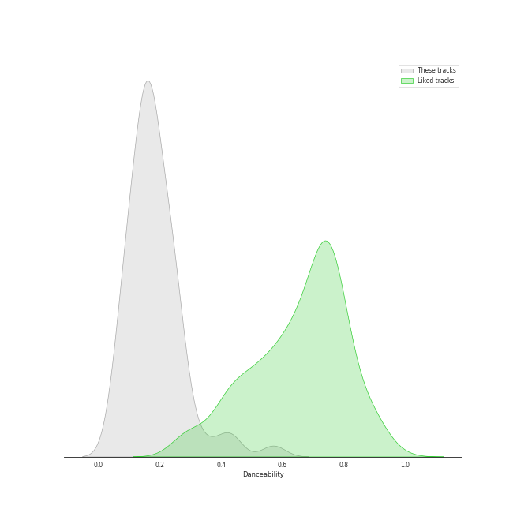
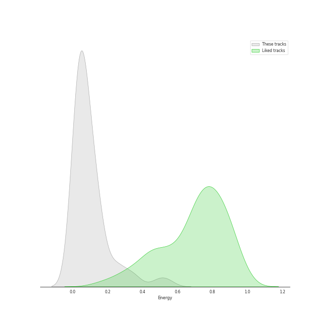
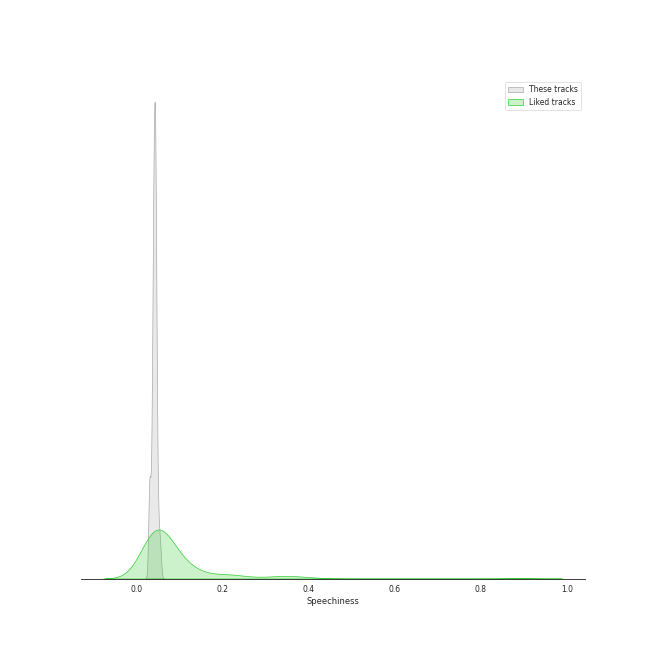
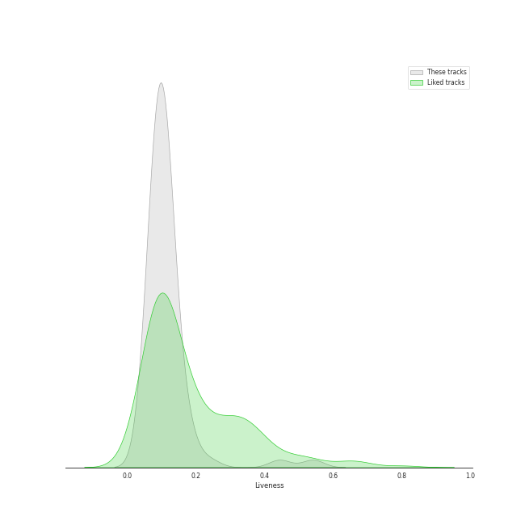
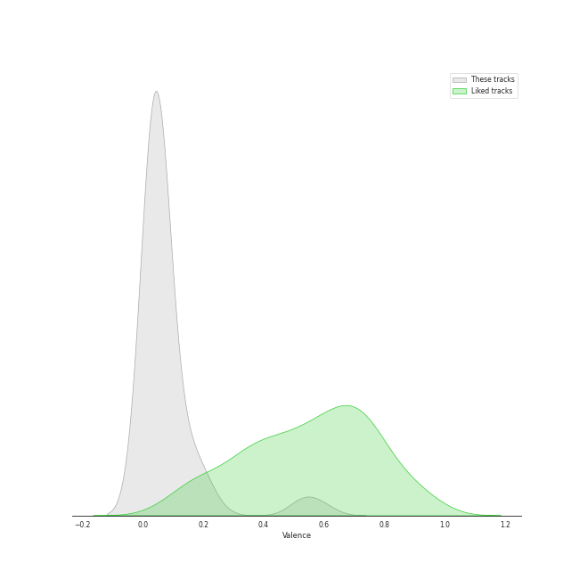
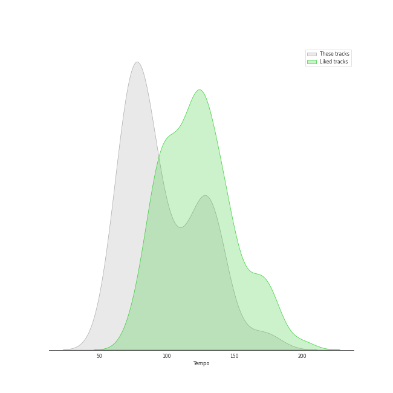

# Track Features for Choral

## Danceability

| ​ | 10 most Danceable tracks | ​​ | 10 least Danceable tracks |
|:---|:---|:---|:---|
|  | 4 Motets pour le temps de Noël, FP 152: No. 4, Hodie Christus natus est (0.57) |  | Ave Maria (Franz Biebl) (0.0611) |
|  | Requiem In D Minor, K.626: 2. Kyrie (0.428) |  | Vespers, Op. 37: XII. "Slava v vyshnikh Bogu" (0.0636) |
|  | Requiem in D Minor, K.626: 3a. Sequientia: Dies irae (0.427) |  | Requiem in D Minor, Op. 48: II. Offertorium. Domine Jesu Christe (0.0668) |
|  | Requiem In D Minor, K.626: 4. Offertorium: Domine Jesu (0.357) |  | Requiem In D Minor, K.626: 7. Agnus Dei (0.0749) |
|  | 4 Motets pour le temps de Noël, FP 152: No. 2, Quem vidistis pastores (0.296) |  | Whitacre: Three Songs Of Faith: Hope Faith Life Love (0.0771) |
|  | Requiem In D Minor, K.626: 3. Sequentia: Rex tremendae (0.276) |  | Whitacre: Lux Aurumque (0.0783) |
|  | 4 Motets pour un temps de pénitence, FP 97: No. 4, Tristis est anima mea (0.266) |  | Vespers, Op. 37: V. "Nyne otpushchayeshi" (0.0806) |
|  | Loch Lomond (0.266) |  | 4 Motets pour un temps de pénitence, FP 97: No. 3, Tenebrae factae sunt (0.0963) |
|  | Vespers, Op. 37: VIII. "Kvalite imya Gospodne" (0.258) |  | Vespers, Op. 37: IV. "Svete tikhyi" (0.103) |
|  | Scarborough Fair (0.249) |  | Vespers, Op. 37: XIV. "Voskrez iz groba" (0.104) |

## Energy

| ​ | 10 most Energetic tracks | ​​ | 10 least Energetic tracks |
|:---|:---|:---|:---|
|  | Requiem in D Minor, K.626: 3a. Sequientia: Dies irae (0.542) |  | Quatre Motets: Ubi Caritas (0.0152) |
|  | Vespers, Op. 37: XV. "Vzbrannoy voevode" (0.488) |  | Requiem in D Minor, Op. 48: IV. Pie Jesu (0.0179) |
|  | Requiem In D Minor, K.626: 5. Sanctus (0.363) |  | Vespers, Op. 37: III. "Blazhen muzh" (0.0184) |
|  | Requiem In D Minor, K.626: 2. Kyrie (0.33) |  | Requiem In D Minor, K.626: 3. Sequentia: Confutatis (0.0185) |
|  | Vespers, Op. 37: VIII. "Kvalite imya Gospodne" (0.296) |  | Requiem in D Minor, Op. 48: VII. In Paradisum (0.0195) |
|  | Requiem In D Minor, K.626: 8.Communio: Lux aeterna (0.25) |  | Miserere mei, Deus (0.0199) |
|  | 4 Motets pour le temps de Noël, FP 152: No. 4, Hodie Christus natus est (0.242) |  | Whitacre: The Seal Lullaby (0.0217) |
|  | Requiem In D Minor, K.626: 4. Offertorium: Domine Jesu (0.241) |  | Vespers, Op. 37: V. "Nyne otpushchayeshi" (0.0223) |
|  | Requiem In D Minor, K.626: 3. Sequentia: Rex tremendae (0.183) |  | Hear my prayer, O Lord (0.0236) |
|  | 4 Motets pour un temps de pénitence, FP 97: No. 1, Timor et tremor (0.154) |  | Requiem in D Minor, Op. 48: I. Introitus. Requiem aeternam - Kyrie (0.0246) |

## Speechiness

| ​ | 10 most Speechy tracks | ​​ | 10 least Speechy tracks |
|:---|:---|:---|:---|
|  | 4 Motets pour un temps de pénitence, FP 97: No. 4, Tristis est anima mea (0.0568) |  | Requiem In D Minor, K.626: 4. Offertorium: Domine Jesu (0.0293) |
|  | Greensleeves (0.0545) |  | Requiem In D Minor, K.626: 5. Sanctus (0.0301) |
|  | 4 Motets pour le temps de Noël, FP 152: No. 3, Videntes stellam (0.053) |  | Requiem In D Minor, K.626: 2. Kyrie (0.0304) |
|  | Vespers, Op. 37: XII. "Slava v vyshnikh Bogu" (0.0498) |  | Requiem In D Minor, K.626: 3. Sequentia: Rex tremendae (0.0315) |
|  | Whitacre: Lux Aurumque (0.0489) |  | Requiem In D Minor, K.626: 4. Offertorium: Hostias (0.0316) |
|  | 9 Sacred Pieces, TH 78: No. 1, Cherubic Hymn No. 1 (0.0486) |  | Requiem In D Minor, K.626: 8.Communio: Lux aeterna (0.0317) |
|  | Vespers, Op. 37: II. "Blagoslovi dushe moya" (0.0485) |  | Requiem in D Minor, K.626: 3a. Sequientia: Dies irae (0.0325) |
|  | Vespers, Op. 37: XI. "Velichit dusha moya Gospoda" (0.0481) |  | Home Is (0.0355) |
|  | Requiem In D Minor, K.626: 3. Sequentia: Tuba mirum (0.0467) |  | Vespers, Op. 37: III. "Blazhen muzh" (0.0362) |
|  | Loch Lomond (0.0467) |  | Requiem In D Minor, K.626: 1. Introitus: Requiem (0.0363) |

## Acousticness

| ​ | 10 most Acoustic tracks | ​​ | 10 least Acoustic tracks |
|:---|:---|:---|:---|
|  | Vespers, Op. 37: VIII. "Kvalite imya Gospodne" (0.995) |  | Ave Maria (Franz Biebl) (0.897) |
|  | 4 Motets pour un temps de pénitence, FP 97: No. 1, Timor et tremor (0.995) |  | Requiem In D Minor, K.626: 5. Sanctus (0.927) |
|  | 4 Motets pour un temps de pénitence, FP 97: No. 2, Vinea mea electa (0.995) |  | Requiem in D Minor, K.626: 3a. Sequientia: Dies irae (0.936) |
|  | 9 Sacred Pieces, TH 78: No. 3, Cherubic Hymn No. 3 (0.995) |  | Scarborough Fair (0.951) |
|  | Vespers, Op. 37: XV. "Vzbrannoy voevode" (0.995) |  | Danny Boy (0.953) |
|  | 4 Motets pour le temps de Noël, FP 152: No. 2, Quem vidistis pastores (0.995) |  | Loch Lomond (0.959) |
|  | Vespers, Op. 37: I. "Priidite, poklonimsya" (0.995) |  | Requiem in D Minor, Op. 48: II. Offertorium. Domine Jesu Christe (0.969) |
|  | 4 Motets pour le temps de Noël, FP 152: No. 4, Hodie Christus natus est (0.995) |  | Requiem in D Minor, Op. 48: III. Sanctus (0.969) |
|  | Alleluia (0.994) |  | Requiem In D Minor, K.626: 3. Sequentia: Rex tremendae (0.973) |
|  | 4 Motets pour le temps de Noël, FP 152: No. 3, Videntes stellam (0.994) |  | Miserere (0.974) |

## Instrumentalness

| ​ | 10 most Instrumental tracks | ​​ | 10 least Instrumental tracks |
|:---|:---|:---|:---|
|  | Vespers, Op. 37: XIV. "Voskrez iz groba" (0.98) |  | Danny Boy (3.77e-05) |
|  | Vespers, Op. 37: VI. "Bogoroditse Devo" (0.979) |  | Loch Lomond (6.04e-05) |
|  | Requiem in D Minor, Op. 48: VII. In Paradisum (0.971) |  | Scarborough Fair (8.48e-05) |
|  | Whitacre: Lux Aurumque (0.964) |  | 4 Motets pour le temps de Noël, FP 152: No. 4, Hodie Christus natus est (0.000134) |
|  | Requiem in D Minor, Op. 48: III. Sanctus (0.953) |  | Requiem In D Minor, K.626: 3. Sequentia: Recordare (0.000349) |
|  | Requiem In D Minor, K.626: 3. Sequentia: Confutatis (0.944) |  | Requiem In D Minor, K.626: 3. Sequentia: Tuba mirum (0.0004) |
|  | Requiem in D Minor, Op. 48: IV. Pie Jesu (0.934) |  | Quatre Motets: Ubi Caritas (0.000426) |
|  | Requiem in D Minor, Op. 48: I. Introitus. Requiem aeternam - Kyrie (0.923) |  | Requiem In D Minor, K.626: 6. Benedictus (0.000441) |
|  | Requiem In D Minor, K.626: 7. Agnus Dei (0.923) |  | 4 Motets pour le temps de Noël, FP 152: No. 2, Quem vidistis pastores (0.00129) |
|  | Vespers, Op. 37: IV. "Svete tikhyi" (0.921) |  | Miserere (0.00266) |

## Liveness

| ​ | 10 most Live tracks | ​​ | 10 least Live tracks |
|:---|:---|:---|:---|
|  | Requiem In D Minor, K.626: 3. Sequentia: Recordare (0.541) |  | Requiem in D Minor, Op. 48: VII. In Paradisum (0.0565) |
|  | Requiem in D Minor, K.626: 3a. Sequientia: Dies irae (0.444) |  | Ave María, WAB 6 (0.0571) |
|  | Whitacre: Leonardo Dreams Of His Flying Machine (0.239) |  | 9 Sacred Pieces, TH 78: No. 2, Cherubic Hymn No. 2 (0.0575) |
|  | 4 Motets pour le temps de Noël, FP 152: No. 2, Quem vidistis pastores (0.176) |  | Unicornis Captivatur (0.0615) |
|  | Whitacre: Sleep (0.175) |  | Vespers, Op. 37: II. "Blagoslovi dushe moya" (0.0651) |
|  | Whitacre: Three Songs Of Faith: I Will Wade Out (0.174) |  | Vespers, Op. 37: XII. "Slava v vyshnikh Bogu" (0.0666) |
|  | Requiem In D Minor, K.626: 4. Offertorium: Hostias (0.167) |  | 9 Sacred Pieces, TH 78: No. 3, Cherubic Hymn No. 3 (0.0684) |
|  | Requiem In D Minor, K.626: 4. Offertorium: Domine Jesu (0.144) |  | Requiem In D Minor, K.626: 8.Communio: Lux aeterna (0.0716) |
|  | Vespers, Op. 37: XIII. "Dnes spaseniye" (0.139) |  | Vespers, Op. 37: I. "Priidite, poklonimsya" (0.0735) |
|  | Danny Boy (0.136) |  | Alleluia (0.0738) |

## Valence

| ​ | 10 most Happy tracks | ​​ | 10 least Happy tracks |
|:---|:---|:---|:---|
|  | Requiem in D Minor, K.626: 3a. Sequientia: Dies irae (0.596) |  | Whitacre: Lux Aurumque (0.0241) |
|  | Requiem In D Minor, K.626: 2. Kyrie (0.544) |  | Whitacre: Three Songs Of Faith: Hope Faith Life Love (0.0285) |
|  | 4 Motets pour le temps de Noël, FP 152: No. 4, Hodie Christus natus est (0.521) |  | Miserere mei, Deus (0.031) |
|  | 4 Motets pour le temps de Noël, FP 152: No. 2, Quem vidistis pastores (0.227) |  | Whitacre: Sleep (0.0311) |
|  | Scarborough Fair (0.191) |  | Whitacre: Three Songs Of Faith: I Thank You God For Most This Amazing Day (0.0315) |
|  | Requiem In D Minor, K.626: 3. Sequentia: Rex tremendae (0.186) |  | Whitacre: Water Night (0.0321) |
|  | Requiem In D Minor, K.626: 4. Offertorium: Domine Jesu (0.176) |  | Requiem in D Minor, Op. 48: I. Introitus. Requiem aeternam - Kyrie (0.0321) |
|  | Requiem In D Minor, K.626: 5. Sanctus (0.172) |  | Requiem in D Minor, Op. 48: IV. Pie Jesu (0.0329) |
|  | Requiem In D Minor, K.626: 6. Benedictus (0.153) |  | Vespers, Op. 37: IV. "Svete tikhyi" (0.0331) |
|  | Greensleeves (0.149) |  | Ave María, WAB 6 (0.0332) |

## Tempo

| ​ | 10 most Fast tracks | ​​ | 10 least Fast tracks |
|:---|:---|:---|:---|
|  | Whitacre: Three Songs Of Faith: Hope Faith Life Love (177.027) |  | Vespers, Op. 37: XII. "Slava v vyshnikh Bogu" (59.288) |
|  | 4 Motets pour le temps de Noël, FP 152: No. 2, Quem vidistis pastores (168.573) |  | Requiem in D Minor, Op. 48: III. Sanctus (62.242) |
|  | Ave María, WAB 6 (145.594) |  | Ave Maria (Franz Biebl) (64.509) |
|  | Requiem In D Minor, K.626: 3. Sequentia: Tuba mirum (138.199) |  | Requiem In D Minor, K.626: 3. Sequentia: Confutatis (65.236) |
|  | Purcell: Hear My Prayer, O Lord, Z. 15 (137.358) |  | Vespers, Op. 37: IX. "Blagosloven esi, Gospodi" (65.552) |
|  | Hear my prayer, O Lord (136.328) |  | Vespers, Op. 37: III. "Blazhen muzh" (66.348) |
|  | 9 Sacred Pieces, TH 78: No. 2, Cherubic Hymn No. 2 (135.948) |  | Whitacre: The Seal Lullaby (66.349) |
|  | 4 Motets pour un temps de pénitence, FP 97: No. 2, Vinea mea electa (134.757) |  | 4 Motets pour un temps de pénitence, FP 97: No. 3, Tenebrae factae sunt (66.871) |
|  | Loch Lomond (132.519) |  | 4 Motets pour un temps de pénitence, FP 97: No. 4, Tristis est anima mea (68.266) |
|  | Miserere mei, Deus (131.849) |  | Requiem In D Minor, K.626: 5. Sanctus (68.345) |
