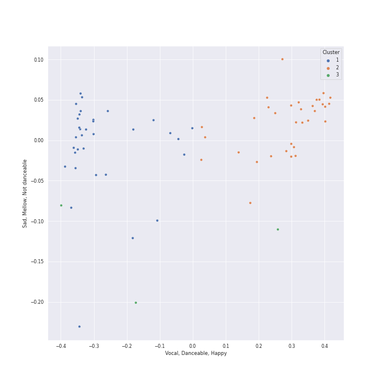

# Clusters in Choral

## Cluster #1

33 tracks

| Art | Track | Album | Artists | Label | Score | 💚 | 🔗 |
|:---|:---|:---|:---|:---|---:|:---|:---|
|  | Requiem In D Minor, K.626: 3. Sequentia: Tuba mirum | Karajan - Mozart | [Wolfgang Amadeus Mozart](../../../../artists/wolfgang_amadeus_mozart/overview.md), Anna Tomowa-Sintow, Helga Muller-Molinari, Vinson Cole, Paata Burchuladze, Wiener Philharmoniker, [Herbert von Karajan](../../../../artists/herbert_von_karajan/overview.md) | [UME - Global Clearing House](../../../../labels/ume_-_global_clearing_house) | 0 | | [🔗](https://open.spotify.com/track/5xItkHeimSWCAWwh6WvV86) |
|  | 9 Sacred Pieces, TH 78: No. 3, Cherubic Hymn No. 3 | Tchaikovsky: Sacred Choral Music | [Pyotr Ilyich Tchaikovsky](../../../../artists/pyotr_ilyich_tchaikovsky/overview.md), NDR Chor, Philipp Ahmann | Carus | 0 | | [🔗](https://open.spotify.com/track/5cuTdpoXIWieDK848fuNDW) |
|  | 9 Sacred Pieces, TH 78: No. 1, Cherubic Hymn No. 1 | Tchaikovsky: Sacred Choral Music | [Pyotr Ilyich Tchaikovsky](../../../../artists/pyotr_ilyich_tchaikovsky/overview.md), NDR Chor, Philipp Ahmann | Carus | 0 | | [🔗](https://open.spotify.com/track/7E4KpvGnw4eD55VgmdMdco) |
|  | 4 Motets pour un temps de pénitence, FP 97: No. 4, Tristis est anima mea | Poulenc: Motets and Mass | Francis Poulenc, Vlasta Mlejnková, Kühn Mixed Choir, Pavel Kühn | SUPRAPHON a.s. | 0 | | [🔗](https://open.spotify.com/track/0of2TShrStNkbPvZQLeiNh) |
|  | 4 Motets pour un temps de pénitence, FP 97: No. 1, Timor et tremor | Poulenc: Motets and Mass | Francis Poulenc, Vlasta Mlejnková, Kühn Mixed Choir, Pavel Kühn | SUPRAPHON a.s. | 0 | | [🔗](https://open.spotify.com/track/67NRQzKiJzlayRlmZ4zbKc) |
|  | Whitacre: Three Songs Of Faith: I Will Wade Out | Light & Gold | Eric Whitacre, Eric Whitacre Singers | [Decca (UMO)](../../../../labels/decca_(umo)) | 0 | | [🔗](https://open.spotify.com/track/3bMGaK0AfpU3J321Mlm553) |
|  | Whitacre: Water Night | Light & Gold | Eric Whitacre, Eric Whitacre Singers | [Decca (UMO)](../../../../labels/decca_(umo)) | 0 | | [🔗](https://open.spotify.com/track/5w0L0SdyLv7BK8hXctiHhm) |
|  | Whitacre: Sleep | Light & Gold | Eric Whitacre, Eric Whitacre Singers | [Decca (UMO)](../../../../labels/decca_(umo)) | 0 | | [🔗](https://open.spotify.com/track/78BLTUqTCCHuptFEGejEoS) |
|  | Miserere mei, Deus | Allegri - Miserere | Gregorio Allegri, The Choir Of Trinity College, Cambridge, Richard Marlow | Conifer Classics | 0 | | [🔗](https://open.spotify.com/track/6es7DmrhnDoKj5rsFvh3XU) |
|  | Miserere | Allegri Miserere | Gregorio Allegri, Tenebrae | Signum Records | 0 | | [🔗](https://open.spotify.com/track/2ED1VZ53iRImo252U2PEsu) |
## Cluster #2

33 tracks

| Art | Track | Album | Artists | Label | Score | 💚 | 🔗 |
|:---|:---|:---|:---|:---|---:|:---|:---|
|  | Requiem In D Minor, K.626: 1. Introitus: Requiem | Karajan - Mozart | [Wolfgang Amadeus Mozart](../../../../artists/wolfgang_amadeus_mozart/overview.md), Anna Tomowa-Sintow, Wiener Singverein, Wiener Philharmoniker, [Herbert von Karajan](../../../../artists/herbert_von_karajan/overview.md) | [UME - Global Clearing House](../../../../labels/ume_-_global_clearing_house) | 0 | | [🔗](https://open.spotify.com/track/3zsSvh8Pu3TiuXn5YdhZqz) |
|  | Requiem In D Minor, K.626: 3. Sequentia: Lacrimosa | Karajan - Mozart | [Wolfgang Amadeus Mozart](../../../../artists/wolfgang_amadeus_mozart/overview.md), Wiener Singverein, Wiener Philharmoniker, [Herbert von Karajan](../../../../artists/herbert_von_karajan/overview.md) | [UME - Global Clearing House](../../../../labels/ume_-_global_clearing_house) | 0 | | [🔗](https://open.spotify.com/track/4fZ5XttwgrWUnmD8cPqfaP) |
|  | Home Is | Djesse Vol. 1 | [Jacob Collier](../../../../artists/jacob_collier/overview.md), VOCES8 | [Decca (UMO)](../../../../labels/decca_(umo)) | 0 | | [🔗](https://open.spotify.com/track/3nur4bNfmRCoLFxk9ubHHK) |
|  | Vespers, Op. 37: XIII. "Dnes spaseniye" | Rachmaninov: Vespers - All Night Vigil | Sergei Rachmaninoff, St.Petersburg Chamber Choir, Nikolai Korniev | [Decca Music Group Ltd.](../../../../labels/decca_music_group_ltd_) | 0 | | [🔗](https://open.spotify.com/track/07rzxAXZHLhV0kGR0zNDIn) |
|  | Vespers, Op. 37: VII. "Slava v vyshnikh Bogu" | Rachmaninov: Vespers - All Night Vigil | Sergei Rachmaninoff, St.Petersburg Chamber Choir, Nikolai Korniev | [Decca Music Group Ltd.](../../../../labels/decca_music_group_ltd_) | 0 | | [🔗](https://open.spotify.com/track/0op8XEiSF79zl5SSvPv5j2) |
|  | Vespers, Op. 37: XI. "Velichit dusha moya Gospoda" | Rachmaninov: Vespers - All Night Vigil | Sergei Rachmaninoff, St.Petersburg Chamber Choir, Nikolai Korniev | [Decca Music Group Ltd.](../../../../labels/decca_music_group_ltd_) | 0 | | [🔗](https://open.spotify.com/track/32j8MnD2wyx1QQ3wRa6ytm) |
|  | Vespers, Op. 37: I. "Priidite, poklonimsya" | Rachmaninov: Vespers - All Night Vigil | Sergei Rachmaninoff, St.Petersburg Chamber Choir, Nikolai Korniev | [Decca Music Group Ltd.](../../../../labels/decca_music_group_ltd_) | 0 | | [🔗](https://open.spotify.com/track/4evlPDUET2zxmrSffIopYk) |
|  | Vespers, Op. 37: III. "Blazhen muzh" | Rachmaninov: Vespers - All Night Vigil | Sergei Rachmaninoff, St.Petersburg Chamber Choir, Nikolai Korniev | [Decca Music Group Ltd.](../../../../labels/decca_music_group_ltd_) | 0 | | [🔗](https://open.spotify.com/track/4vOfTVbAp9oBxyko8covCb) |
|  | Requiem in D Minor, Op. 48: V. Agnus Dei | Fauré: Requiem; Pavane | Gabriel Fauré, Academy of St Martin in the Fields Chorus, Academy of St. Martin in the Fields, John Birch, Sir Neville Marriner | [Decca Music Group Ltd.](../../../../labels/decca_music_group_ltd_) | 0 | | [🔗](https://open.spotify.com/track/0UHDXE1d9Up2mEbzLLsMjw) |
|  | Hear my prayer, O Lord | Allegri - Miserere | Henry Purcell, The Choir Of Trinity College, Cambridge | Conifer Classics | 0 | | [🔗](https://open.spotify.com/track/24zUe2qJnLh71w85fJmPRC) |
## Cluster #3

3 tracks

| Art | Track | Album | Artists | Label | Score | 💚 | 🔗 |
|:---|:---|:---|:---|:---|---:|:---|:---|
|  | Requiem In D Minor, K.626: 2. Kyrie | Karajan - Mozart | [Wolfgang Amadeus Mozart](../../../../artists/wolfgang_amadeus_mozart/overview.md), Wiener Singverein, Wiener Philharmoniker, [Herbert von Karajan](../../../../artists/herbert_von_karajan/overview.md) | [UME - Global Clearing House](../../../../labels/ume_-_global_clearing_house) | 0 | | [🔗](https://open.spotify.com/track/5OO1HZSyoPeaZvmvlIOvIp) |
|  | Requiem in D Minor, K.626: 3a. Sequientia: Dies irae | Karajan - Mozart | [Wolfgang Amadeus Mozart](../../../../artists/wolfgang_amadeus_mozart/overview.md), Wiener Singverein, Wiener Philharmoniker, [Herbert von Karajan](../../../../artists/herbert_von_karajan/overview.md) | [UME - Global Clearing House](../../../../labels/ume_-_global_clearing_house) | 0 | | [🔗](https://open.spotify.com/track/5bzkKeaKTatYKtxHY0HDay) |
|  | 4 Motets pour le temps de Noël, FP 152: No. 4, Hodie Christus natus est | Poulenc: Motets and Mass | Francis Poulenc, Vlasta Mlejnková, Kühn Mixed Choir, Pavel Kühn | SUPRAPHON a.s. | 0 | | [🔗](https://open.spotify.com/track/0PDnRCf3AnUUjAYSXVok55) |