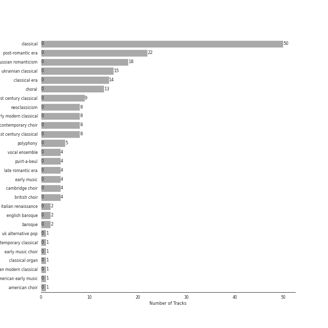
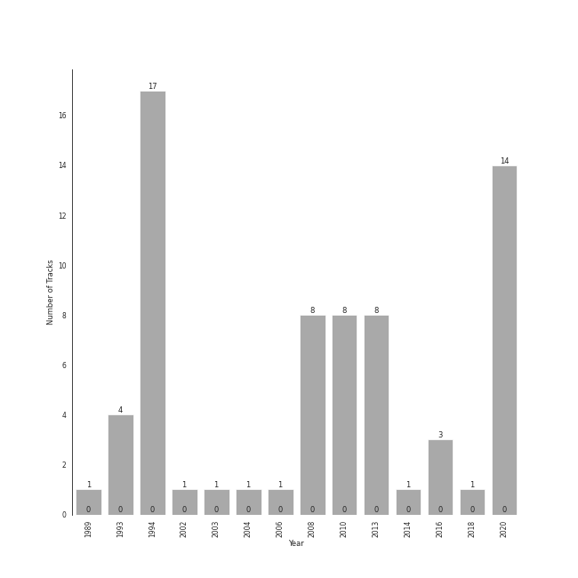

# Choral

[68 songs (0 liked)](tracks.md)

## Top Artists

See all 50 artists

| Art | Tracks | 💚 | Artist | 🔗 |
|:---|---:|---:|:---|:---|
|  | 15 | 0 | Nikolai Korniev | [🔗](https://open.spotify.com/artist/70hS9SnJefkZo2QJwS2VXi) |
|  | 15 | 0 | St.Petersburg Chamber Choir | [🔗](https://open.spotify.com/artist/46WjEugfIF0rKOewvFiby2) |
|  | 15 | 0 | Sergei Rachmaninoff | [🔗](https://open.spotify.com/artist/0Kekt6CKSo0m5mivKcoH51) |
|  | 14 | 0 | Herbert von Karajan | [🔗](https://open.spotify.com/artist/5zCaQxjl110XTrm4LQ1CxY) |
|  | 14 | 0 | Wolfgang Amadeus Mozart | [🔗](https://open.spotify.com/artist/4NJhFmfw43RLBLjQvxDuRS) |
|  | 14 | 0 | Wiener Philharmoniker | [🔗](https://open.spotify.com/artist/003f4bk13c6Q3gAUXv7dGJ) |
|  | 12 | 0 | Wiener Singverein | [🔗](https://open.spotify.com/artist/35QSympF887CO8h5eZHme2) |
|  | 8 | 0 | Kühn Mixed Choir | [🔗](https://open.spotify.com/artist/7coad48I6XW2msLS0ms53T) |
|  | 8 | 0 | Pavel Kühn | [🔗](https://open.spotify.com/artist/7bzLxD5IZSXMmuuqnZ7MfY) |
|  | 8 | 0 | Vlasta Mlejnková | [🔗](https://open.spotify.com/artist/775Rkua0PHENjo1sFIyApV) |
|  | 8 | 0 | Eric Whitacre | [🔗](https://open.spotify.com/artist/5TWpCLIhvGlbJmLK1zNpiL) |
|  | 8 | 0 | Francis Poulenc | [🔗](https://open.spotify.com/artist/4IAWVxo2fpTBPn6k7GZ3eY) |
|  | 8 | 0 | Eric Whitacre Singers | [🔗](https://open.spotify.com/artist/2tPhboxrWrQ4LxOhWlXAeN) |
|  | 7 | 0 | Academy of St. Martin in the Fields | [🔗](https://open.spotify.com/artist/77CaCn32H4mOMQA7UElzfF) |
|  | 7 | 0 | Sir Neville Marriner | [🔗](https://open.spotify.com/artist/6NUhQz7eAEsZvjEHTKHux9) |
|  | 7 | 0 | Gabriel Fauré | [🔗](https://open.spotify.com/artist/2gClsBep1tt1rv1CN210SO) |
|  | 7 | 0 | John Birch | [🔗](https://open.spotify.com/artist/2TFBoJYsuvMuPMOlwXWbaE) |
|  | 6 | 0 | Anna Tomowa-Sintow | [🔗](https://open.spotify.com/artist/6NSIW1uEq8JZmxEkHMF17c) |
|  | 6 | 0 | Academy of St Martin in the Fields Chorus | [🔗](https://open.spotify.com/artist/1GxYERY1PDh1dEuFqvTDa5) |
|  | 4 | 0 | The King's Singers | [🔗](https://open.spotify.com/artist/5lR7yDVN4z9kahOiUSlMhe) |
|  | 4 | 0 | Helga Muller-Molinari | [🔗](https://open.spotify.com/artist/3s5xNX5n6PAzpusMRhmHbA) |
|  | 4 | 0 | Vinson Cole | [🔗](https://open.spotify.com/artist/2j6cP3f3TxyHzcKdWYSm6h) |
|  | 4 | 0 | Paata Burchuladze | [🔗](https://open.spotify.com/artist/1JzOJmq9kk0u7OWqzXkBcc) |
|  | 3 | 0 | NDR Chor | [🔗](https://open.spotify.com/artist/7hMAA1N5j1Ynb49NIWO7HV) |
|  | 3 | 0 | The Choir Of Trinity College, Cambridge | [🔗](https://open.spotify.com/artist/3x8rZy1i6FwWOWKwfRT1Ab) |
|  | 3 | 0 | Pyotr Ilyich Tchaikovsky | [🔗](https://open.spotify.com/artist/3MKCzCnpzw3TjUYs2v7vDA) |
|  | 3 | 0 | Philipp Ahmann | [🔗](https://open.spotify.com/artist/309coOGhdzqXdIRwJH1xUo) |
|  | 2 | 0 | Richard Marlow | [🔗](https://open.spotify.com/artist/7rrfp80BJeAa0lpBnNgRNK) |
|  | 2 | 0 | Chanticleer | [🔗](https://open.spotify.com/artist/4p6DfIA6NnKmWeRgDJPLT0) |
|  | 2 | 0 | Gregorio Allegri | [🔗](https://open.spotify.com/artist/4I47QTluHCo2t2Gj6V7AIG) |
|  | 2 | 0 | Henry Purcell | [🔗](https://open.spotify.com/artist/3tMLo1k3iUo82coMLWXzxq) |
|  | 2 | 0 | Thomas Allen | [🔗](https://open.spotify.com/artist/2SFBZgfO2H1nVSgjxzJLUy) |
|  | 1 | 0 | Capriccio Stravagante | [🔗](https://open.spotify.com/artist/7Hb8ewIvJmuQPAQ5MMVXJE) |
|  | 1 | 0 | Maurice Duruflé | [🔗](https://open.spotify.com/artist/7Fph7U6qidZ2E97xKKsD4m) |
|  | 1 | 0 | Sylvia McNair | [🔗](https://open.spotify.com/artist/63aSj4hbN7Q4nw74Y0xNF6) |
|  | 1 | 0 | Randall Thompson | [🔗](https://open.spotify.com/artist/5vNLpqTjRXfz6uHKs5hnvD) |
|  | 1 | 0 | Joseph Jennings | [🔗](https://open.spotify.com/artist/5A3ntUGTCKttzOwkoF9AUY) |
|  | 1 | 0 | Vladimir Mostovoy | [🔗](https://open.spotify.com/artist/4BTanscTBWJOSpvceZSVSi) |
|  | 1 | 0 | Voices of Ascension Chorus | [🔗](https://open.spotify.com/artist/4AjjMZxILxc83KJAEuwu9j) |
|  | 1 | 0 | Olga Borodina | [🔗](https://open.spotify.com/artist/47XbXbNzwqcWStfsjzFlKb) |
|  | 1 | 0 | Skip Sempé | [🔗](https://open.spotify.com/artist/3DSclbx4DSkyIvouHCxHHZ) |
|  | 1 | 0 | Philippe Herreweghe | [🔗](https://open.spotify.com/artist/2ozcTa5tl8qhSbhJKM60I5) |
|  | 1 | 0 | Anton Bruckner | [🔗](https://open.spotify.com/artist/2bM3j1JQWBkmzuoZKu4zj2) |
|  | 1 | 0 | Mark Kruczek | [🔗](https://open.spotify.com/artist/2DNiyyc8Do3ym3IjCaKFCp) |
|  | 1 | 0 | Ola Gjeilo | [🔗](https://open.spotify.com/artist/29lbSb4ujaVH5pHnQjFT0G) |
|  | 1 | 0 | Zürcher Vokalisten | [🔗](https://open.spotify.com/artist/1YrY49Nj5lSs8otmnveoQQ) |
|  | 1 | 0 | Collegium Vocale Gent | [🔗](https://open.spotify.com/artist/17BdLN9q8RRQQqyklLwac1) |
|  | 1 | 0 | Dennis Keene | [🔗](https://open.spotify.com/artist/16e7cTpnxHfo8KnwinUysN) |
|  | 1 | 0 | Tenebrae | [🔗](https://open.spotify.com/artist/0vUnn6Eje2O5yxEj35touD) |
|  | 1 | 0 | Christian Dillig | [🔗](https://open.spotify.com/artist/0Ens2zPly8UFhQmyUUXlOH) |

## Top Albums

See all 15 albums

| Art | Tracks | 💚 | Album | Release Date | 🔗 |
|:---|---:|---:|:---|:---|:---|
|  | 15 | 0 | Rachmaninov: Vespers - All Night Vigil | 1994 | [🔗](https://open.spotify.com/album/7hqotgNjEJt09XiggaMI1v) |
|  | 14 | 0 | Karajan - Mozart | 2020-06-16 | [🔗](https://open.spotify.com/album/1HSJhsMIW2EDD4YSSkbc9e) |
|  | 8 | 0 | Poulenc: Motets and Mass | 2013-01-30 | [🔗](https://open.spotify.com/album/6czmOzWnyfS71jDpRxZDam) |
|  | 8 | 0 | Light & Gold | 2010-01-01 | [🔗](https://open.spotify.com/album/2hnquPCPDsr3Srk64rdeVS) |
|  | 7 | 0 | Fauré: Requiem; Pavane | 2008-01-01 | [🔗](https://open.spotify.com/album/0mhVHXJrGE5WUA58CJLf29) |
|  | 4 | 0 | Folk Songs Of The British Isles | 1993-07-24 | [🔗](https://open.spotify.com/album/7eFKaVzp6K60oBnB2kTjwV) |
|  | 3 | 0 | Tchaikovsky: Sacred Choral Music | 2016-07-01 | [🔗](https://open.spotify.com/album/4udN7bCLaa8zCnaIvoxzOB) |
|  | 2 | 0 | Allegri - Miserere | 1994-02-15 | [🔗](https://open.spotify.com/album/6DXPSePAsqcD40WQsSnasD) |
|  | 1 | 0 | Rachmaninoff & Poulenc: Blue Bird | 2014-01-10 | [🔗](https://open.spotify.com/album/7LfArBzkgp1PPDGDGSYWaR) |
|  | 1 | 0 | Purcell : Anthems & Sacred Songs [Evening Prayer] | 2003-08-29 | [🔗](https://open.spotify.com/album/7K8qhv7euF0xd6DiqoReDK) |
|  | 1 | 0 | Our Heart's Joy: A Chanticleer Christmas | 2008-11-11 | [🔗](https://open.spotify.com/album/7mdIzxZmqt54mv5wx3drAf) |
|  | 1 | 0 | Fauré/Duruflé/Messiaen | 1989 | [🔗](https://open.spotify.com/album/2kJvD9jzU5n9dmNj9FoyQ8) |
|  | 1 | 0 | Choral Music - Bainton, E. / Thompson, R. / Mozart, W.A. / Casals, P. / Mendelssohn, Felix / Parry, H. / Durufle, M. | 2004-01-01 | [🔗](https://open.spotify.com/album/2ZcxORUFkzrpjZ7DrSmNkT) |
|  | 1 | 0 | Bruckner: Mass in E Minor & Motets | 2002 | [🔗](https://open.spotify.com/album/13eAUvw0Ga3BBFsf6oxF46) |
|  | 1 | 0 | Allegri Miserere | 2006-10-03 | [🔗](https://open.spotify.com/album/3fvFlaBBbAFO0QCrSTbfaU) |

## Top Record Labels

See all 13 labels

| Tracks | 💚 | Label |
|---:|---:|:---|
| 22 | 0 | [Decca Music Group Ltd.](../../labels/decca_music_group_ltd_.md) |
| 14 | 0 | [UME - Global Clearing House](../../labels/ume___global_clearing_house.md) |
| 8 | 0 | SUPRAPHON a.s. |
| 8 | 0 | [Decca (UMO)](../../labels/decca__umo_.md) |
| 4 | 0 | [Warner Classics](../../labels/warner_classics.md) |
| 3 | 0 | Conifer Classics |
| 3 | 0 | Carus |
| 1 | 0 | [harmonia mundi](../../labels/harmonia_mundi.md) |
| 1 | 0 | Warner Classics International |
| 1 | 0 | Signum Records |
| 1 | 0 | SPEKTRAL |
| 1 | 0 | Delos |
| 1 | 0 | Chanticleer Records |

## Genres

See all 28 genres

| Tracks | 💚 | Genre |
|---:|---:|:---|
| 51 | 0 | classical |
| 22 | 0 | post-romantic era |
| 18 | 0 | russian romanticism |
| 15 | 0 | ukrainian classical |
| 14 | 0 | lullaby |
| 14 | 0 | classical era |
| 14 | 0 | choral |
| 9 | 0 | 21st century classical |
| 8 | 0 | neoclassicism |
| 8 | 0 | contemporary choir |
| 8 | 0 | american 21st century classical |
| 5 | 0 | polyphony |
| 4 | 0 | vocal ensemble |
| 4 | 0 | puirt-a-beul |
| 4 | 0 | late romantic era |
| 4 | 0 | early music |
| 4 | 0 | cambridge choir |
| 4 | 0 | british choir |
| 4 | 0 | [a cappella](../../genres/a_cappella.md) |
| 2 | 0 | italian renaissance |
| 2 | 0 | english baroque |
| 2 | 0 | baroque |
| 1 | 0 | nordic contemporary classical |
| 1 | 0 | early music choir |
| 1 | 0 | classical organ |
| 1 | 0 | american modern classical |
| 1 | 0 | american early music |
| 1 | 0 | american choir |

## Years

| 10 newest albums | 10 oldest albums |
|:---|:---|
| 
 Karajan - Mozart (2020-06-16)
 | 
 Fauré/Duruflé/Messiaen (1989)
 |
| 
 Tchaikovsky: Sacred Choral Music (2016-07-01)
 | 
 Folk Songs Of The British Isles (1993-07-24)
 |
| 
 Rachmaninoff & Poulenc: Blue Bird (2014-01-10)
 | 
 Rachmaninov: Vespers - All Night Vigil (1994)
 |
| 
 Poulenc: Motets and Mass (2013-01-30)
 | 
 Allegri - Miserere (1994-02-15)
 |
| 
 Light & Gold (2010-01-01)
 | 
 Bruckner: Mass in E Minor & Motets (2002)
 |
| 
 Our Heart's Joy: A Chanticleer Christmas (2008-11-11)
 | 
 Purcell : Anthems & Sacred Songs [Evening Prayer] (2003-08-29)
 |
| 
 Fauré: Requiem; Pavane (2008-01-01)
 | 
 Choral Music - Bainton, E. / Thompson, R. / Mozart, W.A. / Casals, P. / Mendelssohn, Felix / Parry, H. / Durufle, M. (2004-01-01)
 |
| 
 Allegri Miserere (2006-10-03)
 | 
 Allegri Miserere (2006-10-03)
 |
| 
 Choral Music - Bainton, E. / Thompson, R. / Mozart, W.A. / Casals, P. / Mendelssohn, Felix / Parry, H. / Durufle, M. (2004-01-01)
 | 
 Fauré: Requiem; Pavane (2008-01-01)
 |
| 
 Purcell : Anthems & Sacred Songs [Evening Prayer] (2003-08-29)
 | 
 Our Heart's Joy: A Chanticleer Christmas (2008-11-11)
 |
## Audio Features

| 10 most Danceable tracks | 10 least Danceable tracks |
|:---|:---|
| 4 Motets pour le temps de Noël, FP 152: No. 4, Hodie Christus natus est (0.57) | Ave Maria (Franz Biebl) (0.0611) |
| Requiem In D Minor, K.626: 2. Kyrie (0.428) | Vespers, Op. 37: XII. "Slava v vyshnikh Bogu" (0.0636) |
| Requiem in D Minor, K.626: 3a. Sequientia: Dies irae (0.427) | Requiem in D Minor, Op. 48: II. Offertorium. Domine Jesu Christe (0.0668) |
| Requiem In D Minor, K.626: 4. Offertorium: Domine Jesu (0.357) | Requiem In D Minor, K.626: 7. Agnus Dei (0.0749) |
| 4 Motets pour le temps de Noël, FP 152: No. 2, Quem vidistis pastores (0.296) | Three Songs Of Faith: Hope Faith Life Love (0.0771) |
| Requiem In D Minor, K.626: 3. Sequentia: Rex tremendae (0.276) | Lux Aurumque (0.0783) |
| 4 Motets pour un temps de pénitence, FP 97: No. 4, Tristis est anima mea (0.266) | Vespers, Op. 37: V. "Nyne otpushchayeshi" (0.0806) |
| Loch Lomond (0.266) | 4 Motets pour un temps de pénitence, FP 97: No. 3, Tenebrae factae sunt (0.0963) |
| Vespers, Op. 37: VIII. "Kvalite imya Gospodne" (0.258) | Vespers, Op. 37: IV. "Svete tikhyi" (0.103) |
| Scarborough Fair (0.249) | Vespers, Op. 37: XIV. "Voskrez iz groba" (0.104) |

| 10 most Energetic tracks | 10 least Energetic tracks |
|:---|:---|
| Requiem in D Minor, K.626: 3a. Sequientia: Dies irae (0.542) | Quatre Motets: Ubi Caritas (0.0152) |
| Vespers, Op. 37: XV. "Vzbrannoy voevode" (0.488) | Requiem in D Minor, Op. 48: IV. Pie Jesu (0.0179) |
| Requiem In D Minor, K.626: 5. Sanctus (0.363) | Vespers, Op. 37: III. "Blazhen muzh" (0.0184) |
| Requiem In D Minor, K.626: 2. Kyrie (0.33) | Requiem In D Minor, K.626: 3. Sequentia: Confutatis (0.0185) |
| Vespers, Op. 37: VIII. "Kvalite imya Gospodne" (0.296) | Requiem in D Minor, Op. 48: VII. In Paradisum (0.0195) |
| Requiem In D Minor, K.626: 8.Communio: Lux aeterna (0.25) | Miserere mei, Deus (0.0199) |
| 4 Motets pour le temps de Noël, FP 152: No. 4, Hodie Christus natus est (0.242) | The Seal Lullaby (0.0217) |
| Requiem In D Minor, K.626: 4. Offertorium: Domine Jesu (0.241) | Vespers, Op. 37: V. "Nyne otpushchayeshi" (0.0223) |
| Requiem In D Minor, K.626: 3. Sequentia: Rex tremendae (0.183) | Hear my prayer, O Lord (0.0236) |
| 4 Motets pour un temps de pénitence, FP 97: No. 1, Timor et tremor (0.154) | Requiem in D Minor, Op. 48: I. Introitus. Requiem aeternam - Kyrie (0.0246) |

| 10 most Speechy tracks | 10 least Speechy tracks |
|:---|:---|
| 4 Motets pour un temps de pénitence, FP 97: No. 4, Tristis est anima mea (0.0568) | Requiem In D Minor, K.626: 4. Offertorium: Domine Jesu (0.0293) |
| Greensleeves (0.0545) | Requiem In D Minor, K.626: 5. Sanctus (0.0301) |
| 4 Motets pour le temps de Noël, FP 152: No. 3, Videntes stellam (0.053) | Requiem In D Minor, K.626: 2. Kyrie (0.0304) |
| Vespers, Op. 37: XII. "Slava v vyshnikh Bogu" (0.0498) | Requiem In D Minor, K.626: 3. Sequentia: Rex tremendae (0.0315) |
| Lux Aurumque (0.0489) | Requiem In D Minor, K.626: 4. Offertorium: Hostias (0.0316) |
| 9 Sacred Pieces, TH 78: No. 1, Cherubic Hymn No. 1 (0.0486) | Requiem In D Minor, K.626: 8.Communio: Lux aeterna (0.0317) |
| Vespers, Op. 37: II. "Blagoslovi dushe moya" (0.0485) | Requiem in D Minor, K.626: 3a. Sequientia: Dies irae (0.0325) |
| Vespers, Op. 37: XI. "Velichit dusha moya Gospoda" (0.0481) | Vespers, Op. 37: III. "Blazhen muzh" (0.0362) |
| Requiem In D Minor, K.626: 3. Sequentia: Tuba mirum (0.0467) | Requiem In D Minor, K.626: 1. Introitus: Requiem (0.0363) |
| Loch Lomond (0.0467) | Scarborough Fair (0.037) |

| 10 most Acoustic tracks | 10 least Acoustic tracks |
|:---|:---|
| Vespers, Op. 37: VIII. "Kvalite imya Gospodne" (0.995) | Ave Maria (Franz Biebl) (0.897) |
| 4 Motets pour un temps de pénitence, FP 97: No. 1, Timor et tremor (0.995) | Requiem In D Minor, K.626: 5. Sanctus (0.927) |
| 4 Motets pour un temps de pénitence, FP 97: No. 2, Vinea mea electa (0.995) | Requiem in D Minor, K.626: 3a. Sequientia: Dies irae (0.936) |
| 9 Sacred Pieces, TH 78: No. 3, Cherubic Hymn No. 3 (0.995) | Scarborough Fair (0.951) |
| Vespers, Op. 37: XV. "Vzbrannoy voevode" (0.995) | Danny Boy (0.953) |
| 4 Motets pour le temps de Noël, FP 152: No. 2, Quem vidistis pastores (0.995) | Loch Lomond (0.959) |
| Vespers, Op. 37: I. "Priidite, poklonimsya" (0.995) | Requiem in D Minor, Op. 48: II. Offertorium. Domine Jesu Christe (0.969) |
| 4 Motets pour le temps de Noël, FP 152: No. 4, Hodie Christus natus est (0.995) | Requiem in D Minor, Op. 48: III. Sanctus (0.969) |
| Alleluia (0.994) | Requiem In D Minor, K.626: 3. Sequentia: Rex tremendae (0.973) |
| 4 Motets pour le temps de Noël, FP 152: No. 3, Videntes stellam (0.994) | Miserere (0.974) |

| 10 most Instrumental tracks | 10 least Instrumental tracks |
|:---|:---|
| Vespers, Op. 37: XIV. "Voskrez iz groba" (0.98) | Danny Boy (3.77e-05) |
| Vespers, Op. 37: VI. "Bogoroditse Devo" (0.979) | Loch Lomond (6.04e-05) |
| Requiem in D Minor, Op. 48: VII. In Paradisum (0.971) | Scarborough Fair (8.48e-05) |
| Lux Aurumque (0.964) | 4 Motets pour le temps de Noël, FP 152: No. 4, Hodie Christus natus est (0.000134) |
| Requiem in D Minor, Op. 48: III. Sanctus (0.953) | Requiem In D Minor, K.626: 3. Sequentia: Recordare (0.000349) |
| Requiem In D Minor, K.626: 3. Sequentia: Confutatis (0.944) | Requiem In D Minor, K.626: 3. Sequentia: Tuba mirum (0.0004) |
| Requiem in D Minor, Op. 48: IV. Pie Jesu (0.934) | Quatre Motets: Ubi Caritas (0.000426) |
| Requiem in D Minor, Op. 48: I. Introitus. Requiem aeternam - Kyrie (0.923) | Requiem In D Minor, K.626: 6. Benedictus (0.000441) |
| Requiem In D Minor, K.626: 7. Agnus Dei (0.923) | 4 Motets pour le temps de Noël, FP 152: No. 2, Quem vidistis pastores (0.00129) |
| Vespers, Op. 37: IV. "Svete tikhyi" (0.921) | Miserere (0.00266) |

| 10 most Live tracks | 10 least Live tracks |
|:---|:---|
| Requiem In D Minor, K.626: 3. Sequentia: Recordare (0.541) | Requiem in D Minor, Op. 48: VII. In Paradisum (0.0565) |
| Requiem in D Minor, K.626: 3a. Sequientia: Dies irae (0.444) | Ave María, WAB 6 (0.0571) |
| Leonardo Dreams Of His Flying Machine (0.239) | 9 Sacred Pieces, TH 78: No. 2, Cherubic Hymn No. 2 (0.0575) |
| 4 Motets pour le temps de Noël, FP 152: No. 2, Quem vidistis pastores (0.176) | Unicornis Captivatur (0.0615) |
| Sleep (0.175) | Vespers, Op. 37: II. "Blagoslovi dushe moya" (0.0651) |
| Three Songs Of Faith: I Will Wade Out (0.174) | Vespers, Op. 37: XII. "Slava v vyshnikh Bogu" (0.0666) |
| Requiem In D Minor, K.626: 4. Offertorium: Hostias (0.167) | 9 Sacred Pieces, TH 78: No. 3, Cherubic Hymn No. 3 (0.0684) |
| Requiem In D Minor, K.626: 4. Offertorium: Domine Jesu (0.144) | Requiem In D Minor, K.626: 8.Communio: Lux aeterna (0.0716) |
| Vespers, Op. 37: XIII. "Dnes spaseniye" (0.139) | Vespers, Op. 37: I. "Priidite, poklonimsya" (0.0735) |
| Danny Boy (0.136) | Alleluia (0.0738) |

| 10 most Happy tracks | 10 least Happy tracks |
|:---|:---|
| Requiem in D Minor, K.626: 3a. Sequientia: Dies irae (0.596) | Lux Aurumque (0.0241) |
| Requiem In D Minor, K.626: 2. Kyrie (0.544) | Three Songs Of Faith: Hope Faith Life Love (0.0285) |
| 4 Motets pour le temps de Noël, FP 152: No. 4, Hodie Christus natus est (0.521) | Miserere mei, Deus (0.031) |
| 4 Motets pour le temps de Noël, FP 152: No. 2, Quem vidistis pastores (0.227) | Sleep (0.0311) |
| Scarborough Fair (0.191) | Three Songs Of Faith: I Thank You God For Most This Amazing Day (0.0315) |
| Requiem In D Minor, K.626: 3. Sequentia: Rex tremendae (0.186) | Water Night (0.0321) |
| Requiem In D Minor, K.626: 4. Offertorium: Domine Jesu (0.176) | Requiem in D Minor, Op. 48: I. Introitus. Requiem aeternam - Kyrie (0.0321) |
| Requiem In D Minor, K.626: 5. Sanctus (0.172) | Requiem in D Minor, Op. 48: IV. Pie Jesu (0.0329) |
| Requiem In D Minor, K.626: 6. Benedictus (0.153) | Vespers, Op. 37: IV. "Svete tikhyi" (0.0331) |
| Greensleeves (0.149) | Ave María, WAB 6 (0.0332) |
