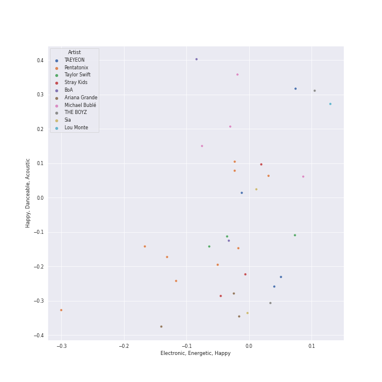
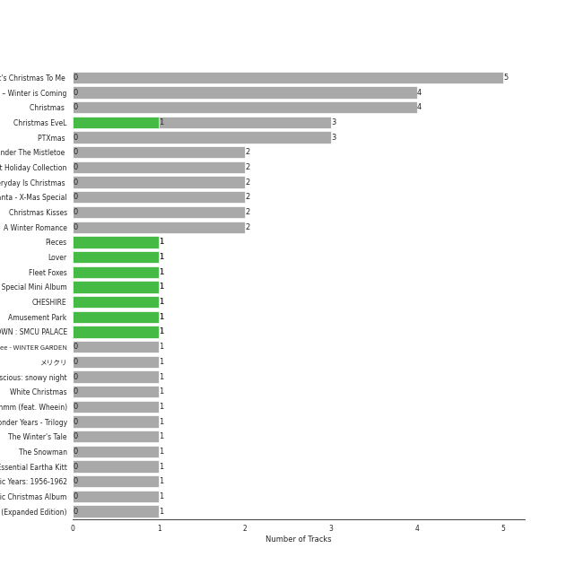
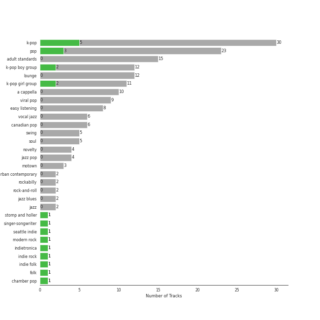
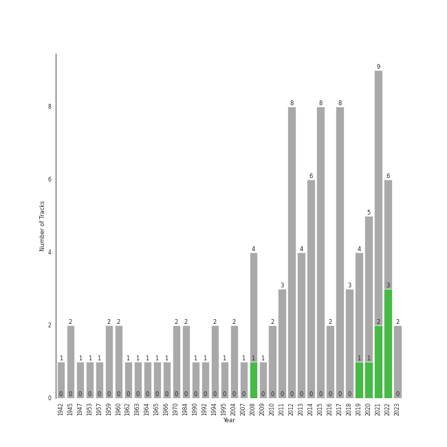

# Christmas

[99 songs (8 liked)](tracks.md)

[See Track Features](audio_features.md)

[See Clusters](clusters/overview.md)

## Top Artists

| Art | Tracks | 💚 | Artist | 🔗 |
|:---|---:|---:|:---|:---|
|  | 3 | 1 | [Stray Kids](../../artists/stray_kids/overview.md) | [🔗](https://open.spotify.com/artist/2dIgFjalVxs4ThymZ67YCE) |
|  | 3 | 1 | [Taylor Swift](../../artists/taylor_swift/overview.md) | [🔗](https://open.spotify.com/artist/06HL4z0CvFAxyc27GXpf02) |
|  | 2 | 1 | [LeeHi](../../artists/leehi/overview.md) | [🔗](https://open.spotify.com/artist/7cVZApDoQZpS447nHTsNqu) |
|  | 2 | 1 | [IU](../../artists/iu/overview.md) | [🔗](https://open.spotify.com/artist/3HqSLMAZ3g3d5poNaI7GOU) |
|  | 2 | 1 | [Red Velvet](../../artists/red_velvet/overview.md) | [🔗](https://open.spotify.com/artist/1z4g3DjTBBZKhvAroFlhOM) |
|  | 2 | 1 | [NCT DREAM](../../artists/nct_dream/overview.md) | [🔗](https://open.spotify.com/artist/1gBUSTR3TyDdTVFIaQnc02) |
|  | 1 | 1 | Crush | [🔗](https://open.spotify.com/artist/6aLdhHUqgdKE86xbtNmY8g) |
|  | 1 | 1 | [aespa](../../artists/aespa/overview.md) | [🔗](https://open.spotify.com/artist/6YVMFz59CuY7ngCxTxjpxE) |
|  | 1 | 1 | [BAEKHYUN](../../artists/baekhyun/overview.md) | [🔗](https://open.spotify.com/artist/4ufh0WuMZh6y4Dmdnklvdl) |
|  | 1 | 1 | [ITZY](../../artists/itzy/overview.md) | [🔗](https://open.spotify.com/artist/2KC9Qb60EaY0kW4eH68vr3) |

See all 88 artists

| Art | Tracks | 💚 | Artist | 🔗 |
|:---|---:|---:|:---|:---|
|  | 9 | 0 | [Pentatonix](../../artists/pentatonix/overview.md) | [🔗](https://open.spotify.com/artist/26AHtbjWKiwYzsoGoUZq53) |
|  | 5 | 0 | [Michael Bublé](../../artists/michael_bubl_/overview.md) | [🔗](https://open.spotify.com/artist/1GxkXlMwML1oSg5eLPiAz3) |
|  | 4 | 0 | [TAEYEON](../../artists/taeyeon/overview.md) | [🔗](https://open.spotify.com/artist/3qNVuliS40BLgXGxhdBdqu) |
|  | 3 | 0 | [Ariana Grande](../../artists/ariana_grande/overview.md) | [🔗](https://open.spotify.com/artist/66CXWjxzNUsdJxJ2JdwvnR) |
|  | 3 | 0 | [EXO](../../artists/exo/overview.md) | [🔗](https://open.spotify.com/artist/3cjEqqelV9zb4BYE3qDQ4O) |
|  | 2 | 0 | Lou Monte | [🔗](https://open.spotify.com/artist/7dbKeVkihtOifdiu7f3rUg) |
|  | 2 | 0 | Girls' Generation-TTS | [🔗](https://open.spotify.com/artist/7AKHnZVqwXYuUwWJ8UGL5q) |
|  | 2 | 0 | Bing Crosby | [🔗](https://open.spotify.com/artist/6ZjFtWeHP9XN7FeKSUe80S) |
|  | 2 | 0 | Ella Fitzgerald | [🔗](https://open.spotify.com/artist/5V0MlUE1Bft0mbLlND7FJz) |
|  | 2 | 0 | BoA | [🔗](https://open.spotify.com/artist/4muJrGMndyYWqZtfk8OWy4) |
|  | 2 | 0 | Mariah Carey | [🔗](https://open.spotify.com/artist/4iHNK0tOyZPYnBU7nGAgpQ) |
|  | 2 | 0 | Dean Martin | [🔗](https://open.spotify.com/artist/49e4v89VmlDcFCMyDv9wQ9) |
|  | 2 | 0 | AILEE | [🔗](https://open.spotify.com/artist/3uGFTJ7JMllvhgGpumieHF) |
|  | 2 | 0 | [BTS](../../artists/bts/overview.md) | [🔗](https://open.spotify.com/artist/3Nrfpe0tUJi4K4DXYWgMUX) |
|  | 2 | 0 | The Jackson 5 | [🔗](https://open.spotify.com/artist/2iE18Oxc8YSumAU232n4rW) |
|  | 2 | 0 | Justin Bieber | [🔗](https://open.spotify.com/artist/1uNFoZAHBGtllmzznpCI3s) |
|  | 2 | 0 | [Frank Sinatra](../../artists/frank_sinatra/overview.md) | [🔗](https://open.spotify.com/artist/1Mxqyy3pSjf8kZZL4QVxS0) |
|  | 2 | 0 | THE BOYZ | [🔗](https://open.spotify.com/artist/0CmvFWTX9zmMNCUi6fHtAx) |
|  | 2 | 0 | Whee In | [🔗](https://open.spotify.com/artist/0BqRGrwqndrtNkojXiqIzL) |
|  | 1 | 0 | Nat King Cole | [🔗](https://open.spotify.com/artist/7v4imS0moSyGdXyLgVTIV7) |
|  | 1 | 0 | Basick | [🔗](https://open.spotify.com/artist/7pXKdkQsYFCMG2omRxheJ2) |
|  | 1 | 0 | Liz Gillies | [🔗](https://open.spotify.com/artist/7pLntWGInZPQxc4kXxzzjB) |
|  | 1 | 0 | [TWICE](../../artists/twice/overview.md) | [🔗](https://open.spotify.com/artist/7n2Ycct7Beij7Dj7meI4X0) |
|  | 1 | 0 | The Ronettes | [🔗](https://open.spotify.com/artist/7CyeXFnOrfC1N6z4naIpgo) |
|  | 1 | 0 | Seth MacFarlane | [🔗](https://open.spotify.com/artist/79D4dipwR6scV8AN3dm7gW) |
|  | 1 | 0 | Idina Menzel | [🔗](https://open.spotify.com/artist/73Np75Wv2tju61Eo9Zw4IR) |
|  | 1 | 0 | John Scott Trotter & His Orchestra | [🔗](https://open.spotify.com/artist/735L650pvygCZZlPMyHqsN) |
|  | 1 | 0 | Bob Brown | [🔗](https://open.spotify.com/artist/6xWlMtfrZNsW7ZRMxQLqxw) |
|  | 1 | 0 | Madonna | [🔗](https://open.spotify.com/artist/6tbjWDEIzxoDsBA1FuhfPW) |
|  | 1 | 0 | CHENLE | [🔗](https://open.spotify.com/artist/6mt12wGFaBAJPjK076GOJz) |
|  | 1 | 0 | Mykola Dmytrovych Leontovych | [🔗](https://open.spotify.com/artist/6lBN3Tzt61u8i9AJoAhKzF) |
|  | 1 | 0 | Johnny Marks | [🔗](https://open.spotify.com/artist/6UdAtUl2rb8AxzQ6uQRhzC) |
|  | 1 | 0 | [IVE](../../artists/ive/overview.md) | [🔗](https://open.spotify.com/artist/6RHTUrRF63xao58xh9FXYJ) |
|  | 1 | 0 | Meghan Trainor | [🔗](https://open.spotify.com/artist/6JL8zeS1NmiOftqZTRgdTz) |
|  | 1 | 0 | Ken Darby Singers | [🔗](https://open.spotify.com/artist/69UfPJgUmFFAVT740qGVZi) |
|  | 1 | 0 | Louis Jordan & His Tympany Five | [🔗](https://open.spotify.com/artist/62FPyLpIhmk27hBw6RHlhh) |
|  | 1 | 0 | John Legend | [🔗](https://open.spotify.com/artist/5y2Xq6xcjJb2jVM54GHK3t) |
|  | 1 | 0 | NINGNING | [🔗](https://open.spotify.com/artist/5t1uryofgueHrjrryqX8vM) |
|  | 1 | 0 | Lawrence | [🔗](https://open.spotify.com/artist/5rwUYLyUq8gBsVaOUcUxpE) |
|  | 1 | 0 | Wham! | [🔗](https://open.spotify.com/artist/5lpH0xAS4fVfLkACg9DAuM) |
|  | 1 | 0 | Gene Autry | [🔗](https://open.spotify.com/artist/5ixB75BQR3ADoWQkcHQJTs) |
|  | 1 | 0 | Bjørn Breistein | [🔗](https://open.spotify.com/artist/5RcdEOFhEHcJUuxwKGubm4) |
|  | 1 | 0 | Thurl Ravenscroft | [🔗](https://open.spotify.com/artist/5Gejwv3xz2DpLcxVpMD6hL) |
|  | 1 | 0 | Stolen Jars | [🔗](https://open.spotify.com/artist/5EAJ2dKLdisq7BOJHQ1B7r) |
|  | 1 | 0 | Chundung | [🔗](https://open.spotify.com/artist/52KEoFZCGGap8hZHtOgENt) |
|  | 1 | 0 | Nile Lee | [🔗](https://open.spotify.com/artist/52FvIIUS7sLLUn2mZEjWa8) |
|  | 1 | 0 | YERI | [🔗](https://open.spotify.com/artist/4xzwjGxzfKglU0cNW4q4l1) |
|  | 1 | 0 | Jan Utbult | [🔗](https://open.spotify.com/artist/4cdzuhtmHpWvdn1nXn2Aga) |
|  | 1 | 0 | Brenda Lee | [🔗](https://open.spotify.com/artist/4cPHsZM98sKzmV26wlwD2W) |
|  | 1 | 0 | Fleet Foxes | [🔗](https://open.spotify.com/artist/4EVpmkEwrLYEg6jIsiPMIb) |
|  | 1 | 0 | Elvis Presley | [🔗](https://open.spotify.com/artist/43ZHCT0cAZBISjO8DG9PnE) |
|  | 1 | 0 | Jyp Nation | [🔗](https://open.spotify.com/artist/422bFDqxTIZF6HrsneK0xO) |
|  | 1 | 0 | Dorothy Kirsten | [🔗](https://open.spotify.com/artist/3mMDsLh0ODpEuwpvn9sitk) |
|  | 1 | 0 | John Williams | [🔗](https://open.spotify.com/artist/3dRfiJ2650SZu6GbydcHNb) |
|  | 1 | 0 | Elmo & Patsy | [🔗](https://open.spotify.com/artist/3Ubvmshojm0HJHWWr4C6GF) |
|  | 1 | 0 | Peter Auty | [🔗](https://open.spotify.com/artist/3CECMsOPoB4JSPZYFrtVaZ) |
|  | 1 | 0 | Kelly Clarkson | [🔗](https://open.spotify.com/artist/3BmGtnKgCSGYIUhmivXKWX) |
|  | 1 | 0 | Bobby Helms | [🔗](https://open.spotify.com/artist/38EmEgXkgK51MT2tPY0EoC) |
|  | 1 | 0 | Sam Smith | [🔗](https://open.spotify.com/artist/2wY79sveU1sp5g7SokKOiI) |
|  | 1 | 0 | Joe Reisman's Orchestra and Chorus | [🔗](https://open.spotify.com/artist/2qkfMoOIz3BqLD91C1B09a) |
|  | 1 | 0 | BTOB | [🔗](https://open.spotify.com/artist/2hcsKca6hCfFMwwdbFvenJ) |
|  | 1 | 0 | LUNCH | [🔗](https://open.spotify.com/artist/2UVzzx3MOPYV3l6xW2lzBv) |
|  | 1 | 0 | [Sara Bareilles](../../artists/sara_bareilles/overview.md) | [🔗](https://open.spotify.com/artist/2Sqr0DXoaYABbjBo9HaMkM) |
|  | 1 | 0 | [Billlie](../../artists/billlie/overview.md) | [🔗](https://open.spotify.com/artist/2GQxKDojobwBjZMPf7aoh0) |
|  | 1 | 0 | Straight No Chaser | [🔗](https://open.spotify.com/artist/1yQ8S4xdGOGbUcpaPR6hCM) |
|  | 1 | 0 | The Puppini Sisters | [🔗](https://open.spotify.com/artist/1svaANJTE5KrG16fTGDqOs) |
|  | 1 | 0 | Gayla Peevey | [🔗](https://open.spotify.com/artist/1suIIDedjFJRuu8k7b55hZ) |
|  | 1 | 0 | JISUNG | [🔗](https://open.spotify.com/artist/1rKOAlZ7iAHynESWTeSNwl) |
|  | 1 | 0 | HAECHAN | [🔗](https://open.spotify.com/artist/1pHMYguhayIoXmPjoOUyu3) |
|  | 1 | 0 | Fifth Harmony | [🔗](https://open.spotify.com/artist/1l8Fu6IkuTP0U5QetQJ5Xt) |
|  | 1 | 0 | Jay JungJae Moon | [🔗](https://open.spotify.com/artist/1j4rZondz64yRVHSGllqL6) |
|  | 1 | 0 | Boris Karloff | [🔗](https://open.spotify.com/artist/1W9sjfsJp3TqWFgvScMZdG) |
|  | 1 | 0 | Eartha Kitt | [🔗](https://open.spotify.com/artist/1AwO9pWEBSBoWdEZu28XDC) |
|  | 1 | 0 | Noteservice Wind Band | [🔗](https://open.spotify.com/artist/10h0cqlZG7HJ4PQ9N5tzJd) |
|  | 1 | 0 | Brett Eldredge | [🔗](https://open.spotify.com/artist/0qSX3s5pJnAlSsgsCne8Cz) |
|  | 1 | 0 | Burl Ives | [🔗](https://open.spotify.com/artist/0MHgLfmQdutffmvWe5XBTN) |
|  | 1 | 0 | B. Swanson Quartet | [🔗](https://open.spotify.com/artist/0JXiS2FrAg3wQYJHcmZdrc) |
|  | 1 | 0 | [WENDY](../../artists/wendy/overview.md) | [🔗](https://open.spotify.com/artist/0FRUZvZNPzM3YJMABJxf2K) |

## Top Albums

| Art | Tracks | 💚 | Album | Release Date | 🔗 |
|:---|---:|---:|:---|:---|:---|
|  | 5 | 0 | That's Christmas To Me (Deluxe Edition) | 2015-10-30 | [🔗](https://open.spotify.com/album/082VlX7cBth0o8xqDGclNn) |
|  | 4 | 0 | This Christmas – Winter is Coming | 2017-12-12 | [🔗](https://open.spotify.com/album/1U3KyC9Key12NSi9ETVExx) |
|  | 4 | 0 | Christmas (Deluxe Special Edition) | 2012-11-09 | [🔗](https://open.spotify.com/album/7uVimUILdzSZG4KKKWToq0) |
|  | 3 | 1 | Christmas EveL | 2021-11-29 | [🔗](https://open.spotify.com/album/1qVuQI0WRn2Mczbdxx54Ih) |
|  | 3 | 0 | PTXmas (Deluxe Edition) | 2012-11-12 | [🔗](https://open.spotify.com/album/5ZwH7KH8Zw0m76hYwANMos) |
|  | 2 | 0 | Under The Mistletoe (Deluxe Edition) | 2011-01-01 | [🔗](https://open.spotify.com/album/63MKT9hwmiMFFdFp5SdB1p) |
|  | 2 | 0 | The Taylor Swift Holiday Collection | 2008-12-02 | [🔗](https://open.spotify.com/album/7vzYp7FrKnTRoktBYsx9SF) |
|  | 2 | 0 | Dear Santa - X-Mas Special | 2015-12-04 | [🔗](https://open.spotify.com/album/0OES8nSgtEOXl1RgmXMkrj) |
|  | 2 | 0 | Christmas Kisses | 2013-01-01 | [🔗](https://open.spotify.com/album/5MfeQZrrNfMqcaq03U9qOr) |
|  | 2 | 0 | A Winter Romance | 1959-01-01 | [🔗](https://open.spotify.com/album/5I48ENiZiaZZSOpec6PdS5) |

See all 80 albums

| Art | Tracks | 💚 | Album | Release Date | 🔗 |
|:---|---:|---:|:---|:---|:---|
|  | 1 | 1 | Pieces | 2021-12-29 | [🔗](https://open.spotify.com/album/3ivhPVStd9RrtczBFwjkMQ) |
|  | 1 | 1 | Lover | 2019-08-23 | [🔗](https://open.spotify.com/album/1NAmidJlEaVgA3MpcPFYGq) |
|  | 1 | 1 | For You | 2020-12-16 | [🔗](https://open.spotify.com/album/6hiwkmlOoNm8F3UkAZJcEz) |
|  | 1 | 1 | Candy - Winter Special Mini Album | 2022-12-16 | [🔗](https://open.spotify.com/album/6lqazNXadymQLwUh41qW2K) |
|  | 1 | 1 | CHESHIRE | 2022-11-30 | [🔗](https://open.spotify.com/album/2a1ezg7hE6Dyuymv1aCnkm) |
|  | 1 | 1 | Amusement Park | 2020-12-21 | [🔗](https://open.spotify.com/album/1azcqabc4kDgRNMWFA02wZ) |
|  | 1 | 1 | 2022 Winter SMTOWN : SMCU PALACE | 2022-12-26 | [🔗](https://open.spotify.com/album/1HwnXJfZx8N8qDfzwUbxcw) |
|  | 1 | 0 | 세가지 소원 Wish Tree - WINTER GARDEN | 2015-12-18 | [🔗](https://open.spotify.com/album/69a7YNzhApHfLFwHvPkCso) |
|  | 1 | 0 | メリクリ | 2004-12-01 | [🔗](https://open.spotify.com/album/082g95CJ0YhcNAjxf2MMgT) |
|  | 1 | 0 | the collective soul and unconscious: snowy night | 2021-12-14 | [🔗](https://open.spotify.com/album/1wFkvpm5VhzNDNo8xqdBV1) |
|  | 1 | 0 | White Christmas | 1945-01-01 | [🔗](https://open.spotify.com/album/42KK3F8HTm1dyv5iFsCXdw) |
|  | 1 | 0 | When It Snows mmm (feat. Wheein) | 2020-12-23 | [🔗](https://open.spotify.com/album/5z8FBqt7BCXR6MB5fzy7L3) |
|  | 1 | 0 | This Christmas - Single | 2010-12-01 | [🔗](https://open.spotify.com/album/6NbYu2rBvmgYXjYe0rLCPQ) |
|  | 1 | 0 | The Winter's Tale | 2014-12-22 | [🔗](https://open.spotify.com/album/1WrPy47aE3pCJvrHYjJ33v) |
|  | 1 | 0 | The Snowman | 2007-11-23 | [🔗](https://open.spotify.com/album/2FcJpDHg4WaTcmqtPzJeuF) |
|  | 1 | 0 | The Essential Eartha Kitt | 2011-03-15 | [🔗](https://open.spotify.com/album/3YYxlTrYciDHu3j7E5wGrZ) |
|  | 1 | 0 | The Classic Years: 1956-1962 | 1992-01-01 | [🔗](https://open.spotify.com/album/7yeVUGG3xvGjKwhM2FBItZ) |
|  | 1 | 0 | The Classic Christmas Album | 1945 | [🔗](https://open.spotify.com/album/2B9FcHKqz3PWJlh0yGnmM7) |
|  | 1 | 0 | The Christmas Song (Expanded Edition) | 1962 | [🔗](https://open.spotify.com/album/6vBGI5522jvPi0ZZuGQNp4) |
|  | 1 | 0 | THE BOYZ Special Single [Candles] | 2021-12-06 | [🔗](https://open.spotify.com/album/0kIrSdkjAIqiQ8yhXyrtun) |
|  | 1 | 0 | THE BOYZ Special Single 'Christmassy!' | 2020-12-07 | [🔗](https://open.spotify.com/album/5KR9XuMapeh6JjUdcy4MHM) |
|  | 1 | 0 | Spotify Singles - Holiday | 2021-11-17 | [🔗](https://open.spotify.com/album/5AVL4k3pesuk0jRkTeCOSm) |
|  | 1 | 0 | Spotify Singles - Holiday | 2022-11-16 | [🔗](https://open.spotify.com/album/6LNdcxlSXwXv2UFKQ3pvMk) |
|  | 1 | 0 | Solo Christmas | 2021-12-11 | [🔗](https://open.spotify.com/album/3GnhJ2bDR3nR95f0y4UV5h) |
|  | 1 | 0 | Silent Night | 2020-12-04 | [🔗](https://open.spotify.com/album/2PE8nbVNmtWgs8jzgxuRJI) |
|  | 1 | 0 | Santa Tell Me | 2014-11-24 | [🔗](https://open.spotify.com/album/27MNgBEnLCKoafz1g2Zu97) |
|  | 1 | 0 | Santa Bring Me a Dinosaur | 2022-06-04 | [🔗](https://open.spotify.com/album/1S8Ej8L03FyDL9C935ANtN) |
|  | 1 | 0 | Rudolph The Red Nosed Reindeer And Other Christmas Classics | 1947 | [🔗](https://open.spotify.com/album/3BPDSjoJlho8oiUPUNrShM) |
|  | 1 | 0 | REAL | 2010-12-09 | [🔗](https://open.spotify.com/album/4WY1pPvmP9sBlVICuPxBQh) |
|  | 1 | 0 | Noelle (Original Motion Picture Soundtrack) | 2019-11-12 | [🔗](https://open.spotify.com/album/7GZR54Ir7Aq5T34aRhJQfw) |
|  | 1 | 0 | Mr. Santa | 2020-11-27 | [🔗](https://open.spotify.com/album/1ZJDN26GeLf0BznSW8VBe5) |
|  | 1 | 0 | Miracles in December (Chinese Version) | 2013-12-09 | [🔗](https://open.spotify.com/album/1sCdc23CN31bqyJq7rSXHJ) |
|  | 1 | 0 | Miracles in December | 2013-12-09 | [🔗](https://open.spotify.com/album/7xKAWXGHTlXovWpEVu1csM) |
|  | 1 | 0 | Merry-Chri | 2004-12-01 | [🔗](https://open.spotify.com/album/4oqQrLd2zP701hWtcGx0Vr) |
|  | 1 | 0 | Merry Christmas From Brenda Lee | 1964-10-19 | [🔗](https://open.spotify.com/album/34wa3zf2prXFMk47t9zHFG) |
|  | 1 | 0 | Merry Christmas | 1994-10-28 | [🔗](https://open.spotify.com/album/61ulfFSmmxMhc2wCdmdMkN) |
|  | 1 | 0 | Merry & Happy | 2017-12-11 | [🔗](https://open.spotify.com/album/0R7pj4tnmcoUulrZGPo6nw) |
|  | 1 | 0 | Lime Tree Islet - New Music for Flexible Instrumentation - Demo Tracks 2017-2018 | 2017-06-30 | [🔗](https://open.spotify.com/album/0QCR8e3LHWjNKZm9aCKod9) |
|  | 1 | 0 | LAST CHRISTMAS | 1984-11-29 | [🔗](https://open.spotify.com/album/6egzU9NKfora01qaNbvwfZ) |
|  | 1 | 0 | Jackson Five Christmas Album | 1970-01-01 | [🔗](https://open.spotify.com/album/6J7kk80VywP59lPn8E5Cal) |
|  | 1 | 0 | JOY - SM STATION | 2017-12-15 | [🔗](https://open.spotify.com/album/5UkUr57L6X1gopnzG1dyBa) |
|  | 1 | 0 | I Want a Hippopotamus for Christmas (Hippo the Hero) | 1953-11-11 | [🔗](https://open.spotify.com/album/0nuyFYoBsK4Z1j3DimhUZ4) |
|  | 1 | 0 | Home Alone (Original Motion Picture Soundtrack) [Anniversary Edition] | 1990 | [🔗](https://open.spotify.com/album/3rDo7fQDUwJ6qmxwP5yQsY) |
|  | 1 | 0 | Holiday Wishes | 2014-10-10 | [🔗](https://open.spotify.com/album/0EGX5qfw6VEPOMoCUFJFHl) |
|  | 1 | 0 | Holiday Inn (Original Motion Picture Soundtrack) | 1942-01-01 | [🔗](https://open.spotify.com/album/4ZZvKnA1YJ2KcwjMmHBinq) |
|  | 1 | 0 | Holiday For Swing! | 2014-09-30 | [🔗](https://open.spotify.com/album/1oPkmzcGvZT9Q32eLLjIS4) |
|  | 1 | 0 | Have Yourself A Merry Little Christmas - SM STATION | 2016-12-23 | [🔗](https://open.spotify.com/album/3bxhc60UWLrymlDVA21vy2) |
|  | 1 | 0 | Have Yourself A Merry Little Christmas | 2014-12-05 | [🔗](https://open.spotify.com/album/3nCpXy6LlyXWuFR08tMycK) |
|  | 1 | 0 | Have A Holly Jolly Christmas | 1965-01-01 | [🔗](https://open.spotify.com/album/5r5iTtNflB2DAKO1t5ih8f) |
|  | 1 | 0 | Grandma Got Run Over By A Reindeer | 1984 | [🔗](https://open.spotify.com/album/1Yb2OydAnf7uyfKeNs7awC) |
|  | 1 | 0 | Glow | 2016-10-28 | [🔗](https://open.spotify.com/album/6FjK2XLQJloz36NgRciCHv) |
|  | 1 | 0 | Fleet Foxes | 2008-06-03 | [🔗](https://open.spotify.com/album/6XzZ5pg9buAKNYg293KOQ8) |
|  | 1 | 0 | Fairytale of New York | 2017-11-24 | [🔗](https://open.spotify.com/album/1gknqNegsva4cyjTlrXDps) |
|  | 1 | 0 | Elvis' Christmas Album | 1957-10-15 | [🔗](https://open.spotify.com/album/6zk4RKl6JFlgLCV4Z7DQ7N) |
|  | 1 | 0 | Ella: The Legendary Decca Recordings | 1995-08-29 | [🔗](https://open.spotify.com/album/0G5ZHFj5VmvIWEAuF8NEIT) |
|  | 1 | 0 | Ella Wishes You A Swinging Christmas (Expanded Edition) | 1960-01-01 | [🔗](https://open.spotify.com/album/2UhPCUgK2IGUrg7lIvMYfb) |
|  | 1 | 0 | Dynamite (Holiday Remix) | 2020-12-11 | [🔗](https://open.spotify.com/album/3HVNK5OxW9qfkySXjHWehH) |
|  | 1 | 0 | Dr. Seuss' How The Grinch Stole Christmas! (Original TV Soundtrack) | 1966-12-18 | [🔗](https://open.spotify.com/album/6P62c1CkC8iNejWXQGegDQ) |
|  | 1 | 0 | Dominick the Donkey | 1960-01-01 | [🔗](https://open.spotify.com/album/45pkOGp28EtHgpp9ZTo1Ss) |
|  | 1 | 0 | Christmas Songs by Sinatra | 1994-11-08 | [🔗](https://open.spotify.com/album/4XbPmVHP7EYBMoE7ZVjKCU) |
|  | 1 | 0 | Christmas Is Here! | 2018-10-19 | [🔗](https://open.spotify.com/album/6thZNGX8hUVSjUrqJgPB9b) |
|  | 1 | 0 | Christmas Cheers (Deluxe) | 2009-11-02 | [🔗](https://open.spotify.com/album/2M5NEqQVs7kIit8QbtXrRs) |
|  | 1 | 0 | Christmas Album | 1970-10-15 | [🔗](https://open.spotify.com/album/5M8U1qYKvRQHJJVHmPY7QD) |
|  | 1 | 0 | Butter (Holiday Remix) | 2021-12-03 | [🔗](https://open.spotify.com/album/4cmHvSMDrSRe2sLodew8sV) |
|  | 1 | 0 | All I Want for Christmas Is You | 2014-11-17 | [🔗](https://open.spotify.com/album/4oaGmvBfraPK3deWpySwJm) |
|  | 1 | 0 | A Very Special Christmas | 1987-10-20 | [🔗](https://open.spotify.com/album/06H9y3oBVGgYQ0McDsCYX4) |
|  | 1 | 0 | A Legendary Christmas: Deluxe Edition | 2019-11-08 | [🔗](https://open.spotify.com/album/3wanKGZXsWXr6ZKdQrDtGu) |
|  | 1 | 0 | A Christmas Gift For You From Phil Spector | 1963 | [🔗](https://open.spotify.com/album/2kzkwgOFAtRsDsas5Hi0Qu) |
|  | 1 | 0 | 2021 Winter SMTOWN : SMCU EXPRESS | 2021-12-27 | [🔗](https://open.spotify.com/album/3dn2in6doTc6zfA0G2UFDZ) |
|  | 1 | 0 | 12월의 기적 Miracles in December | 2013-12-09 | [🔗](https://open.spotify.com/album/7taKyOK4LYB8uEDoR0x2NQ) |

## Top Record Labels

| Tracks | 💚 | Label |
|---:|---:|:---|
| 17 | 3 | [SM Entertainment](../../labels/sm_entertainment/overview.md) |
| 5 | 2 | [Republic Records](../../labels/republic_records/overview.md) |
| 1 | 1 | [Taylor Swift](../../labels/taylor_swift/overview.md) |
| 1 | 1 | EDAM Entertainment |
| 1 | 1 | AOMG |
| 9 | 0 | [RCA Records Label](../../labels/rca_records_label/overview.md) |
| 5 | 0 | [Columbia](../../labels/columbia/overview.md) |
| 4 | 0 | [Reprise](../../labels/reprise/overview.md) |
| 4 | 0 | [Geffen](../../labels/geffen/overview.md) |
| 4 | 0 | [143](../../labels/143/overview.md) |

See all 54 labels

| Tracks | 💚 | Label |
|---:|---:|:---|
| 3 | 0 | [WM Korea](../../labels/wm_korea/overview.md) |
| 3 | 0 | [Universal Music LLC](../../labels/universal_music_llc/overview.md) |
| 3 | 0 | [Legacy](../../labels/legacy/overview.md) |
| 3 | 0 | [Epic](../../labels/epic/overview.md) |
| 3 | 0 | [Capitol Records](../../labels/capitol_records/overview.md) |
| 2 | 0 | [Warner Music Group - X5 Music Group](../../labels/warner_music_group___x5_music_group/overview.md) |
| 2 | 0 | Verve Reissues |
| 2 | 0 | [UNI](../../labels/uni/overview.md) |
| 2 | 0 | RBMG |
| 2 | 0 | [MOTOWN](../../labels/motown/overview.md) |
| 2 | 0 | Legacy Recordings |
| 2 | 0 | Def Jam |
| 2 | 0 | [Big Machine Records](../../labels/big_machine_records/overview.md) |
| 2 | 0 | [BIGHIT MUSIC](../../labels/bighit_music/overview.md) |
| 1 | 0 | avex trax |
| 1 | 0 | WaterTower Music |
| 1 | 0 | [Warner Records](../../labels/warner_records/overview.md) |
| 1 | 0 | [Walt Disney Records](../../labels/walt_disney_records/overview.md) |
| 1 | 0 | [Syco Music](../../labels/syco_music/overview.md) |
| 1 | 0 | Sun and Sky Records |
| 1 | 0 | Sub Pop Records |
| 1 | 0 | [Stone Music Entertainment](../../labels/stone_music_entertainment/overview.md) |
| 1 | 0 | [Starship Entertainment](../../labels/starship_entertainment/overview.md) |
| 1 | 0 | Sony Music Entertainment |
| 1 | 0 | Sony Music CG |
| 1 | 0 | Seth Macfarlane Christmas Album |
| 1 | 0 | RCA Victor |
| 1 | 0 | Norsk Noteservice |
| 1 | 0 | Masterworks |
| 1 | 0 | [MYSTIC STORY](../../labels/mystic_story/overview.md) |
| 1 | 0 | MCA Nashville |
| 1 | 0 | Little Possum |
| 1 | 0 | [Kakao Entertainment](../../labels/kakao_entertainment/overview.md) |
| 1 | 0 | [JYP Entertainment](../../labels/jyp_entertainment/overview.md) |
| 1 | 0 | IST ENTERTAINMENT |
| 1 | 0 | [HYBE](../../labels/hybe/overview.md) |
| 1 | 0 | [Genie Music Corporation](../../labels/genie_music_corporation/overview.md) |
| 1 | 0 | Cre.ker Entertainment |
| 1 | 0 | [CUBE ENTERTAINMENT](../../labels/cube_entertainment/overview.md) |
| 1 | 0 | CAPITOL CATALOG MKT (C92) |
| 1 | 0 | [Atlantic Records](../../labels/atlantic_records/overview.md) |
| 1 | 0 | Atlantic Nashville |
| 1 | 0 | Atco |
| 1 | 0 | A&M |

## Genres

| Tracks | 💚 | Genre |
|---:|---:|:---|
| 34 | 7 | [k-pop](../../genres/k_pop/overview.md) |
| 21 | 3 | [pop](../../genres/pop/overview.md) |
| 13 | 2 | [k-pop boy group](../../genres/k_pop_boy_group/overview.md) |
| 7 | 2 | [k-pop girl group](../../genres/k_pop_girl_group/overview.md) |
| 14 | 0 | [adult standards](../../genres/adult_standards/overview.md) |
| 12 | 0 | lounge |
| 10 | 0 | [a cappella](../../genres/a_cappella/overview.md) |
| 9 | 0 | [viral pop](../../genres/viral_pop/overview.md) |
| 7 | 0 | easy listening |
| 6 | 0 | vocal jazz |

See all 61 genres

| Tracks | 💚 | Genre |
|---:|---:|:---|
| 6 | 0 | canadian pop |
| 5 | 0 | soul |
| 4 | 0 | novelty |
| 4 | 0 | jazz pop |
| 3 | 0 | swing |
| 3 | 0 | motown |
| 2 | 0 | urban contemporary |
| 2 | 0 | rockabilly |
| 2 | 0 | rock-and-roll |
| 2 | 0 | movie tunes |
| 2 | 0 | jazz blues |
| 2 | 0 | jazz |
| 2 | 0 | [dance pop](../../genres/dance_pop/overview.md) |
| 1 | 0 | yodeling |
| 1 | 0 | ukrainian classical |
| 1 | 0 | uk pop |
| 1 | 0 | traditional country |
| 1 | 0 | torch song |
| 1 | 0 | talent show |
| 1 | 0 | synthpop |
| 1 | 0 | stomp and holler |
| 1 | 0 | [soft rock](../../genres/soft_rock/overview.md) |
| 1 | 0 | [singer-songwriter](../../genres/singer_songwriter/overview.md) |
| 1 | 0 | show tunes |
| 1 | 0 | seattle indie |
| 1 | 0 | retro soul |
| 1 | 0 | post-romantic era |
| 1 | 0 | pop soul |
| 1 | 0 | nyc pop |
| 1 | 0 | new wave pop |
| 1 | 0 | new wave |
| 1 | 0 | new romantic |
| 1 | 0 | neo soul |
| 1 | 0 | [modern rock](../../genres/modern_rock/overview.md) |
| 1 | 0 | modern country rock |
| 1 | 0 | k-rap |
| 1 | 0 | indietronica |
| 1 | 0 | indie rock |
| 1 | 0 | hollywood |
| 1 | 0 | girl group |
| 1 | 0 | folk |
| 1 | 0 | cowboy western |
| 1 | 0 | country road |
| 1 | 0 | country |
| 1 | 0 | contemporary country |
| 1 | 0 | classic oklahoma country |
| 1 | 0 | classic girl group |
| 1 | 0 | chamber pop |
| 1 | 0 | brill building pop |
| 1 | 0 | boy soprano |
| 1 | 0 | american folk revival |

## Years

| ​ | 10 newest albums | ​​ | 10 oldest albums |
|:---|:---|:---|:---|
|  | 2022 Winter SMTOWN : SMCU PALACE (2022-12-26) |  | Holiday Inn (Original Motion Picture Soundtrack) (1942-01-01) |
|  | Candy - Winter Special Mini Album (2022-12-16) |  | The Classic Christmas Album (1945) |
|  | CHESHIRE (2022-11-30) |  | White Christmas (1945-01-01) |
|  | Spotify Singles - Holiday (2022-11-16) |  | Rudolph The Red Nosed Reindeer And Other Christmas Classics (1947) |
|  | Santa Bring Me a Dinosaur (2022-06-04) |  | I Want a Hippopotamus for Christmas (Hippo the Hero) (1953-11-11) |
|  | Pieces (2021-12-29) |  | Elvis' Christmas Album (1957-10-15) |
|  | 2021 Winter SMTOWN : SMCU EXPRESS (2021-12-27) |  | A Winter Romance (1959-01-01) |
|  | the collective soul and unconscious: snowy night (2021-12-14) |  | Ella Wishes You A Swinging Christmas (Expanded Edition) (1960-01-01) |
|  | Solo Christmas (2021-12-11) |  | Dominick the Donkey (1960-01-01) |
|  | THE BOYZ Special Single [Candles] (2021-12-06) |  | The Christmas Song (Expanded Edition) (1962) |