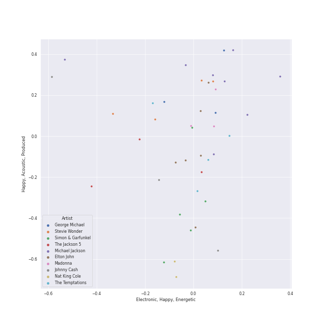

# Classic Pop

[56 songs](classic_pop_tracks.md)

## Top Artists

See all 25 artists

|   Number of Tracks | Art                                                                                              | Artist            | 🔗                                                           |
|-------------------:|:-------------------------------------------------------------------------------------------------|:------------------|:------------------------------------------------------------|
|                  8 |  | Michael Jackson   | [🔗](https://open.spotify.com/artist/3fMbdgg4jU18AjLCKBhRSm) |
|                  6 |  | Elton John        | [🔗](https://open.spotify.com/artist/3PhoLpVuITZKcymswpck5b) |
|                  5 |  | Simon & Garfunkel | [🔗](https://open.spotify.com/artist/70cRZdQywnSFp9pnc2WTCE) |
|                  4 |  | Stevie Wonder     | [🔗](https://open.spotify.com/artist/7guDJrEfX3qb6FEbdPA5qi) |
|                  4 |  | The Temptations   | [🔗](https://open.spotify.com/artist/3RwQ26hR2tJtA8F9p2n7jG) |
|                  3 |  | Madonna           | [🔗](https://open.spotify.com/artist/6tbjWDEIzxoDsBA1FuhfPW) |
|                  3 |  | Johnny Cash       | [🔗](https://open.spotify.com/artist/6kACVPfCOnqzgfEF5ryl0x) |
|                  3 |  | The Jackson 5     | [🔗](https://open.spotify.com/artist/2iE18Oxc8YSumAU232n4rW) |
|                  3 |  | George Michael    | [🔗](https://open.spotify.com/artist/19ra5tSw0tWufvUp8GotLo) |
|                  2 |  | Nat King Cole     | [🔗](https://open.spotify.com/artist/7v4imS0moSyGdXyLgVTIV7) |
|                  1 |  | Aretha Franklin   | [🔗](https://open.spotify.com/artist/7nwUJBm0HE4ZxD3f5cy5ok) |
|                  1 |  | Cher              | [🔗](https://open.spotify.com/artist/72OaDtakiy6yFqkt4TsiFt) |
|                  1 |  | Commodores        | [🔗](https://open.spotify.com/artist/6twIAGnYuIT1pncMAsXnEm) |
|                  1 |  | Gloria Gaynor     | [🔗](https://open.spotify.com/artist/6V6WCgi7waF55bJmylC4H5) |
|                  1 |  | The Foundations   | [🔗](https://open.spotify.com/artist/4GITZM5LCR2KcdlgEOrNLD) |
|                  1 |  | Lou Bega          | [🔗](https://open.spotify.com/artist/46lnlnlU0dXTDpoAUmH6Qx) |
|                  1 |  | Harry Chapin      | [🔗](https://open.spotify.com/artist/42q4Ivs7tAiCZ5C7eG5q4c) |
|                  1 |  | Frankie Valli     | [🔗](https://open.spotify.com/artist/3CDKmzJu6uwEGnPLLZffpD) |
|                  1 |  | The Archies       | [🔗](https://open.spotify.com/artist/33QmoCkSqADuQEtMCysYLh) |
|                  1 |  | Carole King       | [🔗](https://open.spotify.com/artist/319yZVtYM9MBGqmSQnMyY6) |
|                  1 |  | Chuck Mangione    | [🔗](https://open.spotify.com/artist/2MMaIlHd8UvDW0mVRAncD6) |
|                  1 |  | Paul Simon        | [🔗](https://open.spotify.com/artist/2CvCyf1gEVhI0mX6aFXmVI) |
|                  1 |  | Mary Wells        | [🔗](https://open.spotify.com/artist/1cjZk1xXn3YCToNg3uJpA7) |
|                  1 |  | Bee Gees          | [🔗](https://open.spotify.com/artist/1LZEQNv7sE11VDY3SdxQeN) |
|                  1 |  | The Tokens        | [🔗](https://open.spotify.com/artist/1GAJzApRTMmYZ9EjQ91VOy) |

## Top Albums

See all 48 albums

|   Number of Tracks | Art                                                                                              | Album                                                                                                   | 🔗                                                          |
|-------------------:|:-------------------------------------------------------------------------------------------------|:--------------------------------------------------------------------------------------------------------|:-----------------------------------------------------------|
|                  4 |  | Thriller                                                                                                | [🔗](https://open.spotify.com/album/2ANVost0y2y52ema1E9xAZ) |
|                  3 |  | Bridge Over Troubled Water                                                                              | [🔗](https://open.spotify.com/album/0JwHz5SSvpYWuuCNbtYZoV) |
|                  2 |  | Goodbye Yellow Brick Road (Remastered)                                                                  | [🔗](https://open.spotify.com/album/5WupqgR68HfuHt3BMJtgun) |
|                  2 |  | Celebration (Bonus Track Version)                                                                       | [🔗](https://open.spotify.com/album/4GU7z3q6fg90MWrkTacYYG) |
|                  2 |  | Bad (Remastered)                                                                                        | [🔗](https://open.spotify.com/album/3Us57CjssWnHjTUIXBuIeH) |
|                  1 |  | Wimoweh!!! - The Best Of The Tokens                                                                     | [🔗](https://open.spotify.com/album/6NBox81OQox7U4I0hZB9t0) |
|                  1 |  | Wednesday Morning, 3 A.M.                                                                               | [🔗](https://open.spotify.com/album/5pnJrocLlZ3FWEbcr2PTz0) |
|                  1 |  | Verities & Balderdash                                                                                   | [🔗](https://open.spotify.com/album/3nta4nhqWoWjc6LmHIB0kT) |
|                  1 |  | Unforgettable                                                                                           | [🔗](https://open.spotify.com/album/7GBvXtxnvBluo2f4xBVNkm) |
|                  1 |  | Third Album                                                                                             | [🔗](https://open.spotify.com/album/5d6X8oegJmu9XKn9UBAswG) |
|                  1 |  | The Very Best of Frankie Valli & The 4 Seasons                                                          | [🔗](https://open.spotify.com/album/0NUEQILaBzavnzcMEs4buZ) |
|                  1 |  | The Very Best Of "The Archies"                                                                          | [🔗](https://open.spotify.com/album/7spOTrIPTM8RrMIAhCjLJi) |
|                  1 |  | The Ultimate Bee Gees                                                                                   | [🔗](https://open.spotify.com/album/5GucSY3249qHDx4v1Hcxry) |
|                  1 |  | The Temptations Sing Smokey                                                                             | [🔗](https://open.spotify.com/album/45tweuKI0zdh8zgKo05cTw) |
|                  1 |  | The Nat King Cole Story                                                                                 | [🔗](https://open.spotify.com/album/3NoP1ifIejWkGSDsO9T2xH) |
|                  1 |  | The Foundations                                                                                         | [🔗](https://open.spotify.com/album/3j1kw5l2mEeKCUuXXwjhWp) |
|                  1 |  | The Definitive Collection                                                                               | [🔗](https://open.spotify.com/album/4E1itnJOhTMRSATNaxh0Sq) |
|                  1 |  | Tapestry                                                                                                | [🔗](https://open.spotify.com/album/12n11cgnpjXKLeqrnIERoS) |
|                  1 |  | Songs In The Key Of Life                                                                                | [🔗](https://open.spotify.com/album/6YUCc2RiXcEKS9ibuZxjt0) |
|                  1 |  | Signed, Sealed And Delivered                                                                            | [🔗](https://open.spotify.com/album/54ootLtDyMZFr9obtWQvvO) |
|                  1 |  | Ring Of Fire: The Best Of Johnny Cash                                                                   | [🔗](https://open.spotify.com/album/0ucV57dbnqmrGv9d60r6X2) |
|                  1 |  | Off the Wall                                                                                            | [🔗](https://open.spotify.com/album/2ZytN2cY4Zjrr9ukb2rqTP) |
|                  1 |  | Meet The Temptations                                                                                    | [🔗](https://open.spotify.com/album/199rfdL0k6q5ReLA7V4KMt) |
|                  1 |  | Mary Wells Sings My Guy                                                                                 | [🔗](https://open.spotify.com/album/6pUoPt9A6P1G8YJ5vw6GBP) |
|                  1 |  | Madman Across The Water                                                                                 | [🔗](https://open.spotify.com/album/2OZbaW9tgO62ndm375lFZr) |
|                  1 |  | Listen Without Prejudice / MTV Unplugged (Deluxe)                                                       | [🔗](https://open.spotify.com/album/0ZeOyoJHPD6czbTPAT9Qaj) |
|                  1 |  | Like a Virgin (Reissue)                                                                                 | [🔗](https://open.spotify.com/album/2IU9ftOgyRL2caQGWK1jjX) |
|                  1 |  | Ladies And Gentlemen... The Best Of George Michael                                                      | [🔗](https://open.spotify.com/album/3coLNlyStg9h7f8CZ103Rl) |
|                  1 |  | I Walk the Line (Stereo Version)                                                                        | [🔗](https://open.spotify.com/album/1kd7QnBNMg5kygoclVuDqZ) |
|                  1 |  | I Never Loved a Man the Way I Love You                                                                  | [🔗](https://open.spotify.com/album/5WndWfzGwCkHzAbQXVkg2V) |
|                  1 |  | Honky Chateau                                                                                           | [🔗](https://open.spotify.com/album/2ei2X6ghPnw7YRwQtAH075) |
|                  1 |  | HIStory - PAST, PRESENT AND FUTURE - BOOK I                                                             | [🔗](https://open.spotify.com/album/3OBhnTLrvkoEEETjFA3Qfk) |
|                  1 |  | Graceland (25th Anniversary Deluxe Edition)                                                             | [🔗](https://open.spotify.com/album/6WgGWYw6XXQyLTsWt7tXky) |
|                  1 |  | Gettin' Ready (Expanded Edition)                                                                        | [🔗](https://open.spotify.com/album/3RE8NUULcBzFvVtCmlI4lb) |
|                  1 |  | For Once In My Life                                                                                     | [🔗](https://open.spotify.com/album/3pPBbp1Nl9n1AM9xFpdKtZ) |
|                  1 |  | Feels So Good                                                                                           | [🔗](https://open.spotify.com/album/5w0p1F0Q1wBqsX2UiX6CCD) |
|                  1 |  | Faith                                                                                                   | [🔗](https://open.spotify.com/album/34K1Kvskt9arWy8E1Gz3Lw) |
|                  1 |  | Elton John                                                                                              | [🔗](https://open.spotify.com/album/69P9Ro0W286yLFgYwrGVN0) |
|                  1 |  | Don't Shoot Me I'm Only The Piano Player                                                                | [🔗](https://open.spotify.com/album/1reJ8DttK5EGwdyf7y9FBR) |
|                  1 |  | Diana Ross Presents The Jackson 5                                                                       | [🔗](https://open.spotify.com/album/51uoKRa8vT5SULrlF8s2t1) |
|                  1 |  | Commodores                                                                                              | [🔗](https://open.spotify.com/album/2tzbNCAUTmW4MIM2Ulvrwl) |
|                  1 |  | Bookends                                                                                                | [🔗](https://open.spotify.com/album/3bzgbgiytguTDnwzflAZr2) |
|                  1 |  | Believe                                                                                                 | [🔗](https://open.spotify.com/album/0jZfbz0dNfDjPSg0hYJNth) |
|                  1 |  | At Folsom Prison                                                                                        | [🔗](https://open.spotify.com/album/4TJIdlY9hGSSTO1kUs1neh) |
|                  1 |  | ABC                                                                                                     | [🔗](https://open.spotify.com/album/3btVhknqDeGAEd1Qj7lL57) |
|                  1 |  | A Little Bit of Mambo                                                                                   | [🔗](https://open.spotify.com/album/13BmLGhVCLBn3XzKB8HIai) |
|                  1 |  | 20th Century Masters: The Millennium Collection: Best Of The Temptations, Vol. 2 - The '70s, '80s, '90s | [🔗](https://open.spotify.com/album/2kzUxFepw1uLjbgqV537eP) |
|                  1 |  | 20th Century Masters: The Millennium Collection: Best Of Gloria Gaynor                                  | [🔗](https://open.spotify.com/album/2BU2SNYoIPtZvGEJckdIhx) |

## Top Record Labels

See all 25 labels

|   Number of Tracks | Label                                                                           |
|-------------------:|:--------------------------------------------------------------------------------|
|                 13 | [MOTOWN](../labels/motown.md)                                                   |
|                 10 | [Epic](../labels/epic.md)                                                       |
|                  8 | [UNI](../labels/uni.md)                                                         |
|                  6 | [Columbia](../labels/columbia.md)                                               |
|                  4 | [Warner Records](../labels/warner_records.md)                                   |
|                  4 | [Legacy](../labels/legacy.md)                                                   |
|                  3 | [UMC (Universal Music Catalogue)](../labels/umc__universal_music_catalogue_.md) |
|                  3 | [EMI](../labels/emi.md)                                                         |
|                  2 | [Rhino](../labels/rhino.md)                                                     |
|                  2 | [Columbia Nashville Legacy](../labels/columbia_nashville_legacy.md)             |
|                  1 | [Vorsicht Musik](../labels/vorsicht_musik.md)                                   |
|                  1 | [Sony Music Entertainment](../labels/sony_music_entertainment.md)               |
|                  1 | [Sony Music CG](../labels/sony_music_cg.md)                                     |
|                  1 | [Ron Dante](../labels/ron_dante.md)                                             |
|                  1 | [Rhino Atlantic](../labels/rhino_atlantic.md)                                   |
|                  1 | [RCA Records Label](../labels/rca_records_label.md)                             |
|                  1 | [Polydor Records](../labels/polydor_records.md)                                 |
|                  1 | [Ode](../labels/ode.md)                                                         |
|                  1 | [Legacy Recordings](../labels/legacy_recordings.md)                             |
|                  1 | [Elektra](../labels/elektra.md)                                                 |
|                  1 | [Castle Communications](../labels/castle_communications.md)                     |
|                  1 | [Capitol Records](../labels/capitol_records.md)                                 |
|                  1 | [CAPITOL CATALOG MKT (C92)](../labels/capitol_catalog_mkt__c92_.md)             |
|                  1 | [Bee Gees Catalog](../labels/bee_gees_catalog.md)                               |
|                  1 | [A&M](../labels/a_m.md)                                                         |

## Genres

See all 39 genres

|   Number of Tracks | Genre                                               |
|-------------------:|:----------------------------------------------------|
|                 20 | soul                                                |
|                 17 | [mellow gold](../genres/mellow_gold.md)             |
|                 12 | [pop](../genres/pop.md)                             |
|                 12 | motown                                              |
|                 12 | [adult standards](../genres/adult_standards.md)     |
|                  9 | folk rock                                           |
|                  8 | [r&b](../genres/r_b.md)                             |
|                  8 | folk                                                |
|                  8 | [classic rock](../genres/classic_rock.md)           |
|                  7 | [rock](../genres/rock.md)                           |
|                  7 | [dance pop](../genres/dance_pop.md)                 |
|                  6 | [soft rock](../genres/soft_rock.md)                 |
|                  6 | piano rock                                          |
|                  6 | glam rock                                           |
|                  6 | classic soul                                        |
|                  5 | quiet storm                                         |
|                  5 | memphis soul                                        |
|                  5 | melancholia                                         |
|                  5 | funk                                                |
|                  4 | new wave pop                                        |
|                  3 | [singer-songwriter](../genres/singer_songwriter.md) |
|                  3 | outlaw country                                      |
|                  3 | disco                                               |
|                  3 | bubblegum pop                                       |
|                  3 | arkansas country                                    |
|                  1 | sunshine pop                                        |
|                  1 | southern soul                                       |
|                  1 | smooth jazz                                         |
|                  1 | roots rock                                          |
|                  1 | rock-and-roll                                       |
|                  1 | permanent wave                                      |
|                  1 | latin pop                                           |
|                  1 | jazz trumpet                                        |
|                  1 | jazz blues                                          |
|                  1 | [hollywood](../genres/hollywood.md)                 |
|                  1 | doo-wop                                             |
|                  1 | country rock                                        |
|                  1 | classic canadian rock                               |
|                  1 | brill building pop                                  |

## Audio Features

| 10 most Danceable tracks                  | 10 least Danceable tracks         |
|:------------------------------------------|:----------------------------------|
| Billie Jean                               | I'll Be There                     |
| P.Y.T. (Pretty Young Thing)               | Cat's in the Cradle               |
| Faith - Remastered                        | Isn't She Lovely                  |
| Don't Stop 'Til You Get Enough            | I Want You Back                   |
| Smooth Criminal - 2012 Remaster           | The Boxer                         |
| Wanna Be Startin' Somethin'               | Tiny Dancer                       |
| Papa Was A Rollin' Stone - Single Version | Unforgettable                     |
| Man in the Mirror - 2012 Remaster         | The Lion Sleeps Tonight (Wimoweh) |
| Respect                                   | Nature Boy                        |
| I Will Survive - Single Version           | Bridge Over Troubled Water        |

| 10 most Energetic tracks        | 10 least Energetic tracks                 |
|:--------------------------------|:------------------------------------------|
| Smooth Criminal - 2012 Remaster | Tiny Dancer                               |
| Believe                         | My Girl                                   |
| Material Girl                   | Papa Was A Rollin' Stone - Single Version |
| Cecilia                         | Easy                                      |
| Wanna Be Startin' Somethin'     | Your Song                                 |
| Sugar, Sugar                    | The Sound of Silence - Acoustic Version   |
| Freedom! '90 - Remastered       | Bridge Over Troubled Water                |
| Like a Prayer                   | I Walk the Line - Stereo Version          |
| Stayin Alive                    | Unforgettable                             |
| Isn't She Lovely                | Nature Boy                                |

| 10 most Speechy tracks                                                       | 10 least Speechy tracks                                 |
|:-----------------------------------------------------------------------------|:--------------------------------------------------------|
| Mambo No. 5 (a Little Bit of...)                                             | The Sound of Silence - Acoustic Version                 |
| Faith - Remastered                                                           | Your Song                                               |
| Don't Stop 'Til You Get Enough                                               | Build Me Up Buttercup                                   |
| Isn't She Lovely                                                             | Candle In The Wind - Remastered 2014                    |
| Papa Was A Rollin' Stone - Single Version                                    | Ring of Fire                                            |
| Folsom Prison Blues - Live at Folsom State Prison, Folsom, CA - January 1968 | Rocket Man (I Think It's Going To Be A Long, Long Time) |
| Smooth Criminal - 2012 Remaster                                              | Goodbye Yellow Brick Road - Remastered 2014             |
| Can't Take My Eyes off You                                                   | Tiny Dancer                                             |
| Superstition - Single Version                                                | Sugar, Sugar                                            |
| Thriller                                                                     | I'll Be There                                           |

| 10 most Acoustic tracks                        | 10 least Acoustic tracks        |
|:-----------------------------------------------|:--------------------------------|
| Nature Boy                                     | Superstition - Single Version   |
| I Walk the Line - Stereo Version               | Stayin Alive                    |
| Unforgettable                                  | Thriller                        |
| The Sound of Silence - Acoustic Version        | Beat It                         |
| Your Song                                      | Crocodile Rock                  |
| Bridge Over Troubled Water                     | Wanna Be Startin' Somethin'     |
| The Lion Sleeps Tonight (Wimoweh)              | Billie Jean                     |
| Mrs. Robinson - From "The Graduate" Soundtrack | I Will Survive - Single Version |
| The Boxer                                      | Faith - Remastered              |
| I Feel the Earth Move                          | Believe                         |

| 10 most Instrumental tracks               | 10 least Instrumental tracks            |
|:------------------------------------------|:----------------------------------------|
| Smooth Criminal - 2012 Remaster           | Mambo No. 5 (a Little Bit of...)        |
| Wanna Be Startin' Somethin'               | Ain't Too Proud To Beg                  |
| I Walk the Line - Stereo Version          | For Once In My Life                     |
| Feels So Good                             | Sugar, Sugar                            |
| Papa Was A Rollin' Stone - Single Version | Build Me Up Buttercup                   |
| Don't Stop 'Til You Get Enough            | My Girl                                 |
| Billie Jean                               | Careless Whisper                        |
| Nature Boy                                | The Lion Sleeps Tonight (Wimoweh)       |
| Unforgettable                             | Cat's in the Cradle                     |
| Stayin Alive                              | The Sound of Silence - Acoustic Version |

| 10 most Live tracks                                                          | 10 least Live tracks                      |
|:-----------------------------------------------------------------------------|:------------------------------------------|
| Folsom Prison Blues - Live at Folsom State Prison, Folsom, CA - January 1968 | Freedom! '90 - Remastered                 |
| Thriller                                                                     | Crocodile Rock                            |
| I'll Be There                                                                | Wanna Be Startin' Somethin'               |
| For Once In My Life                                                          | Respect                                   |
| I Want You Back                                                              | I Feel the Earth Move                     |
| The Way You Do The Things You Do                                             | Believe                                   |
| Ring of Fire                                                                 | Papa Was A Rollin' Stone - Single Version |
| Isn't She Lovely                                                             | Billie Jean                               |
| Mambo No. 5 (a Little Bit of...)                                             | Feels So Good                             |
| Smooth Criminal - 2012 Remaster                                              | Superstition - Single Version             |

| 10 most Happy tracks           | 10 least Happy tracks                                   |
|:-------------------------------|:--------------------------------------------------------|
| Material Girl                  | Rocket Man (I Think It's Going To Be A Long, Long Time) |
| Like a Virgin                  | I'll Be There                                           |
| Crocodile Rock                 | The Sound of Silence - Acoustic Version                 |
| Sugar, Sugar                   | Your Song                                               |
| Respect                        | Tiny Dancer                                             |
| P.Y.T. (Pretty Young Thing)    | Man in the Mirror - 2012 Remaster                       |
| Cecilia                        | Bridge Over Troubled Water                              |
| Stayin Alive                   | Like a Prayer                                           |
| Don't Stop 'Til You Get Enough | Unforgettable                                           |
| ABC                            | Nature Boy                                              |
