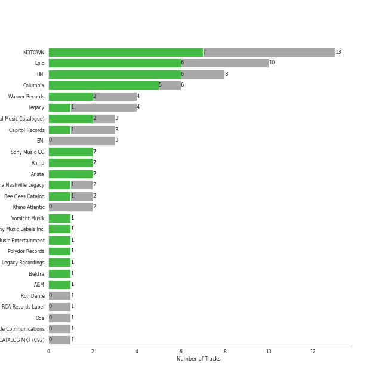

# Classic Pop

## Top Artists

See all artists

|   Number of Tracks | Art                                                                                              | Artist            | 🔗                                                           |
|-------------------:|:-------------------------------------------------------------------------------------------------|:------------------|:------------------------------------------------------------|
|                  8 |  | Michael Jackson   | [🔗](https://open.spotify.com/artist/3fMbdgg4jU18AjLCKBhRSm) |
|                  6 |  | Elton John        | [🔗](https://open.spotify.com/artist/3PhoLpVuITZKcymswpck5b) |
|                  5 |  | Simon & Garfunkel | [🔗](https://open.spotify.com/artist/70cRZdQywnSFp9pnc2WTCE) |
|                  4 |  | Stevie Wonder     | [🔗](https://open.spotify.com/artist/7guDJrEfX3qb6FEbdPA5qi) |
|                  4 |  | The Temptations   | [🔗](https://open.spotify.com/artist/3RwQ26hR2tJtA8F9p2n7jG) |
|                  3 |  | Madonna           | [🔗](https://open.spotify.com/artist/6tbjWDEIzxoDsBA1FuhfPW) |
|                  3 |  | Johnny Cash       | [🔗](https://open.spotify.com/artist/6kACVPfCOnqzgfEF5ryl0x) |
|                  3 |  | The Jackson 5     | [🔗](https://open.spotify.com/artist/2iE18Oxc8YSumAU232n4rW) |
|                  3 |  | George Michael    | [🔗](https://open.spotify.com/artist/19ra5tSw0tWufvUp8GotLo) |
|                  2 |  | Nat King Cole     | [🔗](https://open.spotify.com/artist/7v4imS0moSyGdXyLgVTIV7) |
|                  1 |  | Aretha Franklin   | [🔗](https://open.spotify.com/artist/7nwUJBm0HE4ZxD3f5cy5ok) |
|                  1 |  | Cher              | [🔗](https://open.spotify.com/artist/72OaDtakiy6yFqkt4TsiFt) |
|                  1 |  | Commodores        | [🔗](https://open.spotify.com/artist/6twIAGnYuIT1pncMAsXnEm) |
|                  1 |  | Gloria Gaynor     | [🔗](https://open.spotify.com/artist/6V6WCgi7waF55bJmylC4H5) |
|                  1 |  | The Foundations   | [🔗](https://open.spotify.com/artist/4GITZM5LCR2KcdlgEOrNLD) |
|                  1 |  | Lou Bega          | [🔗](https://open.spotify.com/artist/46lnlnlU0dXTDpoAUmH6Qx) |
|                  1 |  | Harry Chapin      | [🔗](https://open.spotify.com/artist/42q4Ivs7tAiCZ5C7eG5q4c) |
|                  1 |  | Frankie Valli     | [🔗](https://open.spotify.com/artist/3CDKmzJu6uwEGnPLLZffpD) |
|                  1 |  | The Archies       | [🔗](https://open.spotify.com/artist/33QmoCkSqADuQEtMCysYLh) |
|                  1 |  | Carole King       | [🔗](https://open.spotify.com/artist/319yZVtYM9MBGqmSQnMyY6) |
|                  1 |  | Chuck Mangione    | [🔗](https://open.spotify.com/artist/2MMaIlHd8UvDW0mVRAncD6) |
|                  1 |  | Paul Simon        | [🔗](https://open.spotify.com/artist/2CvCyf1gEVhI0mX6aFXmVI) |
|                  1 |  | Bee Gees          | [🔗](https://open.spotify.com/artist/1LZEQNv7sE11VDY3SdxQeN) |
|                  1 |  | The Tokens        | [🔗](https://open.spotify.com/artist/1GAJzApRTMmYZ9EjQ91VOy) |

## Top Albums

See all albums

|   Number of Tracks | Art                                                                                              | Album                                                                                                   | 🔗                                                          |
|-------------------:|:-------------------------------------------------------------------------------------------------|:--------------------------------------------------------------------------------------------------------|:-----------------------------------------------------------|
|                  4 |  | Thriller                                                                                                | [🔗](https://open.spotify.com/album/2ANVost0y2y52ema1E9xAZ) |
|                  3 |  | Bridge Over Troubled Water                                                                              | [🔗](https://open.spotify.com/album/0JwHz5SSvpYWuuCNbtYZoV) |
|                  2 |  | Goodbye Yellow Brick Road (Remastered)                                                                  | [🔗](https://open.spotify.com/album/5WupqgR68HfuHt3BMJtgun) |
|                  2 |  | Celebration (Bonus Track Version)                                                                       | [🔗](https://open.spotify.com/album/4GU7z3q6fg90MWrkTacYYG) |
|                  2 |  | Bad (Remastered)                                                                                        | [🔗](https://open.spotify.com/album/3Us57CjssWnHjTUIXBuIeH) |
|                  1 |  | Wimoweh!!! - The Best Of The Tokens                                                                     | [🔗](https://open.spotify.com/album/6NBox81OQox7U4I0hZB9t0) |
|                  1 |  | Wednesday Morning, 3 A.M.                                                                               | [🔗](https://open.spotify.com/album/5pnJrocLlZ3FWEbcr2PTz0) |
|                  1 |  | Verities & Balderdash                                                                                   | [🔗](https://open.spotify.com/album/3nta4nhqWoWjc6LmHIB0kT) |
|                  1 |  | Unforgettable                                                                                           | [🔗](https://open.spotify.com/album/7GBvXtxnvBluo2f4xBVNkm) |
|                  1 |  | Third Album                                                                                             | [🔗](https://open.spotify.com/album/5d6X8oegJmu9XKn9UBAswG) |
|                  1 |  | The Very Best of Frankie Valli & The 4 Seasons                                                          | [🔗](https://open.spotify.com/album/0NUEQILaBzavnzcMEs4buZ) |
|                  1 |  | The Very Best Of "The Archies"                                                                          | [🔗](https://open.spotify.com/album/7spOTrIPTM8RrMIAhCjLJi) |
|                  1 |  | The Ultimate Bee Gees                                                                                   | [🔗](https://open.spotify.com/album/5GucSY3249qHDx4v1Hcxry) |
|                  1 |  | The Temptations Sing Smokey                                                                             | [🔗](https://open.spotify.com/album/45tweuKI0zdh8zgKo05cTw) |
|                  1 |  | The Nat King Cole Story                                                                                 | [🔗](https://open.spotify.com/album/3NoP1ifIejWkGSDsO9T2xH) |
|                  1 |  | The Foundations                                                                                         | [🔗](https://open.spotify.com/album/3j1kw5l2mEeKCUuXXwjhWp) |
|                  1 |  | The Definitive Collection                                                                               | [🔗](https://open.spotify.com/album/4E1itnJOhTMRSATNaxh0Sq) |
|                  1 |  | Tapestry                                                                                                | [🔗](https://open.spotify.com/album/12n11cgnpjXKLeqrnIERoS) |
|                  1 |  | Songs In The Key Of Life                                                                                | [🔗](https://open.spotify.com/album/6YUCc2RiXcEKS9ibuZxjt0) |
|                  1 |  | Signed, Sealed And Delivered                                                                            | [🔗](https://open.spotify.com/album/54ootLtDyMZFr9obtWQvvO) |
|                  1 |  | Ring Of Fire: The Best Of Johnny Cash                                                                   | [🔗](https://open.spotify.com/album/0ucV57dbnqmrGv9d60r6X2) |
|                  1 |  | Off the Wall                                                                                            | [🔗](https://open.spotify.com/album/2ZytN2cY4Zjrr9ukb2rqTP) |
|                  1 |  | Meet The Temptations                                                                                    | [🔗](https://open.spotify.com/album/199rfdL0k6q5ReLA7V4KMt) |
|                  1 |  | Madman Across The Water                                                                                 | [🔗](https://open.spotify.com/album/2OZbaW9tgO62ndm375lFZr) |
|                  1 |  | Listen Without Prejudice / MTV Unplugged (Deluxe)                                                       | [🔗](https://open.spotify.com/album/0ZeOyoJHPD6czbTPAT9Qaj) |
|                  1 |  | Like a Virgin (Reissue)                                                                                 | [🔗](https://open.spotify.com/album/2IU9ftOgyRL2caQGWK1jjX) |
|                  1 |  | Ladies And Gentlemen... The Best Of George Michael                                                      | [🔗](https://open.spotify.com/album/3coLNlyStg9h7f8CZ103Rl) |
|                  1 |  | I Walk the Line (Stereo Version)                                                                        | [🔗](https://open.spotify.com/album/1kd7QnBNMg5kygoclVuDqZ) |
|                  1 |  | I Never Loved a Man the Way I Love You                                                                  | [🔗](https://open.spotify.com/album/5WndWfzGwCkHzAbQXVkg2V) |
|                  1 |  | Honky Chateau                                                                                           | [🔗](https://open.spotify.com/album/2ei2X6ghPnw7YRwQtAH075) |
|                  1 |  | HIStory - PAST, PRESENT AND FUTURE - BOOK I                                                             | [🔗](https://open.spotify.com/album/3OBhnTLrvkoEEETjFA3Qfk) |
|                  1 |  | Graceland (25th Anniversary Deluxe Edition)                                                             | [🔗](https://open.spotify.com/album/6WgGWYw6XXQyLTsWt7tXky) |
|                  1 |  | Gettin' Ready (Expanded Edition)                                                                        | [🔗](https://open.spotify.com/album/3RE8NUULcBzFvVtCmlI4lb) |
|                  1 |  | For Once In My Life                                                                                     | [🔗](https://open.spotify.com/album/3pPBbp1Nl9n1AM9xFpdKtZ) |
|                  1 |  | Feels So Good                                                                                           | [🔗](https://open.spotify.com/album/5w0p1F0Q1wBqsX2UiX6CCD) |
|                  1 |  | Faith                                                                                                   | [🔗](https://open.spotify.com/album/34K1Kvskt9arWy8E1Gz3Lw) |
|                  1 |  | Elton John                                                                                              | [🔗](https://open.spotify.com/album/69P9Ro0W286yLFgYwrGVN0) |
|                  1 |  | Don't Shoot Me I'm Only The Piano Player                                                                | [🔗](https://open.spotify.com/album/1reJ8DttK5EGwdyf7y9FBR) |
|                  1 |  | Diana Ross Presents The Jackson 5                                                                       | [🔗](https://open.spotify.com/album/51uoKRa8vT5SULrlF8s2t1) |
|                  1 |  | Commodores                                                                                              | [🔗](https://open.spotify.com/album/2tzbNCAUTmW4MIM2Ulvrwl) |
|                  1 |  | Bookends                                                                                                | [🔗](https://open.spotify.com/album/3bzgbgiytguTDnwzflAZr2) |
|                  1 |  | Believe                                                                                                 | [🔗](https://open.spotify.com/album/0jZfbz0dNfDjPSg0hYJNth) |
|                  1 |  | At Folsom Prison                                                                                        | [🔗](https://open.spotify.com/album/4TJIdlY9hGSSTO1kUs1neh) |
|                  1 |  | ABC                                                                                                     | [🔗](https://open.spotify.com/album/3btVhknqDeGAEd1Qj7lL57) |
|                  1 |  | A Little Bit of Mambo                                                                                   | [🔗](https://open.spotify.com/album/13BmLGhVCLBn3XzKB8HIai) |
|                  1 |  | 20th Century Masters: The Millennium Collection: Best Of The Temptations, Vol. 2 - The '70s, '80s, '90s | [🔗](https://open.spotify.com/album/2kzUxFepw1uLjbgqV537eP) |
|                  1 |  | 20th Century Masters: The Millennium Collection: Best Of Gloria Gaynor                                  | [🔗](https://open.spotify.com/album/2BU2SNYoIPtZvGEJckdIhx) |

## Top Record Labels

See all labels

|   Number of Tracks | Label                           |
|-------------------:|:--------------------------------|
|                  7 | UNI/MOTOWN                      |
|                  7 | Epic                            |
|                  5 | Motown                          |
|                  5 | Columbia                        |
|                  4 | Warner Records                  |
|                  3 | UMC (Universal Music Catalogue) |
|                  3 | EMI                             |
|                  2 | Epic/Legacy                     |
|                  2 | Columbia Nashville Legacy       |
|                  1 | Vorsicht Musik                  |
|                  1 | Sony Music Entertainment        |
|                  1 | Sony Music CG                   |
|                  1 | Ron Dante                       |
|                  1 | Rhino/Elektra                   |
|                  1 | Rhino Atlantic                  |
|                  1 | Rhino                           |
|                  1 | RCA Records Label               |
|                  1 | Polydor                         |
|                  1 | Ode/Epic/Legacy                 |
|                  1 | Legacy Recordings               |
|                  1 | Columbia/Legacy                 |
|                  1 | Castle Communications           |
|                  1 | Capitol Records                 |
|                  1 | CAPITOL CATALOG MKT (C92)       |
|                  1 | Bee Gees Catalog                |
|                  1 | A&M                             |

## Tracks

| Art                                                                                              | Track                                                                        | Album                                                                                                   | Artists           | Label                           | 💚   | 🔗                                                          |
|:-------------------------------------------------------------------------------------------------|:-----------------------------------------------------------------------------|:--------------------------------------------------------------------------------------------------------|:------------------|:--------------------------------|:----|:-----------------------------------------------------------|
|  | Respect                                                                      | I Never Loved a Man the Way I Love You                                                                  | Aretha Franklin   | Rhino Atlantic                  |     | [🔗](https://open.spotify.com/track/7s25THrKz86DM225dOYwnr) |
|  | Stayin Alive                                                                 | The Ultimate Bee Gees                                                                                   | Bee Gees          | Bee Gees Catalog                |     | [🔗](https://open.spotify.com/track/7qK3JFriCqLorQivsJYG2X) |
|  | I Feel the Earth Move                                                        | Tapestry                                                                                                | Carole King       | Ode/Epic/Legacy                 |     | [🔗](https://open.spotify.com/track/1BWsOxeMx83OrKGCV4gxly) |
|  | Believe                                                                      | Believe                                                                                                 | Cher              | Warner Records                  |     | [🔗](https://open.spotify.com/track/2goLsvvODILDzeeiT4dAoR) |
|  | Feels So Good                                                                | Feels So Good                                                                                           | Chuck Mangione    | A&M                             | 💚   | [🔗](https://open.spotify.com/track/2M7EflZCPCqqRLB9hy5MDy) |
|  | Easy                                                                         | Commodores                                                                                              | Commodores        | Motown                          | 💚   | [🔗](https://open.spotify.com/track/1JQ6Xm1JrvHfvAqhl5pwaA) |
|  | Your Song                                                                    | Elton John                                                                                              | Elton John        | UMC (Universal Music Catalogue) | 💚   | [🔗](https://open.spotify.com/track/38zsOOcu31XbbYj9BIPUF1) |
|  | Tiny Dancer                                                                  | Madman Across The Water                                                                                 | Elton John        | EMI                             |     | [🔗](https://open.spotify.com/track/2TVxnKdb3tqe1nhQWwwZCO) |
|  | Rocket Man (I Think It's Going To Be A Long, Long Time)                      | Honky Chateau                                                                                           | Elton John        | EMI                             |     | [🔗](https://open.spotify.com/track/3gdewACMIVMEWVbyb8O9sY) |
|  | Crocodile Rock                                                               | Don't Shoot Me I'm Only The Piano Player                                                                | Elton John        | EMI                             |     | [🔗](https://open.spotify.com/track/6WCeFNVAXUtNczb7lqLiZU) |
|  | Candle In The Wind - Remastered 2014                                         | Goodbye Yellow Brick Road (Remastered)                                                                  | Elton John        | UMC (Universal Music Catalogue) |     | [🔗](https://open.spotify.com/track/1L9fzw2pXprOqtemTwtxXF) |
|  | Goodbye Yellow Brick Road - Remastered 2014                                  | Goodbye Yellow Brick Road (Remastered)                                                                  | Elton John        | UMC (Universal Music Catalogue) | 💚   | [🔗](https://open.spotify.com/track/4IRHwIZHzlHT1FQpRa5RdE) |
|  | Can't Take My Eyes off You                                                   | The Very Best of Frankie Valli & The 4 Seasons                                                          | Frankie Valli     | Rhino                           | 💚   | [🔗](https://open.spotify.com/track/6ft9PAgNOjmZ2kFVP7LGqb) |
|  | Faith - Remastered                                                           | Faith                                                                                                   | George Michael    | Epic                            | 💚   | [🔗](https://open.spotify.com/track/0HEmnAUT8PHznIAAmVXqFJ) |
|  | Careless Whisper                                                             | Ladies And Gentlemen... The Best Of George Michael                                                      | George Michael    | Sony Music Entertainment        | 💚   | [🔗](https://open.spotify.com/track/4jDmJ51x1o9NZB5Nxxc7gY) |
|  | Freedom! '90 - Remastered                                                    | Listen Without Prejudice / MTV Unplugged (Deluxe)                                                       | George Michael    | Sony Music CG                   | 💚   | [🔗](https://open.spotify.com/track/3tyTt5pEWblt96j1HsXiV5) |
|  | I Will Survive - Single Version                                              | 20th Century Masters: The Millennium Collection: Best Of Gloria Gaynor                                  | Gloria Gaynor     | Polydor                         | 💚   | [🔗](https://open.spotify.com/track/7cv28LXcjAC3GsXbUvXKbX) |
|  | Cat's in the Cradle                                                          | Verities & Balderdash                                                                                   | Harry Chapin      | Rhino/Elektra                   | 💚   | [🔗](https://open.spotify.com/track/2obblQ6tcePeOEVJV6nEGD) |
|  | Ring of Fire                                                                 | Ring Of Fire: The Best Of Johnny Cash                                                                   | Johnny Cash       | Columbia Nashville Legacy       | 💚   | [🔗](https://open.spotify.com/track/6YffUZJ2R06kyxyK6onezL) |
|  | I Walk the Line - Stereo Version                                             | I Walk the Line (Stereo Version)                                                                        | Johnny Cash       | Columbia Nashville Legacy       |     | [🔗](https://open.spotify.com/track/3X9tJw6z5LowFx339fhTvu) |
|  | Folsom Prison Blues - Live at Folsom State Prison, Folsom, CA - January 1968 | At Folsom Prison                                                                                        | Johnny Cash       | Columbia/Legacy                 |     | [🔗](https://open.spotify.com/track/2fDHuS1PTkHBbCWWZF1ph9) |
|  | Mambo No. 5 (a Little Bit of...)                                             | A Little Bit of Mambo                                                                                   | Lou Bega          | Vorsicht Musik                  | 💚   | [🔗](https://open.spotify.com/track/6x4tKaOzfNJpEJHySoiJcs) |
|  | Like a Virgin                                                                | Like a Virgin (Reissue)                                                                                 | Madonna           | Warner Records                  | 💚   | [🔗](https://open.spotify.com/track/1ZPlNanZsJSPK5h9YZZFbZ) |
|  | Like a Prayer                                                                | Celebration (Bonus Track Version)                                                                       | Madonna           | Warner Records                  | 💚   | [🔗](https://open.spotify.com/track/7Bj27KfbcrXFqQd3JsJBUK) |
|  | Material Girl                                                                | Celebration (Bonus Track Version)                                                                       | Madonna           | Warner Records                  |     | [🔗](https://open.spotify.com/track/5pJCPFqScbHTESXDFesPb1) |
|  | Don't Stop 'Til You Get Enough                                               | Off the Wall                                                                                            | Michael Jackson   | Epic                            |     | [🔗](https://open.spotify.com/track/46eu3SBuFCXWsPT39Yg3tJ) |
|  | Billie Jean                                                                  | Thriller                                                                                                | Michael Jackson   | Epic                            | 💚   | [🔗](https://open.spotify.com/track/7J1uxwnxfQLu4APicE5Rnj) |
|  | P.Y.T. (Pretty Young Thing)                                                  | Thriller                                                                                                | Michael Jackson   | Epic                            | 💚   | [🔗](https://open.spotify.com/track/1CgmY8fVN7kstVDZmsdM5k) |
|  | Thriller                                                                     | Thriller                                                                                                | Michael Jackson   | Epic                            | 💚   | [🔗](https://open.spotify.com/track/2LlQb7Uoj1kKyGhlkBf9aC) |
|  | Wanna Be Startin' Somethin'                                                  | Thriller                                                                                                | Michael Jackson   | Epic                            | 💚   | [🔗](https://open.spotify.com/track/1hu2s7qkm5bo03eODpRQO3) |
|  | Man in the Mirror - 2012 Remaster                                            | Bad (Remastered)                                                                                        | Michael Jackson   | Epic/Legacy                     |     | [🔗](https://open.spotify.com/track/3c7Ctlw9MKlIQPxRH3fOTt) |
|  | Smooth Criminal - 2012 Remaster                                              | Bad (Remastered)                                                                                        | Michael Jackson   | Epic/Legacy                     | 💚   | [🔗](https://open.spotify.com/track/5T7ywazdGIydr6JCW6t02j) |
|  | Beat It                                                                      | HIStory - PAST, PRESENT AND FUTURE - BOOK I                                                             | Michael Jackson   | Epic                            | 💚   | [🔗](https://open.spotify.com/track/52xaypL0Kjzk0ngwv3oBPR) |
|  | Unforgettable                                                                | Unforgettable                                                                                           | Nat King Cole     | CAPITOL CATALOG MKT (C92)       |     | [🔗](https://open.spotify.com/track/648TTtYB0bH0P8Hfy0FmkL) |
|  | Nature Boy                                                                   | The Nat King Cole Story                                                                                 | Nat King Cole     | Capitol Records                 | 💚   | [🔗](https://open.spotify.com/track/2WMyu5IYgxEuCd6xgFgJrl) |
|  | You Can Call Me Al                                                           | Graceland (25th Anniversary Deluxe Edition)                                                             | Paul Simon        | Legacy Recordings               |     | [🔗](https://open.spotify.com/track/0qxYx4F3vm1AOnfux6dDxP) |
|  | The Sound of Silence - Acoustic Version                                      | Wednesday Morning, 3 A.M.                                                                               | Simon & Garfunkel | Columbia                        | 💚   | [🔗](https://open.spotify.com/track/5y788ya4NvwhBznoDIcXwK) |
|  | Mrs. Robinson - From "The Graduate" Soundtrack                               | Bookends                                                                                                | Simon & Garfunkel | Columbia                        | 💚   | [🔗](https://open.spotify.com/track/0iOZM63lendWRTTeKhZBSC) |
|  | Bridge Over Troubled Water                                                   | Bridge Over Troubled Water                                                                              | Simon & Garfunkel | Columbia                        | 💚   | [🔗](https://open.spotify.com/track/6l8EbYRtQMgKOyc1gcDHF9) |
|  | Cecilia                                                                      | Bridge Over Troubled Water                                                                              | Simon & Garfunkel | Columbia                        | 💚   | [🔗](https://open.spotify.com/track/6QhXQOpyYvbpdbyjgAqKdY) |
|  | The Boxer                                                                    | Bridge Over Troubled Water                                                                              | Simon & Garfunkel | Columbia                        | 💚   | [🔗](https://open.spotify.com/track/76TZCvJ8GitQ2FA1q5dKu0) |
|  | For Once In My Life                                                          | For Once In My Life                                                                                     | Stevie Wonder     | Motown                          |     | [🔗](https://open.spotify.com/track/4kP69y3GKHi9tXckfgp4bK) |
|  | Signed, Sealed, Delivered (I'm Yours)                                        | Signed, Sealed And Delivered                                                                            | Stevie Wonder     | UNI/MOTOWN                      | 💚   | [🔗](https://open.spotify.com/track/2eF8pWbiivYsYRpbntYsnc) |
|  | Isn't She Lovely                                                             | Songs In The Key Of Life                                                                                | Stevie Wonder     | UNI/MOTOWN                      |     | [🔗](https://open.spotify.com/track/6RANU8AS5ICU5PEHh8BYtH) |
|  | Superstition - Single Version                                                | The Definitive Collection                                                                               | Stevie Wonder     | UNI/MOTOWN                      | 💚   | [🔗](https://open.spotify.com/track/1h2xVEoJORqrg71HocgqXd) |
|  | Sugar, Sugar                                                                 | The Very Best Of "The Archies"                                                                          | The Archies       | Ron Dante                       |     | [🔗](https://open.spotify.com/track/3iSws76HjaU7k49EqJVTfF) |
|  | Build Me Up Buttercup - Mono                                                 | The Foundations                                                                                         | The Foundations   | Castle Communications           |     | [🔗](https://open.spotify.com/track/6sPOmDulFtLzfX25zICNrC) |
|  | I Want You Back                                                              | Diana Ross Presents The Jackson 5                                                                       | The Jackson 5     | UNI/MOTOWN                      | 💚   | [🔗](https://open.spotify.com/track/5LxvwujISqiB8vpRYv887S) |
|  | ABC                                                                          | ABC                                                                                                     | The Jackson 5     | Motown                          |     | [🔗](https://open.spotify.com/track/6wDviYDtmSDZ0S6TVMM9Vc) |
|  | I'll Be There                                                                | Third Album                                                                                             | The Jackson 5     | UNI/MOTOWN                      | 💚   | [🔗](https://open.spotify.com/track/5RdhBLmB4DyFHLglRrfx63) |
|  | The Way You Do The Things You Do                                             | Meet The Temptations                                                                                    | The Temptations   | Motown                          |     | [🔗](https://open.spotify.com/track/3496rr5XSGD6n1Z1OKXovb) |
|  | My Girl                                                                      | The Temptations Sing Smokey                                                                             | The Temptations   | UNI/MOTOWN                      | 💚   | [🔗](https://open.spotify.com/track/745H5CctFr12Mo7cqa1BMH) |
|  | Ain't Too Proud To Beg                                                       | Gettin' Ready (Expanded Edition)                                                                        | The Temptations   | Motown                          |     | [🔗](https://open.spotify.com/track/4CoGNqLap7UGU5Q3VdKug0) |
|  | Papa Was A Rollin' Stone - Single Version                                    | 20th Century Masters: The Millennium Collection: Best Of The Temptations, Vol. 2 - The '70s, '80s, '90s | The Temptations   | UNI/MOTOWN                      |     | [🔗](https://open.spotify.com/track/7MiLmLbwNoyf47xQ4TCVYp) |
|  | The Lion Sleeps Tonight (Wimoweh)                                            | Wimoweh!!! - The Best Of The Tokens                                                                     | The Tokens        | RCA Records Label               |     | [🔗](https://open.spotify.com/track/2F4FNcz68howQWD4zaGJSi) |
