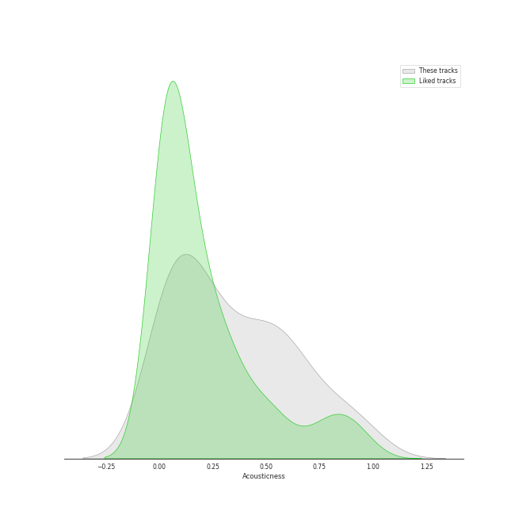
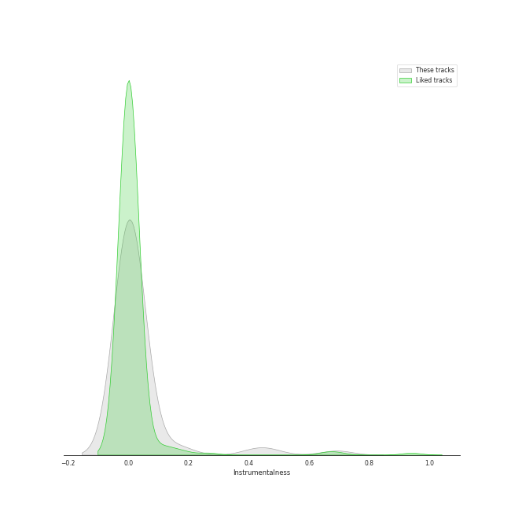
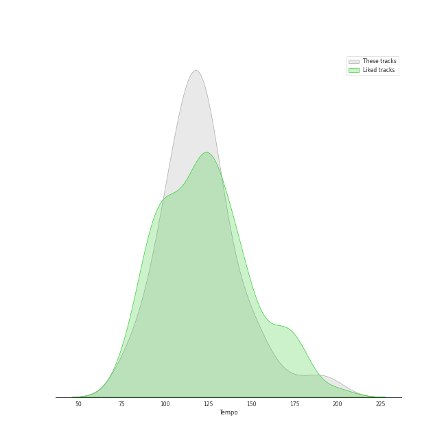

# Track Features for Classic Pop

## Danceability

| ​ | 10 most Danceable tracks | ​​ | 10 least Danceable tracks |
|:---|:---|:---|:---|
|  | Billie Jean (0.932) |  | Bridge Over Troubled Water (0.149) |
|  | P.Y.T. (Pretty Young Thing) (0.894) |  | Nature Boy (0.275) |
|  | Faith - Remastered (0.887) |  | The Lion Sleeps Tonight (Wimoweh) (0.321) |
|  | Don't Stop 'Til You Get Enough (0.878) |  | Unforgettable (0.349) |
|  | Smooth Criminal - 2012 Remaster (0.853) |  | Tiny Dancer (0.414) |
|  | Wanna Be Startin' Somethin' (0.842) |  | The Boxer (0.439) |
|  | Papa Was A Rollin' Stone - Single Version (0.817) |  | I Want You Back (0.469) |
|  | Man in the Mirror - 2012 Remaster (0.808) |  | Isn't She Lovely (0.481) |
|  | Respect (0.805) |  | Cat's in the Cradle (0.489) |
|  | I Will Survive - Single Version (0.777) |  | I'll Be There (0.51) |

## Energy

| ​ | 10 most Energetic tracks | ​​ | 10 least Energetic tracks |
|:---|:---|:---|:---|
|  | Smooth Criminal - 2012 Remaster (0.981) |  | Nature Boy (0.0895) |
|  | Hey Ya! (0.974) |  | Unforgettable (0.182) |
|  | Believe (0.917) |  | I Walk the Line - Stereo Version (0.194) |
|  | Material Girl (0.883) |  | Bridge Over Troubled Water (0.206) |
|  | Cecilia (0.876) |  | The Sound of Silence - Acoustic Version (0.216) |
|  | Wanna Be Startin' Somethin' (0.872) |  | Stand By Me (0.306) |
|  | Sugar, Sugar (0.871) |  | Your Song (0.315) |
|  | Walking On Sunshine (0.87) |  | Easy (0.387) |
|  | Freedom! '90 - Remastered (0.852) |  | I Have Nothing (0.401) |
|  | Like a Prayer (0.842) |  | Papa Was A Rollin' Stone - Single Version (0.405) |

## Speechiness

| ​ | 10 most Speechy tracks | ​​ | 10 least Speechy tracks |
|:---|:---|:---|:---|
|  | Mambo No. 5 (a Little Bit of...) (0.408) |  | I'll Be There (0.0253) |
|  | Faith - Remastered (0.117) |  | Tiny Dancer (0.0278) |
|  | Don't Stop 'Til You Get Enough (0.089) |  | Sugar, Sugar (0.0278) |
|  | Isn't She Lovely (0.0851) |  | Goodbye Yellow Brick Road - Remastered 2014 (0.0279) |
|  | Papa Was A Rollin' Stone - Single Version (0.0811) |  | Rocket Man (I Think It's Going To Be A Long, Long Time) (0.0286) |
|  | Folsom Prison Blues - Live at Folsom State Prison, Folsom, CA - January 1968 (0.0803) |  | Candle In The Wind - Remastered 2014 (0.0288) |
|  | Smooth Criminal - 2012 Remaster (0.0751) |  | Ring of Fire (0.0288) |
|  | Can't Take My Eyes off You (0.0746) |  | Build Me Up Buttercup (0.0293) |
|  | Superstition - Single Version (0.0725) |  | Your Song (0.0299) |
|  | Thriller (0.0693) |  | The Sound of Silence - Acoustic Version (0.0301) |

## Acousticness

| ​ | 10 most Acoustic tracks | ​​ | 10 least Acoustic tracks |
|:---|:---|:---|:---|
|  | Nature Boy (0.971) |  | Believe (0.0082) |
|  | I Walk the Line - Stereo Version (0.97) |  | Faith - Remastered (0.0094) |
|  | Unforgettable (0.92) |  | Walking On Sunshine (0.0119) |
|  | The Sound of Silence - Acoustic Version (0.837) |  | I Will Survive - Single Version (0.0131) |
|  | Your Song (0.828) |  | Billie Jean (0.0173) |
|  | Bridge Over Troubled Water (0.822) |  | Beat It (0.0242) |
|  | The Lion Sleeps Tonight (Wimoweh) (0.743) |  | Holding Out for a Hero - From "Footloose" Soundtrack (0.0245) |
|  | Mrs. Robinson - From "The Graduate" Soundtrack (0.713) |  | Wanna Be Startin' Somethin' (0.0259) |
|  | The Boxer (0.702) |  | Crocodile Rock (0.0264) |
|  | I Feel the Earth Move (0.648) |  | Stayin Alive (0.0309) |

## Instrumentalness

| ​ | 10 most Instrumental tracks | ​​ | 10 least Instrumental tracks |
|:---|:---|:---|:---|
|  | A Fifth Of Beethoven (0.692) |  | The Lion Sleeps Tonight (Wimoweh) (0.0) |
|  | Smooth Criminal - 2012 Remaster (0.468) |  | Signed, Sealed, Delivered (I'm Yours) (0.0) |
|  | Wanna Be Startin' Somethin' (0.419) |  | Believe (0.0) |
|  | Walking On Sunshine (0.166) |  | Cat's in the Cradle (0.0) |
|  | I Walk the Line - Stereo Version (0.162) |  | I Have Nothing (0.0) |
|  | Feels So Good (0.0537) |  | Sugar, Sugar (0.0) |
|  | Papa Was A Rollin' Stone - Single Version (0.0507) |  | Ain't Too Proud To Beg (0.0) |
|  | Don't Stop 'Til You Get Enough (0.0461) |  | Careless Whisper (0.0) |
|  | Billie Jean (0.0436) |  | For Once In My Life (0.0) |
|  | Nature Boy (0.0221) |  | The Sound of Silence - Acoustic Version (0.0) |

## Liveness

| ​ | 10 most Live tracks | ​​ | 10 least Live tracks |
|:---|:---|:---|:---|
|  | Folsom Prison Blues - Live at Folsom State Prison, Folsom, CA - January 1968 (0.893) |  | Superstition - Single Version (0.0385) |
|  | Thriller (0.89) |  | Feels So Good (0.0406) |
|  | I'll Be There (0.654) |  | Billie Jean (0.0414) |
|  | For Once In My Life (0.523) |  | Papa Was A Rollin' Stone - Single Version (0.0468) |
|  | I Want You Back (0.37) |  | Holding Out for a Hero - From "Footloose" Soundtrack (0.0491) |
|  | The Way You Do The Things You Do (0.358) |  | Believe (0.0509) |
|  | Ring of Fire (0.348) |  | I Feel the Earth Move (0.0528) |
|  | Isn't She Lovely (0.324) |  | Respect (0.0546) |
|  | Mambo No. 5 (a Little Bit of...) (0.306) |  | Wanna Be Startin' Somethin' (0.0573) |
|  | Smooth Criminal - 2012 Remaster (0.306) |  | Crocodile Rock (0.059) |

## Valence

| ​ | 10 most Happy tracks | ​​ | 10 least Happy tracks |
|:---|:---|:---|:---|
|  | Material Girl (0.978) |  | Nature Boy (0.111) |
|  | Like a Virgin (0.97) |  | Unforgettable (0.178) |
|  | Surfin' U.S.A. (0.969) |  | I Have Nothing (0.24) |
|  | Crocodile Rock (0.968) |  | Like a Prayer (0.26) |
|  | Sugar, Sugar (0.967) |  | Bridge Over Troubled Water (0.264) |
|  | Respect (0.965) |  | Man in the Mirror - 2012 Remaster (0.269) |
|  | Hey Ya! (0.965) |  | Tiny Dancer (0.282) |
|  | P.Y.T. (Pretty Young Thing) (0.961) |  | Your Song (0.324) |
|  | Cecilia (0.954) |  | The Sound of Silence - Acoustic Version (0.328) |
|  | ABC (0.952) |  | I'll Be There (0.331) |

## Tempo

| ​ | 10 most Fast tracks | ​​ | 10 least Fast tracks |
|:---|:---|:---|:---|
|  | I Want You Back (196.606) |  | Cat's in the Cradle (78.111) |
|  | ABC (188.119) |  | Hey Ya! (79.526) |
|  | Mambo No. 5 (a Little Bit of...) (174.06) |  | Bridge Over Troubled Water (79.764) |
|  | Surfin' U.S.A. (160.753) |  | Freedom! '90 - Remastered (91.689) |
|  | Careless Whisper (153.119) |  | Mrs. Robinson - From "The Graduate" Soundtrack (92.033) |
|  | I Have Nothing (152.943) |  | The Boxer (93.017) |
|  | Holding Out for a Hero - From "Footloose" Soundtrack (150.055) |  | I'll Be There (93.212) |
|  | Crocodile Rock (149.908) |  | Faith - Remastered (95.846) |
|  | Tiny Dancer (145.075) |  | Man in the Mirror - 2012 Remaster (100.331) |
|  | Beat It (138.728) |  | Superstition - Single Version (100.499) |
