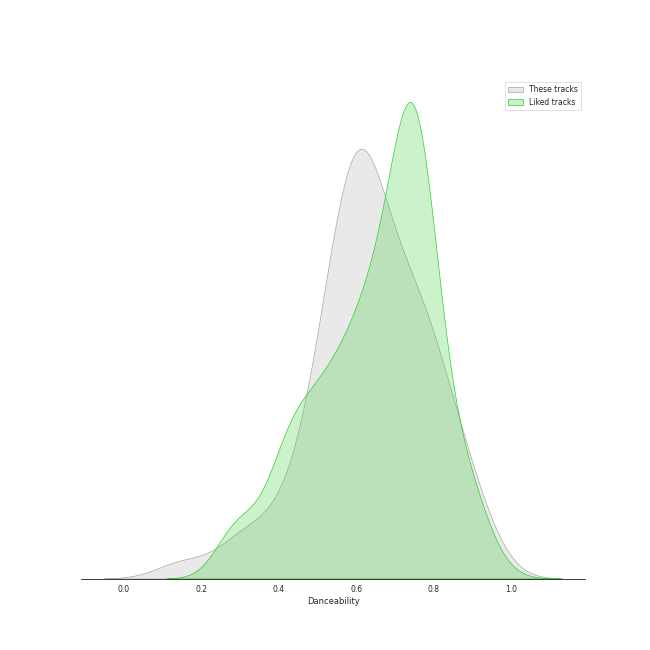
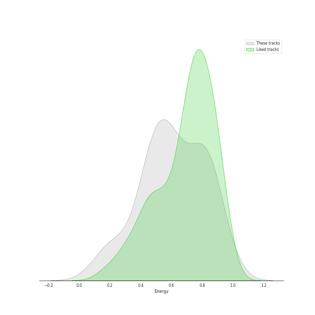
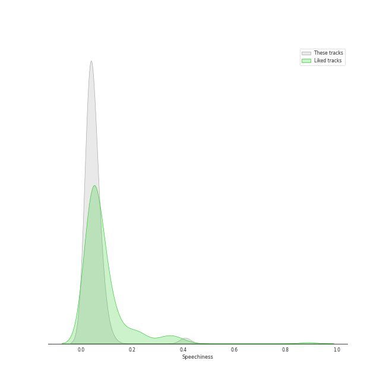
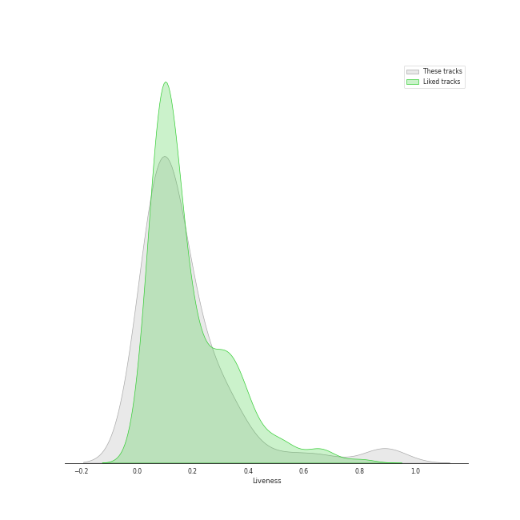
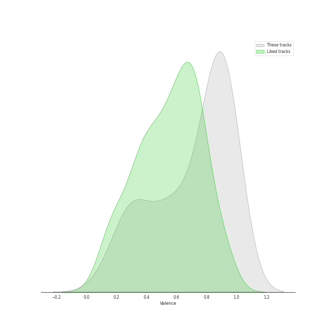

# Audio Features for Classic Pop

## Danceability

| 10 most Danceable tracks | 10 least Danceable tracks |
|:---|:---|
| Billie Jean (0.932) | Bridge Over Troubled Water (0.149) |
| P.Y.T. (Pretty Young Thing) (0.894) | Nature Boy (0.203) |
| Faith - Remastered (0.887) | The Lion Sleeps Tonight (Wimoweh) (0.321) |
| Don't Stop 'Til You Get Enough (0.878) | Unforgettable (0.349) |
| Smooth Criminal - 2012 Remaster (0.853) | Tiny Dancer (0.414) |
| Wanna Be Startin' Somethin' (0.842) | The Boxer (0.439) |
| Papa Was A Rollin' Stone - Single Version (0.817) | I Want You Back (0.469) |
| Man in the Mirror - 2012 Remaster (0.808) | Isn't She Lovely (0.481) |
| Respect (0.805) | Cat's in the Cradle (0.489) |
| I Will Survive - Single Version (0.777) | I'll Be There (0.51) |

## Energy

| 10 most Energetic tracks | 10 least Energetic tracks |
|:---|:---|
| Smooth Criminal - 2012 Remaster (0.981) | Nature Boy (0.0895) |
| Believe (0.917) | Unforgettable (0.182) |
| Material Girl (0.883) | I Walk the Line - Stereo Version (0.194) |
| Cecilia (0.876) | Bridge Over Troubled Water (0.206) |
| Wanna Be Startin' Somethin' (0.872) | The Sound of Silence - Acoustic Version (0.216) |
| Sugar, Sugar (0.871) | Your Song (0.315) |
| Freedom! '90 - Remastered (0.852) | Easy (0.384) |
| Like a Prayer (0.842) | Papa Was A Rollin' Stone - Single Version (0.405) |
| Stayin Alive (0.831) | My Girl (0.418) |
| Isn't She Lovely (0.826) | Tiny Dancer (0.428) |

## Speechiness

| 10 most Speechy tracks | 10 least Speechy tracks |
|:---|:---|
| Mambo No. 5 (a Little Bit of...) (0.408) | I'll Be There (0.0253) |
| Faith - Remastered (0.117) | Tiny Dancer (0.0278) |
| Don't Stop 'Til You Get Enough (0.089) | Sugar, Sugar (0.0278) |
| Isn't She Lovely (0.0851) | Goodbye Yellow Brick Road - Remastered 2014 (0.0279) |
| Papa Was A Rollin' Stone - Single Version (0.0811) | Rocket Man (I Think It's Going To Be A Long, Long Time) (0.0286) |
| Folsom Prison Blues - Live at Folsom State Prison, Folsom, CA - January 1968 (0.0803) | Candle In The Wind - Remastered 2014 (0.0288) |
| Smooth Criminal - 2012 Remaster (0.0751) | Ring of Fire (0.0288) |
| Can't Take My Eyes off You (0.0746) | Build Me Up Buttercup (0.0293) |
| Superstition - Single Version (0.0725) | Your Song (0.0298) |
| Thriller (0.0693) | The Sound of Silence - Acoustic Version (0.0301) |

## Acousticness

| 10 most Acoustic tracks | 10 least Acoustic tracks |
|:---|:---|
| Nature Boy (0.971) | Believe (0.0082) |
| I Walk the Line - Stereo Version (0.97) | Faith - Remastered (0.0094) |
| Unforgettable (0.92) | I Will Survive - Single Version (0.0131) |
| The Sound of Silence - Acoustic Version (0.837) | Billie Jean (0.0173) |
| Your Song (0.828) | Wanna Be Startin' Somethin' (0.0259) |
| Bridge Over Troubled Water (0.822) | Crocodile Rock (0.0263) |
| The Lion Sleeps Tonight (Wimoweh) (0.743) | Beat It (0.027) |
| Mrs. Robinson - From "The Graduate" Soundtrack (0.713) | Thriller (0.0318) |
| The Boxer (0.702) | Stayin Alive (0.0328) |
| I Feel the Earth Move (0.648) | Superstition - Single Version (0.038) |

## Instrumentalness

| 10 most Instrumental tracks | 10 least Instrumental tracks |
|:---|:---|
| A Fifth Of Beethoven (0.69) | The Lion Sleeps Tonight (Wimoweh) (0.0) |
| Smooth Criminal - 2012 Remaster (0.468) | Signed, Sealed, Delivered (I'm Yours) (0.0) |
| Wanna Be Startin' Somethin' (0.419) | Believe (0.0) |
| I Walk the Line - Stereo Version (0.162) | Cat's in the Cradle (0.0) |
| Feels So Good (0.0537) | Sugar, Sugar (0.0) |
| Papa Was A Rollin' Stone - Single Version (0.0507) | Ain't Too Proud To Beg (0.0) |
| Don't Stop 'Til You Get Enough (0.0461) | Careless Whisper (0.0) |
| Billie Jean (0.0436) | For Once In My Life (0.0) |
| Nature Boy (0.0213) | The Sound of Silence - Acoustic Version (0.0) |
| Unforgettable (0.0152) | Build Me Up Buttercup (0.0) |

## Liveness

| 10 most Live tracks | 10 least Live tracks |
|:---|:---|
| Folsom Prison Blues - Live at Folsom State Prison, Folsom, CA - January 1968 (0.893) | Superstition - Single Version (0.0385) |
| Thriller (0.89) | Feels So Good (0.0406) |
| I'll Be There (0.654) | Billie Jean (0.0414) |
| For Once In My Life (0.523) | Papa Was A Rollin' Stone - Single Version (0.0468) |
| I Want You Back (0.37) | Believe (0.0509) |
| The Way You Do The Things You Do (0.358) | I Feel the Earth Move (0.0528) |
| Ring of Fire (0.348) | Respect (0.0546) |
| Isn't She Lovely (0.324) | Wanna Be Startin' Somethin' (0.0573) |
| Mambo No. 5 (a Little Bit of...) (0.306) | Crocodile Rock (0.0591) |
| Smooth Criminal - 2012 Remaster (0.306) | Freedom! '90 - Remastered (0.0595) |

## Valence

| 10 most Happy tracks | 10 least Happy tracks |
|:---|:---|
| Material Girl (0.978) | Nature Boy (0.115) |
| Like a Virgin (0.97) | Unforgettable (0.178) |
| Crocodile Rock (0.968) | Like a Prayer (0.257) |
| Sugar, Sugar (0.967) | Bridge Over Troubled Water (0.264) |
| Respect (0.965) | Man in the Mirror - 2012 Remaster (0.269) |
| P.Y.T. (Pretty Young Thing) (0.961) | Tiny Dancer (0.282) |
| Cecilia (0.954) | Your Song (0.325) |
| Stayin Alive (0.949) | The Sound of Silence - Acoustic Version (0.328) |
| ABC (0.947) | I'll Be There (0.331) |
| Don't Stop 'Til You Get Enough (0.947) | Rocket Man (I Think It's Going To Be A Long, Long Time) (0.341) |

## Tempo

| 10 most Fast tracks | 10 least Fast tracks |
|:---|:---|
| I Want You Back (196.605) | Cat's in the Cradle (78.111) |
| Mambo No. 5 (a Little Bit of...) (174.06) | Bridge Over Troubled Water (79.764) |
| Nature Boy (173.451) | Freedom! '90 - Remastered (91.689) |
| Careless Whisper (153.119) | Mrs. Robinson - From "The Graduate" Soundtrack (92.033) |
| Crocodile Rock (149.91) | The Boxer (93.017) |
| Tiny Dancer (145.075) | I'll Be There (93.212) |
| Beat It (138.823) | ABC (94.769) |
| Rocket Man (I Think It's Going To Be A Long, Long Time) (136.571) | Faith - Remastered (95.846) |
| Material Girl (136.506) | Man in the Mirror - 2012 Remaster (100.331) |
| Unforgettable (136.094) | Superstition - Single Version (100.499) |
