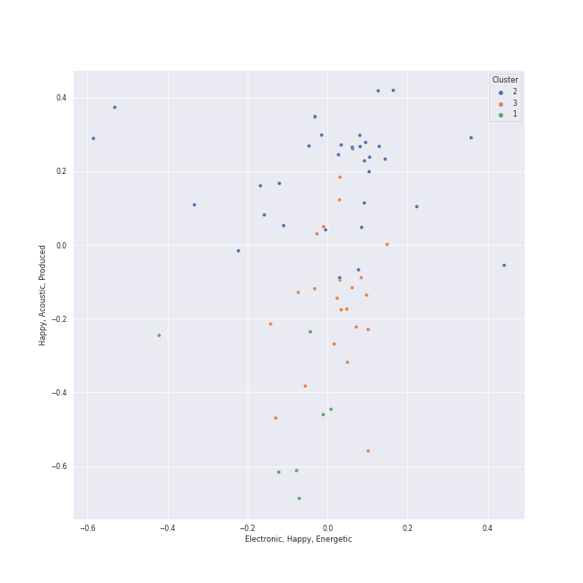

# Clusters in Classic Pop

## Cluster #1

11 tracks

| Art | Track | Album | Artists | Label | 💚 | 🔗 |
|:---|:---|:---|:---|:---|:---|:---|
|  | Your Song | Elton John | Elton John | [UMC (Universal Music Catalogue)](../../../../labels/umc_(universal_music_catalogue)) | 💚 | [🔗](https://open.spotify.com/track/38zsOOcu31XbbYj9BIPUF1) |
|  | Tiny Dancer | Madman Across The Water | Elton John | EMI | | [🔗](https://open.spotify.com/track/2TVxnKdb3tqe1nhQWwwZCO) |
|  | Rocket Man (I Think It's Going To Be A Long, Long Time) | Honky Chateau | Elton John | EMI | | [🔗](https://open.spotify.com/track/3gdewACMIVMEWVbyb8O9sY) |
|  | Goodbye Yellow Brick Road - Remastered 2014 | Goodbye Yellow Brick Road (Remastered) | Elton John | [UMC (Universal Music Catalogue)](../../../../labels/umc_(universal_music_catalogue)) | 💚 | [🔗](https://open.spotify.com/track/4IRHwIZHzlHT1FQpRa5RdE) |
|  | Man in the Mirror - 2012 Remaster | Bad (Remastered) | [Michael Jackson](../../../../artists/michael_jackson/overview.md) | [Epic](../../../../labels/epic), [Legacy](../../../../labels/legacy) | | [🔗](https://open.spotify.com/track/3c7Ctlw9MKlIQPxRH3fOTt) |
|  | Unforgettable | Unforgettable | Nat King Cole | CAPITOL CATALOG MKT (C92) | | [🔗](https://open.spotify.com/track/648TTtYB0bH0P8Hfy0FmkL) |
|  | Nature Boy | The Nat King Cole Story | Nat King Cole | [Capitol Records](../../../../labels/capitol_records) | 💚 | [🔗](https://open.spotify.com/track/2WMyu5IYgxEuCd6xgFgJrl) |
|  | The Sound of Silence - Acoustic Version | Wednesday Morning, 3 A.M. | [Simon & Garfunkel](../../../../artists/simon___garfunkel/overview.md) | [Columbia](../../../../labels/columbia) | 💚 | [🔗](https://open.spotify.com/track/5y788ya4NvwhBznoDIcXwK) |
|  | Bridge Over Troubled Water | Bridge Over Troubled Water | [Simon & Garfunkel](../../../../artists/simon___garfunkel/overview.md) | [Columbia](../../../../labels/columbia) | 💚 | [🔗](https://open.spotify.com/track/6l8EbYRtQMgKOyc1gcDHF9) |
|  | I'll Be There | Third Album | The Jackson 5 | [MOTOWN](../../../../labels/motown), [UNI](../../../../labels/uni) | | [🔗](https://open.spotify.com/track/5RdhBLmB4DyFHLglRrfx63) |
## Cluster #2

32 tracks

| Art | Track | Album | Artists | Label | 💚 | 🔗 |
|:---|:---|:---|:---|:---|:---|:---|
|  | Stayin Alive | The Ultimate Bee Gees | Bee Gees | Bee Gees Catalog | | [🔗](https://open.spotify.com/track/7qK3JFriCqLorQivsJYG2X) |
|  | Careless Whisper | Ladies And Gentlemen... The Best Of George Michael | George Michael | Sony Music Entertainment | 💚 | [🔗](https://open.spotify.com/track/4jDmJ51x1o9NZB5Nxxc7gY) |
|  | Mambo No. 5 (a Little Bit of...) | A Little Bit of Mambo | Lou Bega | [Sony Music/Vorsicht Musik](../../../../labels/sony_music_labels_inc_) | 💚 | [🔗](https://open.spotify.com/track/6x4tKaOzfNJpEJHySoiJcs) |
|  | Don't Stop 'Til You Get Enough | Off the Wall | [Michael Jackson](../../../../artists/michael_jackson/overview.md) | [Epic](../../../../labels/epic) | | [🔗](https://open.spotify.com/track/46eu3SBuFCXWsPT39Yg3tJ) |
|  | Beat It | HIStory - PAST, PRESENT AND FUTURE - BOOK I | [Michael Jackson](../../../../artists/michael_jackson/overview.md) | [Epic](../../../../labels/epic) | 💚 | [🔗](https://open.spotify.com/track/52xaypL0Kjzk0ngwv3oBPR) |
|  | You Can Call Me Al | Graceland (25th Anniversary Deluxe Edition) | Paul Simon | Legacy Recordings | | [🔗](https://open.spotify.com/track/0qxYx4F3vm1AOnfux6dDxP) |
|  | Cecilia | Bridge Over Troubled Water | [Simon & Garfunkel](../../../../artists/simon___garfunkel/overview.md) | [Columbia](../../../../labels/columbia) | 💚 | [🔗](https://open.spotify.com/track/6QhXQOpyYvbpdbyjgAqKdY) |
|  | Signed, Sealed, Delivered (I'm Yours) | Signed, Sealed And Delivered | Stevie Wonder | [MOTOWN](../../../../labels/motown), [UNI](../../../../labels/uni) | 💚 | [🔗](https://open.spotify.com/track/2eF8pWbiivYsYRpbntYsnc) |
|  | Superstition - Single Version | The Definitive Collection | Stevie Wonder | [MOTOWN](../../../../labels/motown), [UNI](../../../../labels/uni) | 💚 | [🔗](https://open.spotify.com/track/1h2xVEoJORqrg71HocgqXd) |
|  | The Way You Do The Things You Do | Meet The Temptations | The Temptations | [Motown](../../../../labels/motown) | | [🔗](https://open.spotify.com/track/3496rr5XSGD6n1Z1OKXovb) |
## Cluster #3

16 tracks

| Art | Track | Album | Artists | Label | 💚 | 🔗 |
|:---|:---|:---|:---|:---|:---|:---|
|  | I Feel the Earth Move | Tapestry | Carole King | Ode, [Epic](../../../../labels/epic), [Legacy](../../../../labels/legacy) | | [🔗](https://open.spotify.com/track/1BWsOxeMx83OrKGCV4gxly) |
|  | Ring of Fire | Ring Of Fire: The Best Of Johnny Cash | Johnny Cash | Columbia Nashville Legacy | 💚 | [🔗](https://open.spotify.com/track/6YffUZJ2R06kyxyK6onezL) |
|  | My Guy | Mary Wells Sings My Guy | Mary Wells | [MOTOWN](../../../../labels/motown), [UNI](../../../../labels/uni) | 💚 | [🔗](https://open.spotify.com/track/4591VqUIXysNlmI5NcAIUd) |
|  | Mrs. Robinson - From "The Graduate" Soundtrack | Bookends | [Simon & Garfunkel](../../../../artists/simon___garfunkel/overview.md) | [Columbia](../../../../labels/columbia) | 💚 | [🔗](https://open.spotify.com/track/0iOZM63lendWRTTeKhZBSC) |
|  | The Boxer | Bridge Over Troubled Water | [Simon & Garfunkel](../../../../artists/simon___garfunkel/overview.md) | [Columbia](../../../../labels/columbia) | 💚 | [🔗](https://open.spotify.com/track/76TZCvJ8GitQ2FA1q5dKu0) |
|  | Sugar, Sugar | The Very Best Of "The Archies" | The Archies | Ron Dante | | [🔗](https://open.spotify.com/track/3iSws76HjaU7k49EqJVTfF) |
|  | ABC | ABC | The Jackson 5 | [Motown](../../../../labels/motown) | | [🔗](https://open.spotify.com/track/6wDviYDtmSDZ0S6TVMM9Vc) |
|  | My Girl | The Temptations Sing Smokey | The Temptations | [MOTOWN](../../../../labels/motown), [UNI](../../../../labels/uni) | 💚 | [🔗](https://open.spotify.com/track/745H5CctFr12Mo7cqa1BMH) |
|  | Ain't Too Proud To Beg | Gettin' Ready (Expanded Edition) | The Temptations | [Motown](../../../../labels/motown) | | [🔗](https://open.spotify.com/track/4CoGNqLap7UGU5Q3VdKug0) |
|  | Papa Was A Rollin' Stone - Single Version | 20th Century Masters: The Millennium Collection: Best Of The Temptations, Vol. 2 - The '70s, '80s, '90s | The Temptations | [MOTOWN](../../../../labels/motown), [UNI](../../../../labels/uni) | | [🔗](https://open.spotify.com/track/7MiLmLbwNoyf47xQ4TCVYp) |