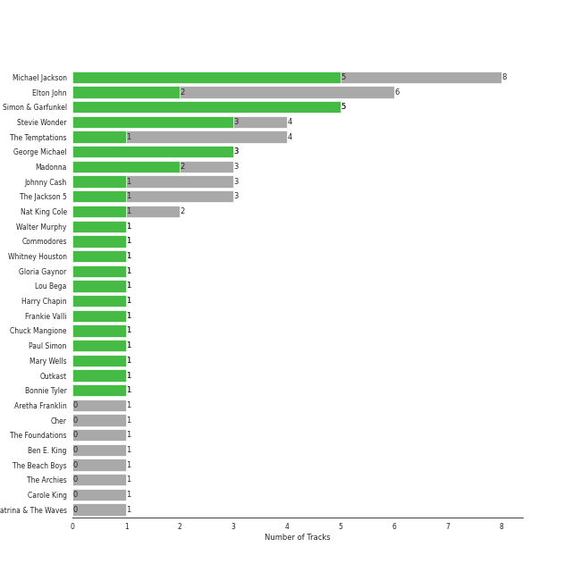
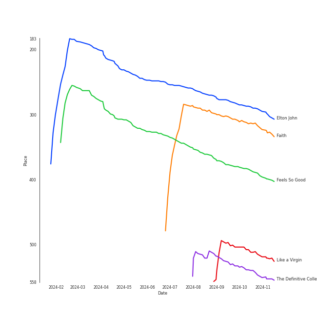
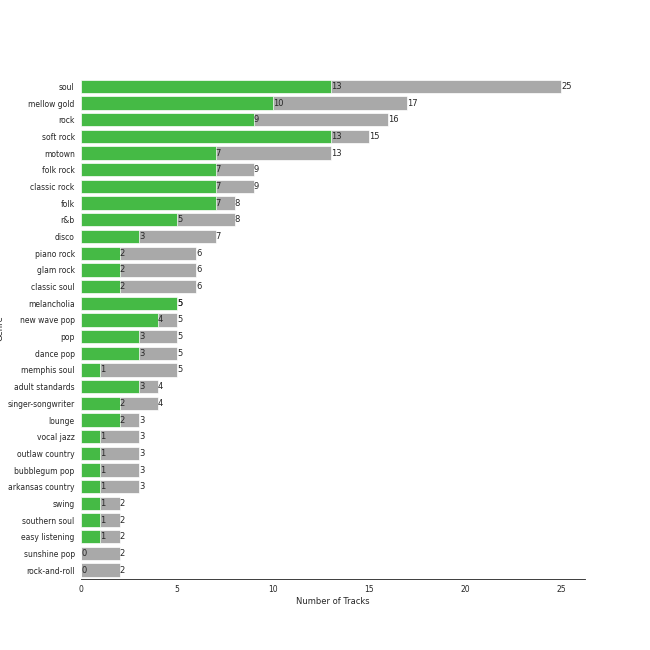
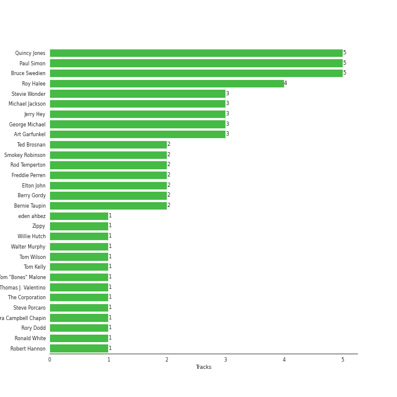
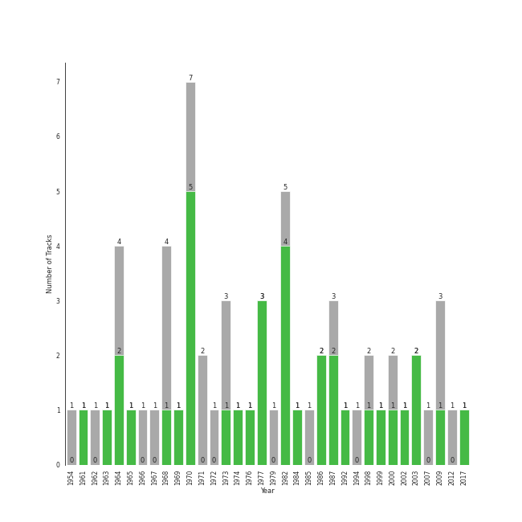

# Classic Pop

[63 tracks (36 liked) 🔗](https://open.spotify.com/playlist/6oXUc88JlAQTNdKvn529pD)

[See Track Features](audio_features.md)

[See Clusters](clusters/overview.md)

## Top Artists

| Art | Rank | Tracks | 💚 | Artist | 🔗 |
|:---|---:|---:|---:|:---|:---|
|  | 191 | 8 | 5 | [Michael Jackson](../../artists/michael_jackson/overview.md) | [🔗](https://open.spotify.com/artist/3fMbdgg4jU18AjLCKBhRSm) |
|  | 431 | 5 | 5 | [Simon & Garfunkel](../../artists/simon___garfunkel/overview.md) | [🔗](https://open.spotify.com/artist/70cRZdQywnSFp9pnc2WTCE) |
|  | 170 | 4 | 3 | Stevie Wonder | [🔗](https://open.spotify.com/artist/7guDJrEfX3qb6FEbdPA5qi) |
|  | 188 | 3 | 3 | George Michael | [🔗](https://open.spotify.com/artist/19ra5tSw0tWufvUp8GotLo) |
|  | 219 | 6 | 2 | Elton John | [🔗](https://open.spotify.com/artist/3PhoLpVuITZKcymswpck5b) |
|  | 362 | 3 | 2 | Madonna | [🔗](https://open.spotify.com/artist/6tbjWDEIzxoDsBA1FuhfPW) |
|  | 431 | 4 | 1 | The Temptations | [🔗](https://open.spotify.com/artist/3RwQ26hR2tJtA8F9p2n7jG) |
|  | 431 | 3 | 1 | Johnny Cash | [🔗](https://open.spotify.com/artist/6kACVPfCOnqzgfEF5ryl0x) |
|  | 210 | 3 | 1 | The Jackson 5 | [🔗](https://open.spotify.com/artist/2iE18Oxc8YSumAU232n4rW) |
|  | 246 | 2 | 1 | Nat King Cole | [🔗](https://open.spotify.com/artist/7v4imS0moSyGdXyLgVTIV7) |

See all 32 artists

| Art | Rank | Tracks | 💚 | Artist | 🔗 |
|:---|---:|---:|---:|:---|:---|
|  | 431 | 1 | 1 | Walter Murphy | [🔗](https://open.spotify.com/artist/73JBR5s2PVvUjGu6tIqjqx) |
|  | 431 | 1 | 1 | Commodores | [🔗](https://open.spotify.com/artist/6twIAGnYuIT1pncMAsXnEm) |
|  | 431 | 1 | 1 | Whitney Houston | [🔗](https://open.spotify.com/artist/6XpaIBNiVzIetEPCWDvAFP) |
|  | 431 | 1 | 1 | Gloria Gaynor | [🔗](https://open.spotify.com/artist/6V6WCgi7waF55bJmylC4H5) |
|  | 431 | 1 | 1 | Lou Bega | [🔗](https://open.spotify.com/artist/46lnlnlU0dXTDpoAUmH6Qx) |
|  | 431 | 1 | 1 | Harry Chapin | [🔗](https://open.spotify.com/artist/42q4Ivs7tAiCZ5C7eG5q4c) |
|  | 431 | 1 | 1 | Frankie Valli | [🔗](https://open.spotify.com/artist/3CDKmzJu6uwEGnPLLZffpD) |
|  | 300 | 1 | 1 | Chuck Mangione | [🔗](https://open.spotify.com/artist/2MMaIlHd8UvDW0mVRAncD6) |
|  | 431 | 1 | 1 | Paul Simon | [🔗](https://open.spotify.com/artist/2CvCyf1gEVhI0mX6aFXmVI) |
|  | 431 | 1 | 1 | Mary Wells | [🔗](https://open.spotify.com/artist/1cjZk1xXn3YCToNg3uJpA7) |
|  | 431 | 1 | 1 | Outkast | [🔗](https://open.spotify.com/artist/1G9G7WwrXka3Z1r7aIDjI7) |
|  | 431 | 1 | 1 | Bonnie Tyler | [🔗](https://open.spotify.com/artist/0SD4eZCN4Kr0wQk56hCdh2) |
|  | 431 | 1 | 0 | Aretha Franklin | [🔗](https://open.spotify.com/artist/7nwUJBm0HE4ZxD3f5cy5ok) |
|  | 431 | 1 | 0 | Cher | [🔗](https://open.spotify.com/artist/72OaDtakiy6yFqkt4TsiFt) |
|  | 431 | 1 | 0 | The Foundations | [🔗](https://open.spotify.com/artist/4GITZM5LCR2KcdlgEOrNLD) |
|  | 431 | 1 | 0 | Ben E. King | [🔗](https://open.spotify.com/artist/3plJVWt88EqjvtuB4ZDRV3) |
|  | 431 | 1 | 0 | The Beach Boys | [🔗](https://open.spotify.com/artist/3oDbviiivRWhXwIE8hxkVV) |
|  | 431 | 1 | 0 | The Archies | [🔗](https://open.spotify.com/artist/33QmoCkSqADuQEtMCysYLh) |
|  | 431 | 1 | 0 | Carole King | [🔗](https://open.spotify.com/artist/319yZVtYM9MBGqmSQnMyY6) |
|  | 431 | 1 | 0 | Katrina & The Waves | [🔗](https://open.spotify.com/artist/2TzHIUhVpeeDxyJPpQfnV3) |
|  | 431 | 1 | 0 | Bee Gees | [🔗](https://open.spotify.com/artist/1LZEQNv7sE11VDY3SdxQeN) |
|  | 431 | 1 | 0 | The Tokens | [🔗](https://open.spotify.com/artist/1GAJzApRTMmYZ9EjQ91VOy) |

## Top Tracks

Most and least listened tracks

| Rank | ​ | Most listened tracks | Rank | ​​ | Least listened tracks |
|---:|:---|:---|---:|:---|:---|
| 407 |  | Your Song | 987 |  | Respect |
| 444 |  | Faith - Remastered | 987 |  | Stayin Alive |
| 564 |  | Feels So Good | 987 |  | I Will Survive - Single Version |
| 762 |  | Like a Virgin | 987 |  | Papa Was A Rollin' Stone - Single Version |
| 811 |  | Superstition - Single Version | 987 |  | [Billie Jean](../../artists/michael_jackson/overview.md) |
| 987 |  | Walking On Sunshine | 987 |  | Like a Prayer |
| 987 |  | [Mrs. Robinson - From "The Graduate" Soundtrack](../../artists/simon___garfunkel/overview.md) | 987 |  | [The Boxer](../../artists/simon___garfunkel/overview.md) |
| 987 |  | You Can Call Me Al | 987 |  | My Girl |
| 987 |  | I Feel the Earth Move | 987 |  | Mambo No. 5 (a Little Bit of...) |
| 987 |  | [P.Y.T. (Pretty Young Thing)](../../artists/michael_jackson/overview.md) | 987 |  | Build Me Up Buttercup |

## Top Albums

| Art | Rank | Tracks | 💚 | Album | Release Date | 🔗 |
|:---|---:|---:|---:|:---|:---|:---|
|  | 650 | 5 | 4 | Thriller | 1982-11-30 | [🔗](https://open.spotify.com/album/2ANVost0y2y52ema1E9xAZ) |
|  | 650 | 3 | 3 | Bridge Over Troubled Water | 1970-01-26 | [🔗](https://open.spotify.com/album/0JwHz5SSvpYWuuCNbtYZoV) |
|  | 650 | 2 | 1 | Goodbye Yellow Brick Road - Remastered | 1973-10-05 | [🔗](https://open.spotify.com/album/5WupqgR68HfuHt3BMJtgun) |
|  | 650 | 2 | 1 | Celebration (Bonus Track Version) | 2009-09-18 | [🔗](https://open.spotify.com/album/4GU7z3q6fg90MWrkTacYYG) |
|  | 650 | 2 | 1 | Bad (Remastered) | 1987-08-31 | [🔗](https://open.spotify.com/album/3Us57CjssWnHjTUIXBuIeH) |
|  | 650 | 1 | 1 | Wednesday Morning, 3 A.M. | 1964-10-19 | [🔗](https://open.spotify.com/album/5pnJrocLlZ3FWEbcr2PTz0) |
|  | 650 | 1 | 1 | Verities & Balderdash | 1974 | [🔗](https://open.spotify.com/album/3nta4nhqWoWjc6LmHIB0kT) |
|  | 650 | 1 | 1 | The Very Best of Frankie Valli & The 4 Seasons | 2003-01-14 | [🔗](https://open.spotify.com/album/0NUEQILaBzavnzcMEs4buZ) |
|  | 650 | 1 | 1 | The Temptations Sing Smokey | 1965-03-22 | [🔗](https://open.spotify.com/album/45tweuKI0zdh8zgKo05cTw) |
|  | 650 | 1 | 1 | The Nat King Cole Story | 1961-09-25 | [🔗](https://open.spotify.com/album/3NoP1ifIejWkGSDsO9T2xH) |

See all 54 albums

| Art | Rank | Tracks | 💚 | Album | Release Date | 🔗 |
|:---|---:|---:|---:|:---|:---|:---|
|  | 542 | 1 | 1 | The Definitive Collection | 2002-10-29 | [🔗](https://open.spotify.com/album/4E1itnJOhTMRSATNaxh0Sq) |
|  | 650 | 1 | 1 | The Bodyguard - Original Soundtrack Album | 1992-11-17 | [🔗](https://open.spotify.com/album/7JVJlkNNobS0GSoy4tCS96) |
|  | 650 | 1 | 1 | Speakerboxxx/The Love Below | 2003 | [🔗](https://open.spotify.com/album/1UsmQ3bpJTyK6ygoOOjG1r) |
|  | 650 | 1 | 1 | Songs In The Key Of Life | 1976-09-28 | [🔗](https://open.spotify.com/album/6YUCc2RiXcEKS9ibuZxjt0) |
|  | 650 | 1 | 1 | Signed, Sealed And Delivered | 1970-08-07 | [🔗](https://open.spotify.com/album/54ootLtDyMZFr9obtWQvvO) |
|  | 650 | 1 | 1 | Secret Dreams and Forbidden Fire | 1986-05-05 | [🔗](https://open.spotify.com/album/4doea7KA9jw7nkm3IOs0PR) |
|  | 650 | 1 | 1 | Saturday Night Fever (The Original Movie Soundtrack Deluxe Edition) | 1977-11-15 | [🔗](https://open.spotify.com/album/3xaCKtqadm4KnviPFKEjs7) |
|  | 650 | 1 | 1 | Ring Of Fire: The Best Of Johnny Cash | 1963-08-06 | [🔗](https://open.spotify.com/album/0ucV57dbnqmrGv9d60r6X2) |
|  | 650 | 1 | 1 | Mary Wells Sings My Guy | 1964 | [🔗](https://open.spotify.com/album/6pUoPt9A6P1G8YJ5vw6GBP) |
|  | 650 | 1 | 1 | Listen Without Prejudice / MTV Unplugged (Deluxe) | 2017-10-20 | [🔗](https://open.spotify.com/album/0ZeOyoJHPD6czbTPAT9Qaj) |
|  | 512 | 1 | 1 | Like a Virgin | 1984-11-12 | [🔗](https://open.spotify.com/album/2IU9ftOgyRL2caQGWK1jjX) |
|  | 650 | 1 | 1 | Ladies And Gentlemen... The Best Of George Michael | 1998-11-09 | [🔗](https://open.spotify.com/album/3coLNlyStg9h7f8CZ103Rl) |
|  | 650 | 1 | 1 | Graceland (25th Anniversary Deluxe Edition) | 1986-08-12 | [🔗](https://open.spotify.com/album/6WgGWYw6XXQyLTsWt7tXky) |
|  | 384 | 1 | 1 | Feels So Good | 1977-12-08 | [🔗](https://open.spotify.com/album/5w0p1F0Q1wBqsX2UiX6CCD) |
|  | 314 | 1 | 1 | Faith | 1987-10-30 | [🔗](https://open.spotify.com/album/34K1Kvskt9arWy8E1Gz3Lw) |
|  | 287 | 1 | 1 | Elton John | 1970-04-10 | [🔗](https://open.spotify.com/album/69P9Ro0W286yLFgYwrGVN0) |
|  | 650 | 1 | 1 | Diana Ross Presents The Jackson 5 | 1969-12-18 | [🔗](https://open.spotify.com/album/51uoKRa8vT5SULrlF8s2t1) |
|  | 650 | 1 | 1 | Commodores | 1977-01-01 | [🔗](https://open.spotify.com/album/2tzbNCAUTmW4MIM2Ulvrwl) |
|  | 650 | 1 | 1 | Bookends | 1968-04-03 | [🔗](https://open.spotify.com/album/3bzgbgiytguTDnwzflAZr2) |
|  | 650 | 1 | 1 | A Little Bit of Mambo | 1999-07-19 | [🔗](https://open.spotify.com/album/13BmLGhVCLBn3XzKB8HIai) |
|  | 650 | 1 | 1 | 20th Century Masters: The Millennium Collection: Best Of Gloria Gaynor | 2000-01-01 | [🔗](https://open.spotify.com/album/2BU2SNYoIPtZvGEJckdIhx) |
|  | 650 | 1 | 0 | Wimoweh!!! - The Best Of The Tokens | 1994-08-29 | [🔗](https://open.spotify.com/album/6NBox81OQox7U4I0hZB9t0) |
|  | 650 | 1 | 0 | Unforgettable | 1954-01-01 | [🔗](https://open.spotify.com/album/7GBvXtxnvBluo2f4xBVNkm) |
|  | 650 | 1 | 0 | Third Album | 1970-09-08 | [🔗](https://open.spotify.com/album/5d6X8oegJmu9XKn9UBAswG) |
|  | 650 | 1 | 0 | The Very Best Of "The Archies" | 2007-11-07 | [🔗](https://open.spotify.com/album/7spOTrIPTM8RrMIAhCjLJi) |
|  | 650 | 1 | 0 | The Ultimate Bee Gees | 2009-11-03 | [🔗](https://open.spotify.com/album/5GucSY3249qHDx4v1Hcxry) |
|  | 650 | 1 | 0 | The Foundations | 1968-01-01 | [🔗](https://open.spotify.com/album/3j1kw5l2mEeKCUuXXwjhWp) |
|  | 650 | 1 | 0 | Tapestry | 1971 | [🔗](https://open.spotify.com/album/12n11cgnpjXKLeqrnIERoS) |
|  | 650 | 1 | 0 | Off the Wall | 1979-08-10 | [🔗](https://open.spotify.com/album/2ZytN2cY4Zjrr9ukb2rqTP) |
|  | 650 | 1 | 0 | Meet The Temptations | 1964 | [🔗](https://open.spotify.com/album/199rfdL0k6q5ReLA7V4KMt) |
|  | 650 | 1 | 0 | Madman Across The Water | 1971-11-05 | [🔗](https://open.spotify.com/album/2OZbaW9tgO62ndm375lFZr) |
|  | 650 | 1 | 0 | Katrina & The Waves | 1985 | [🔗](https://open.spotify.com/album/1UQG78YJjaBySRMh0A8Uw7) |
|  | 650 | 1 | 0 | I Walk the Line (Stereo Version) | 1964-06-13 | [🔗](https://open.spotify.com/album/1kd7QnBNMg5kygoclVuDqZ) |
|  | 650 | 1 | 0 | I Never Loved a Man the Way I Love You | 1967-03-10 | [🔗](https://open.spotify.com/album/5WndWfzGwCkHzAbQXVkg2V) |
|  | 650 | 1 | 0 | Honky Chateau | 1972-05-19 | [🔗](https://open.spotify.com/album/2ei2X6ghPnw7YRwQtAH075) |
|  | 650 | 1 | 0 | Gettin' Ready (Expanded Edition) | 1966 | [🔗](https://open.spotify.com/album/3RE8NUULcBzFvVtCmlI4lb) |
|  | 650 | 1 | 0 | For Once In My Life | 1968-12-01 | [🔗](https://open.spotify.com/album/3pPBbp1Nl9n1AM9xFpdKtZ) |
|  | 650 | 1 | 0 | Don't Shoot Me I'm Only The Piano Player | 1973-01-22 | [🔗](https://open.spotify.com/album/1reJ8DttK5EGwdyf7y9FBR) |
|  | 650 | 1 | 0 | Don't Play That Song (Mono) | 1962-08-20 | [🔗](https://open.spotify.com/album/18Fj7coTfyMi7mEPXIweN7) |
|  | 650 | 1 | 0 | Believe | 1998 | [🔗](https://open.spotify.com/album/0jZfbz0dNfDjPSg0hYJNth) |
|  | 650 | 1 | 0 | At Folsom Prison | 1968-05-01 | [🔗](https://open.spotify.com/album/4TJIdlY9hGSSTO1kUs1neh) |
|  | 650 | 1 | 0 | ABC | 1970-05-08 | [🔗](https://open.spotify.com/album/2tukc7pH4qTuXcfaHjLIBc) |
|  | 650 | 1 | 0 | 50 Big Ones: Greatest Hits | 2012-01-01 | [🔗](https://open.spotify.com/album/6cSZPNsr3tMEHo5QrMjk1F) |
|  | 650 | 1 | 0 | 20th Century Masters: The Millennium Collection: Best Of The Temptations, Vol. 2 - The '70s, '80s, '90s | 2000-01-11 | [🔗](https://open.spotify.com/album/2kzUxFepw1uLjbgqV537eP) |

## Top Record Labels

| Tracks | 💚 | Label |
|---:|---:|:---|
| 13 | 7 | [MOTOWN](../../labels/motown/overview.md) |
| 10 | 6 | [Epic](../../labels/epic/overview.md) |
| 8 | 6 | [UNI](../../labels/uni/overview.md) |
| 6 | 5 | [Columbia](../../labels/columbia/overview.md) |
| 4 | 2 | [Warner Records](../../labels/warner_records/overview.md) |
| 3 | 2 | [UMC (Universal Music Catalogue)](../../labels/umc_(universal_music_catalogue)/overview.md) |
| 2 | 2 | Sony Music CG |
| 2 | 2 | [Rhino](../../labels/rhino/overview.md) |
| 2 | 2 | Arista |
| 4 | 1 | [Legacy](../../labels/legacy/overview.md) |

See all 27 labels

| Tracks | 💚 | Label |
|---:|---:|:---|
| 3 | 1 | [Capitol Records](../../labels/capitol_records/overview.md) |
| 2 | 1 | Columbia Nashville Legacy |
| 2 | 1 | Bee Gees Catalog |
| 1 | 1 | Vorsicht Musik |
| 1 | 1 | [Sony Music Labels Inc.](../../labels/sony_music_labels_inc_/overview.md) |
| 1 | 1 | Sony Music Entertainment |
| 1 | 1 | [Polydor Records](../../labels/polydor_records/overview.md) |
| 1 | 1 | Legacy Recordings |
| 1 | 1 | Elektra |
| 1 | 1 | A&M |
| 3 | 0 | [EMI](../../labels/emi/overview.md) |
| 2 | 0 | Rhino Atlantic |
| 1 | 0 | Ron Dante |
| 1 | 0 | [RCA Records Label](../../labels/rca_records_label/overview.md) |
| 1 | 0 | Ode |
| 1 | 0 | Castle Communications |
| 1 | 0 | CAPITOL CATALOG MKT (C92) |

## Genres

| Tracks | 💚 | Genre |
|---:|---:|:---|
| 25 | 13 | [soul](../../genres/soul/overview.md) |
| 15 | 13 | [soft rock](../../genres/soft_rock/overview.md) |
| 17 | 10 | [mellow gold](../../genres/mellow_gold/overview.md) |
| 16 | 9 | [rock](../../genres/rock/overview.md) |
| 13 | 7 | motown |
| 9 | 7 | folk rock |
| 9 | 7 | [classic rock](../../genres/classic_rock/overview.md) |
| 8 | 7 | [folk](../../genres/folk/overview.md) |
| 8 | 5 | [r&b](../../genres/r_b/overview.md) |
| 5 | 5 | melancholia |

See all 51 genres

| Tracks | 💚 | Genre |
|---:|---:|:---|
| 5 | 4 | new wave pop |
| 7 | 3 | disco |
| 5 | 3 | [pop](../../genres/pop/overview.md) |
| 5 | 3 | [dance pop](../../genres/dance_pop/overview.md) |
| 4 | 3 | [adult standards](../../genres/adult_standards/overview.md) |
| 6 | 2 | [piano rock](../../genres/piano_rock/overview.md) |
| 6 | 2 | glam rock |
| 6 | 2 | classic soul |
| 4 | 2 | [singer-songwriter](../../genres/singer-songwriter/overview.md) |
| 3 | 2 | [lounge](../../genres/lounge/overview.md) |
| 5 | 1 | memphis soul |
| 3 | 1 | [vocal jazz](../../genres/vocal_jazz/overview.md) |
| 3 | 1 | outlaw country |
| 3 | 1 | bubblegum pop |
| 3 | 1 | arkansas country |
| 2 | 1 | swing |
| 2 | 1 | southern soul |
| 2 | 1 | easy listening |
| 1 | 1 | southern hip hop |
| 1 | 1 | smooth jazz |
| 1 | 1 | [rap](../../genres/rap/overview.md) |
| 1 | 1 | quiet storm |
| 1 | 1 | [permanent wave](../../genres/permanent_wave/overview.md) |
| 1 | 1 | old school atlanta hip hop |
| 1 | 1 | latin pop |
| 1 | 1 | jazz trumpet |
| 1 | 1 | [hip hop](../../genres/hip_hop/overview.md) |
| 1 | 1 | hammond organ |
| 1 | 1 | funk |
| 1 | 1 | europop |
| 1 | 1 | dirty south rap |
| 1 | 1 | country rock |
| 1 | 1 | atl hip hop |
| 2 | 0 | sunshine pop |
| 2 | 0 | rock-and-roll |
| 1 | 0 | [psychedelic rock](../../genres/psychedelic_rock/overview.md) |
| 1 | 0 | jazz blues |
| 1 | 0 | doo-wop |
| 1 | 0 | classic canadian rock |
| 1 | 0 | brill building pop |
| 1 | 0 | baroque pop |

## Top Producers

| Art | Producer | Tracks | Credit Types |
|:---|:---|---:|:---|
| | Quincy Jones | 5 | Producer, Arranger, Songwriter |
|  | Paul Simon | 5 | Lyricist, Producer, Songwriter |
| | Bruce Swedien | 5 | Producer |
| | Roy Halee | 4 | Producer |
| | Art Garfunkel | 3 | Producer |
|  | [Michael Jackson](../../artists/michael_jackson/overview.md) | 3 | Lyricist, Producer, Songwriter, Arranger |
| | Jerry Hey | 3 | Arranger |
|  | Stevie Wonder | 3 | Lyricist, Songwriter |
|  | George Michael | 3 | Arranger, Producer, Songwriter, Lyricist |
|  | Elton John | 2 | Songwriter |

View all

| Art | Producer | Tracks | Credit Types |
|:---|:---|---:|:---|
| | Rod Temperton | 2 | Arranger, Lyricist, Songwriter |
| | Smokey Robinson | 2 | Lyricist, Songwriter |
| | Ted Brosnan | 2 | Producer |
| | Berry Gordy | 2 | Songwriter |
| | Bernie Taupin | 2 | Lyricist |
| | Freddie Perren | 2 | Songwriter |
| | Michael Vail Blum | 1 | Producer |
| | Neal Pogue | 1 | Producer |
| | Holly Sherwood | 1 | Arranger |
| | John Jansen | 1 | Producer |
| | Rory Dodd | 1 | Arranger |
| | Zippy | 1 | Lyricist, Producer |
| | Ronald White | 1 | Songwriter |
| | Billy Steinberg | 1 | Songwriter |
| | Jeremy Lubbock | 1 | Arranger |
| | D. Fact | 1 | Producer |
| | Greg Phillinganes | 1 | Producer |
| | Pérez Prado (Pérez Prado) | 1 | Songwriter |
| | David Foster | 1 | Arranger, Producer, Songwriter |
|  | Harry Chapin | 1 | Songwriter |
| | Eric Troyer | 1 | Arranger |
| | Fonce Mizell | 1 | Songwriter |
|  | André 3000 | 1 | Producer |
| | Hal Davis | 1 | Songwriter |
| | Bill Wolfer | 1 | Producer |
| | Gus Dudgeon | 1 | Producer |
| | James Anthony Carmichael | 1 | Producer |
| | David Hentschel | 1 | Producer |
| | Bob Crewe | 1 | Songwriter |
| | David Reitzas | 1 | Producer |
| | Ellen Foley | 1 | Arranger |
|  | Nile Rodgers | 1 | Producer |
|  | Walter Murphy | 1 | Arranger |
| | André Benjamin (Benjamin, André) | 1 | Lyricist, Songwriter |
| | Dean Pitchford | 1 | Lyricist |
| | Thomas J. Valentino | 1 | Producer |
| | Robert Hannon | 1 | Producer |
| | Donn Landee | 1 | Producer |
| | Jim Steinman | 1 | Producer, Songwriter |
| | Lee Gillette | 1 | Producer |
| | Jason Corsaro | 1 | Producer |
| | Lionel Richie | 1 | Lyricist, Songwriter |
| | Don Law | 1 | Producer |
| | Arthur Payson | 1 | Producer |
| | Dino Fekaris | 1 | Songwriter |
| | The Corporation | 1 | Producer |
| | Chikapa "Ray" Phiri | 1 | Arranger |
| | Bob Gaudio | 1 | Songwriter |
| | eden ahbez | 1 | Lyricist, Songwriter |
| | Rob Eaton | 1 | Producer |
| | Mick Guzauski | 1 | Producer |
|  | [Ludwig van Beethoven](../../artists/ludwig_van_beethoven/overview.md) | 1 | Songwriter |
| | Del Newman | 1 | Arranger |
| | James Ingram | 1 | Arranger, Songwriter |
| | Neil Dorfsman | 1 | Producer |
| | Anthony Marinelli | 1 | Producer |
| | Rob Mounsey | 1 | Arranger |
| | John Philip Shenale | 1 | Producer |
| | Tom Kelly | 1 | Songwriter |
| | Bill Bottrell | 1 | Producer |
| | Willie Hutch | 1 | Songwriter |
| | Patrick Leonard | 1 | Producer, Songwriter |
| | Steve Porcaro | 1 | Producer |
|  | Madonna | 1 | Producer, Songwriter |
| | Frank Jones | 1 | Producer |
| | Deke Richards | 1 | Songwriter |
| | Andrew Ridgeley | 1 | Songwriter |
| | L.A. Reid | 1 | Producer |
| | Pete Novak | 1 | Producer |
| | Bob West | 1 | Songwriter |
|  | Lou Bega | 1 | Lyricist, Producer |
| | John Frye | 1 | Producer |
| | Tom Wilson | 1 | Producer |
| | Sandra Campbell Chapin | 1 | Songwriter |
| | Tom "Bones" Malone | 1 | Arranger |
| | Linda Thompson | 1 | Songwriter |
| | June Carter Cash | 1 | Songwriter |
| | Frank Lio | 1 | Producer |
|  | Chuck Mangione | 1 | Songwriter |
| | Merle Kilgore | 1 | Songwriter |

## Years

| ​ | 10 newest albums | ​​ | 10 oldest albums |
|:---|:---|:---|:---|
|  | Listen Without Prejudice / MTV Unplugged (Deluxe) (2017-10-20) |  | Unforgettable (1954-01-01) |
|  | 50 Big Ones: Greatest Hits (2012-01-01) |  | The Nat King Cole Story (1961-09-25) |
|  | The Ultimate Bee Gees (2009-11-03) |  | Don't Play That Song (Mono) (1962-08-20) |
|  | Celebration (Bonus Track Version) (2009-09-18) |  | Ring Of Fire: The Best Of Johnny Cash (1963-08-06) |
|  | The Very Best Of "The Archies" (2007-11-07) |  | Mary Wells Sings My Guy (1964) |
|  | The Very Best of Frankie Valli & The 4 Seasons (2003-01-14) |  | Meet The Temptations (1964) |
|  | Speakerboxxx/The Love Below (2003) |  | I Walk the Line (Stereo Version) (1964-06-13) |
|  | The Definitive Collection (2002-10-29) |  | Wednesday Morning, 3 A.M. (1964-10-19) |
|  | 20th Century Masters: The Millennium Collection: Best Of The Temptations, Vol. 2 - The '70s, '80s, '90s (2000-01-11) |  | The Temptations Sing Smokey (1965-03-22) |
|  | 20th Century Masters: The Millennium Collection: Best Of Gloria Gaynor (2000-01-01) |  | Gettin' Ready (Expanded Edition) (1966) |