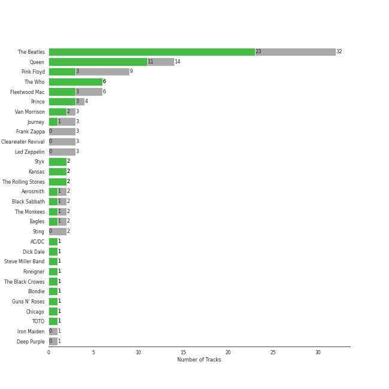

# Classic Rock

[96 songs](classic_rock_tracks.md)

## Top Artists

See all 27 artists

|   Number of Tracks | Art                                                                                              | Artist                                   | 🔗                                                           |
|-------------------:|:-------------------------------------------------------------------------------------------------|:-----------------------------------------|:------------------------------------------------------------|
|                 31 |  | [The Beatles](../artists/the_beatles.md) | [🔗](https://open.spotify.com/artist/3WrFJ7ztbogyGnTHbHJFl2) |
|                 14 |  | [Queen](../artists/queen.md)             | [🔗](https://open.spotify.com/artist/1dfeR4HaWDbWqFHLkxsg1d) |
|                  6 |  | The Who                                  | [🔗](https://open.spotify.com/artist/67ea9eGLXYMsO2eYQRui3w) |
|                  6 |  | Fleetwood Mac                            | [🔗](https://open.spotify.com/artist/08GQAI4eElDnROBrJRGE0X) |
|                  3 |  | Van Morrison                             | [🔗](https://open.spotify.com/artist/44NX2ffIYHr6D4n7RaZF7A) |
|                  3 |  | Led Zeppelin                             | [🔗](https://open.spotify.com/artist/36QJpDe2go2KgaRleHCDTp) |
|                  3 |  | Journey                                  | [🔗](https://open.spotify.com/artist/0rvjqX7ttXeg3mTy8Xscbt) |
|                  2 |  | Aerosmith                                | [🔗](https://open.spotify.com/artist/7Ey4PD4MYsKc5I2dolUwbH) |
|                  2 |  | Prince                                   | [🔗](https://open.spotify.com/artist/5a2EaR3hamoenG9rDuVn8j) |
|                  2 |  | Black Sabbath                            | [🔗](https://open.spotify.com/artist/5M52tdBnJaKSvOpJGz8mfZ) |
|                  2 |  | Styx                                     | [🔗](https://open.spotify.com/artist/4salDzkGmfycRqNUbyBphh) |
|                  2 |  | The Monkees                              | [🔗](https://open.spotify.com/artist/320EPCSEezHt1rtbfwH6Ck) |
|                  2 |  | Metallica                                | [🔗](https://open.spotify.com/artist/2ye2Wgw4gimLv2eAKyk1NB) |
|                  2 |  | Kansas                                   | [🔗](https://open.spotify.com/artist/2hl0xAkS2AIRAu23TVMBG1) |
|                  2 |  | The Rolling Stones                       | [🔗](https://open.spotify.com/artist/22bE4uQ6baNwSHPVcDxLCe) |
|                  2 |  | Mastodon                                 | [🔗](https://open.spotify.com/artist/1Dvfqq39HxvCJ3GvfeIFuT) |
|                  2 |  | Eagles                                   | [🔗](https://open.spotify.com/artist/0ECwFtbIWEVNwjlrfc6xoL) |
|                  1 |  | AC/DC                                    | [🔗](https://open.spotify.com/artist/711MCceyCBcFnzjGY4Q7Un) |
|                  1 |  | Iron Maiden                              | [🔗](https://open.spotify.com/artist/6mdiAmATAx73kdxrNrnlao) |
|                  1 |  | Steve Miller Band                        | [🔗](https://open.spotify.com/artist/6QtGlUje9TIkLrgPZrESuk) |
|                  1 |  | Foreigner                                | [🔗](https://open.spotify.com/artist/6IRouO5mvvfcyxtPDKMYFN) |
|                  1 |  | The Black Crowes                         | [🔗](https://open.spotify.com/artist/5krkohEVJYw0qoB5VWwxaC) |
|                  1 |  | Deep Purple                              | [🔗](https://open.spotify.com/artist/568ZhdwyaiCyOGJRtNYhWf) |
|                  1 |  | Guns N' Roses                            | [🔗](https://open.spotify.com/artist/3qm84nBOXUEQ2vnTfUTTFC) |
|                  1 |  | Chicago                                  | [🔗](https://open.spotify.com/artist/3iDD7bnsjL9J4fO298r0L0) |
|                  1 |  | Survivor                                 | [🔗](https://open.spotify.com/artist/26bcq2nyj5GB7uRr558iQg) |
|                  1 |  | Sting                                    | [🔗](https://open.spotify.com/artist/0Ty63ceoRnnJKVEYP0VQpk) |

## Top Albums

See all 65 albums

|   Number of Tracks | Art                                                                                              | Album                                              | 🔗                                                          |
|-------------------:|:-------------------------------------------------------------------------------------------------|:---------------------------------------------------|:-----------------------------------------------------------|
|                  9 |  | Abbey Road (Remastered)                            | [🔗](https://open.spotify.com/album/0ETFjACtuP2ADo6LFhL6HN) |
|                  5 |  | The Beatles (Remastered)                           | [🔗](https://open.spotify.com/album/1klALx0u4AavZNEvC4LrTL) |
|                  3 |  | The Game                                           | [🔗](https://open.spotify.com/album/1h0j80HhdzIMsUGUFiVkqa) |
|                  3 |  | Rumours (Super Deluxe)                             | [🔗](https://open.spotify.com/album/0BwWUstDMUbgq2NYONRqlu) |
|                  3 |  | Revolver (Remastered)                              | [🔗](https://open.spotify.com/album/3PRoXYsngSwjEQWR5PsHWR) |
|                  3 |  | Magical Mystery Tour (Remastered)                  | [🔗](https://open.spotify.com/album/2BtE7qm1qzM80p9vLSiXkj) |
|                  3 |  | Let It Be (Remastered)                             | [🔗](https://open.spotify.com/album/0jTGHV5xqHPvEcwL8f6YU5) |
|                  2 |  | Who's Next (Deluxe Edition)                        | [🔗](https://open.spotify.com/album/5MqyhhHbT13zsloD3uHhlQ) |
|                  2 |  | Purple Rain                                        | [🔗](https://open.spotify.com/album/7nXJ5k4XgRj5OLg9m8V3zc) |
|                  2 |  | News Of The World                                  | [🔗](https://open.spotify.com/album/3TKTjR4E3LAMfRsPeRsNhT) |
|                  2 |  | Metallica                                          | [🔗](https://open.spotify.com/album/6QdCohkHKNTVoaSx1ZzitH) |
|                  2 |  | Led Zeppelin IV (Deluxe Edition)                   | [🔗](https://open.spotify.com/album/44Ig8dzqOkvkGDzaUof9lK) |
|                  2 |  | Jazz                                               | [🔗](https://open.spotify.com/album/5X3rA8To5GDOeIWdQyMEcE) |
|                  2 |  | Fleetwood Mac                                      | [🔗](https://open.spotify.com/album/5VIQ3VaAoRKOEpJ0fewdvo) |
|                  2 |  | A Night At The Opera                               | [🔗](https://open.spotify.com/album/3KCJzwKOdBxDu6TKaFPqM9) |
|                  2 |  | A Day At The Races                                 | [🔗](https://open.spotify.com/album/3f45rzbU4dYQBTV9v5RFBB) |
|                  1 |  | Yellow Submarine (Remastered)                      | [🔗](https://open.spotify.com/album/1gKZ5A1ndFqbcrWtW85cCy) |
|                  1 |  | With The Beatles (Remastered)                      | [🔗](https://open.spotify.com/album/1aYdiJk6XKeHWGO3FzHHTr) |
|                  1 |  | Who's Next (Expanded Edition)                      | [🔗](https://open.spotify.com/album/53PBYiedQrASAs5sy63JqT) |
|                  1 |  | Who Are You                                        | [🔗](https://open.spotify.com/album/7at3CV9Y9P57wsEXkfU0q8) |
|                  1 |  | Tusk (2015 Remaster)                               | [🔗](https://open.spotify.com/album/5FIN8pyPVx8ggNs5jQ86Re) |
|                  1 |  | Toys In The Attic                                  | [🔗](https://open.spotify.com/album/36IxIOGEBAXVozDSiVs09B) |
|                  1 |  | Tommy                                              | [🔗](https://open.spotify.com/album/5cT7ee1sy2oEbFalP4asS4) |
|                  1 |  | The Works                                          | [🔗](https://open.spotify.com/album/0FbnXAGmgmWBmNthZSgm43) |
|                  1 |  | The Ultimate Collection                            | [🔗](https://open.spotify.com/album/6TcPqftScGmR0aEgIb43Vv) |
|                  1 |  | The Joker                                          | [🔗](https://open.spotify.com/album/5uYNj1HkZrWKAkhEYcGmJr) |
|                  1 |  | The Grand Illusion                                 | [🔗](https://open.spotify.com/album/6MFIBPVrZjHjP0pPkVF3IU) |
|                  1 |  | The Birds, The Bees, & The Monkees                 | [🔗](https://open.spotify.com/album/2Ov6zb7NfgDh3EXSIIWrb2) |
|                  1 |  | Ten Summoner's Tales                               | [🔗](https://open.spotify.com/album/5kV0KBXfELibs6qQJLmOtg) |
|                  1 |  | Sheer Heart Attack                                 | [🔗](https://open.spotify.com/album/4yO8TpSaJtUKkkjmsA4VXf) |
|                  1 |  | Shake Your Money Maker                             | [🔗](https://open.spotify.com/album/2NRRQLuW6j3EsoWpIl2MR3) |
|                  1 |  | Sgt. Pepper's Lonely Hearts Club Band (Remastered) | [🔗](https://open.spotify.com/album/6QaVfG1pHYl1z15ZxkvVDW) |
|                  1 |  | Rubber Soul (Remastered)                           | [🔗](https://open.spotify.com/album/50o7kf2wLwVmOTVYJOTplm) |
|                  1 |  | Rocky IV                                           | [🔗](https://open.spotify.com/album/3t3BbpFJiGcXl4jI5CRLLA) |
|                  1 |  | Point Of Know Return (Expanded Edition)            | [🔗](https://open.spotify.com/album/6oU298pdPTCQnMx1PYwyUA) |
|                  1 |  | Please Please Me (Remastered)                      | [🔗](https://open.spotify.com/album/3KzAvEXcqJKBF97HrXwlgf) |
|                  1 |  | Pieces Of Eight                                    | [🔗](https://open.spotify.com/album/294yFGYq9SBXWR4g6dK63D) |
|                  1 |  | Piece of Mind (2015 - Remaster)                    | [🔗](https://open.spotify.com/album/6iVSpex7UohpwPOYZEYmvm) |
|                  1 |  | Paranoid (Remaster)                                | [🔗](https://open.spotify.com/album/6r7LZXAVueS5DqdrvXJJK7) |
|                  1 |  | Out Of Our Heads                                   | [🔗](https://open.spotify.com/album/2Q5MwpTmtjscaS34mJFXQQ) |
|                  1 |  | Once More 'Round the Sun                           | [🔗](https://open.spotify.com/album/7mEkBi9a2p2f1WQbnH8Qk5) |
|                  1 |  | My Generation (Stereo Version)                     | [🔗](https://open.spotify.com/album/6Oc6Ok1Oawu8lRkjmD4mXy) |
|                  1 |  | More of The Monkees (Deluxe Edition)               | [🔗](https://open.spotify.com/album/50zHjIiTOZM232gnWvOydX) |
|                  1 |  | Moondance (Expanded Edition)                       | [🔗](https://open.spotify.com/album/6yNYC35npMBHbxG0Vle83O) |
|                  1 |  | Moondance (Deluxe Edition)                         | [🔗](https://open.spotify.com/album/7diHYi0CglGJekoM3KaWBK) |
|                  1 |  | Machine Head                                       | [🔗](https://open.spotify.com/album/1EK3a0Yctg4d3nGQzE4Uty) |
|                  1 |  | Leviathan                                          | [🔗](https://open.spotify.com/album/6khFoLWnJZDQvZ7Pijym3b) |
|                  1 |  | Leftoverture (Expanded Edition)                    | [🔗](https://open.spotify.com/album/7MejfRSNnrpcLZIxkeZDqR) |
|                  1 |  | Led Zeppelin III (Remaster)                        | [🔗](https://open.spotify.com/album/6P5QHz4XtxOmS5EuiGIPut) |
|                  1 |  | Innuendo                                           | [🔗](https://open.spotify.com/album/5yAM3CcaXF6DPRJW3oL6Ya) |
|                  1 |  | Infinity                                           | [🔗](https://open.spotify.com/album/7K4Nk5fHkCuzNm5A6mdo2U) |
|                  1 |  | Hotel California (2013 Remaster)                   | [🔗](https://open.spotify.com/album/2widuo17g5CEC66IbzveRu) |
|                  1 |  | Help! (Remastered)                                 | [🔗](https://open.spotify.com/album/0PT5m6hwPRrpBwIHVnvbFX) |
|                  1 |  | Foreigner (Expanded)                               | [🔗](https://open.spotify.com/album/1OU7zJvUfgxxPHgkTClt1M) |
|                  1 |  | Escape (Bonus Track Version)                       | [🔗](https://open.spotify.com/album/43wpzak9OmQfrjyksuGwp0) |
|                  1 |  | Desperado (2013 Remaster)                          | [🔗](https://open.spotify.com/album/09WBxbis5Sixt01FVMs8UM) |
|                  1 |  | Departure                                          | [🔗](https://open.spotify.com/album/2OyVtIEp7O7a6o82DF4Ba5) |
|                  1 |  | Chicago IX: Chicago's Greatest Hits                | [🔗](https://open.spotify.com/album/5qWGV0fd7hpdptJYI4G9Dd) |
|                  1 |  | Blowin' Your Mind!                                 | [🔗](https://open.spotify.com/album/7dsWupQRlFuhG8FGiQAUjC) |
|                  1 |  | Back In Black                                      | [🔗](https://open.spotify.com/album/6mUdeDZCsExyJLMdAfDuwh) |
|                  1 |  | Appetite For Destruction                           | [🔗](https://open.spotify.com/album/28yHV3Gdg30AiB8h8em1eW) |
|                  1 |  | Aftermath                                          | [🔗](https://open.spotify.com/album/72qrnM4yUNMDDlWiqKc8iY) |
|                  1 |  | Aerosmith                                          | [🔗](https://open.spotify.com/album/19lEZSnCCbVEkKchoPQWDZ) |
|                  1 |  | A Hard Day's Night (Remastered)                    | [🔗](https://open.spotify.com/album/6wCttLq0ADzkPgtRnUihLV) |
|                  1 |  | 1 (Remastered)                                     | [🔗](https://open.spotify.com/album/7vEJAtP3KgKSpOHVgwm3Eh) |

## Top Record Labels

See all 23 labels

|   Number of Tracks | Label                                                                           |
|-------------------:|:--------------------------------------------------------------------------------|
|                 30 | [EMI Catalogue](../labels/emi_catalogue.md)                                     |
|                 14 | [Rhino](../labels/rhino.md)                                                     |
|                 14 | [Hollywood Records](../labels/hollywood_records.md)                             |
|                 13 | [Warner Records](../labels/warner_records.md)                                   |
|                  7 | [Columbia](../labels/columbia.md)                                               |
|                  6 | [Legacy](../labels/legacy.md)                                                   |
|                  3 | [Geffen](../labels/geffen.md)                                                   |
|                  3 | [Atlantic Records](../labels/atlantic_records.md)                               |
|                  3 | [A&M](../labels/a_m.md)                                                         |
|                  2 | [UMC (Universal Music Catalogue)](../labels/umc__universal_music_catalogue_.md) |
|                  2 | [Polydor Records](../labels/polydor_records.md)                                 |
|                  2 | [Epic](../labels/epic.md)                                                       |
|                  2 | [Elektra](../labels/elektra.md)                                                 |
|                  2 | [Blackened Recordings](../labels/blackened_recordings.md)                       |
|                  2 | [ABKCO Music and Records](../labels/abkco_music_and_records.md)                 |
|                  1 | [Volcano](../labels/volcano.md)                                                 |
|                  1 | [Sanctuary Records](../labels/sanctuary_records.md)                             |
|                  1 | [Rhino Atlantic](../labels/rhino_atlantic.md)                                   |
|                  1 | [Reprise](../labels/reprise.md)                                                 |
|                  1 | [Relapse Records](../labels/relapse_records.md)                                 |
|                  1 | [Guns N Roses P&D](../labels/guns_n_roses_p_d.md)                               |
|                  1 | [CAPITOL CATALOG MKT (C92)](../labels/capitol_catalog_mkt__c92_.md)             |
|                  1 | [American Recordings Catalog P&D](../labels/american_recordings_catalog_p_d.md) |

## Genres

See all 50 genres

|   Number of Tracks | Genre                                               |
|-------------------:|:----------------------------------------------------|
|                 92 | [rock](../genres/rock.md)                           |
|                 85 | [classic rock](../genres/classic_rock.md)           |
|                 41 | [psychedelic rock](../genres/psychedelic_rock.md)   |
|                 39 | british invasion                                    |
|                 34 | album rock                                          |
|                 33 | beatlesque                                          |
|                 32 | hard rock                                           |
|                 31 | merseybeat                                          |
|                 25 | [soft rock](../genres/soft_rock.md)                 |
|                 23 | [mellow gold](../genres/mellow_gold.md)             |
|                 14 | glam rock                                           |
|                 10 | art rock                                            |
|                  9 | yacht rock                                          |
|                  9 | [singer-songwriter](../genres/singer_songwriter.md) |
|                  9 | [folk rock](../genres/folk_rock.md)                 |
|                  9 | blues rock                                          |
|                  8 | metal                                               |
|                  5 | heartland rock                                      |
|                  5 | country rock                                        |
|                  4 | symphonic rock                                      |
|                  4 | progressive rock                                    |
|                  3 | roots rock                                          |
|                  3 | folk                                                |
|                  2 | uk doom metal                                       |
|                  2 | thrash metal                                        |
|                  2 | synth funk                                          |
|                  2 | sunshine pop                                        |
|                  2 | stoner rock                                         |
|                  2 | stoner metal                                        |
|                  2 | sludge metal                                        |
|                  2 | progressive sludge                                  |
|                  2 | progressive groove metal                            |
|                  2 | old school thrash                                   |
|                  2 | nu metal                                            |
|                  2 | minneapolis sound                                   |
|                  2 | funk rock                                           |
|                  2 | funk                                                |
|                  2 | bubblegum pop                                       |
|                  2 | birmingham metal                                    |
|                  2 | atlanta metal                                       |
|                  2 | alternative metal                                   |
|                  1 | southern rock                                       |
|                  1 | sophisti-pop                                        |
|                  1 | [pop rock](../genres/pop_rock.md)                   |
|                  1 | permanent wave                                      |
|                  1 | nwobhm                                              |
|                  1 | jam band                                            |
|                  1 | glam metal                                          |
|                  1 | australian rock                                     |
|                  1 | [adult standards](../genres/adult_standards.md)     |

## Audio Features

| 10 most Danceable tracks                     | 10 least Danceable tracks             |
|:---------------------------------------------|:--------------------------------------|
| Another One Bites The Dust                   | Iron Man                              |
| I Want To Break Free                         | Because - Remastered 2009             |
| Dreams - 2004 Remaster                       | Come Sail Away                        |
| Eye of the Tiger                             | Back In Black                         |
| Get Back - Remastered 2009                   | Dream On                              |
| Sara - 2015 Remaster                         | The Trooper - 2015 Remaster           |
| When Doves Cry                               | Across The Universe - Remastered 2009 |
| Rhiannon                                     | Fat Bottomed Girls                    |
| (I Can't Get No) Satisfaction - Mono Version | Desperado - 2013 Remaster             |
| When I'm Sixty Four - Remastered 2009        | Lights                                |

| 10 most Energetic tracks        | 10 least Energetic tracks             |
|:--------------------------------|:--------------------------------------|
| When Doves Cry                  | Moondance - 2013 Remaster             |
| The Motherload                  | Eleanor Rigby - Remastered 2009       |
| Sweet Child O' Mine             | Because - Remastered 2009             |
| Go Your Own Way - 2004 Remaster | When I'm Sixty Four - Remastered 2009 |
| Blood and Thunder               | Desperado - 2013 Remaster             |
| Immigrant Song - Remaster       | Crazy Love - 2013 Remaster            |
| Any Way You Want It             | Yesterday - Remastered 2009           |
| The Trooper - 2015 Remaster     | Landslide                             |
| 25 or 6 to 4                    | Golden Slumbers - Remastered 2009     |
| Black Dog - Remaster            | Blackbird - Remastered 2009           |

| 10 most Speechy tracks                      | 10 least Speechy tracks             |
|:--------------------------------------------|:------------------------------------|
| Don't Stop Me Now                           | Golden Slumbers - Remastered 2009   |
| Strawberry Fields Forever - Remastered 2009 | Dreams - 2004 Remaster              |
| Another One Bites The Dust                  | Save Me                             |
| Crazy Love - 2013 Remaster                  | Carry That Weight - Remastered 2009 |
| Paint It, Black                             | Because - Remastered 2009           |
| Black Dog - Remaster                        | Cold as Ice                         |
| Love Me Do - Remastered 2009                | Hotel California - 2013 Remaster    |
| The Motherload                              | Nothing Else Matters                |
| Iron Man                                    | Octopus's Garden - Remastered 2009  |
| Blood and Thunder                           | Fields Of Gold                      |

| 10 most Acoustic tracks         | 10 least Acoustic tracks         |
|:--------------------------------|:---------------------------------|
| Desperado - 2013 Remaster       | The Chain - 2004 Remaster        |
| Eleanor Rigby - Remastered 2009 | Hotel California - 2013 Remaster |
| Landslide                       | Iron Man                         |
| Yesterday - Remastered 2009     | Carry on Wayward Son             |
| Crazy Love - 2013 Remaster      | Hard To Handle                   |
| Because - Remastered 2009       | Any Way You Want It              |
| Blackbird - Remastered 2009     | Enter Sandman                    |
| I'm a Believer - 2006 Remaster  | Paranoid - 2012 - Remaster       |
| Let It Be - Remastered 2009     | Blood and Thunder                |
| We Will Rock You                | The Motherload                   |

| 10 most Instrumental tracks                    | 10 least Instrumental tracks         |
|:-----------------------------------------------|:-------------------------------------|
| Blood and Thunder                              | We Are The Champions                 |
| Smoke on the Water                             | A Hard Day's Night - Remastered 2009 |
| Come Together - Remastered 2009                | Yesterday - Remastered 2009          |
| Won't Get Fooled Again - Remix                 | Good Old Fashioned Lover Boy         |
| I Want You (She's So Heavy) - Remastered 2009  | Daydream Believer                    |
| Baba O'Riley                                   | Brown Eyed Girl                      |
| Immigrant Song - Remaster                      | Yellow Submarine - Remastered 2009   |
| Another One Bites The Dust                     | Don't Stop Believin'                 |
| You Never Give Me Your Money - Remastered 2009 | All My Loving - Remastered 2009      |
| Rhiannon                                       | Cold as Ice                          |

| 10 most Live tracks                | 10 least Live tracks             |
|:-----------------------------------|:---------------------------------|
| Purple Rain                        | Who Are You                      |
| Revolution 1 - Remastered 2009     | Good Old Fashioned Lover Boy     |
| Get Back - Remastered 2009         | Enter Sandman                    |
| I Am The Walrus - Remastered 2009  | Won't Get Fooled Again - Remix   |
| Don't Stop Me Now                  | Hotel California - 2013 Remaster |
| Don't Stop Believin'               | Blackbird - Remastered 2009      |
| Carry on Wayward Son               | Smoke on the Water               |
| When Doves Cry                     | The Chain - 2004 Remaster        |
| Yellow Submarine - Remastered 2009 | Iron Man                         |
| Brown Eyed Girl                    | Blood and Thunder                |

| 10 most Happy tracks                         | 10 least Happy tracks           |
|:---------------------------------------------|:--------------------------------|
| I'm a Believer - 2006 Remaster               | Stairway to Heaven - Remaster   |
| Hard To Handle                               | Purple Rain                     |
| (I Can't Get No) Satisfaction - Mono Version | We Are The Champions            |
| Brown Eyed Girl                              | Come Together - Remastered 2009 |
| All My Loving - Remastered 2009              | Desperado - 2013 Remaster       |
| Walk This Way                                | Nothing Else Matters            |
| Smoke on the Water                           | Because - Remastered 2009       |
| Across The Universe - Remastered 2009        | Baba O'Riley                    |
| When Doves Cry                               | Come Sail Away                  |
| Go Your Own Way - 2004 Remaster              | The Show Must Go On             |
