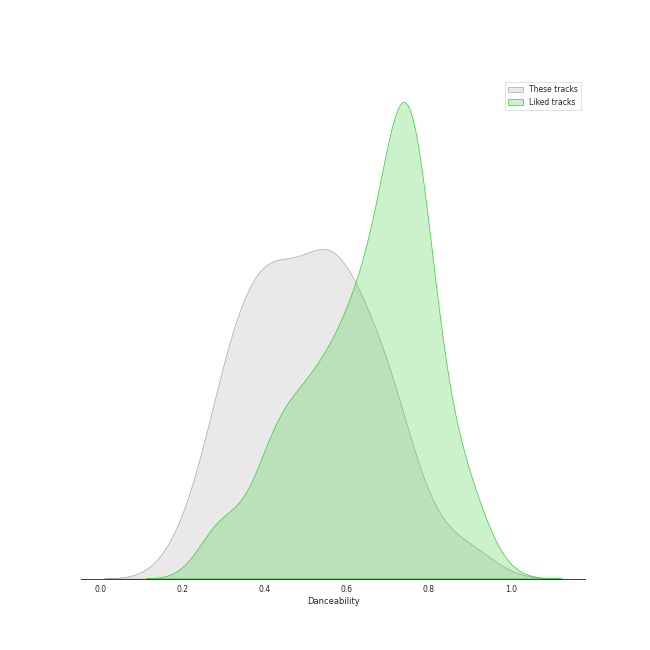
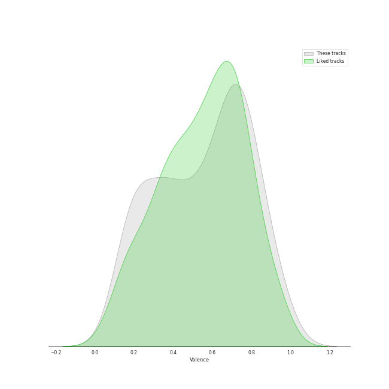

# Audio Features for Classic Rock

## Danceability

| ​ | 10 most Danceable tracks | ​​ | 10 least Danceable tracks |
|:---|:---|:---|:---|
|  | Another One Bites The Dust - Remastered 2011 (0.933) |  | Lights (0.193) |
|  | I Want To Break Free (0.87) |  | Desperado - 2013 Remaster (0.228) |
|  | Dreams - 2004 Remaster (0.828) |  | Across The Universe - Remastered 2009 (0.257) |
|  | Eye of the Tiger (0.817) |  | We Are The Champions - Remastered 2011 (0.268) |
|  | Get Back - Remastered 2009 (0.761) |  | The Great Gig in the Sky (0.274) |
|  | Don't Eat The Yellow Snow (0.747) |  | The Trooper - 2015 Remaster (0.285) |
|  | Sara - 2015 Remaster (0.743) |  | Set the Controls for the Heart of the Sun (0.297) |
|  | When Doves Cry (0.729) |  | Dream On (0.307) |
|  | (I Can't Get No) Satisfaction - Mono Version (0.723) |  | Back In Black (0.31) |
|  | Rhiannon (0.723) |  | Brain Damage (0.324) |

## Energy

| ​ | 10 most Energetic tracks | ​​ | 10 least Energetic tracks |
|:---|:---|:---|:---|
|  | When Doves Cry (0.989) |  | Blackbird - Remastered 2009 (0.127) |
|  | Sweet Child O' Mine (0.952) |  | Golden Slumbers - Remastered 2009 (0.152) |
|  | Go Your Own Way - 2004 Remaster (0.941) |  | Landslide (0.161) |
|  | Immigrant Song - Remaster (0.932) |  | Yesterday - Remastered 2009 (0.179) |
|  | Any Way You Want It (0.932) |  | Crazy Love - 2013 Remaster (0.188) |
|  | The Trooper - 2015 Remaster (0.908) |  | The Great Gig in the Sky (0.217) |
|  | 25 or 6 to 4 (0.869) |  | Desperado - 2013 Remaster (0.224) |
|  | Don't Stop Me Now - Remastered 2011 (0.865) |  | When I'm Sixty Four - Remastered 2009 (0.241) |
|  | Black Dog - Remaster (0.864) |  | Because - Remastered 2009 (0.249) |
|  | (I Can't Get No) Satisfaction - Mono Version (0.863) |  | Brain Damage (0.265) |

## Speechiness

| ​ | 10 most Speechy tracks | ​​ | 10 least Speechy tracks |
|:---|:---|:---|:---|
|  | Strawberry Fields Forever - Remastered 2009 (0.178) |  | Fields Of Gold (0.0246) |
|  | Another One Bites The Dust - Remastered 2011 (0.162) |  | Octopus's Garden - Remastered 2009 (0.0247) |
|  | Don't Stop Me Now - Remastered 2011 (0.16) |  | Save Me - Remastered 2011 (0.0268) |
|  | Money (0.144) |  | Hotel California - 2013 Remaster (0.027) |
|  | We Will Rock You - Remastered 2011 (0.119) |  | Cold as Ice (0.0271) |
|  | Don't Eat The Yellow Snow (0.112) |  | Because - Remastered 2009 (0.0272) |
|  | Crazy Love - 2013 Remaster (0.0959) |  | Carry That Weight - Remastered 2009 (0.0274) |
|  | Paint It, Black (0.0926) |  | Dreams - 2004 Remaster (0.0276) |
|  | Black Dog - Remaster (0.0904) |  | Golden Slumbers - Remastered 2009 (0.0277) |
|  | Time (0.0841) |  | Dust in the Wind (0.0283) |

## Acousticness

| ​ | 10 most Acoustic tracks | ​​ | 10 least Acoustic tracks |
|:---|:---|:---|:---|
|  | Desperado - 2013 Remaster (0.946) |  | Paranoid - 2012 - Remaster (4.52e-05) |
|  | Eleanor Rigby - Remastered 2009 (0.936) |  | Any Way You Want It (0.00251) |
|  | Landslide (0.883) |  | Hard To Handle (0.00257) |
|  | Yesterday - Remastered 2009 (0.879) |  | Carry on Wayward Son (0.00321) |
|  | Crazy Love - 2013 Remaster (0.841) |  | Iron Man (0.00367) |
|  | The Great Gig in the Sky (0.767) |  | Hotel California - 2013 Remaster (0.00574) |
|  | Blackbird - Remastered 2009 (0.754) |  | The Chain - 2004 Remaster (0.009) |
|  | Because - Remastered 2009 (0.754) |  | When Doves Cry (0.0102) |
|  | Crazy Little Thing Called Love - Remastered 2011 (0.714) |  | Back In Black (0.011) |
|  | I'm a Believer - 2006 Remaster (0.707) |  | Walk This Way (0.0114) |

## Instrumentalness

| ​ | 10 most Instrumental tracks | ​​ | 10 least Instrumental tracks |
|:---|:---|:---|:---|
|  | Set the Controls for the Heart of the Sun (0.905) |  | Killer Queen (0.0) |
|  | The Great Gig in the Sky (0.896) |  | Save Me - Remastered 2011 (0.0) |
|  | Peaches En Regalia (0.835) |  | Yesterday - Remastered 2009 (0.0) |
|  | Breathe (In the Air) (0.728) |  | Good Old Fashioned Lover Boy (0.0) |
|  | Smoke on the Water (0.581) |  | Brown Eyed Girl (0.0) |
|  | Brain Damage (0.341) |  | Don't Stop Believin' (0.0) |
|  | Another One Bites The Dust - Remastered 2011 (0.329) |  | All My Loving - Remastered 2009 (0.0) |
|  | Comfortably Numb (0.312) |  | Yellow Submarine - Remastered 2009 (0.0) |
|  | Come Together - Remastered 2009 (0.248) |  | We Will Rock You - Remastered 2011 (0.0) |
|  | Won't Get Fooled Again - Remix (0.235) |  | A Hard Day's Night - Remastered 2009 (0.0) |

## Liveness

| ​ | 10 most Live tracks | ​​ | 10 least Live tracks |
|:---|:---|:---|:---|
|  | Don't Stop Me Now - Remastered 2011 (0.77) |  | Iron Man (0.0372) |
|  | Purple Rain (0.689) |  | The Chain - 2004 Remaster (0.0451) |
|  | Revolution 1 - Remastered 2009 (0.621) |  | Smoke on the Water (0.0535) |
|  | Get Back - Remastered 2009 (0.61) |  | Blackbird - Remastered 2009 (0.0573) |
|  | I Am The Walrus - Remastered 2009 (0.589) |  | Hotel California - 2013 Remaster (0.0575) |
|  | Don't Stop Believin' (0.447) |  | Won't Get Fooled Again - Remix (0.0584) |
|  | Carry on Wayward Son (0.446) |  | Good Old Fashioned Lover Boy (0.0638) |
|  | When Doves Cry (0.443) |  | Who Are You (0.0655) |
|  | Yellow Submarine - Remastered 2009 (0.438) |  | Go Your Own Way - 2004 Remaster (0.068) |
|  | Brown Eyed Girl (0.406) |  | Killer Queen (0.0685) |

## Valence

| ​ | 10 most Happy tracks | ​​ | 10 least Happy tracks |
|:---|:---|:---|:---|
|  | I'm a Believer - 2006 Remaster (0.962) |  | The Show Must Go On (0.109) |
|  | Hard To Handle (0.961) |  | Come Sail Away (0.141) |
|  | (I Can't Get No) Satisfaction - Mono Version (0.931) |  | Baba O'Riley (0.15) |
|  | Brown Eyed Girl (0.908) |  | Because - Remastered 2009 (0.162) |
|  | All My Loving - Remastered 2009 (0.9) |  | Comfortably Numb (0.171) |
|  | Walk This Way (0.894) |  | We Are The Champions - Remastered 2011 (0.172) |
|  | Smoke on the Water (0.89) |  | Desperado - 2013 Remaster (0.18) |
|  | Across The Universe - Remastered 2009 (0.858) |  | The Great Gig in the Sky (0.181) |
|  | When Doves Cry (0.84) |  | Come Together - Remastered 2009 (0.187) |
|  | Go Your Own Way - 2004 Remaster (0.831) |  | Purple Rain (0.189) |

## Tempo

| ​ | 10 most Fast tracks | ​​ | 10 least Fast tracks |
|:---|:---|:---|:---|
|  | Lights (205.422) |  | Desperado - 2013 Remaster (60.3) |
|  | Back In Black (188.386) |  | We Are The Champions - Remastered 2011 (64.223) |
|  | Norwegian Wood (This Bird Has Flown) - Remastered 2009 (176.625) |  | Moondance - 2013 Remaster (67.409) |
|  | You Never Give Me Your Money - Remastered 2009 (174.464) |  | Innuendo (72.302) |
|  | Oh! Darling - Remastered 2009 (173.93) |  | Sexy Sadie - Remastered 2009 (75.478) |
|  | Come Together - Remastered 2009 (165.007) |  | Crazy Little Thing Called Love - Remastered 2011 (76.961) |
|  | Paranoid - 2012 - Remaster (163.071) |  | Crazy Love - 2013 Remaster (77.464) |
|  | Dream On (160.9) |  | All My Loving - Remastered 2009 (77.56) |
|  | The Trooper - 2015 Remaster (159.756) |  | Uncle Remus (78.591) |
|  | Landslide (159.375) |  | I'm a Believer - 2006 Remaster (80.106) |
