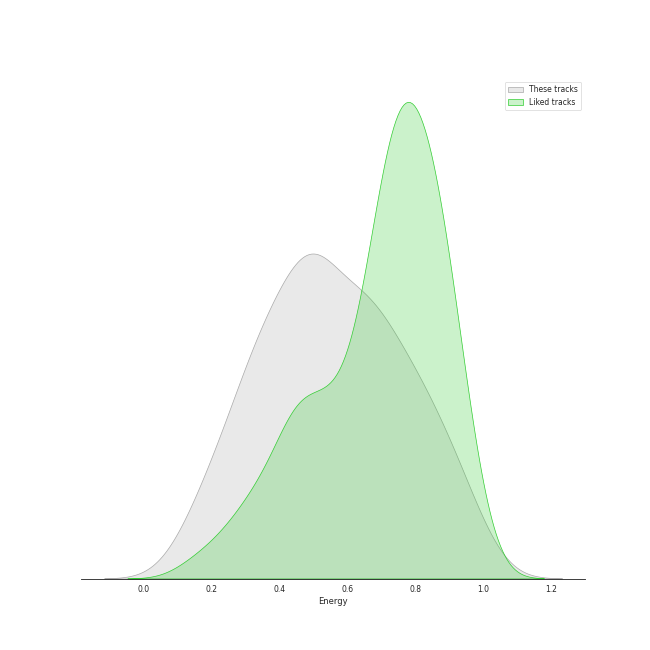
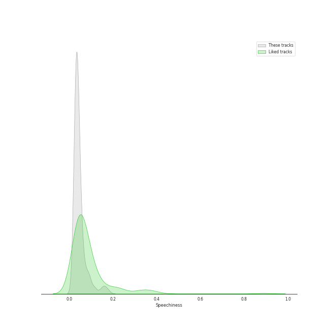
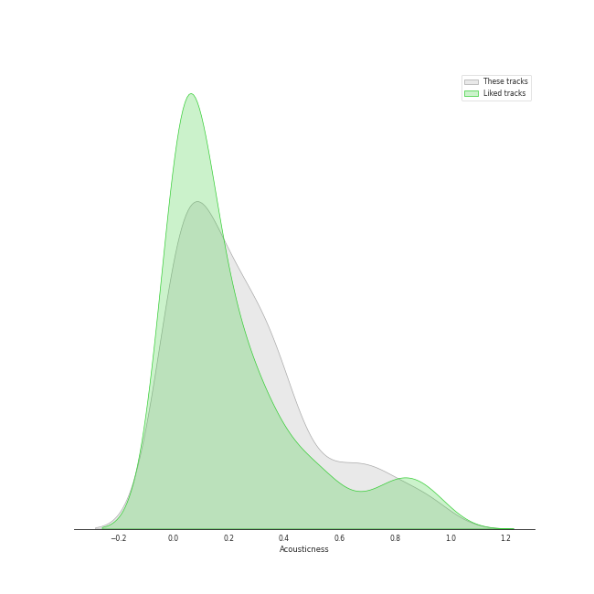
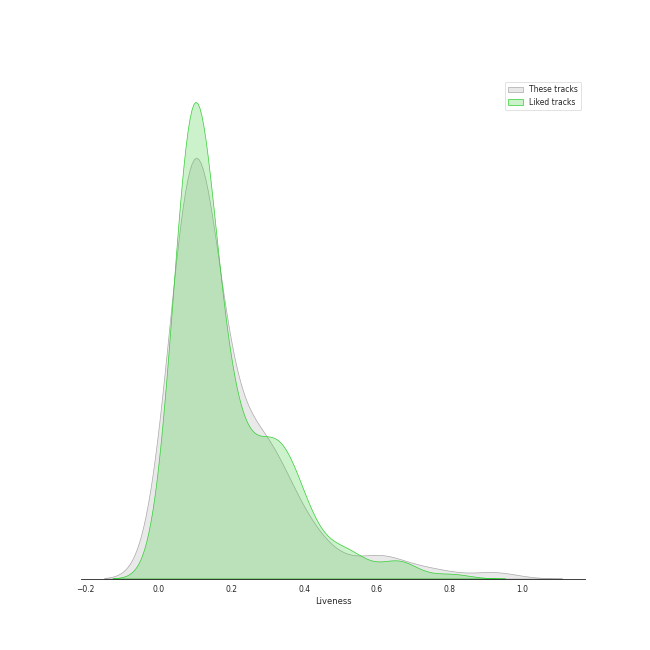
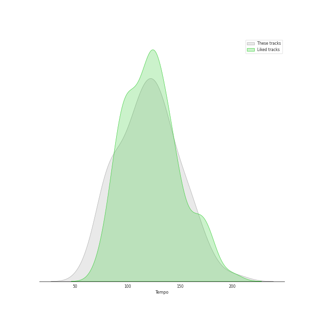

# Audio Features for Classic Rock

## Danceability

| 10 most Danceable tracks | 10 least Danceable tracks |
|:---|:---|
| Another One Bites The Dust (0.926) | Lights (0.193) |
| I Want To Break Free (0.87) | Desperado - 2013 Remaster (0.228) |
| Dreams - 2004 Remaster (0.828) | Fat Bottomed Girls (0.253) |
| Eye of the Tiger (0.817) | Across The Universe - Remastered 2009 (0.257) |
| Get Back - Remastered 2009 (0.761) | The Great Gig in the Sky (0.274) |
| Don't Eat The Yellow Snow (0.747) | The Trooper - 2015 Remaster (0.285) |
| Sara - 2015 Remaster (0.743) | Set the Controls for the Heart of the Sun (0.297) |
| When Doves Cry (0.729) | Dream On (0.307) |
| (I Can't Get No) Satisfaction - Mono Version (0.723) | Back In Black (0.31) |
| Rhiannon (0.723) | Brain Damage (0.324) |

## Energy

| 10 most Energetic tracks | 10 least Energetic tracks |
|:---|:---|
| When Doves Cry (0.989) | Blackbird - Remastered 2009 (0.127) |
| Sweet Child O' Mine (0.952) | Golden Slumbers - Remastered 2009 (0.152) |
| Go Your Own Way - 2004 Remaster (0.941) | Landslide (0.161) |
| Immigrant Song - Remaster (0.932) | Yesterday - Remastered 2009 (0.179) |
| Any Way You Want It (0.932) | Crazy Love - 2013 Remaster (0.188) |
| The Trooper - 2015 Remaster (0.908) | The Great Gig in the Sky (0.217) |
| 25 or 6 to 4 (0.869) | Desperado - 2013 Remaster (0.224) |
| Black Dog - Remaster (0.864) | When I'm Sixty Four - Remastered 2009 (0.241) |
| (I Can't Get No) Satisfaction - Mono Version (0.863) | Because - Remastered 2009 (0.249) |
| Won't Get Fooled Again - Remix (0.841) | Brain Damage (0.265) |

## Speechiness

| 10 most Speechy tracks | 10 least Speechy tracks |
|:---|:---|
| Don't Stop Me Now (0.192) | Fields Of Gold (0.0246) |
| Strawberry Fields Forever - Remastered 2009 (0.178) | Octopus's Garden - Remastered 2009 (0.0247) |
| Money (0.144) | Hotel California - 2013 Remaster (0.027) |
| Another One Bites The Dust (0.122) | Cold as Ice (0.0271) |
| Don't Eat The Yellow Snow (0.112) | Because - Remastered 2009 (0.0272) |
| Crazy Love - 2013 Remaster (0.0959) | Carry That Weight - Remastered 2009 (0.0274) |
| Paint It, Black (0.0926) | Dreams - 2004 Remaster (0.0276) |
| Black Dog - Remaster (0.0904) | Save Me (0.0276) |
| Time (0.0841) | Golden Slumbers - Remastered 2009 (0.0277) |
| Love Me Do - Remastered 2009 (0.0806) | Dust in the Wind (0.0283) |

## Acousticness

| 10 most Acoustic tracks | 10 least Acoustic tracks |
|:---|:---|
| Desperado - 2013 Remaster (0.946) | Paranoid - 2012 - Remaster (4.52e-05) |
| Eleanor Rigby - Remastered 2009 (0.936) | Any Way You Want It (0.00251) |
| Landslide (0.883) | Hard To Handle (0.00257) |
| Yesterday - Remastered 2009 (0.879) | Carry on Wayward Son (0.00321) |
| Crazy Love - 2013 Remaster (0.841) | Iron Man (0.00367) |
| The Great Gig in the Sky (0.767) | Hotel California - 2013 Remaster (0.00574) |
| Blackbird - Remastered 2009 (0.754) | The Chain - 2004 Remaster (0.009) |
| Because - Remastered 2009 (0.754) | When Doves Cry (0.0102) |
| I'm a Believer - 2006 Remaster (0.707) | Back In Black (0.011) |
| Set the Controls for the Heart of the Sun (0.673) | Walk This Way (0.0114) |

## Instrumentalness

| 10 most Instrumental tracks | 10 least Instrumental tracks |
|:---|:---|
| Set the Controls for the Heart of the Sun (0.905) | We Will Rock You (0.0) |
| The Great Gig in the Sky (0.896) | Killer Queen (0.0) |
| Peaches En Regalia (0.835) | Crazy Little Thing Called Love (0.0) |
| Breathe (In the Air) (0.728) | Yesterday - Remastered 2009 (0.0) |
| Smoke on the Water (0.581) | Good Old Fashioned Lover Boy (0.0) |
| Brain Damage (0.341) | Brown Eyed Girl (0.0) |
| Comfortably Numb (0.312) | Don't Stop Believin' (0.0) |
| Come Together - Remastered 2009 (0.248) | All My Loving - Remastered 2009 (0.0) |
| Won't Get Fooled Again - Remix (0.235) | We Are The Champions (0.0) |
| I Want You (She's So Heavy) - Remastered 2009 (0.205) | Yellow Submarine - Remastered 2009 (0.0) |

## Liveness

| 10 most Live tracks | 10 least Live tracks |
|:---|:---|
| Purple Rain (0.689) | Iron Man (0.0372) |
| Revolution 1 - Remastered 2009 (0.621) | The Chain - 2004 Remaster (0.0451) |
| Get Back - Remastered 2009 (0.61) | Smoke on the Water (0.0535) |
| I Am The Walrus - Remastered 2009 (0.589) | Blackbird - Remastered 2009 (0.0573) |
| Don't Stop Me Now (0.558) | Hotel California - 2013 Remaster (0.0575) |
| Don't Stop Believin' (0.447) | Won't Get Fooled Again - Remix (0.0584) |
| Carry on Wayward Son (0.446) | Good Old Fashioned Lover Boy (0.0638) |
| When Doves Cry (0.443) | Who Are You (0.0655) |
| Yellow Submarine - Remastered 2009 (0.438) | Go Your Own Way - 2004 Remaster (0.068) |
| Brown Eyed Girl (0.406) | Killer Queen (0.0685) |

## Valence

| 10 most Happy tracks | 10 least Happy tracks |
|:---|:---|
| I'm a Believer - 2006 Remaster (0.962) | The Show Must Go On (0.109) |
| Hard To Handle (0.961) | Come Sail Away (0.141) |
| (I Can't Get No) Satisfaction - Mono Version (0.931) | Baba O'Riley (0.15) |
| Brown Eyed Girl (0.908) | Because - Remastered 2009 (0.162) |
| All My Loving - Remastered 2009 (0.9) | Comfortably Numb (0.171) |
| Walk This Way (0.894) | Desperado - 2013 Remaster (0.18) |
| Smoke on the Water (0.89) | The Great Gig in the Sky (0.181) |
| Across The Universe - Remastered 2009 (0.858) | Come Together - Remastered 2009 (0.187) |
| When Doves Cry (0.84) | We Are The Champions (0.189) |
| Go Your Own Way - 2004 Remaster (0.831) | Purple Rain (0.189) |

## Tempo

| 10 most Fast tracks | 10 least Fast tracks |
|:---|:---|
| Lights (205.422) | Desperado - 2013 Remaster (60.3) |
| Back In Black (188.386) | Moondance - 2013 Remaster (67.409) |
| Norwegian Wood (This Bird Has Flown) - Remastered 2009 (176.625) | Innuendo (72.302) |
| Fat Bottomed Girls (176.109) | Sexy Sadie - Remastered 2009 (75.478) |
| You Never Give Me Your Money - Remastered 2009 (174.464) | Crazy Little Thing Called Love (76.826) |
| Oh! Darling - Remastered 2009 (173.93) | Crazy Love - 2013 Remaster (77.464) |
| Come Together - Remastered 2009 (165.007) | All My Loving - Remastered 2009 (77.56) |
| Paranoid - 2012 - Remaster (163.071) | I'm a Believer - 2006 Remaster (80.106) |
| Dream On (160.9) | Golden Slumbers - Remastered 2009 (80.608) |
| The Trooper - 2015 Remaster (159.756) | Because - Remastered 2009 (81.257) |
