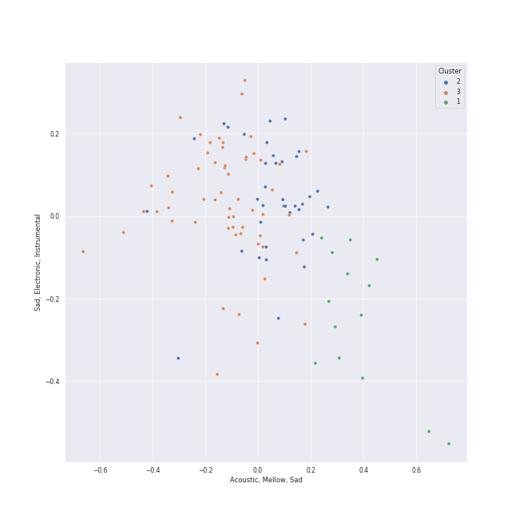

# Clusters in Classic Rock

## Cluster #1

11 tracks

| Art | Track | Album | Artists | Label | Score | 💚 | 🔗 |
|:---|:---|:---|:---|:---|---:|:---|:---|
|  | Blackbird - Remastered 2009 | The Beatles (Remastered) | [The Beatles](../../../../artists/the_beatles/overview.md) | [EMI Catalogue](../../../../labels/emi_catalogue) | 0 | 💚 | [🔗](https://open.spotify.com/track/5jgFfDIR6FR0gvlA56Nakr) |
|  | Yesterday - Remastered 2009 | Help! (Remastered) | [The Beatles](../../../../artists/the_beatles/overview.md) | [EMI Catalogue](../../../../labels/emi_catalogue) | 0 | 💚 | [🔗](https://open.spotify.com/track/3BQHpFgAp4l80e1XslIjNI) |
|  | Eleanor Rigby - Remastered 2009 | Revolver (Remastered) | [The Beatles](../../../../artists/the_beatles/overview.md) | [EMI Catalogue](../../../../labels/emi_catalogue) | 0 | 💚 | [🔗](https://open.spotify.com/track/5GjPQ0eI7AgmOnADn1EO6Q) |
|  | Crazy Love - 2013 Remaster | Moondance (Expanded Edition) | Van Morrison | [Warner Records](../../../../labels/warner_records) | 0 | | [🔗](https://open.spotify.com/track/2hjAc6x8EoSLhGxRNg8KEw) |
|  | Landslide | Fleetwood Mac | Fleetwood Mac | [Warner Records](../../../../labels/warner_records) | 0 | 💚 | [🔗](https://open.spotify.com/track/5ihS6UUlyQAfmp48eSkxuQ) |
|  | The Great Gig in the Sky | The Dark Side of the Moon | Pink Floyd | Pink Floyd Records | 22 | | [🔗](https://open.spotify.com/track/2TjdnqlpwOjhijHCwHCP2d) |
|  | Breathe (In the Air) | The Dark Side of the Moon | Pink Floyd | Pink Floyd Records | 0 | 💚 | [🔗](https://open.spotify.com/track/2ctvdKmETyOzPb2GiJJT53) |
|  | Set the Controls for the Heart of the Sun | A Saucerful of Secrets | Pink Floyd | Pink Floyd Records | 0 | 💚 | [🔗](https://open.spotify.com/track/6p9UFDNfGrzS5Byd2r9KPk) |
|  | Peaches En Regalia | Hot Rats | Frank Zappa | Frank Zappa Catalog | 0 | | [🔗](https://open.spotify.com/track/5uDu2qOoDou7cFXsipAo8l) |
|  | Desperado - 2013 Remaster | Desperado (2013 Remaster) | Eagles | [Rhino/Elektra](../../../../labels/rhino) | 12 | 💚 | [🔗](https://open.spotify.com/track/2TjnCxxQRYn56Ye8gkUKiW) |
## Cluster #2

36 tracks

| Art | Track | Album | Artists | Label | Score | 💚 | 🔗 |
|:---|:---|:---|:---|:---|---:|:---|:---|
|  | Something - Remastered 2009 | Abbey Road (Remastered) | [The Beatles](../../../../artists/the_beatles/overview.md) | [EMI Catalogue](../../../../labels/emi_catalogue) | 0 | 💚 | [🔗](https://open.spotify.com/track/0pNeVovbiZHkulpGeOx1Gj) |
|  | You Never Give Me Your Money - Remastered 2009 | Abbey Road (Remastered) | [The Beatles](../../../../artists/the_beatles/overview.md) | [EMI Catalogue](../../../../labels/emi_catalogue) | 0 | | [🔗](https://open.spotify.com/track/1jOLTO379yIu9aMnCkpMQl) |
|  | I Want You (She's So Heavy) - Remastered 2009 | Abbey Road (Remastered) | [The Beatles](../../../../artists/the_beatles/overview.md) | [EMI Catalogue](../../../../labels/emi_catalogue) | 0 | 💚 | [🔗](https://open.spotify.com/track/3Z25k4ZF6QENy2d9YatsM5) |
|  | Dear Prudence - Remastered 2009 | The Beatles (Remastered) | [The Beatles](../../../../artists/the_beatles/overview.md) | [EMI Catalogue](../../../../labels/emi_catalogue) | 0 | 💚 | [🔗](https://open.spotify.com/track/5NQYyej46WQkgCbnzGD21W) |
|  | Strawberry Fields Forever - Remastered 2009 | Magical Mystery Tour (Remastered) | [The Beatles](../../../../artists/the_beatles/overview.md) | [EMI Catalogue](../../../../labels/emi_catalogue) | 0 | | [🔗](https://open.spotify.com/track/3Am0IbOxmvlSXro7N5iSfZ) |
|  | Time | The Dark Side of the Moon | Pink Floyd | Pink Floyd Records | 0 | | [🔗](https://open.spotify.com/track/3TO7bbrUKrOSPGRTB5MeCz) |
|  | Innuendo | Innuendo | [Queen](../../../../artists/queen/overview.md) | [Hollywood Records](../../../../labels/hollywood_records) | 8 | 💚 | [🔗](https://open.spotify.com/track/1dG4lTOVFu8RkSzybolp7o) |
|  | Save Me - Remastered 2011 | The Game (Deluxe Remastered Version) | [Queen](../../../../artists/queen/overview.md) | [Hollywood Records](../../../../labels/hollywood_records) | 0 | 💚 | [🔗](https://open.spotify.com/track/2mGEqJahn3CSyCG1BTEqMs) |
|  | Bohemian Rhapsody - Remastered 2011 | A Night At The Opera (Deluxe Remastered Version) | [Queen](../../../../artists/queen/overview.md) | [Hollywood Records](../../../../labels/hollywood_records) | 0 | 💚 | [🔗](https://open.spotify.com/track/7tFiyTwD0nx5a1eklYtX2J) |
|  | Dust in the Wind | Point Of Know Return (Expanded Edition) | Kansas | [Epic](../../../../labels/epic), [Legacy](../../../../labels/legacy) | 0 | 💚 | [🔗](https://open.spotify.com/track/6zeE5tKyr8Nu882DQhhSQI) |
## Cluster #3

64 tracks

| Art | Track | Album | Artists | Label | Score | 💚 | 🔗 |
|:---|:---|:---|:---|:---|---:|:---|:---|
|  | Octopus's Garden - Remastered 2009 | Abbey Road (Remastered) | [The Beatles](../../../../artists/the_beatles/overview.md) | [EMI Catalogue](../../../../labels/emi_catalogue) | 0 | | [🔗](https://open.spotify.com/track/0suLngfo7rJoetk7Ub6N8l) |
|  | Norwegian Wood (This Bird Has Flown) - Remastered 2009 | Rubber Soul (Remastered) | [The Beatles](../../../../artists/the_beatles/overview.md) | [EMI Catalogue](../../../../labels/emi_catalogue) | 0 | 💚 | [🔗](https://open.spotify.com/track/1H7gMYGykdtwZOV6s1N0by) |
|  | Sexy Sadie - Remastered 2009 | The Beatles (Remastered) | [The Beatles](../../../../artists/the_beatles/overview.md) | [EMI Catalogue](../../../../labels/emi_catalogue) | 0 | 💚 | [🔗](https://open.spotify.com/track/2tBv9tAdqEbLNDi5smSjbg) |
|  | While My Guitar Gently Weeps - Remastered 2009 | The Beatles (Remastered) | [The Beatles](../../../../artists/the_beatles/overview.md) | [EMI Catalogue](../../../../labels/emi_catalogue) | 0 | 💚 | [🔗](https://open.spotify.com/track/389QX9Q1eUOEZ19vtzzI9O) |
|  | Day Tripper - Remastered 2015 | 1 (Remastered) | [The Beatles](../../../../artists/the_beatles/overview.md) | [UMC (Universal Music Catalogue)](../../../../labels/umc_(universal_music_catalogue)) | 223 | 💚 | [🔗](https://open.spotify.com/track/29b2b96jozyD9GPCkOrVLs) |
|  | Got To Get You Into My Life - Remastered 2009 | Revolver (Remastered) | [The Beatles](../../../../artists/the_beatles/overview.md) | [EMI Catalogue](../../../../labels/emi_catalogue) | 0 | 💚 | [🔗](https://open.spotify.com/track/3tGhRLgcCP6SIZU3tbGl7l) |
|  | Renegade | Pieces Of Eight | Styx | A&M | 107 | 💚 | [🔗](https://open.spotify.com/track/1CQqupcyMg7176PPmIVmSj) |
|  | You're My Best Friend | A Night At The Opera | [Queen](../../../../artists/queen/overview.md) | [Hollywood Records](../../../../labels/hollywood_records) | 0 | 💚 | [🔗](https://open.spotify.com/track/48BA17CGTzcm85ULSTg5AO) |
|  | Uncle Remus | Apostrophe(') | Frank Zappa | Frank Zappa Catalog | 0 | | [🔗](https://open.spotify.com/track/4PPwkLq2ld1k09Bl5NkyZB) |
|  | Daydream Believer | The Birds, The Bees, & The Monkees | The Monkees | [Rhino](../../../../labels/rhino) | 0 | | [🔗](https://open.spotify.com/track/7uEcCGtM1FBBGIhPozhJjv) |