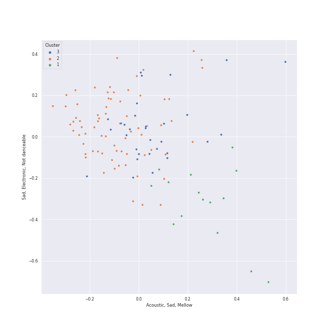

# Clusters in Classic Rock

## Cluster #1

14 tracks

| Art | Track | Album | Artists | Label | 💚 | 🔗 |
|:---|:---|:---|:---|:---|:---|:---|
|  | Desperado - 2013 Remaster | Desperado (2013 Remaster) | Eagles | [Rhino/Elektra](../../../../labels/rhino) | 💚 | [🔗](https://open.spotify.com/track/2TjnCxxQRYn56Ye8gkUKiW) |
|  | Landslide | Fleetwood Mac | Fleetwood Mac | [Warner Records](../../../../labels/warner_records) | 💚 | [🔗](https://open.spotify.com/track/5ihS6UUlyQAfmp48eSkxuQ) |
|  | Breathe (In the Air) | The Dark Side of the Moon | Pink Floyd | Pink Floyd Records | 💚 | [🔗](https://open.spotify.com/track/2ctvdKmETyOzPb2GiJJT53) |
|  | Good Old Fashioned Lover Boy | A Day At The Races | [Queen](../../../../artists/queen/overview.md) | [Hollywood Records](../../../../labels/hollywood_records) | | [🔗](https://open.spotify.com/track/3e9w80AUq0mT9Nrq471kLx) |
|  | Yesterday - Remastered 2009 | Help! (Remastered) | [The Beatles](../../../../artists/the_beatles/overview.md) | [EMI Catalogue](../../../../labels/emi_catalogue) | 💚 | [🔗](https://open.spotify.com/track/3BQHpFgAp4l80e1XslIjNI) |
|  | When I'm Sixty Four - Remastered 2009 | Sgt. Pepper's Lonely Hearts Club Band (Remastered) | [The Beatles](../../../../artists/the_beatles/overview.md) | [EMI Catalogue](../../../../labels/emi_catalogue) | | [🔗](https://open.spotify.com/track/1NrbnHlR2BFREcyWXHIHip) |
|  | Blackbird - Remastered 2009 | The Beatles (Remastered) | [The Beatles](../../../../artists/the_beatles/overview.md) | [EMI Catalogue](../../../../labels/emi_catalogue) | 💚 | [🔗](https://open.spotify.com/track/5jgFfDIR6FR0gvlA56Nakr) |
|  | Because - Remastered 2009 | Abbey Road (Remastered) | [The Beatles](../../../../artists/the_beatles/overview.md) | [EMI Catalogue](../../../../labels/emi_catalogue) | 💚 | [🔗](https://open.spotify.com/track/1rxoyGj1QuPoVi8fOft1Kt) |
|  | Let It Be - Remastered 2009 | Let It Be (Remastered) | [The Beatles](../../../../artists/the_beatles/overview.md) | [EMI Catalogue](../../../../labels/emi_catalogue) | 💚 | [🔗](https://open.spotify.com/track/7iN1s7xHE4ifF5povM6A48) |
|  | Crazy Love - 2013 Remaster | Moondance (Expanded Edition) | Van Morrison | [Warner Records](../../../../labels/warner_records) | | [🔗](https://open.spotify.com/track/2hjAc6x8EoSLhGxRNg8KEw) |
## Cluster #2

56 tracks

| Art | Track | Album | Artists | Label | 💚 | 🔗 |
|:---|:---|:---|:---|:---|:---|:---|
|  | 25 or 6 to 4 | Chicago IX: Chicago's Greatest Hits | Chicago | [Rhino](../../../../labels/rhino) | 💚 | [🔗](https://open.spotify.com/track/65eRcjlStTnk8opG5eIQ8Z) |
|  | Uncle Remus | Apostrophe(') | Frank Zappa | Frank Zappa Catalog | | [🔗](https://open.spotify.com/track/4PPwkLq2ld1k09Bl5NkyZB) |
|  | Money | The Dark Side of the Moon | Pink Floyd | Pink Floyd Records | 💚 | [🔗](https://open.spotify.com/track/0vFOzaXqZHahrZp6enQwQb) |
|  | You're My Best Friend | A Night At The Opera | [Queen](../../../../artists/queen/overview.md) | [Hollywood Records](../../../../labels/hollywood_records) | 💚 | [🔗](https://open.spotify.com/track/48BA17CGTzcm85ULSTg5AO) |
|  | A Hard Day's Night - Remastered 2009 | A Hard Day's Night (Remastered) | [The Beatles](../../../../artists/the_beatles/overview.md) | [EMI Catalogue](../../../../labels/emi_catalogue) | 💚 | [🔗](https://open.spotify.com/track/5J2CHimS7dWYMImCHkEFaJ) |
|  | Sexy Sadie - Remastered 2009 | The Beatles (Remastered) | [The Beatles](../../../../artists/the_beatles/overview.md) | [EMI Catalogue](../../../../labels/emi_catalogue) | 💚 | [🔗](https://open.spotify.com/track/2tBv9tAdqEbLNDi5smSjbg) |
|  | While My Guitar Gently Weeps - Remastered 2009 | The Beatles (Remastered) | [The Beatles](../../../../artists/the_beatles/overview.md) | [EMI Catalogue](../../../../labels/emi_catalogue) | 💚 | [🔗](https://open.spotify.com/track/389QX9Q1eUOEZ19vtzzI9O) |
|  | Carry That Weight - Remastered 2009 | Abbey Road (Remastered) | [The Beatles](../../../../artists/the_beatles/overview.md) | [EMI Catalogue](../../../../labels/emi_catalogue) | | [🔗](https://open.spotify.com/track/5eZrW59C3UgBhkqNlowEID) |
|  | Octopus's Garden - Remastered 2009 | Abbey Road (Remastered) | [The Beatles](../../../../artists/the_beatles/overview.md) | [EMI Catalogue](../../../../labels/emi_catalogue) | | [🔗](https://open.spotify.com/track/0suLngfo7rJoetk7Ub6N8l) |
|  | Day Tripper - Remastered 2015 | 1 (Remastered) | [The Beatles](../../../../artists/the_beatles/overview.md) | [UMC (Universal Music Catalogue)](../../../../labels/umc__universal_music_catalogue_) | 💚 | [🔗](https://open.spotify.com/track/29b2b96jozyD9GPCkOrVLs) |
## Cluster #3

37 tracks

| Art | Track | Album | Artists | Label | 💚 | 🔗 |
|:---|:---|:---|:---|:---|:---|:---|
|  | Dream On | Aerosmith | Aerosmith | [Columbia](../../../../labels/columbia) | 💚 | [🔗](https://open.spotify.com/track/5MxNLUsfh7uzROypsoO5qe) |
|  | Dust in the Wind | Point Of Know Return (Expanded Edition) | Kansas | [Epic](../../../../labels/epic), [Legacy](../../../../labels/legacy) | 💚 | [🔗](https://open.spotify.com/track/6zeE5tKyr8Nu882DQhhSQI) |
|  | Time | The Dark Side of the Moon | Pink Floyd | Pink Floyd Records | | [🔗](https://open.spotify.com/track/3TO7bbrUKrOSPGRTB5MeCz) |
|  | Bohemian Rhapsody - Remastered 2011 | A Night At The Opera (Deluxe Remastered Version) | [Queen](../../../../artists/queen/overview.md) | [Hollywood Records](../../../../labels/hollywood_records) | 💚 | [🔗](https://open.spotify.com/track/7tFiyTwD0nx5a1eklYtX2J) |
|  | Somebody To Love | A Day At The Races | [Queen](../../../../artists/queen/overview.md) | [Hollywood Records](../../../../labels/hollywood_records) | 💚 | [🔗](https://open.spotify.com/track/79M91zIoaIrm073sACpOtr) |
|  | Save Me - Remastered 2011 | The Game (Deluxe Remastered Version) | [Queen](../../../../artists/queen/overview.md) | [Hollywood Records](../../../../labels/hollywood_records) | 💚 | [🔗](https://open.spotify.com/track/2mGEqJahn3CSyCG1BTEqMs) |
|  | Dear Prudence - Remastered 2009 | The Beatles (Remastered) | [The Beatles](../../../../artists/the_beatles/overview.md) | [EMI Catalogue](../../../../labels/emi_catalogue) | 💚 | [🔗](https://open.spotify.com/track/5NQYyej46WQkgCbnzGD21W) |
|  | I Want You (She's So Heavy) - Remastered 2009 | Abbey Road (Remastered) | [The Beatles](../../../../artists/the_beatles/overview.md) | [EMI Catalogue](../../../../labels/emi_catalogue) | 💚 | [🔗](https://open.spotify.com/track/3Z25k4ZF6QENy2d9YatsM5) |
|  | Something - Remastered 2009 | Abbey Road (Remastered) | [The Beatles](../../../../artists/the_beatles/overview.md) | [EMI Catalogue](../../../../labels/emi_catalogue) | 💚 | [🔗](https://open.spotify.com/track/0pNeVovbiZHkulpGeOx1Gj) |
|  | Behind Blue Eyes | Who's Next (Deluxe Edition) | [The Who](../../../../artists/the_who/overview.md) | [Polydor Records](../../../../labels/polydor_records) | 💚 | [🔗](https://open.spotify.com/track/0cKk8BKEi7zXbdrYdyqBP5) |