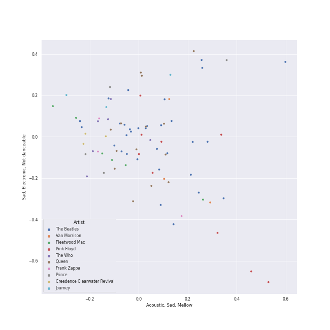
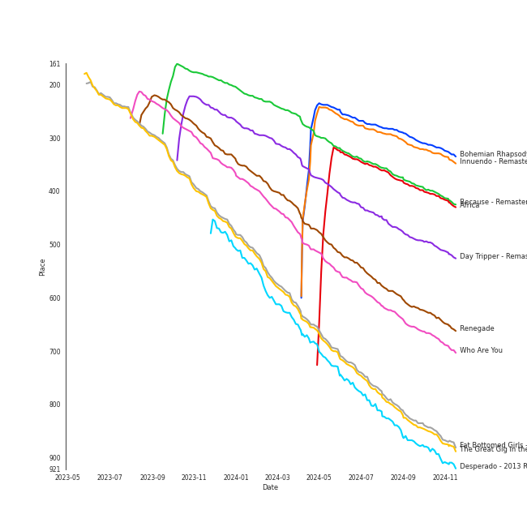
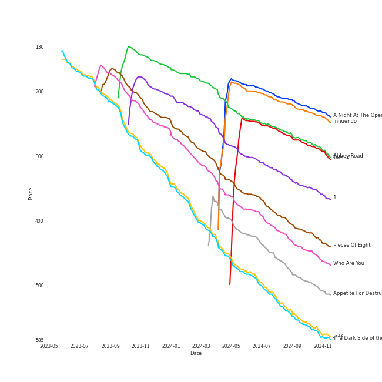
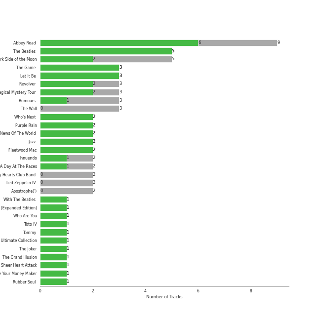
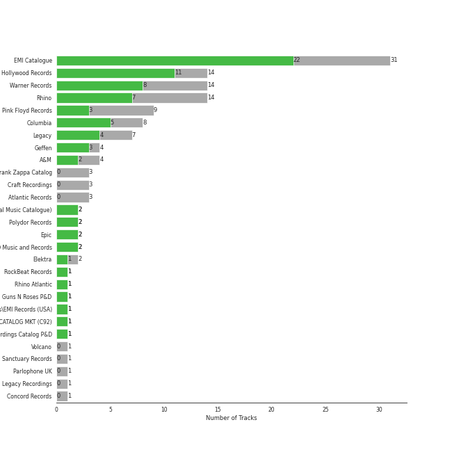
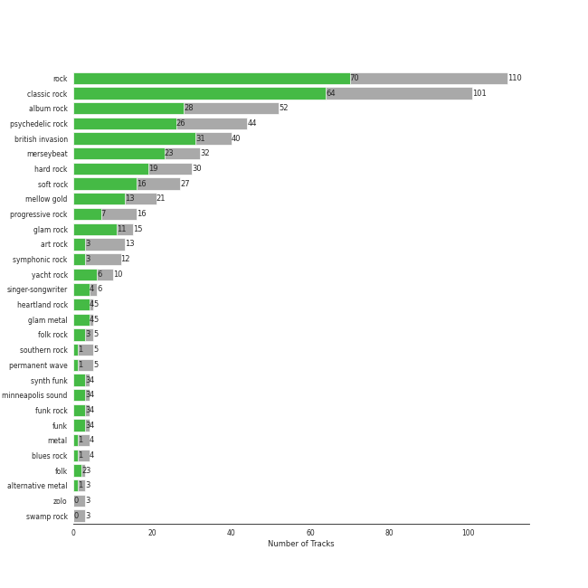
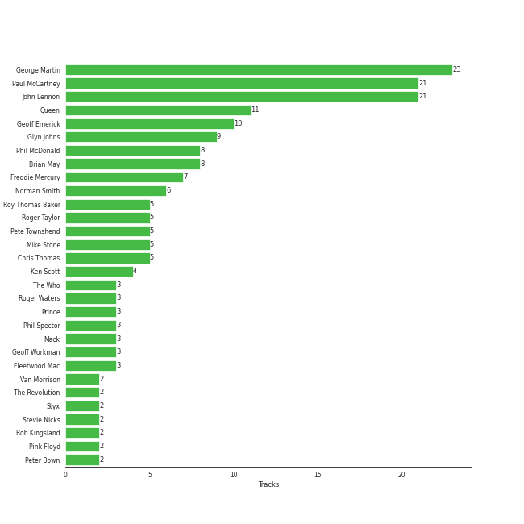
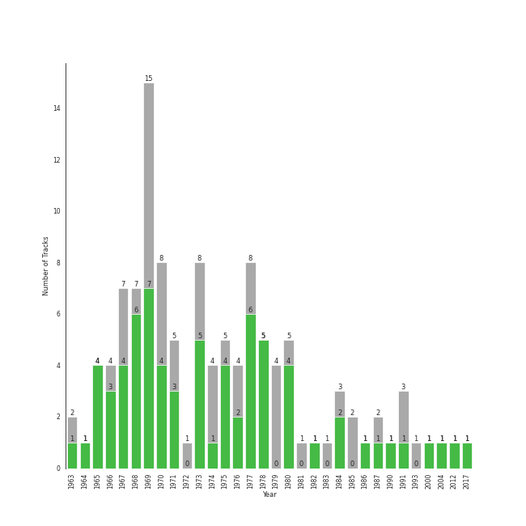

# Classic Rock

[117 tracks (71 liked) 🔗](https://open.spotify.com/playlist/5z6MnUYwnqrMcdd9b14Cc7)

[See Track Features](audio_features.md)

[See Clusters](clusters/overview.md)

## Top Artists

| Art | Rank | Tracks | 💚 | Artist | 🔗 |
|:---|---:|---:|---:|:---|:---|
|  | 61 | 32 | 23 | [The Beatles](../../artists/the_beatles/overview.md) | [🔗](https://open.spotify.com/artist/3WrFJ7ztbogyGnTHbHJFl2) |
|  | 51 | 14 | 11 | [Queen](../../artists/queen/overview.md) | [🔗](https://open.spotify.com/artist/1dfeR4HaWDbWqFHLkxsg1d) |
|  | 319 | 6 | 6 | [The Who](../../artists/the_who/overview.md) | [🔗](https://open.spotify.com/artist/67ea9eGLXYMsO2eYQRui3w) |
|  | 102 | 9 | 3 | Pink Floyd | [🔗](https://open.spotify.com/artist/0k17h0D3J5VfsdmQ1iZtE9) |
|  | 409 | 6 | 3 | Fleetwood Mac | [🔗](https://open.spotify.com/artist/08GQAI4eElDnROBrJRGE0X) |
|  | 178 | 4 | 3 | Prince | [🔗](https://open.spotify.com/artist/5a2EaR3hamoenG9rDuVn8j) |
|  | 409 | 3 | 2 | Van Morrison | [🔗](https://open.spotify.com/artist/44NX2ffIYHr6D4n7RaZF7A) |
|  | 303 | 2 | 2 | Styx | [🔗](https://open.spotify.com/artist/4salDzkGmfycRqNUbyBphh) |
|  | 409 | 2 | 2 | Kansas | [🔗](https://open.spotify.com/artist/2hl0xAkS2AIRAu23TVMBG1) |
|  | 409 | 2 | 2 | The Rolling Stones | [🔗](https://open.spotify.com/artist/22bE4uQ6baNwSHPVcDxLCe) |

See all 34 artists

| Art | Rank | Tracks | 💚 | Artist | 🔗 |
|:---|---:|---:|---:|:---|:---|
|  | 409 | 3 | 1 | Journey | [🔗](https://open.spotify.com/artist/0rvjqX7ttXeg3mTy8Xscbt) |
|  | 409 | 2 | 1 | Aerosmith | [🔗](https://open.spotify.com/artist/7Ey4PD4MYsKc5I2dolUwbH) |
|  | 409 | 2 | 1 | Black Sabbath | [🔗](https://open.spotify.com/artist/5M52tdBnJaKSvOpJGz8mfZ) |
|  | 409 | 2 | 1 | The Monkees | [🔗](https://open.spotify.com/artist/320EPCSEezHt1rtbfwH6Ck) |
|  | 376 | 2 | 1 | Eagles | [🔗](https://open.spotify.com/artist/0ECwFtbIWEVNwjlrfc6xoL) |
|  | 409 | 1 | 1 | AC/DC | [🔗](https://open.spotify.com/artist/711MCceyCBcFnzjGY4Q7Un) |
|  | 409 | 1 | 1 | Dick Dale | [🔗](https://open.spotify.com/artist/6Ycrt8OjGSSFihsb0446eg) |
|  | 409 | 1 | 1 | Steve Miller Band | [🔗](https://open.spotify.com/artist/6QtGlUje9TIkLrgPZrESuk) |
|  | 409 | 1 | 1 | Foreigner | [🔗](https://open.spotify.com/artist/6IRouO5mvvfcyxtPDKMYFN) |
|  | 409 | 1 | 1 | The Black Crowes | [🔗](https://open.spotify.com/artist/5krkohEVJYw0qoB5VWwxaC) |
|  | 409 | 1 | 1 | Blondie | [🔗](https://open.spotify.com/artist/4tpUmLEVLCGFr93o8hFFIB) |
|  | 337 | 1 | 1 | Guns N' Roses | [🔗](https://open.spotify.com/artist/3qm84nBOXUEQ2vnTfUTTFC) |
|  | 382 | 1 | 1 | Chicago | [🔗](https://open.spotify.com/artist/3iDD7bnsjL9J4fO298r0L0) |
|  | 229 | 1 | 1 | TOTO | [🔗](https://open.spotify.com/artist/0PFtn5NtBbbUNbU9EAmIWF) |
|  | 224 | 3 | 0 | Frank Zappa | [🔗](https://open.spotify.com/artist/6ra4GIOgCZQZMOaUECftGN) |
|  | 409 | 3 | 0 | Creedence Clearwater Revival | [🔗](https://open.spotify.com/artist/3IYUhFvPQItj6xySrBmZkd) |
|  | 409 | 3 | 0 | Led Zeppelin | [🔗](https://open.spotify.com/artist/36QJpDe2go2KgaRleHCDTp) |
|  | 409 | 2 | 0 | Sting | [🔗](https://open.spotify.com/artist/0Ty63ceoRnnJKVEYP0VQpk) |
|  | 409 | 1 | 0 | Iron Maiden | [🔗](https://open.spotify.com/artist/6mdiAmATAx73kdxrNrnlao) |
|  | 409 | 1 | 0 | Deep Purple | [🔗](https://open.spotify.com/artist/568ZhdwyaiCyOGJRtNYhWf) |
|  | 409 | 1 | 0 | Lynyrd Skynyrd | [🔗](https://open.spotify.com/artist/4MVyzYMgTwdP7Z49wAZHx0) |
|  | 409 | 1 | 0 | R.E.M. | [🔗](https://open.spotify.com/artist/4KWTAlx2RvbpseOGMEmROg) |
|  | 409 | 1 | 0 | Survivor | [🔗](https://open.spotify.com/artist/26bcq2nyj5GB7uRr558iQg) |
|  | 409 | 1 | 0 | David Bowie | [🔗](https://open.spotify.com/artist/0oSGxfWSnnOXhD2fKuz2Gy) |

## Top Tracks

Most and least listened tracks

| Rank | ​ | Most listened tracks | Rank | ​​ | Least listened tracks |
|---:|:---|:---|---:|:---|:---|
| 278 |  | [Bohemian Rhapsody - Remastered 2011](../../artists/queen/overview.md) | 888 |  | Cold as Ice |
| 289 |  | [Innuendo - Remastered 2011](../../artists/queen/overview.md) | 888 |  | Daydream Believer |
| 348 |  | [Because - Remastered 2009](../../artists/the_beatles/overview.md) | 888 |  | Sweet Child O' Mine |
| 355 |  | Africa | 888 |  | [Let It Be - Remastered 2009](../../artists/the_beatles/overview.md) |
| 438 |  | [Day Tripper - Remastered 2015](../../artists/the_beatles/overview.md) | 888 |  | [Don't Stop Me Now - Remastered 2011](../../artists/queen/overview.md) |
| 560 |  | Renegade | 888 |  | Sweet Home Alabama |
| 595 |  | [Who Are You](../../artists/the_who/overview.md) | 888 |  | [We Are The Champions - Remastered 2011](../../artists/queen/overview.md) |
| 762 |  | [Fat Bottomed Girls - Remastered 2011](../../artists/queen/overview.md) | 888 |  | Call Me |
| 767 |  | The Great Gig in the Sky | 888 |  | Hey You |
| 795 |  | Desperado - 2013 Remaster | 888 |  | Lights |

## Top Albums

| Art | Rank | Tracks | 💚 | Album | Release Date | 🔗 |
|:---|---:|---:|---:|:---|:---|:---|
|  | 254 | 9 | 6 | Abbey Road (Remastered) | 1969-09-26 | [🔗](https://open.spotify.com/album/0ETFjACtuP2ADo6LFhL6HN) |
|  | 597 | 5 | 5 | The Beatles (Remastered) | 1968-11-22 | [🔗](https://open.spotify.com/album/1klALx0u4AavZNEvC4LrTL) |
|  | 517 | 5 | 2 | The Dark Side of the Moon | 1973-03-01 | [🔗](https://open.spotify.com/album/4LH4d3cOWNNsVw41Gqt2kv) |
|  | 597 | 3 | 3 | The Game (Deluxe Remastered Version) | 1980-06-27 | [🔗](https://open.spotify.com/album/6wPXUmYJ9mOWrKlLzZ5cCa) |
|  | 597 | 3 | 3 | Let It Be (Remastered) | 1970-05-08 | [🔗](https://open.spotify.com/album/0jTGHV5xqHPvEcwL8f6YU5) |
|  | 597 | 3 | 2 | Revolver (Remastered) | 1966-08-05 | [🔗](https://open.spotify.com/album/3PRoXYsngSwjEQWR5PsHWR) |
|  | 597 | 3 | 2 | Magical Mystery Tour (Remastered) | 1967-11-27 | [🔗](https://open.spotify.com/album/2BtE7qm1qzM80p9vLSiXkj) |
|  | 597 | 3 | 1 | Rumours (Super Deluxe) | 1977-02-04 | [🔗](https://open.spotify.com/album/0BwWUstDMUbgq2NYONRqlu) |
|  | 597 | 3 | 0 | The Wall | 1979-11-30 | [🔗](https://open.spotify.com/album/5Dbax7G8SWrP9xyzkOvy2F) |
|  | 597 | 2 | 2 | Who's Next (Deluxe Edition) | 1971-08-14 | [🔗](https://open.spotify.com/album/5MqyhhHbT13zsloD3uHhlQ) |

See all 79 albums

| Art | Rank | Tracks | 💚 | Album | Release Date | 🔗 |
|:---|---:|---:|---:|:---|:---|:---|
|  | 597 | 2 | 2 | Purple Rain | 1984-06-25 | [🔗](https://open.spotify.com/album/7nXJ5k4XgRj5OLg9m8V3zc) |
|  | 597 | 2 | 2 | News Of The World (Deluxe Remastered Version) | 1977-10-28 | [🔗](https://open.spotify.com/album/6Di4m5k1BtMJ0R44bWNutu) |
|  | 512 | 2 | 2 | Jazz (Deluxe Remastered Version) | 1978-11-10 | [🔗](https://open.spotify.com/album/21HMAUrbbYSj9NiPPlGumy) |
|  | 597 | 2 | 2 | Fleetwood Mac | 1975-07-11 | [🔗](https://open.spotify.com/album/5VIQ3VaAoRKOEpJ0fewdvo) |
|  | 210 | 2 | 1 | Innuendo | 1991-02-04 | [🔗](https://open.spotify.com/album/3jYy7yGNCysTHE8MKrIF1k) |
|  | 597 | 2 | 1 | A Day At The Races | 1976-12-10 | [🔗](https://open.spotify.com/album/3f45rzbU4dYQBTV9v5RFBB) |
|  | 597 | 2 | 0 | Sgt. Pepper's Lonely Hearts Club Band (Remastered) | 1967-06-01 | [🔗](https://open.spotify.com/album/6QaVfG1pHYl1z15ZxkvVDW) |
|  | 597 | 2 | 0 | Led Zeppelin IV (Deluxe Edition) | 1971-11-08 | [🔗](https://open.spotify.com/album/44Ig8dzqOkvkGDzaUof9lK) |
|  | 597 | 2 | 0 | Apostrophe(') | 1974-03-22 | [🔗](https://open.spotify.com/album/3EbtMJsHbspjhN6Xd4plIu) |
|  | 597 | 1 | 1 | With The Beatles (Remastered) | 1963-11-22 | [🔗](https://open.spotify.com/album/1aYdiJk6XKeHWGO3FzHHTr) |
|  | 597 | 1 | 1 | Who's Next (Expanded Edition) | 1971-08-14 | [🔗](https://open.spotify.com/album/53PBYiedQrASAs5sy63JqT) |
|  | 404 | 1 | 1 | Who Are You | 1978-08-18 | [🔗](https://open.spotify.com/album/7at3CV9Y9P57wsEXkfU0q8) |
|  | 258 | 1 | 1 | Toto IV | 1982-04-08 | [🔗](https://open.spotify.com/album/62U7xIHcID94o20Of5ea4D) |
|  | 597 | 1 | 1 | Tommy | 1969-05-23 | [🔗](https://open.spotify.com/album/5cT7ee1sy2oEbFalP4asS4) |
|  | 597 | 1 | 1 | The Ultimate Collection | 2017-02-03 | [🔗](https://open.spotify.com/album/6TcPqftScGmR0aEgIb43Vv) |
|  | 597 | 1 | 1 | The Joker | 1973-01-01 | [🔗](https://open.spotify.com/album/5uYNj1HkZrWKAkhEYcGmJr) |
|  | 597 | 1 | 1 | The Grand Illusion | 1977-01-01 | [🔗](https://open.spotify.com/album/6MFIBPVrZjHjP0pPkVF3IU) |
|  | 597 | 1 | 1 | Sheer Heart Attack | 1974-11-08 | [🔗](https://open.spotify.com/album/4yO8TpSaJtUKkkjmsA4VXf) |
|  | 597 | 1 | 1 | Shake Your Money Maker | 1990-02-13 | [🔗](https://open.spotify.com/album/2NRRQLuW6j3EsoWpIl2MR3) |
|  | 597 | 1 | 1 | Rubber Soul (Remastered) | 1965-12-03 | [🔗](https://open.spotify.com/album/50o7kf2wLwVmOTVYJOTplm) |
|  | 597 | 1 | 1 | Point Of Know Return (Expanded Edition) | 1977 | [🔗](https://open.spotify.com/album/6oU298pdPTCQnMx1PYwyUA) |
|  | 380 | 1 | 1 | Pieces Of Eight | 1978-01-01 | [🔗](https://open.spotify.com/album/294yFGYq9SBXWR4g6dK63D) |
|  | 597 | 1 | 1 | Parade - Music from the Motion Picture Under the Cherry Moon | 1986-03-31 | [🔗](https://open.spotify.com/album/54DjkEN3wdCQgfCTZ9WjdB) |
|  | 597 | 1 | 1 | Out Of Our Heads | 1965-07-30 | [🔗](https://open.spotify.com/album/2Q5MwpTmtjscaS34mJFXQQ) |
|  | 597 | 1 | 1 | My Generation (Stereo Version) | 1965-12-03 | [🔗](https://open.spotify.com/album/6Oc6Ok1Oawu8lRkjmD4mXy) |
|  | 597 | 1 | 1 | More of The Monkees (Deluxe Edition) | 1967-01-09 | [🔗](https://open.spotify.com/album/50zHjIiTOZM232gnWvOydX) |
|  | 597 | 1 | 1 | Moondance (Deluxe Edition) | 1970-02 | [🔗](https://open.spotify.com/album/7diHYi0CglGJekoM3KaWBK) |
|  | 597 | 1 | 1 | Leftoverture (Expanded Edition) | 1976 | [🔗](https://open.spotify.com/album/7MejfRSNnrpcLZIxkeZDqR) |
|  | 597 | 1 | 1 | King of the Surf Guitar | 2012-10-30 | [🔗](https://open.spotify.com/album/1nZdm2NWYjweOEXNzct84A) |
|  | 597 | 1 | 1 | Infinity | 1978 | [🔗](https://open.spotify.com/album/7K4Nk5fHkCuzNm5A6mdo2U) |
|  | 597 | 1 | 1 | Help! (Remastered) | 1965-08-06 | [🔗](https://open.spotify.com/album/0PT5m6hwPRrpBwIHVnvbFX) |
|  | 597 | 1 | 1 | Foreigner (Expanded) | 1977-03-08 | [🔗](https://open.spotify.com/album/1OU7zJvUfgxxPHgkTClt1M) |
|  | 537 | 1 | 1 | Desperado (2013 Remaster) | 1973-04-17 | [🔗](https://open.spotify.com/album/09WBxbis5Sixt01FVMs8UM) |
|  | 542 | 1 | 1 | Chicago IX: Chicago's Greatest Hits | 1975-11-10 | [🔗](https://open.spotify.com/album/5qWGV0fd7hpdptJYI4G9Dd) |
|  | 597 | 1 | 1 | Call Me | 2004-01-01 | [🔗](https://open.spotify.com/album/18fOLsMG8Msf1DEaW0E71K) |
|  | 597 | 1 | 1 | Blowin' Your Mind! | 1967-09 | [🔗](https://open.spotify.com/album/7dsWupQRlFuhG8FGiQAUjC) |
|  | 597 | 1 | 1 | Back In Black | 1980-07-25 | [🔗](https://open.spotify.com/album/6mUdeDZCsExyJLMdAfDuwh) |
|  | 447 | 1 | 1 | Appetite For Destruction | 1987-07-21 | [🔗](https://open.spotify.com/album/28yHV3Gdg30AiB8h8em1eW) |
|  | 597 | 1 | 1 | Aftermath | 1966-04-15 | [🔗](https://open.spotify.com/album/72qrnM4yUNMDDlWiqKc8iY) |
|  | 597 | 1 | 1 | Aerosmith | 1973-01-05 | [🔗](https://open.spotify.com/album/19lEZSnCCbVEkKchoPQWDZ) |
|  | 597 | 1 | 1 | A Saucerful of Secrets | 1968-06-29 | [🔗](https://open.spotify.com/album/2vnJKtGjZXRUg0mYPZ3HGH) |
|  | 201 | 1 | 1 | A Night At The Opera (Deluxe Remastered Version) | 1975-11-21 | [🔗](https://open.spotify.com/album/6X9k3hSsvQck2OfKYdBbXr) |
|  | 597 | 1 | 1 | A Hard Day's Night (Remastered) | 1964-07-10 | [🔗](https://open.spotify.com/album/6wCttLq0ADzkPgtRnUihLV) |
|  | 315 | 1 | 1 | 1 (Remastered) | 2000-11-13 | [🔗](https://open.spotify.com/album/7vEJAtP3KgKSpOHVgwm3Eh) |
|  | 597 | 1 | 0 | Yellow Submarine (Remastered) | 1969-01-17 | [🔗](https://open.spotify.com/album/1gKZ5A1ndFqbcrWtW85cCy) |
|  | 597 | 1 | 0 | Willy And The Poor Boys (Expanded Edition) | 1969-11-02 | [🔗](https://open.spotify.com/album/31q47gQszFt0CddSyMksgO) |
|  | 597 | 1 | 0 | Tusk (2015 Remaster) | 1979-10-12 | [🔗](https://open.spotify.com/album/5FIN8pyPVx8ggNs5jQ86Re) |
|  | 597 | 1 | 0 | Toys In The Attic | 1975-04-08 | [🔗](https://open.spotify.com/album/36IxIOGEBAXVozDSiVs09B) |
|  | 597 | 1 | 0 | The Works | 1984-02-27 | [🔗](https://open.spotify.com/album/0FbnXAGmgmWBmNthZSgm43) |
|  | 597 | 1 | 0 | The Birds, The Bees, & The Monkees | 1968-04-22 | [🔗](https://open.spotify.com/album/2Ov6zb7NfgDh3EXSIIWrb2) |
|  | 597 | 1 | 0 | Ten Summoner's Tales | 1993-03-09 | [🔗](https://open.spotify.com/album/5kV0KBXfELibs6qQJLmOtg) |
|  | 597 | 1 | 0 | Second Helping (Expanded Edition) | 1974-04-15 | [🔗](https://open.spotify.com/album/54V1ljNtyzAm053oJqi0SH) |
|  | 597 | 1 | 0 | Rocky IV | 1985 | [🔗](https://open.spotify.com/album/3t3BbpFJiGcXl4jI5CRLLA) |
|  | 597 | 1 | 0 | Please Please Me (Remastered) | 1963-03-22 | [🔗](https://open.spotify.com/album/3KzAvEXcqJKBF97HrXwlgf) |
|  | 597 | 1 | 0 | Piece of Mind (2015 - Remaster) | 1983-05-16 | [🔗](https://open.spotify.com/album/6iVSpex7UohpwPOYZEYmvm) |
|  | 597 | 1 | 0 | Pendulum (Expanded Edition) | 1970-12-07 | [🔗](https://open.spotify.com/album/372cMadhAGlNuDnc8TssqF) |
|  | 597 | 1 | 0 | Paranoid (Remaster) | 1970-09-18 | [🔗](https://open.spotify.com/album/6r7LZXAVueS5DqdrvXJJK7) |
|  | 597 | 1 | 0 | Out Of Time (25th Anniversary Edition) | 1991-03-12 | [🔗](https://open.spotify.com/album/6yEuIwTQpciH1qtj7mP5GK) |
|  | 597 | 1 | 0 | Moondance (Expanded Edition) | 1970-02 | [🔗](https://open.spotify.com/album/6yNYC35npMBHbxG0Vle83O) |
|  | 597 | 1 | 0 | Machine Head | 1972-03-25 | [🔗](https://open.spotify.com/album/1EK3a0Yctg4d3nGQzE4Uty) |
|  | 597 | 1 | 0 | Led Zeppelin III (Remaster) | 1970 | [🔗](https://open.spotify.com/album/6P5QHz4XtxOmS5EuiGIPut) |
|  | 597 | 1 | 0 | Hotel California (2013 Remaster) | 1976-12-08 | [🔗](https://open.spotify.com/album/2widuo17g5CEC66IbzveRu) |
|  | 597 | 1 | 0 | Hot Rats | 1969-10-10 | [🔗](https://open.spotify.com/album/0WYYrC9My9rYWigac003hw) |
|  | 597 | 1 | 0 | Escape (2022 Remaster) | 1981-07-17 | [🔗](https://open.spotify.com/album/4guAwaniEAEQSW0NCpo4gm) |
|  | 597 | 1 | 0 | Departure | 1980 | [🔗](https://open.spotify.com/album/2OyVtIEp7O7a6o82DF4Ba5) |
|  | 597 | 1 | 0 | David Bowie (aka Space Oddity) [2015 Remaster] | 1969-11-04 | [🔗](https://open.spotify.com/album/1ay9Z4R5ZYI2TY7WiDhNYQ) |
|  | 597 | 1 | 0 | Bayou Country (Expanded Edition) | 1969-01-05 | [🔗](https://open.spotify.com/album/5pCRW9AT4BgoMOS52pRoJq) |
|  | 597 | 1 | 0 | Around The World In A Day | 1985-04-22 | [🔗](https://open.spotify.com/album/27SA4Pkelh2pbwbVEORPOM) |
|  | 597 | 1 | 0 | ...Nothing Like The Sun | 1987-01-01 | [🔗](https://open.spotify.com/album/3mVCQqgwEvwD7lHy9KHi7R) |

## Top Record Labels

| Tracks | 💚 | Label |
|---:|---:|:---|
| 31 | 22 | [EMI Catalogue](../../labels/emi_catalogue/overview.md) |
| 14 | 11 | [Hollywood Records](../../labels/hollywood_records/overview.md) |
| 14 | 8 | [Warner Records](../../labels/warner_records/overview.md) |
| 14 | 7 | [Rhino](../../labels/rhino/overview.md) |
| 8 | 5 | [Columbia](../../labels/columbia/overview.md) |
| 7 | 4 | [Legacy](../../labels/legacy/overview.md) |
| 9 | 3 | Pink Floyd Records |
| 4 | 3 | [Geffen](../../labels/geffen/overview.md) |
| 4 | 2 | A&M |
| 2 | 2 | [UMC (Universal Music Catalogue)](../../labels/umc_(universal_music_catalogue)/overview.md) |

See all 28 labels

| Tracks | 💚 | Label |
|---:|---:|:---|
| 2 | 2 | [Polydor Records](../../labels/polydor_records/overview.md) |
| 2 | 2 | [Epic](../../labels/epic/overview.md) |
| 2 | 2 | ABKCO Music and Records |
| 2 | 1 | Elektra |
| 1 | 1 | RockBeat Records |
| 1 | 1 | Rhino Atlantic |
| 1 | 1 | Guns N Roses P&D |
| 1 | 1 | Chrysalis\EMI Records (USA) |
| 1 | 1 | CAPITOL CATALOG MKT (C92) |
| 1 | 1 | American Recordings Catalog P&D |
| 3 | 0 | Frank Zappa Catalog |
| 3 | 0 | [Craft Recordings](../../labels/craft_recordings/overview.md) |
| 3 | 0 | [Atlantic Records](../../labels/atlantic_records/overview.md) |
| 1 | 0 | Volcano |
| 1 | 0 | Sanctuary Records |
| 1 | 0 | [Parlophone UK](../../labels/parlophone_uk/overview.md) |
| 1 | 0 | Legacy Recordings |
| 1 | 0 | Concord Records |

## Genres

| Tracks | 💚 | Genre |
|---:|---:|:---|
| 110 | 70 | [rock](../../genres/rock/overview.md) |
| 101 | 64 | [classic rock](../../genres/classic_rock/overview.md) |
| 40 | 31 | [british invasion](../../genres/british_invasion/overview.md) |
| 52 | 28 | [album rock](../../genres/album_rock/overview.md) |
| 44 | 26 | [psychedelic rock](../../genres/psychedelic_rock/overview.md) |
| 32 | 23 | merseybeat |
| 30 | 19 | [hard rock](../../genres/hard_rock/overview.md) |
| 27 | 16 | [soft rock](../../genres/soft_rock/overview.md) |
| 21 | 13 | [mellow gold](../../genres/mellow_gold/overview.md) |
| 15 | 11 | glam rock |

See all 55 genres

| Tracks | 💚 | Genre |
|---:|---:|:---|
| 16 | 7 | progressive rock |
| 10 | 6 | yacht rock |
| 6 | 4 | [singer-songwriter](../../genres/singer-songwriter/overview.md) |
| 5 | 4 | heartland rock |
| 5 | 4 | glam metal |
| 13 | 3 | [art rock](../../genres/art_rock/overview.md) |
| 12 | 3 | symphonic rock |
| 5 | 3 | folk rock |
| 4 | 3 | synth funk |
| 4 | 3 | minneapolis sound |
| 4 | 3 | funk rock |
| 4 | 3 | funk |
| 3 | 2 | [folk](../../genres/folk/overview.md) |
| 5 | 1 | southern rock |
| 5 | 1 | [permanent wave](../../genres/permanent_wave/overview.md) |
| 4 | 1 | metal |
| 4 | 1 | blues rock |
| 3 | 1 | alternative metal |
| 2 | 1 | uk doom metal |
| 2 | 1 | sunshine pop |
| 2 | 1 | stoner rock |
| 2 | 1 | rock-and-roll |
| 2 | 1 | bubblegum pop |
| 2 | 1 | birmingham metal |
| 2 | 1 | beatlesque |
| 1 | 1 | synthpop |
| 1 | 1 | surf music |
| 1 | 1 | power pop |
| 1 | 1 | new wave pop |
| 1 | 1 | jam band |
| 1 | 1 | instrumental surf |
| 1 | 1 | electric blues |
| 1 | 1 | candy pop |
| 1 | 1 | australian rock |
| 3 | 0 | zolo |
| 3 | 0 | swamp rock |
| 3 | 0 | jazz rock |
| 3 | 0 | jazz fusion |
| 3 | 0 | instrumental rock |
| 3 | 0 | experimental |
| 3 | 0 | country rock |
| 2 | 0 | sophisti-pop |
| 1 | 0 | nwobhm |
| 1 | 0 | athens indie |
| 1 | 0 | [alternative rock](../../genres/alternative_rock/overview.md) |

## Top Producers

| Art | Producer | Tracks | Credit Types |
|:---|:---|---:|:---|
| | [George Martin](../../producers/george_martin/overview.md) | 23 | Producer, Arranger |
| | [Paul McCartney](../../producers/paul_mccartney/overview.md) | 21 | Songwriter |
| | [John Lennon](../../producers/john_lennon/overview.md) | 21 | Songwriter |
|  | [Queen](../../artists/queen/overview.md) | 11 | Producer, Arranger |
| | Geoff Emerick | 10 | Producer |
| | Glyn Johns | 9 | Producer |
| | [Brian May](../../producers/brian_may/overview.md) | 8 | Songwriter, Lyricist, Producer, Arranger |
| | Phil McDonald | 8 | Producer |
| | [Freddie Mercury](../../producers/freddie_mercury/overview.md) | 7 | Songwriter, Lyricist |
| | Norman Smith | 6 | Producer |

View all

| Art | Producer | Tracks | Credit Types |
|:---|:---|---:|:---|
| | Roger Taylor | 5 | Songwriter, Producer |
| | Roy Thomas Baker | 5 | Producer |
| | Mike Stone | 5 | Producer |
| | Chris Thomas | 5 | Producer |
| | Pete Townshend | 5 | Lyricist, Songwriter |
| | Ken Scott | 4 | Producer |
|  | Prince | 3 | Arranger, Lyricist, Producer, Songwriter |
| | Mack | 3 | Producer |
|  | Fleetwood Mac | 3 | Producer |
| | Geoff Workman | 3 | Producer |
| | Phil Spector | 3 | Producer |
| | Roger Waters | 3 | Lyricist, Songwriter |
|  | [The Who](../../artists/the_who/overview.md) | 3 | Producer |
| | Kris Fredriksson | 2 | Producer |
| | Keith Olsen | 2 | Producer |
|  | Kansas | 2 | Arranger |
|  | Styx | 2 | Producer |
| | Barry Sheffield | 2 | Producer |
|  | Pink Floyd | 2 | Producer |
| | David DeVore | 2 | Producer |
| | Peter Bown | 2 | Producer |
| | Barry Mraz | 2 | Producer |
| | Jeff Glixman | 2 | Producer |
| | John Etchells | 2 | Producer |
| | Alan Parsons | 2 | Producer |
| | Dennis DeYoung | 2 | Lyricist, Songwriter, Producer |
| | John Deacon | 2 | Songwriter, Lyricist |
|  | Van Morrison | 2 | Lyricist, Producer, Songwriter |
| | David Leonard | 2 | Producer |
| | Jeff Jarratt | 2 | Producer |
| | Stevie Nicks | 2 | Lyricist, Songwriter |
| | The Revolution | 2 | Arranger, Producer |
| | Kerry Livgren | 2 | Lyricist, Songwriter |
| | George Harrison | 2 | Lyricist, Songwriter |
| | David Z. | 2 | Producer, Arranger |
| | Rob Kingsland | 2 | Producer |
| | Brian Johnson | 1 | Songwriter |
| | Geezer Butler | 1 | Lyricist, Songwriter |
| | Peggy McCreary | 1 | Producer |
| | Eddie Curtis | 1 | Songwriter |
| | Coke Johnson | 1 | Producer |
| | Rodger Bain | 1 | Producer |
| | John Mills | 1 | Arranger |
| | Kevin Herron | 1 | Producer |
| | Jim Tomlinson | 1 | Arranger |
| | Gary Lyons | 1 | Producer |
| | Mick Jagger | 1 | Songwriter |
| | Lou Gramm | 1 | Songwriter |
| | Lisa Coleman | 1 | Arranger |
| | Richard Dashut | 1 | Producer |
| | Don Henley | 1 | Songwriter |
|  | The Rolling Stones | 1 | Arranger |
| | David Richards | 1 | Producer |
| | Jimmy Douglass | 1 | Producer |
| | Ray Colcord | 1 | Producer |
| | Glenn Frey | 1 | Songwriter |
| | Steve Miller | 1 | Producer, Songwriter |
| | Neil Diamond | 1 | Lyricist, Songwriter |
| | Alvertis Isbell | 1 | Songwriter |
| | Ross Valory | 1 | Producer |
| | George Drakoulias | 1 | Producer |
| | Izzy Stradlin | 1 | Songwriter |
| | Aynsley Dunbar | 1 | Producer |
| | Rick Rubin | 1 | Producer |
| | Terry Becker | 1 | Producer |
| | Tommy Shaw | 1 | Lyricist, Songwriter |
| | Caryl Weinstock | 1 | Producer |
| | Kit Lambert | 1 | Producer |
| | Duff McKagan | 1 | Songwriter |
| | Ahmet Ertegun | 1 | Songwriter |
| | Michael Barbiero | 1 | Producer |
| | Keith Richards | 1 | Songwriter |
| | Jon Astley | 1 | Producer |
| | Malcolm Young | 1 | Songwriter |
| | Alex Clare | 1 | Songwriter |
| | Brian Humphries | 1 | Producer |
| | Keith Moon | 1 | Producer |
| | Brad Samuelsohn | 1 | Producer |
| | Tony Iommi | 1 | Songwriter |
| | Lewis Merenstein | 1 | Producer |
| | Tony Platt | 1 | Producer |
| | Steven Adler | 1 | Songwriter |
| | Axl Rose | 1 | Songwriter |
| | Randy Mason | 1 | Producer |
| | Angus Young | 1 | Songwriter |
| | Tom Allom | 1 | Producer |
| | Robert John "Mutt" Lange | 1 | Producer |
| | Andrew Loog Oldham | 1 | Producer |
| | Richard Wright | 1 | Songwriter |
| | Brendan O'Brien | 1 | Producer |

## Years

| ​ | 10 newest albums | ​​ | 10 oldest albums |
|:---|:---|:---|:---|
|  | The Ultimate Collection (2017-02-03) |  | Please Please Me (Remastered) (1963-03-22) |
|  | King of the Surf Guitar (2012-10-30) |  | With The Beatles (Remastered) (1963-11-22) |
|  | Call Me (2004-01-01) |  | A Hard Day's Night (Remastered) (1964-07-10) |
|  | 1 (Remastered) (2000-11-13) |  | Out Of Our Heads (1965-07-30) |
|  | Ten Summoner's Tales (1993-03-09) |  | Help! (Remastered) (1965-08-06) |
|  | Out Of Time (25th Anniversary Edition) (1991-03-12) |  | My Generation (Stereo Version) (1965-12-03) |
|  | Innuendo (1991-02-04) |  | Rubber Soul (Remastered) (1965-12-03) |
|  | Shake Your Money Maker (1990-02-13) |  | Aftermath (1966-04-15) |
|  | Appetite For Destruction (1987-07-21) |  | Revolver (Remastered) (1966-08-05) |
|  | ...Nothing Like The Sun (1987-01-01) |  | More of The Monkees (Deluxe Edition) (1967-01-09) |