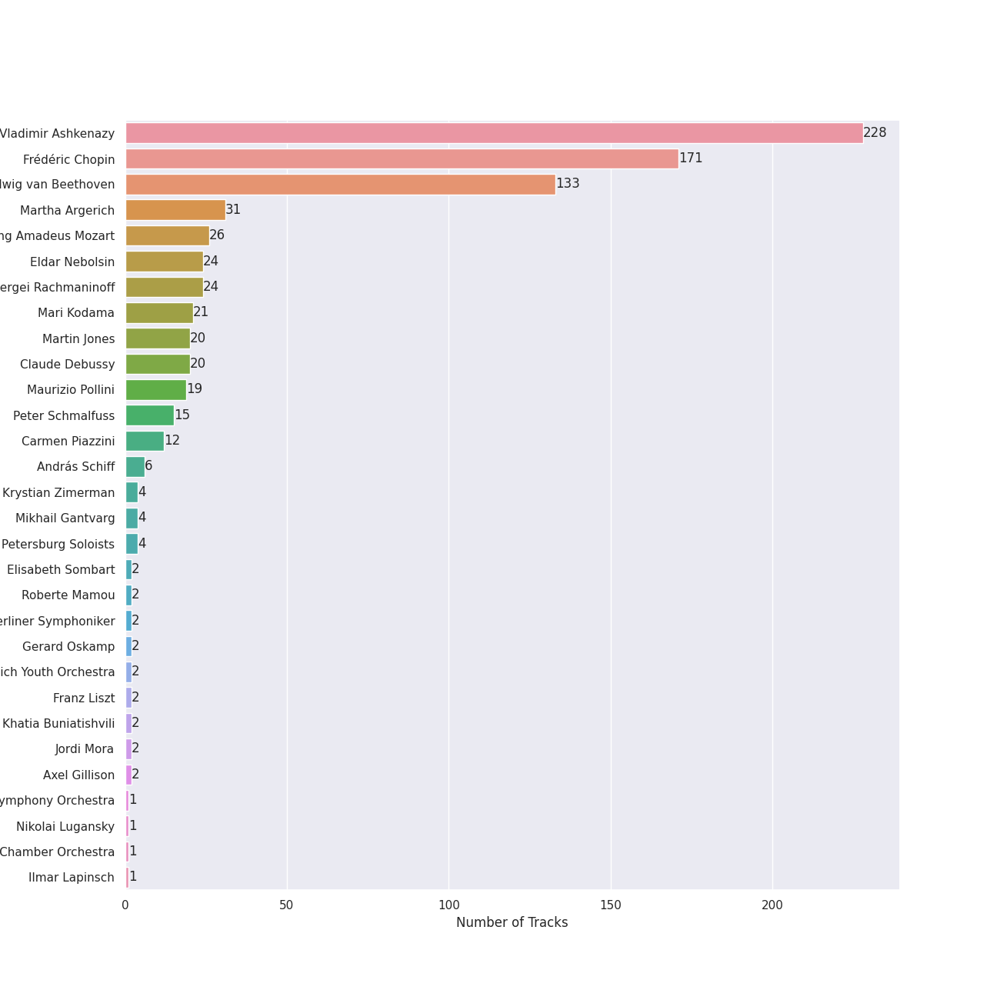

# Classical Piano

## Top Artists

See all artists

|   Number of Tracks | Artist                                                           | 🔗                                                           |
|-------------------:|:-----------------------------------------------------------------|:------------------------------------------------------------|
|                228 | [Vladimir Ashkenazy](../artists/vladimir_ashkenazy.md)           | [🔗](https://open.spotify.com/artist/20iZXzMb8LoWXOeca32i82) |
|                171 | [Frédéric Chopin](../artists/fr_d_ric_chopin.md)                 | [🔗](https://open.spotify.com/artist/7y97mc3bZRFXzT2szRM4L4) |
|                133 | [Ludwig van Beethoven](../artists/ludwig_van_beethoven.md)       | [🔗](https://open.spotify.com/artist/2wOqMjp9TyABvtHdOSOTUS) |
|                 31 | [Martha Argerich](../artists/martha_argerich.md)                 | [🔗](https://open.spotify.com/artist/66MvLAvLznk5UOvASVGjk4) |
|                 26 | [Wolfgang Amadeus Mozart](../artists/wolfgang_amadeus_mozart.md) | [🔗](https://open.spotify.com/artist/4NJhFmfw43RLBLjQvxDuRS) |
|                 24 | [Eldar Nebolsin](../artists/eldar_nebolsin.md)                   | [🔗](https://open.spotify.com/artist/45ts2AJTWlzJ9JrQlCGxpX) |
|                 24 | [Sergei Rachmaninoff](../artists/sergei_rachmaninoff.md)         | [🔗](https://open.spotify.com/artist/0Kekt6CKSo0m5mivKcoH51) |
|                 21 | [Mari Kodama](../artists/mari_kodama.md)                         | [🔗](https://open.spotify.com/artist/0s0wG03kPyu7MXERfcuxim) |
|                 20 | [Martin Jones](../artists/martin_jones.md)                       | [🔗](https://open.spotify.com/artist/1VzJXXVXsYbEK773GWSoND) |
|                 20 | [Claude Debussy](../artists/claude_debussy.md)                   | [🔗](https://open.spotify.com/artist/1Uff91EOsvd99rtAupatMP) |
|                 19 | [Maurizio Pollini](../artists/maurizio_pollini.md)               | [🔗](https://open.spotify.com/artist/2VIdKQmRHnWofsR4odfFOh) |
|                 15 | [Peter Schmalfuss](../artists/peter_schmalfuss.md)               | [🔗](https://open.spotify.com/artist/7mOe6jfxX9EILXET9l5L6H) |
|                 12 | [Carmen Piazzini](../artists/carmen_piazzini.md)                 | [🔗](https://open.spotify.com/artist/6aQUOvrKLOquCAvIGdIwTx) |
|                  6 | András Schiff                                                    | [🔗](https://open.spotify.com/artist/24K6LTZFqBAvKsorwK0iXd) |
|                  4 | Krystian Zimerman                                                | [🔗](https://open.spotify.com/artist/43wuPaPcZVMJQWLRaPR4Yz) |
|                  4 | Mikhail Gantvarg                                                 | [🔗](https://open.spotify.com/artist/1SCRjxxRnRFsoctLKXIoZx) |
|                  4 | The St. Petersburg Soloists                                      | [🔗](https://open.spotify.com/artist/11K9yxwc8iVyEh0ya9v9XY) |
|                  2 | Elisabeth Sombart                                                | [🔗](https://open.spotify.com/artist/6pp4xqAWH1oHFQX0kJtVvO) |
|                  2 | Roberte Mamou                                                    | [🔗](https://open.spotify.com/artist/6DsbdauTI2Fn2NN4B1EIUN) |
|                  2 | Berliner Symphoniker                                             | [🔗](https://open.spotify.com/artist/5pF76lplGIvEFGb8lI48hA) |
|                  2 | Gerard Oskamp                                                    | [🔗](https://open.spotify.com/artist/4TWzdKT6XMuddLAoj6PgXi) |
|                  2 | Munich Youth Orchestra                                           | [🔗](https://open.spotify.com/artist/3jgBofW8eFrbtrsSbLy8Br) |
|                  2 | Franz Liszt                                                      | [🔗](https://open.spotify.com/artist/1385hLNbrnbCJGokfH2ac2) |
|                  2 | Khatia Buniatishvili                                             | [🔗](https://open.spotify.com/artist/0bouHpX4JiuPnIfP2jFxRi) |
|                  2 | Jordi Mora                                                       | [🔗](https://open.spotify.com/artist/0bE9Z0z4cxaixqTRU2O5BA) |
|                  2 | Axel Gillison                                                    | [🔗](https://open.spotify.com/artist/05ukT24TP30K50Blikom8z) |
|                  1 | Mostar Symphony Orchestra                                        | [🔗](https://open.spotify.com/artist/70i7O3jytAajMDs0nV0Zbk) |
|                  1 | Nikolai Lugansky                                                 | [🔗](https://open.spotify.com/artist/2bMfnyPOgNaeK8WNnXNXud) |
|                  1 | Vestischen Chamber Orchestra                                     | [🔗](https://open.spotify.com/artist/1m3ycS5catGCiLB0J5eKDG) |
|                  1 | Ilmar Lapinsch                                                   | [🔗](https://open.spotify.com/artist/0dI3iXIxXjAtMkzZCsOVEg) |
|                  1 | Ratko Delorko                                                    | [🔗](https://open.spotify.com/artist/0E1sM06TDvSpGqNQBx8FV0) |
|                  1 | Gints Berzins                                                    | [🔗](https://open.spotify.com/artist/0CqCB3JQz4h9k3qk74ihWT) |

## Tracks

| Track                                                                                                                     | Album                                                                     | Artists                                                                                                                                                           | 💚   | 🔗                                                          |
|:--------------------------------------------------------------------------------------------------------------------------|:--------------------------------------------------------------------------|:------------------------------------------------------------------------------------------------------------------------------------------------------------------|:----|:-----------------------------------------------------------|
| Children's Corner, L. 113: I. Doctor Gradus ad Parnassum                                                                  | Debussy: Clair De Lune and Other Piano Favourites                         | [Claude Debussy](../artists/claude_debussy.md), [Martin Jones](../artists/martin_jones.md)                                                                        |     | [🔗](https://open.spotify.com/track/1aXL5Y855TvjouIm1vSh7O) |
| Children's Corner, L. 113: II. The Snow is Dancing                                                                        | Debussy: Clair De Lune and Other Piano Favourites                         | [Claude Debussy](../artists/claude_debussy.md), [Martin Jones](../artists/martin_jones.md)                                                                        |     | [🔗](https://open.spotify.com/track/6hCXrrfpaUZma0oeFOc2Vd) |
| Children's Corner, L. 113: III. Golliwogg's Cake-Walk                                                                     | Debussy: Clair De Lune and Other Piano Favourites                         | [Claude Debussy](../artists/claude_debussy.md), [Martin Jones](../artists/martin_jones.md)                                                                        |     | [🔗](https://open.spotify.com/track/6FnhXHcD1a5N59PNri5Dfm) |
| Clair de Lune, L. 32                                                                                                      | Debussy: Clair De Lune and Other Piano Favourites                         | [Claude Debussy](../artists/claude_debussy.md), [Martin Jones](../artists/martin_jones.md)                                                                        |     | [🔗](https://open.spotify.com/track/5u5aVJKjSMJr4zesMPz7bL) |
| Estampes, L. 100: Jardins sous La Pluie                                                                                   | Debussy: Clair De Lune and Other Piano Favourites                         | [Claude Debussy](../artists/claude_debussy.md), [Martin Jones](../artists/martin_jones.md)                                                                        |     | [🔗](https://open.spotify.com/track/7s0WRtr7d2TWjtHBPQRLBU) |
| Images, Set 1, L. 110: Reflets dans L'eau                                                                                 | Debussy: Clair De Lune and Other Piano Favourites                         | [Claude Debussy](../artists/claude_debussy.md), [Martin Jones](../artists/martin_jones.md)                                                                        |     | [🔗](https://open.spotify.com/track/6t81Lud8rl5TOfJHPX1ALu) |
| Images, Set 2, L. 111: et la Lune descend sur le Temple qui fut                                                           | Debussy: Clair De Lune and Other Piano Favourites                         | [Claude Debussy](../artists/claude_debussy.md), [Martin Jones](../artists/martin_jones.md)                                                                        |     | [🔗](https://open.spotify.com/track/4uYqe6JOHty9Eu50ukMV3G) |
| La Fille aux Cheveux de Lin, L. 33                                                                                        | Debussy: Clair De Lune and Other Piano Favourites                         | [Claude Debussy](../artists/claude_debussy.md), [Martin Jones](../artists/martin_jones.md)                                                                        |     | [🔗](https://open.spotify.com/track/0fpqOyC5DLDe5gAYKBB6X7) |
| La Plus que Lente, L. 121                                                                                                 | Debussy: Clair De Lune and Other Piano Favourites                         | [Claude Debussy](../artists/claude_debussy.md), [Martin Jones](../artists/martin_jones.md)                                                                        |     | [🔗](https://open.spotify.com/track/6Q4CCXEvt06gqafDdVcc6i) |
| Masques, L. 105                                                                                                           | Debussy: Clair De Lune and Other Piano Favourites                         | [Claude Debussy](../artists/claude_debussy.md), [Martin Jones](../artists/martin_jones.md)                                                                        |     | [🔗](https://open.spotify.com/track/2A5ByVSpCheGmtzBplfzF0) |
| Préludes Book 1, L. 117: I. Des Pas sur La Neige                                                                          | Debussy: Clair De Lune and Other Piano Favourites                         | [Claude Debussy](../artists/claude_debussy.md), [Martin Jones](../artists/martin_jones.md)                                                                        |     | [🔗](https://open.spotify.com/track/6sabZsBLfsXuo2haLXZLkW) |
| Préludes Book 1, L. 117: II. Ce qu'a vu Le Vent d'Ouest                                                                   | Debussy: Clair De Lune and Other Piano Favourites                         | [Claude Debussy](../artists/claude_debussy.md), [Martin Jones](../artists/martin_jones.md)                                                                        |     | [🔗](https://open.spotify.com/track/3fZny1uZNQIijobgJLIcwf) |
| Préludes Book 1, L. 117: III. La Cathedrale Engloutie                                                                     | Debussy: Clair De Lune and Other Piano Favourites                         | [Claude Debussy](../artists/claude_debussy.md), [Martin Jones](../artists/martin_jones.md)                                                                        |     | [🔗](https://open.spotify.com/track/5u8xycIWRjusC3FmHy8Hmn) |
| Préludes Book 1, L. 117: IV. Minstrels                                                                                    | Debussy: Clair De Lune and Other Piano Favourites                         | [Claude Debussy](../artists/claude_debussy.md), [Martin Jones](../artists/martin_jones.md)                                                                        |     | [🔗](https://open.spotify.com/track/3bnmqzWtNWzWaUqaUWl0dJ) |
| Préludes Book 2, L. 123: I. General Lavine                                                                                | Debussy: Clair De Lune and Other Piano Favourites                         | [Claude Debussy](../artists/claude_debussy.md), [Martin Jones](../artists/martin_jones.md)                                                                        |     | [🔗](https://open.spotify.com/track/4HsGko7qJ2hvCAsRbpb2cA) |
| Préludes Book 2, L. 123: II. Canope                                                                                       | Debussy: Clair De Lune and Other Piano Favourites                         | [Claude Debussy](../artists/claude_debussy.md), [Martin Jones](../artists/martin_jones.md)                                                                        |     | [🔗](https://open.spotify.com/track/1SxHTLszv7kDWz2DH2n6LV) |
| Préludes Book 2, L. 123: III. Feux d'Artifice                                                                             | Debussy: Clair De Lune and Other Piano Favourites                         | [Claude Debussy](../artists/claude_debussy.md), [Martin Jones](../artists/martin_jones.md)                                                                        |     | [🔗](https://open.spotify.com/track/50W2AMW6hgDtv6MWyJfdPK) |
| Suite Bergamasque, L. 75: Passepied                                                                                       | Debussy: Clair De Lune and Other Piano Favourites                         | [Claude Debussy](../artists/claude_debussy.md), [Martin Jones](../artists/martin_jones.md)                                                                        |     | [🔗](https://open.spotify.com/track/3GgKVPxhu0rxYpBXlBwPqw) |
| Études, L. 136: I. Pour les Arpeges Composes                                                                              | Debussy: Clair De Lune and Other Piano Favourites                         | [Claude Debussy](../artists/claude_debussy.md), [Martin Jones](../artists/martin_jones.md)                                                                        |     | [🔗](https://open.spotify.com/track/4TuCVkd3lAAE4AiMwdcR2W) |
| Études, L. 136: II. Pour les Accords                                                                                      | Debussy: Clair De Lune and Other Piano Favourites                         | [Claude Debussy](../artists/claude_debussy.md), [Martin Jones](../artists/martin_jones.md)                                                                        |     | [🔗](https://open.spotify.com/track/6d1YufqXcgbxLI2j9FJYUI) |
| Liebestraum No. 3 in A-Flat Major, S. 541/3                                                                               | Liszt: Piano Works                                                        | Franz Liszt, Khatia Buniatishvili                                                                                                                                 |     | [🔗](https://open.spotify.com/track/5CDCkuiTQhiXLLVILc4WCH) |
| Mephisto Waltz No. 1, S. 514                                                                                              | Liszt: Piano Works                                                        | Franz Liszt, Khatia Buniatishvili                                                                                                                                 |     | [🔗](https://open.spotify.com/track/1dFVnX4mJTnWubAPE8S3OR) |
| Ballade No. 1 in G Minor, Op. 23                                                                                          | Chopin: Ballades; Barcarolle; Fantaisie                                   | [Frédéric Chopin](../artists/fr_d_ric_chopin.md), Krystian Zimerman                                                                                               |     | [🔗](https://open.spotify.com/track/5Ks5ENUFNQDfaqxjZnCkVJ) |
| Ballade No. 2 in F Major, Op. 38                                                                                          | Chopin: Ballades; Barcarolle; Fantaisie                                   | [Frédéric Chopin](../artists/fr_d_ric_chopin.md), Krystian Zimerman                                                                                               |     | [🔗](https://open.spotify.com/track/5R6Xhutodh7bhDGVY71V3O) |
| Ballade No. 3 In A-Flat Major, Op. 47                                                                                     | Chopin: Ballades; Barcarolle; Fantaisie                                   | [Frédéric Chopin](../artists/fr_d_ric_chopin.md), Krystian Zimerman                                                                                               |     | [🔗](https://open.spotify.com/track/0FBJ5Ctk5r4wlVJsFoV8Ta) |
| Ballade No. 4 in F Minor, Op. 52                                                                                          | Chopin: Ballades; Barcarolle; Fantaisie                                   | [Frédéric Chopin](../artists/fr_d_ric_chopin.md), Krystian Zimerman                                                                                               |     | [🔗](https://open.spotify.com/track/1kVoL8Qst9UP3X902NWMo7) |
| 24 Préludes, Op. 28: No. 1 in C Major                                                                                     | Chopin: Preludes; Sonata No.2                                             | [Frédéric Chopin](../artists/fr_d_ric_chopin.md), [Martha Argerich](../artists/martha_argerich.md)                                                                |     | [🔗](https://open.spotify.com/track/5lBrZri8OR3UMqWjdof0E8) |
| 24 Préludes, Op. 28: No. 10 in C-Sharp Minor                                                                              | Chopin: Preludes; Sonata No.2                                             | [Frédéric Chopin](../artists/fr_d_ric_chopin.md), [Martha Argerich](../artists/martha_argerich.md)                                                                |     | [🔗](https://open.spotify.com/track/1QxIoxeq8WGmyiN8ZcbZGB) |
| 24 Préludes, Op. 28: No. 11 in B Major                                                                                    | Chopin: Preludes; Sonata No.2                                             | [Frédéric Chopin](../artists/fr_d_ric_chopin.md), [Martha Argerich](../artists/martha_argerich.md)                                                                |     | [🔗](https://open.spotify.com/track/7ctTTNs8nDbWRgd8j8vnck) |
| 24 Préludes, Op. 28: No. 12. in G-Sharp Minor                                                                             | Chopin: Preludes; Sonata No.2                                             | [Frédéric Chopin](../artists/fr_d_ric_chopin.md), [Martha Argerich](../artists/martha_argerich.md)                                                                |     | [🔗](https://open.spotify.com/track/0SB6a6YMfoGPVLD1Jgc1rn) |
| 24 Préludes, Op. 28: No. 13 in F-Sharp Major                                                                              | Chopin: Preludes; Sonata No.2                                             | [Frédéric Chopin](../artists/fr_d_ric_chopin.md), [Martha Argerich](../artists/martha_argerich.md)                                                                |     | [🔗](https://open.spotify.com/track/7iwxvsVwIWgEevvuz4yleS) |
| 24 Préludes, Op. 28: No. 14 in E-Flat Minor                                                                               | Chopin: Preludes; Sonata No.2                                             | [Frédéric Chopin](../artists/fr_d_ric_chopin.md), [Martha Argerich](../artists/martha_argerich.md)                                                                |     | [🔗](https://open.spotify.com/track/4jUcWucEDO7rf1KA9lIi8A) |
| 24 Préludes, Op. 28: No. 15 in D-Flat Major: Sostenuto                                                                    | Chopin: Preludes; Sonata No.2                                             | [Frédéric Chopin](../artists/fr_d_ric_chopin.md), [Martha Argerich](../artists/martha_argerich.md)                                                                |     | [🔗](https://open.spotify.com/track/5wDBBKEIiDYwPQj4SpbBPI) |
| 24 Préludes, Op. 28: No. 16 in B-Flat Minor                                                                               | Chopin: Preludes; Sonata No.2                                             | [Frédéric Chopin](../artists/fr_d_ric_chopin.md), [Martha Argerich](../artists/martha_argerich.md)                                                                |     | [🔗](https://open.spotify.com/track/1qgyEAoSHWfXjFu00ttsZn) |
| 24 Préludes, Op. 28: No. 17 in A-Flat Major: Allegretto                                                                   | Chopin: Preludes; Sonata No.2                                             | [Frédéric Chopin](../artists/fr_d_ric_chopin.md), [Martha Argerich](../artists/martha_argerich.md)                                                                |     | [🔗](https://open.spotify.com/track/2vRgcveY6WFFyyKdjRmJRO) |
| 24 Préludes, Op. 28: No. 18 in F Minor                                                                                    | Chopin: Preludes; Sonata No.2                                             | [Frédéric Chopin](../artists/fr_d_ric_chopin.md), [Martha Argerich](../artists/martha_argerich.md)                                                                |     | [🔗](https://open.spotify.com/track/3DdmRDwJQhq5fvV0GMk2Zx) |
| 24 Préludes, Op. 28: No. 19 in E-Flat Major                                                                               | Chopin: Preludes; Sonata No.2                                             | [Frédéric Chopin](../artists/fr_d_ric_chopin.md), [Martha Argerich](../artists/martha_argerich.md)                                                                |     | [🔗](https://open.spotify.com/track/6oIaRMOhokqQWfM5mqpJrb) |
| 24 Préludes, Op. 28: No. 2 in A Minor                                                                                     | Chopin: Preludes; Sonata No.2                                             | [Frédéric Chopin](../artists/fr_d_ric_chopin.md), [Martha Argerich](../artists/martha_argerich.md)                                                                |     | [🔗](https://open.spotify.com/track/50uHFlRGf69DM79HQ5iPNu) |
| 24 Préludes, Op. 28: No. 20 in C Minor: Largo                                                                             | Chopin: Preludes; Sonata No.2                                             | [Frédéric Chopin](../artists/fr_d_ric_chopin.md), [Martha Argerich](../artists/martha_argerich.md)                                                                |     | [🔗](https://open.spotify.com/track/3APv0XbJ5jltSic9M1NtNH) |
| 24 Préludes, Op. 28: No. 21 in B-Flat Major                                                                               | Chopin: Preludes; Sonata No.2                                             | [Frédéric Chopin](../artists/fr_d_ric_chopin.md), [Martha Argerich](../artists/martha_argerich.md)                                                                |     | [🔗](https://open.spotify.com/track/7IOQW4DHliCO1l7xG9dL80) |
| 24 Préludes, Op. 28: No. 22 in G Minor                                                                                    | Chopin: Preludes; Sonata No.2                                             | [Frédéric Chopin](../artists/fr_d_ric_chopin.md), [Martha Argerich](../artists/martha_argerich.md)                                                                |     | [🔗](https://open.spotify.com/track/1gAg5ruoZuoy1rF8fwGggX) |
| 24 Préludes, Op. 28: No. 23 in F Major                                                                                    | Chopin: Preludes; Sonata No.2                                             | [Frédéric Chopin](../artists/fr_d_ric_chopin.md), [Martha Argerich](../artists/martha_argerich.md)                                                                |     | [🔗](https://open.spotify.com/track/5SdOHEgN9vaJ79loXY16qr) |
| 24 Préludes, Op. 28: No. 24 in D Minor: Allegro appassionato                                                              | Chopin: Preludes; Sonata No.2                                             | [Frédéric Chopin](../artists/fr_d_ric_chopin.md), [Martha Argerich](../artists/martha_argerich.md)                                                                |     | [🔗](https://open.spotify.com/track/5aaUfeU0Qb60MHFO1UzIad) |
| 24 Préludes, Op. 28: No. 3 in G Major: Vivace                                                                             | Chopin: Preludes; Sonata No.2                                             | [Frédéric Chopin](../artists/fr_d_ric_chopin.md), [Martha Argerich](../artists/martha_argerich.md)                                                                |     | [🔗](https://open.spotify.com/track/311IxmgtMaxDvMe8S4zE9J) |
| 24 Préludes, Op. 28: No. 4 in E Minor                                                                                     | Chopin: Preludes; Sonata No.2                                             | [Frédéric Chopin](../artists/fr_d_ric_chopin.md), [Martha Argerich](../artists/martha_argerich.md)                                                                |     | [🔗](https://open.spotify.com/track/0zrjEWxi3hGYEjUEFeB40V) |
| 24 Préludes, Op. 28: No. 5 in D Major                                                                                     | Chopin: Preludes; Sonata No.2                                             | [Frédéric Chopin](../artists/fr_d_ric_chopin.md), [Martha Argerich](../artists/martha_argerich.md)                                                                |     | [🔗](https://open.spotify.com/track/43FjZOHoblMG4f7yQkJdC3) |
| 24 Préludes, Op. 28: No. 6 in B Minor: Lento assai                                                                        | Chopin: Preludes; Sonata No.2                                             | [Frédéric Chopin](../artists/fr_d_ric_chopin.md), [Martha Argerich](../artists/martha_argerich.md)                                                                |     | [🔗](https://open.spotify.com/track/1MHkrzApuTiaDNJqY4m9IW) |
| 24 Préludes, Op. 28: No. 7 in A Major                                                                                     | Chopin: Preludes; Sonata No.2                                             | [Frédéric Chopin](../artists/fr_d_ric_chopin.md), [Martha Argerich](../artists/martha_argerich.md)                                                                |     | [🔗](https://open.spotify.com/track/1t0Ymd079THxpBWALXe4gX) |
| 24 Préludes, Op. 28: No. 8 in F-Sharp Minor                                                                               | Chopin: Preludes; Sonata No.2                                             | [Frédéric Chopin](../artists/fr_d_ric_chopin.md), [Martha Argerich](../artists/martha_argerich.md)                                                                |     | [🔗](https://open.spotify.com/track/0sP8fj4sT8bIsKP5mWYU1q) |
| 24 Préludes, Op. 28: No. 9 in E Major                                                                                     | Chopin: Preludes; Sonata No.2                                             | [Frédéric Chopin](../artists/fr_d_ric_chopin.md), [Martha Argerich](../artists/martha_argerich.md)                                                                |     | [🔗](https://open.spotify.com/track/6fgEUIlr65HIamKwCTMieC) |
| Piano Sonata No. 2 in B-Flat Minor, Op. 35: I. Grave - Doppio movimento                                                   | Chopin: Preludes; Sonata No.2                                             | [Frédéric Chopin](../artists/fr_d_ric_chopin.md), [Martha Argerich](../artists/martha_argerich.md)                                                                |     | [🔗](https://open.spotify.com/track/6D5tACZAB9ExufhWDXAyax) |
| Piano Sonata No. 2 in B-Flat Minor, Op. 35: II. Scherzo - Più lento - Tempo I                                             | Chopin: Preludes; Sonata No.2                                             | [Frédéric Chopin](../artists/fr_d_ric_chopin.md), [Martha Argerich](../artists/martha_argerich.md)                                                                |     | [🔗](https://open.spotify.com/track/71gcI9CPfuKg5MCKqw06Zi) |
| Piano Sonata No. 2 in B-Flat Minor, Op. 35: III. Marche funèbre                                                           | Chopin: Preludes; Sonata No.2                                             | [Frédéric Chopin](../artists/fr_d_ric_chopin.md), [Martha Argerich](../artists/martha_argerich.md)                                                                |     | [🔗](https://open.spotify.com/track/4lzHRas2lq1WbTksxpOvdH) |
| Piano Sonata No. 2 in B-Flat Minor, Op. 35: IV. Finale                                                                    | Chopin: Preludes; Sonata No.2                                             | [Frédéric Chopin](../artists/fr_d_ric_chopin.md), [Martha Argerich](../artists/martha_argerich.md)                                                                |     | [🔗](https://open.spotify.com/track/4pZlFVRaX15abFOQlIVgjL) |
| Prélude in A-Flat Major, B. 86                                                                                            | Chopin: Preludes; Sonata No.2                                             | [Frédéric Chopin](../artists/fr_d_ric_chopin.md), [Martha Argerich](../artists/martha_argerich.md)                                                                |     | [🔗](https://open.spotify.com/track/2rR3nvTMEymDUU9HlU94Gx) |
| Prélude in C-Sharp Minor, Op. 45                                                                                          | Chopin: Preludes; Sonata No.2                                             | [Frédéric Chopin](../artists/fr_d_ric_chopin.md), [Martha Argerich](../artists/martha_argerich.md)                                                                |     | [🔗](https://open.spotify.com/track/1RvTfoN03GvpUpTdz5zpHz) |
| Polonaise No. 6 in A-Flat Major, Op. 53, "Heroic"                                                                         | Martha Argerich Live, Vol. 4                                              | [Frédéric Chopin](../artists/fr_d_ric_chopin.md), [Martha Argerich](../artists/martha_argerich.md)                                                                |     | [🔗](https://open.spotify.com/track/3QC8VK73CinEi0ZV8Jf9B5) |
| Nocturne No. 1 In B Flat Minor, Op. 9 No. 1                                                                               | Chopin: Nocturnes                                                         | [Frédéric Chopin](../artists/fr_d_ric_chopin.md), [Maurizio Pollini](../artists/maurizio_pollini.md)                                                              |     | [🔗](https://open.spotify.com/track/2d6ml9Qkx8r4EjuUyrdpRV) |
| Nocturne No. 10 In A Flat, Op. 32 No. 2                                                                                   | Chopin: Nocturnes                                                         | [Frédéric Chopin](../artists/fr_d_ric_chopin.md), [Maurizio Pollini](../artists/maurizio_pollini.md)                                                              |     | [🔗](https://open.spotify.com/track/4KrOzPa98JgmFJVaOwLvdJ) |
| Nocturne No. 11 In G Minor, Op. 37 No. 1                                                                                  | Chopin: Nocturnes                                                         | [Frédéric Chopin](../artists/fr_d_ric_chopin.md), [Maurizio Pollini](../artists/maurizio_pollini.md)                                                              |     | [🔗](https://open.spotify.com/track/6saqyONsKCCJw0gWh95LCi) |
| Nocturne No. 12 In G, Op. 37 No. 2                                                                                        | Chopin: Nocturnes                                                         | [Frédéric Chopin](../artists/fr_d_ric_chopin.md), [Maurizio Pollini](../artists/maurizio_pollini.md)                                                              |     | [🔗](https://open.spotify.com/track/48QFWf03hb7Er4NHodAi82) |
| Nocturne No. 13 In C Minor, Op. 48 No. 1                                                                                  | Chopin: Nocturnes                                                         | [Frédéric Chopin](../artists/fr_d_ric_chopin.md), [Maurizio Pollini](../artists/maurizio_pollini.md)                                                              |     | [🔗](https://open.spotify.com/track/4qOccDLi9YIkBJpN7gQDkn) |
| Nocturne No. 14 In F Sharp Minor, Op. 48 No. 2                                                                            | Chopin: Nocturnes                                                         | [Frédéric Chopin](../artists/fr_d_ric_chopin.md), [Maurizio Pollini](../artists/maurizio_pollini.md)                                                              |     | [🔗](https://open.spotify.com/track/5z7VyrtLbDCV3YgomB2JD6) |
| Nocturne No. 15 In F Minor, Op. 55 No. 1                                                                                  | Chopin: Nocturnes                                                         | [Frédéric Chopin](../artists/fr_d_ric_chopin.md), [Maurizio Pollini](../artists/maurizio_pollini.md)                                                              |     | [🔗](https://open.spotify.com/track/0XFiaEw6H4rIuuhNFbnP9F) |
| Nocturne No. 16 In E Flat, Op. 55 No. 2                                                                                   | Chopin: Nocturnes                                                         | [Frédéric Chopin](../artists/fr_d_ric_chopin.md), [Maurizio Pollini](../artists/maurizio_pollini.md)                                                              |     | [🔗](https://open.spotify.com/track/7r9DH7AvvijvMXFMGMsdqK) |
| Nocturne No. 17 In B, Op. 62 No. 1                                                                                        | Chopin: Nocturnes                                                         | [Frédéric Chopin](../artists/fr_d_ric_chopin.md), [Maurizio Pollini](../artists/maurizio_pollini.md)                                                              |     | [🔗](https://open.spotify.com/track/3UhDV3GnefK0y3CUjRBim9) |
| Nocturne No. 18 In E, Op. 62 No. 2                                                                                        | Chopin: Nocturnes                                                         | [Frédéric Chopin](../artists/fr_d_ric_chopin.md), [Maurizio Pollini](../artists/maurizio_pollini.md)                                                              |     | [🔗](https://open.spotify.com/track/4PKNFBtURS8wuOyJoA5I1S) |
| Nocturne No. 19 In E Minor, Op. 72 No. 1                                                                                  | Chopin: Nocturnes                                                         | [Frédéric Chopin](../artists/fr_d_ric_chopin.md), [Maurizio Pollini](../artists/maurizio_pollini.md)                                                              |     | [🔗](https://open.spotify.com/track/068BPNYklLpBX6VhMCKsUX) |
| Nocturne No. 2 In E Flat, Op. 9 No. 2                                                                                     | Chopin: Nocturnes                                                         | [Frédéric Chopin](../artists/fr_d_ric_chopin.md), [Maurizio Pollini](../artists/maurizio_pollini.md)                                                              |     | [🔗](https://open.spotify.com/track/503fwzlbWHx5g0CqlU9Giu) |
| Nocturne No. 3 In B, Op. 9 No. 3                                                                                          | Chopin: Nocturnes                                                         | [Frédéric Chopin](../artists/fr_d_ric_chopin.md), [Maurizio Pollini](../artists/maurizio_pollini.md)                                                              |     | [🔗](https://open.spotify.com/track/5WfsSJH86qH4fOhsTu03nT) |
| Nocturne No. 4 In F, Op. 15 No. 1                                                                                         | Chopin: Nocturnes                                                         | [Frédéric Chopin](../artists/fr_d_ric_chopin.md), [Maurizio Pollini](../artists/maurizio_pollini.md)                                                              |     | [🔗](https://open.spotify.com/track/2HGPwnDkObM0QxHduiQQf7) |
| Nocturne No. 5 In F Sharp, Op. 15 No. 2                                                                                   | Chopin: Nocturnes                                                         | [Frédéric Chopin](../artists/fr_d_ric_chopin.md), [Maurizio Pollini](../artists/maurizio_pollini.md)                                                              |     | [🔗](https://open.spotify.com/track/2hRx649mlo5boO1jfDe03O) |
| Nocturne No. 6 In G Minor, Op. 15 No. 3                                                                                   | Chopin: Nocturnes                                                         | [Frédéric Chopin](../artists/fr_d_ric_chopin.md), [Maurizio Pollini](../artists/maurizio_pollini.md)                                                              |     | [🔗](https://open.spotify.com/track/5PHajk1v9B4z9ubkhDrFj6) |
| Nocturne No. 7 In C Sharp Minor, Op. 27 No. 1 - 2005 Recording                                                            | Chopin: Nocturnes                                                         | [Frédéric Chopin](../artists/fr_d_ric_chopin.md), [Maurizio Pollini](../artists/maurizio_pollini.md)                                                              |     | [🔗](https://open.spotify.com/track/4FFaOQHk9j1QknVLyIPUxl) |
| Nocturne No. 8 In D Flat, Op. 27 No. 2 - 2005 Recording                                                                   | Chopin: Nocturnes                                                         | [Frédéric Chopin](../artists/fr_d_ric_chopin.md), [Maurizio Pollini](../artists/maurizio_pollini.md)                                                              |     | [🔗](https://open.spotify.com/track/3G98iZXs933j4EkqACWfka) |
| Nocturne No. 9 In B, Op. 32 No. 1                                                                                         | Chopin: Nocturnes                                                         | [Frédéric Chopin](../artists/fr_d_ric_chopin.md), [Maurizio Pollini](../artists/maurizio_pollini.md)                                                              |     | [🔗](https://open.spotify.com/track/5cNbz1TcuzndymBqUNyBC7) |
| Fantaisie-impromptu in C-Sharp Minor, Op. 66: Fantaisie-impromptu in C-Sharp Minor, Op. 66                                | Chopin: Piano Sonata No. 3, Fantasie-impromptu, Prélude, Nocturne, et al. | [Frédéric Chopin](../artists/fr_d_ric_chopin.md), Nikolai Lugansky                                                                                                |     | [🔗](https://open.spotify.com/track/2D2fqN3hLbBhQUickM3hpG) |
| Ballade No. 1 in G Minor, Op. 23                                                                                          | Chopin Favourites                                                         | [Frédéric Chopin](../artists/fr_d_ric_chopin.md), [Vladimir Ashkenazy](../artists/vladimir_ashkenazy.md)                                                          |     | [🔗](https://open.spotify.com/track/2pv3n1wBknqsyphdzaEyky) |
| Impromptu No.4 in C Sharp Minor, Op.66 "Fantaisie-Impromptu"                                                              | Chopin Favourites                                                         | [Frédéric Chopin](../artists/fr_d_ric_chopin.md), [Vladimir Ashkenazy](../artists/vladimir_ashkenazy.md)                                                          |     | [🔗](https://open.spotify.com/track/1dUnCFWiZZE59yxke2nCWK) |
| Mazurka No.23 in D Major, Op.33 No.2                                                                                      | Chopin Favourites                                                         | [Frédéric Chopin](../artists/fr_d_ric_chopin.md), [Vladimir Ashkenazy](../artists/vladimir_ashkenazy.md)                                                          |     | [🔗](https://open.spotify.com/track/5RgacZwdZV2BmVMZ7CD7p8) |
| Mazurka No.5 in B Flat, Op.7 No.1                                                                                         | Chopin Favourites                                                         | [Frédéric Chopin](../artists/fr_d_ric_chopin.md), [Vladimir Ashkenazy](../artists/vladimir_ashkenazy.md)                                                          |     | [🔗](https://open.spotify.com/track/6m33KS2gjUdpIjhI2PzYG2) |
| Nocturne No. 2 in E-Flat Major, Op. 9 No. 2                                                                               | Chopin Favourites                                                         | [Frédéric Chopin](../artists/fr_d_ric_chopin.md), [Vladimir Ashkenazy](../artists/vladimir_ashkenazy.md)                                                          |     | [🔗](https://open.spotify.com/track/2TB6PQkgnw9rrFRK4VOOrC) |
| Nocturne No. 5 in F-Sharp Major, Op. 15 No. 2                                                                             | Chopin Favourites                                                         | [Frédéric Chopin](../artists/fr_d_ric_chopin.md), [Vladimir Ashkenazy](../artists/vladimir_ashkenazy.md)                                                          |     | [🔗](https://open.spotify.com/track/7fjab8qyyOXiquPBIcj67M) |
| Nocturne No. 9 in B Major, Op. 32 No. 1                                                                                   | Chopin Favourites                                                         | [Frédéric Chopin](../artists/fr_d_ric_chopin.md), [Vladimir Ashkenazy](../artists/vladimir_ashkenazy.md)                                                          |     | [🔗](https://open.spotify.com/track/5UpQqGyhYg70rRXgPuy28o) |
| Polonaise No.6 in A flat, Op.53 -"Heroic"                                                                                 | Chopin Favourites                                                         | [Frédéric Chopin](../artists/fr_d_ric_chopin.md), [Vladimir Ashkenazy](../artists/vladimir_ashkenazy.md)                                                          |     | [🔗](https://open.spotify.com/track/3Gb9CLvR6fcK2AUNUwyrJr) |
| Scherzo No.2 in B Flat Minor, Op.31                                                                                       | Chopin Favourites                                                         | [Frédéric Chopin](../artists/fr_d_ric_chopin.md), [Vladimir Ashkenazy](../artists/vladimir_ashkenazy.md)                                                          |     | [🔗](https://open.spotify.com/track/22BaCb2z8TYhAT40xjqah1) |
| Waltz No. 10 in B Minor, Op. 69 No. 2                                                                                     | Chopin Favourites                                                         | [Frédéric Chopin](../artists/fr_d_ric_chopin.md), [Vladimir Ashkenazy](../artists/vladimir_ashkenazy.md)                                                          |     | [🔗](https://open.spotify.com/track/1h68Il0zOLN9LoGI7KdMoX) |
| Waltz No.1 in E Flat, Op.18 -"Grande valse brillante"                                                                     | Chopin Favourites                                                         | [Frédéric Chopin](../artists/fr_d_ric_chopin.md), [Vladimir Ashkenazy](../artists/vladimir_ashkenazy.md)                                                          |     | [🔗](https://open.spotify.com/track/29vErSIWXxO7mwuULuERbz) |
| Waltz No.11 in G Flat, Op.70 No.1                                                                                         | Chopin Favourites                                                         | [Frédéric Chopin](../artists/fr_d_ric_chopin.md), [Vladimir Ashkenazy](../artists/vladimir_ashkenazy.md)                                                          |     | [🔗](https://open.spotify.com/track/1fv6gAlyC6vtOfxnzyD72q) |
| Waltz No.3 in A Minor, Op.34 No.2                                                                                         | Chopin Favourites                                                         | [Frédéric Chopin](../artists/fr_d_ric_chopin.md), [Vladimir Ashkenazy](../artists/vladimir_ashkenazy.md)                                                          |     | [🔗](https://open.spotify.com/track/3Z8zMU95Ty30GCav2Kgnci) |
| Waltz No.9 in A Flat, Op.69 No.1 -"Farewell"                                                                              | Chopin Favourites                                                         | [Frédéric Chopin](../artists/fr_d_ric_chopin.md), [Vladimir Ashkenazy](../artists/vladimir_ashkenazy.md)                                                          |     | [🔗](https://open.spotify.com/track/49J84uVr6beUqpm0igOd8V) |
| Ballade No. 1 in G Minor, Op. 23                                                                                          | Chopin: Nocturnes; Four Ballades                                          | [Frédéric Chopin](../artists/fr_d_ric_chopin.md), [Vladimir Ashkenazy](../artists/vladimir_ashkenazy.md)                                                          |     | [🔗](https://open.spotify.com/track/1r2DD0vabJ1pnNHIIizopr) |
| Ballade No. 2 in F Major, Op. 38                                                                                          | Chopin: Nocturnes; Four Ballades                                          | [Frédéric Chopin](../artists/fr_d_ric_chopin.md), [Vladimir Ashkenazy](../artists/vladimir_ashkenazy.md)                                                          |     | [🔗](https://open.spotify.com/track/0zmxqIjwAYlgcN8EewlGgB) |
| Ballade No. 3 in A flat major, Op. 47                                                                                     | Chopin: Nocturnes; Four Ballades                                          | [Frédéric Chopin](../artists/fr_d_ric_chopin.md), [Vladimir Ashkenazy](../artists/vladimir_ashkenazy.md)                                                          |     | [🔗](https://open.spotify.com/track/756fuQpfcXJQdTqy7MAvhy) |
| Ballade No. 4 in F minor, Op. 52                                                                                          | Chopin: Nocturnes; Four Ballades                                          | [Frédéric Chopin](../artists/fr_d_ric_chopin.md), [Vladimir Ashkenazy](../artists/vladimir_ashkenazy.md)                                                          |     | [🔗](https://open.spotify.com/track/6luoY7uOnbePEDaDOVwqoy) |
| Nocturne No. 1 in B-Flat Minor, Op. 9 No. 1                                                                               | Chopin: Nocturnes; Four Ballades                                          | [Frédéric Chopin](../artists/fr_d_ric_chopin.md), [Vladimir Ashkenazy](../artists/vladimir_ashkenazy.md)                                                          |     | [🔗](https://open.spotify.com/track/08wPzTIkAGQ8GdCmVQxvIE) |
| Nocturne No. 10 in A-Flat Major, Op. 32 No. 2                                                                             | Chopin: Nocturnes; Four Ballades                                          | [Frédéric Chopin](../artists/fr_d_ric_chopin.md), [Vladimir Ashkenazy](../artists/vladimir_ashkenazy.md)                                                          |     | [🔗](https://open.spotify.com/track/48yLOxQazsbzSdz3Rq8qev) |
| Nocturne No. 11 in G minor, Op. 37 No. 1                                                                                  | Chopin: Nocturnes; Four Ballades                                          | [Frédéric Chopin](../artists/fr_d_ric_chopin.md), [Vladimir Ashkenazy](../artists/vladimir_ashkenazy.md)                                                          |     | [🔗](https://open.spotify.com/track/55pyAtpmb5fH2pYCK1wxBH) |
| Nocturne No. 12 in G major, Op. 37 No. 2                                                                                  | Chopin: Nocturnes; Four Ballades                                          | [Frédéric Chopin](../artists/fr_d_ric_chopin.md), [Vladimir Ashkenazy](../artists/vladimir_ashkenazy.md)                                                          |     | [🔗](https://open.spotify.com/track/1ZT4T8ftv5PHgpNvpEzKHp) |
| Nocturne No. 15 in F Minor, Op. 55 No. 1                                                                                  | Chopin: Nocturnes; Four Ballades                                          | [Frédéric Chopin](../artists/fr_d_ric_chopin.md), [Vladimir Ashkenazy](../artists/vladimir_ashkenazy.md)                                                          |     | [🔗](https://open.spotify.com/track/1neavdmcTYipmJqCNlwhRo) |
| Nocturne No. 16 in E-Flat Major, Op. 55 No. 2                                                                             | Chopin: Nocturnes; Four Ballades                                          | [Frédéric Chopin](../artists/fr_d_ric_chopin.md), [Vladimir Ashkenazy](../artists/vladimir_ashkenazy.md)                                                          |     | [🔗](https://open.spotify.com/track/2VxVfSgqjiUq0Lo6wdqfTT) |
| Nocturne No. 17 in B Major, Op. 62 No. 1                                                                                  | Chopin: Nocturnes; Four Ballades                                          | [Frédéric Chopin](../artists/fr_d_ric_chopin.md), [Vladimir Ashkenazy](../artists/vladimir_ashkenazy.md)                                                          |     | [🔗](https://open.spotify.com/track/5E97lO1DOegAaoXFo9Ydeb) |
| Nocturne No. 18 in E Major, Op. 62 No. 2                                                                                  | Chopin: Nocturnes; Four Ballades                                          | [Frédéric Chopin](../artists/fr_d_ric_chopin.md), [Vladimir Ashkenazy](../artists/vladimir_ashkenazy.md)                                                          |     | [🔗](https://open.spotify.com/track/6la3MMpUCkvxN2HgoQWvf3) |
| Nocturne No. 2 in E-Flat Major, Op. 9 No. 2                                                                               | Chopin: Nocturnes; Four Ballades                                          | [Frédéric Chopin](../artists/fr_d_ric_chopin.md), [Vladimir Ashkenazy](../artists/vladimir_ashkenazy.md)                                                          |     | [🔗](https://open.spotify.com/track/6Y6TlK3fa3P2lGvHAM5yLq) |
| Nocturne No. 20 in C sharp minor, Op. posth.                                                                              | Chopin: Nocturnes; Four Ballades                                          | [Frédéric Chopin](../artists/fr_d_ric_chopin.md), [Vladimir Ashkenazy](../artists/vladimir_ashkenazy.md)                                                          |     | [🔗](https://open.spotify.com/track/70cbObAWIBqFMDdFQYBRuz) |
| Nocturne No. 3 in B Major, Op. 9 No.3                                                                                     | Chopin: Nocturnes; Four Ballades                                          | [Frédéric Chopin](../artists/fr_d_ric_chopin.md), [Vladimir Ashkenazy](../artists/vladimir_ashkenazy.md)                                                          |     | [🔗](https://open.spotify.com/track/6hkWg7ZomgbZNI26ZuXl5E) |
| Nocturne No. 4 in F Major, Op. 15 No. 1                                                                                   | Chopin: Nocturnes; Four Ballades                                          | [Frédéric Chopin](../artists/fr_d_ric_chopin.md), [Vladimir Ashkenazy](../artists/vladimir_ashkenazy.md)                                                          |     | [🔗](https://open.spotify.com/track/72lRISk2ktnJAFCXqD8efJ) |
| Nocturne No. 5 in F-Sharp Major, Op. 15 No. 2                                                                             | Chopin: Nocturnes; Four Ballades                                          | [Frédéric Chopin](../artists/fr_d_ric_chopin.md), [Vladimir Ashkenazy](../artists/vladimir_ashkenazy.md)                                                          |     | [🔗](https://open.spotify.com/track/3pMMV07c8cnoEq4cCPwZnV) |
| Nocturne No. 6 in G Minor, Op. 15 No. 3                                                                                   | Chopin: Nocturnes; Four Ballades                                          | [Frédéric Chopin](../artists/fr_d_ric_chopin.md), [Vladimir Ashkenazy](../artists/vladimir_ashkenazy.md)                                                          |     | [🔗](https://open.spotify.com/track/4oJ0kJqH0cxo6KA9aUu6O7) |
| Nocturne No. 7 in C-Sharp Minor, Op. 27 No. 1                                                                             | Chopin: Nocturnes; Four Ballades                                          | [Frédéric Chopin](../artists/fr_d_ric_chopin.md), [Vladimir Ashkenazy](../artists/vladimir_ashkenazy.md)                                                          |     | [🔗](https://open.spotify.com/track/6TkDRZTjNLZZcrSQyjUSZZ) |
| Nocturne No. 8 in D flat major, Op. 27 No.2                                                                               | Chopin: Nocturnes; Four Ballades                                          | [Frédéric Chopin](../artists/fr_d_ric_chopin.md), [Vladimir Ashkenazy](../artists/vladimir_ashkenazy.md)                                                          |     | [🔗](https://open.spotify.com/track/4HJa04mR7oM1E1QfBQnJOe) |
| Nocturne No. 9 in B Major, Op. 32 No. 1                                                                                   | Chopin: Nocturnes; Four Ballades                                          | [Frédéric Chopin](../artists/fr_d_ric_chopin.md), [Vladimir Ashkenazy](../artists/vladimir_ashkenazy.md)                                                          |     | [🔗](https://open.spotify.com/track/08GWfq6GjYQ63lPKTrTMOb) |
| Nocturne No.13 in C minor, Op. 48 No. 1                                                                                   | Chopin: Nocturnes; Four Ballades                                          | [Frédéric Chopin](../artists/fr_d_ric_chopin.md), [Vladimir Ashkenazy](../artists/vladimir_ashkenazy.md)                                                          |     | [🔗](https://open.spotify.com/track/58u2dDw3sh2yW4ESZHEPPO) |
| Nocturne No.14 in F sharp minor, Op. 48 No. 2                                                                             | Chopin: Nocturnes; Four Ballades                                          | [Frédéric Chopin](../artists/fr_d_ric_chopin.md), [Vladimir Ashkenazy](../artists/vladimir_ashkenazy.md)                                                          |     | [🔗](https://open.spotify.com/track/21V4PYCwr3bPUQ3g2MRiVi) |
| Nocturne No.19 in E minor, Op.72, No 1                                                                                    | Chopin: Nocturnes; Four Ballades                                          | [Frédéric Chopin](../artists/fr_d_ric_chopin.md), [Vladimir Ashkenazy](../artists/vladimir_ashkenazy.md)                                                          |     | [🔗](https://open.spotify.com/track/7h2K4Wo1fd8mQI35Xo6Pax) |
| Nocturne in C Minor, B. 108                                                                                               | Chopin: Nocturnes; Four Ballades                                          | [Frédéric Chopin](../artists/fr_d_ric_chopin.md), [Vladimir Ashkenazy](../artists/vladimir_ashkenazy.md)                                                          |     | [🔗](https://open.spotify.com/track/0Wy1PVVtoKXI259E43Hivl) |
| 2 Bourrees, B160b                                                                                                         | Chopin: Polonaises                                                        | [Frédéric Chopin](../artists/fr_d_ric_chopin.md), [Vladimir Ashkenazy](../artists/vladimir_ashkenazy.md)                                                          |     | [🔗](https://open.spotify.com/track/0NQBcvME4NKAruNFixVDa8) |
| Allegro de concert in A, Op. 46                                                                                           | Chopin: Polonaises                                                        | [Frédéric Chopin](../artists/fr_d_ric_chopin.md), [Vladimir Ashkenazy](../artists/vladimir_ashkenazy.md)                                                          |     | [🔗](https://open.spotify.com/track/5HYXEEalWgkYTPCphTXRNY) |
| Barcarolle in F-Sharp Major, Op. 60                                                                                       | Chopin: Polonaises                                                        | [Frédéric Chopin](../artists/fr_d_ric_chopin.md), [Vladimir Ashkenazy](../artists/vladimir_ashkenazy.md)                                                          |     | [🔗](https://open.spotify.com/track/5XYA3OqUUlTwmd68LoRZ41) |
| Berceuse in D-Flat Major, Op. 57                                                                                          | Chopin: Polonaises                                                        | [Frédéric Chopin](../artists/fr_d_ric_chopin.md), [Vladimir Ashkenazy](../artists/vladimir_ashkenazy.md)                                                          |     | [🔗](https://open.spotify.com/track/5MTSnTHRueOmkRKxZl5cnD) |
| Etude in A flat, Op. posth. " Méthode des méthodes "                                                                      | Chopin: Polonaises                                                        | [Frédéric Chopin](../artists/fr_d_ric_chopin.md), [Vladimir Ashkenazy](../artists/vladimir_ashkenazy.md)                                                          |     | [🔗](https://open.spotify.com/track/13F1AunNkOPDFNx4qU45Yi) |
| Etude in D flat, Op. posth. " Méthode des méthodes "                                                                      | Chopin: Polonaises                                                        | [Frédéric Chopin](../artists/fr_d_ric_chopin.md), [Vladimir Ashkenazy](../artists/vladimir_ashkenazy.md)                                                          |     | [🔗](https://open.spotify.com/track/0banlptk443bq1tLPFcy0f) |
| Etude in F minor, Op. posth. " Méthode des méthodes "                                                                     | Chopin: Polonaises                                                        | [Frédéric Chopin](../artists/fr_d_ric_chopin.md), [Vladimir Ashkenazy](../artists/vladimir_ashkenazy.md)                                                          |     | [🔗](https://open.spotify.com/track/32nPG1lcFo1yMLAvxkqJMI) |
| Feuille d'album in E, Op. posth.                                                                                          | Chopin: Polonaises                                                        | [Frédéric Chopin](../artists/fr_d_ric_chopin.md), [Vladimir Ashkenazy](../artists/vladimir_ashkenazy.md)                                                          |     | [🔗](https://open.spotify.com/track/7kI2IrXahE6gVUIiRmQSLE) |
| Fugue in A minor                                                                                                          | Chopin: Polonaises                                                        | [Frédéric Chopin](../artists/fr_d_ric_chopin.md), [Vladimir Ashkenazy](../artists/vladimir_ashkenazy.md)                                                          |     | [🔗](https://open.spotify.com/track/31dHappgsBbViaFb5O26AD) |
| Galop Marquis                                                                                                             | Chopin: Polonaises                                                        | [Frédéric Chopin](../artists/fr_d_ric_chopin.md), [Vladimir Ashkenazy](../artists/vladimir_ashkenazy.md)                                                          |     | [🔗](https://open.spotify.com/track/0CeyjRUCfoltQmSTVL1h3M) |
| Polonaise No. 1 in C sharp minor, Op. 26 No. 1                                                                            | Chopin: Polonaises                                                        | [Frédéric Chopin](../artists/fr_d_ric_chopin.md), [Vladimir Ashkenazy](../artists/vladimir_ashkenazy.md)                                                          |     | [🔗](https://open.spotify.com/track/1OCezcm1Sy4qHouo4S5pYp) |
| Polonaise No. 10 in F Minor, Op. 71 No. 3                                                                                 | Chopin: Polonaises                                                        | [Frédéric Chopin](../artists/fr_d_ric_chopin.md), [Vladimir Ashkenazy](../artists/vladimir_ashkenazy.md)                                                          |     | [🔗](https://open.spotify.com/track/4Z1UxWGoY904w8k9mszKM7) |
| Polonaise No. 2 in E flat minor, Op. 26 No. 2                                                                             | Chopin: Polonaises                                                        | [Frédéric Chopin](../artists/fr_d_ric_chopin.md), [Vladimir Ashkenazy](../artists/vladimir_ashkenazy.md)                                                          |     | [🔗](https://open.spotify.com/track/3ydVMQUTvpVrF8dZrsl5Ev) |
| Polonaise No. 3 in A, Op. 40 No. 1 - "Military"                                                                           | Chopin: Polonaises                                                        | [Frédéric Chopin](../artists/fr_d_ric_chopin.md), [Vladimir Ashkenazy](../artists/vladimir_ashkenazy.md)                                                          |     | [🔗](https://open.spotify.com/track/0gVQEJjqUsi90RxWqVbgwh) |
| Polonaise No. 4 in C minor, Op. 40 No. 2                                                                                  | Chopin: Polonaises                                                        | [Frédéric Chopin](../artists/fr_d_ric_chopin.md), [Vladimir Ashkenazy](../artists/vladimir_ashkenazy.md)                                                          |     | [🔗](https://open.spotify.com/track/2GNjTKljmnTuM1u1JybqWo) |
| Polonaise No. 7 in A-Flat Major, Op. 61 "Polonaise-Fantaisie"                                                             | Chopin: Polonaises                                                        | [Frédéric Chopin](../artists/fr_d_ric_chopin.md), [Vladimir Ashkenazy](../artists/vladimir_ashkenazy.md)                                                          |     | [🔗](https://open.spotify.com/track/6Ww7NRbAZVhujfpzbxDwT1) |
| Polonaise No. 8 in D minor, Op. 71 No. 1                                                                                  | Chopin: Polonaises                                                        | [Frédéric Chopin](../artists/fr_d_ric_chopin.md), [Vladimir Ashkenazy](../artists/vladimir_ashkenazy.md)                                                          |     | [🔗](https://open.spotify.com/track/6KLB4fl8olgi63Ou1rCk6G) |
| Polonaise No. 9 in B flat, Op. 71 No. 2                                                                                   | Chopin: Polonaises                                                        | [Frédéric Chopin](../artists/fr_d_ric_chopin.md), [Vladimir Ashkenazy](../artists/vladimir_ashkenazy.md)                                                          |     | [🔗](https://open.spotify.com/track/1Zn73d2gGlicKht8Gy2dEC) |
| Polonaise No.5 in F sharp minor, Op.44                                                                                    | Chopin: Polonaises                                                        | [Frédéric Chopin](../artists/fr_d_ric_chopin.md), [Vladimir Ashkenazy](../artists/vladimir_ashkenazy.md)                                                          |     | [🔗](https://open.spotify.com/track/2zspeAzgqAGGXCqMRToZA9) |
| Polonaise No.6 in A flat, Op.53 -"Heroic"                                                                                 | Chopin: Polonaises                                                        | [Frédéric Chopin](../artists/fr_d_ric_chopin.md), [Vladimir Ashkenazy](../artists/vladimir_ashkenazy.md)                                                          |     | [🔗](https://open.spotify.com/track/3yfUKhwg1Z3EQ9JDuD4IcK) |
| Polonaise in A flat, Op. posth.                                                                                           | Chopin: Polonaises                                                        | [Frédéric Chopin](../artists/fr_d_ric_chopin.md), [Vladimir Ashkenazy](../artists/vladimir_ashkenazy.md)                                                          |     | [🔗](https://open.spotify.com/track/5ggAFuPO4UTnwTyQvsXKrH) |
| Polonaise in B flat minor, "Adieu" Op. posth.                                                                             | Chopin: Polonaises                                                        | [Frédéric Chopin](../artists/fr_d_ric_chopin.md), [Vladimir Ashkenazy](../artists/vladimir_ashkenazy.md)                                                          |     | [🔗](https://open.spotify.com/track/4wSnRMekUb9HNqBVb7n2YB) |
| Polonaise in B flat, Op. posth.                                                                                           | Chopin: Polonaises                                                        | [Frédéric Chopin](../artists/fr_d_ric_chopin.md), [Vladimir Ashkenazy](../artists/vladimir_ashkenazy.md)                                                          |     | [🔗](https://open.spotify.com/track/5deo7Ft5wjFnOHDiW70nID) |
| Polonaise in G minor, Op. posth.                                                                                          | Chopin: Polonaises                                                        | [Frédéric Chopin](../artists/fr_d_ric_chopin.md), [Vladimir Ashkenazy](../artists/vladimir_ashkenazy.md)                                                          |     | [🔗](https://open.spotify.com/track/4JXQYuYn9NLqe9iVVAl21T) |
| Polonaise in G sharp minor, Op. posth.                                                                                    | Chopin: Polonaises                                                        | [Frédéric Chopin](../artists/fr_d_ric_chopin.md), [Vladimir Ashkenazy](../artists/vladimir_ashkenazy.md)                                                          |     | [🔗](https://open.spotify.com/track/5QNMePqrnx2LEGIBnT7gEt) |
| Polonaise in G-Flat Major, Op. posth.                                                                                     | Chopin: Polonaises                                                        | [Frédéric Chopin](../artists/fr_d_ric_chopin.md), [Vladimir Ashkenazy](../artists/vladimir_ashkenazy.md)                                                          |     | [🔗](https://open.spotify.com/track/1K1wiCI72t7woE8VfrJg2K) |
| Tarantelle In A Flat, Op. 43                                                                                              | Chopin: Polonaises                                                        | [Frédéric Chopin](../artists/fr_d_ric_chopin.md), [Vladimir Ashkenazy](../artists/vladimir_ashkenazy.md)                                                          |     | [🔗](https://open.spotify.com/track/0Dy23NaykLsmz6VM0lUJ9e) |
| Wiosna, B117 (arr. from Op. 74/2)                                                                                         | Chopin: Polonaises                                                        | [Frédéric Chopin](../artists/fr_d_ric_chopin.md), [Vladimir Ashkenazy](../artists/vladimir_ashkenazy.md)                                                          |     | [🔗](https://open.spotify.com/track/43ImiMGkllrumEdG03D0nX) |
| 24 Préludes, Op. 28: No. 1 in C Major: Agitato                                                                            | Chopin: Waltzes; 4 Scherzos; 26 Preludes                                  | [Frédéric Chopin](../artists/fr_d_ric_chopin.md), [Vladimir Ashkenazy](../artists/vladimir_ashkenazy.md)                                                          |     | [🔗](https://open.spotify.com/track/2Yf9vmbIP7T5ePTWJBRHLB) |
| 24 Préludes, Op. 28: No. 10 in C-Sharp Minor: Molto allegro                                                               | Chopin: Waltzes; 4 Scherzos; 26 Preludes                                  | [Frédéric Chopin](../artists/fr_d_ric_chopin.md), [Vladimir Ashkenazy](../artists/vladimir_ashkenazy.md)                                                          |     | [🔗](https://open.spotify.com/track/76L7FXkwv4SnOdH9KLNp8T) |
| 24 Préludes, Op. 28: No. 11 in B Major: Vivace                                                                            | Chopin: Waltzes; 4 Scherzos; 26 Preludes                                  | [Frédéric Chopin](../artists/fr_d_ric_chopin.md), [Vladimir Ashkenazy](../artists/vladimir_ashkenazy.md)                                                          |     | [🔗](https://open.spotify.com/track/3YhQthjnOeJquPn2f1c93j) |
| 24 Préludes, Op. 28: No. 12 in G-Sharp Minor: Presto                                                                      | Chopin: Waltzes; 4 Scherzos; 26 Preludes                                  | [Frédéric Chopin](../artists/fr_d_ric_chopin.md), [Vladimir Ashkenazy](../artists/vladimir_ashkenazy.md)                                                          |     | [🔗](https://open.spotify.com/track/1ChXCn8eqUoqMsGxeYEIEH) |
| 24 Préludes, Op. 28: No. 13 in F-Sharp Major: Lento                                                                       | Chopin: Waltzes; 4 Scherzos; 26 Preludes                                  | [Frédéric Chopin](../artists/fr_d_ric_chopin.md), [Vladimir Ashkenazy](../artists/vladimir_ashkenazy.md)                                                          |     | [🔗](https://open.spotify.com/track/2iXNlTDvEMN274pMhS5jxm) |
| 24 Préludes, Op. 28: No. 14 in E-Flat Minor: Allegro                                                                      | Chopin: Waltzes; 4 Scherzos; 26 Preludes                                  | [Frédéric Chopin](../artists/fr_d_ric_chopin.md), [Vladimir Ashkenazy](../artists/vladimir_ashkenazy.md)                                                          |     | [🔗](https://open.spotify.com/track/6d65ovjlVL7EUfufK4ucrM) |
| 24 Préludes, Op. 28: No. 15 in D-Flat Major: Sostenuto "Raindrop"                                                         | Chopin: Waltzes; 4 Scherzos; 26 Preludes                                  | [Frédéric Chopin](../artists/fr_d_ric_chopin.md), [Vladimir Ashkenazy](../artists/vladimir_ashkenazy.md)                                                          |     | [🔗](https://open.spotify.com/track/6XE1ggsXC79s3EbG5pSI8u) |
| 24 Préludes, Op. 28: No. 16 in B-Flat Minor: Presto con fuoco                                                             | Chopin: Waltzes; 4 Scherzos; 26 Preludes                                  | [Frédéric Chopin](../artists/fr_d_ric_chopin.md), [Vladimir Ashkenazy](../artists/vladimir_ashkenazy.md)                                                          |     | [🔗](https://open.spotify.com/track/1KZYPGDt5PQGVekS9jpLG6) |
| 24 Préludes, Op. 28: No. 17 in A-Flat Major: Allegretto                                                                   | Chopin: Waltzes; 4 Scherzos; 26 Preludes                                  | [Frédéric Chopin](../artists/fr_d_ric_chopin.md), [Vladimir Ashkenazy](../artists/vladimir_ashkenazy.md)                                                          |     | [🔗](https://open.spotify.com/track/7lj0ohQG36OFH7KEQ8ZPmy) |
| 24 Préludes, Op. 28: No. 18 in F Minor: Molto allegro                                                                     | Chopin: Waltzes; 4 Scherzos; 26 Preludes                                  | [Frédéric Chopin](../artists/fr_d_ric_chopin.md), [Vladimir Ashkenazy](../artists/vladimir_ashkenazy.md)                                                          |     | [🔗](https://open.spotify.com/track/4XHyY3bzqsR7sa2C7RPxVb) |
| 24 Préludes, Op. 28: No. 19 in E-Flat Major: Vivace                                                                       | Chopin: Waltzes; 4 Scherzos; 26 Preludes                                  | [Frédéric Chopin](../artists/fr_d_ric_chopin.md), [Vladimir Ashkenazy](../artists/vladimir_ashkenazy.md)                                                          |     | [🔗](https://open.spotify.com/track/2LFJqmTpIBmUa86o2bq3OI) |
| 24 Préludes, Op. 28: No. 2 in A Minor: Lento                                                                              | Chopin: Waltzes; 4 Scherzos; 26 Preludes                                  | [Frédéric Chopin](../artists/fr_d_ric_chopin.md), [Vladimir Ashkenazy](../artists/vladimir_ashkenazy.md)                                                          |     | [🔗](https://open.spotify.com/track/6ZvnB9Y7OuGJ3FvqlGTRrw) |
| 24 Préludes, Op. 28: No. 20 in C Minor: Largo                                                                             | Chopin: Waltzes; 4 Scherzos; 26 Preludes                                  | [Frédéric Chopin](../artists/fr_d_ric_chopin.md), [Vladimir Ashkenazy](../artists/vladimir_ashkenazy.md)                                                          |     | [🔗](https://open.spotify.com/track/12zOHuvvti8pDCJPiAKR6X) |
| 24 Préludes, Op. 28: No. 21 in B-Flat Major: Cantabile                                                                    | Chopin: Waltzes; 4 Scherzos; 26 Preludes                                  | [Frédéric Chopin](../artists/fr_d_ric_chopin.md), [Vladimir Ashkenazy](../artists/vladimir_ashkenazy.md)                                                          |     | [🔗](https://open.spotify.com/track/3WCamrmSMc9lwnY7GygErR) |
| 24 Préludes, Op. 28: No. 22 in G Minor: Molto agitato                                                                     | Chopin: Waltzes; 4 Scherzos; 26 Preludes                                  | [Frédéric Chopin](../artists/fr_d_ric_chopin.md), [Vladimir Ashkenazy](../artists/vladimir_ashkenazy.md)                                                          |     | [🔗](https://open.spotify.com/track/4Iua163lGhHg173SzY7g45) |
| 24 Préludes, Op. 28: No. 23 in F Major: Moderato                                                                          | Chopin: Waltzes; 4 Scherzos; 26 Preludes                                  | [Frédéric Chopin](../artists/fr_d_ric_chopin.md), [Vladimir Ashkenazy](../artists/vladimir_ashkenazy.md)                                                          |     | [🔗](https://open.spotify.com/track/1iiQOsAUa2NGmktnvzxaGB) |
| 24 Préludes, Op. 28: No. 24 in D Minor: Allegro appassionato                                                              | Chopin: Waltzes; 4 Scherzos; 26 Preludes                                  | [Frédéric Chopin](../artists/fr_d_ric_chopin.md), [Vladimir Ashkenazy](../artists/vladimir_ashkenazy.md)                                                          |     | [🔗](https://open.spotify.com/track/5z4MlxrfIQY1a21LBoFUCF) |
| 24 Préludes, Op. 28: No. 3 in G Major: Vivace                                                                             | Chopin: Waltzes; 4 Scherzos; 26 Preludes                                  | [Frédéric Chopin](../artists/fr_d_ric_chopin.md), [Vladimir Ashkenazy](../artists/vladimir_ashkenazy.md)                                                          |     | [🔗](https://open.spotify.com/track/3rXRGfUKRxuX0jdnBXeFk6) |
| 24 Préludes, Op. 28: No. 4 in E Minor: Largo                                                                              | Chopin: Waltzes; 4 Scherzos; 26 Preludes                                  | [Frédéric Chopin](../artists/fr_d_ric_chopin.md), [Vladimir Ashkenazy](../artists/vladimir_ashkenazy.md)                                                          |     | [🔗](https://open.spotify.com/track/0NiH4ZI1WYYDCAuIcbifpq) |
| 24 Préludes, Op. 28: No. 5 in D Major: Molto allegro                                                                      | Chopin: Waltzes; 4 Scherzos; 26 Preludes                                  | [Frédéric Chopin](../artists/fr_d_ric_chopin.md), [Vladimir Ashkenazy](../artists/vladimir_ashkenazy.md)                                                          |     | [🔗](https://open.spotify.com/track/6b3DvXhS7LRdvA3X3zvMMm) |
| 24 Préludes, Op. 28: No. 6 in B Minor: Lento assai                                                                        | Chopin: Waltzes; 4 Scherzos; 26 Preludes                                  | [Frédéric Chopin](../artists/fr_d_ric_chopin.md), [Vladimir Ashkenazy](../artists/vladimir_ashkenazy.md)                                                          |     | [🔗](https://open.spotify.com/track/5oACKmPZvv5I3yMSMuGviS) |
| 24 Préludes, Op. 28: No. 7 in A Major: Andantino                                                                          | Chopin: Waltzes; 4 Scherzos; 26 Preludes                                  | [Frédéric Chopin](../artists/fr_d_ric_chopin.md), [Vladimir Ashkenazy](../artists/vladimir_ashkenazy.md)                                                          |     | [🔗](https://open.spotify.com/track/6ovXIfxp02uGFKIfsQKM8J) |
| 24 Préludes, Op. 28: No. 8 in F-Sharp Minor: Molto agitato                                                                | Chopin: Waltzes; 4 Scherzos; 26 Preludes                                  | [Frédéric Chopin](../artists/fr_d_ric_chopin.md), [Vladimir Ashkenazy](../artists/vladimir_ashkenazy.md)                                                          |     | [🔗](https://open.spotify.com/track/2ZMvwoZWmfzB8GbdkS1zQT) |
| 24 Préludes, Op. 28: No. 9 in E Major: Largo                                                                              | Chopin: Waltzes; 4 Scherzos; 26 Preludes                                  | [Frédéric Chopin](../artists/fr_d_ric_chopin.md), [Vladimir Ashkenazy](../artists/vladimir_ashkenazy.md)                                                          |     | [🔗](https://open.spotify.com/track/14JWHz7zXhEjcDmOnTJgPu) |
| Prélude No.25 in C sharp minor, Op.45                                                                                     | Chopin: Waltzes; 4 Scherzos; 26 Preludes                                  | [Frédéric Chopin](../artists/fr_d_ric_chopin.md), [Vladimir Ashkenazy](../artists/vladimir_ashkenazy.md)                                                          |     | [🔗](https://open.spotify.com/track/3j5cVlrOLcjWRUZCVxXP43) |
| Prélude No.26 in A Flat, Op.posth.                                                                                        | Chopin: Waltzes; 4 Scherzos; 26 Preludes                                  | [Frédéric Chopin](../artists/fr_d_ric_chopin.md), [Vladimir Ashkenazy](../artists/vladimir_ashkenazy.md)                                                          |     | [🔗](https://open.spotify.com/track/0TQZ0MQ7DBUD1am9Hm9xqZ) |
| Scherzo No.1 In B Minor, Op.20                                                                                            | Chopin: Waltzes; 4 Scherzos; 26 Preludes                                  | [Frédéric Chopin](../artists/fr_d_ric_chopin.md), [Vladimir Ashkenazy](../artists/vladimir_ashkenazy.md)                                                          |     | [🔗](https://open.spotify.com/track/3sSqxCSGPFSnYgSpTO2Z3z) |
| Scherzo No.2 in B Flat Minor, Op.31                                                                                       | Chopin: Waltzes; 4 Scherzos; 26 Preludes                                  | [Frédéric Chopin](../artists/fr_d_ric_chopin.md), [Vladimir Ashkenazy](../artists/vladimir_ashkenazy.md)                                                          |     | [🔗](https://open.spotify.com/track/3O2O8b69mNozAOATbfbKDP) |
| Scherzo No.3 in C sharp minor, Op.39                                                                                      | Chopin: Waltzes; 4 Scherzos; 26 Preludes                                  | [Frédéric Chopin](../artists/fr_d_ric_chopin.md), [Vladimir Ashkenazy](../artists/vladimir_ashkenazy.md)                                                          |     | [🔗](https://open.spotify.com/track/1hbuMBVYa6QoqqnqZP7YJN) |
| Scherzo No.4 in E, Op.54                                                                                                  | Chopin: Waltzes; 4 Scherzos; 26 Preludes                                  | [Frédéric Chopin](../artists/fr_d_ric_chopin.md), [Vladimir Ashkenazy](../artists/vladimir_ashkenazy.md)                                                          |     | [🔗](https://open.spotify.com/track/515kT5o43krCwzFt8FzB8i) |
| Waltz No. 10 in B Minor, Op. 69 No. 2                                                                                     | Chopin: Waltzes; 4 Scherzos; 26 Preludes                                  | [Frédéric Chopin](../artists/fr_d_ric_chopin.md), [Vladimir Ashkenazy](../artists/vladimir_ashkenazy.md)                                                          |     | [🔗](https://open.spotify.com/track/0r97HhdPS2gmxlC8VlY40s) |
| Waltz No. 13 in D-Flat Major, Op. 70 No. 3                                                                                | Chopin: Waltzes; 4 Scherzos; 26 Preludes                                  | [Frédéric Chopin](../artists/fr_d_ric_chopin.md), [Vladimir Ashkenazy](../artists/vladimir_ashkenazy.md)                                                          |     | [🔗](https://open.spotify.com/track/581cgS1NDR4ccoyJ8Mlumr) |
| Waltz No. 14 in E Minor, Op. posth.                                                                                       | Chopin: Waltzes; 4 Scherzos; 26 Preludes                                  | [Frédéric Chopin](../artists/fr_d_ric_chopin.md), [Vladimir Ashkenazy](../artists/vladimir_ashkenazy.md)                                                          |     | [🔗](https://open.spotify.com/track/6tr9C1mh55dkKIXRjhpa5p) |
| Waltz No. 15 in E Major, Op. posth.                                                                                       | Chopin: Waltzes; 4 Scherzos; 26 Preludes                                  | [Frédéric Chopin](../artists/fr_d_ric_chopin.md), [Vladimir Ashkenazy](../artists/vladimir_ashkenazy.md)                                                          |     | [🔗](https://open.spotify.com/track/5sbIyLgUYKMPD0RdpAdeUf) |
| Waltz No. 19 in A Minor, Op. Posth.                                                                                       | Chopin: Waltzes; 4 Scherzos; 26 Preludes                                  | [Frédéric Chopin](../artists/fr_d_ric_chopin.md), [Vladimir Ashkenazy](../artists/vladimir_ashkenazy.md)                                                          |     | [🔗](https://open.spotify.com/track/6l1s5Sy414xGPEsF0qf4tK) |
| Waltz No. 2 in A flat major, Op. 34 No. 1 "Valse brillante"                                                               | Chopin: Waltzes; 4 Scherzos; 26 Preludes                                  | [Frédéric Chopin](../artists/fr_d_ric_chopin.md), [Vladimir Ashkenazy](../artists/vladimir_ashkenazy.md)                                                          |     | [🔗](https://open.spotify.com/track/6rNiQAbUis4ZH4kALwJzK2) |
| Waltz No. 6 in D-Flat, Op. 64, No. 1 "Minute"                                                                             | Chopin: Waltzes; 4 Scherzos; 26 Preludes                                  | [Frédéric Chopin](../artists/fr_d_ric_chopin.md), [Vladimir Ashkenazy](../artists/vladimir_ashkenazy.md)                                                          |     | [🔗](https://open.spotify.com/track/2PqNqkIsqlnjZELHdTGHhE) |
| Waltz No. 7 in C-Sharp Minor, Op. 64 No. 2                                                                                | Chopin: Waltzes; 4 Scherzos; 26 Preludes                                  | [Frédéric Chopin](../artists/fr_d_ric_chopin.md), [Vladimir Ashkenazy](../artists/vladimir_ashkenazy.md)                                                          |     | [🔗](https://open.spotify.com/track/2NGHds6014uNVH9H63arzc) |
| Waltz No. 8 in A-Flat Major, Op. 64 No. 3                                                                                 | Chopin: Waltzes; 4 Scherzos; 26 Preludes                                  | [Frédéric Chopin](../artists/fr_d_ric_chopin.md), [Vladimir Ashkenazy](../artists/vladimir_ashkenazy.md)                                                          |     | [🔗](https://open.spotify.com/track/03VKTfzUvj7dzWHn5vmbH4) |
| Waltz No.1 in E Flat, Op.18 -"Grande valse brillante"                                                                     | Chopin: Waltzes; 4 Scherzos; 26 Preludes                                  | [Frédéric Chopin](../artists/fr_d_ric_chopin.md), [Vladimir Ashkenazy](../artists/vladimir_ashkenazy.md)                                                          |     | [🔗](https://open.spotify.com/track/1vWAWChbVffjnpl6PPzUA4) |
| Waltz No.11 in G Flat, Op.70 No.1                                                                                         | Chopin: Waltzes; 4 Scherzos; 26 Preludes                                  | [Frédéric Chopin](../artists/fr_d_ric_chopin.md), [Vladimir Ashkenazy](../artists/vladimir_ashkenazy.md)                                                          |     | [🔗](https://open.spotify.com/track/2laGhdw5dctzR2MM6NghJ0) |
| Waltz No.12 in F minor/A flat, Op.70 No.2                                                                                 | Chopin: Waltzes; 4 Scherzos; 26 Preludes                                  | [Frédéric Chopin](../artists/fr_d_ric_chopin.md), [Vladimir Ashkenazy](../artists/vladimir_ashkenazy.md)                                                          |     | [🔗](https://open.spotify.com/track/2TDN9o95jGXHlFFKdf6Eoq) |
| Waltz No.16 in A flat, Op.posth.                                                                                          | Chopin: Waltzes; 4 Scherzos; 26 Preludes                                  | [Frédéric Chopin](../artists/fr_d_ric_chopin.md), [Vladimir Ashkenazy](../artists/vladimir_ashkenazy.md)                                                          |     | [🔗](https://open.spotify.com/track/4bjAq5Ve39zaErDRO0rhsH) |
| Waltz No.17 in E flat, Op.posth.                                                                                          | Chopin: Waltzes; 4 Scherzos; 26 Preludes                                  | [Frédéric Chopin](../artists/fr_d_ric_chopin.md), [Vladimir Ashkenazy](../artists/vladimir_ashkenazy.md)                                                          |     | [🔗](https://open.spotify.com/track/4Mly8lJA2TBdN10JDgMCZm) |
| Waltz No.18 in E flat, Op.posth.                                                                                          | Chopin: Waltzes; 4 Scherzos; 26 Preludes                                  | [Frédéric Chopin](../artists/fr_d_ric_chopin.md), [Vladimir Ashkenazy](../artists/vladimir_ashkenazy.md)                                                          |     | [🔗](https://open.spotify.com/track/06NH4UeSKzEL6zRl1u07wC) |
| Waltz No.3 in A Minor, Op.34 No.2                                                                                         | Chopin: Waltzes; 4 Scherzos; 26 Preludes                                  | [Frédéric Chopin](../artists/fr_d_ric_chopin.md), [Vladimir Ashkenazy](../artists/vladimir_ashkenazy.md)                                                          |     | [🔗](https://open.spotify.com/track/6HNNTVNlggNdn82uVfhnv6) |
| Waltz No.4 in F, Op.34 No.3                                                                                               | Chopin: Waltzes; 4 Scherzos; 26 Preludes                                  | [Frédéric Chopin](../artists/fr_d_ric_chopin.md), [Vladimir Ashkenazy](../artists/vladimir_ashkenazy.md)                                                          |     | [🔗](https://open.spotify.com/track/663LMA5z3qtBuiFLhnjvvI) |
| Waltz No.5 in A flat, Op.42 - "Grande valse"                                                                              | Chopin: Waltzes; 4 Scherzos; 26 Preludes                                  | [Frédéric Chopin](../artists/fr_d_ric_chopin.md), [Vladimir Ashkenazy](../artists/vladimir_ashkenazy.md)                                                          |     | [🔗](https://open.spotify.com/track/0GxccwYQdYlL6dtaIjQZbk) |
| Waltz No.9 in A Flat, Op.69 No.1 -"Farewell"                                                                              | Chopin: Waltzes; 4 Scherzos; 26 Preludes                                  | [Frédéric Chopin](../artists/fr_d_ric_chopin.md), [Vladimir Ashkenazy](../artists/vladimir_ashkenazy.md)                                                          |     | [🔗](https://open.spotify.com/track/0ocCjUcB5H67QPuvrykcnY) |
| Piano Sonata No. 1 in F Minor, Op. 2, No. 1: I. Allegro                                                                   | Beethoven: Piano Sonatas Nos. 1-3                                         | [Ludwig van Beethoven](../artists/ludwig_van_beethoven.md), [Mari Kodama](../artists/mari_kodama.md)                                                              |     | [🔗](https://open.spotify.com/track/3L3B58di5ewulHGTfnh59h) |
| Piano Sonata No. 1 in F Minor, Op. 2, No. 1: II. Adagio                                                                   | Beethoven: Piano Sonatas Nos. 1-3                                         | [Ludwig van Beethoven](../artists/ludwig_van_beethoven.md), [Mari Kodama](../artists/mari_kodama.md)                                                              |     | [🔗](https://open.spotify.com/track/0Ch2tX7Twc0dIahY3DSLD5) |
| Piano Sonata No. 1 in F Minor, Op. 2, No. 1: III. Menuetto: Allegretto                                                    | Beethoven: Piano Sonatas Nos. 1-3                                         | [Ludwig van Beethoven](../artists/ludwig_van_beethoven.md), [Mari Kodama](../artists/mari_kodama.md)                                                              |     | [🔗](https://open.spotify.com/track/1KPoOvPxTqWhv77OLbcE6R) |
| Piano Sonata No. 1 in F Minor, Op. 2, No. 1: IV. Prestissimo                                                              | Beethoven: Piano Sonatas Nos. 1-3                                         | [Ludwig van Beethoven](../artists/ludwig_van_beethoven.md), [Mari Kodama](../artists/mari_kodama.md)                                                              |     | [🔗](https://open.spotify.com/track/6v6Mt6jYnbze4ydBQLnPAh) |
| Piano Sonata No. 2 in A Major, Op. 2, No. 2: I. Allegro vivace                                                            | Beethoven: Piano Sonatas Nos. 1-3                                         | [Ludwig van Beethoven](../artists/ludwig_van_beethoven.md), [Mari Kodama](../artists/mari_kodama.md)                                                              |     | [🔗](https://open.spotify.com/track/4qcfJuhj4OyVlrbYNmBo2P) |
| Piano Sonata No. 2 in A Major, Op. 2, No. 2: II. Largo appassionato                                                       | Beethoven: Piano Sonatas Nos. 1-3                                         | [Ludwig van Beethoven](../artists/ludwig_van_beethoven.md), [Mari Kodama](../artists/mari_kodama.md)                                                              |     | [🔗](https://open.spotify.com/track/1EGW5Sd0Jtp1EB6RsuiUaI) |
| Piano Sonata No. 2 in A Major, Op. 2, No. 2: III. Scherzo: Allegretto - Trio                                              | Beethoven: Piano Sonatas Nos. 1-3                                         | [Ludwig van Beethoven](../artists/ludwig_van_beethoven.md), [Mari Kodama](../artists/mari_kodama.md)                                                              |     | [🔗](https://open.spotify.com/track/7DRrwoL7liyTdEFvfvD6k9) |
| Piano Sonata No. 2 in A Major, Op. 2, No. 2: IV. Rondo: Grazioso                                                          | Beethoven: Piano Sonatas Nos. 1-3                                         | [Ludwig van Beethoven](../artists/ludwig_van_beethoven.md), [Mari Kodama](../artists/mari_kodama.md)                                                              |     | [🔗](https://open.spotify.com/track/7FeVdrg9qHpIHhiJiuLcCG) |
| Piano Sonata No. 3 in C Major, Op. 2, No. 3: I. Allegro con brio                                                          | Beethoven: Piano Sonatas Nos. 1-3                                         | [Ludwig van Beethoven](../artists/ludwig_van_beethoven.md), [Mari Kodama](../artists/mari_kodama.md)                                                              |     | [🔗](https://open.spotify.com/track/0bNUIIUQ9aKmG3Ud4h3XNn) |
| Piano Sonata No. 3 in C Major, Op. 2, No. 3: II. Adagio                                                                   | Beethoven: Piano Sonatas Nos. 1-3                                         | [Ludwig van Beethoven](../artists/ludwig_van_beethoven.md), [Mari Kodama](../artists/mari_kodama.md)                                                              |     | [🔗](https://open.spotify.com/track/4K3Noa4kwVwxaulG5IRsK5) |
| Piano Sonata No. 3 in C Major, Op. 2, No. 3: III. Scherzo: Allegro - Trio                                                 | Beethoven: Piano Sonatas Nos. 1-3                                         | [Ludwig van Beethoven](../artists/ludwig_van_beethoven.md), [Mari Kodama](../artists/mari_kodama.md)                                                              |     | [🔗](https://open.spotify.com/track/5Sm6qqdwaG8VbduSsEVyM6) |
| Piano Sonata No. 3 in C Major, Op. 2, No. 3: IV. Allegro assai                                                            | Beethoven: Piano Sonatas Nos. 1-3                                         | [Ludwig van Beethoven](../artists/ludwig_van_beethoven.md), [Mari Kodama](../artists/mari_kodama.md)                                                              |     | [🔗](https://open.spotify.com/track/3pZt5RCBnQty2KDduZaBJp) |
| Piano Sonata No. 30 in E Major, Op. 109: I. Vivace ma non troppo                                                          | Beethoven: Piano Sonatas Nos. 30, 31 & 32                                 | [Ludwig van Beethoven](../artists/ludwig_van_beethoven.md), [Mari Kodama](../artists/mari_kodama.md)                                                              |     | [🔗](https://open.spotify.com/track/71F3fMJkHuUf2IkiD39XEL) |
| Piano Sonata No. 30 in E Major, Op. 109: II. Prestissimo                                                                  | Beethoven: Piano Sonatas Nos. 30, 31 & 32                                 | [Ludwig van Beethoven](../artists/ludwig_van_beethoven.md), [Mari Kodama](../artists/mari_kodama.md)                                                              |     | [🔗](https://open.spotify.com/track/0gYZiFPpmQ8D8El2TBdYtm) |
| Piano Sonata No. 30 in E Major, Op. 109: III. Gesangvoll, mit innigster Empfindung. Andante molto cantabile ed espressivo | Beethoven: Piano Sonatas Nos. 30, 31 & 32                                 | [Ludwig van Beethoven](../artists/ludwig_van_beethoven.md), [Mari Kodama](../artists/mari_kodama.md)                                                              |     | [🔗](https://open.spotify.com/track/7oMc5fAvJQ7US7l1SVhqDd) |
| Piano Sonata No. 31 in A-Flat Major, Op. 110: I. Moderato cantabile molto espressivo                                      | Beethoven: Piano Sonatas Nos. 30, 31 & 32                                 | [Ludwig van Beethoven](../artists/ludwig_van_beethoven.md), [Mari Kodama](../artists/mari_kodama.md)                                                              |     | [🔗](https://open.spotify.com/track/1rzoA7LbmuzUX7zPZfAEOm) |
| Piano Sonata No. 31 in A-Flat Major, Op. 110: II. Allegro molto                                                           | Beethoven: Piano Sonatas Nos. 30, 31 & 32                                 | [Ludwig van Beethoven](../artists/ludwig_van_beethoven.md), [Mari Kodama](../artists/mari_kodama.md)                                                              |     | [🔗](https://open.spotify.com/track/6jnf2ZNoakb0h7GDa0GV18) |
| Piano Sonata No. 31 in A-Flat Major, Op. 110: III. Adagio ma non troppo -                                                 | Beethoven: Piano Sonatas Nos. 30, 31 & 32                                 | [Ludwig van Beethoven](../artists/ludwig_van_beethoven.md), [Mari Kodama](../artists/mari_kodama.md)                                                              |     | [🔗](https://open.spotify.com/track/3nFIGJk5SJu2no28alNNGU) |
| Piano Sonata No. 31 in A-Flat Major, Op. 110: III. Fuga. Allegro ma non troppo                                            | Beethoven: Piano Sonatas Nos. 30, 31 & 32                                 | [Ludwig van Beethoven](../artists/ludwig_van_beethoven.md), [Mari Kodama](../artists/mari_kodama.md)                                                              |     | [🔗](https://open.spotify.com/track/1YouGBZnQpMKL2W4hCloB0) |
| Piano Sonata No. 32 in C Minor, Op. 111: I. Maestoso - Allegro con brio ed appassionato                                   | Beethoven: Piano Sonatas Nos. 30, 31 & 32                                 | [Ludwig van Beethoven](../artists/ludwig_van_beethoven.md), [Mari Kodama](../artists/mari_kodama.md)                                                              |     | [🔗](https://open.spotify.com/track/0DfiTn1LUUcaLHYMDofEv7) |
| Piano Sonata No. 32 in C Minor, Op. 111: II. Arietta. Adagio molto semplice e cantabile                                   | Beethoven: Piano Sonatas Nos. 30, 31 & 32                                 | [Ludwig van Beethoven](../artists/ludwig_van_beethoven.md), [Mari Kodama](../artists/mari_kodama.md)                                                              |     | [🔗](https://open.spotify.com/track/0iPj8k5VLqsuBoysv972Bn) |
| Nocturne No.10 Op.32-2 A Flat Major                                                                                       | Frederic Chopin - Waltzes & Nocturnes                                     | [Peter Schmalfuss](../artists/peter_schmalfuss.md)                                                                                                                |     | [🔗](https://open.spotify.com/track/6Hf9sYUs42lHz0Ng1CTD4L) |
| Nocturne No.2 Op.9-2 E Flat Major                                                                                         | Frederic Chopin - Waltzes & Nocturnes                                     | [Peter Schmalfuss](../artists/peter_schmalfuss.md)                                                                                                                |     | [🔗](https://open.spotify.com/track/5ITEXDnVR3xGR1dc9VuNgS) |
| Nocturne No.4 Op.15-1 F Major                                                                                             | Frederic Chopin - Waltzes & Nocturnes                                     | [Peter Schmalfuss](../artists/peter_schmalfuss.md)                                                                                                                |     | [🔗](https://open.spotify.com/track/4ggql3W9O7jImYJsnrK3hU) |
| Nocturne No.5 Op.15-2 F Sharp Major                                                                                       | Frederic Chopin - Waltzes & Nocturnes                                     | [Peter Schmalfuss](../artists/peter_schmalfuss.md)                                                                                                                |     | [🔗](https://open.spotify.com/track/6DixyBlby49gNxQhq11WyB) |
| Nocturne No.6 Op.15-3 G Minor                                                                                             | Frederic Chopin - Waltzes & Nocturnes                                     | [Peter Schmalfuss](../artists/peter_schmalfuss.md)                                                                                                                |     | [🔗](https://open.spotify.com/track/0v7cGRePuQcwJB2eRD4v6M) |
| Nocturne No.8 Op.27-2 D Flat Major                                                                                        | Frederic Chopin - Waltzes & Nocturnes                                     | [Peter Schmalfuss](../artists/peter_schmalfuss.md)                                                                                                                |     | [🔗](https://open.spotify.com/track/3wcXvernilwBUMXjNXvCCX) |
| Nocturne No.9 Op.32-1 B Major                                                                                             | Frederic Chopin - Waltzes & Nocturnes                                     | [Peter Schmalfuss](../artists/peter_schmalfuss.md)                                                                                                                |     | [🔗](https://open.spotify.com/track/4tLE5OmKKfscpa4mwcgi3M) |
| Waltz No.1 Op.18 E Flat Major 'Grande Valse Brilliante'                                                                   | Frederic Chopin - Waltzes & Nocturnes                                     | [Peter Schmalfuss](../artists/peter_schmalfuss.md)                                                                                                                |     | [🔗](https://open.spotify.com/track/6mFgifVHBLCyoW9GwVbxwh) |
| Waltz No.10 Op.69-2 B Minor                                                                                               | Frederic Chopin - Waltzes & Nocturnes                                     | [Peter Schmalfuss](../artists/peter_schmalfuss.md)                                                                                                                |     | [🔗](https://open.spotify.com/track/0004INO1s16Z8VSdewvTak) |
| Waltz No.11 Op.70-1 G Flat Major                                                                                          | Frederic Chopin - Waltzes & Nocturnes                                     | [Peter Schmalfuss](../artists/peter_schmalfuss.md)                                                                                                                |     | [🔗](https://open.spotify.com/track/0fUiDXdfFAtIM6MreWOGNZ) |
| Waltz No.12 Op.70-2 F Minor                                                                                               | Frederic Chopin - Waltzes & Nocturnes                                     | [Peter Schmalfuss](../artists/peter_schmalfuss.md)                                                                                                                |     | [🔗](https://open.spotify.com/track/4Kei1F2OqjoKBp0288oZMI) |
| Waltz No.5 Io,42 A Flat Major                                                                                             | Frederic Chopin - Waltzes & Nocturnes                                     | [Peter Schmalfuss](../artists/peter_schmalfuss.md)                                                                                                                |     | [🔗](https://open.spotify.com/track/4wT04gr0O8GjGNPjxSsX3p) |
| Waltz No.7 Op.64-2 C Sharp Minor                                                                                          | Frederic Chopin - Waltzes & Nocturnes                                     | [Peter Schmalfuss](../artists/peter_schmalfuss.md)                                                                                                                |     | [🔗](https://open.spotify.com/track/308xGu3m1QL1x2EwL4cT34) |
| Waltz No.8 Op.64-3 A Flat Major                                                                                           | Frederic Chopin - Waltzes & Nocturnes                                     | [Peter Schmalfuss](../artists/peter_schmalfuss.md)                                                                                                                |     | [🔗](https://open.spotify.com/track/0SoFXVOwHlD5TmKl2cpwBG) |
| Waltz No.9 Op.69-1 A Flat Major                                                                                           | Frederic Chopin - Waltzes & Nocturnes                                     | [Peter Schmalfuss](../artists/peter_schmalfuss.md)                                                                                                                |     | [🔗](https://open.spotify.com/track/6pbMI2NXJaw75AjEqUO4UQ) |
| 10 Preludes, Op. 23: No. 1 in F-Sharp Minor: Largo                                                                        | Rachmaninov: Preludes for Piano (Complete)                                | [Sergei Rachmaninoff](../artists/sergei_rachmaninoff.md), [Eldar Nebolsin](../artists/eldar_nebolsin.md)                                                          |     | [🔗](https://open.spotify.com/track/4JGHKe4tmlVDg4PoTWaoq7) |
| 10 Preludes, Op. 23: No. 10 in G-Flat Major: Largo                                                                        | Rachmaninov: Preludes for Piano (Complete)                                | [Sergei Rachmaninoff](../artists/sergei_rachmaninoff.md), [Eldar Nebolsin](../artists/eldar_nebolsin.md)                                                          |     | [🔗](https://open.spotify.com/track/0vHlWIQiSsfhMrxwJodNeP) |
| 10 Preludes, Op. 23: No. 2 in B-Flat Major: Maestoso                                                                      | Rachmaninov: Preludes for Piano (Complete)                                | [Sergei Rachmaninoff](../artists/sergei_rachmaninoff.md), [Eldar Nebolsin](../artists/eldar_nebolsin.md)                                                          |     | [🔗](https://open.spotify.com/track/4pgud5L6apTBZ6sqeqnt44) |
| 10 Preludes, Op. 23: No. 3 in D Minor: Tempo di minuetto                                                                  | Rachmaninov: Preludes for Piano (Complete)                                | [Sergei Rachmaninoff](../artists/sergei_rachmaninoff.md), [Eldar Nebolsin](../artists/eldar_nebolsin.md)                                                          |     | [🔗](https://open.spotify.com/track/0LsNtrpdw7vz8ISVrQYMnM) |
| 10 Preludes, Op. 23: No. 4 in D Major: Andante cantabile                                                                  | Rachmaninov: Preludes for Piano (Complete)                                | [Sergei Rachmaninoff](../artists/sergei_rachmaninoff.md), [Eldar Nebolsin](../artists/eldar_nebolsin.md)                                                          |     | [🔗](https://open.spotify.com/track/0NtUQYljbdO9M2oIvUarTB) |
| 10 Preludes, Op. 23: No. 5 in G Minor: Alla marcia                                                                        | Rachmaninov: Preludes for Piano (Complete)                                | [Sergei Rachmaninoff](../artists/sergei_rachmaninoff.md), [Eldar Nebolsin](../artists/eldar_nebolsin.md)                                                          |     | [🔗](https://open.spotify.com/track/0dwRX7z5Yzr1K96QhAKOBh) |
| 10 Preludes, Op. 23: No. 6 in E-Flat Major: Andante                                                                       | Rachmaninov: Preludes for Piano (Complete)                                | [Sergei Rachmaninoff](../artists/sergei_rachmaninoff.md), [Eldar Nebolsin](../artists/eldar_nebolsin.md)                                                          |     | [🔗](https://open.spotify.com/track/4VH21d5xLD6DtFKcawuoXw) |
| 10 Preludes, Op. 23: No. 7 in C Minor: Allegro                                                                            | Rachmaninov: Preludes for Piano (Complete)                                | [Sergei Rachmaninoff](../artists/sergei_rachmaninoff.md), [Eldar Nebolsin](../artists/eldar_nebolsin.md)                                                          |     | [🔗](https://open.spotify.com/track/1BKKpyRblOv1OWjZ0CcAWo) |
| 10 Preludes, Op. 23: No. 8 in A-Flat Major: Allegro vivace                                                                | Rachmaninov: Preludes for Piano (Complete)                                | [Sergei Rachmaninoff](../artists/sergei_rachmaninoff.md), [Eldar Nebolsin](../artists/eldar_nebolsin.md)                                                          |     | [🔗](https://open.spotify.com/track/3nJNmPeYs4buaULmYJ26X6) |
| 10 Preludes, Op. 23: No. 9 in E-Flat Minor: Presto                                                                        | Rachmaninov: Preludes for Piano (Complete)                                | [Sergei Rachmaninoff](../artists/sergei_rachmaninoff.md), [Eldar Nebolsin](../artists/eldar_nebolsin.md)                                                          |     | [🔗](https://open.spotify.com/track/5v2O3vGKHlmLVLqNKcOwCO) |
| 13 Preludes, Op. 32: No. 1 in C Major: Allegro vivace                                                                     | Rachmaninov: Preludes for Piano (Complete)                                | [Sergei Rachmaninoff](../artists/sergei_rachmaninoff.md), [Eldar Nebolsin](../artists/eldar_nebolsin.md)                                                          |     | [🔗](https://open.spotify.com/track/3I7u1AhIGc9XHKQIjb1ZBG) |
| 13 Preludes, Op. 32: No. 10 in B Minor: Lento                                                                             | Rachmaninov: Preludes for Piano (Complete)                                | [Sergei Rachmaninoff](../artists/sergei_rachmaninoff.md), [Eldar Nebolsin](../artists/eldar_nebolsin.md)                                                          |     | [🔗](https://open.spotify.com/track/6dclMhwb2xkTzcGFXYdUeQ) |
| 13 Preludes, Op. 32: No. 11 in B Major: Allegretto                                                                        | Rachmaninov: Preludes for Piano (Complete)                                | [Sergei Rachmaninoff](../artists/sergei_rachmaninoff.md), [Eldar Nebolsin](../artists/eldar_nebolsin.md)                                                          |     | [🔗](https://open.spotify.com/track/5RrWiz8zrTJCjHENxHTAJZ) |
| 13 Preludes, Op. 32: No. 12 in G-Sharp Minor: Allegro                                                                     | Rachmaninov: Preludes for Piano (Complete)                                | [Sergei Rachmaninoff](../artists/sergei_rachmaninoff.md), [Eldar Nebolsin](../artists/eldar_nebolsin.md)                                                          |     | [🔗](https://open.spotify.com/track/7JsvE4iJtehI0KbUeljgj5) |
| 13 Preludes, Op. 32: No. 13 in D-Flat Major: Grave - Allegro                                                              | Rachmaninov: Preludes for Piano (Complete)                                | [Sergei Rachmaninoff](../artists/sergei_rachmaninoff.md), [Eldar Nebolsin](../artists/eldar_nebolsin.md)                                                          |     | [🔗](https://open.spotify.com/track/6LsBz8fLOpY96erLer7cRj) |
| 13 Preludes, Op. 32: No. 2 in B-Flat Minor: Allegretto                                                                    | Rachmaninov: Preludes for Piano (Complete)                                | [Sergei Rachmaninoff](../artists/sergei_rachmaninoff.md), [Eldar Nebolsin](../artists/eldar_nebolsin.md)                                                          |     | [🔗](https://open.spotify.com/track/2jcKSE0ixtPCCfDPEln1FI) |
| 13 Preludes, Op. 32: No. 3 in E Major: Allegro vivace                                                                     | Rachmaninov: Preludes for Piano (Complete)                                | [Sergei Rachmaninoff](../artists/sergei_rachmaninoff.md), [Eldar Nebolsin](../artists/eldar_nebolsin.md)                                                          |     | [🔗](https://open.spotify.com/track/2cRFzJYirvLmlJX2DXO940) |
| 13 Preludes, Op. 32: No. 4 in E Minor: Allegro con brio                                                                   | Rachmaninov: Preludes for Piano (Complete)                                | [Sergei Rachmaninoff](../artists/sergei_rachmaninoff.md), [Eldar Nebolsin](../artists/eldar_nebolsin.md)                                                          |     | [🔗](https://open.spotify.com/track/5GjDNg9mTkPrqUfg6CI8Zc) |
| 13 Preludes, Op. 32: No. 5 in G Major: Moderato                                                                           | Rachmaninov: Preludes for Piano (Complete)                                | [Sergei Rachmaninoff](../artists/sergei_rachmaninoff.md), [Eldar Nebolsin](../artists/eldar_nebolsin.md)                                                          |     | [🔗](https://open.spotify.com/track/3bKoITIhcQfjzAvhQn3NCU) |
| 13 Preludes, Op. 32: No. 6 in F Minor: Allegro appassionato                                                               | Rachmaninov: Preludes for Piano (Complete)                                | [Sergei Rachmaninoff](../artists/sergei_rachmaninoff.md), [Eldar Nebolsin](../artists/eldar_nebolsin.md)                                                          |     | [🔗](https://open.spotify.com/track/67SGGqw9rymqT1DvdT5ka6) |
| 13 Preludes, Op. 32: No. 7 in F Major: Moderato                                                                           | Rachmaninov: Preludes for Piano (Complete)                                | [Sergei Rachmaninoff](../artists/sergei_rachmaninoff.md), [Eldar Nebolsin](../artists/eldar_nebolsin.md)                                                          |     | [🔗](https://open.spotify.com/track/4g9sNU83qPH85xNoFAZqED) |
| 13 Preludes, Op. 32: No. 8 in A Minor: Vivo                                                                               | Rachmaninov: Preludes for Piano (Complete)                                | [Sergei Rachmaninoff](../artists/sergei_rachmaninoff.md), [Eldar Nebolsin](../artists/eldar_nebolsin.md)                                                          |     | [🔗](https://open.spotify.com/track/5BuaEWlAqAY71w10Q4Yd6B) |
| 13 Preludes, Op. 32: No. 9 in A Major: Allegro moderato                                                                   | Rachmaninov: Preludes for Piano (Complete)                                | [Sergei Rachmaninoff](../artists/sergei_rachmaninoff.md), [Eldar Nebolsin](../artists/eldar_nebolsin.md)                                                          |     | [🔗](https://open.spotify.com/track/07EzJ4VrpLaQtTzKyOAH3w) |
| Morceaux de fantaisie, Op. 3: No. 2, Prelude in C-Sharp Minor                                                             | Rachmaninov: Preludes for Piano (Complete)                                | [Sergei Rachmaninoff](../artists/sergei_rachmaninoff.md), [Eldar Nebolsin](../artists/eldar_nebolsin.md)                                                          |     | [🔗](https://open.spotify.com/track/3jyko3okSMjZbIGdElSQN5) |
| Piano Sonata No. 14 in C-Sharp Minor, Op. 27 No. 2 "Moonlight": I. Adagio sostenuto                                       | Beethoven: Piano Sonatas "Moonlight"; "Appassionata"; "Pathétique"        | [Vladimir Ashkenazy](../artists/vladimir_ashkenazy.md), [Ludwig van Beethoven](../artists/ludwig_van_beethoven.md)                                                |     | [🔗](https://open.spotify.com/track/7rv8C5AxTZ5cLjin8nto2m) |
| Piano Sonata No. 14 in C-Sharp Minor, Op. 27 No. 2 "Moonlight": II. Allegretto                                            | Beethoven: Piano Sonatas "Moonlight"; "Appassionata"; "Pathétique"        | [Vladimir Ashkenazy](../artists/vladimir_ashkenazy.md), [Ludwig van Beethoven](../artists/ludwig_van_beethoven.md)                                                |     | [🔗](https://open.spotify.com/track/12LjzYWPDVmq2YVn7ABByJ) |
| Piano Sonata No. 14 in C-Sharp Minor, Op. 27 No. 2 "Moonlight": III. Presto agitato                                       | Beethoven: Piano Sonatas "Moonlight"; "Appassionata"; "Pathétique"        | [Vladimir Ashkenazy](../artists/vladimir_ashkenazy.md), [Ludwig van Beethoven](../artists/ludwig_van_beethoven.md)                                                |     | [🔗](https://open.spotify.com/track/65EtDy80IN2jnroVPhiOtx) |
| Piano Sonata No. 23 in F Minor, Op. 57 "Appassionata": I. Allegro assai                                                   | Beethoven: Piano Sonatas "Moonlight"; "Appassionata"; "Pathétique"        | [Vladimir Ashkenazy](../artists/vladimir_ashkenazy.md), [Ludwig van Beethoven](../artists/ludwig_van_beethoven.md)                                                |     | [🔗](https://open.spotify.com/track/7oLMwmDiSJjZBNaX8LV2t9) |
| Piano Sonata No. 23 in F Minor, Op. 57 "Appassionata": II. Andante con moto                                               | Beethoven: Piano Sonatas "Moonlight"; "Appassionata"; "Pathétique"        | [Vladimir Ashkenazy](../artists/vladimir_ashkenazy.md), [Ludwig van Beethoven](../artists/ludwig_van_beethoven.md)                                                |     | [🔗](https://open.spotify.com/track/1UwzIpBrQQfYGlG8h7Aux4) |
| Piano Sonata No. 23 in F Minor, Op. 57 "Appassionata": III. Allegro ma non troppo                                         | Beethoven: Piano Sonatas "Moonlight"; "Appassionata"; "Pathétique"        | [Vladimir Ashkenazy](../artists/vladimir_ashkenazy.md), [Ludwig van Beethoven](../artists/ludwig_van_beethoven.md)                                                |     | [🔗](https://open.spotify.com/track/3sDfDzDuu3n8eK0onbAXwA) |
| Piano Sonata No. 8 in C Minor, Op. 13 "Pathétique": I. Grave - Allegro di molto e con brio                                | Beethoven: Piano Sonatas "Moonlight"; "Appassionata"; "Pathétique"        | [Vladimir Ashkenazy](../artists/vladimir_ashkenazy.md), [Ludwig van Beethoven](../artists/ludwig_van_beethoven.md)                                                |     | [🔗](https://open.spotify.com/track/1BBoow3jdOQDYqUUSVHcqt) |
| Piano Sonata No. 8 in C Minor, Op. 13 "Pathétique": II. Adagio cantabile                                                  | Beethoven: Piano Sonatas "Moonlight"; "Appassionata"; "Pathétique"        | [Vladimir Ashkenazy](../artists/vladimir_ashkenazy.md), [Ludwig van Beethoven](../artists/ludwig_van_beethoven.md)                                                |     | [🔗](https://open.spotify.com/track/29lgND5UlmYysapjjplX1k) |
| Piano Sonata No. 8 in C Minor, Op. 13 "Pathétique": III. Rondo (Allegro)                                                  | Beethoven: Piano Sonatas "Moonlight"; "Appassionata"; "Pathétique"        | [Vladimir Ashkenazy](../artists/vladimir_ashkenazy.md), [Ludwig van Beethoven](../artists/ludwig_van_beethoven.md)                                                |     | [🔗](https://open.spotify.com/track/26VXjT62aGxdMVDPwAQL4a) |
| Andante favori in F Major, WoO 57                                                                                         | Beethoven: The Piano Sonatas                                              | [Vladimir Ashkenazy](../artists/vladimir_ashkenazy.md), [Ludwig van Beethoven](../artists/ludwig_van_beethoven.md)                                                |     | [🔗](https://open.spotify.com/track/6XvANHX6bfvmhYyvYwUQih) |
| Piano Sonata No. 1 in F minor, Op. 2 No. 1: 1. Allegro                                                                    | Beethoven: The Piano Sonatas                                              | [Vladimir Ashkenazy](../artists/vladimir_ashkenazy.md), [Ludwig van Beethoven](../artists/ludwig_van_beethoven.md)                                                |     | [🔗](https://open.spotify.com/track/2E0Q7KZ2b6wTMsuDA8lRhz) |
| Piano Sonata No. 1 in F minor, Op. 2 No. 1: 2. Adagio                                                                     | Beethoven: The Piano Sonatas                                              | [Vladimir Ashkenazy](../artists/vladimir_ashkenazy.md), [Ludwig van Beethoven](../artists/ludwig_van_beethoven.md)                                                |     | [🔗](https://open.spotify.com/track/4PpdgsxpYNn7VJBQJX4jy2) |
| Piano Sonata No. 1 in F minor, Op. 2 No. 1: 3. Menuetto (Allegretto)                                                      | Beethoven: The Piano Sonatas                                              | [Vladimir Ashkenazy](../artists/vladimir_ashkenazy.md), [Ludwig van Beethoven](../artists/ludwig_van_beethoven.md)                                                |     | [🔗](https://open.spotify.com/track/67SOOKfcONBy6SdpoVz2bL) |
| Piano Sonata No. 1 in F minor, Op. 2 No. 1: 4. Prestissimo                                                                | Beethoven: The Piano Sonatas                                              | [Vladimir Ashkenazy](../artists/vladimir_ashkenazy.md), [Ludwig van Beethoven](../artists/ludwig_van_beethoven.md)                                                |     | [🔗](https://open.spotify.com/track/1Wrn95wC9svYqRRPovuW8x) |
| Piano Sonata No. 10 in G Major, Op. 14 No. 2: 1. Allegro                                                                  | Beethoven: The Piano Sonatas                                              | [Vladimir Ashkenazy](../artists/vladimir_ashkenazy.md), [Ludwig van Beethoven](../artists/ludwig_van_beethoven.md)                                                |     | [🔗](https://open.spotify.com/track/2gamjD7tMdIsxVpYBC86I2) |
| Piano Sonata No. 10 in G Major, Op. 14 No. 2: 2. Andante                                                                  | Beethoven: The Piano Sonatas                                              | [Vladimir Ashkenazy](../artists/vladimir_ashkenazy.md), [Ludwig van Beethoven](../artists/ludwig_van_beethoven.md)                                                |     | [🔗](https://open.spotify.com/track/6F6k480dc0Xm5VAsdotoGp) |
| Piano Sonata No. 10 in G Major, Op. 14 No. 2: 3. Scherzo. Allegro assai                                                   | Beethoven: The Piano Sonatas                                              | [Vladimir Ashkenazy](../artists/vladimir_ashkenazy.md), [Ludwig van Beethoven](../artists/ludwig_van_beethoven.md)                                                |     | [🔗](https://open.spotify.com/track/0VEufDhQQQvz863wJ7unXm) |
| Piano Sonata No. 11 in B flat, Op. 22: 1. Allegro con brio                                                                | Beethoven: The Piano Sonatas                                              | [Vladimir Ashkenazy](../artists/vladimir_ashkenazy.md), [Ludwig van Beethoven](../artists/ludwig_van_beethoven.md)                                                |     | [🔗](https://open.spotify.com/track/0JGm7LxCumF7nRrUlF5QIt) |
| Piano Sonata No. 11 in B flat, Op. 22: 2. Adagio con molto espressione                                                    | Beethoven: The Piano Sonatas                                              | [Vladimir Ashkenazy](../artists/vladimir_ashkenazy.md), [Ludwig van Beethoven](../artists/ludwig_van_beethoven.md)                                                |     | [🔗](https://open.spotify.com/track/6tB9IboWrHcn2gu1yPkN18) |
| Piano Sonata No. 11 in B flat, Op. 22: 3. Menuetto                                                                        | Beethoven: The Piano Sonatas                                              | [Vladimir Ashkenazy](../artists/vladimir_ashkenazy.md), [Ludwig van Beethoven](../artists/ludwig_van_beethoven.md)                                                |     | [🔗](https://open.spotify.com/track/6Cf92UVZEP2X4IVG96Rxlx) |
| Piano Sonata No. 11 in B flat, Op. 22: 4. Rondo (Allegretto)                                                              | Beethoven: The Piano Sonatas                                              | [Vladimir Ashkenazy](../artists/vladimir_ashkenazy.md), [Ludwig van Beethoven](../artists/ludwig_van_beethoven.md)                                                |     | [🔗](https://open.spotify.com/track/09TzZIZStFNY1Kza5CEgRr) |
| Piano Sonata No. 12 in A flat, Op. 26: 1. Andante con variazioni                                                          | Beethoven: The Piano Sonatas                                              | [Vladimir Ashkenazy](../artists/vladimir_ashkenazy.md), [Ludwig van Beethoven](../artists/ludwig_van_beethoven.md)                                                |     | [🔗](https://open.spotify.com/track/0jZpofwQyc0pgFCLISZyqH) |
| Piano Sonata No. 12 in A flat, Op. 26: 2. Scherzo (Allegro molto)                                                         | Beethoven: The Piano Sonatas                                              | [Vladimir Ashkenazy](../artists/vladimir_ashkenazy.md), [Ludwig van Beethoven](../artists/ludwig_van_beethoven.md)                                                |     | [🔗](https://open.spotify.com/track/1ceRZjxysooUhNqjsvetIF) |
| Piano Sonata No. 12 in A flat, Op. 26: 3. Marcia funebre sulla morte d'un Eroe                                            | Beethoven: The Piano Sonatas                                              | [Vladimir Ashkenazy](../artists/vladimir_ashkenazy.md), [Ludwig van Beethoven](../artists/ludwig_van_beethoven.md)                                                |     | [🔗](https://open.spotify.com/track/3ao7nFG8rHS8OYbCvA0Cuo) |
| Piano Sonata No. 12 in A flat, Op. 26: 4. Allegro                                                                         | Beethoven: The Piano Sonatas                                              | [Vladimir Ashkenazy](../artists/vladimir_ashkenazy.md), [Ludwig van Beethoven](../artists/ludwig_van_beethoven.md)                                                |     | [🔗](https://open.spotify.com/track/31AZdDNdlQCUezidrDWH47) |
| Piano Sonata No. 13 in E flat, Op. 27 No. 1: 1. Andante - Allegro - Tempo I                                               | Beethoven: The Piano Sonatas                                              | [Vladimir Ashkenazy](../artists/vladimir_ashkenazy.md), [Ludwig van Beethoven](../artists/ludwig_van_beethoven.md)                                                |     | [🔗](https://open.spotify.com/track/3sEMnEwMLitPryhuGxgQpV) |
| Piano Sonata No. 13 in E flat, Op. 27 No. 1: 3. Adagio con espressione                                                    | Beethoven: The Piano Sonatas                                              | [Vladimir Ashkenazy](../artists/vladimir_ashkenazy.md), [Ludwig van Beethoven](../artists/ludwig_van_beethoven.md)                                                |     | [🔗](https://open.spotify.com/track/69FbfBxdOQ46TrFPBcUnYZ) |
| Piano Sonata No. 13 in E flat, Op. 27 No. 1: 4. Allegro vivace - Tempo I - Presto                                         | Beethoven: The Piano Sonatas                                              | [Vladimir Ashkenazy](../artists/vladimir_ashkenazy.md), [Ludwig van Beethoven](../artists/ludwig_van_beethoven.md)                                                |     | [🔗](https://open.spotify.com/track/3dK10JRS2TarLCLWZbo27R) |
| Piano Sonata No. 13 in E flat, Op. 27, No. 1: 2. Allegro molto e vivace                                                   | Beethoven: The Piano Sonatas                                              | [Vladimir Ashkenazy](../artists/vladimir_ashkenazy.md), [Ludwig van Beethoven](../artists/ludwig_van_beethoven.md)                                                |     | [🔗](https://open.spotify.com/track/5TooCaJdIpM4PSFIAKpqOx) |
| Piano Sonata No. 14 in C-Sharp Minor, Op. 27 No. 2 "Moonlight": I. Adagio sostenuto                                       | Beethoven: The Piano Sonatas                                              | [Vladimir Ashkenazy](../artists/vladimir_ashkenazy.md), [Ludwig van Beethoven](../artists/ludwig_van_beethoven.md)                                                |     | [🔗](https://open.spotify.com/track/4TKKaotZq5gmrLaLsgPrK8) |
| Piano Sonata No. 14 in C-Sharp Minor, Op. 27 No. 2 "Moonlight": II. Allegretto                                            | Beethoven: The Piano Sonatas                                              | [Vladimir Ashkenazy](../artists/vladimir_ashkenazy.md), [Ludwig van Beethoven](../artists/ludwig_van_beethoven.md)                                                |     | [🔗](https://open.spotify.com/track/489o1dQvVqOXJa1REhEzYD) |
| Piano Sonata No. 14 in C-Sharp Minor, Op. 27 No. 2 "Moonlight": III. Presto agitato                                       | Beethoven: The Piano Sonatas                                              | [Vladimir Ashkenazy](../artists/vladimir_ashkenazy.md), [Ludwig van Beethoven](../artists/ludwig_van_beethoven.md)                                                |     | [🔗](https://open.spotify.com/track/72TfZTSvHM9C5VDCiXom0C) |
| Piano Sonata No. 15 in D, Op. 28 -"Pastorale": 1. Allegro                                                                 | Beethoven: The Piano Sonatas                                              | [Vladimir Ashkenazy](../artists/vladimir_ashkenazy.md), [Ludwig van Beethoven](../artists/ludwig_van_beethoven.md)                                                |     | [🔗](https://open.spotify.com/track/3eiAUStWjc93DBuEPlEBSP) |
| Piano Sonata No. 15 in D, Op. 28 -"Pastorale": 2. Andante                                                                 | Beethoven: The Piano Sonatas                                              | [Vladimir Ashkenazy](../artists/vladimir_ashkenazy.md), [Ludwig van Beethoven](../artists/ludwig_van_beethoven.md)                                                |     | [🔗](https://open.spotify.com/track/5xydghdYPMMVdQJTVX2ZPX) |
| Piano Sonata No. 15 in D, Op. 28 -"Pastorale": 3. Scherzo (Allegro assai)                                                 | Beethoven: The Piano Sonatas                                              | [Vladimir Ashkenazy](../artists/vladimir_ashkenazy.md), [Ludwig van Beethoven](../artists/ludwig_van_beethoven.md)                                                |     | [🔗](https://open.spotify.com/track/3PzrgxokeKboRe1MyMkAsz) |
| Piano Sonata No. 15 in D, Op. 28 -"Pastorale": 4. Rondo. Allegro ma non troppo                                            | Beethoven: The Piano Sonatas                                              | [Vladimir Ashkenazy](../artists/vladimir_ashkenazy.md), [Ludwig van Beethoven](../artists/ludwig_van_beethoven.md)                                                |     | [🔗](https://open.spotify.com/track/32ohdHhdVPpZtRKlZv6dS5) |
| Piano Sonata No. 16 in G, Op. 31 No. 1: 1. Allegro vivace                                                                 | Beethoven: The Piano Sonatas                                              | [Vladimir Ashkenazy](../artists/vladimir_ashkenazy.md), [Ludwig van Beethoven](../artists/ludwig_van_beethoven.md)                                                |     | [🔗](https://open.spotify.com/track/5r3qjqRLBS0SsLkuuBVntw) |
| Piano Sonata No. 16 in G, Op. 31 No. 1: 2. Adagio grazioso                                                                | Beethoven: The Piano Sonatas                                              | [Vladimir Ashkenazy](../artists/vladimir_ashkenazy.md), [Ludwig van Beethoven](../artists/ludwig_van_beethoven.md)                                                |     | [🔗](https://open.spotify.com/track/55X24BGkDWD7lsHNsmGSY3) |
| Piano Sonata No. 16 in G, Op. 31 No. 1: 3. Rondo (Allegretto)                                                             | Beethoven: The Piano Sonatas                                              | [Vladimir Ashkenazy](../artists/vladimir_ashkenazy.md), [Ludwig van Beethoven](../artists/ludwig_van_beethoven.md)                                                |     | [🔗](https://open.spotify.com/track/4QpCaoTElARQj31WH2lPAx) |
| Piano Sonata No. 17 in D minor, Op. 31 No. 2 -"Tempest": 1. Largo - Allegro                                               | Beethoven: The Piano Sonatas                                              | [Vladimir Ashkenazy](../artists/vladimir_ashkenazy.md), [Ludwig van Beethoven](../artists/ludwig_van_beethoven.md)                                                |     | [🔗](https://open.spotify.com/track/4mduuj01b4mVak85MrC7OF) |
| Piano Sonata No. 17 in D minor, Op. 31 No. 2 -"Tempest": 2. Adagio                                                        | Beethoven: The Piano Sonatas                                              | [Vladimir Ashkenazy](../artists/vladimir_ashkenazy.md), [Ludwig van Beethoven](../artists/ludwig_van_beethoven.md)                                                |     | [🔗](https://open.spotify.com/track/3HtCNpL6JQ5k5Mqtee3kWc) |
| Piano Sonata No. 17 in D minor, Op. 31 No. 2 -"Tempest": 3. Allegretto                                                    | Beethoven: The Piano Sonatas                                              | [Vladimir Ashkenazy](../artists/vladimir_ashkenazy.md), [Ludwig van Beethoven](../artists/ludwig_van_beethoven.md)                                                |     | [🔗](https://open.spotify.com/track/6hSk9N1dglIFXwSGVZW3XC) |
| Piano Sonata No. 18 in E flat, Op. 31 No. 3 -"The Hunt": 1. Allegro                                                       | Beethoven: The Piano Sonatas                                              | [Vladimir Ashkenazy](../artists/vladimir_ashkenazy.md), [Ludwig van Beethoven](../artists/ludwig_van_beethoven.md)                                                |     | [🔗](https://open.spotify.com/track/06WBwk3ploTpWPjgM2jdF0) |
| Piano Sonata No. 18 in E flat, Op. 31 No. 3 -"The Hunt": 2. Scherzo (Allegretto vivace)                                   | Beethoven: The Piano Sonatas                                              | [Vladimir Ashkenazy](../artists/vladimir_ashkenazy.md), [Ludwig van Beethoven](../artists/ludwig_van_beethoven.md)                                                |     | [🔗](https://open.spotify.com/track/6ghMfD0tM3XxGxhTLQ1ilI) |
| Piano Sonata No. 18 in E flat, Op. 31 No. 3 -"The Hunt": 3. Menuetto (Moderato e grazioso)                                | Beethoven: The Piano Sonatas                                              | [Vladimir Ashkenazy](../artists/vladimir_ashkenazy.md), [Ludwig van Beethoven](../artists/ludwig_van_beethoven.md)                                                |     | [🔗](https://open.spotify.com/track/0Ug52ip9Z9uCWXhicp3lb7) |
| Piano Sonata No. 18 in E flat, Op. 31 No. 3 -"The Hunt": 4. Presto con fuoco                                              | Beethoven: The Piano Sonatas                                              | [Vladimir Ashkenazy](../artists/vladimir_ashkenazy.md), [Ludwig van Beethoven](../artists/ludwig_van_beethoven.md)                                                |     | [🔗](https://open.spotify.com/track/4G1SNHok5v4z8EhG4dsZBi) |
| Piano Sonata No. 19 in G minor, Op. 49 No. 1: 1. Andante                                                                  | Beethoven: The Piano Sonatas                                              | [Vladimir Ashkenazy](../artists/vladimir_ashkenazy.md), [Ludwig van Beethoven](../artists/ludwig_van_beethoven.md)                                                |     | [🔗](https://open.spotify.com/track/6fnnJxQzSmNrgZubGxEfoR) |
| Piano Sonata No. 19 in G minor, Op. 49 No. 1: 2. Rondo (Allegro)                                                          | Beethoven: The Piano Sonatas                                              | [Vladimir Ashkenazy](../artists/vladimir_ashkenazy.md), [Ludwig van Beethoven](../artists/ludwig_van_beethoven.md)                                                |     | [🔗](https://open.spotify.com/track/2yYoMpdah6zLxZakpCFs9I) |
| Piano Sonata No. 2 in A, Op. 2 No. 2: 1. Allegro vivace                                                                   | Beethoven: The Piano Sonatas                                              | [Vladimir Ashkenazy](../artists/vladimir_ashkenazy.md), [Ludwig van Beethoven](../artists/ludwig_van_beethoven.md)                                                |     | [🔗](https://open.spotify.com/track/0j6XoSUHbf3aj487ZOn6t6) |
| Piano Sonata No. 2 in A, Op. 2 No. 2: 2. Largo appassionato                                                               | Beethoven: The Piano Sonatas                                              | [Vladimir Ashkenazy](../artists/vladimir_ashkenazy.md), [Ludwig van Beethoven](../artists/ludwig_van_beethoven.md)                                                |     | [🔗](https://open.spotify.com/track/0wAtZN1NyyFr85GOz4IoZK) |
| Piano Sonata No. 2 in A, Op. 2 No. 2: 3. Scherzo (Allegretto)                                                             | Beethoven: The Piano Sonatas                                              | [Vladimir Ashkenazy](../artists/vladimir_ashkenazy.md), [Ludwig van Beethoven](../artists/ludwig_van_beethoven.md)                                                |     | [🔗](https://open.spotify.com/track/0cN0dCON1MqFJmDG2TYD07) |
| Piano Sonata No. 2 in A, Op. 2 No. 2: 4. Rondo (Grazioso)                                                                 | Beethoven: The Piano Sonatas                                              | [Vladimir Ashkenazy](../artists/vladimir_ashkenazy.md), [Ludwig van Beethoven](../artists/ludwig_van_beethoven.md)                                                |     | [🔗](https://open.spotify.com/track/1Lv1DwrC0wphiUnlhDczkK) |
| Piano Sonata No. 20 in G, Op. 49 No. 2: 1. Allegro ma non troppo                                                          | Beethoven: The Piano Sonatas                                              | [Vladimir Ashkenazy](../artists/vladimir_ashkenazy.md), [Ludwig van Beethoven](../artists/ludwig_van_beethoven.md)                                                |     | [🔗](https://open.spotify.com/track/7onetNzttpXOktzvYhHjEE) |
| Piano Sonata No. 20 in G, Op. 49 No. 2: 2. Tempo di Menuetto                                                              | Beethoven: The Piano Sonatas                                              | [Vladimir Ashkenazy](../artists/vladimir_ashkenazy.md), [Ludwig van Beethoven](../artists/ludwig_van_beethoven.md)                                                |     | [🔗](https://open.spotify.com/track/34c7zY3bo50nlq6x69nfNc) |
| Piano Sonata No. 21 in C Major, Op. 53 "Waldstein": I. Allegro con brio                                                   | Beethoven: The Piano Sonatas                                              | [Vladimir Ashkenazy](../artists/vladimir_ashkenazy.md), [Ludwig van Beethoven](../artists/ludwig_van_beethoven.md)                                                |     | [🔗](https://open.spotify.com/track/6mhZMduiw9NIIRk75k9WVy) |
| Piano Sonata No. 21 in C Major, Op. 53 "Waldstein": II. Introduzione (Adagio molto)                                       | Beethoven: The Piano Sonatas                                              | [Vladimir Ashkenazy](../artists/vladimir_ashkenazy.md), [Ludwig van Beethoven](../artists/ludwig_van_beethoven.md)                                                |     | [🔗](https://open.spotify.com/track/3BtD1leAlPIEwzBbddVbu3) |
| Piano Sonata No. 21 in C Major, Op. 53 "Waldstein": III. Rondo (Allegretto moderato - Prestissimo)                        | Beethoven: The Piano Sonatas                                              | [Vladimir Ashkenazy](../artists/vladimir_ashkenazy.md), [Ludwig van Beethoven](../artists/ludwig_van_beethoven.md)                                                |     | [🔗](https://open.spotify.com/track/3yIWNNQnAQeCmPgjEZ8UwX) |
| Piano Sonata No. 22 in F, Op. 54: 1. In Tempo d'un Menuetto                                                               | Beethoven: The Piano Sonatas                                              | [Vladimir Ashkenazy](../artists/vladimir_ashkenazy.md), [Ludwig van Beethoven](../artists/ludwig_van_beethoven.md)                                                |     | [🔗](https://open.spotify.com/track/3by3Ot4t6qvbM5m8aARcnU) |
| Piano Sonata No. 22 in F, Op. 54: 2. Allegretto                                                                           | Beethoven: The Piano Sonatas                                              | [Vladimir Ashkenazy](../artists/vladimir_ashkenazy.md), [Ludwig van Beethoven](../artists/ludwig_van_beethoven.md)                                                |     | [🔗](https://open.spotify.com/track/0ZlOZ8gvrSamzfceD9frmQ) |
| Piano Sonata No. 23 in F Minor, Op. 57 "Appassionata": I. Allegro assai                                                   | Beethoven: The Piano Sonatas                                              | [Vladimir Ashkenazy](../artists/vladimir_ashkenazy.md), [Ludwig van Beethoven](../artists/ludwig_van_beethoven.md)                                                |     | [🔗](https://open.spotify.com/track/6e05JiyLIt06E6BibbaGif) |
| Piano Sonata No. 23 in F Minor, Op. 57 "Appassionata": II. Andante con moto                                               | Beethoven: The Piano Sonatas                                              | [Vladimir Ashkenazy](../artists/vladimir_ashkenazy.md), [Ludwig van Beethoven](../artists/ludwig_van_beethoven.md)                                                |     | [🔗](https://open.spotify.com/track/478k4uHvMQRjJ5PgratnWh) |
| Piano Sonata No. 23 in F Minor, Op. 57 "Appassionata": III. Allegro ma non troppo                                         | Beethoven: The Piano Sonatas                                              | [Vladimir Ashkenazy](../artists/vladimir_ashkenazy.md), [Ludwig van Beethoven](../artists/ludwig_van_beethoven.md)                                                |     | [🔗](https://open.spotify.com/track/1fc60Hmg9G6OenrNyzcwV4) |
| Piano Sonata No. 24 in F-Sharp Major, Op. 78 "For Therese": 1. Adagio cantabile - Allegro ma non troppo                   | Beethoven: The Piano Sonatas                                              | [Vladimir Ashkenazy](../artists/vladimir_ashkenazy.md), [Ludwig van Beethoven](../artists/ludwig_van_beethoven.md)                                                |     | [🔗](https://open.spotify.com/track/26CdQ7JMFDD8kSjpebz2eu) |
| Piano Sonata No. 24 in F-Sharp Major, Op. 78 "For Therese": 2. Allegro vivace                                             | Beethoven: The Piano Sonatas                                              | [Vladimir Ashkenazy](../artists/vladimir_ashkenazy.md), [Ludwig van Beethoven](../artists/ludwig_van_beethoven.md)                                                |     | [🔗](https://open.spotify.com/track/4KTOl5qB3uTITHsRUnStDT) |
| Piano Sonata No. 25 in G, Op. 79: 1. Presto alla tedesca                                                                  | Beethoven: The Piano Sonatas                                              | [Vladimir Ashkenazy](../artists/vladimir_ashkenazy.md), [Ludwig van Beethoven](../artists/ludwig_van_beethoven.md)                                                |     | [🔗](https://open.spotify.com/track/51etNICsNf6ltMHZ4I0i2q) |
| Piano Sonata No. 25 in G, Op. 79: 2. Andante                                                                              | Beethoven: The Piano Sonatas                                              | [Vladimir Ashkenazy](../artists/vladimir_ashkenazy.md), [Ludwig van Beethoven](../artists/ludwig_van_beethoven.md)                                                |     | [🔗](https://open.spotify.com/track/7BRXe9ZmWqgdnsYTYh6imx) |
| Piano Sonata No. 25 in G, Op. 79: 3. Vivace                                                                               | Beethoven: The Piano Sonatas                                              | [Vladimir Ashkenazy](../artists/vladimir_ashkenazy.md), [Ludwig van Beethoven](../artists/ludwig_van_beethoven.md)                                                |     | [🔗](https://open.spotify.com/track/0mUGRc6gLkHcgOIR8sabE0) |
| Piano Sonata No. 26 in E-Flat Major, Op. 81a "Les Adieux": I. Das Lebewohl (Adagio - Allegro)                             | Beethoven: The Piano Sonatas                                              | [Vladimir Ashkenazy](../artists/vladimir_ashkenazy.md), [Ludwig van Beethoven](../artists/ludwig_van_beethoven.md)                                                |     | [🔗](https://open.spotify.com/track/76915vyJFSFWrz8AYVMN2p) |
| Piano Sonata No. 26 in E-Flat Major, Op. 81a "Les Adieux": II. Abwesendheit (Andante espressivo)                          | Beethoven: The Piano Sonatas                                              | [Vladimir Ashkenazy](../artists/vladimir_ashkenazy.md), [Ludwig van Beethoven](../artists/ludwig_van_beethoven.md)                                                |     | [🔗](https://open.spotify.com/track/5GbOl9pbHEzSYSUGlmScAG) |
| Piano Sonata No. 26 in E-Flat Major, Op. 81a "Les Adieux": III. Das Wiedersehn (Vivacissimamente)                         | Beethoven: The Piano Sonatas                                              | [Vladimir Ashkenazy](../artists/vladimir_ashkenazy.md), [Ludwig van Beethoven](../artists/ludwig_van_beethoven.md)                                                |     | [🔗](https://open.spotify.com/track/4BxkxmC4faMNZnyfC93vPj) |
| Piano Sonata No. 27 in E minor, Op. 90: 1. Mit Lebhaftigkeit und durchaus mit Empfindung und Ausdruck                     | Beethoven: The Piano Sonatas                                              | [Vladimir Ashkenazy](../artists/vladimir_ashkenazy.md), [Ludwig van Beethoven](../artists/ludwig_van_beethoven.md)                                                |     | [🔗](https://open.spotify.com/track/6DY6DT8yFhYMLzawndbTLn) |
| Piano Sonata No. 27 in E minor, Op. 90: 2. Nicht zu geschwind und sehr singbar vorgetragen                                | Beethoven: The Piano Sonatas                                              | [Vladimir Ashkenazy](../artists/vladimir_ashkenazy.md), [Ludwig van Beethoven](../artists/ludwig_van_beethoven.md)                                                |     | [🔗](https://open.spotify.com/track/5WOSo1bZ4XCBXOPaXchqum) |
| Piano Sonata No. 28 in A, Op. 101: 1. Etwas lebhaft und mit der innigsten Empfindung (Allegretto ma non troppo)           | Beethoven: The Piano Sonatas                                              | [Vladimir Ashkenazy](../artists/vladimir_ashkenazy.md), [Ludwig van Beethoven](../artists/ludwig_van_beethoven.md)                                                |     | [🔗](https://open.spotify.com/track/1joDzsy0rLrltCMjf8hIZk) |
| Piano Sonata No. 28 in A, Op. 101: 2. Lebhaft, marschmäßig (Vivace alla marcia)                                           | Beethoven: The Piano Sonatas                                              | [Vladimir Ashkenazy](../artists/vladimir_ashkenazy.md), [Ludwig van Beethoven](../artists/ludwig_van_beethoven.md)                                                |     | [🔗](https://open.spotify.com/track/34mjwTLHXOlw8hkXThHtkG) |
| Piano Sonata No. 28 in A, Op. 101: 3. Langsam und sehnsuchtsvoll (Adagio ma non troppo, con affetto)                      | Beethoven: The Piano Sonatas                                              | [Vladimir Ashkenazy](../artists/vladimir_ashkenazy.md), [Ludwig van Beethoven](../artists/ludwig_van_beethoven.md)                                                |     | [🔗](https://open.spotify.com/track/0Enb2uwLWzhszdFVvXR9GN) |
| Piano Sonata No. 29 in B flat, Op. 106 -"Hammerklavier": 1. Allegro                                                       | Beethoven: The Piano Sonatas                                              | [Vladimir Ashkenazy](../artists/vladimir_ashkenazy.md), [Ludwig van Beethoven](../artists/ludwig_van_beethoven.md)                                                |     | [🔗](https://open.spotify.com/track/7HuiaLJAKmUDZSSe5gsPBb) |
| Piano Sonata No. 29 in B flat, Op. 106 -"Hammerklavier": 2. Scherzo (Assai vivace - Presto - Prestissimo - Tempo I)       | Beethoven: The Piano Sonatas                                              | [Vladimir Ashkenazy](../artists/vladimir_ashkenazy.md), [Ludwig van Beethoven](../artists/ludwig_van_beethoven.md)                                                |     | [🔗](https://open.spotify.com/track/0p7MucNl42X928zuT1iZCX) |
| Piano Sonata No. 29 in B flat, Op. 106 -"Hammerklavier": 3. Adagio sostenuto                                              | Beethoven: The Piano Sonatas                                              | [Vladimir Ashkenazy](../artists/vladimir_ashkenazy.md), [Ludwig van Beethoven](../artists/ludwig_van_beethoven.md)                                                |     | [🔗](https://open.spotify.com/track/1e41zTu6iZWK8dnqCdU4fd) |
| Piano Sonata No. 29 in B flat, Op. 106 -"Hammerklavier": 4. Largo - Allegro risoluto                                      | Beethoven: The Piano Sonatas                                              | [Vladimir Ashkenazy](../artists/vladimir_ashkenazy.md), [Ludwig van Beethoven](../artists/ludwig_van_beethoven.md)                                                |     | [🔗](https://open.spotify.com/track/6D2m6JYhKjzz3gVmvjZTAg) |
| Piano Sonata No. 3 in C, Op. 2 No. 3: 1. Allegro con brio                                                                 | Beethoven: The Piano Sonatas                                              | [Vladimir Ashkenazy](../artists/vladimir_ashkenazy.md), [Ludwig van Beethoven](../artists/ludwig_van_beethoven.md)                                                |     | [🔗](https://open.spotify.com/track/6E4pjpSYbSHc3DRnLSnYcE) |
| Piano Sonata No. 3 in C, Op. 2 No. 3: 2. Adagio                                                                           | Beethoven: The Piano Sonatas                                              | [Vladimir Ashkenazy](../artists/vladimir_ashkenazy.md), [Ludwig van Beethoven](../artists/ludwig_van_beethoven.md)                                                |     | [🔗](https://open.spotify.com/track/62qDWPZpDnLJqL85aWZs2E) |
| Piano Sonata No. 3 in C, Op. 2 No. 3: 3. Scherzo (Allegro)                                                                | Beethoven: The Piano Sonatas                                              | [Vladimir Ashkenazy](../artists/vladimir_ashkenazy.md), [Ludwig van Beethoven](../artists/ludwig_van_beethoven.md)                                                |     | [🔗](https://open.spotify.com/track/0cG1eHAxX9qgBoHkmJMEhl) |
| Piano Sonata No. 3 in C, Op. 2 No. 3: 4. Allegro assai                                                                    | Beethoven: The Piano Sonatas                                              | [Vladimir Ashkenazy](../artists/vladimir_ashkenazy.md), [Ludwig van Beethoven](../artists/ludwig_van_beethoven.md)                                                |     | [🔗](https://open.spotify.com/track/1ATiYARYMDX7OMTX4RrFlw) |
| Piano Sonata No. 30 in E, Op. 109: 1. Vivace, ma non troppo - Adagio espressivo - Tempo I                                 | Beethoven: The Piano Sonatas                                              | [Vladimir Ashkenazy](../artists/vladimir_ashkenazy.md), [Ludwig van Beethoven](../artists/ludwig_van_beethoven.md)                                                |     | [🔗](https://open.spotify.com/track/1hjFqmh8TZi7qTOoOpWQIi) |
| Piano Sonata No. 30 in E, Op. 109: 2. Prestissimo                                                                         | Beethoven: The Piano Sonatas                                              | [Vladimir Ashkenazy](../artists/vladimir_ashkenazy.md), [Ludwig van Beethoven](../artists/ludwig_van_beethoven.md)                                                |     | [🔗](https://open.spotify.com/track/0ZIhFlc89d2jvgfcgfKpwN) |
| Piano Sonata No. 30 in E, Op. 109: 3. Gesangvoll, mit innigster Empfindung (Andante molto cantabile ed espressivo)        | Beethoven: The Piano Sonatas                                              | [Vladimir Ashkenazy](../artists/vladimir_ashkenazy.md), [Ludwig van Beethoven](../artists/ludwig_van_beethoven.md)                                                |     | [🔗](https://open.spotify.com/track/6i4hjBqCkGirJ0EHRfmbBk) |
| Piano Sonata No. 31 in A flat, Op. 110: 1. Moderato cantabile molto espressivo                                            | Beethoven: The Piano Sonatas                                              | [Vladimir Ashkenazy](../artists/vladimir_ashkenazy.md), [Ludwig van Beethoven](../artists/ludwig_van_beethoven.md)                                                |     | [🔗](https://open.spotify.com/track/6sgoLkP077c0bE7TYqvUAV) |
| Piano Sonata No. 31 in A flat, Op. 110: 2. Allegro molto                                                                  | Beethoven: The Piano Sonatas                                              | [Vladimir Ashkenazy](../artists/vladimir_ashkenazy.md), [Ludwig van Beethoven](../artists/ludwig_van_beethoven.md)                                                |     | [🔗](https://open.spotify.com/track/3UfHf3OZVwTS9bip0AQykg) |
| Piano Sonata No. 31 in A flat, Op. 110: 3. Adagio ma non troppo                                                           | Beethoven: The Piano Sonatas                                              | [Vladimir Ashkenazy](../artists/vladimir_ashkenazy.md), [Ludwig van Beethoven](../artists/ludwig_van_beethoven.md)                                                |     | [🔗](https://open.spotify.com/track/07D7JKZN8FtTneq1ffuNis) |
| Piano Sonata No. 31 in A flat, Op. 110: 3b. Fuga (Allegro ma non troppo)                                                  | Beethoven: The Piano Sonatas                                              | [Vladimir Ashkenazy](../artists/vladimir_ashkenazy.md), [Ludwig van Beethoven](../artists/ludwig_van_beethoven.md)                                                |     | [🔗](https://open.spotify.com/track/1v3vMPC0nMLJ3pqTfIfSfE) |
| Piano Sonata No. 32 in C minor, Op. 111: 1. Maestoso - Allegro con brio ed appassionato                                   | Beethoven: The Piano Sonatas                                              | [Vladimir Ashkenazy](../artists/vladimir_ashkenazy.md), [Ludwig van Beethoven](../artists/ludwig_van_beethoven.md)                                                |     | [🔗](https://open.spotify.com/track/6w2fQ88TfbV5p22zJXaBon) |
| Piano Sonata No. 32 in C minor, Op. 111: 2. Arietta (Adagio molto semplice e cantabile)                                   | Beethoven: The Piano Sonatas                                              | [Vladimir Ashkenazy](../artists/vladimir_ashkenazy.md), [Ludwig van Beethoven](../artists/ludwig_van_beethoven.md)                                                |     | [🔗](https://open.spotify.com/track/5z8Ci3BEYcJE74WS5c2Xtg) |
| Piano Sonata No. 4 in E flat, Op. 7: 1. Allegro molto e con brio                                                          | Beethoven: The Piano Sonatas                                              | [Vladimir Ashkenazy](../artists/vladimir_ashkenazy.md), [Ludwig van Beethoven](../artists/ludwig_van_beethoven.md)                                                |     | [🔗](https://open.spotify.com/track/7bqW46yJPC7pGVOksJibHX) |
| Piano Sonata No. 4 in E flat, Op. 7: 2. Largo, con gran espressione                                                       | Beethoven: The Piano Sonatas                                              | [Vladimir Ashkenazy](../artists/vladimir_ashkenazy.md), [Ludwig van Beethoven](../artists/ludwig_van_beethoven.md)                                                |     | [🔗](https://open.spotify.com/track/6YPms7CZ0jhRd9BtpIiLBs) |
| Piano Sonata No. 4 in E flat, Op. 7: 3. Allegro                                                                           | Beethoven: The Piano Sonatas                                              | [Vladimir Ashkenazy](../artists/vladimir_ashkenazy.md), [Ludwig van Beethoven](../artists/ludwig_van_beethoven.md)                                                |     | [🔗](https://open.spotify.com/track/7mjP1zIbYt98zXkL5HUIBs) |
| Piano Sonata No. 4 in E flat, Op. 7: 4. Rondo (Poco allegretto e grazioso)                                                | Beethoven: The Piano Sonatas                                              | [Vladimir Ashkenazy](../artists/vladimir_ashkenazy.md), [Ludwig van Beethoven](../artists/ludwig_van_beethoven.md)                                                |     | [🔗](https://open.spotify.com/track/1f64W90KNdGhGzoElkVy3G) |
| Piano Sonata No. 5 in C minor, Op. 10 No. 1: 1. Allegro molto e con brio                                                  | Beethoven: The Piano Sonatas                                              | [Vladimir Ashkenazy](../artists/vladimir_ashkenazy.md), [Ludwig van Beethoven](../artists/ludwig_van_beethoven.md)                                                |     | [🔗](https://open.spotify.com/track/23esxSOldUXZFyucgRXauX) |
| Piano Sonata No. 5 in C minor, Op. 10 No. 1: 2. Adagio molto                                                              | Beethoven: The Piano Sonatas                                              | [Vladimir Ashkenazy](../artists/vladimir_ashkenazy.md), [Ludwig van Beethoven](../artists/ludwig_van_beethoven.md)                                                |     | [🔗](https://open.spotify.com/track/3N0s6pKEKkV7xqFgt4L4Xq) |
| Piano Sonata No. 5 in C minor, Op. 10 No. 1: 3. Finale (Prestissimo)                                                      | Beethoven: The Piano Sonatas                                              | [Vladimir Ashkenazy](../artists/vladimir_ashkenazy.md), [Ludwig van Beethoven](../artists/ludwig_van_beethoven.md)                                                |     | [🔗](https://open.spotify.com/track/2jCWcL2WI97EZU9Im0xVrd) |
| Piano Sonata No. 6 in F, Op. 10 No. 2: 1. Allegro                                                                         | Beethoven: The Piano Sonatas                                              | [Vladimir Ashkenazy](../artists/vladimir_ashkenazy.md), [Ludwig van Beethoven](../artists/ludwig_van_beethoven.md)                                                |     | [🔗](https://open.spotify.com/track/66Jfdc0nO0rGPxOQN6yfXz) |
| Piano Sonata No. 6 in F, Op. 10 No. 2: 2. Allegretto                                                                      | Beethoven: The Piano Sonatas                                              | [Vladimir Ashkenazy](../artists/vladimir_ashkenazy.md), [Ludwig van Beethoven](../artists/ludwig_van_beethoven.md)                                                |     | [🔗](https://open.spotify.com/track/4gThvgaLCcABLJIFFKTlig) |
| Piano Sonata No. 6 in F, Op. 10 No. 2: 3. Presto                                                                          | Beethoven: The Piano Sonatas                                              | [Vladimir Ashkenazy](../artists/vladimir_ashkenazy.md), [Ludwig van Beethoven](../artists/ludwig_van_beethoven.md)                                                |     | [🔗](https://open.spotify.com/track/5QjudrRTfGuFlouT4LcV2j) |
| Piano Sonata No. 7 in D, Op. 10 No. 3: 1. Presto                                                                          | Beethoven: The Piano Sonatas                                              | [Vladimir Ashkenazy](../artists/vladimir_ashkenazy.md), [Ludwig van Beethoven](../artists/ludwig_van_beethoven.md)                                                |     | [🔗](https://open.spotify.com/track/5bydS2TjR8Ac2P72MDC5Wr) |
| Piano Sonata No. 7 in D, Op. 10 No. 3: 2. Largo e mesto                                                                   | Beethoven: The Piano Sonatas                                              | [Vladimir Ashkenazy](../artists/vladimir_ashkenazy.md), [Ludwig van Beethoven](../artists/ludwig_van_beethoven.md)                                                |     | [🔗](https://open.spotify.com/track/29GJWMhsi9PL4QecBU9gSe) |
| Piano Sonata No. 7 in D, Op. 10 No. 3: 3. Menuetto (Allegro)                                                              | Beethoven: The Piano Sonatas                                              | [Vladimir Ashkenazy](../artists/vladimir_ashkenazy.md), [Ludwig van Beethoven](../artists/ludwig_van_beethoven.md)                                                |     | [🔗](https://open.spotify.com/track/5QUg8sW1xAK7ENDQNfRsZk) |
| Piano Sonata No. 7 in D, Op. 10 No. 3: 4. Rondo (Allegro)                                                                 | Beethoven: The Piano Sonatas                                              | [Vladimir Ashkenazy](../artists/vladimir_ashkenazy.md), [Ludwig van Beethoven](../artists/ludwig_van_beethoven.md)                                                |     | [🔗](https://open.spotify.com/track/6Dhas016rdWQd49cGPeeor) |
| Piano Sonata No. 8 in C Minor, Op. 13 "Pathétique": I. Grave - Allegro di molto e con brio                                | Beethoven: The Piano Sonatas                                              | [Vladimir Ashkenazy](../artists/vladimir_ashkenazy.md), [Ludwig van Beethoven](../artists/ludwig_van_beethoven.md)                                                |     | [🔗](https://open.spotify.com/track/2urjicO8isVyCoAl8JTlQR) |
| Piano Sonata No. 8 in C Minor, Op. 13 "Pathétique": II. Adagio cantabile                                                  | Beethoven: The Piano Sonatas                                              | [Vladimir Ashkenazy](../artists/vladimir_ashkenazy.md), [Ludwig van Beethoven](../artists/ludwig_van_beethoven.md)                                                |     | [🔗](https://open.spotify.com/track/4oGTPeCQWEfYDgtaYhtGjS) |
| Piano Sonata No. 8 in C Minor, Op. 13 "Pathétique": III. Rondo (Allegro)                                                  | Beethoven: The Piano Sonatas                                              | [Vladimir Ashkenazy](../artists/vladimir_ashkenazy.md), [Ludwig van Beethoven](../artists/ludwig_van_beethoven.md)                                                |     | [🔗](https://open.spotify.com/track/1aufXYCdupBD1V2X2IFUao) |
| Piano Sonata No. 9 in E, Op. 14 No. 1: 1. Allegro                                                                         | Beethoven: The Piano Sonatas                                              | [Vladimir Ashkenazy](../artists/vladimir_ashkenazy.md), [Ludwig van Beethoven](../artists/ludwig_van_beethoven.md)                                                |     | [🔗](https://open.spotify.com/track/3dijT40beX4KWeV7rUqLOP) |
| Piano Sonata No. 9 in E, Op. 14 No. 1: 2. Allegretto                                                                      | Beethoven: The Piano Sonatas                                              | [Vladimir Ashkenazy](../artists/vladimir_ashkenazy.md), [Ludwig van Beethoven](../artists/ludwig_van_beethoven.md)                                                |     | [🔗](https://open.spotify.com/track/6Jg6KshLjhoSZw3J9IKl4X) |
| Piano Sonata No. 9 in E, Op. 14 No. 1: 3. Rondo (Allegro comodo)                                                          | Beethoven: The Piano Sonatas                                              | [Vladimir Ashkenazy](../artists/vladimir_ashkenazy.md), [Ludwig van Beethoven](../artists/ludwig_van_beethoven.md)                                                |     | [🔗](https://open.spotify.com/track/2xIQfni4ohls4aDybQLdWn) |
| Piano Sonata No. 11 in A Major, K. 331: 1. Tema (Andante grazioso) con variazioni                                         | Mozart: The Piano Sonatas                                                 | [Wolfgang Amadeus Mozart](../artists/wolfgang_amadeus_mozart.md), András Schiff                                                                                   |     | [🔗](https://open.spotify.com/track/3AMBAlniMkoHehdRm7dQRg) |
| Piano Sonata No. 11 in A Major, K. 331: 2. Menuetto                                                                       | Mozart: The Piano Sonatas                                                 | [Wolfgang Amadeus Mozart](../artists/wolfgang_amadeus_mozart.md), András Schiff                                                                                   |     | [🔗](https://open.spotify.com/track/4P8zSaqjPV3i1Vc9Q4lT10) |
| Piano Sonata No. 11 in A Major, K. 331: 3. Alla Turca. Allegretto                                                         | Mozart: The Piano Sonatas                                                 | [Wolfgang Amadeus Mozart](../artists/wolfgang_amadeus_mozart.md), András Schiff                                                                                   |     | [🔗](https://open.spotify.com/track/1iR34ZbPs3eFniMpnrHI6s) |
| Piano Sonata No. 16 in C, K.545 "Sonata facile": 1. Allegro                                                               | Mozart: The Piano Sonatas                                                 | [Wolfgang Amadeus Mozart](../artists/wolfgang_amadeus_mozart.md), András Schiff                                                                                   |     | [🔗](https://open.spotify.com/track/6DpNJBEIlTzqVtbQ9S81kF) |
| Piano Sonata No. 16 in C, K.545 "Sonata facile": 2. Andante                                                               | Mozart: The Piano Sonatas                                                 | [Wolfgang Amadeus Mozart](../artists/wolfgang_amadeus_mozart.md), András Schiff                                                                                   |     | [🔗](https://open.spotify.com/track/3CCMQfAHmmBdpJCoHBdB7N) |
| Piano Sonata No. 16 in C, K.545 "Sonata facile": 3. Rondo (Allegro)                                                       | Mozart: The Piano Sonatas                                                 | [Wolfgang Amadeus Mozart](../artists/wolfgang_amadeus_mozart.md), András Schiff                                                                                   |     | [🔗](https://open.spotify.com/track/3qa2ofUV5Dex4LA4RRu5RJ) |
| Piano Sonata No. 12 in F Major, K. 332: II. Adagio                                                                        | Mozart Piano Pieces                                                       | [Wolfgang Amadeus Mozart](../artists/wolfgang_amadeus_mozart.md), Axel Gillison                                                                                   |     | [🔗](https://open.spotify.com/track/004a5pvn9FmiF9jTujKiJp) |
| Piano Sonata No. 9 in D Major, K. 311: II. Andante con expressione                                                        | Mozart Piano Pieces                                                       | [Wolfgang Amadeus Mozart](../artists/wolfgang_amadeus_mozart.md), Axel Gillison                                                                                   |     | [🔗](https://open.spotify.com/track/5OxM1YJI1qAzxpBPjTRiCn) |
| Piano Sonata No. 10 in C Major, K. 330: I. Allegro moderato                                                               | Mozart Piano Pieces                                                       | [Wolfgang Amadeus Mozart](../artists/wolfgang_amadeus_mozart.md), [Carmen Piazzini](../artists/carmen_piazzini.md)                                                |     | [🔗](https://open.spotify.com/track/4bYKF903uYHuICjBBJ8ajX) |
| Piano Sonata No. 10 in C Major, K. 330: II. Andante cantabile                                                             | Mozart Piano Pieces                                                       | [Wolfgang Amadeus Mozart](../artists/wolfgang_amadeus_mozart.md), [Carmen Piazzini](../artists/carmen_piazzini.md)                                                |     | [🔗](https://open.spotify.com/track/5U6VsJNR6jH9sBdKHPN3Yg) |
| Piano Sonata No. 11 in A Major, K. 331 "Turkish March": III. Alla turca                                                   | Mozart Piano Pieces                                                       | [Wolfgang Amadeus Mozart](../artists/wolfgang_amadeus_mozart.md), [Carmen Piazzini](../artists/carmen_piazzini.md)                                                |     | [🔗](https://open.spotify.com/track/2OEYKSfs1UGUcyXahqdw7P) |
| Piano Sonata No. 14 in C Minor, K. 457: I. Molto allegro                                                                  | Mozart Piano Pieces                                                       | [Wolfgang Amadeus Mozart](../artists/wolfgang_amadeus_mozart.md), [Carmen Piazzini](../artists/carmen_piazzini.md)                                                |     | [🔗](https://open.spotify.com/track/1aDx9apuE3Jai42FyPvl4P) |
| Piano Sonata No. 16 in C Major, K. 545 "Sonata facile": I. Allegro                                                        | Mozart Piano Pieces                                                       | [Wolfgang Amadeus Mozart](../artists/wolfgang_amadeus_mozart.md), [Carmen Piazzini](../artists/carmen_piazzini.md)                                                |     | [🔗](https://open.spotify.com/track/6VAXPtvpk3jekxuRCTntMx) |
| Piano Sonata No. 16 in C Major, K. 545 "Sonata facile": II. Andante                                                       | Mozart Piano Pieces                                                       | [Wolfgang Amadeus Mozart](../artists/wolfgang_amadeus_mozart.md), [Carmen Piazzini](../artists/carmen_piazzini.md)                                                |     | [🔗](https://open.spotify.com/track/6q7iZv8b4xt4tppt53d18d) |
| Piano Sonata No. 16 in C Major, K. 545 "Sonata facile": III. Rondo                                                        | Mozart Piano Pieces                                                       | [Wolfgang Amadeus Mozart](../artists/wolfgang_amadeus_mozart.md), [Carmen Piazzini](../artists/carmen_piazzini.md)                                                |     | [🔗](https://open.spotify.com/track/1JLOh8aetP2T5OUPZnu4Jb) |
| Piano Sonata No. 18 in D Major, K. 576: I. Allegro                                                                        | Mozart Piano Pieces                                                       | [Wolfgang Amadeus Mozart](../artists/wolfgang_amadeus_mozart.md), [Carmen Piazzini](../artists/carmen_piazzini.md)                                                |     | [🔗](https://open.spotify.com/track/7bv1oLv8wGSVp96UkZsPgJ) |
| Piano Concerto No. 24 in C Minor, K. 491: I. Allegro                                                                      | Mozart Piano Pieces                                                       | [Wolfgang Amadeus Mozart](../artists/wolfgang_amadeus_mozart.md), [Carmen Piazzini](../artists/carmen_piazzini.md), Mikhail Gantvarg, The St. Petersburg Soloists |     | [🔗](https://open.spotify.com/track/2OA3ADPrHocxY3hOhgO3r6) |
| Piano Concerto No. 24 in C Minor, K. 491: II. Larghetto                                                                   | Mozart Piano Pieces                                                       | [Wolfgang Amadeus Mozart](../artists/wolfgang_amadeus_mozart.md), [Carmen Piazzini](../artists/carmen_piazzini.md), Mikhail Gantvarg, The St. Petersburg Soloists |     | [🔗](https://open.spotify.com/track/1So9jHVpEqcbNX6rU9wUDC) |
| Piano Concerto No. 26 in D Major, K. 537 "Coronation": II. Larghetto                                                      | Mozart Piano Pieces                                                       | [Wolfgang Amadeus Mozart](../artists/wolfgang_amadeus_mozart.md), [Carmen Piazzini](../artists/carmen_piazzini.md), Mikhail Gantvarg, The St. Petersburg Soloists |     | [🔗](https://open.spotify.com/track/5u6hBSm9NCenBdZK5RvNnc) |
| Piano Concerto No. 27 in B-Flat Major, K. 595: II. Larghetto                                                              | Mozart Piano Pieces                                                       | [Wolfgang Amadeus Mozart](../artists/wolfgang_amadeus_mozart.md), [Carmen Piazzini](../artists/carmen_piazzini.md), Mikhail Gantvarg, The St. Petersburg Soloists |     | [🔗](https://open.spotify.com/track/04Vw5tlqRgimrmWnbuDI2O) |
| Piano Concerto No. 23 in A Major, K. 488: I. Allegro                                                                      | Mozart Piano Pieces                                                       | [Wolfgang Amadeus Mozart](../artists/wolfgang_amadeus_mozart.md), Elisabeth Sombart, Jordi Mora, Munich Youth Orchestra                                           |     | [🔗](https://open.spotify.com/track/3UhX1R5oBwxgBMycxFsNku) |
| Piano Concerto No. 23 in A Major, K. 488: II. Adagio                                                                      | Mozart Piano Pieces                                                       | [Wolfgang Amadeus Mozart](../artists/wolfgang_amadeus_mozart.md), Elisabeth Sombart, Jordi Mora, Munich Youth Orchestra                                           |     | [🔗](https://open.spotify.com/track/7dF349cWZHlNnSUBdn1NkS) |
| Piano Concerto No. 21 in C Major, K. 467 "Elvira Madigan": II. Andante                                                    | Mozart Piano Pieces                                                       | [Wolfgang Amadeus Mozart](../artists/wolfgang_amadeus_mozart.md), Gints Berzins, Ilmar Lapinsch, Mostar Symphony Orchestra                                        |     | [🔗](https://open.spotify.com/track/2ES32uE3jNNq9egqkqJ0Cy) |
| Piano Concerto No. 5 in D Major, K. 175: II. Andante ma un poco adagio                                                    | Mozart Piano Pieces                                                       | [Wolfgang Amadeus Mozart](../artists/wolfgang_amadeus_mozart.md), Ratko Delorko, Vestischen Chamber Orchestra                                                     |     | [🔗](https://open.spotify.com/track/4pdYTfl39K3FeRYEUFVVhI) |
| Piano Concerto No. 20 in D Minor, K. 466: I. Allegro                                                                      | Mozart Piano Pieces                                                       | [Wolfgang Amadeus Mozart](../artists/wolfgang_amadeus_mozart.md), Roberte Mamou, Gerard Oskamp, Berliner Symphoniker                                              |     | [🔗](https://open.spotify.com/track/78Ujl5rH38vlmaWJ2gkXCM) |
| Piano Concerto No. 20 in D Minor, K. 466: II. Romance                                                                     | Mozart Piano Pieces                                                       | [Wolfgang Amadeus Mozart](../artists/wolfgang_amadeus_mozart.md), Roberte Mamou, Gerard Oskamp, Berliner Symphoniker                                              |     | [🔗](https://open.spotify.com/track/2XY6ID1TAueZidFAfkjUCK) |
