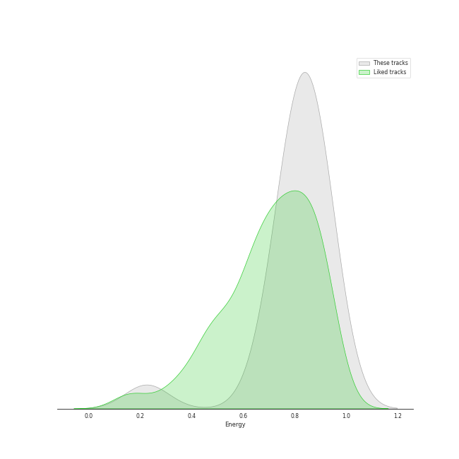
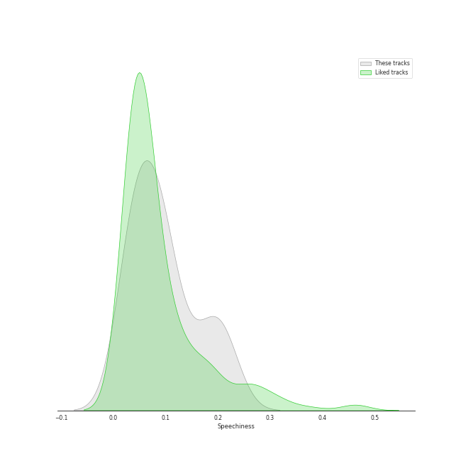
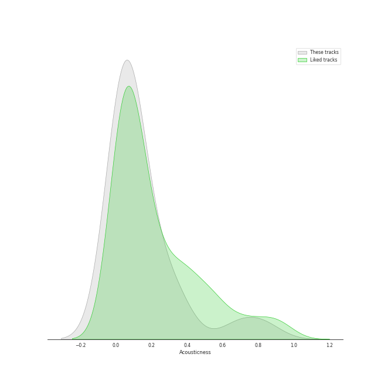
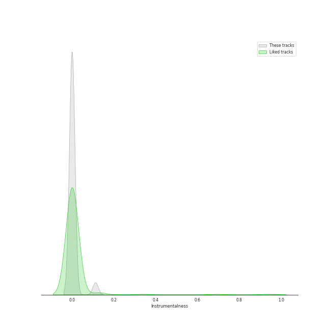
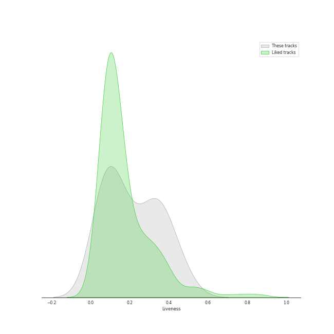
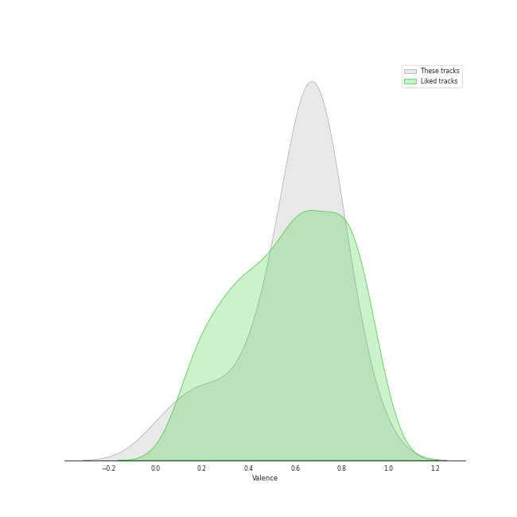
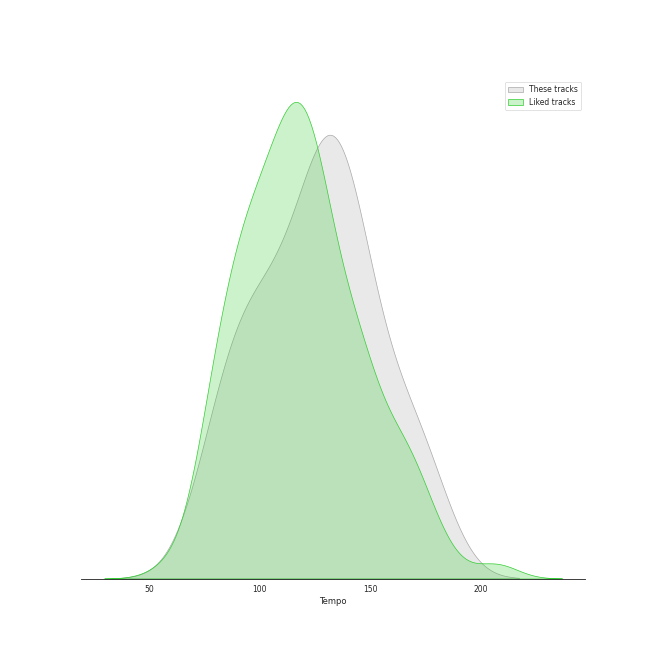

# Track Features for Classical Samples

## Danceability

| ​ | 10 most Danceable tracks | ​​ | 10 least Danceable tracks |
|:---|:---|:---|:---|
|  | Shut Down (0.82) |  | Say You'll Go (0.272) |
|  | CIRCUS (0.767) |  | Feel My Rhythm (0.412) |
|  | Snowy (0.766) |  | Odi Et Amo (0.472) |
|  | Sunshower (0.754) |  | TRI-ANGLE - Extended Version (0.536) |
|  | When I Get You Alone (0.748) |  | Lie (0.541) |
|  | Hands Up (0.741) |  | Fantasy (0.586) |
|  | They (0.728) |  | Lucky Girl (0.6) |
|  | Nxde (0.726) |  | Knock Knock (Who's There?) (0.612) |
|  | Pretty Psycho (0.726) |  | Birthday (0.645) |
|  | BYE BYE (0.72) |  | everybody's got a $ECRET (0.664) |

## Energy

| ​ | 10 most Energetic tracks | ​​ | 10 least Energetic tracks |
|:---|:---|:---|:---|
|  | Feel My Rhythm (0.94) |  | Odi Et Amo (0.225) |
|  | Fantasy (0.929) |  | Say You'll Go (0.405) |
|  | Nxde (0.91) |  | Shut Down (0.686) |
|  | Hands Up (0.91) |  | BYE BYE (0.733) |
|  | Rebel (0.886) |  | everybody's got a $ECRET (0.768) |
|  | Sunshower (0.878) |  | Lie (0.779) |
|  | Birthday (0.864) |  | Knock Knock (Who's There?) (0.795) |
|  | When I Get You Alone (0.857) |  | Pretty Psycho (0.808) |
|  | TRI-ANGLE - Extended Version (0.856) |  | CIRCUS (0.809) |
|  | Lucky Girl (0.828) |  | They (0.817) |

## Speechiness

| ​ | 10 most Speechy tracks | ​​ | 10 least Speechy tracks |
|:---|:---|:---|:---|
|  | Feel My Rhythm (0.215) |  | Odi Et Amo (0.0275) |
|  | Lucky Girl (0.207) |  | Lie (0.033) |
|  | Pretty Psycho (0.195) |  | Shut Down (0.038) |
|  | Nxde (0.179) |  | Snowy (0.0384) |
|  | everybody's got a $ECRET (0.138) |  | They (0.0413) |
|  | Knock Knock (Who's There?) (0.109) |  | Hands Up (0.0455) |
|  | CIRCUS (0.0958) |  | Birthday (0.0538) |
|  | TRI-ANGLE - Extended Version (0.0911) |  | Say You'll Go (0.0575) |
|  | Rebel (0.0909) |  | When I Get You Alone (0.0627) |
|  | Fantasy (0.0847) |  | Sunshower (0.0689) |

## Acousticness

| ​ | 10 most Acoustic tracks | ​​ | 10 least Acoustic tracks |
|:---|:---|:---|:---|
|  | Say You'll Go (0.829) |  | Lie (0.00338) |
|  | Odi Et Amo (0.684) |  | Shut Down (0.00412) |
|  | Knock Knock (Who's There?) (0.348) |  | Pretty Psycho (0.0159) |
|  | BYE BYE (0.32) |  | They (0.0237) |
|  | everybody's got a $ECRET (0.298) |  | TRI-ANGLE - Extended Version (0.024) |
|  | Hands Up (0.163) |  | Lucky Girl (0.0299) |
|  | Rebel (0.133) |  | CIRCUS (0.0337) |
|  | Snowy (0.115) |  | Nxde (0.0413) |
|  | Sunshower (0.0725) |  | Birthday (0.0486) |
|  | Feel My Rhythm (0.0648) |  | When I Get You Alone (0.0525) |

## Instrumentalness

| ​ | 10 most Instrumental tracks | ​​ | 10 least Instrumental tracks |
|:---|:---|:---|:---|
|  | Say You'll Go (0.112) |  | Shut Down (0.0) |
|  | Rebel (5.17e-05) |  | Snowy (0.0) |
|  | They (2.23e-05) |  | When I Get You Alone (0.0) |
|  | Nxde (7.81e-06) |  | Lie (0.0) |
|  | Hands Up (0.0) |  | Lucky Girl (0.0) |
|  | Knock Knock (Who's There?) (0.0) |  | Odi Et Amo (0.0) |
|  | TRI-ANGLE - Extended Version (0.0) |  | Pretty Psycho (0.0) |
|  | BYE BYE (0.0) |  | Feel My Rhythm (0.0) |
|  | Birthday (0.0) |  | CIRCUS (0.0) |
|  | everybody's got a $ECRET (0.0) |  | Fantasy (0.0) |

## Liveness

| ​ | 10 most Live tracks | ​​ | 10 least Live tracks |
|:---|:---|:---|:---|
|  | Nxde (0.479) |  | CIRCUS (0.0353) |
|  | BYE BYE (0.423) |  | Birthday (0.0491) |
|  | Rebel (0.393) |  | When I Get You Alone (0.0549) |
|  | Feel My Rhythm (0.358) |  | Sunshower (0.0849) |
|  | Knock Knock (Who's There?) (0.356) |  | Say You'll Go (0.0881) |
|  | Lucky Girl (0.334) |  | Fantasy (0.0887) |
|  | TRI-ANGLE - Extended Version (0.297) |  | everybody's got a $ECRET (0.0899) |
|  | Snowy (0.29) |  | Pretty Psycho (0.0949) |
|  | Odi Et Amo (0.231) |  | They (0.115) |
|  | Shut Down (0.184) |  | Hands Up (0.174) |

## Valence

| ​ | 10 most Happy tracks | ​​ | 10 least Happy tracks |
|:---|:---|:---|:---|
|  | Sunshower (0.902) |  | Say You'll Go (0.0388) |
|  | Snowy (0.813) |  | Fantasy (0.186) |
|  | Pretty Psycho (0.791) |  | Odi Et Amo (0.244) |
|  | They (0.729) |  | Feel My Rhythm (0.423) |
|  | When I Get You Alone (0.714) |  | TRI-ANGLE - Extended Version (0.454) |
|  | Hands Up (0.707) |  | Lie (0.501) |
|  | CIRCUS (0.69) |  | everybody's got a $ECRET (0.572) |
|  | Rebel (0.682) |  | Knock Knock (Who's There?) (0.622) |
|  | Birthday (0.673) |  | Nxde (0.648) |
|  | Shut Down (0.668) |  | BYE BYE (0.656) |

## Tempo

| ​ | 10 most Fast tracks | ​​ | 10 least Fast tracks |
|:---|:---|:---|:---|
|  | Lucky Girl (169.758) |  | Say You'll Go (79.585) |
|  | Feel My Rhythm (157.964) |  | Odi Et Amo (81.196) |
|  | Birthday (149.949) |  | Hands Up (89.974) |
|  | Knock Knock (Who's There?) (147.839) |  | TRI-ANGLE - Extended Version (90.069) |
|  | everybody's got a $ECRET (139.773) |  | Lie (94.069) |
|  | Nxde (135.966) |  | CIRCUS (97.958) |
|  | Snowy (132.945) |  | Fantasy (106.939) |
|  | Pretty Psycho (132.034) |  | When I Get You Alone (107.032) |
|  | They (129.978) |  | Shut Down (110.058) |
|  | Rebel (126.203) |  | BYE BYE (116.129) |
