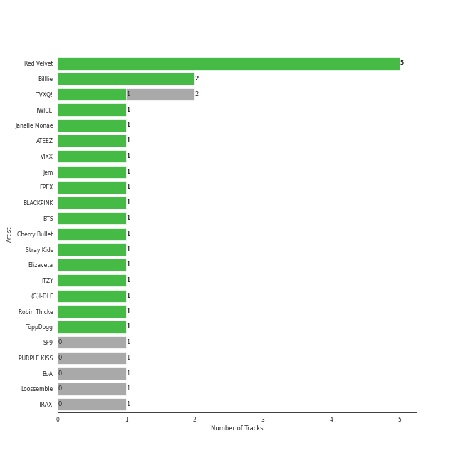
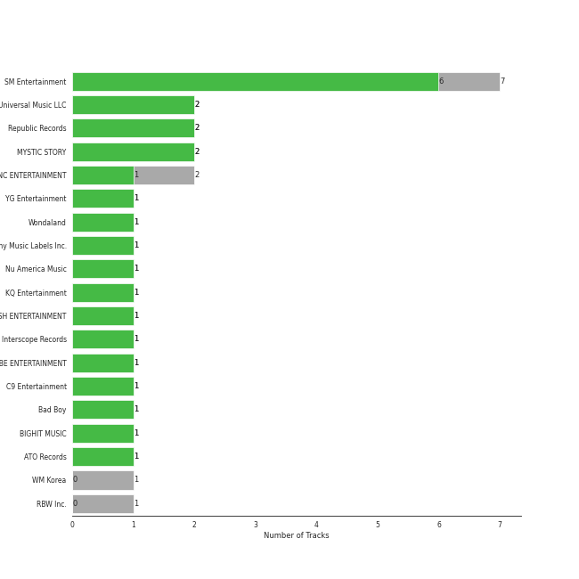

# Classical Samples

[17 tracks (15 liked) 🔗](https://open.spotify.com/playlist/6Pp6fPWxumAQQLVE68SVtY)

[See Track Features](audio_features.md)

[See Clusters](clusters/overview.md)

## Top Artists

| Art | Tracks | 💚 | Artist | 🔗 |
|:---|---:|---:|:---|:---|
|  | 4 | 4 | [Red Velvet](../../artists/red_velvet/overview.md) | [🔗](https://open.spotify.com/artist/1z4g3DjTBBZKhvAroFlhOM) |
|  | 2 | 1 | [TVXQ!](../../artists/tvxq!/overview.md) | [🔗](https://open.spotify.com/artist/6nVMMEywS5Y4tsHPKx1nIo) |
|  | 1 | 1 | VIXX | [🔗](https://open.spotify.com/artist/5BkB3rXc0qIdUtuEnhbK0A) |
|  | 1 | 1 | EPEX | [🔗](https://open.spotify.com/artist/4e2umhzNHTSeQnSCWPN0uT) |
|  | 1 | 1 | [BLACKPINK](../../artists/blackpink/overview.md) | [🔗](https://open.spotify.com/artist/41MozSoPIsD1dJM0CLPjZF) |
|  | 1 | 1 | [BTS](../../artists/bts/overview.md) | [🔗](https://open.spotify.com/artist/3Nrfpe0tUJi4K4DXYWgMUX) |
|  | 1 | 1 | Cherry Bullet | [🔗](https://open.spotify.com/artist/3IJCdgkBZbieocLZ4e94GZ) |
|  | 1 | 1 | [Stray Kids](../../artists/stray_kids/overview.md) | [🔗](https://open.spotify.com/artist/2dIgFjalVxs4ThymZ67YCE) |
|  | 1 | 1 | Elizaveta | [🔗](https://open.spotify.com/artist/2a9bCkqCkLvXM0s3uPvR7M) |
|  | 1 | 1 | [ITZY](../../artists/itzy/overview.md) | [🔗](https://open.spotify.com/artist/2KC9Qb60EaY0kW4eH68vr3) |

See all 15 artists

| Art | Tracks | 💚 | Artist | 🔗 |
|:---|---:|---:|:---|:---|
|  | 1 | 1 | [Billlie](../../artists/billlie/overview.md) | [🔗](https://open.spotify.com/artist/2GQxKDojobwBjZMPf7aoh0) |
|  | 1 | 1 | [(G)I-DLE](../../artists/(g)i-dle/overview.md) | [🔗](https://open.spotify.com/artist/2AfmfGFbe0A0WsTYm0SDTx) |
|  | 1 | 0 | PURPLE KISS | [🔗](https://open.spotify.com/artist/62T5PGHWJ9sxP2SJq20IHq) |
|  | 1 | 0 | [BoA](../../artists/boa/overview.md) | [🔗](https://open.spotify.com/artist/4muJrGMndyYWqZtfk8OWy4) |
|  | 1 | 0 | TRAX | [🔗](https://open.spotify.com/artist/05IXIcHMbO6RMnJ6uQPrmP) |

## Top Albums

| Art | Tracks | 💚 | Album | Release Date | 🔗 |
|:---|---:|---:|:---|:---|:---|
|  | 2 | 2 | ‘The ReVe Festival 2022 - Birthday’ | 2022-11-28 | [🔗](https://open.spotify.com/album/58OR7UoaJkJzqeQGClHzh1) |
|  | 1 | 1 | ‘The ReVe Festival 2022 - Feel My Rhythm’ | 2022-03-21 | [🔗](https://open.spotify.com/album/3HgoCO9wWuPcNhz8Ip4C46) |
|  | 1 | 1 | the Billage of perception : chapter one | 2021-11-10 | [🔗](https://open.spotify.com/album/1kp4txZsSpDNR4EoDFi2LD) |
|  | 1 | 1 | Wings | 2016-10-10 | [🔗](https://open.spotify.com/album/1vhNGBTFoaSTLbHjPGFIlF) |
|  | 1 | 1 | Russian Roulette - The 3rd Mini Album | 2016-09-07 | [🔗](https://open.spotify.com/album/6MNlcai3skKLKv5syzFwC3) |
|  | 1 | 1 | I love | 2022-10-17 | [🔗](https://open.spotify.com/album/2Hyuin3i1cSZ1FlQFeCPZH) |
|  | 1 | 1 | Hands Up | 2020-02-11 | [🔗](https://open.spotify.com/album/5HyrUteikoFGu38bAf7zYc) |
|  | 1 | 1 | Hades | 2016-08-12 | [🔗](https://open.spotify.com/album/78huKT6T1zZUJxbkGBQJZC) |
|  | 1 | 1 | EPEX 5th EP Album Prelude of Love Chapter 2. 'Growing Pains' | 2023-04-26 | [🔗](https://open.spotify.com/album/7c4HuyVRABrlh7eOdhozwd) |
|  | 1 | 1 | CIRCUS | 2022-06-10 | [🔗](https://open.spotify.com/album/4IQHY28D4aHus9lGDlSdPp) |

See all 16 albums

| Art | Tracks | 💚 | Album | Release Date | 🔗 |
|:---|---:|---:|:---|:---|:---|
|  | 1 | 1 | CHESHIRE | 2022-11-30 | [🔗](https://open.spotify.com/album/2a1ezg7hE6Dyuymv1aCnkm) |
|  | 1 | 1 | Beatrix Runs | 2012 | [🔗](https://open.spotify.com/album/7HsPaYQbCYnxosF5WiSlEA) |
|  | 1 | 1 | BORN PINK | 2022-09-16 | [🔗](https://open.spotify.com/album/7jaSNQUBJbvfbZHLNFrV7P) |
|  | 1 | 1 | 20&2 - The 9th Album | 2023-12-26 | [🔗](https://open.spotify.com/album/4I6px53lYqErgJcsJkUNlu) |
|  | 1 | 0 | memeM | 2022-03-29 | [🔗](https://open.spotify.com/album/4nhtnBY8owIQnOsnGQGqW9) |
|  | 1 | 0 | TRI-ANGLE - 1st Album | 2004-10-01 | [🔗](https://open.spotify.com/album/1013imXHa490acqEZkQpeX) |

## Top Record Labels

| Tracks | 💚 | Label |
|---:|---:|:---|
| 6 | 5 | [SM Entertainment](../../labels/sm_entertainment/overview.md) |
| 1 | 1 | [YG Entertainment](../../labels/yg_entertainment/overview.md) |
| 1 | 1 | [Universal Music LLC](../../labels/universal_music_llc/overview.md) |
| 1 | 1 | [Sony Music Labels Inc.](../../labels/sony_music_labels_inc_/overview.md) |
| 1 | 1 | [Republic Records](../../labels/republic_records/overview.md) |
| 1 | 1 | [MYSTIC STORY](../../labels/mystic_story/overview.md) |
| 1 | 1 | JELLYFISH ENTERTAINMENT |
| 1 | 1 | [Interscope Records](../../labels/interscope_records/overview.md) |
| 1 | 1 | [FNC ENTERTAINMENT](../../labels/fnc_entertainment/overview.md) |
| 1 | 1 | [CUBE ENTERTAINMENT](../../labels/cube_entertainment/overview.md) |

See all 13 labels

| Tracks | 💚 | Label |
|---:|---:|:---|
| 1 | 1 | C9 Entertainment |
| 1 | 1 | [BIGHIT MUSIC](../../labels/bighit_music/overview.md) |
| 1 | 0 | [RBW Inc.](../../labels/rbw_inc_/overview.md) |

## Genres

| Tracks | 💚 | Genre |
|---:|---:|:---|
| 15 | 13 | [k-pop](../../genres/k-pop/overview.md) |
| 8 | 8 | [k-pop girl group](../../genres/k-pop_girl_group/overview.md) |
| 6 | 5 | [k-pop boy group](../../genres/k-pop_boy_group/overview.md) |
| 3 | 3 | [pop](../../genres/pop/overview.md) |
| 1 | 1 | deep indie singer-songwriter |

## Top Producers

| Art | Producer | Tracks | Credit Types |
|:---|:---|---:|:---|
| | 오단영 (Oh, Dan-young) | 1 | Producer |
|  | [JEON SOYEON](../../artists/jeon_soyeon/overview.md) | 1 | Arranger, Lyricist, Songwriter |
| | DOCSKIM | 1 | Songwriter |
| | Hayley Aitken | 1 | Arranger, Songwriter |
| | 나고은 (Na, Go-eun) | 1 | Lyricist |
| | Vince | 1 | Lyricist |
| | 최예지 (Choi, Ye-ji) | 1 | Producer |
| | Josh Gudwin | 1 | Producer |
| | Pop Time | 1 | Arranger, Songwriter |
| | 고현정 (Go, Hyeon-Jeong) | 1 | Producer |

View all

| Art | Producer | Tracks | Credit Types |
|:---|:---|---:|:---|
| | Kako | 1 | Arranger, Songwriter |
|  | Jimin | 1 | Songwriter |
| | 강지원 (Kang, Jiwon) | 1 | Arranger, Lyricist, Songwriter |
| | 구종필 (Koo, Jong-Pil) | 1 | Producer |
| | Danny Chung | 1 | Lyricist |
| | 24 | 1 | Arranger, Songwriter |
| | 정은경 (Jung, Eun-Kyung) | 1 | Producer |
| | 방시혁 (Bang, Si-Hyuk) | 1 | Songwriter |
| | 김도훈 (Kim, Do-hoon) | 1 | Lyricist, Songwriter |
| | Pdogg | 1 | Songwriter |
| | Anna Timgren | 1 | Songwriter |
| | 유키 (Yuki) | 1 | Lyricist |
| | Kenzie | 1 | Arranger, Lyricist |
| | Ollipop | 1 | Arranger, Songwriter |
|  | SUMIN | 1 | Songwriter |
| | YOUNGJU BANG | 1 | Producer |
| | TEDDY | 1 | Lyricist, Producer, Songwriter |

## Years

| ​ | 10 newest albums | ​​ | 10 oldest albums |
|:---|:---|:---|:---|
|  | 20&2 - The 9th Album (2023-12-26) |  | TRI-ANGLE - 1st Album (2004-10-01) |
|  | EPEX 5th EP Album Prelude of Love Chapter 2. 'Growing Pains' (2023-04-26) |  | Beatrix Runs (2012) |
|  | CHESHIRE (2022-11-30) |  | Hades (2016-08-12) |
|  | ‘The ReVe Festival 2022 - Birthday’ (2022-11-28) |  | Russian Roulette - The 3rd Mini Album (2016-09-07) |
|  | I love (2022-10-17) |  | Wings (2016-10-10) |
|  | BORN PINK (2022-09-16) |  | Hands Up (2020-02-11) |
|  | CIRCUS (2022-06-10) |  | the Billage of perception : chapter one (2021-11-10) |
|  | memeM (2022-03-29) |  | ‘The ReVe Festival 2022 - Feel My Rhythm’ (2022-03-21) |
|  | ‘The ReVe Festival 2022 - Feel My Rhythm’ (2022-03-21) |  | memeM (2022-03-29) |
|  | the Billage of perception : chapter one (2021-11-10) |  | CIRCUS (2022-06-10) |