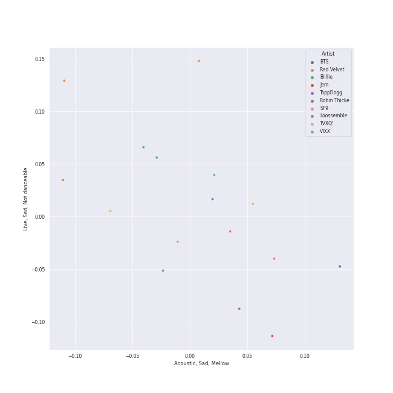
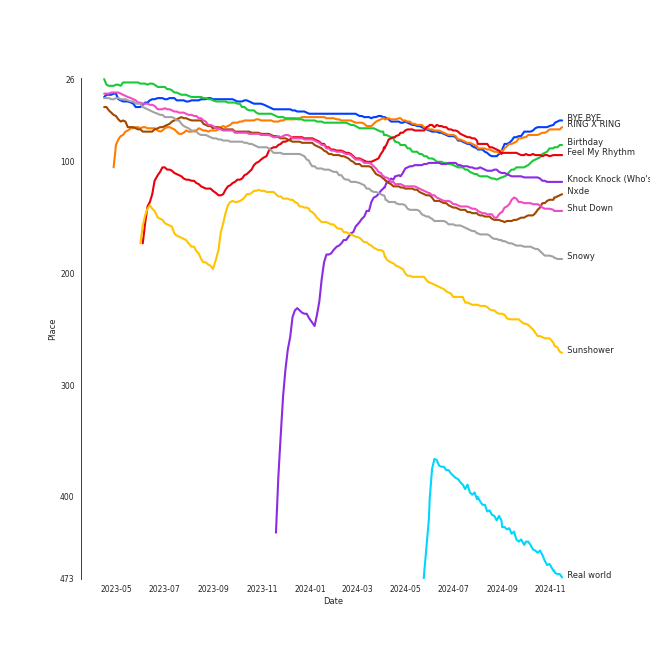
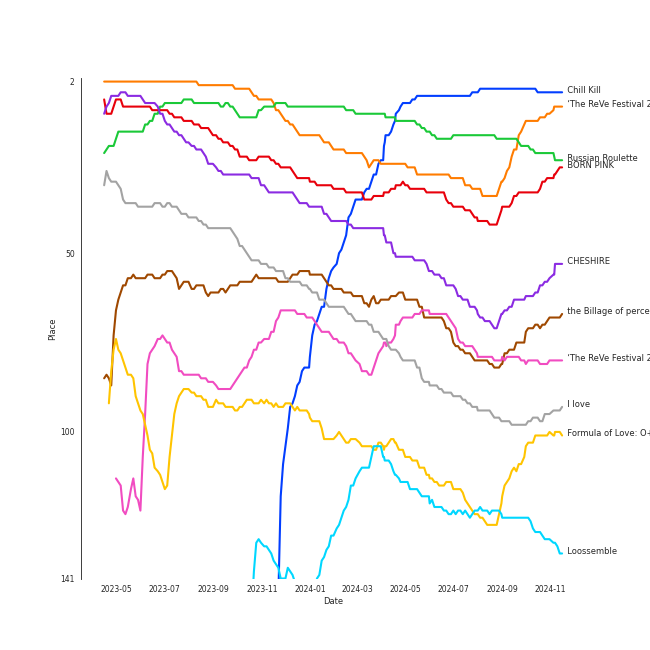
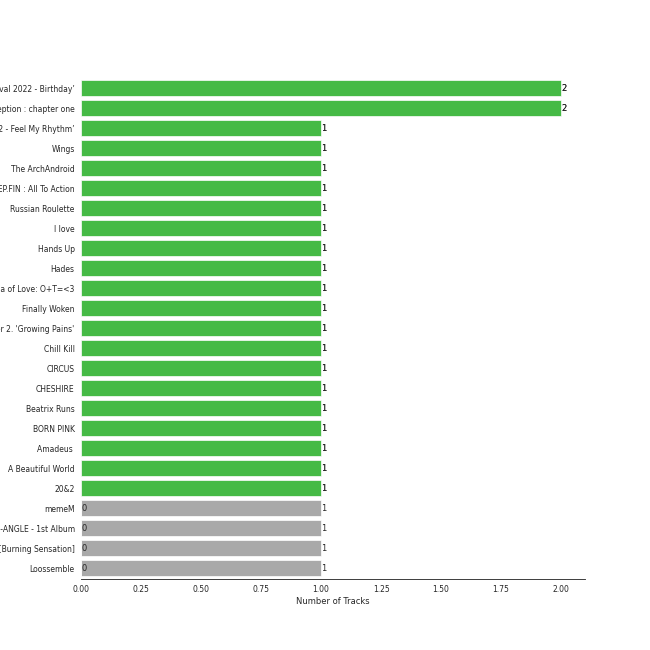
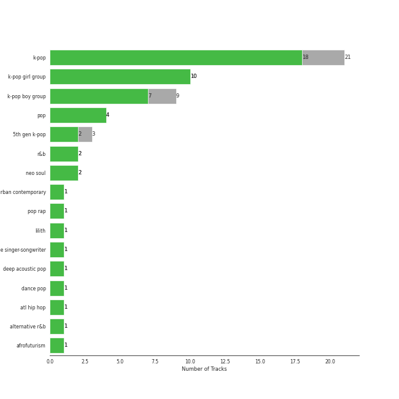
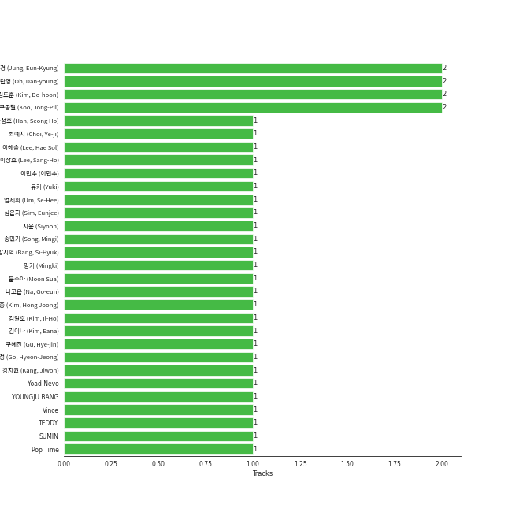
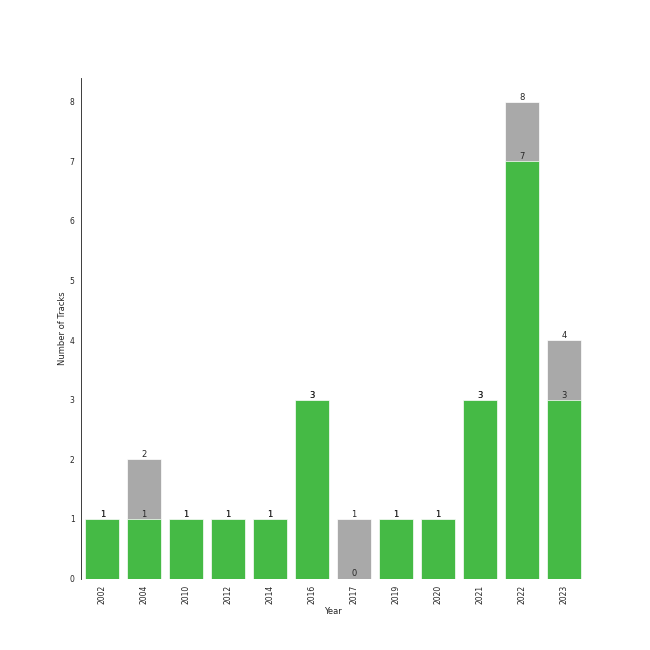

# Classical Samples

[27 tracks (23 liked) 🔗](https://open.spotify.com/playlist/6Pp6fPWxumAQQLVE68SVtY)

[See Track Features](audio_features.md)

[See Clusters](clusters/overview.md)

## Top Artists

| Art | Rank | Tracks | 💚 | Artist | 🔗 |
|:---|---:|---:|---:|:---|:---|
|  | 2 | 5 | 5 | [Red Velvet](../../artists/red_velvet/overview.md) | [🔗](https://open.spotify.com/artist/1z4g3DjTBBZKhvAroFlhOM) |
|  | 22 | 2 | 2 | [Billlie](../../artists/billlie/overview.md) | [🔗](https://open.spotify.com/artist/2GQxKDojobwBjZMPf7aoh0) |
|  | 156 | 2 | 1 | [TVXQ!](../../artists/tvxq!/overview.md) | [🔗](https://open.spotify.com/artist/6nVMMEywS5Y4tsHPKx1nIo) |
|  | 9 | 1 | 1 | [TWICE](../../artists/twice/overview.md) | [🔗](https://open.spotify.com/artist/7n2Ycct7Beij7Dj7meI4X0) |
|  | 108 | 1 | 1 | [Janelle Monáe](../../artists/janelle_monáe/overview.md) | [🔗](https://open.spotify.com/artist/6ueGR6SWhUJfvEhqkvMsVs) |
|  | 46 | 1 | 1 | [ATEEZ](../../artists/ateez/overview.md) | [🔗](https://open.spotify.com/artist/68KmkJeZGfwe1OUaivBa2L) |
|  | 430 | 1 | 1 | VIXX | [🔗](https://open.spotify.com/artist/5BkB3rXc0qIdUtuEnhbK0A) |
|  | 321 | 1 | 1 | Jem | [🔗](https://open.spotify.com/artist/4v4xuH9VypORYabMnhPLt1) |
|  | 138 | 1 | 1 | EPEX | [🔗](https://open.spotify.com/artist/4e2umhzNHTSeQnSCWPN0uT) |
|  | 4 | 1 | 1 | [BLACKPINK](../../artists/blackpink/overview.md) | [🔗](https://open.spotify.com/artist/41MozSoPIsD1dJM0CLPjZF) |

See all 23 artists

| Art | Rank | Tracks | 💚 | Artist | 🔗 |
|:---|---:|---:|---:|:---|:---|
|  | 27 | 1 | 1 | [BTS](../../artists/bts/overview.md) | [🔗](https://open.spotify.com/artist/3Nrfpe0tUJi4K4DXYWgMUX) |
|  | 313 | 1 | 1 | Cherry Bullet | [🔗](https://open.spotify.com/artist/3IJCdgkBZbieocLZ4e94GZ) |
|  | 10 | 1 | 1 | [Stray Kids](../../artists/stray_kids/overview.md) | [🔗](https://open.spotify.com/artist/2dIgFjalVxs4ThymZ67YCE) |
|  | 430 | 1 | 1 | Elizaveta | [🔗](https://open.spotify.com/artist/2a9bCkqCkLvXM0s3uPvR7M) |
|  | 5 | 1 | 1 | [ITZY](../../artists/itzy/overview.md) | [🔗](https://open.spotify.com/artist/2KC9Qb60EaY0kW4eH68vr3) |
|  | 6 | 1 | 1 | [(G)I-DLE](../../artists/(g)i-dle/overview.md) | [🔗](https://open.spotify.com/artist/2AfmfGFbe0A0WsTYm0SDTx) |
|  | 430 | 1 | 1 | Robin Thicke | [🔗](https://open.spotify.com/artist/0ZrpamOxcZybMHGg1AYtHP) |
|  | 430 | 1 | 1 | ToppDogg | [🔗](https://open.spotify.com/artist/03Ejz4OkKzGnTRKZE3KwRN) |
|  | 430 | 1 | 0 | SF9 | [🔗](https://open.spotify.com/artist/7LOmc7gyMVMOWF8qwEdn2X) |
|  | 52 | 1 | 0 | [PURPLE KISS](../../artists/purple_kiss/overview.md) | [🔗](https://open.spotify.com/artist/62T5PGHWJ9sxP2SJq20IHq) |
|  | 32 | 1 | 0 | [BoA](../../artists/boa/overview.md) | [🔗](https://open.spotify.com/artist/4muJrGMndyYWqZtfk8OWy4) |
|  | 107 | 1 | 0 | Loossemble | [🔗](https://open.spotify.com/artist/1kbVoxpFh1eDOXumLmVdKY) |
|  | 430 | 1 | 0 | TRAX | [🔗](https://open.spotify.com/artist/05IXIcHMbO6RMnJ6uQPrmP) |

## Top Tracks

Most and least listened tracks

| Rank | ​ | Most listened tracks | Rank | ​​ | Least listened tracks |
|---:|:---|:---|---:|:---|:---|
| 69 |  | [BYE BYE](../../artists/red_velvet/overview.md) | 1000 |  | [Say You'll Go](../../artists/janelle_monáe/overview.md) |
| 74 |  | [RING X RING](../../artists/billlie/overview.md) | 1000 |  | Hands Up |
| 93 |  | [Birthday](../../artists/red_velvet/overview.md) | 1000 |  | [TRI-ANGLE - Extended Version](../../artists/tvxq!/overview.md) |
| 95 |  | [Feel My Rhythm](../../artists/red_velvet/overview.md) | 1000 |  | [Rebel](../../artists/tvxq!/overview.md) |
| 117 |  | [Knock Knock (Who's There?)](../../artists/red_velvet/overview.md) | 1000 |  | Fantasy |
| 137 |  | [Nxde](../../artists/(g)i-dle/overview.md) | 1000 |  | [LAST WALTZ](../../artists/twice/overview.md) |
| 141 |  | [Shut Down](../../artists/blackpink/overview.md) | 1000 |  | Jungle Game |
| 182 |  | [Snowy](../../artists/itzy/overview.md) | 1000 |  | Odi Et Amo |
| 257 |  | Sunshower | 1000 |  | [Lie](../../artists/bts/overview.md) |
| 450 |  | Real world | 1000 |  | When I Get You Alone |

## Top Albums

| Art | Rank | Tracks | 💚 | Album | Release Date | 🔗 |
|:---|---:|---:|---:|:---|:---|:---|
|  | 12 | 2 | 2 | ‘The ReVe Festival 2022 - Birthday’ | 2022-11-28 | [🔗](https://open.spotify.com/album/58OR7UoaJkJzqeQGClHzh1) |
|  | 70 | 2 | 2 | the Billage of perception : chapter one | 2021-11-10 | [🔗](https://open.spotify.com/album/1kp4txZsSpDNR4EoDFi2LD) |
|  | 81 | 1 | 1 | ‘The ReVe Festival 2022 - Feel My Rhythm’ | 2022-03-21 | [🔗](https://open.spotify.com/album/3HgoCO9wWuPcNhz8Ip4C46) |
|  | 656 | 1 | 1 | Wings | 2016-10-10 | [🔗](https://open.spotify.com/album/1vhNGBTFoaSTLbHjPGFIlF) |
|  | 656 | 1 | 1 | The ArchAndroid | 2010-05-17 | [🔗](https://open.spotify.com/album/7MvSB0JTdtl1pSwZcgvYQX) |
|  | 622 | 1 | 1 | TREASURE EP.FIN : All To Action | 2019-10-08 | [🔗](https://open.spotify.com/album/4HGhzqQEY1X6WWZw6MhjlO) |
|  | 22 | 1 | 1 | Russian Roulette - The 3rd Mini Album | 2016-09-07 | [🔗](https://open.spotify.com/album/6MNlcai3skKLKv5syzFwC3) |
|  | 97 | 1 | 1 | I love | 2022-10-17 | [🔗](https://open.spotify.com/album/2Hyuin3i1cSZ1FlQFeCPZH) |
|  | 656 | 1 | 1 | Hands Up | 2020-02-11 | [🔗](https://open.spotify.com/album/5HyrUteikoFGu38bAf7zYc) |
|  | 656 | 1 | 1 | Hades | 2016-08-12 | [🔗](https://open.spotify.com/album/78huKT6T1zZUJxbkGBQJZC) |

See all 25 albums

| Art | Rank | Tracks | 💚 | Album | Release Date | 🔗 |
|:---|---:|---:|---:|:---|:---|:---|
|  | 101 | 1 | 1 | Formula of Love: O+T=<3 | 2021-11-12 | [🔗](https://open.spotify.com/album/5052Ip89wdW8EGdpjEpNeq) |
|  | 419 | 1 | 1 | Finally Woken | 2004-03-23 | [🔗](https://open.spotify.com/album/3RkjNfqqlhWyLrRp0ZCARU) |
|  | 187 | 1 | 1 | EPEX 5th EP Album Prelude of Love Chapter 2. 'Growing Pains' | 2023-04-26 | [🔗](https://open.spotify.com/album/7c4HuyVRABrlh7eOdhozwd) |
|  | 5 | 1 | 1 | Chill Kill - The 3rd Album | 2023-11-13 | [🔗](https://open.spotify.com/album/4UUICitfodUVCNhzmDFbrO) |
|  | 472 | 1 | 1 | CIRCUS | 2022-06-10 | [🔗](https://open.spotify.com/album/4IQHY28D4aHus9lGDlSdPp) |
|  | 59 | 1 | 1 | CHESHIRE | 2022-11-30 | [🔗](https://open.spotify.com/album/2a1ezg7hE6Dyuymv1aCnkm) |
|  | 656 | 1 | 1 | Beatrix Runs | 2012 | [🔗](https://open.spotify.com/album/7HsPaYQbCYnxosF5WiSlEA) |
|  | 30 | 1 | 1 | BORN PINK | 2022-09-16 | [🔗](https://open.spotify.com/album/7jaSNQUBJbvfbZHLNFrV7P) |
|  | 656 | 1 | 1 | Amadeus (Deluxe) | 2014-01-01 | [🔗](https://open.spotify.com/album/2lEkc4sDyukoOL28Qyw2OH) |
|  | 656 | 1 | 1 | A Beautiful World | 2002-12-13 | [🔗](https://open.spotify.com/album/76wI74XuASLFrY9pUVLhO9) |
|  | 656 | 1 | 1 | 20&2 - The 9th Album | 2023-12-26 | [🔗](https://open.spotify.com/album/4I6px53lYqErgJcsJkUNlu) |
|  | 370 | 1 | 0 | memeM | 2022-03-29 | [🔗](https://open.spotify.com/album/4nhtnBY8owIQnOsnGQGqW9) |
|  | 656 | 1 | 0 | TRI-ANGLE - 1st Album | 2004-10-01 | [🔗](https://open.spotify.com/album/1013imXHa490acqEZkQpeX) |
|  | 656 | 1 | 0 | SF9 First Mini Album [Burning Sensation] | 2017-02-06 | [🔗](https://open.spotify.com/album/3ZG2ZsqMl1Ew8w18XKkCKu) |
|  | 129 | 1 | 0 | Loossemble | 2023-09-15 | [🔗](https://open.spotify.com/album/51TyZNm7E9EF1gSJGLGsxh) |

## Top Record Labels

| Tracks | 💚 | Label |
|---:|---:|:---|
| 7 | 6 | [SM Entertainment](../../labels/sm_entertainment/overview.md) |
| 2 | 2 | [Universal Music LLC](../../labels/universal_music_llc/overview.md) |
| 2 | 2 | [Republic Records](../../labels/republic_records/overview.md) |
| 2 | 2 | [MYSTIC STORY](../../labels/mystic_story/overview.md) |
| 2 | 1 | [FNC ENTERTAINMENT](../../labels/fnc_entertainment/overview.md) |
| 1 | 1 | [YG Entertainment](../../labels/yg_entertainment/overview.md) |
| 1 | 1 | Wondaland |
| 1 | 1 | [Sony Music Labels Inc.](../../labels/sony_music_labels_inc_/overview.md) |
| 1 | 1 | Nu America Music |
| 1 | 1 | [KQ Entertainment](../../labels/kq_entertainment/overview.md) |

See all 19 labels

| Tracks | 💚 | Label |
|---:|---:|:---|
| 1 | 1 | JELLYFISH ENTERTAINMENT |
| 1 | 1 | [Interscope Records](../../labels/interscope_records/overview.md) |
| 1 | 1 | [CUBE ENTERTAINMENT](../../labels/cube_entertainment/overview.md) |
| 1 | 1 | C9 Entertainment |
| 1 | 1 | [Bad Boy](../../labels/bad_boy/overview.md) |
| 1 | 1 | [BIGHIT MUSIC](../../labels/bighit_music/overview.md) |
| 1 | 1 | ATO Records |
| 1 | 0 | [WM Korea](../../labels/wm_korea/overview.md) |
| 1 | 0 | [RBW Inc.](../../labels/rbw_inc_/overview.md) |

## Genres

| Tracks | 💚 | Genre |
|---:|---:|:---|
| 21 | 18 | [k-pop](../../genres/k-pop/overview.md) |
| 10 | 10 | [k-pop girl group](../../genres/k-pop_girl_group/overview.md) |
| 9 | 7 | [k-pop boy group](../../genres/k-pop_boy_group/overview.md) |
| 4 | 4 | [pop](../../genres/pop/overview.md) |
| 3 | 2 | [5th gen k-pop](../../genres/5th_gen_k-pop/overview.md) |
| 2 | 2 | [r&b](../../genres/r_b/overview.md) |
| 2 | 2 | [neo soul](../../genres/neo_soul/overview.md) |
| 1 | 1 | [urban contemporary](../../genres/urban_contemporary/overview.md) |
| 1 | 1 | pop rap |
| 1 | 1 | [lilith](../../genres/lilith/overview.md) |

See all 16 genres

| Tracks | 💚 | Genre |
|---:|---:|:---|
| 1 | 1 | deep indie singer-songwriter |
| 1 | 1 | deep acoustic pop |
| 1 | 1 | [dance pop](../../genres/dance_pop/overview.md) |
| 1 | 1 | atl hip hop |
| 1 | 1 | alternative r&b |
| 1 | 1 | afrofuturism |

## Top Producers

| Art | Producer | Tracks | Credit Types |
|:---|:---|---:|:---|
| | 오단영 (Oh, Dan-young) | 2 | Producer |
| | [김도훈 (Kim, Do-hoon)](../../producers/김도훈_(kim,_do-hoon)/overview.md) | 2 | Lyricist, Songwriter |
| | [정은경 (Jung, Eun-Kyung)](../../producers/정은경_(jung,_eun-kyung)/overview.md) | 2 | Producer |
| | [구종필 (Koo, Jong-Pil)](../../producers/구종필_(koo,_jong-pil)/overview.md) | 2 | Producer |
| | 김홍중 (Kim, Hong Joong) | 1 | Lyricist |
| | 이해솔 (Lee, Hae Sol) | 1 | Arranger, Songwriter |
| | Yoad Nevo | 1 | Producer |
| | [심은지 (Sim, Eunjee)](../../producers/심은지_(sim,_eunjee)/overview.md) | 1 | Arranger, Lyricist, Producer, Songwriter |
| | [이민수 (이민수)](../../producers/이민수_(이민수)/overview.md) | 1 | Arranger, Songwriter |
| | [24](../../producers/24/overview.md) | 1 | Arranger, Songwriter |

View all

| Art | Producer | Tracks | Credit Types |
|:---|:---|---:|:---|
| | [LEEZ](../../producers/leez/overview.md) | 1 | Arranger, Lyricist, Songwriter |
|  | [JEON SOYEON](../../artists/jeon_soyeon/overview.md) | 1 | Arranger, Lyricist, Songwriter |
| | [강지원 (Kang, Jiwon)](../../producers/강지원_(kang,_jiwon)/overview.md) | 1 | Arranger, Lyricist, Songwriter |
|  | Jimin | 1 | Songwriter |
|  | Jem | 1 | Producer, Songwriter |
| | Kako | 1 | Arranger, Songwriter |
| | 고현정 (Go, Hyeon-Jeong) | 1 | Producer |
| | [Pop Time](../../producers/pop_time/overview.md) | 1 | Arranger, Songwriter |
| | [Josh Gudwin](../../producers/josh_gudwin/overview.md) | 1 | Producer |
| | 김일호 (Kim, Il-Ho) | 1 | Producer |
| | 최예지 (Choi, Ye-ji) | 1 | Producer |
| | Vince | 1 | Lyricist |
| | 나고은 (Na, Go-eun) | 1 | Lyricist |
| | Hayley Aitken | 1 | Arranger, Songwriter |
| | DOCSKIM | 1 | Songwriter |
| | 송민기 (Song, Mingi) | 1 | Lyricist |
| | [방시혁 (Bang, Si-Hyuk)](../../producers/방시혁_(bang,_si-hyuk)/overview.md) | 1 | Songwriter |
| | 문수아 (Moon Sua) | 1 | Lyricist |
| | 시윤 (Siyoon) | 1 | Lyricist |
| | Danny Chung | 1 | Lyricist |
| | YOUNGJU BANG | 1 | Producer |
| | EJAE | 1 | Songwriter |
| | [엄세희 (Um, Se-Hee)](../../producers/엄세희_(um,_se-hee)/overview.md) | 1 | Producer |
| | 한성호 (Han, Seong Ho) | 1 | Lyricist |
|  | Jimin | 1 | Lyricist |
|  | SUMIN | 1 | Songwriter |
| | [김이나 (Kim, Eana)](../../producers/김이나_(kim,_eana)/overview.md) | 1 | Lyricist |
| | Ollipop | 1 | Arranger, Songwriter |
|  | [Johann Sebastian Bach](../../artists/johann_sebastian_bach/overview.md) | 1 | Songwriter |
| | [Kenzie](../../producers/kenzie/overview.md) | 1 | Arranger, Lyricist |
| | 유키 (Yuki) | 1 | Lyricist |
| | [EDEN](../../producers/eden/overview.md) | 1 | Arranger, Lyricist, Songwriter |
| | 이상호 (Lee, Sang-Ho) | 1 | Arranger, Lyricist, Songwriter |
| | GE-OLOGY | 1 | Producer, Songwriter |
| | [Ollounder](../../producers/ollounder/overview.md) | 1 | Arranger, Lyricist, Songwriter |
| | [구혜진 (Gu, Hye-jin)](../../producers/구혜진_(gu,_hye-jin)/overview.md) | 1 | Producer |
| | Anna Timgren | 1 | Songwriter |
| | [Pdogg](../../producers/pdogg/overview.md) | 1 | Songwriter |
| | 밍키 (Mingki) | 1 | Arranger |
| | BUDDY | 1 | Arranger, Lyricist, Songwriter |
| | [TEDDY](../../producers/teddy/overview.md) | 1 | Lyricist, Producer, Songwriter |

## Years

| ​ | 10 newest albums | ​​ | 10 oldest albums |
|:---|:---|:---|:---|
|  | 20&2 - The 9th Album (2023-12-26) |  | A Beautiful World (2002-12-13) |
|  | Chill Kill - The 3rd Album (2023-11-13) |  | Finally Woken (2004-03-23) |
|  | Loossemble (2023-09-15) |  | TRI-ANGLE - 1st Album (2004-10-01) |
|  | EPEX 5th EP Album Prelude of Love Chapter 2. 'Growing Pains' (2023-04-26) |  | The ArchAndroid (2010-05-17) |
|  | CHESHIRE (2022-11-30) |  | Beatrix Runs (2012) |
|  | ‘The ReVe Festival 2022 - Birthday’ (2022-11-28) |  | Amadeus (Deluxe) (2014-01-01) |
|  | I love (2022-10-17) |  | Hades (2016-08-12) |
|  | BORN PINK (2022-09-16) |  | Russian Roulette - The 3rd Mini Album (2016-09-07) |
|  | CIRCUS (2022-06-10) |  | Wings (2016-10-10) |
|  | memeM (2022-03-29) |  | SF9 First Mini Album [Burning Sensation] (2017-02-06) |