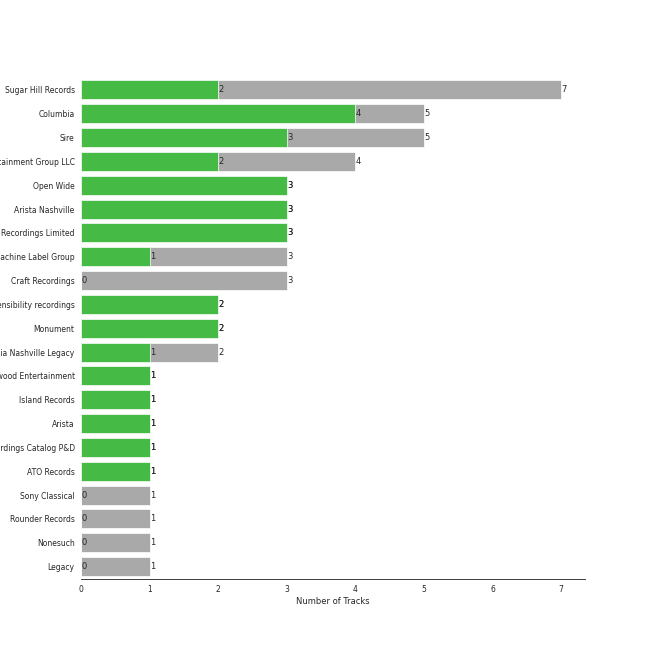

# Country/Folk

[33 songs](country_folk_tracks.md)

## Top Artists

See all 9 artists

|   Number of Tracks | Art                                                                                              | Artist           | 🔗                                                           |
|-------------------:|:-------------------------------------------------------------------------------------------------|:-----------------|:------------------------------------------------------------|
|                  6 |  | Nickel Creek     | [🔗](https://open.spotify.com/artist/3bcLBxvaI7GsBzGp3WHnwQ) |
|                  5 |  | Carrie Underwood | [🔗](https://open.spotify.com/artist/4xFUf1FHVy696Q1JQZMTRj) |
|                  5 |  | Delta Rae        | [🔗](https://open.spotify.com/artist/0iidQFemlPhkoHqFroz2my) |
|                  4 |  | Johnny Cash      | [🔗](https://open.spotify.com/artist/6kACVPfCOnqzgfEF5ryl0x) |
|                  4 |  | Mumford & Sons   | [🔗](https://open.spotify.com/artist/3gd8FJtBJtkRxdfbTu19U2) |
|                  3 |  | The Band Perry   | [🔗](https://open.spotify.com/artist/75FnCoo4FBxH5K1Rrx0k5A) |
|                  3 |  | The Chicks       | [🔗](https://open.spotify.com/artist/25IG9fa7cbdmCIy3OnuH57) |
|                  2 |  | The Civil Wars   | [🔗](https://open.spotify.com/artist/6J7rw7NELJUCThPbAfyLIE) |
|                  1 |  | Marc Broussard   | [🔗](https://open.spotify.com/artist/4cEwEednPwWCdYT7ZhROZe) |

## Top Albums

See all 19 albums

|   Number of Tracks | Art                                                                                              | Album                                 | 🔗                                                          |
|-------------------:|:-------------------------------------------------------------------------------------------------|:--------------------------------------|:-----------------------------------------------------------|
|                  5 |  | Nickel Creek                          | [🔗](https://open.spotify.com/album/5SGG7graQOU3OnK3cZZCNd) |
|                  4 |  | Carry the Fire                        | [🔗](https://open.spotify.com/album/42NjSADnDs97o75bICIqs0) |
|                  3 |  | Sigh No More                          | [🔗](https://open.spotify.com/album/6w5W6ZGTvDsppKUOiGMuMo) |
|                  2 |  | The Band Perry                        | [🔗](https://open.spotify.com/album/3dASAcs9QOsmoSLhHjEhCu) |
|                  2 |  | Play On                               | [🔗](https://open.spotify.com/album/3iLrVuA1k7onNmZTuUQH4u) |
|                  2 |  | Home                                  | [🔗](https://open.spotify.com/album/1zgQkZFMRqx1Lz9GVXghLt) |
|                  2 |  | Blown Away                            | [🔗](https://open.spotify.com/album/7atJn49QvtOLiFxhQd2hp9) |
|                  2 |  | Barton Hollow                         | [🔗](https://open.spotify.com/album/4uWgDFxGAp7XlVSHuVBv4E) |
|                  1 |  | Taking The Long Way                   | [🔗](https://open.spotify.com/album/2NeJdEWras0uSuzLPlJZk5) |
|                  1 |  | Some Hearts                           | [🔗](https://open.spotify.com/album/0kys2jaKAiDPfNBd4z7LAg) |
|                  1 |  | Ring Of Fire: The Best Of Johnny Cash | [🔗](https://open.spotify.com/album/0ucV57dbnqmrGv9d60r6X2) |
|                  1 |  | Pioneer                               | [🔗](https://open.spotify.com/album/4oXEoK7WVM1lNbmB59IrJ1) |
|                  1 |  | I Walk the Line (Stereo Version)      | [🔗](https://open.spotify.com/album/1kd7QnBNMg5kygoclVuDqZ) |
|                  1 |  | Carencro                              | [🔗](https://open.spotify.com/album/15dP7BadtY55t9VvFlVrBA) |
|                  1 |  | Babel (Deluxe Version)                | [🔗](https://open.spotify.com/album/3FfuUD3Je9t9tQq80Zq41y) |
|                  1 |  | At Folsom Prison                      | [🔗](https://open.spotify.com/album/4TJIdlY9hGSSTO1kUs1neh) |
|                  1 |  | American IV: The Man Comes Around     | [🔗](https://open.spotify.com/album/2BlL4Gv2DLPu8p58Wcmlm9) |
|                  1 |  | After It All                          | [🔗](https://open.spotify.com/album/0HvAm2vysVverWiodCEhON) |
|                  1 |  | A Dotted Line                         | [🔗](https://open.spotify.com/album/3ujidZyCiCruwocS0bDmt2) |

## Top Record Labels

See all 16 labels

|   Number of Tracks | Label                                                                               |
|-------------------:|:------------------------------------------------------------------------------------|
|                  5 | [Sugar Hill Records](../labels/sugar_hill_records.md)                               |
|                  5 | [Sire](../labels/sire.md)                                                           |
|                  4 | [Glassnote Entertainment Group LLC](../labels/glassnote_entertainment_group_llc.md) |
|                  4 | [Columbia](../labels/columbia.md)                                                   |
|                  4 | [Arista Nashville](../labels/arista_nashville.md)                                   |
|                  4 | [19 Recordings Limited](../labels/19_recordings_limited.md)                         |
|                  3 | [Open Wide](../labels/open_wide.md)                                                 |
|                  3 | [Big Machine Label Group](../labels/big_machine_label_group.md)                     |
|                  2 | [sensibility recordings](../labels/sensibility_recordings.md)                       |
|                  2 | [Monument](../labels/monument.md)                                                   |
|                  2 | [Columbia Nashville Legacy](../labels/columbia_nashville_legacy.md)                 |
|                  1 | [Nonesuch](../labels/nonesuch.md)                                                   |
|                  1 | [Legacy](../labels/legacy.md)                                                       |
|                  1 | [Island Records](../labels/island_records.md)                                       |
|                  1 | [Arista](../labels/arista.md)                                                       |
|                  1 | [American Recordings Catalog P&D](../labels/american_recordings_catalog_p_d.md)     |

## Audio Features

| 10 most Danceable tracks                                                     | 10 least Danceable tracks    |
|:-----------------------------------------------------------------------------|:-----------------------------|
| Bottom of the River                                                          | Undo It                      |
| Ring of Fire                                                                 | The Lighthouse's Tale        |
| Better Dig Two                                                               | When You Come Back Down      |
| The Fox                                                                      | Timshel                      |
| Home                                                                         | Not Ready to Make Nice       |
| Folsom Prison Blues - Live at Folsom State Prison, Folsom, CA - January 1968 | Barton Hollow                |
| Dance in the Graveyards                                                      | In The House Of Tom Bombadil |
| If I Die Young                                                               | Morning Comes                |
| Cowboy Casanova                                                              | Is There Anyone out There    |
| I Walk the Line - Stereo Version                                             | Poison & Wine                |

| 10 most Energetic tracks     | 10 least Energetic tracks        |
|:-----------------------------|:---------------------------------|
| Run                          | Destination                      |
| Blown Away                   | Landslide                        |
| Blown Away                   | Hurt                             |
| Undo It                      | Travelin' Soldier                |
| Cowboy Casanova              | Out Of The Woods                 |
| Home                         | The Lighthouse's Tale            |
| I Will Wait                  | When You Come Back Down          |
| Before He Cheats             | Timshel                          |
| Dance in the Graveyards      | I Walk the Line - Stereo Version |
| In The House Of Tom Bombadil | Poison & Wine                    |

| 10 most Speechy tracks                                                       | 10 least Speechy tracks   |
|:-----------------------------------------------------------------------------|:--------------------------|
| Home                                                                         | Not Ready to Make Nice    |
| Bottom of the River                                                          | Destination               |
| Folsom Prison Blues - Live at Folsom State Prison, Folsom, CA - January 1968 | You Lie                   |
| Cowboy Casanova                                                              | Poison & Wine             |
| Undo It                                                                      | Ring of Fire              |
| Run                                                                          | Landslide                 |
| Morning Comes                                                                | If I Die Young            |
| Better Dig Two                                                               | Little Lion Man           |
| Blown Away                                                                   | Hurt                      |
| Blown Away                                                                   | Travelin' Soldier         |

| 10 most Acoustic tracks          | 10 least Acoustic tracks                                                     |
|:---------------------------------|:-----------------------------------------------------------------------------|
| I Walk the Line - Stereo Version | Blown Away                                                                   |
| Timshel                          | Blown Away                                                                   |
| Poison & Wine                    | Dance in the Graveyards                                                      |
| In The House Of Tom Bombadil     | Folsom Prison Blues - Live at Folsom State Prison, Folsom, CA - January 1968 |
| Travelin' Soldier                | Morning Comes                                                                |
| When You Come Back Down          | The Cave                                                                     |
| The Lighthouse's Tale            | Cowboy Casanova                                                              |
| Out Of The Woods                 | Little Lion Man                                                              |
| Hurt                             | Is There Anyone out There                                                    |
| Ring of Fire                     | I Will Wait                                                                  |

| 10 most Instrumental tracks                                                  | 10 least Instrumental tracks   |
|:-----------------------------------------------------------------------------|:-------------------------------|
| In The House Of Tom Bombadil                                                 | Barton Hollow                  |
| I Walk the Line - Stereo Version                                             | Undo It                        |
| Out Of The Woods                                                             | Blown Away                     |
| I Will Wait                                                                  | Blown Away                     |
| Run                                                                          | Better Dig Two                 |
| Folsom Prison Blues - Live at Folsom State Prison, Folsom, CA - January 1968 | You Lie                        |
| When You Come Back Down                                                      | Before He Cheats               |
| Hurt                                                                         | Travelin' Soldier              |
| Ring of Fire                                                                 | The Lighthouse's Tale          |
| The Cave                                                                     | Dance in the Graveyards        |

| 10 most Live tracks                                                          | 10 least Live tracks   |
|:-----------------------------------------------------------------------------|:-----------------------|
| Folsom Prison Blues - Live at Folsom State Prison, Folsom, CA - January 1968 | Bottom of the River    |
| Home                                                                         | Barton Hollow          |
| Ring of Fire                                                                 | Out Of The Woods       |
| Is There Anyone out There                                                    | Better Dig Two         |
| I Will Wait                                                                  | Run                    |
| If I Die Young                                                               | The Lighthouse's Tale  |
| In The House Of Tom Bombadil                                                 | The Fox                |
| Landslide                                                                    | Undo It                |
| Travelin' Soldier                                                            | Blown Away             |
| Morning Comes                                                                | Blown Away             |

| 10 most Happy tracks                                                         | 10 least Happy tracks   |
|:-----------------------------------------------------------------------------|:------------------------|
| The Fox                                                                      | If I Die Young          |
| Folsom Prison Blues - Live at Folsom State Prison, Folsom, CA - January 1968 | The Cave                |
| Home                                                                         | The Lighthouse's Tale   |
| Ring of Fire                                                                 | Before He Cheats        |
| I Walk the Line - Stereo Version                                             | Not Ready to Make Nice  |
| Bottom of the River                                                          | Morning Comes           |
| Destination                                                                  | Out Of The Woods        |
| In The House Of Tom Bombadil                                                 | Poison & Wine           |
| Undo It                                                                      | Hurt                    |
| Better Dig Two                                                               | Timshel                 |
