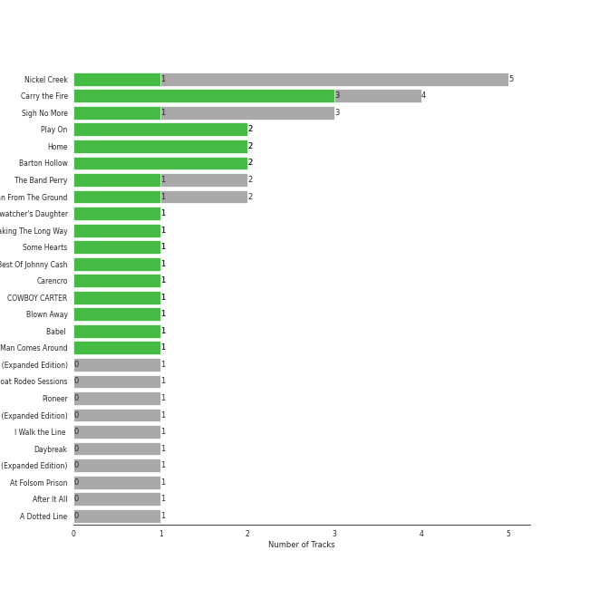

# Country/Folk

[36 songs](country_folk_tracks.md)

## Top Artists

See all 9 artists

|   Number of Tracks | Art                                                                                              | Artist           | 🔗                                                           |
|-------------------:|:-------------------------------------------------------------------------------------------------|:-----------------|:------------------------------------------------------------|
|                  6 |  | Nickel Creek     | [🔗](https://open.spotify.com/artist/3bcLBxvaI7GsBzGp3WHnwQ) |
|                  5 |  | Carrie Underwood | [🔗](https://open.spotify.com/artist/4xFUf1FHVy696Q1JQZMTRj) |
|                  5 |  | Mumford & Sons   | [🔗](https://open.spotify.com/artist/3gd8FJtBJtkRxdfbTu19U2) |
|                  5 |  | Delta Rae        | [🔗](https://open.spotify.com/artist/0iidQFemlPhkoHqFroz2my) |
|                  4 |  | Johnny Cash      | [🔗](https://open.spotify.com/artist/6kACVPfCOnqzgfEF5ryl0x) |
|                  4 |  | The Civil Wars   | [🔗](https://open.spotify.com/artist/6J7rw7NELJUCThPbAfyLIE) |
|                  3 |  | The Band Perry   | [🔗](https://open.spotify.com/artist/75FnCoo4FBxH5K1Rrx0k5A) |
|                  3 |  | The Chicks       | [🔗](https://open.spotify.com/artist/25IG9fa7cbdmCIy3OnuH57) |
|                  1 |  | Marc Broussard   | [🔗](https://open.spotify.com/artist/4cEwEednPwWCdYT7ZhROZe) |

## Top Albums

See all 21 albums

|   Number of Tracks | Art                                                                                              | Album                                 | 🔗                                                          |
|-------------------:|:-------------------------------------------------------------------------------------------------|:--------------------------------------|:-----------------------------------------------------------|
|                  5 |  | Nickel Creek                          | [🔗](https://open.spotify.com/album/5SGG7graQOU3OnK3cZZCNd) |
|                  4 |  | Carry the Fire                        | [🔗](https://open.spotify.com/album/42NjSADnDs97o75bICIqs0) |
|                  3 |  | Sigh No More                          | [🔗](https://open.spotify.com/album/6w5W6ZGTvDsppKUOiGMuMo) |
|                  2 |  | The Band Perry                        | [🔗](https://open.spotify.com/album/3dASAcs9QOsmoSLhHjEhCu) |
|                  2 |  | Play On                               | [🔗](https://open.spotify.com/album/3iLrVuA1k7onNmZTuUQH4u) |
|                  2 |  | Home                                  | [🔗](https://open.spotify.com/album/1zgQkZFMRqx1Lz9GVXghLt) |
|                  2 |  | Blown Away                            | [🔗](https://open.spotify.com/album/7atJn49QvtOLiFxhQd2hp9) |
|                  2 |  | Barton Hollow                         | [🔗](https://open.spotify.com/album/4uWgDFxGAp7XlVSHuVBv4E) |
|                  2 |  | Barton Hollow                         | [🔗](https://open.spotify.com/album/6yCzOeJHgOnJBP3K6IDPIV) |
|                  1 |  | Taking The Long Way                   | [🔗](https://open.spotify.com/album/2NeJdEWras0uSuzLPlJZk5) |
|                  1 |  | Some Hearts                           | [🔗](https://open.spotify.com/album/0kys2jaKAiDPfNBd4z7LAg) |
|                  1 |  | Ring Of Fire: The Best Of Johnny Cash | [🔗](https://open.spotify.com/album/0ucV57dbnqmrGv9d60r6X2) |
|                  1 |  | Pioneer                               | [🔗](https://open.spotify.com/album/4oXEoK7WVM1lNbmB59IrJ1) |
|                  1 |  | I Walk the Line (Stereo Version)      | [🔗](https://open.spotify.com/album/1kd7QnBNMg5kygoclVuDqZ) |
|                  1 |  | Carencro                              | [🔗](https://open.spotify.com/album/15dP7BadtY55t9VvFlVrBA) |
|                  1 |  | Babel (Deluxe Version)                | [🔗](https://open.spotify.com/album/4Blt0T4LKGdWreILkYZre3) |
|                  1 |  | Babel                                 | [🔗](https://open.spotify.com/album/4QVDwpWrDPF2vUjlTHfRjr) |
|                  1 |  | At Folsom Prison                      | [🔗](https://open.spotify.com/album/4TJIdlY9hGSSTO1kUs1neh) |
|                  1 |  | American IV: The Man Comes Around     | [🔗](https://open.spotify.com/album/2BlL4Gv2DLPu8p58Wcmlm9) |
|                  1 |  | After It All                          | [🔗](https://open.spotify.com/album/0HvAm2vysVverWiodCEhON) |
|                  1 |  | A Dotted Line                         | [🔗](https://open.spotify.com/album/3ujidZyCiCruwocS0bDmt2) |

## Top Record Labels

See all 16 labels

|   Number of Tracks | Label                             |
|-------------------:|:----------------------------------|
|                  6 | Columbia                          |
|                  5 | Sugar Hill Records                |
|                  5 | Sire                              |
|                  5 | Glassnote Entertainment Group LLC |
|                  4 | Sensibility Recordings            |
|                  4 | Arista Nashville                  |
|                  4 | 19 Recordings Limited             |
|                  3 | Open Wide                         |
|                  3 | Big Machine Label Group           |
|                  2 | Monument                          |
|                  2 | Columbia Nashville Legacy         |
|                  1 | Nonesuch                          |
|                  1 | Legacy                            |
|                  1 | Island Records                    |
|                  1 | Arista                            |
|                  1 | American Recordings Catalog P&D   |

