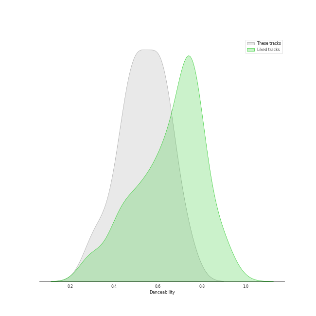
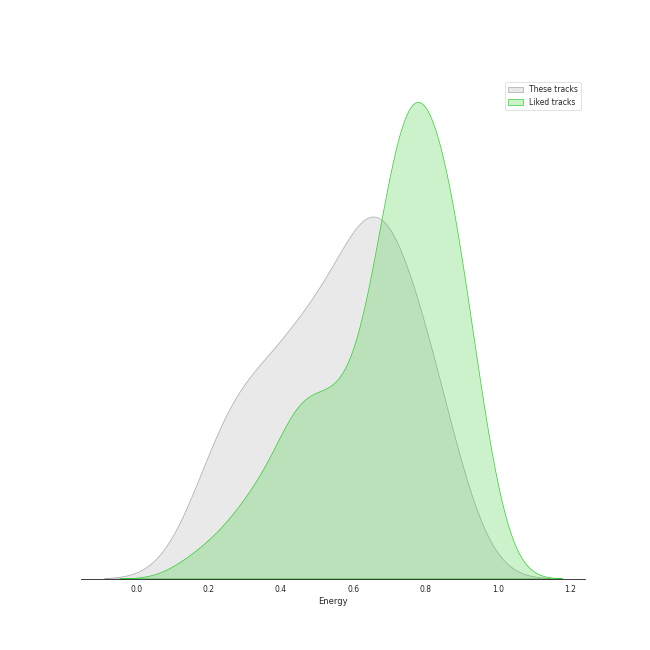
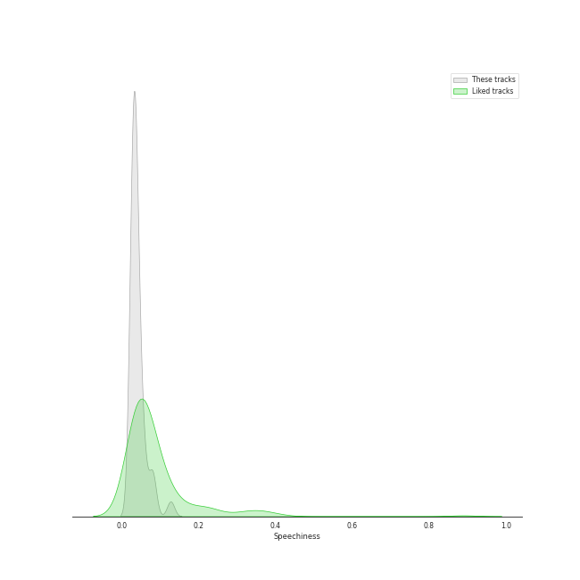
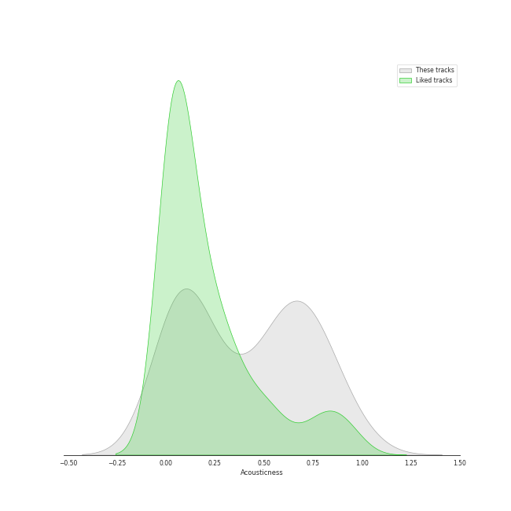
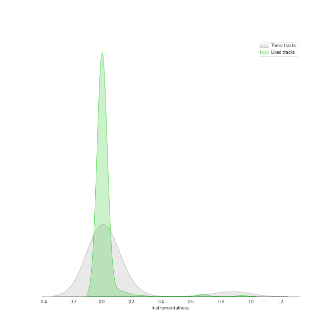
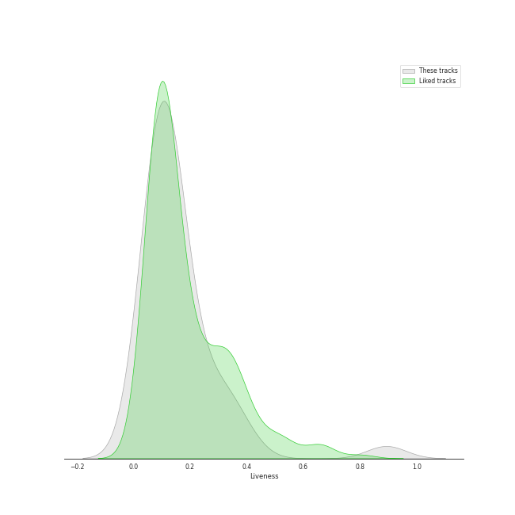
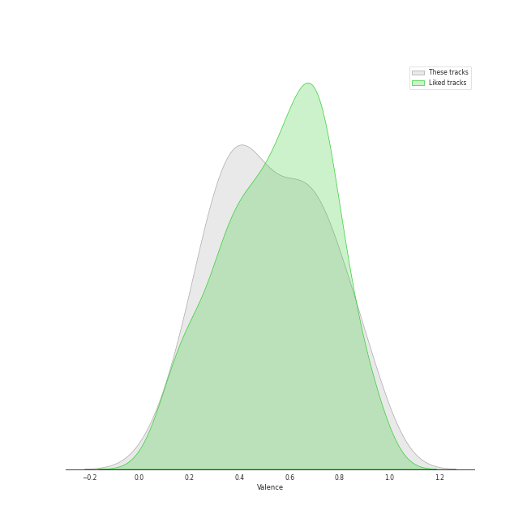
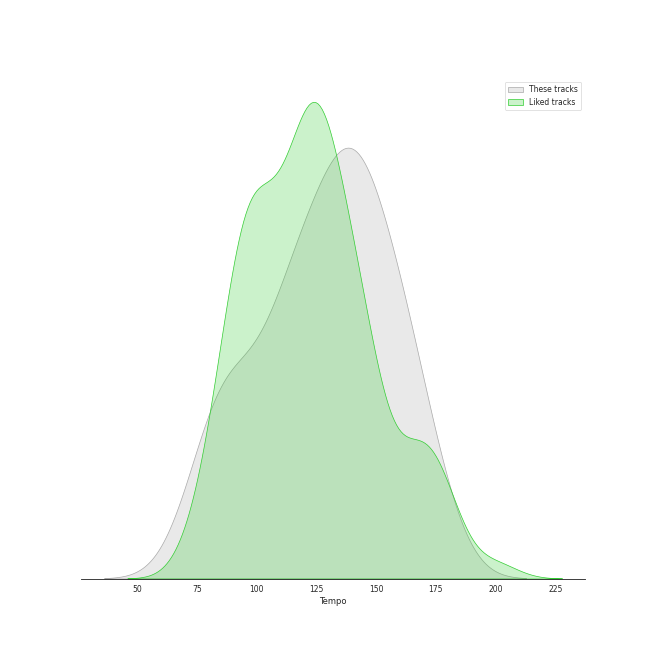

# Track Features for Country/Folk

## Danceability

| ​ | 10 most Danceable tracks | ​​ | 10 least Danceable tracks |
|:---|:---|:---|:---|
|  | Have You Ever Seen The Rain (0.743) |  | Poison & Wine (0.285) |
|  | Have You Ever Seen The Rain (0.741) |  | Is There Anyone out There (0.318) |
|  | Proud Mary (0.699) |  | Morning Comes (0.327) |
|  | Bottom of the River (0.668) |  | In The House Of Tom Bombadil (0.367) |
|  | Ring of Fire (0.659) |  | Barton Hollow (0.421) |
|  | Fortunate Son (0.64) |  | The Eye (0.425) |
|  | Better Dig Two (0.64) |  | Not Ready to Make Nice (0.425) |
|  | The Fox (0.635) |  | Timshel (0.433) |
|  | Home (0.628) |  | When You Come Back Down (0.452) |
|  | Folsom Prison Blues - Live at Folsom State Prison, Folsom, CA - January 1968 (0.621) |  | The Lighthouse's Tale (0.463) |

## Energy

| ​ | 10 most Energetic tracks | ​​ | 10 least Energetic tracks |
|:---|:---|:---|:---|
|  | Run (0.872) |  | Poison & Wine (0.186) |
|  | Blown Away (0.843) |  | I Walk the Line - Stereo Version (0.194) |
|  | Undo It (0.84) |  | The Eye (0.258) |
|  | Cowboy Casanova (0.82) |  | Timshel (0.265) |
|  | Home (0.804) |  | When You Come Back Down (0.28) |
|  | I Will Wait (0.758) |  | The Lighthouse's Tale (0.297) |
|  | Before He Cheats (0.749) |  | Out Of The Woods (0.316) |
|  | Dance in the Graveyards (0.731) |  | Travelin' Soldier (0.365) |
|  | In The House Of Tom Bombadil (0.699) |  | Attaboy (0.384) |
|  | Have You Ever Seen The Rain (0.697) |  | Hurt (0.392) |

## Speechiness

| ​ | 10 most Speechy tracks | ​​ | 10 least Speechy tracks |
|:---|:---|:---|:---|
|  | Home (0.128) |  | Travelin' Soldier (0.0265) |
|  | Bottom of the River (0.0828) |  | Hurt (0.0267) |
|  | Folsom Prison Blues - Live at Folsom State Prison, Folsom, CA - January 1968 (0.0803) |  | Little Lion Man (0.0272) |
|  | Cowboy Casanova (0.0582) |  | Have You Ever Seen The Rain (0.0277) |
|  | Undo It (0.058) |  | If I Die Young (0.0277) |
|  | Run (0.0557) |  | Landslide (0.0279) |
|  | Morning Comes (0.0531) |  | Poison & Wine (0.0288) |
|  | Better Dig Two (0.0519) |  | Ring of Fire (0.0288) |
|  | Blown Away (0.0429) |  | You Lie (0.0289) |
|  | Is There Anyone out There (0.0428) |  | Proud Mary (0.0289) |

## Acousticness

| ​ | 10 most Acoustic tracks | ​​ | 10 least Acoustic tracks |
|:---|:---|:---|:---|
|  | I Walk the Line - Stereo Version (0.97) |  | I Will Wait (0.00974) |
|  | Heart In A Cage (0.869) |  | Is There Anyone out There (0.0236) |
|  | Timshel (0.856) |  | Little Lion Man (0.0293) |
|  | Attaboy (0.823) |  | Cowboy Casanova (0.0328) |
|  | Dead Leaves And The Dirty Ground (0.815) |  | The Cave (0.0464) |
|  | Poison & Wine (0.756) |  | Morning Comes (0.0643) |
|  | The Eye (0.736) |  | Folsom Prison Blues - Live at Folsom State Prison, Folsom, CA - January 1968 (0.0652) |
|  | In The House Of Tom Bombadil (0.728) |  | Have You Ever Seen The Rain (0.0664) |
|  | Travelin' Soldier (0.691) |  | Dance in the Graveyards (0.082) |
|  | When You Come Back Down (0.684) |  | Blown Away (0.0909) |

## Instrumentalness

| ​ | 10 most Instrumental tracks | ​​ | 10 least Instrumental tracks |
|:---|:---|:---|:---|
|  | In The House Of Tom Bombadil (0.9) |  | The Lighthouse's Tale (0.0) |
|  | Attaboy (0.767) |  | Travelin' Soldier (0.0) |
|  | I Walk the Line - Stereo Version (0.162) |  | The Eye (0.0) |
|  | Dead Leaves And The Dirty Ground (0.13) |  | Before He Cheats (0.0) |
|  | Out Of The Woods (0.0978) |  | Blown Away (0.0) |
|  | Fortunate Son (0.00806) |  | Undo It (0.0) |
|  | I Will Wait (0.00717) |  | Dance in the Graveyards (0.0) |
|  | Heart In A Cage (0.0034) |  | Bottom of the River (0.0) |
|  | Run (0.00264) |  | Better Dig Two (0.0) |
|  | Folsom Prison Blues - Live at Folsom State Prison, Folsom, CA - January 1968 (0.00199) |  | You Lie (0.0) |

## Liveness

| ​ | 10 most Live tracks | ​​ | 10 least Live tracks |
|:---|:---|:---|:---|
|  | Folsom Prison Blues - Live at Folsom State Prison, Folsom, CA - January 1968 (0.893) |  | Blown Away (0.0283) |
|  | Home (0.393) |  | Undo It (0.046) |
|  | Ring of Fire (0.348) |  | The Fox (0.0494) |
|  | Is There Anyone out There (0.329) |  | The Lighthouse's Tale (0.0601) |
|  | I Will Wait (0.312) |  | Proud Mary (0.0601) |
|  | If I Die Young (0.275) |  | The Eye (0.0734) |
|  | Heart In A Cage (0.274) |  | Run (0.0743) |
|  | In The House Of Tom Bombadil (0.218) |  | Better Dig Two (0.0779) |
|  | Landslide (0.187) |  | Out Of The Woods (0.0831) |
|  | Have You Ever Seen The Rain (0.186) |  | Barton Hollow (0.0857) |

## Valence

| ​ | 10 most Happy tracks | ​​ | 10 least Happy tracks |
|:---|:---|:---|:---|
|  | Have You Ever Seen The Rain (0.89) |  | Timshel (0.0954) |
|  | Folsom Prison Blues - Live at Folsom State Prison, Folsom, CA - January 1968 (0.889) |  | Hurt (0.163) |
|  | The Fox (0.889) |  | Poison & Wine (0.203) |
|  | Dead Leaves And The Dirty Ground (0.881) |  | Out Of The Woods (0.249) |
|  | Home (0.795) |  | Morning Comes (0.257) |
|  | Ring of Fire (0.784) |  | Not Ready to Make Nice (0.288) |
|  | Have You Ever Seen The Rain (0.774) |  | Before He Cheats (0.29) |
|  | I Walk the Line - Stereo Version (0.746) |  | The Lighthouse's Tale (0.301) |
|  | Proud Mary (0.728) |  | The Eye (0.311) |
|  | Bottom of the River (0.716) |  | The Cave (0.346) |

## Tempo

| ​ | 10 most Fast tracks | ​​ | 10 least Fast tracks |
|:---|:---|:---|:---|
|  | Morning Comes (174.339) |  | Bottom of the River (74.672) |
|  | You Lie (170.939) |  | Home (82.288) |
|  | When You Come Back Down (168.047) |  | Timshel (82.965) |
|  | The Eye (162.761) |  | Not Ready to Make Nice (83.917) |
|  | Is There Anyone out There (160.988) |  | Dead Leaves And The Dirty Ground (89.748) |
|  | Run (160.315) |  | Hurt (90.379) |
|  | Undo It (156.254) |  | Barton Hollow (90.913) |
|  | Better Dig Two (155.844) |  | Dance in the Graveyards (102.003) |
|  | Poison & Wine (153.85) |  | Ring of Fire (104.111) |
|  | Before He Cheats (147.905) |  | Folsom Prison Blues - Live at Folsom State Prison, Folsom, CA - January 1968 (110.586) |
