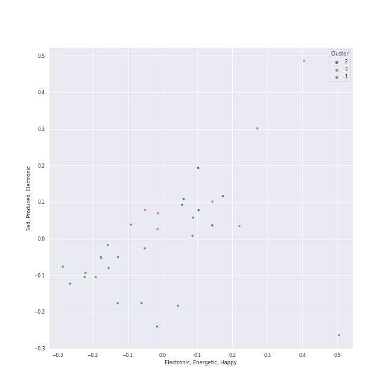

# Clusters in Country/Folk

## Cluster #1

18 tracks

| Art | Track | Album | Artists | Label | Score | 💚 | 🔗 |
|:---|:---|:---|:---|:---|---:|:---|:---|
|  | The Lighthouse's Tale | Nickel Creek | Nickel Creek | Sugar Hill Records | 0 | 💚 | [🔗](https://open.spotify.com/track/05HjafWVI238CLw5RDNkas) |
|  | Out Of The Woods | Nickel Creek | Nickel Creek | Sugar Hill Records | 0 | | [🔗](https://open.spotify.com/track/0l4s9ze0CrQfOiE8jaMs1H) |
|  | When You Come Back Down | Nickel Creek | Nickel Creek | Sugar Hill Records | 0 | | [🔗](https://open.spotify.com/track/1xVBmHH65VMaJP61SmOSUk) |
|  | Landslide | Home | The Chicks | [Open Wide/Monument/Columbia](../../../../labels/columbia) | 0 | 💚 | [🔗](https://open.spotify.com/track/5hviCr3lgg6LY6noG6DPKs) |
|  | Not Ready to Make Nice | Taking The Long Way | The Chicks | [Open Wide/Columbia](../../../../labels/columbia) | 0 | 💚 | [🔗](https://open.spotify.com/track/6LCEyZZHFF4ebF1Mike1s5) |
|  | The Eye | The Firewatcher's Daughter | Brandi Carlile | ATO Records | 0 | 💚 | [🔗](https://open.spotify.com/track/0Plf9mewMoYkwEvncCjfxS) |
|  | Before He Cheats | Some Hearts | Carrie Underwood | Arista | 0 | 💚 | [🔗](https://open.spotify.com/track/0ZUo4YjG4saFnEJhdWp9Bt) |
|  | Hurt | American IV: The Man Comes Around | Johnny Cash | American Recordings Catalog P&D | 0 | 💚 | [🔗](https://open.spotify.com/track/28cnXtME493VX9NOw9cIUh) |
|  | If I Die Young | The Band Perry | The Band Perry | Big Machine Label Group, LLC | 0 | | [🔗](https://open.spotify.com/track/4u26EevCNXMhlvE1xFBJwX) |
|  | Barton Hollow | Barton Hollow | The Civil Wars | sensibility recordings | 0 | 💚 | [🔗](https://open.spotify.com/track/6ZOBY9RG2tcxXX0ohKtfRc) |
## Cluster #2

3 tracks

| Art | Track | Album | Artists | Label | Score | 💚 | 🔗 |
|:---|:---|:---|:---|:---|---:|:---|:---|
|  | Home | Carencro | Marc Broussard | [Island Records](../../../../labels/island_records) | 0 | 💚 | [🔗](https://open.spotify.com/track/1XhzO8cuPaqsqUKw92Wbwc) |
|  | Folsom Prison Blues - Live at Folsom State Prison, Folsom, CA - January 1968 | At Folsom Prison | Johnny Cash | [Columbia](../../../../labels/columbia), [Legacy](../../../../labels/legacy) | 0 | | [🔗](https://open.spotify.com/track/2fDHuS1PTkHBbCWWZF1ph9) |
|  | Ring of Fire | Ring Of Fire: The Best Of Johnny Cash | Johnny Cash | Columbia Nashville Legacy | 0 | 💚 | [🔗](https://open.spotify.com/track/6YffUZJ2R06kyxyK6onezL) |
## Cluster #3

15 tracks

| Art | Track | Album | Artists | Label | Score | 💚 | 🔗 |
|:---|:---|:---|:---|:---|---:|:---|:---|
|  | Destination | A Dotted Line | Nickel Creek | Nonesuch | 0 | | [🔗](https://open.spotify.com/track/6kuqHs2ijp5D8tj0XokQQo) |
|  | Blown Away | Blown Away | Carrie Underwood | 19 Recordings Limited / Arista Nashville | 0 | | [🔗](https://open.spotify.com/track/0vFMQi8ZnOM2y8cuReZTZ2) |
|  | Undo It | Play On | Carrie Underwood | 19 Recordings Limited / Arista Nashville | 0 | 💚 | [🔗](https://open.spotify.com/track/1Fo2N5iXRi37maMboaig7O) |
|  | Cowboy Casanova | Play On | Carrie Underwood | 19 Recordings Limited / Arista Nashville | 0 | 💚 | [🔗](https://open.spotify.com/track/6OqdF0vHI9xkqswI7EK0cD) |
|  | Run | After It All | Delta Rae | Sire | 0 | | [🔗](https://open.spotify.com/track/1G2y3ckwnDX4IOiemPOXEW) |
|  | Dance in the Graveyards | Carry the Fire | Delta Rae | Sire | 0 | 💚 | [🔗](https://open.spotify.com/track/1gOEbMyphMVhTyZ4HxXQro) |
|  | Bottom of the River | Carry the Fire | Delta Rae | Sire | 0 | 💚 | [🔗](https://open.spotify.com/track/2LzyUfJdRp3uqTrITBJXEY) |
|  | Little Lion Man | Sigh No More | Mumford & Sons | Glassnote Entertainment Group LLC | 0 | 💚 | [🔗](https://open.spotify.com/track/6JnufVNLIO5F5Lk4sEVLeI) |
|  | Better Dig Two | Pioneer | The Band Perry | Big Machine Label Group, LLC | 0 | | [🔗](https://open.spotify.com/track/3z0a8G407NbxfjTRffvQiP) |
|  | You Lie | The Band Perry | The Band Perry | Big Machine Label Group, LLC | 0 | 💚 | [🔗](https://open.spotify.com/track/462tT5pBVstoLcOSJsBBKw) |