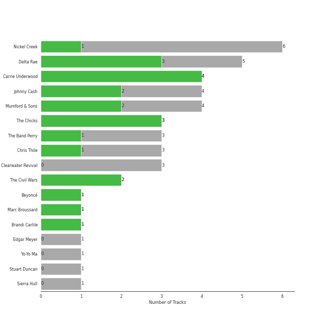
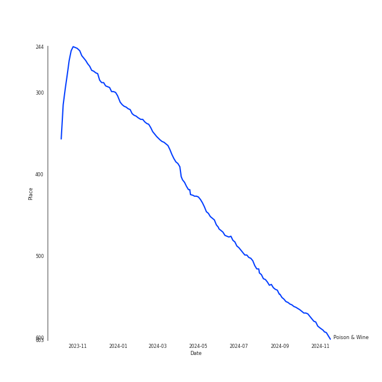
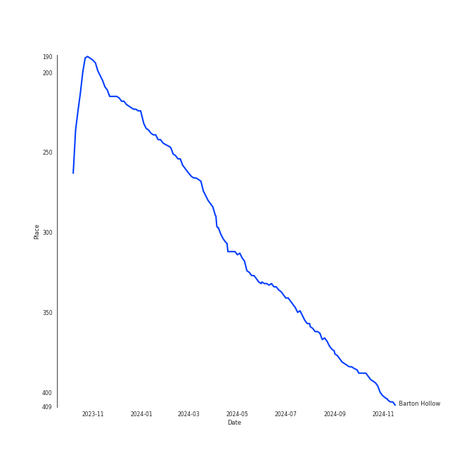
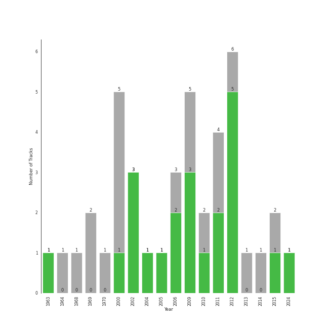

# Country/Folk

[41 tracks (22 liked) 🔗](https://open.spotify.com/playlist/6M7uIRzByJjX0q7wGcujJo)

[See Track Features](audio_features.md)

[See Clusters](clusters/overview.md)

## Top Artists

| Art | Rank | Tracks | 💚 | Artist | 🔗 |
|:---|---:|---:|---:|:---|:---|
|  | 427 | 4 | 4 | Carrie Underwood | [🔗](https://open.spotify.com/artist/4xFUf1FHVy696Q1JQZMTRj) |
|  | 427 | 5 | 3 | Delta Rae | [🔗](https://open.spotify.com/artist/0iidQFemlPhkoHqFroz2my) |
|  | 427 | 3 | 3 | The Chicks | [🔗](https://open.spotify.com/artist/25IG9fa7cbdmCIy3OnuH57) |
|  | 427 | 4 | 2 | Johnny Cash | [🔗](https://open.spotify.com/artist/6kACVPfCOnqzgfEF5ryl0x) |
|  | 427 | 4 | 2 | Mumford & Sons | [🔗](https://open.spotify.com/artist/3gd8FJtBJtkRxdfbTu19U2) |
|  | 298 | 2 | 2 | The Civil Wars | [🔗](https://open.spotify.com/artist/6J7rw7NELJUCThPbAfyLIE) |
|  | 427 | 6 | 1 | Nickel Creek | [🔗](https://open.spotify.com/artist/3bcLBxvaI7GsBzGp3WHnwQ) |
|  | 427 | 3 | 1 | The Band Perry | [🔗](https://open.spotify.com/artist/75FnCoo4FBxH5K1Rrx0k5A) |
|  | 427 | 3 | 1 | Chris Thile | [🔗](https://open.spotify.com/artist/1dyGPAYZZHHW6WIqwKN5QF) |
|  | 132 | 1 | 1 | [Beyoncé](../../artists/beyoncé/overview.md) | [🔗](https://open.spotify.com/artist/6vWDO969PvNqNYHIOW5v0m) |

See all 17 artists

| Art | Rank | Tracks | 💚 | Artist | 🔗 |
|:---|---:|---:|---:|:---|:---|
|  | 427 | 1 | 1 | Marc Broussard | [🔗](https://open.spotify.com/artist/4cEwEednPwWCdYT7ZhROZe) |
|  | 427 | 1 | 1 | Brandi Carlile | [🔗](https://open.spotify.com/artist/2sG4zTOLvjKG1PSoOyf5Ej) |
|  | 427 | 3 | 0 | Creedence Clearwater Revival | [🔗](https://open.spotify.com/artist/3IYUhFvPQItj6xySrBmZkd) |
|  | 427 | 1 | 0 | Edgar Meyer | [🔗](https://open.spotify.com/artist/7jkhwa4XMe9XSt1r0AWNqD) |
|  | 427 | 1 | 0 | Yo-Yo Ma | [🔗](https://open.spotify.com/artist/5Dl3HXZjG6ZOWT5cV375lk) |
|  | 427 | 1 | 0 | Stuart Duncan | [🔗](https://open.spotify.com/artist/53pmIwVqcTM68qW6PVhjW2) |
|  | 427 | 1 | 0 | Sierra Hull | [🔗](https://open.spotify.com/artist/0JGGxsAD1Eg4X9AcKNcxEB) |

## Top Tracks

Most and least listened tracks

| Rank | ​ | Most listened tracks | Rank | ​​ | Least listened tracks |
|---:|:---|:---|---:|:---|:---|
| 556 |  | Poison & Wine | 957 |  | [TEXAS HOLD 'EM](../../artists/beyoncé/overview.md) |
| 957 |  | The Lighthouse's Tale | 957 |  | Heart In A Cage |
| 957 |  | Travelin' Soldier | 957 |  | The Cave |
| 957 |  | The Eye | 957 |  | Is There Anyone out There |
| 957 |  | Before He Cheats | 957 |  | Proud Mary |
| 957 |  | The Fox | 957 |  | Destination |
| 957 |  | Out Of The Woods | 957 |  | Barton Hollow |
| 957 |  | Blown Away | 957 |  | Ring of Fire |
| 957 |  | Undo It | 957 |  | Cowboy Casanova |
| 957 |  | Run | 957 |  | Not Ready to Make Nice |

## Top Albums

| Art | Rank | Tracks | 💚 | Album | Release Date | 🔗 |
|:---|---:|---:|---:|:---|:---|:---|
|  | 633 | 5 | 1 | Nickel Creek | 2000 | [🔗](https://open.spotify.com/album/5SGG7graQOU3OnK3cZZCNd) |
|  | 633 | 4 | 3 | Carry the Fire | 2012-06-19 | [🔗](https://open.spotify.com/album/42NjSADnDs97o75bICIqs0) |
|  | 633 | 3 | 1 | Sigh No More | 2009-10-02 | [🔗](https://open.spotify.com/album/6w5W6ZGTvDsppKUOiGMuMo) |
|  | 633 | 2 | 2 | Play On | 2009 | [🔗](https://open.spotify.com/album/3iLrVuA1k7onNmZTuUQH4u) |
|  | 633 | 2 | 2 | Home | 2002-08-27 | [🔗](https://open.spotify.com/album/1zgQkZFMRqx1Lz9GVXghLt) |
|  | 381 | 2 | 2 | Barton Hollow | 2011-02-01 | [🔗](https://open.spotify.com/album/4uWgDFxGAp7XlVSHuVBv4E) |
|  | 633 | 2 | 1 | The Band Perry | 2010-01-01 | [🔗](https://open.spotify.com/album/3dASAcs9QOsmoSLhHjEhCu) |
|  | 633 | 2 | 1 | How To Grow A Woman From The Ground | 2006-01-01 | [🔗](https://open.spotify.com/album/3UVP898xdmvyLVE1OLCLh4) |
|  | 633 | 1 | 1 | The Firewatcher's Daughter | 2015-03-06 | [🔗](https://open.spotify.com/album/5ZpxRLVRkCZ2BXXW1KYbTB) |
|  | 633 | 1 | 1 | Taking The Long Way | 2006-05-23 | [🔗](https://open.spotify.com/album/2NeJdEWras0uSuzLPlJZk5) |

See all 27 albums

| Art | Rank | Tracks | 💚 | Album | Release Date | 🔗 |
|:---|---:|---:|---:|:---|:---|:---|
|  | 633 | 1 | 1 | Some Hearts | 2005-11-14 | [🔗](https://open.spotify.com/album/0kys2jaKAiDPfNBd4z7LAg) |
|  | 633 | 1 | 1 | Ring Of Fire: The Best Of Johnny Cash | 1963-08-06 | [🔗](https://open.spotify.com/album/0ucV57dbnqmrGv9d60r6X2) |
|  | 633 | 1 | 1 | Carencro | 2004-08-03 | [🔗](https://open.spotify.com/album/15dP7BadtY55t9VvFlVrBA) |
|  | 633 | 1 | 1 | COWBOY CARTER | 2024-03-29 | [🔗](https://open.spotify.com/album/6BzxX6zkDsYKFJ04ziU5xQ) |
|  | 633 | 1 | 1 | Blown Away | 2012-05-01 | [🔗](https://open.spotify.com/album/7atJn49QvtOLiFxhQd2hp9) |
|  | 633 | 1 | 1 | Babel (Deluxe Version) | 2012-09-25 | [🔗](https://open.spotify.com/album/3FfuUD3Je9t9tQq80Zq41y) |
|  | 633 | 1 | 1 | American IV: The Man Comes Around | 2002-01-01 | [🔗](https://open.spotify.com/album/2BlL4Gv2DLPu8p58Wcmlm9) |
|  | 633 | 1 | 0 | Willy And The Poor Boys (Expanded Edition) | 1969-11-02 | [🔗](https://open.spotify.com/album/31q47gQszFt0CddSyMksgO) |
|  | 633 | 1 | 0 | The Goat Rodeo Sessions | 2011-10-24 | [🔗](https://open.spotify.com/album/3P7xbl4YB4T73vWRHgcHMa) |
|  | 633 | 1 | 0 | Pioneer | 2013-01-01 | [🔗](https://open.spotify.com/album/4oXEoK7WVM1lNbmB59IrJ1) |
|  | 633 | 1 | 0 | Pendulum (Expanded Edition) | 1970-12-07 | [🔗](https://open.spotify.com/album/372cMadhAGlNuDnc8TssqF) |
|  | 633 | 1 | 0 | I Walk the Line (Stereo Version) | 1964-06-13 | [🔗](https://open.spotify.com/album/1kd7QnBNMg5kygoclVuDqZ) |
|  | 633 | 1 | 0 | Daybreak | 2011-01-01 | [🔗](https://open.spotify.com/album/4NikL2T7EDGcB6FyTFQ7rn) |
|  | 633 | 1 | 0 | Bayou Country (Expanded Edition) | 1969-01-05 | [🔗](https://open.spotify.com/album/5pCRW9AT4BgoMOS52pRoJq) |
|  | 633 | 1 | 0 | At Folsom Prison | 1968-05-01 | [🔗](https://open.spotify.com/album/4TJIdlY9hGSSTO1kUs1neh) |
|  | 633 | 1 | 0 | After It All | 2015-04-07 | [🔗](https://open.spotify.com/album/0HvAm2vysVverWiodCEhON) |
|  | 633 | 1 | 0 | A Dotted Line | 2014-03-28 | [🔗](https://open.spotify.com/album/3ujidZyCiCruwocS0bDmt2) |

## Top Record Labels

| Tracks | 💚 | Label |
|---:|---:|:---|
| 5 | 4 | [Columbia](../../labels/columbia/overview.md) |
| 5 | 3 | Sire |
| 3 | 3 | Open Wide |
| 3 | 3 | Arista Nashville |
| 3 | 3 | 19 Recordings Limited |
| 7 | 2 | Sugar Hill Records |
| 4 | 2 | Glassnote Entertainment Group LLC |
| 2 | 2 | sensibility recordings |
| 2 | 2 | Monument |
| 3 | 1 | Big Machine Label Group |

See all 21 labels

| Tracks | 💚 | Label |
|---:|---:|:---|
| 2 | 1 | Columbia Nashville Legacy |
| 1 | 1 | [Parkwood Entertainment](../../labels/parkwood_entertainment/overview.md) |
| 1 | 1 | [Island Records](../../labels/island_records/overview.md) |
| 1 | 1 | Arista |
| 1 | 1 | American Recordings Catalog P&D |
| 1 | 1 | ATO Records |
| 3 | 0 | [Craft Recordings](../../labels/craft_recordings/overview.md) |
| 1 | 0 | [Sony Classical](../../labels/sony_classical/overview.md) |
| 1 | 0 | Rounder Records |
| 1 | 0 | Nonesuch |
| 1 | 0 | [Legacy](../../labels/legacy/overview.md) |

## Genres

| Tracks | 💚 | Genre |
|---:|---:|:---|
| 10 | 8 | country dawn |
| 10 | 8 | country |
| 10 | 8 | contemporary country |
| 5 | 5 | [pop](../../genres/pop/overview.md) |
| 6 | 4 | stomp and holler |
| 6 | 4 | [neo mellow](../../genres/neo_mellow/overview.md) |
| 4 | 4 | [dance pop](../../genres/dance_pop/overview.md) |
| 4 | 4 | classic oklahoma country |
| 4 | 4 | [acoustic pop](../../genres/acoustic_pop/overview.md) |
| 5 | 3 | modern folk rock |

See all 36 genres

| Tracks | 💚 | Genre |
|---:|---:|:---|
| 5 | 3 | folk-pop |
| 3 | 3 | new americana |
| 3 | 3 | indie folk |
| 10 | 2 | progressive bluegrass |
| 9 | 2 | mandolin |
| 9 | 2 | instrumental bluegrass |
| 9 | 2 | bluegrass |
| 7 | 2 | [rock](../../genres/rock/overview.md) |
| 4 | 2 | uk americana |
| 4 | 2 | outlaw country |
| 4 | 2 | [modern rock](../../genres/modern_rock/overview.md) |
| 4 | 2 | arkansas country |
| 3 | 1 | country road |
| 2 | 1 | classical mandolin |
| 1 | 1 | [r&b](../../genres/r_b/overview.md) |
| 1 | 1 | [lilith](../../genres/lilith/overview.md) |
| 1 | 1 | lafayette indie |
| 1 | 1 | [folk](../../genres/folk/overview.md) |
| 1 | 1 | [ectofolk](../../genres/ectofolk/overview.md) |
| 3 | 0 | swamp rock |
| 3 | 0 | southern rock |
| 3 | 0 | [mellow gold](../../genres/mellow_gold/overview.md) |
| 3 | 0 | country rock |
| 3 | 0 | [classic rock](../../genres/classic_rock/overview.md) |
| 3 | 0 | [album rock](../../genres/album_rock/overview.md) |
| 1 | 0 | bluegrass fiddle |

## Top Producers

| Art | Producer | Tracks | Credit Types |
|:---|:---|---:|:---|
| | Ruadhri Cushnan | 2 | Producer |
| | Mark Bright | 2 | Producer |
| | Charlie Peacock | 2 | Producer |
|  | Mumford & Sons | 2 | Arranger |
| | Ted Dwane | 2 | Songwriter |
| | John Paul White | 2 | Songwriter |
| | Gary Paczosa | 2 | Producer |
| | Markus Dravs | 2 | Producer |
|  | The Chicks | 2 | Producer |
| | Chris Tompkins | 2 | Songwriter |

View all

| Art | Producer | Tracks | Credit Types |
|:---|:---|---:|:---|
| | Marcus Mumford | 2 | Songwriter |
| | Joy Williams | 2 | Songwriter |
| | Winston Marshall | 2 | Songwriter |
| | Ben Lovett | 2 | Songwriter |
| | Josh Kear | 2 | Songwriter |
| | Eric Bickel | 2 | Producer |
| | Lloyd Maines | 2 | Producer |
| | Richie Biggs | 2 | Producer |
| | Rick Rubin | 2 | Producer |
| | Robin Baynton | 1 | Producer |
| | David Ferguson | 1 | Producer |
| | Bruce Robison | 1 | Lyricist, Songwriter |
| | Stevie Nicks | 1 | Lyricist, Songwriter |
|  | Brandi Carlile | 1 | Songwriter |
| | Raphael Saadiq | 1 | Producer, Songwriter |
| | Trent Reznor | 1 | Lyricist, Songwriter |
| | Brett James | 1 | Songwriter |
| | Hit-Boy | 1 | Producer |
| | David Campbell | 1 | Arranger |
|  | Julian Casablancas | 1 | Lyricist, Songwriter |
| | Joe Zook | 1 | Producer |
| | Hotae Alexander Jang | 1 | Producer |
|  | Chris Thile | 1 | Songwriter |
| | Nate Ferraro | 1 | Producer, Songwriter |
| | Emily Robison | 1 | Lyricist, Songwriter |
| | Chris Lindsey | 1 | Songwriter |
| | Lowell | 1 | Songwriter |
| | Dan Wilson | 1 | Lyricist, Songwriter |
| | Shannon Sanders | 1 | Producer |
| | Adam McKenzie | 1 | Songwriter |
| | Stuart White | 1 | Producer |
| | bülow (bülow) | 1 | Songwriter |
| | Alex Nibley | 1 | Producer |
| | Chris Testa | 1 | Producer |
| | Drew Ramsey | 1 | Producer |
| | Martie Maguire | 1 | Arranger, Lyricist, Songwriter |
| | Brian Vincent Bates | 1 | Producer, Songwriter |
| | Greg Fidelman | 1 | Producer |
| | John Carter Cash | 1 | Producer |
| | Tim Hanseroth | 1 | Songwriter |
| | Richard Dodd | 1 | Producer |
| | Don Law | 1 | Producer |
| | Mariel Gomerez | 1 | Producer |
| | Matheus Braz | 1 | Producer |
| | Andrea Roberts | 1 | Producer |
| | John Silva | 1 | Producer |
| | Natalie Maines | 1 | Lyricist, Songwriter |
| | June Carter Cash | 1 | Songwriter |
| | François Chevallier (Chevallier, François) | 1 | Producer |
| | Marshall Altman | 1 | Arranger, Producer |
| | Mike Elizondo | 1 | Songwriter |
|  | Carrie Underwood | 1 | Songwriter |
| | Jim Scott | 1 | Producer |
| | Frank Jones | 1 | Producer |
| | Paul Worley | 1 | Producer |
|  | [Beyoncé](../../artists/beyoncé/overview.md) | 1 | Producer, Songwriter |
| | John Silas Cranfield | 1 | Producer |
| | Merle Kilgore | 1 | Songwriter |

## Years

| ​ | 10 newest albums | ​​ | 10 oldest albums |
|:---|:---|:---|:---|
|  | COWBOY CARTER (2024-03-29) |  | Ring Of Fire: The Best Of Johnny Cash (1963-08-06) |
|  | After It All (2015-04-07) |  | I Walk the Line (Stereo Version) (1964-06-13) |
|  | The Firewatcher's Daughter (2015-03-06) |  | At Folsom Prison (1968-05-01) |
|  | A Dotted Line (2014-03-28) |  | Bayou Country (Expanded Edition) (1969-01-05) |
|  | Pioneer (2013-01-01) |  | Willy And The Poor Boys (Expanded Edition) (1969-11-02) |
|  | Babel (Deluxe Version) (2012-09-25) |  | Pendulum (Expanded Edition) (1970-12-07) |
|  | Carry the Fire (2012-06-19) |  | Nickel Creek (2000) |
|  | Blown Away (2012-05-01) |  | American IV: The Man Comes Around (2002-01-01) |
|  | The Goat Rodeo Sessions (2011-10-24) |  | Home (2002-08-27) |
|  | Barton Hollow (2011-02-01) |  | Carencro (2004-08-03) |