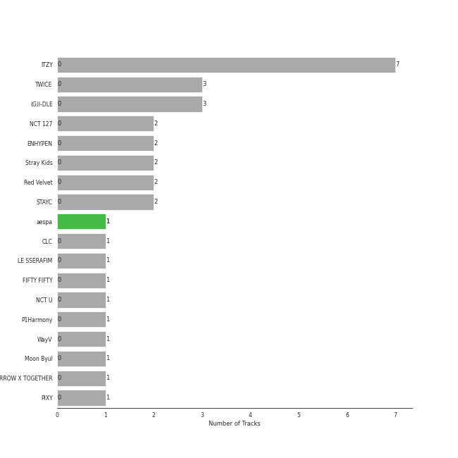
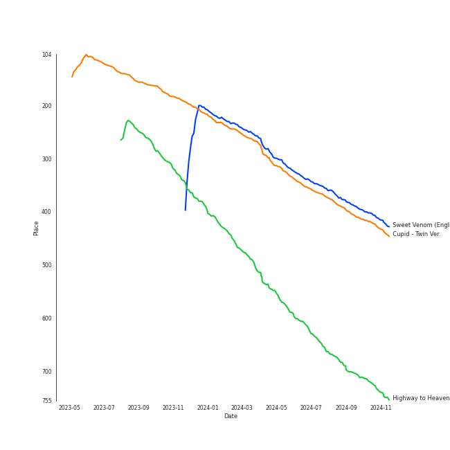
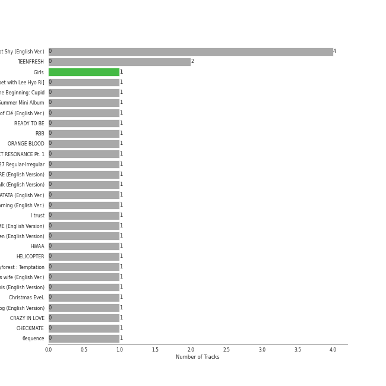
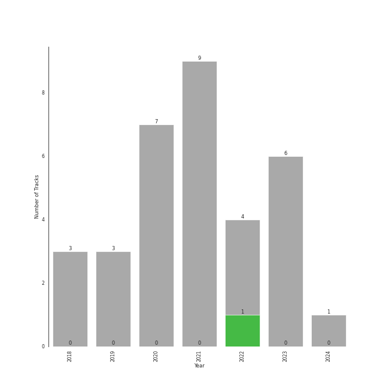

# Cursed English

[33 tracks (1 liked) 🔗](https://open.spotify.com/playlist/2tPCDZMU74TGOBGdNdVDBs)

[See Track Features](audio_features.md)

[See Clusters](clusters/overview.md)

## Top Artists

| Art | Tracks | 💚 | Artist | 🔗 |
|:---|---:|---:|:---|:---|
|  | 1 | 1 | [aespa](../../artists/aespa/overview.md) | [🔗](https://open.spotify.com/artist/6YVMFz59CuY7ngCxTxjpxE) |
|  | 7 | 0 | [ITZY](../../artists/itzy/overview.md) | [🔗](https://open.spotify.com/artist/2KC9Qb60EaY0kW4eH68vr3) |
|  | 3 | 0 | [TWICE](../../artists/twice/overview.md) | [🔗](https://open.spotify.com/artist/7n2Ycct7Beij7Dj7meI4X0) |
|  | 3 | 0 | [(G)I-DLE](../../artists/(g)i-dle/overview.md) | [🔗](https://open.spotify.com/artist/2AfmfGFbe0A0WsTYm0SDTx) |
|  | 2 | 0 | [NCT 127](../../artists/nct_127/overview.md) | [🔗](https://open.spotify.com/artist/7f4ignuCJhLXfZ9giKT7rH) |
|  | 2 | 0 | [ENHYPEN](../../artists/enhypen/overview.md) | [🔗](https://open.spotify.com/artist/5t5FqBwTcgKTaWmfEbwQY9) |
|  | 2 | 0 | [Stray Kids](../../artists/stray_kids/overview.md) | [🔗](https://open.spotify.com/artist/2dIgFjalVxs4ThymZ67YCE) |
|  | 2 | 0 | [Red Velvet](../../artists/red_velvet/overview.md) | [🔗](https://open.spotify.com/artist/1z4g3DjTBBZKhvAroFlhOM) |
|  | 2 | 0 | [STAYC](../../artists/stayc/overview.md) | [🔗](https://open.spotify.com/artist/01XYiBYaoMJcNhPokrg0l0) |
|  | 1 | 0 | [CLC](../../artists/clc/overview.md) | [🔗](https://open.spotify.com/artist/6QyO41KctzGc70mVaVnXQO) |

See all 18 artists

| Art | Tracks | 💚 | Artist | 🔗 |
|:---|---:|---:|:---|:---|
|  | 1 | 0 | [LE SSERAFIM](../../artists/le_sserafim/overview.md) | [🔗](https://open.spotify.com/artist/4SpbR6yFEvexJuaBpgAU5p) |
|  | 1 | 0 | FIFTY FIFTY | [🔗](https://open.spotify.com/artist/4GJ6xDCF5jaUqD6avOuQT6) |
|  | 1 | 0 | [NCT U](../../artists/nct_u/overview.md) | [🔗](https://open.spotify.com/artist/3paGCCtX1Xr4Gx53mSeZuQ) |
|  | 1 | 0 | [P1Harmony](../../artists/p1harmony/overview.md) | [🔗](https://open.spotify.com/artist/3JjvsPeGMbDJqsphe2z8xU) |
|  | 1 | 0 | WayV | [🔗](https://open.spotify.com/artist/1qBsABYUrxg9afpMtyoFKz) |
|  | 1 | 0 | Moon Byul | [🔗](https://open.spotify.com/artist/1eTft3tXynrKdo6XD7QHLL) |
|  | 1 | 0 | [TOMORROW X TOGETHER](../../artists/tomorrow_x_together/overview.md) | [🔗](https://open.spotify.com/artist/0ghlgldX5Dd6720Q3qFyQB) |
|  | 1 | 0 | PIXY | [🔗](https://open.spotify.com/artist/0CJkEzffVZLgav03xXeC9s) |

## Top Tracks

Most and least listened tracks

| ​ | Most listened tracks | Rank | ​​ | Least listened tracks | Rank |
|:---|:---|---:|:---|:---|---:|
|  | [Sweet Venom (English Ver.)](../../artists/enhypen/overview.md) | 276 |  | [MORE & MORE (English Version)](../../artists/twice/overview.md) | nan |
|  | Cupid - Twin Ver. | 289 |  | [ICY - English Ver.](../../artists/itzy/overview.md) | nan |
|  | [Highway to Heaven - English Version](../../artists/nct_127/overview.md) | 535 |  | [LOCO - English Ver.](../../artists/itzy/overview.md) | nan |
|  | [LATATA - English Ver.](../../artists/(g)i-dle/overview.md) | nan |  | [DOMINO (English Ver.)](../../artists/stray_kids/overview.md) | nan |
|  | [Bad Boy - English Version, Bonus Track](../../artists/red_velvet/overview.md) | nan |  | [In the morning - English Ver.](../../artists/itzy/overview.md) | nan |
|  | LUNATIC (English Ver.) | nan |  | [Cat & Dog (English Version)](../../artists/tomorrow_x_together/overview.md) | nan |
|  | [SET ME FREE (ENG)](../../artists/twice/overview.md) | nan |  | [RBB (Really Bad Boy) - English Version](../../artists/red_velvet/overview.md) | nan |
|  | Bewitched - Eng Ver. | nan |  | [Bubble (Sped Up) (English Ver.)](../../artists/stayc/overview.md) | nan |
|  | [Levanter (English Ver.)](../../artists/stray_kids/overview.md) | nan |  | [Make A Wish (Birthday Song) - English Version](../../artists/nct_u/overview.md) | nan |
|  | [Do It Like This - English Version](../../artists/p1harmony/overview.md) | nan |  | [DALLA DALLA - English Ver.](../../artists/itzy/overview.md) | nan |

## Top Albums

| Art | Tracks | 💚 | Album | Release Date | 🔗 |
|:---|---:|---:|:---|:---|:---|
|  | 4 | 0 | Not Shy (English Ver.) | 2021-01-22 | [🔗](https://open.spotify.com/album/0hoNwSKuuOeT9eAxopgMdm) |
|  | 2 | 0 | TEENFRESH | 2023-08-16 | [🔗](https://open.spotify.com/album/4P5wnRQTBnnjNbjt7A6S6x) |
|  | 1 | 1 | Girls - The 2nd Mini Album | 2022-07-08 | [🔗](https://open.spotify.com/album/4w1dbvUy1crv0knXQvcSeY) |
|  | 1 | 0 | What Makes You Beautiful [THE SEASONS: Red Carpet with Lee Hyo Ri] | 2024-02-23 | [🔗](https://open.spotify.com/album/3RvguzRz56wqZ9fNldExgn) |
|  | 1 | 0 | The Beginning: Cupid | 2023-02-24 | [🔗](https://open.spotify.com/album/5letLUZIFsQikJYShfGNs4) |
|  | 1 | 0 | Summer Magic - Summer Mini Album | 2018-08-06 | [🔗](https://open.spotify.com/album/5zWa1ZEUBctbKqvwXbFawo) |
|  | 1 | 0 | Step Out of Clé (English Ver.) | 2020-01-24 | [🔗](https://open.spotify.com/album/2BBeNPEEevRiYISKYEnGvc) |
|  | 1 | 0 | READY TO BE | 2023-03-10 | [🔗](https://open.spotify.com/album/7hzP5i7StxYG4StECA0rrJ) |
|  | 1 | 0 | RBB - The 5th Mini Album | 2018-11-30 | [🔗](https://open.spotify.com/album/7rNIvLwIpB2mwOzk20iqIl) |
|  | 1 | 0 | ORANGE BLOOD | 2023-11-17 | [🔗](https://open.spotify.com/album/7dsAlxH9cMgyREm8OLdWWT) |

See all 29 albums

| Art | Tracks | 💚 | Album | Release Date | 🔗 |
|:---|---:|---:|:---|:---|:---|
|  | 1 | 0 | NCT RESONANCE Pt. 1 - The 2nd Album | 2020-10-12 | [🔗](https://open.spotify.com/album/6kudlOyCqSQfsBVSdPZEu4) |
|  | 1 | 0 | NCT #127 Regular-Irregular - The 1st Album | 2018-10-12 | [🔗](https://open.spotify.com/album/4oU5Tp952fPL7z2Bax4JmU) |
|  | 1 | 0 | MORE & MORE (English Version) | 2020-08-21 | [🔗](https://open.spotify.com/album/4AXNnQf2SkyY8d4FQaBKo5) |
|  | 1 | 0 | Love Talk (English Version) | 2019-11-05 | [🔗](https://open.spotify.com/album/60A7gFYvWmaDULmxUWSjyS) |
|  | 1 | 0 | LATATA (English Ver.) | 2020-05-15 | [🔗](https://open.spotify.com/album/0tM1Pr6hTKBNJEyLSft1Fs) |
|  | 1 | 0 | In the morning (English Ver.) | 2021-05-14 | [🔗](https://open.spotify.com/album/1VbG3CJlf1cSVDibgiM3GM) |
|  | 1 | 0 | I trust | 2020-04-06 | [🔗](https://open.spotify.com/album/57sl8AvqVqm4Fadre0z8FQ) |
|  | 1 | 0 | I CAN'T STOP ME (English Version) | 2020-11-30 | [🔗](https://open.spotify.com/album/2KGNQmq4gpzmdaIcAgJdVe) |
|  | 1 | 0 | Highway to Heaven (English Version) | 2019-07-18 | [🔗](https://open.spotify.com/album/4et1GgNRTOx3xpK81Z0iOn) |
|  | 1 | 0 | HWAA | 2021-01-27 | [🔗](https://open.spotify.com/album/1M1d5bzsGhY2JOVD2AU29G) |
|  | 1 | 0 | HELICOPTER | 2020-09-02 | [🔗](https://open.spotify.com/album/1uwfxRAhW1hxclCVkzku8d) |
|  | 1 | 0 | Fairyforest : Temptation | 2021-10-07 | [🔗](https://open.spotify.com/album/3999VmQrZOafu4NjYkc0rj) |
|  | 1 | 0 | Eve, Psyche & the Bluebeard’s wife (English Ver.) | 2023-07-06 | [🔗](https://open.spotify.com/album/1FoKSB8Kc39zc9exXYtNu8) |
|  | 1 | 0 | Do It Like This (English Version) | 2022-03-10 | [🔗](https://open.spotify.com/album/4L12vI7rtyBFmYOWZYtOi6) |
|  | 1 | 0 | Christmas EveL | 2021-11-29 | [🔗](https://open.spotify.com/album/1qVuQI0WRn2Mczbdxx54Ih) |
|  | 1 | 0 | Cat & Dog (English Version) | 2019-05-03 | [🔗](https://open.spotify.com/album/4uJ120PsfiWOC7aV5FqGkU) |
|  | 1 | 0 | CRAZY IN LOVE | 2021-09-24 | [🔗](https://open.spotify.com/album/4U7rGOkJgtxs27H9L93Xli) |
|  | 1 | 0 | CHECKMATE | 2022-07-15 | [🔗](https://open.spotify.com/album/64EGnoCD5NuC41OqQ3E7UK) |
|  | 1 | 0 | 6equence | 2022-01-19 | [🔗](https://open.spotify.com/album/0SXzCRUFSNGBG1S1lqvzb1) |

## Top Record Labels

| Tracks | 💚 | Label |
|---:|---:|:---|
| 6 | 1 | [SM Entertainment](../../labels/sm_entertainment/overview.md) |
| 1 | 1 | [Warner Records](../../labels/warner_records/overview.md) |
| 13 | 0 | [Republic Records](../../labels/republic_records/overview.md) |
| 4 | 0 | [Universal Music LLC](../../labels/universal_music_llc/overview.md) |
| 2 | 0 | [High Up Entertainment](../../labels/high_up_entertainment/overview.md) |
| 1 | 0 | 해피트라이브엔터테인먼트 |
| 1 | 0 | 올라트엔터테인먼트 |
| 1 | 0 | [WM Korea](../../labels/wm_korea/overview.md) |
| 1 | 0 | [Stone Music Entertainment](../../labels/stone_music_entertainment/overview.md) |
| 1 | 0 | [SOURCE MUSIC](../../labels/source_music/overview.md) |

See all 15 labels

| Tracks | 💚 | Label |
|---:|---:|:---|
| 1 | 0 | [RBW Inc.](../../labels/rbw_inc_/overview.md) |
| 1 | 0 | LABEL V |
| 1 | 0 | [Genie Music Corporation](../../labels/genie_music_corporation/overview.md) |
| 1 | 0 | [BELIFT LAB](../../labels/belift_lab/overview.md) |
| 1 | 0 | ADA Korea |

## Genres

| Tracks | 💚 | Genre |
|---:|---:|:---|
| 22 | 1 | [k-pop girl group](../../genres/k-pop_girl_group/overview.md) |
| 24 | 0 | [k-pop](../../genres/k-pop/overview.md) |
| 9 | 0 | [k-pop boy group](../../genres/k-pop_boy_group/overview.md) |
| 5 | 0 | [pop](../../genres/pop/overview.md) |
| 2 | 0 | [anime](../../genres/anime/overview.md) |
| 1 | 0 | korean city pop |
| 1 | 0 | chinese idol pop |

## Years

| ​ | 10 newest albums | ​​ | 10 oldest albums |
|:---|:---|:---|:---|
|  | What Makes You Beautiful [THE SEASONS: Red Carpet with Lee Hyo Ri] (2024-02-23) |  | Summer Magic - Summer Mini Album (2018-08-06) |
|  | ORANGE BLOOD (2023-11-17) |  | NCT #127 Regular-Irregular - The 1st Album (2018-10-12) |
|  | TEENFRESH (2023-08-16) |  | RBB - The 5th Mini Album (2018-11-30) |
|  | Eve, Psyche & the Bluebeard’s wife (English Ver.) (2023-07-06) |  | Cat & Dog (English Version) (2019-05-03) |
|  | READY TO BE (2023-03-10) |  | Highway to Heaven (English Version) (2019-07-18) |
|  | The Beginning: Cupid (2023-02-24) |  | Love Talk (English Version) (2019-11-05) |
|  | CHECKMATE (2022-07-15) |  | Step Out of Clé (English Ver.) (2020-01-24) |
|  | Girls - The 2nd Mini Album (2022-07-08) |  | I trust (2020-04-06) |
|  | Do It Like This (English Version) (2022-03-10) |  | LATATA (English Ver.) (2020-05-15) |
|  | 6equence (2022-01-19) |  | MORE & MORE (English Version) (2020-08-21) |