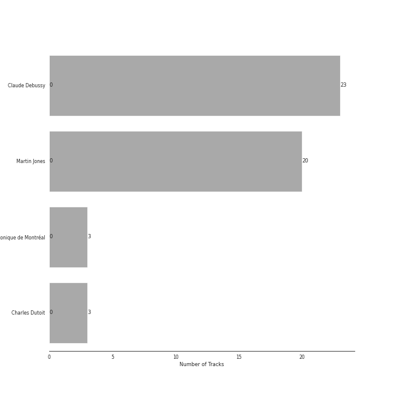

# Debussy

## Top Artists

See all artists

|   Number of Tracks | Artist                            |
|-------------------:|:----------------------------------|
|                 23 | Claude Debussy                    |
|                 20 | Martin Jones                      |
|                  3 | Orchestre Symphonique de Montréal |
|                  3 | Charles Dutoit                    |

## Tracks

| Track                                                                          | Album                                                                                                         | Artists                                                                                           | Liked   |
|:-------------------------------------------------------------------------------|:--------------------------------------------------------------------------------------------------------------|:--------------------------------------------------------------------------------------------------|:--------|
| Children's Corner, L. 113: I. Doctor Gradus ad Parnassum                       | Debussy: Clair De Lune and Other Piano Favourites                                                             | [Claude Debussy](../artists/claude_debussy.md), [Martin Jones](../artists/martin_jones.md)        |         |
| Children's Corner, L. 113: II. The Snow is Dancing                             | Debussy: Clair De Lune and Other Piano Favourites                                                             | [Claude Debussy](../artists/claude_debussy.md), [Martin Jones](../artists/martin_jones.md)        |         |
| Children's Corner, L. 113: III. Golliwogg's Cake-Walk                          | Debussy: Clair De Lune and Other Piano Favourites                                                             | [Claude Debussy](../artists/claude_debussy.md), [Martin Jones](../artists/martin_jones.md)        |         |
| Clair de Lune, L. 32                                                           | Debussy: Clair De Lune and Other Piano Favourites                                                             | [Claude Debussy](../artists/claude_debussy.md), [Martin Jones](../artists/martin_jones.md)        |         |
| Estampes, L. 100: Jardins sous La Pluie                                        | Debussy: Clair De Lune and Other Piano Favourites                                                             | [Claude Debussy](../artists/claude_debussy.md), [Martin Jones](../artists/martin_jones.md)        |         |
| Images, Set 1, L. 110: Reflets dans L'eau                                      | Debussy: Clair De Lune and Other Piano Favourites                                                             | [Claude Debussy](../artists/claude_debussy.md), [Martin Jones](../artists/martin_jones.md)        |         |
| Images, Set 2, L. 111: et la Lune descend sur le Temple qui fut                | Debussy: Clair De Lune and Other Piano Favourites                                                             | [Claude Debussy](../artists/claude_debussy.md), [Martin Jones](../artists/martin_jones.md)        |         |
| La Fille aux Cheveux de Lin, L. 33                                             | Debussy: Clair De Lune and Other Piano Favourites                                                             | [Claude Debussy](../artists/claude_debussy.md), [Martin Jones](../artists/martin_jones.md)        |         |
| La Plus que Lente, L. 121                                                      | Debussy: Clair De Lune and Other Piano Favourites                                                             | [Claude Debussy](../artists/claude_debussy.md), [Martin Jones](../artists/martin_jones.md)        |         |
| Masques, L. 105                                                                | Debussy: Clair De Lune and Other Piano Favourites                                                             | [Claude Debussy](../artists/claude_debussy.md), [Martin Jones](../artists/martin_jones.md)        |         |
| Préludes Book 1, L. 117: I. Des Pas sur La Neige                               | Debussy: Clair De Lune and Other Piano Favourites                                                             | [Claude Debussy](../artists/claude_debussy.md), [Martin Jones](../artists/martin_jones.md)        |         |
| Préludes Book 1, L. 117: II. Ce qu'a vu Le Vent d'Ouest                        | Debussy: Clair De Lune and Other Piano Favourites                                                             | [Claude Debussy](../artists/claude_debussy.md), [Martin Jones](../artists/martin_jones.md)        |         |
| Préludes Book 1, L. 117: III. La Cathedrale Engloutie                          | Debussy: Clair De Lune and Other Piano Favourites                                                             | [Claude Debussy](../artists/claude_debussy.md), [Martin Jones](../artists/martin_jones.md)        |         |
| Préludes Book 1, L. 117: IV. Minstrels                                         | Debussy: Clair De Lune and Other Piano Favourites                                                             | [Claude Debussy](../artists/claude_debussy.md), [Martin Jones](../artists/martin_jones.md)        |         |
| Préludes Book 2, L. 123: I. General Lavine                                     | Debussy: Clair De Lune and Other Piano Favourites                                                             | [Claude Debussy](../artists/claude_debussy.md), [Martin Jones](../artists/martin_jones.md)        |         |
| Préludes Book 2, L. 123: II. Canope                                            | Debussy: Clair De Lune and Other Piano Favourites                                                             | [Claude Debussy](../artists/claude_debussy.md), [Martin Jones](../artists/martin_jones.md)        |         |
| Préludes Book 2, L. 123: III. Feux d'Artifice                                  | Debussy: Clair De Lune and Other Piano Favourites                                                             | [Claude Debussy](../artists/claude_debussy.md), [Martin Jones](../artists/martin_jones.md)        |         |
| Suite Bergamasque, L. 75: Passepied                                            | Debussy: Clair De Lune and Other Piano Favourites                                                             | [Claude Debussy](../artists/claude_debussy.md), [Martin Jones](../artists/martin_jones.md)        |         |
| Études, L. 136: I. Pour les Arpeges Composes                                   | Debussy: Clair De Lune and Other Piano Favourites                                                             | [Claude Debussy](../artists/claude_debussy.md), [Martin Jones](../artists/martin_jones.md)        |         |
| Études, L. 136: II. Pour les Accords                                           | Debussy: Clair De Lune and Other Piano Favourites                                                             | [Claude Debussy](../artists/claude_debussy.md), [Martin Jones](../artists/martin_jones.md)        |         |
| La Mer, L.109: 1. From Dawn Till Noon On The Sea (De l'aube à midi sur la mer) | Debussy: La Mer; Jeux; Prélude à l'après-midi d'un faune; Le Martyre de Saint Sébastien (Symphonic Fragments) | [Claude Debussy](../artists/claude_debussy.md), Orchestre Symphonique de Montréal, Charles Dutoit |         |
| La Mer, L.109: 2. Play of the Waves (Jeux de vagues)                           | Debussy: La Mer; Jeux; Prélude à l'après-midi d'un faune; Le Martyre de Saint Sébastien (Symphonic Fragments) | [Claude Debussy](../artists/claude_debussy.md), Orchestre Symphonique de Montréal, Charles Dutoit |         |
| La Mer, L.109: 3. Dialogue Of The Wind And The Sea                             | Debussy: La Mer; Jeux; Prélude à l'après-midi d'un faune; Le Martyre de Saint Sébastien (Symphonic Fragments) | [Claude Debussy](../artists/claude_debussy.md), Orchestre Symphonique de Montréal, Charles Dutoit |         |
