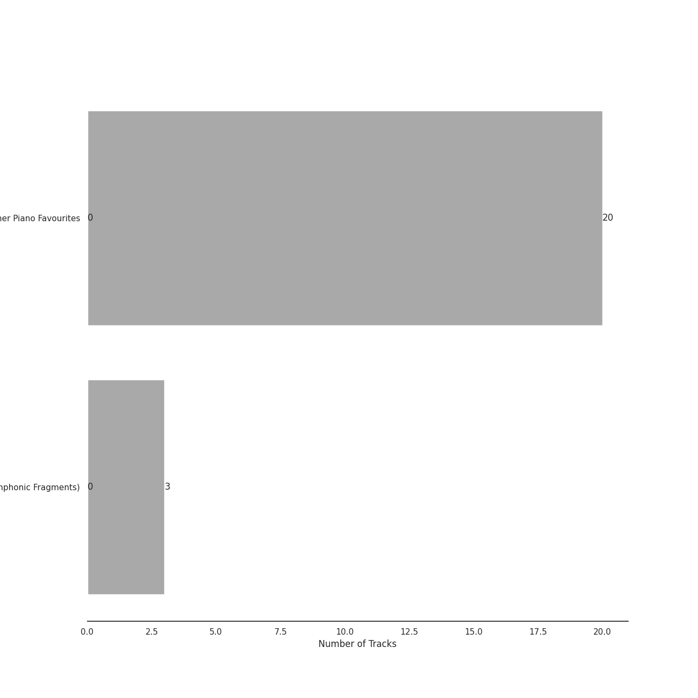

# Debussy

[23 songs](tracks.md)

## Top Artists

See all 4 artists

|   Number of Tracks | Art                                                                                              | Artist                                            | 🔗                                                           |
|-------------------:|:-------------------------------------------------------------------------------------------------|:--------------------------------------------------|:------------------------------------------------------------|
|                 23 |  | [Claude Debussy](../../artists/claude_debussy.md) | [🔗](https://open.spotify.com/artist/1Uff91EOsvd99rtAupatMP) |
|                 20 |  | [Martin Jones](../../artists/martin_jones.md)     | [🔗](https://open.spotify.com/artist/1VzJXXVXsYbEK773GWSoND) |
|                  3 |  | Orchestre Symphonique de Montréal                 | [🔗](https://open.spotify.com/artist/4AcXapei4U7xnWecv9AEBd) |
|                  3 |  | Charles Dutoit                                    | [🔗](https://open.spotify.com/artist/0Ku5VBNL7cfGXRhp2BxXEQ) |

## Top Albums

See all 2 albums

|   Number of Tracks | Art                                                                                              | Album                                                                                                         | Release Date   | 🔗                                                          |
|-------------------:|:-------------------------------------------------------------------------------------------------|:--------------------------------------------------------------------------------------------------------------|:---------------|:-----------------------------------------------------------|
|                 20 |  | Debussy: Clair De Lune and Other Piano Favourites                                                             | 1994           | [🔗](https://open.spotify.com/album/4O5tv6jrLH80bmll46xEEe) |
|                  3 |  | Debussy: La Mer; Jeux; Prélude à l'après-midi d'un faune; Le Martyre de Saint Sébastien (Symphonic Fragments) | 1989-01-01     | [🔗](https://open.spotify.com/album/5egJ0o1mVH2liUfecDWYqk) |

## Top Record Labels

See all 2 labels

|   Number of Tracks | Label                                                            |
|-------------------:|:-----------------------------------------------------------------|
|                 20 | [Nimbus Records](../../labels/nimbus_records.md)                 |
|                  3 | [Decca Music Group Ltd.](../../labels/decca_music_group_ltd_.md) |

## Genres

See all 3 genres

|   Number of Tracks | Genre                                                  |
|-------------------:|:-------------------------------------------------------|
|                 23 | [post-romantic era](../../genres/post_romantic_era.md) |
|                 23 | impressionism                                          |
|                 23 | [classical](../../genres/classical.md)                 |

## Years

| Year            |   Number of Tracks |
|:----------------|-------------------:|
| [1994](1994.md) |                 20 |

| 5 newest albums                                                                                                                                                                                                                                                                                                                                                                                                                       | 5 oldest albums                                                                                                                                                                                                                                                                                                                                                                                                                       |
|:--------------------------------------------------------------------------------------------------------------------------------------------------------------------------------------------------------------------------------------------------------------------------------------------------------------------------------------------------------------------------------------------------------------------------------------|:--------------------------------------------------------------------------------------------------------------------------------------------------------------------------------------------------------------------------------------------------------------------------------------------------------------------------------------------------------------------------------------------------------------------------------------|
| 
 Debussy: Clair De Lune and Other Piano Favourites (1994)
                                                                                                                               | 
 Debussy: La Mer; Jeux; Prélude à l'après-midi d'un faune; Le Martyre de Saint Sébastien (Symphonic Fragments) (1989-01-01)
 |
| 
 Debussy: La Mer; Jeux; Prélude à l'après-midi d'un faune; Le Martyre de Saint Sébastien (Symphonic Fragments) (1989-01-01)
 | 
 Debussy: Clair De Lune and Other Piano Favourites (1994)
                                                                                                                               |
## Audio Features

| 10 most Danceable tracks                                        | 10 least Danceable tracks                                                      |
|:----------------------------------------------------------------|:-------------------------------------------------------------------------------|
| Études, L. 136: II. Pour les Accords                            | La Mer, L.109: 1. From Dawn Till Noon On The Sea (De l'aube à midi sur la mer) |
| Children's Corner, L. 113: III. Golliwogg's Cake-Walk           | La Mer, L.109: 3. Dialogue Of The Wind And The Sea                             |
| Préludes Book 1, L. 117: IV. Minstrels                          | Children's Corner, L. 113: I. Doctor Gradus ad Parnassum                       |
| Préludes Book 1, L. 117: I. Des Pas sur La Neige                | La Mer, L.109: 2. Play of the Waves (Jeux de vagues)                           |
| Préludes Book 2, L. 123: I. General Lavine                      | La Plus que Lente, L. 121                                                      |
| Préludes Book 1, L. 117: III. La Cathedrale Engloutie           | Masques, L. 105                                                                |
| La Fille aux Cheveux de Lin, L. 33                              | Préludes Book 2, L. 123: III. Feux d'Artifice                                  |
| Suite Bergamasque, L. 75: Passepied                             | Children's Corner, L. 113: II. The Snow is Dancing                             |
| Clair de Lune, L. 32                                            | Estampes, L. 100: Jardins sous La Pluie                                        |
| Images, Set 2, L. 111: et la Lune descend sur le Temple qui fut | Images, Set 1, L. 110: Reflets dans L'eau                                      |

| 10 most Energetic tracks                                                       | 10 least Energetic tracks                                       |
|:-------------------------------------------------------------------------------|:----------------------------------------------------------------|
| La Mer, L.109: 3. Dialogue Of The Wind And The Sea                             | Préludes Book 1, L. 117: I. Des Pas sur La Neige                |
| La Mer, L.109: 2. Play of the Waves (Jeux de vagues)                           | Images, Set 2, L. 111: et la Lune descend sur le Temple qui fut |
| Préludes Book 1, L. 117: II. Ce qu'a vu Le Vent d'Ouest                        | Préludes Book 2, L. 123: II. Canope                             |
| Études, L. 136: II. Pour les Accords                                           | La Fille aux Cheveux de Lin, L. 33                              |
| La Mer, L.109: 1. From Dawn Till Noon On The Sea (De l'aube à midi sur la mer) | Préludes Book 1, L. 117: III. La Cathedrale Engloutie           |
| Children's Corner, L. 113: III. Golliwogg's Cake-Walk                          | Clair de Lune, L. 32                                            |
| Préludes Book 2, L. 123: III. Feux d'Artifice                                  | Images, Set 1, L. 110: Reflets dans L'eau                       |
| Estampes, L. 100: Jardins sous La Pluie                                        | La Plus que Lente, L. 121                                       |
| Masques, L. 105                                                                | Préludes Book 2, L. 123: I. General Lavine                      |
| Children's Corner, L. 113: I. Doctor Gradus ad Parnassum                       | Études, L. 136: I. Pour les Arpeges Composes                    |

| 10 most Speechy tracks                                          | 10 least Speechy tracks                                  |
|:----------------------------------------------------------------|:---------------------------------------------------------|
| Préludes Book 2, L. 123: II. Canope                             | Préludes Book 1, L. 117: IV. Minstrels                   |
| Études, L. 136: II. Pour les Accords                            | Suite Bergamasque, L. 75: Passepied                      |
| Images, Set 2, L. 111: et la Lune descend sur le Temple qui fut | Masques, L. 105                                          |
| La Fille aux Cheveux de Lin, L. 33                              | Études, L. 136: I. Pour les Arpeges Composes             |
| Préludes Book 1, L. 117: I. Des Pas sur La Neige                | Préludes Book 1, L. 117: II. Ce qu'a vu Le Vent d'Ouest  |
| Préludes Book 1, L. 117: III. La Cathedrale Engloutie           | Children's Corner, L. 113: II. The Snow is Dancing       |
| Children's Corner, L. 113: III. Golliwogg's Cake-Walk           | Estampes, L. 100: Jardins sous La Pluie                  |
| La Plus que Lente, L. 121                                       | Clair de Lune, L. 32                                     |
| La Mer, L.109: 2. Play of the Waves (Jeux de vagues)            | La Mer, L.109: 3. Dialogue Of The Wind And The Sea       |
| Préludes Book 2, L. 123: I. General Lavine                      | Children's Corner, L. 113: I. Doctor Gradus ad Parnassum |

| 10 most Acoustic tracks                                  | 10 least Acoustic tracks                                                       |
|:---------------------------------------------------------|:-------------------------------------------------------------------------------|
| La Fille aux Cheveux de Lin, L. 33                       | La Mer, L.109: 3. Dialogue Of The Wind And The Sea                             |
| La Plus que Lente, L. 121                                | La Mer, L.109: 1. From Dawn Till Noon On The Sea (De l'aube à midi sur la mer) |
| Études, L. 136: I. Pour les Arpeges Composes             | La Mer, L.109: 2. Play of the Waves (Jeux de vagues)                           |
| Clair de Lune, L. 32                                     | Préludes Book 1, L. 117: I. Des Pas sur La Neige                               |
| Études, L. 136: II. Pour les Accords                     | Images, Set 2, L. 111: et la Lune descend sur le Temple qui fut                |
| Children's Corner, L. 113: I. Doctor Gradus ad Parnassum | Préludes Book 1, L. 117: III. La Cathedrale Engloutie                          |
| Suite Bergamasque, L. 75: Passepied                      | Préludes Book 2, L. 123: II. Canope                                            |
| Préludes Book 1, L. 117: IV. Minstrels                   | Préludes Book 2, L. 123: III. Feux d'Artifice                                  |
| Children's Corner, L. 113: III. Golliwogg's Cake-Walk    | Préludes Book 1, L. 117: II. Ce qu'a vu Le Vent d'Ouest                        |
| Children's Corner, L. 113: II. The Snow is Dancing       | Images, Set 1, L. 110: Reflets dans L'eau                                      |

| 10 most Instrumental tracks                              | 10 least Instrumental tracks                                                   |
|:---------------------------------------------------------|:-------------------------------------------------------------------------------|
| Estampes, L. 100: Jardins sous La Pluie                  | Préludes Book 2, L. 123: III. Feux d'Artifice                                  |
| Children's Corner, L. 113: I. Doctor Gradus ad Parnassum | Images, Set 2, L. 111: et la Lune descend sur le Temple qui fut                |
| Études, L. 136: I. Pour les Arpeges Composes             | Images, Set 1, L. 110: Reflets dans L'eau                                      |
| La Fille aux Cheveux de Lin, L. 33                       | Études, L. 136: II. Pour les Accords                                           |
| Préludes Book 2, L. 123: II. Canope                      | La Plus que Lente, L. 121                                                      |
| Children's Corner, L. 113: II. The Snow is Dancing       | La Mer, L.109: 1. From Dawn Till Noon On The Sea (De l'aube à midi sur la mer) |
| Préludes Book 1, L. 117: IV. Minstrels                   | La Mer, L.109: 2. Play of the Waves (Jeux de vagues)                           |
| Préludes Book 1, L. 117: III. La Cathedrale Engloutie    | Masques, L. 105                                                                |
| Préludes Book 1, L. 117: II. Ce qu'a vu Le Vent d'Ouest  | Préludes Book 2, L. 123: I. General Lavine                                     |
| Clair de Lune, L. 32                                     | Préludes Book 1, L. 117: I. Des Pas sur La Neige                               |

| 10 most Live tracks                                                            | 10 least Live tracks                                            |
|:-------------------------------------------------------------------------------|:----------------------------------------------------------------|
| Children's Corner, L. 113: III. Golliwogg's Cake-Walk                          | Préludes Book 2, L. 123: II. Canope                             |
| Préludes Book 2, L. 123: I. General Lavine                                     | Préludes Book 1, L. 117: I. Des Pas sur La Neige                |
| Préludes Book 1, L. 117: II. Ce qu'a vu Le Vent d'Ouest                        | Images, Set 2, L. 111: et la Lune descend sur le Temple qui fut |
| Images, Set 1, L. 110: Reflets dans L'eau                                      | Études, L. 136: II. Pour les Accords                            |
| La Mer, L.109: 1. From Dawn Till Noon On The Sea (De l'aube à midi sur la mer) | Clair de Lune, L. 32                                            |
| Estampes, L. 100: Jardins sous La Pluie                                        | Préludes Book 1, L. 117: III. La Cathedrale Engloutie           |
| La Mer, L.109: 2. Play of the Waves (Jeux de vagues)                           | La Fille aux Cheveux de Lin, L. 33                              |
| La Plus que Lente, L. 121                                                      | Préludes Book 2, L. 123: III. Feux d'Artifice                   |
| Children's Corner, L. 113: I. Doctor Gradus ad Parnassum                       | Préludes Book 1, L. 117: IV. Minstrels                          |
| Suite Bergamasque, L. 75: Passepied                                            | Études, L. 136: I. Pour les Arpeges Composes                    |

| 10 most Happy tracks                                     | 10 least Happy tracks                                                          |
|:---------------------------------------------------------|:-------------------------------------------------------------------------------|
| Children's Corner, L. 113: III. Golliwogg's Cake-Walk    | Préludes Book 2, L. 123: III. Feux d'Artifice                                  |
| Préludes Book 2, L. 123: I. General Lavine               | Images, Set 1, L. 110: Reflets dans L'eau                                      |
| Préludes Book 1, L. 117: IV. Minstrels                   | Préludes Book 1, L. 117: II. Ce qu'a vu Le Vent d'Ouest                        |
| Suite Bergamasque, L. 75: Passepied                      | La Mer, L.109: 3. Dialogue Of The Wind And The Sea                             |
| La Fille aux Cheveux de Lin, L. 33                       | Masques, L. 105                                                                |
| Children's Corner, L. 113: II. The Snow is Dancing       | La Mer, L.109: 1. From Dawn Till Noon On The Sea (De l'aube à midi sur la mer) |
| Préludes Book 1, L. 117: I. Des Pas sur La Neige         | La Mer, L.109: 2. Play of the Waves (Jeux de vagues)                           |
| La Plus que Lente, L. 121                                | Études, L. 136: II. Pour les Accords                                           |
| Children's Corner, L. 113: I. Doctor Gradus ad Parnassum | Préludes Book 1, L. 117: III. La Cathedrale Engloutie                          |
| Études, L. 136: I. Pour les Arpeges Composes             | Clair de Lune, L. 32                                                           |
