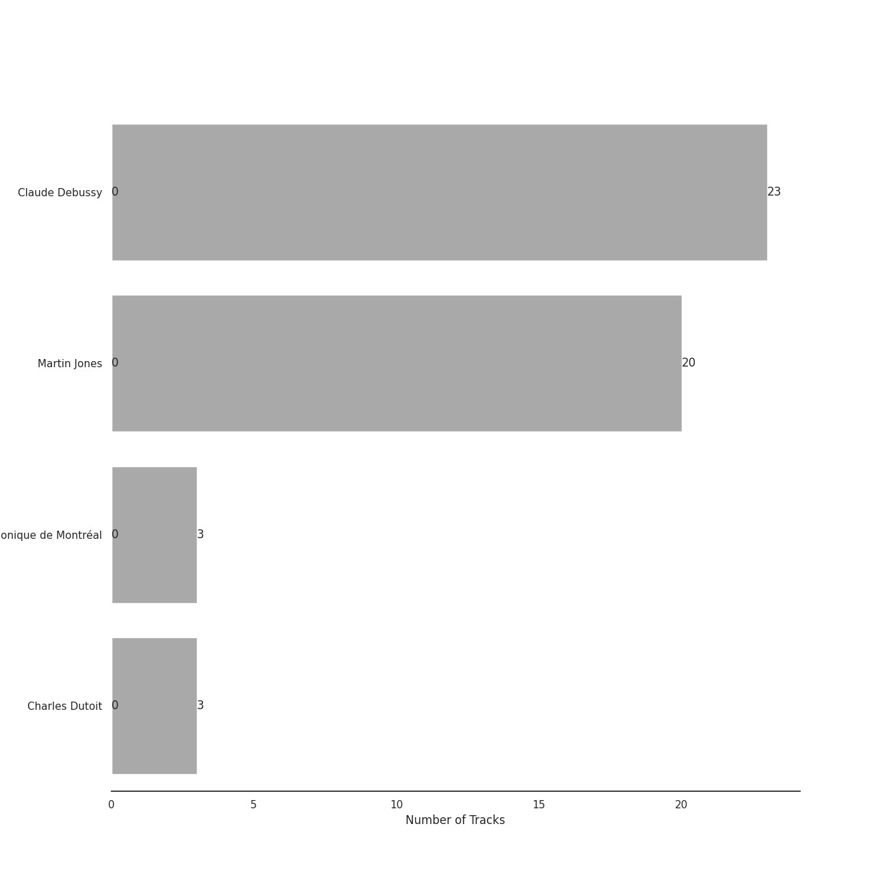

# Debussy

[23 tracks (0 liked) 🔗](https://open.spotify.com/playlist/3bJkc96LYMneTHBCS80BAl)

[See Track Features](audio_features.md)

[See Clusters](clusters/overview.md)

## Top Artists

| Art | Tracks | 💚 | Artist | 🔗 |
|:---|---:|---:|:---|:---|
|  | 23 | 0 | Claude Debussy | [🔗](https://open.spotify.com/artist/1Uff91EOsvd99rtAupatMP) |
|  | 20 | 0 | Martin Jones | [🔗](https://open.spotify.com/artist/1VzJXXVXsYbEK773GWSoND) |
|  | 3 | 0 | Orchestre Symphonique de Montréal | [🔗](https://open.spotify.com/artist/4AcXapei4U7xnWecv9AEBd) |
|  | 3 | 0 | Charles Dutoit | [🔗](https://open.spotify.com/artist/0Ku5VBNL7cfGXRhp2BxXEQ) |

## Top Albums

| Art | Tracks | 💚 | Album | Release Date | 🔗 |
|:---|---:|---:|:---|:---|:---|
|  | 20 | 0 | Debussy: Clair De Lune and Other Piano Favourites | 1994 | [🔗](https://open.spotify.com/album/4O5tv6jrLH80bmll46xEEe) |
|  | 3 | 0 | Debussy: La Mer; Jeux; Prélude à l'après-midi d'un faune; Le Martyre de Saint Sébastien (Symphonic Fragments) | 1989-01-01 | [🔗](https://open.spotify.com/album/5egJ0o1mVH2liUfecDWYqk) |

## Top Record Labels

| Tracks | 💚 | Label |
|---:|---:|:---|
| 20 | 0 | [Nimbus Records](../../labels/nimbus_records/overview.md) |
| 3 | 0 | [Decca Music Group Ltd.](../../labels/decca_music_group_ltd_/overview.md) |

## Genres

| Tracks | 💚 | Genre |
|---:|---:|:---|
| 23 | 0 | [post-romantic era](../../genres/post-romantic_era/overview.md) |
| 23 | 0 | impressionism |
| 23 | 0 | [classical](../../genres/classical/overview.md) |

## Years

View all years

| Year | Number of Tracks |
|:---|---:|
| [1994](1994.md) | 20 |
| 1989 | 3 |

| ​ | 5 newest albums | ​​ | 5 oldest albums |
|:---|:---|:---|:---|
|  | Debussy: Clair De Lune and Other Piano Favourites (1994) |  | Debussy: La Mer; Jeux; Prélude à l'après-midi d'un faune; Le Martyre de Saint Sébastien (Symphonic Fragments) (1989-01-01) |
|  | Debussy: La Mer; Jeux; Prélude à l'après-midi d'un faune; Le Martyre de Saint Sébastien (Symphonic Fragments) (1989-01-01) |  | Debussy: Clair De Lune and Other Piano Favourites (1994) |