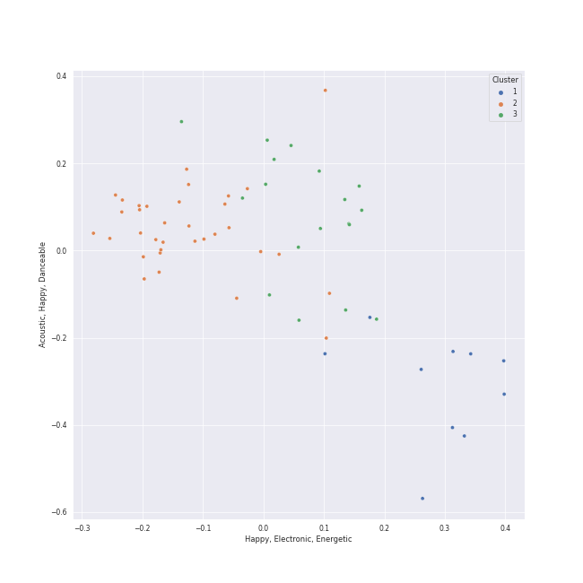

# Clusters in Disney

## Cluster #1

9 tracks

| Art | Track | Album | Artists | Label | Rank | 💚 | 🔗 |
|:---|:---|:---|:---|:---|---:|:---|:---|
|  | When Will My Life Begin? - From "Tangled" / Soundtrack Version | Tangled | Mandy Moore | [Walt Disney Records](../../../../labels/walt_disney_records) | 838 | | [🔗](https://open.spotify.com/track/03xWMkKEbeO4SnylA53ipj) |
|  | Circle of Life | The Lion King | Carmen Twillie, Lebo M. | [Walt Disney Records](../../../../labels/walt_disney_records) | 838 | | [🔗](https://open.spotify.com/track/0HU5JnVaKNTWf6GykV9Zn8) |
|  | I Just Can't Wait to Be King | The Lion King | Jason Weaver, Rowan Atkinson, Laura Williams | [Walt Disney Records](../../../../labels/walt_disney_records) | 838 | | [🔗](https://open.spotify.com/track/0qxtQ8rf3W1nId3D2r0xH4) |
|  | Be Prepared | The Lion King | Jeremy Irons, Whoopi Goldberg, Cheech Marin, Jim Cummings | [Walt Disney Records](../../../../labels/walt_disney_records) | 838 | | [🔗](https://open.spotify.com/track/34nxgXFCPzDphUJGuRsn10) |
|  | Love Is an Open Door - From "Frozen"/Soundtrack Version | Frozen (Original Motion Picture Soundtrack / Deluxe Edition) | Kristen Bell, Santino Fontana | [Walt Disney Records](../../../../labels/walt_disney_records) | 838 | | [🔗](https://open.spotify.com/track/3IPnBzGRMg6BfViFxxa0Gq) |
|  | The Scuttlebutt | The Little Mermaid (Original Motion Picture Soundtrack) | Awkwafina, Daveed Diggs, Disney | [Walt Disney Records](../../../../labels/walt_disney_records) | 838 | | [🔗](https://open.spotify.com/track/2wLDS3oCMufFrvwN2IK3Bt) |
|  | One Jump Ahead | Aladdin Special Edition | Brad Kane, Disney | [Walt Disney Records](../../../../labels/walt_disney_records) | 838 | | [🔗](https://open.spotify.com/track/69ZNzwrCGP6h5ewkJQWWaT) |
|  | I Just Can't Wait to Be King | The Lion King (Original Motion Picture Soundtrack) | JD McCrary, Shahadi Wright Joseph, John Oliver | [Walt Disney Records](../../../../labels/walt_disney_records) | 838 | | [🔗](https://open.spotify.com/track/2xUdYfY3LpJb4Iv37RypnO) |
|  | I'll Make a Man Out of You | Mulan (Original Soundtrack) | Donny Osmond, Chorus - Mulan, Disney | [Walt Disney Records](../../../../labels/walt_disney_records) | 838 | | [🔗](https://open.spotify.com/track/28UMEtwyUUy5u0UWOVHwiI) |
## Cluster #2

31 tracks

| Art | Track | Album | Artists | Label | Rank | 💚 | 🔗 |
|:---|:---|:---|:---|:---|---:|:---|:---|
|  | I See the Light - From "Tangled" / Soundtrack Version | Tangled | Mandy Moore, Zachary Levi | [Walt Disney Records](../../../../labels/walt_disney_records) | 838 | | [🔗](https://open.spotify.com/track/6klpXs2uAjagnZMFkt4qkl) |
|  | Part of Your World | The Little Mermaid Special Edition | Jodi Benson, Disney | [Walt Disney Records](../../../../labels/walt_disney_records) | 838 | | [🔗](https://open.spotify.com/track/7tUSJY4nsDBJTjd1UXKRsT) |
|  | Go the Distance | Hercules (Original Motion Picture Soundtrack) | Roger Bart, Disney | [Walt Disney Records](../../../../labels/walt_disney_records) | 838 | | [🔗](https://open.spotify.com/track/0D1OY0M5A0qD5HGBvFmFid) |
|  | Beauty and the Beast | Beauty and the Beast | Angela Lansbury, Disney | [Walt Disney Records](../../../../labels/walt_disney_records) | 838 | | [🔗](https://open.spotify.com/track/2rJFFUEl1LURkV0b0OARXx) |
|  | Colors of the Wind | Pocahontas | Judy Kuhn | [Walt Disney Records](../../../../labels/walt_disney_records) | 838 | | [🔗](https://open.spotify.com/track/1OYOLWqKmhkFIx2KC9ek1a) |
|  | Just Around the Riverbend | Pocahontas | Judy Kuhn | [Walt Disney Records](../../../../labels/walt_disney_records) | 838 | | [🔗](https://open.spotify.com/track/6P316E7tFylzpVrDrXVF9s) |
|  | Do You Want to Build a Snowman? - From "Frozen"/Soundtrack Version | Frozen (Original Motion Picture Soundtrack / Deluxe Edition) | Kristen Bell, Agatha Lee Monn, Katie Lopez | [Walt Disney Records](../../../../labels/walt_disney_records) | 838 | | [🔗](https://open.spotify.com/track/2yi7HZrBOC4bMUSTcs4VK6) |
|  | A Whole New World | Aladdin Special Edition | Lea Salonga, Brad Kane, Disney | [Walt Disney Records](../../../../labels/walt_disney_records) | 838 | | [🔗](https://open.spotify.com/track/1hwdPQtFHISvZ9SXMkNrIK) |
|  | The Bells of Notre Dame | The Hunchback Of Notre Dame (Original Motion Picture Soundtrack) | David Ogden Stiers, Tony Jay, Paul Kandel, Chorus - The Hunchback Of Notre Dame | [Walt Disney Records](../../../../labels/walt_disney_records) | 838 | | [🔗](https://open.spotify.com/track/47Wo2LeGbzdZTdEFNRZXV0) |
|  | Out There | The Hunchback Of Notre Dame (Original Motion Picture Soundtrack) | Tony Jay, Tom Hulce | [Walt Disney Records](../../../../labels/walt_disney_records) | 838 | | [🔗](https://open.spotify.com/track/7cX2nwvVfWW3bfScg2f15K) |
## Cluster #3

21 tracks

| Art | Track | Album | Artists | Label | Rank | 💚 | 🔗 |
|:---|:---|:---|:---|:---|---:|:---|:---|
|  | Kiss the Girl | The Little Mermaid Special Edition | Samuel E. Wright, Disney | [Walt Disney Records](../../../../labels/walt_disney_records) | 838 | | [🔗](https://open.spotify.com/track/4HGIPyqDxSf863tPOwXiLJ) |
|  | Under the Sea | The Little Mermaid Special Edition | Samuel E. Wright, Disney | [Walt Disney Records](../../../../labels/walt_disney_records) | 838 | | [🔗](https://open.spotify.com/track/6oYkwjI1TKP9D0Y9II1GT7) |
|  | Hakuna Matata | The Lion King | Nathan Lane, Ernie Sabella, Jason Weaver, Joseph Williams | [Walt Disney Records](../../../../labels/walt_disney_records) | 838 | | [🔗](https://open.spotify.com/track/5k3U0OGYBccHdKJJu3HrUN) |
|  | Gaston | Beauty and the Beast | Richard White, Jesse Corti, Chorus - Beauty And the Beast, Disney | [Walt Disney Records](../../../../labels/walt_disney_records) | 838 | | [🔗](https://open.spotify.com/track/0zstgBrV1t1g6n4jHrUVBY) |
|  | Be Our Guest | Beauty and the Beast | Angela Lansbury, Jerry Orbach, Chorus - Beauty And the Beast, Disney | [Walt Disney Records](../../../../labels/walt_disney_records) | 838 | | [🔗](https://open.spotify.com/track/6btdYzQ8eZFBrOlUKVHuz0) |
|  | Something There | Beauty and the Beast | Robby Benson, Jerry Orbach, Paige O'Hara, Angela Lansbury, David Ogden Stiers, Disney | [Walt Disney Records](../../../../labels/walt_disney_records) | 838 | | [🔗](https://open.spotify.com/track/6mDxu0xwhv5tn1oMTNUypu) |
|  | Down in New Orleans | The Princess and the Frog (Original Motion Picture Soundtrack) | Dr. John | [Walt Disney Records](../../../../labels/walt_disney_records) | 838 | | [🔗](https://open.spotify.com/track/4tCdoXt7EiwZZhMevxmY8u) |
|  | A Girl Worth Fighting For | Mulan (Original Soundtrack) | Lea Salonga, Harvey Fierstein, Matthew Wilder, James Hong, Jerry Tondo, Disney | [Walt Disney Records](../../../../labels/walt_disney_records) | 838 | | [🔗](https://open.spotify.com/track/3wjgPeXocinhLyPL37p70e) |
|  | Prince Ali | Aladdin Special Edition | Robin Williams, Disney | [Walt Disney Records](../../../../labels/walt_disney_records) | 838 | | [🔗](https://open.spotify.com/track/2n2ikq6Y21aFrootCsdsf3) |
|  | I Wan'na Be Like You (The Monkey Song) | The Jungle Book | Louis Prima, Phil Harris, Bruce Reitherman | [Walt Disney Records](../../../../labels/walt_disney_records) | 838 | | [🔗](https://open.spotify.com/track/2EeVPGHq2I7fjeDfT6LEYX) |